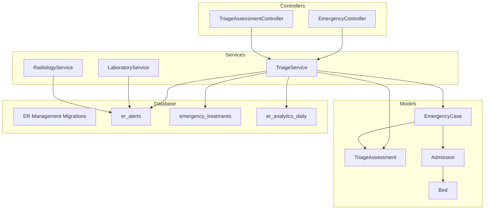
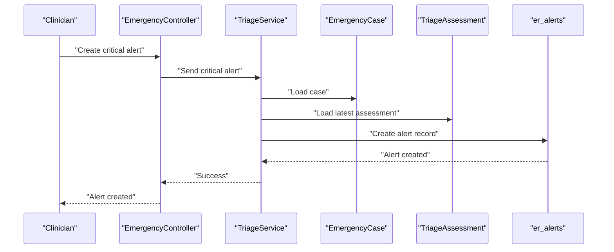
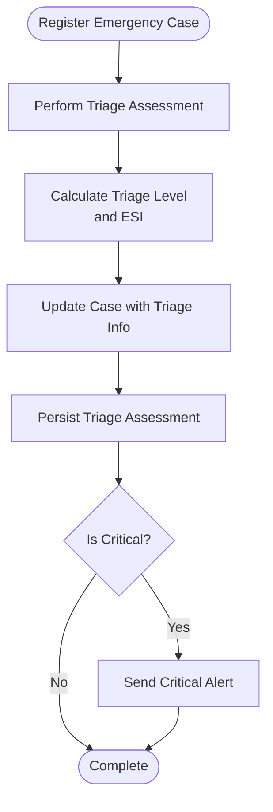
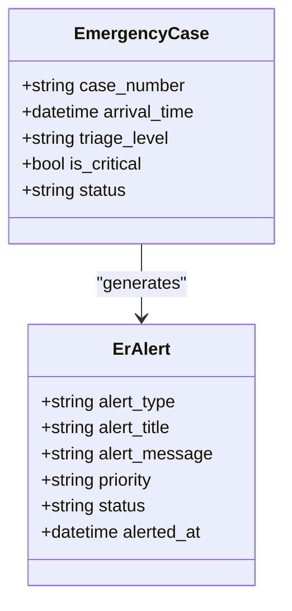
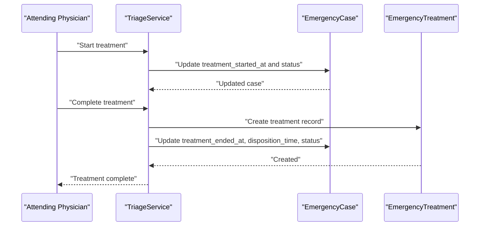
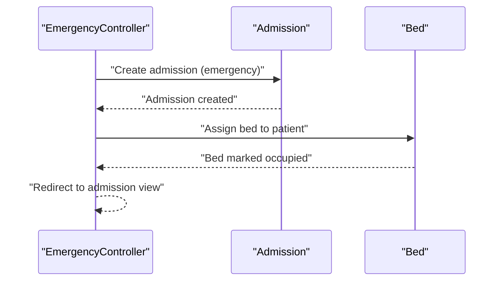
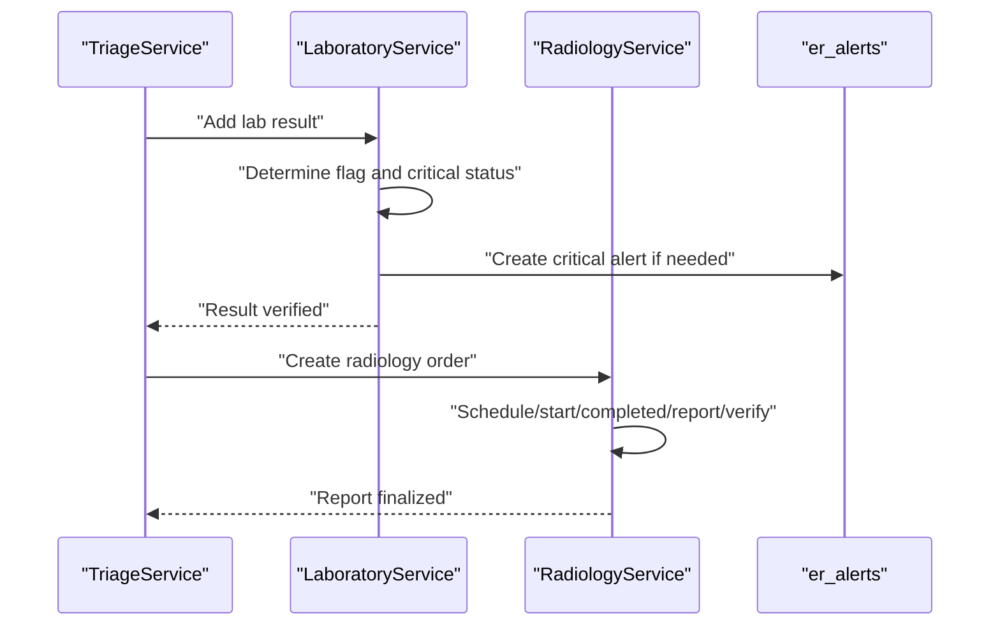
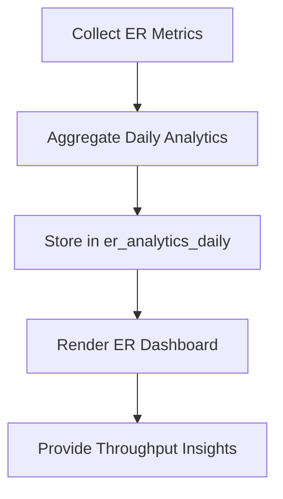
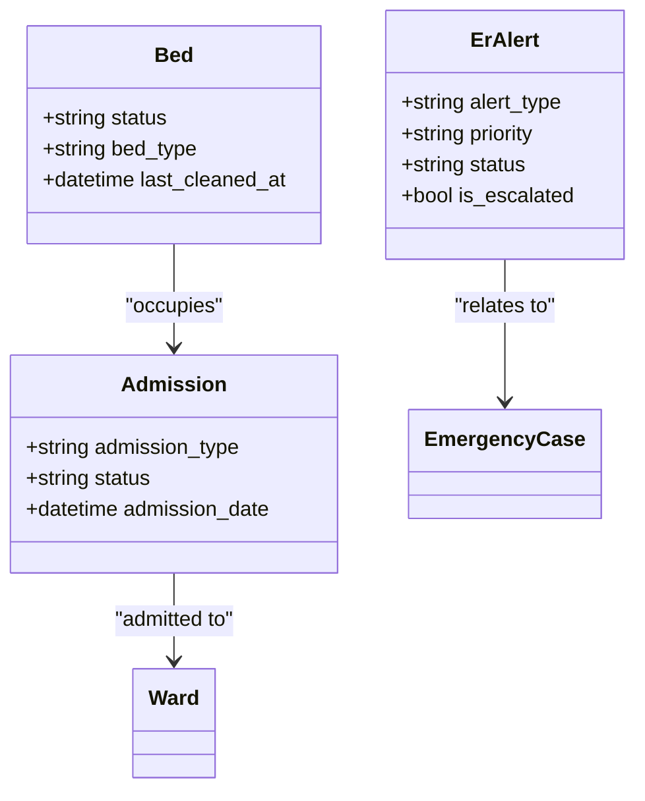
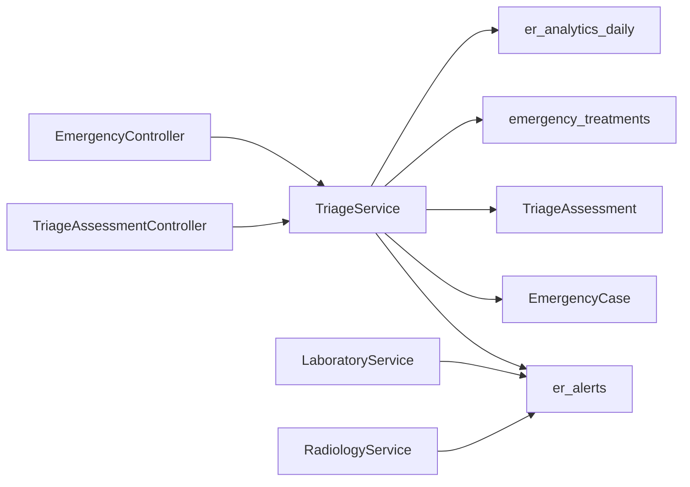

# Emergency Department Operations

<cite>
**Referenced Files in This Document**
- [EmergencyController.php](file://app/Http/Controllers/Healthcare/EmergencyController.php)
- [TriageAssessmentController.php](file://app/Http/Controllers/Healthcare/TriageAssessmentController.php)
- [TriageService.php](file://app/Services/TriageService.php)
- [EmergencyCase.php](file://app/Models/EmergencyCase.php)
- [TriageAssessment.php](file://app/Models/TriageAssessment.php)
- [Admission.php](file://app/Models/Admission.php)
- [Bed.php](file://app/Models/Bed.php)
- [create_er_management_tables.php](file://database/migrations/2026_04_08_500001_create_er_management_tables.php)
- [LaboratoryService.php](file://app/Services/LaboratoryService.php)
- [RadiologyService.php](file://app/Services/RadiologyService.php)
- [hospital_analytics_service.php](file://app/Services/HospitalAnalyticsService.php)
- [healthcare.php](file://routes/healthcare.php)
- [dashboard.blade.php](file://resources/views/healthcare/er/dashboard.blade.php)
</cite>

## Table of Contents
1. [Introduction](#introduction)
2. [Project Structure](#project-structure)
3. [Core Components](#core-components)
4. [Architecture Overview](#architecture-overview)
5. [Detailed Component Analysis](#detailed-component-analysis)
6. [Dependency Analysis](#dependency-analysis)
7. [Performance Considerations](#performance-considerations)
8. [Troubleshooting Guide](#troubleshooting-guide)
9. [Conclusion](#conclusion)
10. [Appendices](#appendices)

## Introduction
This document describes emergency department operations and trauma care workflows implemented in the system. It covers patient triage protocols, emergency code activation, rapid assessment workflows, integration with emergency medical services, trauma bay management, critical care monitoring, emergency admissions, diagnostic imaging prioritization, surgical consultations, transfer coordination, hospital information system integration, rapid result reporting, emergency alert systems, specialized equipment tracking, bed management, discharge planning, disaster preparedness, and emergency resource allocation.

## Project Structure
The emergency operations are centered around dedicated controllers, services, and models, with supporting database migrations and views. Key components include:
- Emergency and triage controllers for user-facing workflows
- TriageService orchestrating triage, treatment, and alerting
- Models for emergency cases, triage assessments, admissions, and beds
- Migrations defining ER-specific tables (emergency cases, triage assessments, emergency treatments, ER alerts, ER analytics)
- Laboratory and Radiology services for rapid diagnostics
- Bed management and admission workflows
- ER dashboard and analytics

**Diagram sources**
- [EmergencyController.php:11-189](file://app/Http/Controllers/Healthcare/EmergencyController.php#L11-L189)
- [TriageAssessmentController.php:11-228](file://app/Http/Controllers/Healthcare/TriageAssessmentController.php#L11-L228)
- [TriageService.php:13-487](file://app/Services/TriageService.php#L13-L487)
- [EmergencyCase.php:9-291](file://app/Models/EmergencyCase.php#L9-L291)
- [TriageAssessment.php:9-298](file://app/Models/TriageAssessment.php#L9-L298)
- [Admission.php:10-284](file://app/Models/Admission.php#L10-L284)
- [Bed.php:9-195](file://app/Models/Bed.php#L9-L195)
- [create_er_management_tables.php:116-288](file://database/migrations/2026_04_08_500001_create_er_management_tables.php#L116-L288)

**Section sources**
- [EmergencyController.php:11-189](file://app/Http/Controllers/Healthcare/EmergencyController.php#L11-L189)
- [TriageAssessmentController.php:11-228](file://app/Http/Controllers/Healthcare/TriageAssessmentController.php#L11-L228)
- [TriageService.php:13-487](file://app/Services/TriageService.php#L13-L487)
- [create_er_management_tables.php:116-288](file://database/migrations/2026_04_08_500001_create_er_management_tables.php#L116-L288)

## Core Components
- EmergencyCase: Tracks arrival, triage, treatment, and disposition with time metrics and status.
- TriageAssessment: Captures vital signs, chief complaint, urgency, and recommendations; supports ESI calculation.
- EmergencyTreatments: Records interventions, outcomes, dispositions, and follow-up.
- ER Alerts: Manages critical alerts for critical patients, bed availability, and equipment needs.
- ER Analytics Daily: Aggregates daily ER metrics for reporting and dashboards.
- Admission and Bed: Manage inpatient transitions, bed occupancy, and transfers.
- TriageService: Orchestrates registration, triage assessment, treatment initiation/completion, and alert generation.
- EmergencyController and TriageAssessmentController: Provide UI and API endpoints for ER operations.
- LaboratoryService and RadiologyService: Enable rapid diagnostics with critical result escalation and reporting.

**Section sources**
- [EmergencyCase.php:13-291](file://app/Models/EmergencyCase.php#L13-L291)
- [TriageAssessment.php:13-298](file://app/Models/TriageAssessment.php#L13-L298)
- [create_er_management_tables.php:116-230](file://database/migrations/2026_04_08_500001_create_er_management_tables.php#L116-L230)
- [Admission.php:14-284](file://app/Models/Admission.php#L14-L284)
- [Bed.php:13-195](file://app/Models/Bed.php#L13-L195)
- [TriageService.php:18-487](file://app/Services/TriageService.php#L18-L487)
- [EmergencyController.php:16-189](file://app/Http/Controllers/Healthcare/EmergencyController.php#L16-L189)
- [TriageAssessmentController.php:66-228](file://app/Http/Controllers/Healthcare/TriageAssessmentController.php#L66-L228)
- [LaboratoryService.php:96-152](file://app/Services/LaboratoryService.php#L96-L152)
- [RadiologyService.php:18-170](file://app/Services/RadiologyService.php#L18-L170)

## Architecture Overview
The system implements a service-layer architecture for ER operations:
- Controllers handle requests and delegate to services for business logic.
- Services encapsulate triage, treatment, alerting, and analytics.
- Models define domain entities and relationships.
- Migrations define ER-specific tables and indices for performance.
- Views render dashboards and queues.

**Diagram sources**
- [EmergencyController.php:93-106](file://app/Http/Controllers/Healthcare/EmergencyController.php#L93-L106)
- [TriageService.php:253-267](file://app/Services/TriageService.php#L253-L267)
- [create_er_management_tables.php:199-230](file://database/migrations/2026_04_08_500001_create_er_management_tables.php#L199-L230)

**Section sources**
- [EmergencyController.php:93-106](file://app/Http/Controllers/Healthcare/EmergencyController.php#L93-L106)
- [TriageService.php:253-267](file://app/Services/TriageService.php#L253-L267)
- [create_er_management_tables.php:199-230](file://database/migrations/2026_04_08_500001_create_er_management_tables.php#L199-L230)

## Detailed Component Analysis

### Triage Protocols and Rapid Assessment
- Registration: New emergency cases are registered with arrival time and basic details.
- Assessment: TriageService calculates triage level and ESI, updates case, and persists assessment with vitals and recommendations.
- Urgency mapping: Maps triage levels to urgency categories for resource allocation.
- Critical alerts: Automatically creates ER alerts for critical cases.

**Diagram sources**
- [TriageService.php:18-108](file://app/Services/TriageService.php#L18-L108)
- [TriageService.php:113-164](file://app/Services/TriageService.php#L113-L164)
- [TriageService.php:253-267](file://app/Services/TriageService.php#L253-L267)

**Section sources**
- [TriageService.php:18-108](file://app/Services/TriageService.php#L18-L108)
- [TriageService.php:113-164](file://app/Services/TriageService.php#L113-L164)
- [TriageService.php:253-267](file://app/Services/TriageService.php#L253-L267)

### Emergency Code Activation and Critical Care Monitoring
- ER Alerts table captures critical events with priority and status.
- Automatic alert creation for critical triage cases.
- Dashboard displays active alerts and critical patients.

**Diagram sources**
- [EmergencyCase.php:13-57](file://app/Models/EmergencyCase.php#L13-L57)
- [create_er_management_tables.php:199-230](file://database/migrations/2026_04_08_500001_create_er_management_tables.php#L199-L230)

**Section sources**
- [create_er_management_tables.php:199-230](file://database/migrations/2026_04_08_500001_create_er_management_tables.php#L199-L230)
- [EmergencyCase.php:265-271](file://app/Models/EmergencyCase.php#L265-L271)
- [dashboard.blade.php:88-112](file://resources/views/healthcare/er/dashboard.blade.php#L88-L112)

### Trauma Bay Management and Treatment Workflows
- Treatment initiation records provider and timing metrics.
- Treatment completion captures outcomes, dispositions, and follow-up.
- Disposition mapping updates case status accordingly.

**Diagram sources**
- [TriageService.php:169-247](file://app/Services/TriageService.php#L169-L247)
- [EmergencyCase.php:245-260](file://app/Models/EmergencyCase.php#L245-L260)
- [create_er_management_tables.php:142-196](file://database/migrations/2026_04_08_500001_create_er_management_tables.php#L142-L196)

**Section sources**
- [TriageService.php:169-247](file://app/Services/TriageService.php#L169-L247)
- [EmergencyCase.php:245-260](file://app/Models/EmergencyCase.php#L245-L260)
- [create_er_management_tables.php:142-196](file://database/migrations/2026_04_08_500001_create_er_management_tables.php#L142-L196)

### Emergency Admissions and Bed Management
- Admission creation upon ER disposition to inpatient.
- Bed assignment and release with cleaning tracking.
- Transfer between wards/beds with bed state updates.

**Diagram sources**
- [EmergencyController.php:159-187](file://app/Http/Controllers/Healthcare/EmergencyController.php#L159-L187)
- [Admission.php:210-233](file://app/Models/Admission.php#L210-L233)
- [Bed.php:144-165](file://app/Models/Bed.php#L144-L165)

**Section sources**
- [EmergencyController.php:159-187](file://app/Http/Controllers/Healthcare/EmergencyController.php#L159-L187)
- [Admission.php:210-233](file://app/Models/Admission.php#L210-L233)
- [Bed.php:144-165](file://app/Models/Bed.php#L144-L165)

### Diagnostic Imaging and Laboratory Integration
- LaboratoryService manages sample collection, processing, result entry, verification, and critical value escalation.
- RadiologyService handles orders, scheduling, exams, reporting, and verification.
- Both services integrate with ER alerts for critical results.

**Diagram sources**
- [TriageService.php:194-247](file://app/Services/TriageService.php#L194-L247)
- [LaboratoryService.php:96-152](file://app/Services/LaboratoryService.php#L96-L152)
- [RadiologyService.php:18-170](file://app/Services/RadiologyService.php#L18-L170)
- [create_er_management_tables.php:199-230](file://database/migrations/2026_04_08_500001_create_er_management_tables.php#L199-L230)

**Section sources**
- [LaboratoryService.php:96-152](file://app/Services/LaboratoryService.php#L96-L152)
- [RadiologyService.php:18-170](file://app/Services/RadiologyService.php#L18-L170)
- [TriageService.php:194-247](file://app/Services/TriageService.php#L194-L247)

### ER Dashboard and Analytics
- ER dashboard aggregates active cases, critical counts, triage distributions, and average wait times.
- Daily analytics capture arrivals, dispositions, outcomes, and throughput metrics.
- Throughput metrics compute admission/discharge rates and mortality.

**Diagram sources**
- [TriageService.php:272-350](file://app/Services/TriageService.php#L272-L350)
- [create_er_management_tables.php:233-274](file://database/migrations/2026_04_08_500001_create_er_management_tables.php#L233-L274)

**Section sources**
- [TriageService.php:272-350](file://app/Services/TriageService.php#L272-L350)
- [create_er_management_tables.php:233-274](file://database/migrations/2026_04_08_500001_create_er_management_tables.php#L233-L274)

### Disaster Preparedness and Resource Allocation
- ER Alerts support escalation tracking and status management.
- ER Analytics Daily captures hourly distributions and common complaints for surge capacity planning.
- Bed and admission models support surge bed management and transfers.

**Diagram sources**
- [create_er_management_tables.php:199-230](file://database/migrations/2026_04_08_500001_create_er_management_tables.php#L199-L230)
- [Bed.php:37-177](file://app/Models/Bed.php#L37-L177)
- [Admission.php:138-173](file://app/Models/Admission.php#L138-L173)

**Section sources**
- [create_er_management_tables.php:199-230](file://database/migrations/2026_04_08_500001_create_er_management_tables.php#L199-L230)
- [Bed.php:37-177](file://app/Models/Bed.php#L37-L177)
- [Admission.php:138-173](file://app/Models/Admission.php#L138-L173)

## Dependency Analysis
- Controllers depend on Services for business logic.
- Services depend on Models and database tables.
- ER-specific tables are indexed for performance on frequent queries (case_id, triage_level, status, alert_type, priority).
- Laboratory and Radiology services integrate with ER alerts for critical results.

**Diagram sources**
- [EmergencyController.php:11-189](file://app/Http/Controllers/Healthcare/EmergencyController.php#L11-L189)
- [TriageAssessmentController.php:11-228](file://app/Http/Controllers/Healthcare/TriageAssessmentController.php#L11-L228)
- [TriageService.php:13-487](file://app/Services/TriageService.php#L13-L487)
- [create_er_management_tables.php:116-288](file://database/migrations/2026_04_08_500001_create_er_management_tables.php#L116-L288)

**Section sources**
- [EmergencyController.php:11-189](file://app/Http/Controllers/Healthcare/EmergencyController.php#L11-L189)
- [TriageAssessmentController.php:11-228](file://app/Http/Controllers/Healthcare/TriageAssessmentController.php#L11-L228)
- [TriageService.php:13-487](file://app/Services/TriageService.php#L13-L487)
- [create_er_management_tables.php:116-288](file://database/migrations/2026_04_08_500001_create_er_management_tables.php#L116-L288)

## Performance Considerations
- Indexed ER tables improve query performance for active cases, triage distributions, and alert filtering.
- Throughput metrics leverage aggregated queries to avoid heavy joins.
- Critical result escalation uses scheduled jobs to ensure timely escalation without blocking primary workflows.

## Troubleshooting Guide
- Critical alerts not appearing: Verify ER alert creation in TriageService and alert status filtering in controllers.
- Bed assignment failures: Confirm bed availability and controller validation rules.
- Missing analytics: Ensure daily analytics generation runs and er_analytics_daily uniqueness constraint is respected.
- Critical lab results not escalating: Check LaboratoryService critical value handling and job dispatching.

**Section sources**
- [TriageService.php:253-267](file://app/Services/TriageService.php#L253-L267)
- [EmergencyController.php:159-187](file://app/Http/Controllers/Healthcare/EmergencyController.php#L159-L187)
- [TriageService.php:312-350](file://app/Services/TriageService.php#L312-L350)
- [LaboratoryService.php:431-434](file://app/Services/LaboratoryService.php#L431-L434)

## Conclusion
The system provides a robust foundation for emergency department operations with integrated triage, treatment, diagnostics, bed management, and alerting. The modular design enables scalability, performance optimization via indexing, and extensibility for disaster preparedness and resource allocation.

## Appendices
- Routes for ER operations are defined under healthcare routes, including triage, dashboard, alerts, throughput, and admission endpoints.

**Section sources**
- [healthcare.php:193-211](file://routes/healthcare.php#L193-L211)