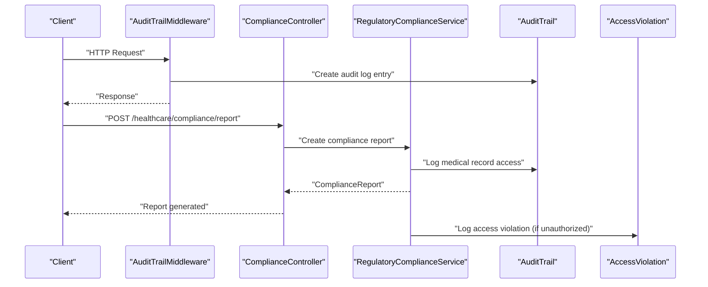
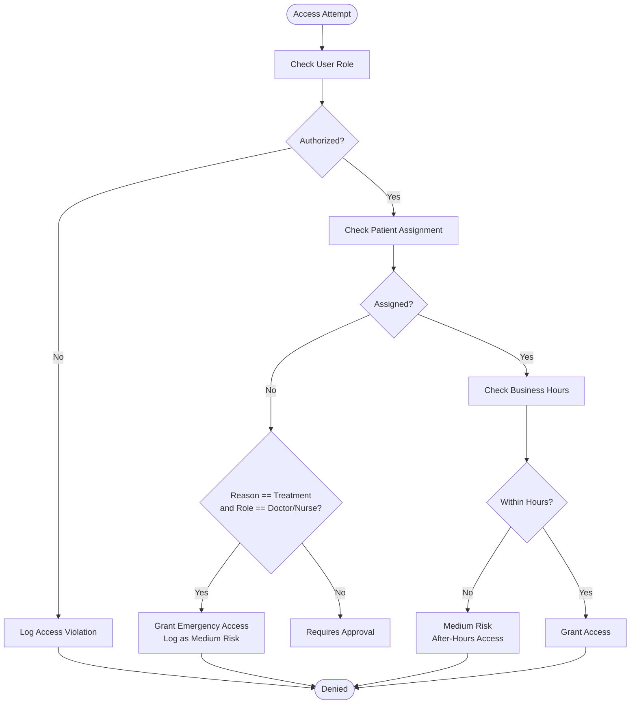
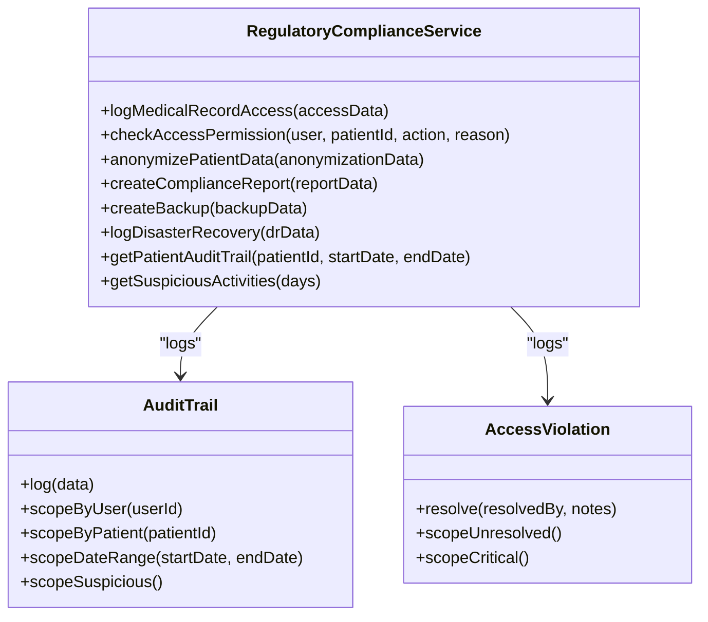
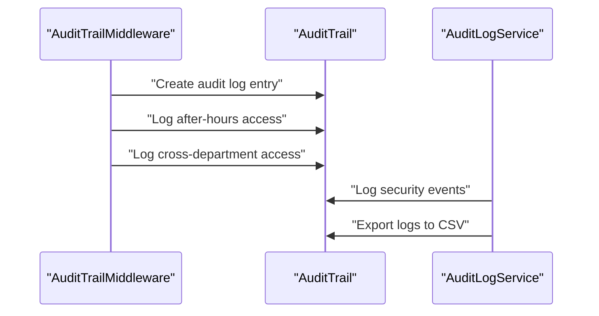
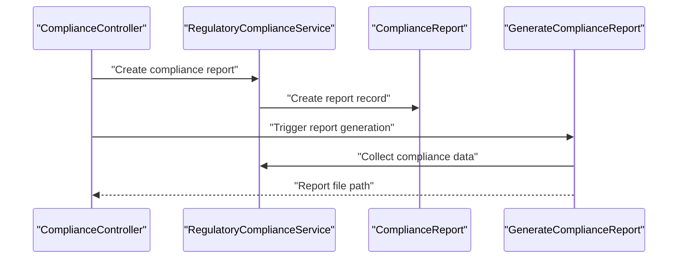
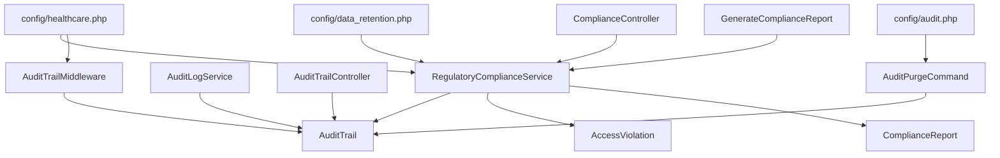

# Healthcare Compliance & Regulatory Features

<cite>
**Referenced Files in This Document**
- [healthcare.php](file://config/healthcare.php)
- [audit.php](file://config/audit.php)
- [data_retention.php](file://config/data_retention.php)
- [RegulatoryComplianceService.php](file://app/Services/RegulatoryComplianceService.php)
- [ComplianceController.php](file://app/Http/Controllers/Healthcare/ComplianceController.php)
- [ComplianceReport.php](file://app/Models/ComplianceReport.php)
- [GenerateComplianceReport.php](file://app/Console/Commands/GenerateComplianceReport.php)
- [AuditTrailMiddleware.php](file://app/Http/Middleware/AuditTrailMiddleware.php)
- [AuditLogService.php](file://app/Services/Security/AuditLogService.php)
- [AuditTrail.php](file://app/Models/AuditTrail.php)
- [AccessViolation.php](file://app/Models/AccessViolation.php)
- [AuditPurgeCommand.php](file://app/Console/Commands/AuditPurgeCommand.php)
- [AuditTrailController.php](file://app/Http/Controllers/Healthcare/AuditTrailController.php)
</cite>

## Table of Contents
1. [Introduction](#introduction)
2. [Project Structure](#project-structure)
3. [Core Components](#core-components)
4. [Architecture Overview](#architecture-overview)
5. [Detailed Component Analysis](#detailed-component-analysis)
6. [Dependency Analysis](#dependency-analysis)
7. [Performance Considerations](#performance-considerations)
8. [Troubleshooting Guide](#troubleshooting-guide)
9. [Conclusion](#conclusion)

## Introduction
This document provides comprehensive documentation for healthcare compliance and regulatory features within the qalcuityERP system. It focuses on HIPAA compliance measures, patient privacy safeguards, secure data transmission protocols, integration with healthcare regulations (CMS, Joint Commission standards, and state-specific mandates), audit trail functionality, compliance reporting dashboards, regulatory submission workflows, quality metrics, patient safety protocols, infection control measures, integration with external regulatory bodies, certification processes, compliance monitoring systems, automated compliance checks, policy enforcement mechanisms, and violation detection systems.

## Project Structure
The healthcare compliance features are implemented across configuration files, service classes, controllers, middleware, models, console commands, and audit services. The configuration files define operational parameters for business hours, security, compliance, audit trails, role-based access control (RBAC), patient portal settings, emergency access, data retention, and notifications. The service layer encapsulates core compliance logic, including access checks, anonymization, reporting, backups, and disaster recovery. Controllers expose UI endpoints for compliance dashboards, audit trails, anonymization, and reporting. Middleware enforces audit logging and after-hours access detection. Models represent compliance artifacts such as audit trails, access violations, and compliance reports. Console commands automate compliance reporting and audit purging. Audit services provide extended logging capabilities.

```mermaid
graph TB
ConfigHealthcare["config/healthcare.php"]
ConfigAudit["config/audit.php"]
ConfigDataRetention["config/data_retention.php"]
ServiceRegulatory["app/Services/RegulatoryComplianceService.php"]
ServiceAuditLog["app/Services/Security/AuditLogService.php"]
ControllerCompliance["app/Http/Controllers/Healthcare/ComplianceController.php"]
ControllerAuditTrail["app/Http/Controllers/Healthcare/AuditTrailController.php"]
MiddlewareAudit["app/Http/Middleware/AuditTrailMiddleware.php"]
ModelAuditTrail["app/Models/AuditTrail.php"]
ModelAccessViolation["app/Models/AccessViolation.php"]
ModelComplianceReport["app/Models/ComplianceReport.php"]
CommandComplianceReport["app/Console/Commands/GenerateComplianceReport.php"]
CommandAuditPurge["app/Console/Commands/AuditPurgeCommand.php"]
ConfigHealthcare --> ServiceRegulatory
ConfigHealthcare --> MiddlewareAudit
ConfigAudit --> CommandAuditPurge
ConfigDataRetention --> ServiceRegulatory
ServiceRegulatory --> ModelAuditTrail
ServiceRegulatory --> ModelAccessViolation
ServiceRegulatory --> ModelComplianceReport
MiddlewareAudit --> ModelAuditTrail
ServiceAuditLog --> ModelAuditTrail
ControllerCompliance --> ServiceRegulatory
ControllerAuditTrail --> ModelAuditTrail
CommandComplianceReport --> ServiceRegulatory
CommandAuditPurge --> ModelAuditTrail
```

**Diagram sources**
- [healthcare.php:10-251](file://config/healthcare.php#L10-L251)
- [audit.php:1-44](file://config/audit.php#L1-L44)
- [data_retention.php:1-293](file://config/data_retention.php#L1-L293)
- [RegulatoryComplianceService.php:17-581](file://app/Services/RegulatoryComplianceService.php#L17-L581)
- [AuditTrailMiddleware.php:10-130](file://app/Http/Middleware/AuditTrailMiddleware.php#L10-L130)
- [AuditLogService.php:8-214](file://app/Services/Security/AuditLogService.php#L8-L214)
- [ComplianceController.php:14-209](file://app/Http/Controllers/Healthcare/ComplianceController.php#L14-L209)
- [AuditTrailController.php:9-93](file://app/Http/Controllers/Healthcare/AuditTrailController.php#L9-L93)
- [AuditTrail.php:8-245](file://app/Models/AuditTrail.php#L8-L245)
- [AccessViolation.php:8-124](file://app/Models/AccessViolation.php#L8-L124)
- [ComplianceReport.php:9-45](file://app/Models/ComplianceReport.php#L9-L45)
- [GenerateComplianceReport.php:8-254](file://app/Console/Commands/GenerateComplianceReport.php#L8-L254)
- [AuditPurgeCommand.php:8-95](file://app/Console/Commands/AuditPurgeCommand.php#L8-L95)

**Section sources**
- [healthcare.php:10-251](file://config/healthcare.php#L10-L251)
- [audit.php:1-44](file://config/audit.php#L1-L44)
- [data_retention.php:1-293](file://config/data_retention.php#L1-L293)

## Core Components
- HIPAA compliance mode and audit logging: Enabled via configuration with audit retention periods and access logging toggles.
- Access control and RBAC: Role-based permissions for medical record access, with business hours enforcement and emergency access overrides.
- Audit trail logging: Comprehensive logging of access events, including after-hours access detection and cross-department access alerts.
- Compliance reporting: Automated generation of compliance reports with HIPAA and Permenkes frameworks.
- Data anonymization: Structured anonymization requests with ethics approval tracking and reversible anonymization support.
- Backup and disaster recovery: Encrypted backups of medical tables with compliance retention and disaster recovery incident logging.
- Violation detection: Access violation logging with severity levels and resolution tracking.
- Data retention and purging: Configurable retention policies with compliance hold preservation and scheduled purging.

**Section sources**
- [RegulatoryComplianceService.php:17-581](file://app/Services/RegulatoryComplianceService.php#L17-L581)
- [AuditTrailMiddleware.php:10-130](file://app/Http/Middleware/AuditTrailMiddleware.php#L10-L130)
- [AuditTrail.php:8-245](file://app/Models/AuditTrail.php#L8-L245)
- [AccessViolation.php:8-124](file://app/Models/AccessViolation.php#L8-L124)
- [ComplianceReport.php:9-45](file://app/Models/ComplianceReport.php#L9-L45)
- [GenerateComplianceReport.php:8-254](file://app/Console/Commands/GenerateComplianceReport.php#L8-L254)
- [AuditPurgeCommand.php:8-95](file://app/Console/Commands/AuditPurgeCommand.php#L8-L95)

## Architecture Overview
The compliance architecture integrates configuration-driven policies with service-layer logic, middleware enforcement, and controller-driven dashboards. Audit logging is centralized through middleware and services, while compliance reporting and data retention are orchestrated via console commands and configuration.

**Diagram sources**
- [AuditTrailMiddleware.php:17-107](file://app/Http/Middleware/AuditTrailMiddleware.php#L17-L107)
- [ComplianceController.php:129-152](file://app/Http/Controllers/Healthcare/ComplianceController.php#L129-L152)
- [RegulatoryComplianceService.php:22-38](file://app/Services/RegulatoryComplianceService.php#L22-L38)
- [AuditTrail.php:196-223](file://app/Models/AuditTrail.php#L196-L223)
- [AccessViolation.php:442-455](file://app/Models/AccessViolation.php#L442-L455)

## Detailed Component Analysis

### HIPAA Compliance Measures
- HIPAA mode activation and audit logging: The healthcare configuration enables HIPAA compliance mode and sets audit retention periods and access logging toggles. The compliance service logs medical record access with HIPAA-relevant flags and PHI classification.
- Access control and RBAC: Role-based permissions restrict access to medical records, with business hours enforcement and emergency access overrides requiring reasons and alerting security teams.
- Secure data transmission: Encryption is enabled for backups and HIPAA-compliant storage, ensuring secure transmission and storage of protected health information (PHI).

**Diagram sources**
- [RegulatoryComplianceService.php:43-96](file://app/Services/RegulatoryComplianceService.php#L43-L96)
- [healthcare.php:71-92](file://config/healthcare.php#L71-L92)

**Section sources**
- [healthcare.php:71-92](file://config/healthcare.php#L71-L92)
- [RegulatoryComplianceService.php:43-96](file://app/Services/RegulatoryComplianceService.php#L43-L96)

### Patient Privacy Safeguards
- Data anonymization: The anonymization service supports structured anonymization requests with ethics approval tracking, reversible anonymization support, and anonymization method documentation.
- Audit trail anonymization: Optional anonymization of patient data in logs for compliance, ensuring PHI is not exposed in audit trails.
- Access logging: Comprehensive logging of access attempts, including IP address, user agent, and metadata for after-hours and cross-department access.

**Diagram sources**
- [RegulatoryComplianceService.php:17-581](file://app/Services/RegulatoryComplianceService.php#L17-L581)
- [AuditTrail.php:8-245](file://app/Models/AuditTrail.php#L8-L245)
- [AccessViolation.php:8-124](file://app/Models/AccessViolation.php#L8-L124)

**Section sources**
- [RegulatoryComplianceService.php:101-134](file://app/Services/RegulatoryComplianceService.php#L101-L134)
- [healthcare.php:121-123](file://config/healthcare.php#L121-L123)

### Secure Data Transmission Protocols
- Encrypted backups: Backups of medical tables are encrypted with AES-256 and stored with compliance retention periods.
- HIPAA-compliant storage: Backup logs mark backups as HIPAA-compliant, ensuring adherence to transmission security requirements.
- Audit controls: Verification of backup procedures and regular access log reviews support integrity and transmission security controls.

**Section sources**
- [RegulatoryComplianceService.php:181-234](file://app/Services/RegulatoryComplianceService.php#L181-L234)
- [RegulatoryComplianceService.php:302-336](file://app/Services/RegulatoryComplianceService.php#L302-L336)

### Integration with Healthcare Regulations
- CMS requirements: Compliance checks include access controls, audit controls, integrity controls, transmission security, backup and recovery, and access logs review.
- Joint Commission standards: Audit trail functionality and access logging align with Joint Commission expectations for accountability and transparency.
- State-specific mandates: Emergency access settings, business hours configuration, and after-hours access logging accommodate state-specific requirements for after-hours access and emergency scenarios.

**Section sources**
- [RegulatoryComplianceService.php:286-370](file://app/Services/RegulatoryComplianceService.php#L286-L370)
- [healthcare.php:183-198](file://config/healthcare.php#L183-L198)

### Audit Trail Functionality
- Middleware enforcement: The audit trail middleware logs access events, detects after-hours access, and alerts on cross-department access.
- Enhanced logging: The audit log service provides comprehensive event logging, device type detection, and CSV export capabilities.
- Model scopes: The AuditTrail model includes scopes for filtering by user, action, category, HIPAA relevance, PHI presence, suspicious activity, risk level, patient, date range, and search terms.

**Diagram sources**
- [AuditTrailMiddleware.php:22-93](file://app/Http/Middleware/AuditTrailMiddleware.php#L22-L93)
- [AuditLogService.php:13-81](file://app/Services/Security/AuditLogService.php#L13-L81)
- [AuditTrail.php:47-129](file://app/Models/AuditTrail.php#L47-L129)

**Section sources**
- [AuditTrailMiddleware.php:17-107](file://app/Http/Middleware/AuditTrailMiddleware.php#L17-L107)
- [AuditLogService.php:108-143](file://app/Services/Security/AuditLogService.php#L108-L143)
- [AuditTrail.php:47-129](file://app/Models/AuditTrail.php#L47-L129)

### Compliance Reporting Dashboards
- Dashboard statistics: Compliance dashboards display total violations, unresolved violations, critical violations, total audits, total backups, and recent violations and audits.
- Report generation: Controllers enable asynchronous report generation with filtering by report type, status, and date ranges.
- Automated reporting: Console commands generate monthly compliance reports for tenants with configurable output formats (PDF, Excel, JSON).

**Diagram sources**
- [ComplianceController.php:19-31](file://app/Http/Controllers/Healthcare/ComplianceController.php#L19-L31)
- [ComplianceController.php:109-152](file://app/Http/Controllers/Healthcare/ComplianceController.php#L109-L152)
- [GenerateComplianceReport.php:30-101](file://app/Console/Commands/GenerateComplianceReport.php#L30-L101)
- [RegulatoryComplianceService.php:139-176](file://app/Services/RegulatoryComplianceService.php#L139-L176)

**Section sources**
- [ComplianceController.php:19-31](file://app/Http/Controllers/Healthcare/ComplianceController.php#L19-L31)
- [ComplianceController.php:109-152](file://app/Http/Controllers/Healthcare/ComplianceController.php#L109-L152)
- [GenerateComplianceReport.php:69-101](file://app/Console/Commands/GenerateComplianceReport.php#L69-L101)

### Regulatory Submission Workflows
- Compliance report creation: The service creates compliance reports with framework-specific checks, scoring, and findings.
- Backup and DR logging: Backup logs and disaster recovery logs track compliance-relevant events with verification and retention settings.
- Access violation tracking: Access violations are logged with severity levels, resolution tracking, and compliance reporting integration.

**Section sources**
- [RegulatoryComplianceService.php:139-176](file://app/Services/RegulatoryComplianceService.php#L139-L176)
- [RegulatoryComplianceService.php:239-254](file://app/Services/RegulatoryComplianceService.php#L239-L254)
- [AccessViolation.php:41-48](file://app/Models/AccessViolation.php#L41-L48)

### Quality Metrics, Patient Safety, and Infection Control
- Quality metrics: Compliance reporting includes access audit statistics, data privacy metrics, security incidents, user access reviews, data retention statistics, backup status, and training compliance indicators.
- Patient safety: After-hours access detection and cross-department access alerts support patient safety protocols by identifying unusual access patterns.
- Infection control: While not explicitly modeled in the referenced files, the audit trail and access logging infrastructure can be leveraged to monitor and report on infection control-related access and procedures.

**Section sources**
- [GenerateComplianceReport.php:106-201](file://app/Console/Commands/GenerateComplianceReport.php#L106-L201)

### Integration with External Regulatory Bodies and Certification Processes
- Compliance frameworks: The service supports HIPAA and Permenkes compliance checks, enabling alignment with international and regional regulatory requirements.
- Certification readiness: Automated compliance checks, audit trails, and reporting facilitate preparation for regulatory audits and certifications.

**Section sources**
- [RegulatoryComplianceService.php:286-370](file://app/Services/RegulatoryComplianceService.php#L286-L370)

### Compliance Monitoring Systems
- Real-time monitoring: Middleware and services continuously monitor access events, violations, and suspicious activities.
- Scheduled monitoring: Console commands automate monthly compliance reporting and audit purging to maintain ongoing compliance posture.

**Section sources**
- [AuditTrailMiddleware.php:112-128](file://app/Http/Middleware/AuditTrailMiddleware.php#L112-L128)
- [GenerateComplianceReport.php:30-64](file://app/Console/Commands/GenerateComplianceReport.php#L30-L64)
- [AuditPurgeCommand.php:18-95](file://app/Console/Commands/AuditPurgeCommand.php#L18-L95)

### Automated Compliance Checks and Policy Enforcement
- Access permission checks: The service validates roles, assignments, business hours, and emergency access requirements.
- Policy enforcement: Middleware enforces after-hours access detection and cross-department access alerts, while configuration settings govern security notifications and logging.

**Section sources**
- [RegulatoryComplianceService.php:43-96](file://app/Services/RegulatoryComplianceService.php#L43-L96)
- [AuditTrailMiddleware.php:66-92](file://app/Http/Middleware/AuditTrailMiddleware.php#L66-L92)
- [healthcare.php:42-61](file://config/healthcare.php#L42-L61)

### Violation Detection Systems
- Access violation logging: Unauthorized access attempts are logged with severity levels, IP addresses, user agents, and timestamps.
- Resolution tracking: Access violations support resolution tracking with assigned resolvers and resolution notes.

**Section sources**
- [RegulatoryComplianceService.php:442-455](file://app/Services/RegulatoryComplianceService.php#L442-L455)
- [AccessViolation.php:101-109](file://app/Models/AccessViolation.php#L101-L109)

## Dependency Analysis
The compliance subsystem exhibits strong cohesion within the service layer and clear separation of concerns between configuration, middleware, controllers, models, and console commands. Dependencies are primarily unidirectional, flowing from configuration to services and controllers, with models serving as shared data stores.

**Diagram sources**
- [healthcare.php:10-251](file://config/healthcare.php#L10-L251)
- [audit.php:1-44](file://config/audit.php#L1-L44)
- [data_retention.php:1-293](file://config/data_retention.php#L1-L293)
- [RegulatoryComplianceService.php:17-581](file://app/Services/RegulatoryComplianceService.php#L17-L581)
- [AuditTrailMiddleware.php:10-130](file://app/Http/Middleware/AuditTrailMiddleware.php#L10-L130)
- [AuditLogService.php:8-214](file://app/Services/Security/AuditLogService.php#L8-L214)
- [ComplianceController.php:14-209](file://app/Http/Controllers/Healthcare/ComplianceController.php#L14-L209)
- [AuditTrailController.php:9-93](file://app/Http/Controllers/Healthcare/AuditTrailController.php#L9-L93)
- [AuditTrail.php:8-245](file://app/Models/AuditTrail.php#L8-L245)
- [AccessViolation.php:8-124](file://app/Models/AccessViolation.php#L8-L124)
- [ComplianceReport.php:9-45](file://app/Models/ComplianceReport.php#L9-L45)
- [GenerateComplianceReport.php:8-254](file://app/Console/Commands/GenerateComplianceReport.php#L8-L254)
- [AuditPurgeCommand.php:8-95](file://app/Console/Commands/AuditPurgeCommand.php#L8-L95)

**Section sources**
- [healthcare.php:10-251](file://config/healthcare.php#L10-L251)
- [audit.php:1-44](file://config/audit.php#L1-L44)
- [data_retention.php:1-293](file://config/data_retention.php#L1-L293)
- [RegulatoryComplianceService.php:17-581](file://app/Services/RegulatoryComplianceService.php#L17-L581)
- [AuditTrailMiddleware.php:10-130](file://app/Http/Middleware/AuditTrailMiddleware.php#L10-L130)
- [AuditLogService.php:8-214](file://app/Services/Security/AuditLogService.php#L8-L214)
- [ComplianceController.php:14-209](file://app/Http/Controllers/Healthcare/ComplianceController.php#L14-L209)
- [AuditTrailController.php:9-93](file://app/Http/Controllers/Healthcare/AuditTrailController.php#L9-L93)
- [AuditTrail.php:8-245](file://app/Models/AuditTrail.php#L8-L245)
- [AccessViolation.php:8-124](file://app/Models/AccessViolation.php#L8-L124)
- [ComplianceReport.php:9-45](file://app/Models/ComplianceReport.php#L9-L45)
- [GenerateComplianceReport.php:8-254](file://app/Console/Commands/GenerateComplianceReport.php#L8-L254)
- [AuditPurgeCommand.php:8-95](file://app/Console/Commands/AuditPurgeCommand.php#L8-L95)

## Performance Considerations
- Audit logging overhead: Comprehensive logging enhances compliance but may impact performance. Use selective logging and retention policies to balance compliance needs with system performance.
- Batch operations: Use batch sizes and timeouts for archival and backup operations to prevent memory exhaustion and long-running jobs.
- Indexing and queries: Ensure proper indexing on frequently queried audit trail fields (user_id, patient_id, created_at) to optimize query performance.
- Data anonymization: Perform anonymization in transactions and consider chunking large datasets to manage memory usage.

## Troubleshooting Guide
- Audit log insertion failures: The middleware falls back to file logging when database inserts fail. Monitor the healthcare audit log channel for warnings and investigate database connectivity issues.
- Compliance report generation failures: Console commands log errors and continue processing other tenants. Review logs for specific tenant failures and correct configuration issues.
- Audit purging: Use dry-run mode to preview deletions and ensure compliance hold entries are preserved unless explicitly overridden. Confirm retention periods and tenant scoping before purging.
- Access violation resolution: Use the AccessViolation model's resolution methods to mark violations as resolved and track resolution timelines.

**Section sources**
- [AuditTrailMiddleware.php:56-59](file://app/Http/Middleware/AuditTrailMiddleware.php#L56-L59)
- [GenerateComplianceReport.php:50-58](file://app/Console/Commands/GenerateComplianceReport.php#L50-L58)
- [AuditPurgeCommand.php:47-58](file://app/Console/Commands/AuditPurgeCommand.php#L47-L58)
- [AccessViolation.php:101-109](file://app/Models/AccessViolation.php#L101-L109)

## Conclusion
The qalcuityERP healthcare compliance subsystem provides robust HIPAA compliance measures, patient privacy safeguards, secure data transmission protocols, and comprehensive audit trail functionality. Through configuration-driven policies, service-layer logic, middleware enforcement, and controller-driven dashboards, the system supports integration with healthcare regulations, automated compliance checks, policy enforcement, and violation detection. The modular design ensures maintainability and extensibility for future regulatory requirements and certification processes.