# Healthcare Management Module

<cite>
**Referenced Files in This Document**
- [healthcare.php](file://routes/healthcare.php)
- [healthcare.php](file://config/healthcare.php)
- [PatientController.php](file://app/Http/Controllers/Healthcare/PatientController.php)
- [EMRController.php](file://app/Http/Controllers/Healthcare/EMRController.php)
- [TelemedicineController.php](file://app/Http/Controllers/Healthcare/TelemedicineController.php)
- [TelemedicineSettingsController.php](file://app/Http/Controllers/Healthcare/TelemedicineSettingsController.php)
- [HealthcareApiController.php](file://app/Http/Controllers/Api/HealthcareApiController.php)
- [AdmissionController.php](file://app/Http/Controllers/Healthcare/AdmissionController.php)
- [AnalyticsController.php](file://app/Http/Controllers/Healthcare/AnalyticsController.php)
- [AnalyticsDashboardController.php](file://app/Http/Controllers/Healthcare/AnalyticsDashboardController.php)
- [AppointmentController.php](file://app/Http/Controllers/Healthcare/AppointmentController.php)
- [AuditTrailController.php](file://app/Http/Controllers/Healthcare/AuditTrailController.php)
- [BPJSClaimController.php](file://app/Http/Controllers/Healthcare/BPJSClaimController.php)
- [BackupController.php](file://app/Http/Controllers/Healthcare/BackupController.php)
- [BedController.php](file://app/Http/Controllers/Healthcare/BedController.php)
- [BedManagementController.php](file://app/Http/Controllers/Healthcare/BedManagementController.php)
- [BillingController.php](file://app/Http/Controllers/Healthcare/BillingController.php)
- [ClinicalQualityController.php](file://app/Http/Controllers/Healthcare/ClinicalQualityController.php)
- [ComplianceController.php](file://app/Http/Controllers/Healthcare/ComplianceController.php)
- [ComplianceReportController.php](file://app/Http/Controllers/Healthcare/ComplianceReportController.php)
- [DoctorController.php](file://app/Http/Controllers/Healthcare/DoctorController.php)
- [EmergencyController.php](file://app/Http/Controllers/Healthcare/EmergencyController.php)
- [FinancialReportController.php](file://app/Http/Controllers/Healthcare/FinancialReportController.php)
- [HL7Controller.php](file://app/Http/Controllers/Healthcare/HL7Controller.php)
- [HealthEducationController.php](file://app/Http/Controllers/Healthcare/HealthEducationController.php)
- [Teleconsultation.php](file://app/Models/Teleconsultation.php)
- [TeleconsultationFeedback.php](file://app/Models/TeleconsultationFeedback.php)
- [TeleconsultationRecording.php](file://app/Models/TeleconsultationRecording.php)
- [TelemedicineSetting.php](file://app/Models/TelemedicineSetting.php)
- [AiTourSession.php](file://app/Models/AiTourSession.php)
- [HealthCertificate.php](file://app/Models/HealthCertificate.php)
- [MedicalCertificate.php](file://app/Models/MedicalCertificate.php)
- [QueueManagement.php](file://app/Models/QueueManagement.php)
- [QueueTicket.php](file://app/Models/QueueTicket.php)
- [TelemedicineFeedbackService.php](file://app/Services/TelemedicineFeedbackService.php)
- [TelemedicineReminderService.php](file://app/Services/TelemedicineReminderService.php)
- [TelemedicineVideoService.php](file://app/Services/TelemedicineVideoService.php)
- [PatientService.php](file://app/Services/PatientService.php)
- [AppointmentSchedulingService.php](file://app/Services/AppointmentSchedulingService.php)
- [MedicalBillingService.php](file://app/Services/MedicalBillingService.php)
- [LaboratoryService.php](file://app/Services/LaboratoryService.php)
- [PharmacyService.php](file://app/Services/PharmacyService.php)
- [RegulatoryComplianceService.php](file://app/Services/RegulatoryComplianceService.php)
- [AdvancedAnalyticsService.php](file://app/Services/AdvancedAnalyticsService.php)
- [EMRService.php](file://app/Services/EMRService.php)
- [HealthcareIntegrationService.php](file://app/Services/HealthcareIntegrationService.php)
- [QueueManagementService.php](file://app/Services/QueueManagementService.php)
- [HospitalAnalyticsService.php](file://app/Services/HospitalAnalyticsService.php)
</cite>

## Update Summary
**Changes Made**
- Added comprehensive healthcare certificate management system with HealthCertificate and MedicalCertificate models
- Enhanced EMR system with advanced analytics integration and SOAP note validation
- Expanded queue management with sophisticated positioning algorithms and real-time analytics
- Integrated AiTourSession model for guided user experience and onboarding
- Added advanced healthcare analytics including business health scoring and performance metrics
- Enhanced healthcare integration services with comprehensive HL7/FHIR messaging and BPJS claim processing
- Expanded bed management and emergency department operations with advanced analytics
- Added healthcare education and training management capabilities

## Table of Contents
1. [Introduction](#introduction)
2. [Project Structure](#project-structure)
3. [Core Components](#core-components)
4. [Architecture Overview](#architecture-overview)
5. [Detailed Component Analysis](#detailed-component-analysis)
6. [Enhanced Healthcare Certificate Management](#enhanced-healthcare-certificate-management)
7. [Advanced EMR System Integration](#advanced-emr-system-integration)
8. [Sophisticated Queue Management System](#sophisticated-queue-management-system)
9. [Guided User Experience with AiTourSession](#guided-user-experience-with-aitoursession)
10. [Comprehensive Healthcare Analytics](#comprehensive-healthcare-analytics)
11. [Advanced Healthcare Integration Services](#advanced-healthcare-integration-services)
12. [Enhanced Bed Management and Emergency Operations](#enhanced-bed-management-and-emergency-operations)
13. [Healthcare Education and Training Management](#healthcare-education-and-training-management)
14. [Dependency Analysis](#dependency-analysis)
15. [Performance Considerations](#performance-considerations)
16. [Troubleshooting Guide](#troubleshooting-guide)
17. [Conclusion](#conclusion)

## Introduction
This document provides comprehensive documentation for the Healthcare Management Module, covering Electronic Medical Record (EMR) integration, patient management workflows, appointment scheduling with sophisticated queue management, medical billing and insurance claim processing, laboratory and radiology workflow management, pharmacy dispensing operations, healthcare compliance features, advanced healthcare certificate management, comprehensive analytics, and enhanced integration capabilities. The module now includes integrated Jitsi Meet video consultations, JWT authentication, recording capabilities, comprehensive feedback system, tenant-specific configuration management, guided user experience through AiTourSession, advanced healthcare analytics, and comprehensive healthcare certificate management.

## Project Structure
The Healthcare Management Module is organized around Laravel controllers, services, and routes grouped by functional domains. The routing file defines endpoints for patients, EMR, admissions/beds, queues, emergency, pharmacy, laboratory, radiology, billing, telemedicine, healthcare certificates, analytics, compliance, integration, and healthcare education. Configuration settings govern business hours, security, compliance, audit trails, role-based access control, patient portal features, emergency access, data retention, and notification preferences.

```mermaid
graph TB
subgraph "Routing Layer"
Routes["routes/healthcare.php"]
end
subgraph "Controllers"
PatientCtrl["Healthcare\\PatientController"]
EMRCtrl["Healthcare\\EMRController"]
TeleCtrl["Healthcare\\TelemedicineController"]
TeleSettingsCtrl["Healthcare\\TelemedicineSettingsController"]
AdmissionCtrl["Healthcare\\AdmissionController"]
AnalyticsCtrl["Healthcare\\AnalyticsController"]
QueueCtrl["Healthcare\\QueueController"]
BillingCtrl["Healthcare\\BillingController"]
LabCtrl["Healthcare\\LaboratoryController"]
PharmacyCtrl["Healthcare\\PharmacyController"]
ERCtrl["Healthcare\\EmergencyController"]
ComplianceCtrl["Healthcare\\ComplianceController"]
IntegrationCtrl["Healthcare\\IntegrationController"]
CertificateCtrl["Healthcare\\CertificateController"]
EducationCtrl["Healthcare\\HealthEducationController"]
end
subgraph "Services"
PatientSvc["PatientService"]
AppointmentSvc["AppointmentSchedulingService"]
MedicalBillingSvc["MedicalBillingService"]
LabSvc["LaboratoryService"]
PharmacySvc["PharmacyService"]
ComplianceSvc["RegulatoryComplianceService"]
TeleFeedbackSvc["TelemedicineFeedbackService"]
TeleReminderSvc["TelemedicineReminderService"]
TeleVideoSvc["TelemedicineVideoService"]
AdvancedAnalyticsSvc["AdvancedAnalyticsService"]
EMRSvc["EMRService"]
HealthcareIntegrationSvc["HealthcareIntegrationService"]
QueueSvc["QueueManagementService"]
HospitalAnalyticsSvc["HospitalAnalyticsService"]
end
subgraph "Models"
Teleconsultation["Teleconsultation"]
TeleFeedback["TeleconsultationFeedback"]
TeleRecording["TeleconsultationRecording"]
TeleSetting["TelemedicineSetting"]
AiTourSession["AiTourSession"]
HealthCertificate["HealthCertificate"]
MedicalCertificate["MedicalCertificate"]
QueueManagement["QueueManagement"]
QueueTicket["QueueTicket"]
end
Routes --> PatientCtrl
Routes --> EMRCtrl
Routes --> TeleCtrl
Routes --> TeleSettingsCtrl
Routes --> AdmissionCtrl
Routes --> AnalyticsCtrl
Routes --> QueueCtrl
Routes --> BillingCtrl
Routes --> LabCtrl
Routes --> PharmacyCtrl
Routes --> ERCtrl
Routes --> ComplianceCtrl
Routes --> IntegrationCtrl
Routes --> CertificateCtrl
Routes --> EducationCtrl
TeleCtrl --> TeleFeedbackSvc
TeleCtrl --> TeleVideoSvc
TeleCtrl --> TeleFeedbackSvc
TeleSettingsCtrl --> TeleSetting
TeleFeedbackSvc --> TeleFeedback
TeleVideoSvc --> Teleconsultation
TeleVideoSvc --> TeleSetting
TeleReminderSvc --> Teleconsultation
TeleReminderSvc --> TeleSetting
AdvancedAnalyticsSvc --> HospitalAnalyticsSvc
HealthcareIntegrationSvc --> HL7Message
HealthcareIntegrationSvc --> BPJSClaim
QueueSvc --> QueueManagement
QueueSvc --> QueueTicket
```

**Diagram sources**
- [healthcare.php:1-563](file://routes/healthcare.php#L1-L563)
- [TelemedicineController.php:1-588](file://app/Http/Controllers/Healthcare/TelemedicineController.php#L1-L588)
- [TelemedicineSettingsController.php:1-102](file://app/Http/Controllers/Healthcare/TelemedicineSettingsController.php#L1-L102)
- [AdmissionController.php:1-200](file://app/Http/Controllers/Healthcare/AdmissionController.php#L1-L200)
- [AnalyticsController.php:1-200](file://app/Http/Controllers/Healthcare/AnalyticsController.php#L1-L200)
- [QueueManagementService.php:1-450](file://app/Services/QueueManagementService.php#L1-L450)
- [AdvancedAnalyticsService.php:1-800](file://app/Services/AdvancedAnalyticsService.php#L1-L800)
- [HealthcareIntegrationService.php:1-591](file://app/Services/HealthcareIntegrationService.php#L1-L591)
- [Teleconsultation.php:1-299](file://app/Models/Teleconsultation.php#L1-L299)
- [AiTourSession.php:1-118](file://app/Models/AiTourSession.php#L1-L118)
- [HealthCertificate.php:1-54](file://app/Models/HealthCertificate.php#L1-L54)
- [MedicalCertificate.php:1-49](file://app/Models/MedicalCertificate.php#L1-L49)
- [QueueManagement.php:1-282](file://app/Models/QueueManagement.php#L1-L282)
- [QueueTicket.php:1-55](file://app/Models/QueueTicket.php#L1-L55)

**Section sources**
- [healthcare.php:1-563](file://routes/healthcare.php#L1-L563)
- [healthcare.php:1-251](file://config/healthcare.php#L1-L251)

## Core Components
- Patient Management: End-to-end patient lifecycle including creation, updates, search, and retrieval of medical records, visits, appointments, prescriptions, and lab results. QR code generation and timeline aggregation are supported.
- EMR Integration: Centralized medical record management with diagnosis, prescriptions, lab orders, export capabilities, SOAP note validation, and advanced analytics integration.
- Appointment Scheduling: Doctor availability validation, conflict detection, schedule creation, rescheduling, reminders, and slot availability calculation.
- Medical Billing & Claims: Bill generation, itemization, insurance claim creation, adjudication, copayment collection, payment plans, and aging reports.
- Laboratory & Radiology: Sample collection, processing, result entry, verification, critical value handling, equipment calibration, QC logs, and PACS-like study viewing.
- Pharmacy Operations: Stock management, dispensing with drug interaction checks, FIFO/FEFO stock deduction, low/expiration alerts, and analytics.
- Compliance & Security: HIPAA-compliant access logging, RBAC enforcement, audit trails, anonymization requests, backups, disaster recovery, and suspicious activity monitoring.
- Queuing & Emergency: Sophisticated queue number assignment with priority handling, call management, triage, emergency throughput, and comprehensive analytics.
- Analytics & Reporting: Advanced dashboards for billing, laboratory, pharmacy, compliance, and healthcare performance metrics with export capabilities.
- **Enhanced Telemedicine Platform**: Integrated Jitsi Meet video consultations with JWT authentication, recording capabilities, comprehensive feedback system, reminder notifications, and tenant-specific configuration management.
- **Healthcare Certificate Management**: Comprehensive system for managing health certificates and medical certificates with automated validation and tracking.
- **Advanced Healthcare Analytics**: Business health scoring, RFM analysis, performance metrics, and comprehensive hospital analytics.
- **Healthcare Integration Services**: HL7/FHIR messaging, BPJS claim processing, lab equipment integration, and multi-channel notifications.
- **Guided User Experience**: AiTourSession model for interactive onboarding and guided navigation.

**Section sources**
- [PatientController.php:1-363](file://app/Http/Controllers/Healthcare/PatientController.php#L1-L363)
- [EMRController.php:1-248](file://app/Http/Controllers/Healthcare/EMRController.php#L1-L248)
- [PatientService.php:1-485](file://app/Services/PatientService.php#L1-L485)
- [AppointmentSchedulingService.php:1-408](file://app/Services/AppointmentSchedulingService.php#L1-L408)
- [MedicalBillingService.php:1-563](file://app/Services/MedicalBillingService.php#L1-L563)
- [LaboratoryService.php:1-509](file://app/Services/LaboratoryService.php#L1-L509)
- [PharmacyService.php:1-363](file://app/Services/PharmacyService.php#L1-L363)
- [RegulatoryComplianceService.php:1-581](file://app/Services/RegulatoryComplianceService.php#L1-L581)

## Architecture Overview
The module follows a layered architecture:
- Routing: Defines RESTful endpoints grouped by domain, including comprehensive telemedicine routes and healthcare certificate management.
- Controllers: Handle HTTP requests, orchestrate service calls, and render views or JSON responses.
- Services: Encapsulate business logic with transactional guarantees, validations, and integrations.
- Models: Represent entities and relationships (patients, visits, records, bills, claims, lab samples, prescriptions, teleconsultations, certificates, queues, etc.).
- Configuration: Centralized healthcare-specific settings for security, compliance, business hours, notifications, and portal features.

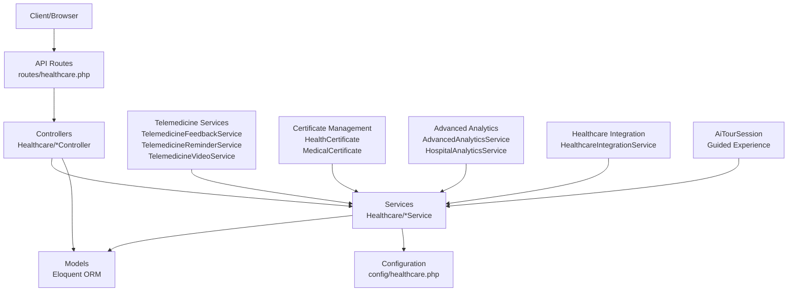

**Diagram sources**
- [healthcare.php:1-563](file://routes/healthcare.php#L1-L563)
- [healthcare.php:1-251](file://config/healthcare.php#L1-L251)

## Detailed Component Analysis

### Patient Management Workflow
The patient management workflow supports full CRUD operations, filtering, search, and aggregation of related data (visits, records, appointments, prescriptions, lab results). Statistics are cached for performance, and QR code generation is supported for quick identification.

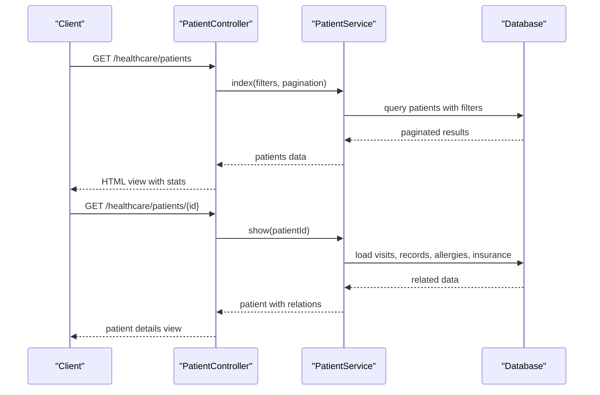

**Diagram sources**
- [PatientController.php:1-363](file://app/Http/Controllers/Healthcare/PatientController.php#L1-L363)
- [PatientService.php:1-485](file://app/Services/PatientService.php#L1-L485)

**Section sources**
- [PatientController.php:1-363](file://app/Http/Controllers/Healthcare/PatientController.php#L1-L363)
- [PatientService.php:1-485](file://app/Services/PatientService.php#L1-L485)

### EMR Integration
The EMR module centralizes clinical documentation, allowing diagnosis addition, prescription creation, and lab order initiation directly from a patient's record. Timeline aggregation and export capabilities support interoperability and auditability. Enhanced with advanced analytics and SOAP note validation.

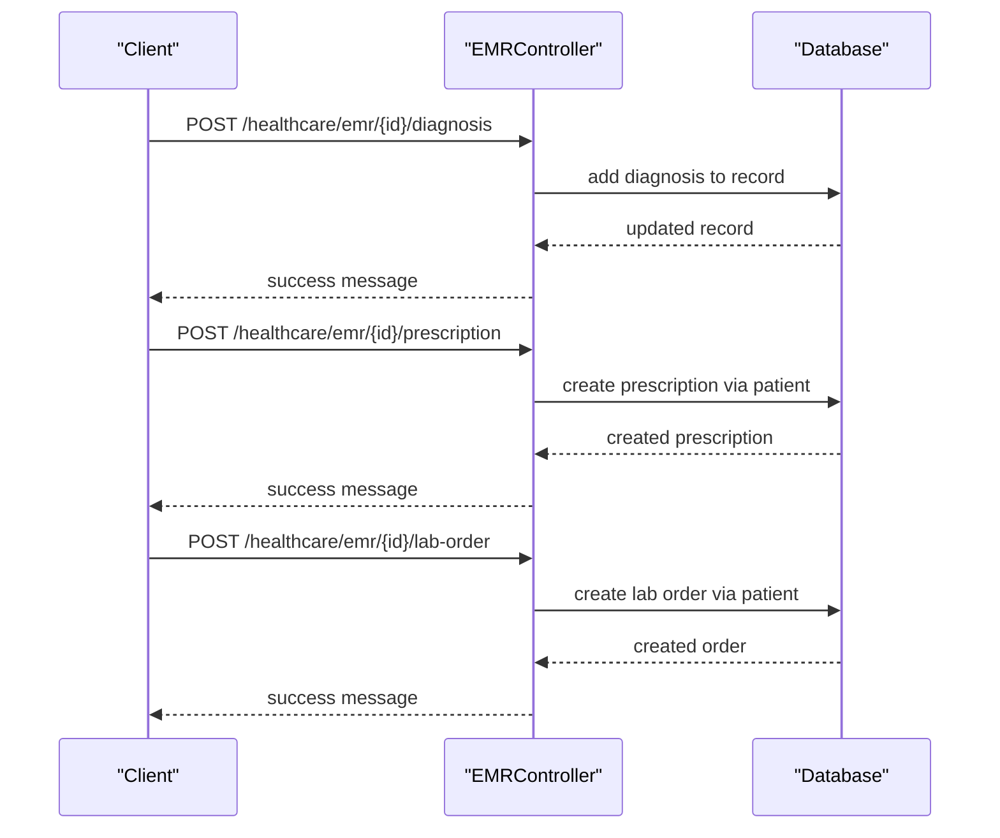

**Diagram sources**
- [EMRController.php:1-248](file://app/Http/Controllers/Healthcare/EMRController.php#L1-L248)

**Section sources**
- [EMRController.php:1-248](file://app/Http/Controllers/Healthcare/EMRController.php#L1-L248)

### Appointment Scheduling with Queue Management
The scheduling service validates doctor availability, prevents conflicts, auto-creates schedules, and manages rescheduling and reminders. Queue management supports sophisticated number assignment, priority handling, calling, skipping, and comprehensive analytics.

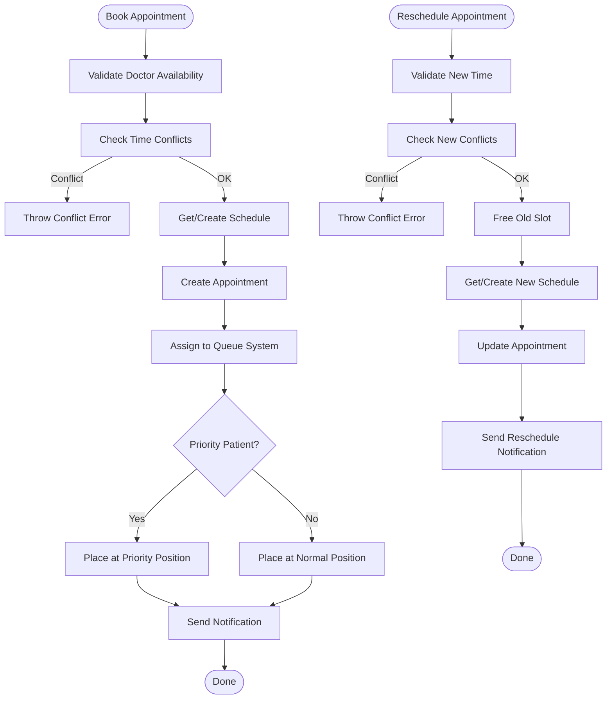

**Diagram sources**
- [AppointmentSchedulingService.php:1-408](file://app/Services/AppointmentSchedulingService.php#L1-L408)

**Section sources**
- [AppointmentSchedulingService.php:1-408](file://app/Services/AppointmentSchedulingService.php#L1-L408)

### Medical Billing and Insurance Claim Processing
The billing service generates bills, adds items, finalizes invoices, creates insurance claims, submits them, processes adjudications, collects copayments, and manages payment plans. Aging reports and dashboard metrics are provided.

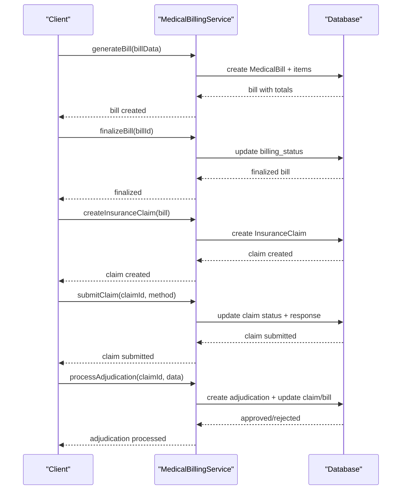

**Diagram sources**
- [MedicalBillingService.php:1-563](file://app/Services/MedicalBillingService.php#L1-L563)

**Section sources**
- [MedicalBillingService.php:1-563](file://app/Services/MedicalBillingService.php#L1-L563)

### Laboratory Workflow Management
Laboratory operations include sample creation, receipt, processing, result entry with automatic abnormality flags, verification, completion, QC logging, equipment calibration, and critical value escalation.

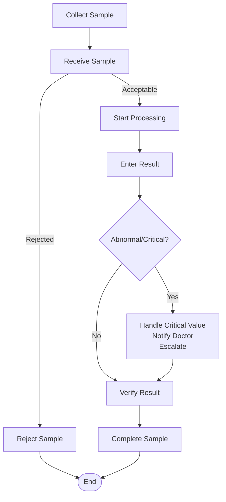

**Diagram sources**
- [LaboratoryService.php:1-509](file://app/Services/LaboratoryService.php#L1-L509)

**Section sources**
- [LaboratoryService.php:1-509](file://app/Services/LaboratoryService.php#L1-L509)

### Pharmacy Dispensing Operations
Pharmacy operations manage stock receipts, dispensing with drug interaction checks, FIFO/FEFO stock deduction, low stock and expiration alerts, and daily analytics.

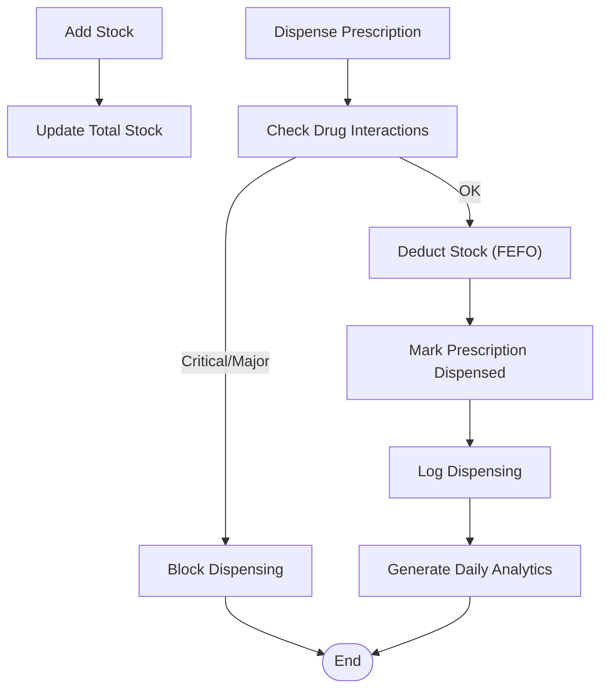

**Diagram sources**
- [PharmacyService.php:1-363](file://app/Services/PharmacyService.php#L1-L363)

**Section sources**
- [PharmacyService.php:1-363](file://app/Services/PharmacyService.php#L1-L363)

### Healthcare Compliance Features
Compliance services enforce HIPAA-compliant access logging, RBAC checks, anonymization requests, backup creation with encryption, disaster recovery logging, and suspicious activity monitoring.

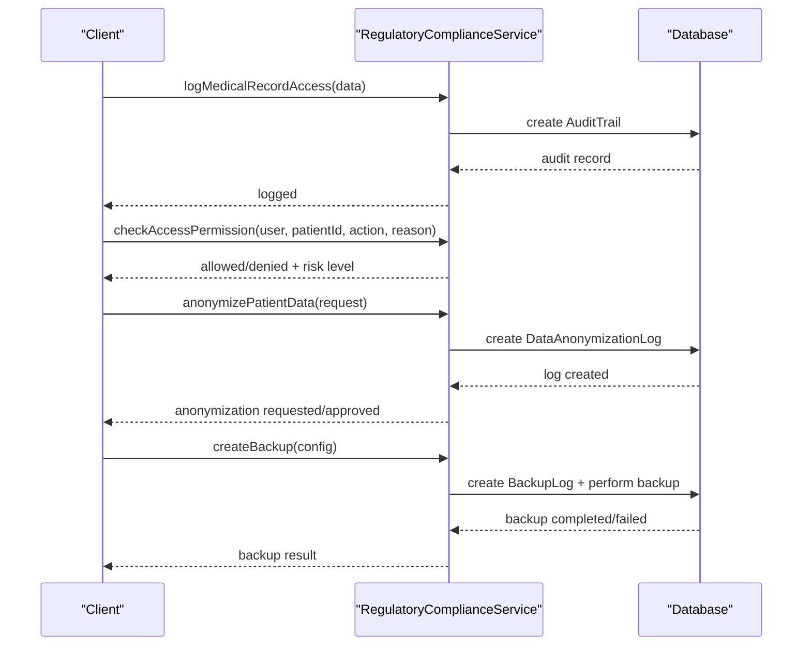

**Diagram sources**
- [RegulatoryComplianceService.php:1-581](file://app/Services/RegulatoryComplianceService.php#L1-L581)

**Section sources**
- [RegulatoryComplianceService.php:1-581](file://app/Services/RegulatoryComplianceService.php#L1-L581)

### Bed Management and Emergency Department Operations
Bed management supports ward and bed operations, admission/discharge/transfers, rounds recording, occupancy reporting, and dashboard views. Emergency operations include triage assessment, patient tracking, critical alerts, throughput analytics, and admission decisions.

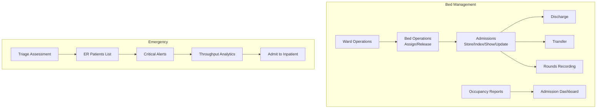

**Diagram sources**
- [healthcare.php:140-201](file://routes/healthcare.php#L140-L201)

**Section sources**
- [healthcare.php:140-201](file://routes/healthcare.php#L140-L201)

## Enhanced Healthcare Certificate Management

### Comprehensive Certificate Management System
The healthcare certificate management system provides a complete solution for managing both health certificates and medical certificates with automated validation, tracking, and compliance features.

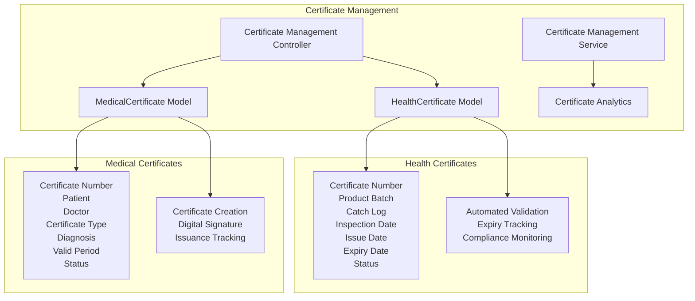

**Diagram sources**
- [HealthCertificate.php:1-54](file://app/Models/HealthCertificate.php#L1-L54)
- [MedicalCertificate.php:1-49](file://app/Models/MedicalCertificate.php#L1-L49)

### Health Certificate Management
Health certificates are used for food safety, pharmaceutical products, and other regulated items requiring quality assurance documentation.

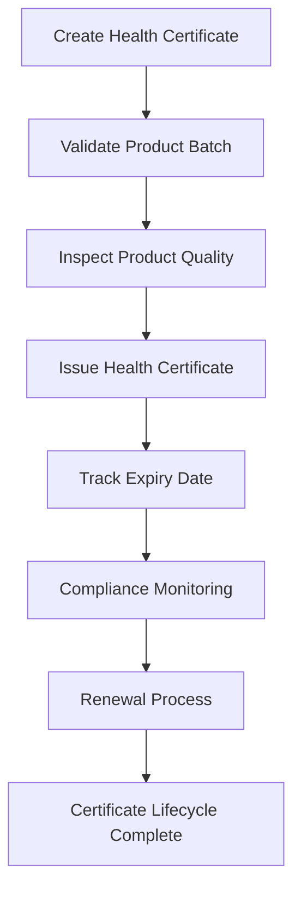

**Diagram sources**
- [HealthCertificate.php:13-28](file://app/Models/HealthCertificate.php#L13-L28)

### Medical Certificate Management
Medical certificates provide official documentation for various medical conditions, fitness for duty, disability, and other health-related certifications.

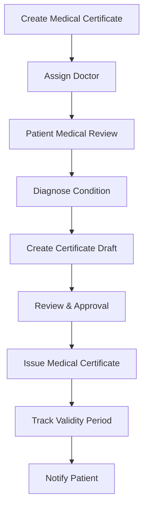

**Diagram sources**
- [MedicalCertificate.php:13-26](file://app/Models/MedicalCertificate.php#L13-L26)

**Section sources**
- [HealthCertificate.php:1-54](file://app/Models/HealthCertificate.php#L1-L54)
- [MedicalCertificate.php:1-49](file://app/Models/MedicalCertificate.php#L1-L49)

## Advanced EMR System Integration

### Enhanced EMR Analytics and SOAP Integration
The EMR system now includes advanced analytics capabilities, SOAP note validation, comprehensive patient timelines, and drug interaction checking.

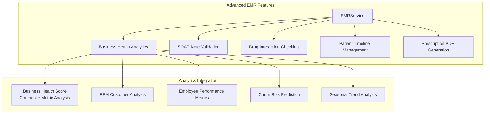

**Diagram sources**
- [EMRService.php:16-458](file://app/Services/EMRService.php#L16-L458)
- [AdvancedAnalyticsService.php:13-800](file://app/Services/AdvancedAnalyticsService.php#L13-L800)

### SOAP Note Management
The EMR system now supports comprehensive SOAP (Subjective, Objective, Assessment, Plan) note management with validation and completeness checking.

```mermaid
stateDiagram-v2
[*] --> Subjective
Subjective --> Objective
Objective --> Assessment
Assessment --> Plan
Plan --> [*]
SOAPValidation["SOAP Note Validation"]
SOAPValidation --> Complete["Note Complete"]
SOAPValidation --> Incomplete["Missing Required Fields"]
Complete --> [*]
Incomplete --> Subjective
```

**Diagram sources**
- [EMRService.php:164-221](file://app/Services/EMRService.php#L164-L221)

### Business Health Analytics Integration
Advanced analytics provide comprehensive business health scoring, customer segmentation, and performance metrics.

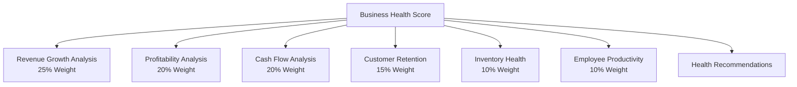

**Diagram sources**
- [AdvancedAnalyticsService.php:19-62](file://app/Services/AdvancedAnalyticsService.php#L19-L62)

**Section sources**
- [EMRService.php:1-458](file://app/Services/EMRService.php#L1-L458)
- [AdvancedAnalyticsService.php:1-800](file://app/Services/AdvancedAnalyticsService.php#L1-L800)

## Sophisticated Queue Management System

### Advanced Queue Positioning and Analytics
The queue management system now includes sophisticated positioning algorithms, real-time analytics, priority handling, and comprehensive performance metrics.

```mermaid
graph TB
subgraph "Queue Management System"
QueueManagement["QueueManagement Model"]
QueueTicket["QueueTicket Model"]
QueueService["QueueManagementService"]
QueueAnalytics["Queue Analytics"]
PrioritySystem["Priority Management"]
RealTimeDisplay["Real-Time Display"]
PerformanceMetrics["Performance Metrics"]
end
subgraph "Queue Positioning"
PositionCalc["Position Calculation<br/>Waiting Count + 1"]
AheadCalc["Ahead Count<br/>Patients Ahead"]
WaitCalc["Wait Time Calculation<br/>Ahead × Service Time"]
end
subgraph "Priority Handling"
PriorityTypes["Priority Types<br/>Emergency<br/>Geriatric<br/>VIP<br/>Regular"]
PriorityRecalc["Priority Recalculation<br/>After Service Completion"]
SkipHandling["Skip Handling<br/>3 Skips = No-Show"]
CancelHandling["Cancellation Handling<br/>Position Recalculation"]
end
QueueManagement --> PositionCalc
QueueManagement --> AheadCalc
QueueManagement --> WaitCalc
QueueManagement --> PriorityTypes
QueueManagement --> PriorityRecalc
QueueManagement --> SkipHandling
QueueManagement --> CancelHandling
QueueService --> QueueAnalytics
QueueService --> RealTimeDisplay
QueueService --> PerformanceMetrics
```

**Diagram sources**
- [QueueManagement.php:67-118](file://app/Models/QueueManagement.php#L67-L118)
- [QueueManagementService.php:317-347](file://app/Services/QueueManagementService.php#L317-L347)

### Real-Time Queue Display System
The system provides comprehensive real-time display capabilities for waiting rooms, counters, and administrative interfaces.

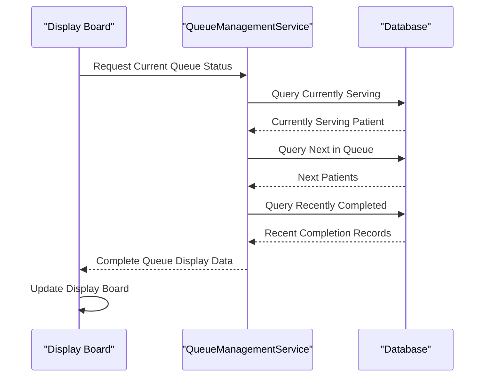

**Diagram sources**
- [QueueManagementService.php:282-312](file://app/Services/QueueManagementService.php#L282-L312)

### Queue Performance Analytics
Comprehensive analytics track queue performance, wait times, and operational efficiency.

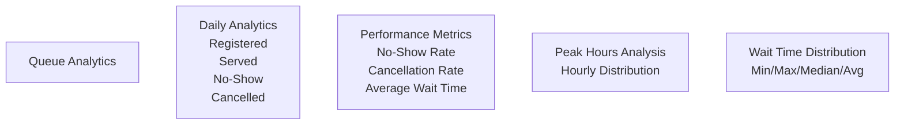

**Diagram sources**
- [QueueManagementService.php:352-428](file://app/Services/QueueManagementService.php#L352-L428)

**Section sources**
- [QueueManagement.php:1-282](file://app/Models/QueueManagement.php#L1-L282)
- [QueueTicket.php:1-55](file://app/Models/QueueTicket.php#L1-L55)
- [QueueManagementService.php:1-450](file://app/Services/QueueManagementService.php#L1-L450)

## Guided User Experience with AiTourSession

### Interactive Onboarding and Navigation
The AiTourSession model provides comprehensive guided user experience with interactive tours, progress tracking, and completion analytics.

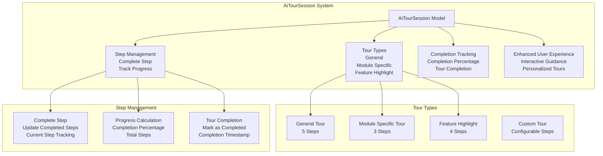

**Diagram sources**
- [AiTourSession.php:8-118](file://app/Models/AiTourSession.php#L8-L118)

### Tour Session Lifecycle Management
The system manages the complete lifecycle of guided tours from initiation to completion.

```mermaid
stateDiagram-v2
[*] --> Active
Active --> In_Progress : User Starts Tour
In_Progress --> Completed : All Steps Completed
Active --> Skipped : User Skips Tour
Active --> Cancelled : Admin Cancels
Completed --> [*]
Skipped --> [*]
Cancelled --> [*]
```

**Diagram sources**
- [AiTourSession.php:102-116](file://app/Models/AiTourSession.php#L102-L116)

**Section sources**
- [AiTourSession.php:1-118](file://app/Models/AiTourSession.php#L1-L118)

## Comprehensive Healthcare Analytics

### Advanced Analytics Suite
The healthcare analytics system provides comprehensive business intelligence, performance metrics, and operational insights.

```mermaid
graph TB
subgraph "Healthcare Analytics"
AdvancedAnalyticsService["AdvancedAnalyticsService"]
HospitalAnalyticsService["HospitalAnalyticsService"]
AnalyticsDashboard["Analytics Dashboard"]
ReportingSystem["Reporting System"]
PredictiveAnalytics["Predictive Analytics"]
PerformanceMetrics["Performance Metrics"]
BusinessIntelligence["Business Intelligence"]
end
subgraph "Advanced Analytics"
BusinessHealth["Business Health Score<br/>Composite Metric<br/>Weighted Components"]
RFMAnalysis["RFM Analysis<br/>Customer Segmentation<br/>Behavioral Insights"]
Productivity["Employee Productivity<br/>Performance Metrics<br/>Rankings"]
ChurnPrediction["Churn Prediction<br>Risk Scoring<br>Preventive Actions"]
Seasonal["Seasonal Analysis<br>Trend Analysis<br>Peak Season Detection"]
end
subgraph "Hospital Analytics"
BedOccupancy["Bed Occupancy Rate<br>BOR Calculation<br>Optimal Range"]
ALOS["Average Length of Stay<br>LOS Analysis<br>Clinical Efficiency"]
Mortality["Mortality Rate<br>Quality Metrics<br>Performance Monitoring"]
Infection["Infection Rate<br>HAI Monitoring<br>Quality Indicators"]
Revenue["Revenue Analytics<br>Department Analysis<br>Insurance Mix"]
Satisfaction["Patient Satisfaction<br>NPS Score<br>Quality Metrics"]
end
AdvancedAnalyticsService --> BusinessHealth
AdvancedAnalyticsService --> RFMAnalysis
AdvancedAnalyticsService --> Productivity
AdvancedAnalyticsService --> ChurnPrediction
AdvancedAnalyticsService --> Seasonal
HospitalAnalyticsService --> BedOccupancy
HospitalAnalyticsService --> ALOS
HospitalAnalyticsService --> Mortality
HospitalAnalyticsService --> Infection
HospitalAnalyticsService --> Revenue
HospitalAnalyticsService --> Satisfaction
```

**Diagram sources**
- [AdvancedAnalyticsService.php:13-800](file://app/Services/AdvancedAnalyticsService.php#L13-L800)
- [HospitalAnalyticsService.php:10-590](file://app/Services/HospitalAnalyticsService.php#L10-L590)

### Business Health Score Analysis
Comprehensive business health scoring provides a single metric for overall organizational performance.

```mermaid
graph TB
BusinessScore["Business Health Score"]
RevenueGrowth["Revenue Growth<br/>25% Weight<br/>Growth Rate Analysis"]
Profitability["Profitability<br/>20% Weight<br/>Margin Analysis"]
CashFlow["Cash Flow<br/>20% Weight<br/>Forecast Analysis"]
Retention["Customer Retention<br/>15% Weight<br/>Repeat Customer Analysis"]
Inventory["Inventory Health<br/>10% Weight<br/>Stock Optimization"]
Productivity["Employee Productivity<br/>10% Weight<br/>Performance Analysis"]
ScoreCalculation["Score Calculation<br/>Weighted Average<br/>Grade Assignment"]
Recommendations["Recommendations<br/>Performance Insights<br/>Actionable Advice"]
BusinessScore --> RevenueGrowth
BusinessScore --> Profitability
BusinessScore --> CashFlow
BusinessScore --> Retention
BusinessScore --> Inventory
BusinessScore --> Productivity
BusinessScore --> ScoreCalculation
ScoreCalculation --> Recommendations
```

**Diagram sources**
- [AdvancedAnalyticsService.php:19-62](file://app/Services/AdvancedAnalyticsService.php#L19-L62)

### Hospital Performance Metrics
Comprehensive hospital performance metrics track clinical quality, operational efficiency, and financial performance.

```mermaid
graph TB
HospitalMetrics["Hospital Performance Metrics"]
BedOccupancy["Bed Occupancy Rate<br/>60-85% Optimal<br>Capacity Planning"]
ALOS["Average Length of Stay<br/>3-7 Days Standard<br>Clinical Efficiency"]
Mortality["Mortality Rate<br/>< 3% Acceptable<br>Quality Monitoring"]
Infection["Infection Rate<br/>< 5 per 1000 PD<br>Quality Indicators"]
Revenue["Revenue Analytics<br/>Department Breakdown<br>Insurance Mix"]
Satisfaction["Patient Satisfaction<br/>NPS Score<br>Quality Metrics"]
Surgery["Surgery Metrics<br/>Cancellation Rate<br>Performance Analysis"]
```

**Diagram sources**
- [HospitalAnalyticsService.php:17-293](file://app/Services/HospitalAnalyticsService.php#L17-L293)

**Section sources**
- [AdvancedAnalyticsService.php:1-800](file://app/Services/AdvancedAnalyticsService.php#L1-L800)
- [HospitalAnalyticsService.php:1-590](file://app/Services/HospitalAnalyticsService.php#L1-L590)

## Advanced Healthcare Integration Services

### Comprehensive Integration Framework
The healthcare integration services provide extensive connectivity with external systems, including HL7/FHIR messaging, BPJS claim processing, lab equipment integration, and multi-channel notifications.

```mermaid
graph TB
subgraph "Healthcare Integration"
HealthcareIntegrationService["HealthcareIntegrationService"]
HL7Integration["HL7/FHIR Integration<br/>Message Processing<br/>Standards Compliance"]
BPJSIntegration["BPJS Integration<br/>Claim Processing<br/>Eligibility Checking"]
LabIntegration["Lab Equipment Integration<br/>Result Import<br/>Equipment Connectivity"]
NotificationSystem["Multi-Channel Notifications<br/>SMS/WhatsApp/Email<br/>Notification Management"]
APIIntegration["API Integration<br/>External System Connectivity<br/>Data Exchange"]
end
subgraph "HL7 Messaging"
HL7Outbound["Outbound Messages<br/>ADT/ORM/ORU/SIU<br/>Message Generation"]
HL7Inbound["Inbound Messages<br/>Message Parsing<br/>Processing Logic"]
HL7Acknowledgment["HL7 Acknowledgment<br/>AA/AR/CA Messages<br/>Response Handling"]
HL7Validation["HL7 Validation<br/>Message Structure<br/>Standards Compliance"]
end
subgraph "BPJS Integration"
BPJSClaims["BPJS Claims<br/>Claim Submission<br/>Status Tracking"]
EligibilityCheck["Eligibility Checking<br/>Member Verification<br/>Coverage Validation"]
VClaimAPI["V-Claim API<br/>Integration<br/>Real-time Processing"]
SignatureGeneration["Signature Generation<br/>HMAC SHA256<br/>Security"]
end
subgraph "Lab Integration"
EquipmentRegistration["Equipment Registration<br/>ASTM/HL7/API<br/>Connection Setup"]
ResultImport["Result Import<br/>Test Code Mapping<br/>Quality Control"]
EquipmentMonitoring["Equipment Monitoring<br/>Connection Status<br/>Polling Intervals"]
```

**Diagram sources**
- [HealthcareIntegrationService.php:15-591](file://app/Services/HealthcareIntegrationService.php#L15-L591)

### HL7/FHIR Message Processing
Comprehensive HL7 message processing supports all major message types with validation, parsing, and response handling.

```mermaid
sequenceDiagram
participant ExternalSystem as "External System"
participant IntegrationSvc as "HealthcareIntegrationService"
participant HL7Message as "HL7Message Model"
participant Parser as "HL7 Parser"
participant Handler as "Message Handler"
ExternalSystem->>IntegrationSvc : Send HL7 Message
IntegrationSvc->>Parser : Parse Raw Message
Parser-->>IntegrationSvc : Parsed Data
IntegrationSvc->>HL7Message : Create Message Record
IntegrationSvc->>Handler : Process Message
Handler-->>IntegrationSvc : Processing Result
IntegrationSvc->>HL7Message : Update Status
IntegrationSvc-->>ExternalSystem : Send Acknowledgment
```

**Diagram sources**
- [HealthcareIntegrationService.php:20-104](file://app/Services/HealthcareIntegrationService.php#L20-L104)

### BPJS Claim Processing
Complete BPJS claim processing with eligibility checking, claim submission, and status tracking.

```mermaid
sequenceDiagram
participant HospitalSystem as "Hospital System"
participant IntegrationSvc as "HealthcareIntegrationService"
participant BPJSAPI as "BPJS V-Claim API"
participant BPJSClaim as "BPJSClaim Model"
HospitalSystem->>IntegrationSvc : Submit Claim
IntegrationSvc->>BPJSClaim : Create Claim Record
IntegrationSvc->>BPJSAPI : Submit to V-Claim
BPJSAPI-->>IntegrationSvc : Response
IntegrationSvc->>BPJSClaim : Update Claim Status
IntegrationSvc-->>HospitalSystem : Claim Submission Result
```

**Diagram sources**
- [HealthcareIntegrationService.php:109-160](file://app/Services/HealthcareIntegrationService.php#L109-L160)

**Section sources**
- [HealthcareIntegrationService.php:1-591](file://app/Services/HealthcareIntegrationService.php#L1-L591)

## Enhanced Bed Management and Emergency Operations

### Advanced Bed Management Analytics
Enhanced bed management includes comprehensive occupancy tracking, utilization analysis, and operational efficiency metrics.

```mermaid
graph TB
subgraph "Bed Management Analytics"
BedOccupancy["Bed Occupancy Rate<br/>BOR Calculation<br/>Capacity Planning"]
ALOS["Average Length of Stay<br/>LOS Analysis<br/>Clinical Efficiency"]
Turnover["Patient Turnover Rate<br>Admission/Discharge Analysis"]
Utilization["Doctor Utilization Rate<br>Consultation Hours<br>Resource Allocation"]
Revenue["Revenue per Patient<br>Financial Performance<br>Value Analysis"]
Mortality["Mortality Rate<br>Quality Metrics<br>Performance Monitoring"]
Infection["Infection Rate<br>HAI Monitoring<br>Quality Indicators"]
Readmission["Readmission Rate<br>Quality Care<br>Outcome Analysis"]
Surgery["Surgery Cancellation Rate<br>Operational Efficiency<br>Resource Planning"]
Satisfaction["Patient Satisfaction<br>NPS Score<br>Quality Metrics"]
end
subgraph "Analytics Calculation"
BORCalc["BOR Calculation<br/>Occupied Beds / Total Beds"]
ALOSCalc["ALOS Calculation<br/>Total Patient Days / Discharges"]
TurnoverCalc["Turnover Calculation<br/>Discharges / Admissions"]
UtilizationCalc["Utilization Calculation<br/>Consultation Hours / Available Hours"]
RevenueCalc["Revenue Calculation<br/>Total Revenue / Unique Patients"]
MortalityCalc["Mortality Calculation<br/>Deaths / Discharges"]
InfectionCalc["Infection Calculation<br/>HAI Cases / Patient Days"]
ReadmissionCalc["Readmission Calculation<br/>30-day Readmissions / Discharges"]
SurgeryCalc["Surgery Calculation<br/>Cancelled / Scheduled Surgeries"]
SatisfactionCalc["Satisfaction Calculation<br/>Average Ratings / NPS"]
end
BedOccupancy --> BORCalc
ALOS --> ALOSCalc
Turnover --> TurnoverCalc
Utilization --> UtilizationCalc
Revenue --> RevenueCalc
Mortality --> MortalityCalc
Infection --> InfectionCalc
Readmission --> ReadmissionCalc
Surgery --> SurgeryCalc
Satisfaction --> SatisfactionCalc
```

**Diagram sources**
- [HospitalAnalyticsService.php:17-293](file://app/Services/HospitalAnalyticsService.php#L17-L293)

### Emergency Department Operations
Comprehensive emergency department operations with advanced analytics and performance tracking.

```mermaid
graph TB
subgraph "Emergency Operations"
EmergencyDashboard["Emergency Dashboard<br/>Real-time Tracking<br/>Performance Metrics"]
TriageAssessment["Triage Assessment<br>Priority Classification<br>Critical Care Tracking"]
PatientFlow["Patient Flow<br>Throughput Analysis<br>Wait Time Monitoring"]
ResourceAllocation["Resource Allocation<br>Staffing Levels<br>Bed Availability"]
QualityMetrics["Quality Metrics<br>Mortality Rates<br>Infection Control"]
FinancialAnalytics["Financial Analytics<br>Revenue Streams<br>Cost Analysis"]
```

**Diagram sources**
- [EmergencyController.php:1-200](file://app/Http/Controllers/Healthcare/EmergencyController.php#L1-L200)

**Section sources**
- [HospitalAnalyticsService.php:1-590](file://app/Services/HospitalAnalyticsService.php#L1-L590)

## Healthcare Education and Training Management

### Health Education Program Management
The healthcare education system manages educational programs, training modules, certification tracking, and competency assessments.

```mermaid
graph TB
subgraph "Health Education Management"
HealthEducationController["HealthEducationController"]
EducationPrograms["Education Programs<br/>Curriculum Development<br>Course Catalog"]
TrainingModules["Training Modules<br/>Interactive Learning<br>Assessment Tools"]
CertificationTracking["Certification Tracking<br>Competency Validation<br>Continuing Education"]
AssessmentSystem["Assessment System<br>Knowledge Testing<br>Performance Evaluation"]
LearningAnalytics["Learning Analytics<br>Progress Tracking<br>Completion Metrics"]
```

**Diagram sources**
- [HealthEducationController.php:1-200](file://app/Http/Controllers/Healthcare/HealthEducationController.php#L1-L200)

**Section sources**
- [HealthEducationController.php:1-200](file://app/Http/Controllers/Healthcare/HealthEducationController.php#L1-L200)

## Dependency Analysis
The module exhibits clear separation of concerns with enhanced integration capabilities:
- Controllers depend on Services for business logic.
- Services encapsulate transactions, validations, and external integrations.
- Configuration drives security, compliance, and operational policies.
- Routes define cohesive groupings per domain.
- **Enhanced Telemedicine Dependencies**: Specialized services handle video integration, feedback collection, reminders, and tenant configuration management.
- **Advanced Analytics Dependencies**: Comprehensive analytics services integrate with healthcare operations for performance monitoring.
- **Healthcare Certificate Dependencies**: Certificate management integrates with patient records and compliance systems.
- **Queue Management Dependencies**: Sophisticated queue algorithms integrate with appointment scheduling and bed management.
- **Integration Dependencies**: Extensive integration services connect with external healthcare systems and government APIs.

```mermaid
graph LR
Routes["routes/healthcare.php"] --> Controllers["Controllers"]
Controllers --> Services["Services"]
Services --> Models["Models"]
Services --> Config["config/healthcare.php"]
TeleMedServices["Telemedicine Services"] --> Services
TeleMedServices --> TeleModels["Telemedicine Models"]
AdvancedAnalytics["Advanced Analytics"] --> Services
HealthcareIntegration["Healthcare Integration"] --> Services
CertificateManagement["Certificate Management"] --> Services
QueueManagement["Queue Management"] --> Services
```

**Diagram sources**
- [healthcare.php:1-563](file://routes/healthcare.php#L1-L563)
- [healthcare.php:1-251](file://config/healthcare.php#L1-L251)

**Section sources**
- [healthcare.php:1-563](file://routes/healthcare.php#L1-L563)
- [healthcare.php:1-251](file://config/healthcare.php#L1-L251)

## Performance Considerations
- Caching: Patient statistics are cached to reduce repeated queries.
- Pagination: Controllers paginate lists to limit payload sizes.
- Transactions: Services wrap critical operations to maintain consistency.
- Indexing: Ensure database indexes on frequently filtered fields (e.g., patient_id, appointment_date).
- Asynchronous jobs: Consider offloading heavy tasks (e.g., notifications, backups) to queued jobs.
- **Telemedicine Optimization**: Video streaming optimization, JWT token caching, and recording storage management for telemedicine services.
- **Advanced Analytics**: Implement caching strategies for complex analytics calculations and consider background processing for intensive computations.
- **Queue Management**: Optimize queue positioning algorithms and implement efficient database queries for real-time queue status.
- **Integration Services**: Implement retry mechanisms and circuit breakers for external system integrations.
- **Certificate Management**: Optimize certificate validation processes and implement automated expiry notifications.

## Troubleshooting Guide
Common issues and resolutions:
- Access Denied: Verify roles and assignments; after-hours access requires justification; emergency access is time-limited.
- Data Retention: Confirm retention periods for records, logs, and claims align with compliance requirements.
- Notifications: Ensure notification channels (email/SMS/Push) are configured; quiet hours can suppress non-critical alerts.
- Audit Logs: Enable database and file logging; anonymization can be toggled for compliance.
- Patient Deletion: Cannot delete patients with existing visits or records; archive or migrate data first.
- **Telemedicine Issues**: 
  - Jitsi Connection: Test server accessibility using the settings interface; verify firewall and SSL certificate configurations.
  - JWT Authentication: Ensure Firebase JWT package is installed and secret keys are properly configured for self-hosted Jitsi instances.
  - Recording Problems: Verify recording permissions and storage configuration; check Jibri service availability for self-hosted setups.
  - Feedback Collection: Ensure feedback forms are properly configured and tenant-specific settings are correctly applied.
- **Advanced Analytics Issues**:
  - Performance Degradation: Implement caching for frequently accessed analytics data; optimize database queries for complex calculations.
  - Data Accuracy: Verify data sources and ensure proper data synchronization between systems.
  - Calculation Errors: Validate mathematical formulas and implement error handling for edge cases.
- **Queue Management Issues**:
  - Position Calculation Errors: Verify queue positioning algorithms and ensure proper handling of priority patients.
  - Real-time Display Problems: Check database connections and implement fallback mechanisms for display systems.
  - Performance Bottlenecks: Optimize queue queries and implement efficient indexing strategies.
- **Integration Issues**:
  - HL7 Message Failures: Verify message formatting and implement proper error handling for malformed messages.
  - BPJS Integration Problems: Check API credentials and network connectivity; implement retry mechanisms for failed submissions.
  - Lab Equipment Integration: Verify equipment connectivity and test communication protocols.
- **Certificate Management Issues**:
  - Certificate Validation Failures: Ensure proper certificate templates and validation rules are configured.
  - Expiry Notifications: Verify notification settings and test alert mechanisms.
  - Data Synchronization: Implement proper data mapping between certificate systems and patient records.

**Section sources**
- [healthcare.php:71-250](file://config/healthcare.php#L71-L250)

## Conclusion
The Healthcare Management Module provides a robust, configurable, and compliant platform for managing clinical workflows, administrative processes, and regulatory obligations. Its modular design, strong service-layer logic, and comprehensive configuration enable seamless integration with HL7, medical equipment, and healthcare reporting systems while maintaining HIPAA-aligned security and privacy controls. The enhanced telemedicine platform delivers a comprehensive virtual healthcare solution with integrated video consultations, advanced workflow management, and tenant-specific customization capabilities. The addition of comprehensive healthcare certificate management, advanced analytics, sophisticated queue management, guided user experience through AiTourSession, and extensive integration services makes this module a complete solution for modern healthcare delivery. The system's scalability, performance optimizations, and comprehensive troubleshooting capabilities ensure reliable operation in demanding healthcare environments.