# Healthcare Management Module

<cite>
**Referenced Files in This Document**
- [healthcare.php](file://routes/healthcare.php)
- [healthcare.php](file://config/healthcare.php)
- [PatientController.php](file://app/Http/Controllers/Healthcare/PatientController.php)
- [EMRController.php](file://app/Http/Controllers/Healthcare/EMRController.php)
- [PatientService.php](file://app/Services/PatientService.php)
- [AppointmentSchedulingService.php](file://app/Services/AppointmentSchedulingService.php)
- [MedicalBillingService.php](file://app/Services/MedicalBillingService.php)
- [LaboratoryService.php](file://app/Services/LaboratoryService.php)
- [PharmacyService.php](file://app/Services/PharmacyService.php)
- [RegulatoryComplianceService.php](file://app/Services/RegulatoryComplianceService.php)
</cite>

## Table of Contents
1. [Introduction](#introduction)
2. [Project Structure](#project-structure)
3. [Core Components](#core-components)
4. [Architecture Overview](#architecture-overview)
5. [Detailed Component Analysis](#detailed-component-analysis)
6. [Dependency Analysis](#dependency-analysis)
7. [Performance Considerations](#performance-considerations)
8. [Troubleshooting Guide](#troubleshooting-guide)
9. [Conclusion](#conclusion)

## Introduction
This document provides comprehensive documentation for the Healthcare Management Module, covering Electronic Medical Record (EMR) integration, patient management workflows, appointment scheduling with queue management, medical billing and insurance claim processing, laboratory and radiology workflow management, pharmacy dispensing operations, and healthcare compliance features. It also documents integrations with HL7 standards, medical equipment connectivity, bed management, emergency department operations, healthcare analytics dashboards, regulatory compliance features, patient portal functionality, telemedicine capabilities, and healthcare reporting requirements.

## Project Structure
The Healthcare Management Module is organized around Laravel controllers, services, and routes grouped by functional domains. The routing file defines endpoints for patients, EMR, admissions/beds, queues, emergency, pharmacy, laboratory, radiology, billing, telemedicine, resource management, inventory, analytics, compliance, and integration. Configuration settings govern business hours, security, compliance, audit trails, role-based access control, patient portal features, emergency access, data retention, and notification preferences.

```mermaid
graph TB
subgraph "Routing Layer"
Routes["routes/healthcare.php"]
end
subgraph "Controllers"
PatientCtrl["Healthcare\\PatientController"]
EMRCtrl["Healthcare\\EMRController"]
AppointmentCtrl["Healthcare\\AppointmentController"]
BillingCtrl["Healthcare\\BillingController"]
LabCtrl["Healthcare\\LaboratoryController"]
RadCtrl["Healthcare\\RadiologyController"]
PharmacyCtrl["Healthcare\\PharmacyController"]
ERCtrl["Healthcare\\EmergencyController"]
QueueCtrl["Healthcare\\QueueController"]
ComplianceCtrl["Healthcare\\ComplianceController"]
IntegrationCtrl["Healthcare\\IntegrationController"]
end
subgraph "Services"
PatientSvc["PatientService"]
AppointmentSvc["AppointmentSchedulingService"]
MedicalBillingSvc["MedicalBillingService"]
LabSvc["LaboratoryService"]
PharmacySvc["PharmacyService"]
ComplianceSvc["RegulatoryComplianceService"]
end
Routes --> PatientCtrl
Routes --> EMRCtrl
Routes --> AppointmentCtrl
Routes --> BillingCtrl
Routes --> LabCtrl
Routes --> RadCtrl
Routes --> PharmacyCtrl
Routes --> ERCtrl
Routes --> QueueCtrl
Routes --> ComplianceCtrl
Routes --> IntegrationCtrl
PatientCtrl --> PatientSvc
EMRCtrl --> PatientSvc
AppointmentCtrl --> AppointmentSvc
BillingCtrl --> MedicalBillingSvc
LabCtrl --> LabSvc
PharmacyCtrl --> PharmacySvc
ComplianceCtrl --> ComplianceSvc
IntegrationCtrl --> ComplianceSvc
```

**Diagram sources**
- [healthcare.php:1-538](file://routes/healthcare.php#L1-L538)
- [PatientController.php:1-363](file://app/Http/Controllers/Healthcare/PatientController.php#L1-L363)
- [EMRController.php:1-248](file://app/Http/Controllers/Healthcare/EMRController.php#L1-L248)
- [PatientService.php:1-485](file://app/Services/PatientService.php#L1-L485)
- [AppointmentSchedulingService.php:1-408](file://app/Services/AppointmentSchedulingService.php#L1-L408)
- [MedicalBillingService.php:1-563](file://app/Services/MedicalBillingService.php#L1-L563)
- [LaboratoryService.php:1-509](file://app/Services/LaboratoryService.php#L1-L509)
- [PharmacyService.php:1-363](file://app/Services/PharmacyService.php#L1-L363)
- [RegulatoryComplianceService.php:1-581](file://app/Services/RegulatoryComplianceService.php#L1-L581)

**Section sources**
- [healthcare.php:1-538](file://routes/healthcare.php#L1-L538)
- [healthcare.php:1-251](file://config/healthcare.php#L1-L251)

## Core Components
- Patient Management: End-to-end patient lifecycle including creation, updates, search, and retrieval of medical records, visits, appointments, prescriptions, and lab results. QR code generation and timeline aggregation are supported.
- EMR Integration: Centralized medical record management with diagnosis, prescriptions, lab orders, and export capabilities.
- Appointment Scheduling: Doctor availability validation, conflict detection, schedule creation, rescheduling, reminders, and slot availability calculation.
- Medical Billing & Claims: Bill generation, itemization, insurance claim creation, adjudication, copayment collection, payment plans, and aging reports.
- Laboratory & Radiology: Sample collection, processing, result entry, verification, critical value handling, equipment calibration, QC logs, and PACS-like study viewing.
- Pharmacy Operations: Stock management, dispensing with drug interaction checks, FIFO/FEFO stock deduction, low/expiration alerts, and analytics.
- Compliance & Security: HIPAA-compliant access logging, RBAC enforcement, audit trails, anonymization requests, backups, disaster recovery, and suspicious activity monitoring.
- Queuing & Emergency: Queue number assignment, call management, triage, emergency throughput, and critical alerts.
- Analytics & Reporting: Dashboards for billing, laboratory, pharmacy, and compliance metrics with export capabilities.

**Section sources**
- [PatientController.php:1-363](file://app/Http/Controllers/Healthcare/PatientController.php#L1-L363)
- [EMRController.php:1-248](file://app/Http/Controllers/Healthcare/EMRController.php#L1-L248)
- [PatientService.php:1-485](file://app/Services/PatientService.php#L1-L485)
- [AppointmentSchedulingService.php:1-408](file://app/Services/AppointmentSchedulingService.php#L1-L408)
- [MedicalBillingService.php:1-563](file://app/Services/MedicalBillingService.php#L1-L563)
- [LaboratoryService.php:1-509](file://app/Services/LaboratoryService.php#L1-L509)
- [PharmacyService.php:1-363](file://app/Services/PharmacyService.php#L1-L363)
- [RegulatoryComplianceService.php:1-581](file://app/Services/RegulatoryComplianceService.php#L1-L581)

## Architecture Overview
The module follows a layered architecture:
- Routing: Defines RESTful endpoints grouped by domain.
- Controllers: Handle HTTP requests, orchestrate service calls, and render views or JSON responses.
- Services: Encapsulate business logic with transactional guarantees, validations, and integrations.
- Models: Represent entities and relationships (patients, visits, records, bills, claims, lab samples, prescriptions, etc.).
- Configuration: Centralized healthcare-specific settings for security, compliance, business hours, notifications, and portal features.

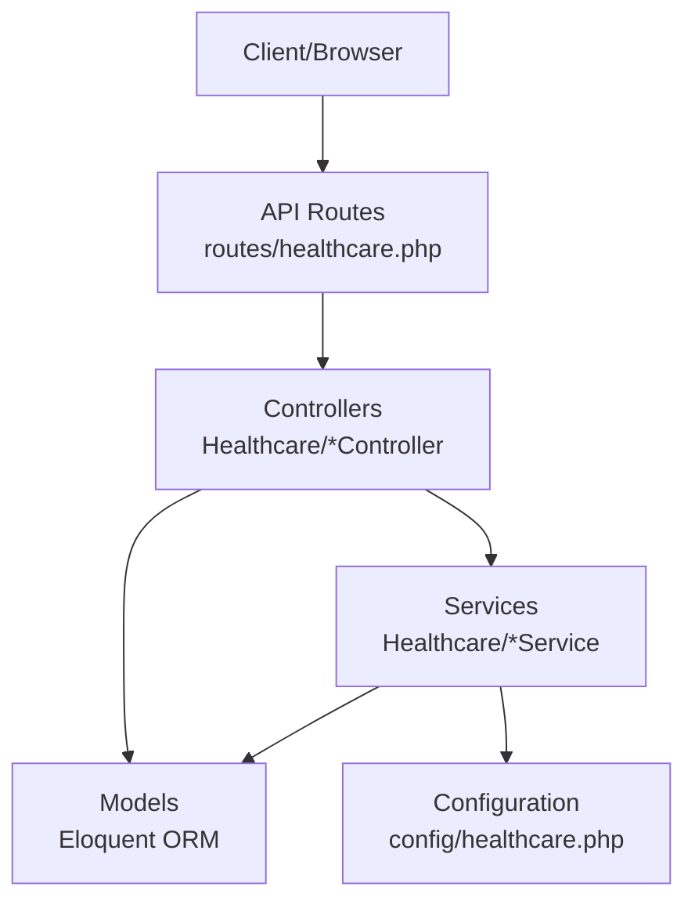

**Diagram sources**
- [healthcare.php:1-538](file://routes/healthcare.php#L1-L538)
- [healthcare.php:1-251](file://config/healthcare.php#L1-L251)

## Detailed Component Analysis

### Patient Management Workflow
The patient management workflow supports full CRUD operations, filtering, search, and aggregation of related data (visits, records, appointments, prescriptions, lab results). Statistics are cached for performance, and QR code generation is supported for quick identification.

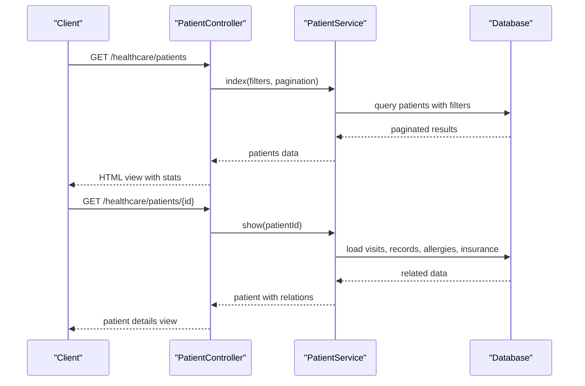

**Diagram sources**
- [PatientController.php:1-363](file://app/Http/Controllers/Healthcare/PatientController.php#L1-L363)
- [PatientService.php:1-485](file://app/Services/PatientService.php#L1-L485)

**Section sources**
- [PatientController.php:1-363](file://app/Http/Controllers/Healthcare/PatientController.php#L1-L363)
- [PatientService.php:1-485](file://app/Services/PatientService.php#L1-L485)

### EMR Integration
The EMR module centralizes clinical documentation, allowing diagnosis addition, prescription creation, and lab order initiation directly from a patient’s record. Timeline aggregation and export capabilities support interoperability and auditability.

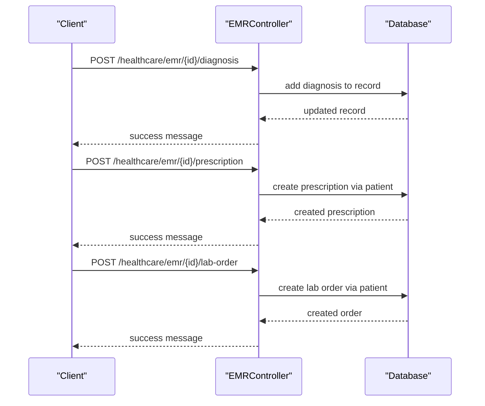

**Diagram sources**
- [EMRController.php:1-248](file://app/Http/Controllers/Healthcare/EMRController.php#L1-L248)

**Section sources**
- [EMRController.php:1-248](file://app/Http/Controllers/Healthcare/EMRController.php#L1-L248)

### Appointment Scheduling with Queue Management
The scheduling service validates doctor availability, prevents conflicts, auto-creates schedules, and manages rescheduling and reminders. Queue management supports number assignment, calling, skipping, and analytics.

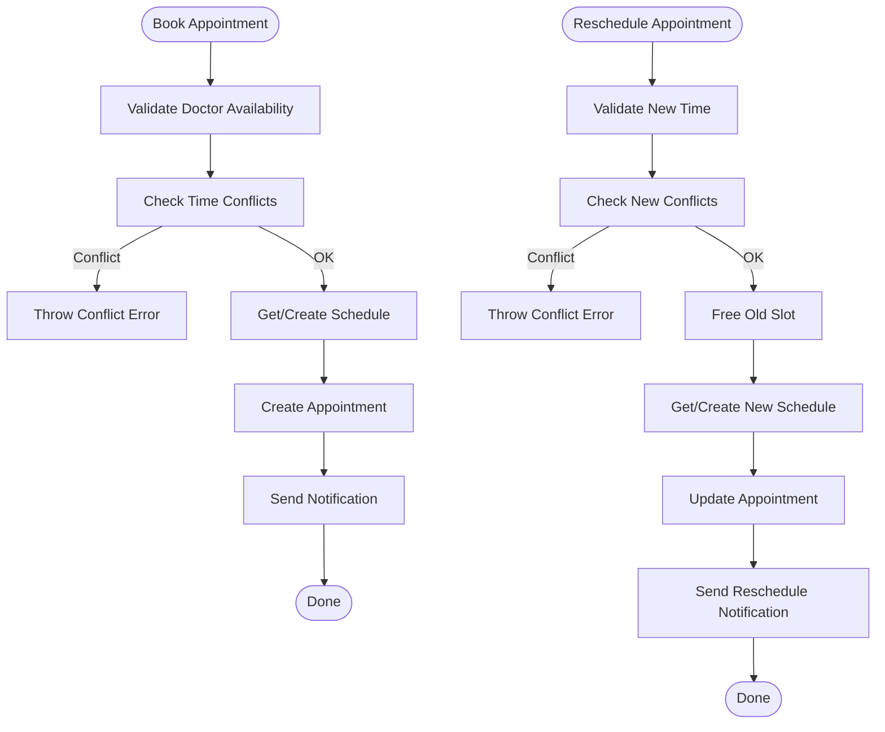

**Diagram sources**
- [AppointmentSchedulingService.php:1-408](file://app/Services/AppointmentSchedulingService.php#L1-L408)

**Section sources**
- [AppointmentSchedulingService.php:1-408](file://app/Services/AppointmentSchedulingService.php#L1-L408)

### Medical Billing and Insurance Claim Processing
The billing service generates bills, adds items, finalizes invoices, creates insurance claims, submits them, processes adjudications, collects copayments, and manages payment plans. Aging reports and dashboard metrics are provided.

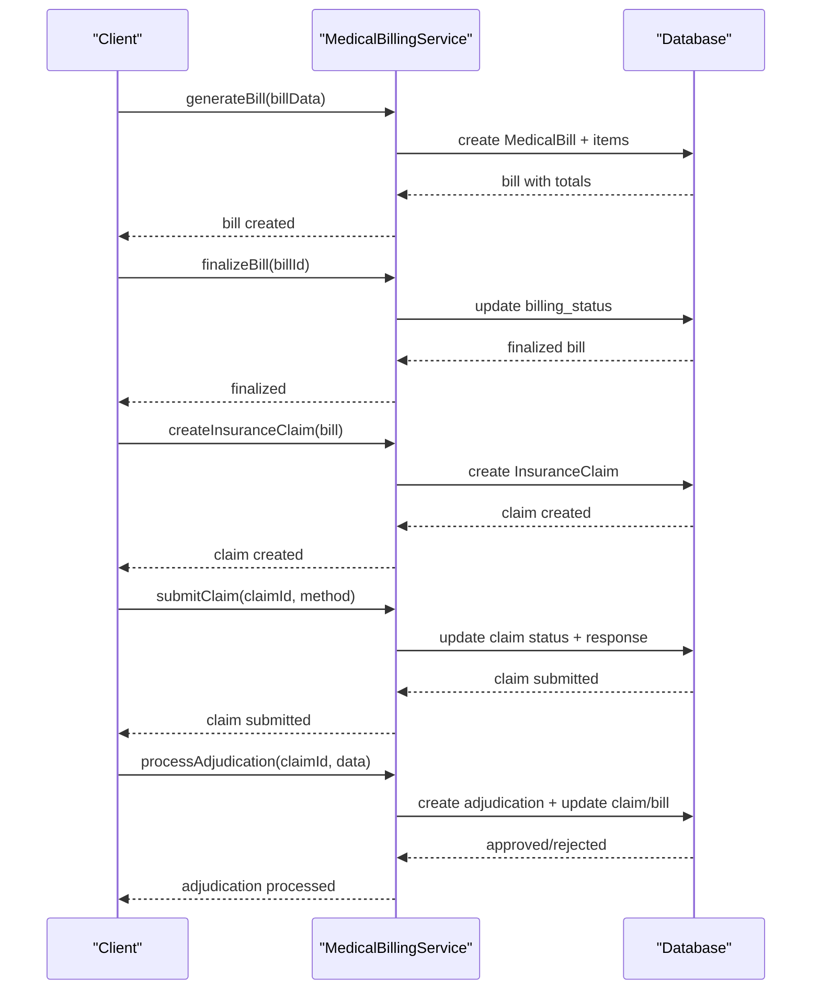

**Diagram sources**
- [MedicalBillingService.php:1-563](file://app/Services/MedicalBillingService.php#L1-L563)

**Section sources**
- [MedicalBillingService.php:1-563](file://app/Services/MedicalBillingService.php#L1-L563)

### Laboratory Workflow Management
Laboratory operations include sample creation, receipt, processing, result entry with automatic abnormality flags, verification, completion, QC logging, equipment calibration, and critical value escalation.

**Diagram sources**
- [LaboratoryService.php:1-509](file://app/Services/LaboratoryService.php#L1-L509)

**Section sources**
- [LaboratoryService.php:1-509](file://app/Services/LaboratoryService.php#L1-L509)

### Pharmacy Dispensing Operations
Pharmacy operations manage stock receipts, dispensing with drug interaction checks, FIFO/FEFO stock deduction, low stock and expiration alerts, and daily analytics.

**Diagram sources**
- [PharmacyService.php:1-363](file://app/Services/PharmacyService.php#L1-L363)

**Section sources**
- [PharmacyService.php:1-363](file://app/Services/PharmacyService.php#L1-L363)

### Healthcare Compliance Features
Compliance services enforce HIPAA-compliant access logging, RBAC checks, anonymization requests, backup creation with encryption, disaster recovery logging, and suspicious activity monitoring.

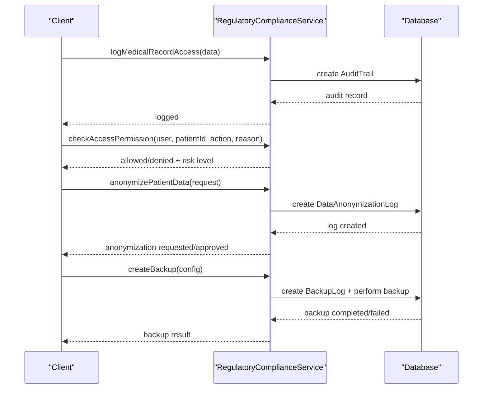

**Diagram sources**
- [RegulatoryComplianceService.php:1-581](file://app/Services/RegulatoryComplianceService.php#L1-L581)

**Section sources**
- [RegulatoryComplianceService.php:1-581](file://app/Services/RegulatoryComplianceService.php#L1-L581)

### Bed Management and Emergency Department Operations
Bed management supports ward and bed operations, admission/discharge/transfers, rounds recording, occupancy reporting, and dashboard views. Emergency operations include triage assessment, patient tracking, critical alerts, throughput analytics, and admission decisions.

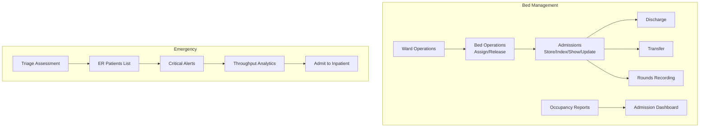

**Diagram sources**
- [healthcare.php:140-201](file://routes/healthcare.php#L140-L201)

**Section sources**
- [healthcare.php:140-201](file://routes/healthcare.php#L140-L201)

### Telemedicine Capabilities
Telemedicine endpoints enable consultation booking, joining rooms, starting and ending consultations, adding prescriptions, feedback collection, payment processing, and refund handling with provider callbacks.

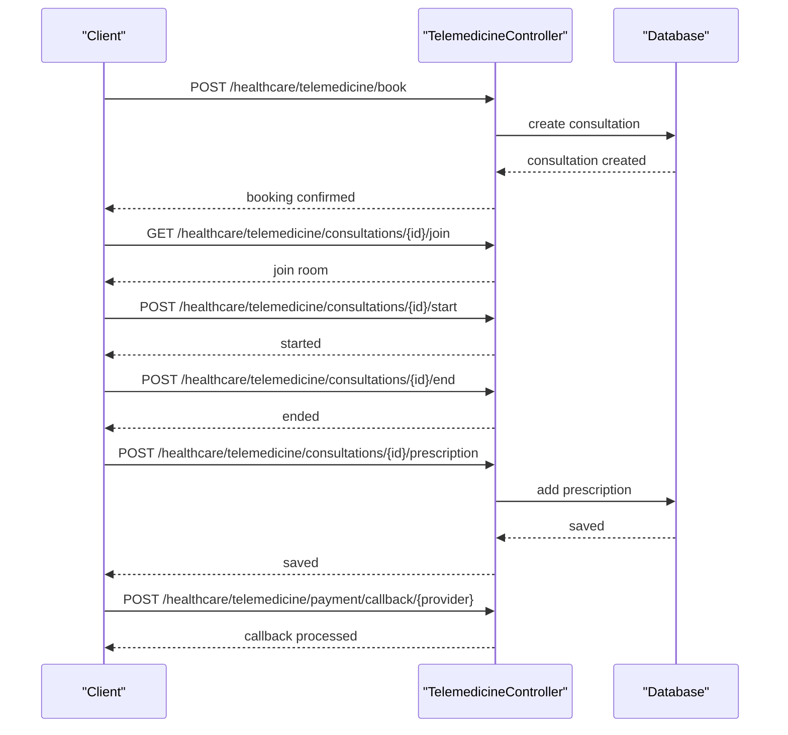

**Diagram sources**
- [healthcare.php:286-306](file://routes/healthcare.php#L286-L306)

**Section sources**
- [healthcare.php:286-306](file://routes/healthcare.php#L286-L306)

### Healthcare Analytics Dashboards
Analytics endpoints provide KPIs, length of stay, mortality, infection rates, financial metrics, satisfaction scores, and reporting exports. Dashboards aggregate real-time data for decision-making.

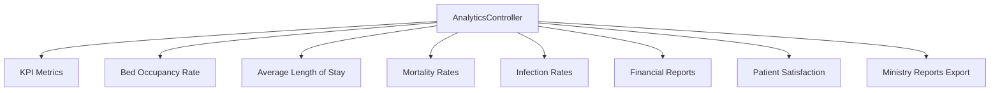

**Diagram sources**
- [healthcare.php:349-360](file://routes/healthcare.php#L349-L360)

**Section sources**
- [healthcare.php:349-360](file://routes/healthcare.php#L349-L360)

### HL7 Integration and Medical Equipment Connectivity
Integration endpoints support receiving HL7 messages, submitting BPJS claims, polling lab equipment, sending notifications, and managing equipment maintenance logs and calibration.

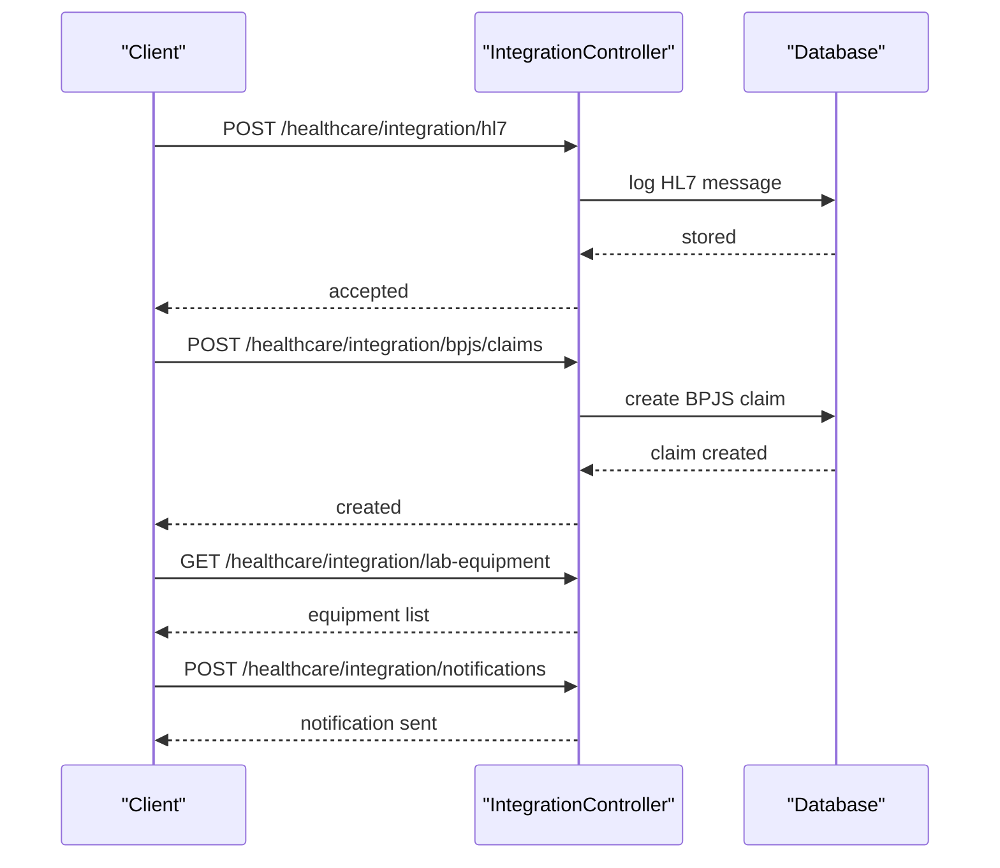

**Diagram sources**
- [healthcare.php:383-392](file://routes/healthcare.php#L383-L392)

**Section sources**
- [healthcare.php:383-392](file://routes/healthcare.php#L383-L392)

### Patient Portal Functionality
The patient portal enables self-service access to medical records, appointments, lab results, prescriptions, billing, certificates, messaging, and health education content.

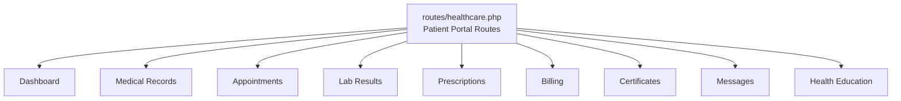

**Diagram sources**
- [healthcare.php:521-537](file://routes/healthcare.php#L521-L537)

**Section sources**
- [healthcare.php:521-537](file://routes/healthcare.php#L521-L537)

## Dependency Analysis
The module exhibits clear separation of concerns:
- Controllers depend on Services for business logic.
- Services encapsulate transactions, validations, and external integrations.
- Configuration drives security, compliance, and operational policies.
- Routes define cohesive groupings per domain.

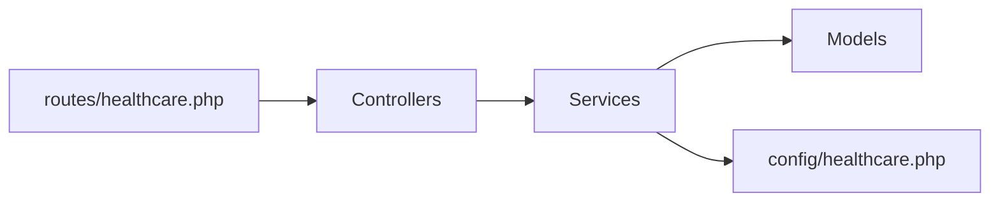

**Diagram sources**
- [healthcare.php:1-538](file://routes/healthcare.php#L1-L538)
- [healthcare.php:1-251](file://config/healthcare.php#L1-L251)

**Section sources**
- [healthcare.php:1-538](file://routes/healthcare.php#L1-L538)
- [healthcare.php:1-251](file://config/healthcare.php#L1-L251)

## Performance Considerations
- Caching: Patient statistics are cached to reduce repeated queries.
- Pagination: Controllers paginate lists to limit payload sizes.
- Transactions: Services wrap critical operations to maintain consistency.
- Indexing: Ensure database indexes on frequently filtered fields (e.g., patient_id, appointment_date).
- Asynchronous jobs: Consider offloading heavy tasks (e.g., notifications, backups) to queued jobs.

[No sources needed since this section provides general guidance]

## Troubleshooting Guide
Common issues and resolutions:
- Access Denied: Verify roles and assignments; after-hours access requires justification; emergency access is time-limited.
- Data Retention: Confirm retention periods for records, logs, and claims align with compliance requirements.
- Notifications: Ensure notification channels (email/SMS/Push) are configured; quiet hours can suppress non-critical alerts.
- Audit Logs: Enable database and file logging; anonymization can be toggled for compliance.
- Patient Deletion: Cannot delete patients with existing visits or records; archive or migrate data first.

**Section sources**
- [healthcare.php:71-250](file://config/healthcare.php#L71-L250)

## Conclusion
The Healthcare Management Module provides a robust, configurable, and compliant platform for managing clinical workflows, administrative processes, and regulatory obligations. Its modular design, strong service-layer logic, and comprehensive configuration enable seamless integration with HL7, medical equipment, and healthcare reporting systems while maintaining HIPAA-aligned security and privacy controls.