# Healthcare Telemedicine Platform

<cite>
**Referenced Files in This Document**
- [routes/healthcare.php](file://routes/healthcare.php)
- [config/healthcare.php](file://config/healthcare.php)
- [app/Http/Controllers/Healthcare/TelemedicineController.php](file://app/Http/Controllers/Healthcare/TelemedicineController.php)
- [app/Services/TelemedicineService.php](file://app/Services/TelemedicineService.php)
- [app/Services/TelemedicineVideoService.php](file://app/Services/TelemedicineVideoService.php)
- [app/Models/TelemedicineSetting.php](file://app/Models/TelemedicineSetting.php)
- [app/Models/Patient.php](file://app/Models/Patient.php)
- [app/Models/Doctor.php](file://app/Models/Doctor.php)
- [app/Models/Appointment.php](file://app/Models/Appointment.php)
</cite>

## Update Summary
**Changes Made**
- Enhanced video room management with comprehensive JWT token generation capabilities
- Added recording management system with encryption and expiration controls
- Expanded feedback collection system with detailed quality metrics
- Integrated EMR dashboard functionality for comprehensive patient care coordination
- Strengthened payment processing integration with multiple gateway support
- Improved administrative dashboard with real-time consultation statistics

## Table of Contents
1. [Introduction](#introduction)
2. [Project Structure](#project-structure)
3. [Core Components](#core-components)
4. [Architecture Overview](#architecture-overview)
5. [Detailed Component Analysis](#detailed-component-analysis)
6. [Enhanced Video Room Management](#enhanced-video-room-management)
7. [Advanced Recording Capabilities](#advanced-recording-capabilities)
8. [Comprehensive Feedback Systems](#comprehensive-feedback-systems)
9. [EMR Dashboard Integration](#emr-dashboard-integration)
10. [Payment Processing Enhancements](#payment-processing-enhancements)
11. [Administrative Dashboard Features](#administrative-dashboard-features)
12. [Dependency Analysis](#dependency-analysis)
13. [Performance Considerations](#performance-considerations)
14. [Troubleshooting Guide](#troubleshooting-guide)
15. [Conclusion](#conclusion)

## Introduction
This document provides comprehensive documentation for the enhanced Healthcare Telemedicine Platform within the qalcuityERP system. The platform now features advanced video room management with JWT token generation, comprehensive recording capabilities, sophisticated feedback collection systems, and seamless EMR dashboard integration. Built on Laravel framework with enterprise-grade healthcare standards, the platform maintains HIPAA-compliant configurations, tenant isolation, and robust security measures while delivering enhanced telemedicine services.

The telemedicine module represents a significant evolution from basic video consultations to a fully integrated virtual healthcare ecosystem. It now supports advanced video conferencing with self-hosted Jitsi Meet integration, encrypted recording storage, comprehensive patient feedback analytics, and deep integration with Electronic Medical Records (EMR) systems for holistic patient care coordination.

## Project Structure
The telemedicine platform maintains its Laravel MVC architecture while adding sophisticated service layers for enhanced functionality. The structure now includes dedicated controllers for video management, recording coordination, and comprehensive feedback systems.

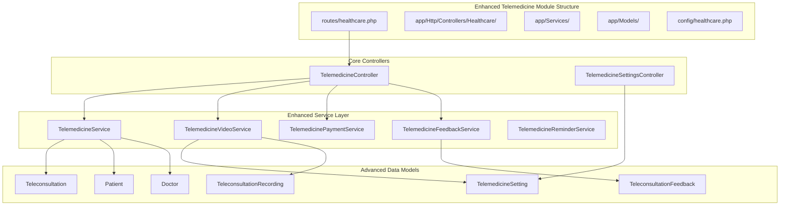

**Diagram sources**
- [routes/healthcare.php:294-331](file://routes/healthcare.php#L294-L331)
- [app/Http/Controllers/Healthcare/TelemedicineController.php:15-29](file://app/Http/Controllers/Healthcare/TelemedicineController.php#L15-L29)

**Section sources**
- [routes/healthcare.php:1-563](file://routes/healthcare.php#L1-L563)
- [config/healthcare.php:1-251](file://config/healthcare.php#L1-L251)

## Core Components
The enhanced telemedicine platform builds upon its foundation with significantly expanded capabilities for video management, recording, feedback collection, and EMR integration.

### Advanced Video Room Management
The platform now features sophisticated video room management with support for both public Jitsi Meet and self-hosted deployments. The system generates secure JWT tokens for authenticated participants, manages waiting rooms, and coordinates recording sessions with encryption and expiration controls.

### Comprehensive Recording System
Enhanced recording capabilities include automatic encryption, configurable retention periods, cloud storage integration, and secure access controls. The system supports both manual and automated recording triggers with detailed metadata tracking.

### Sophisticated Feedback Collection
The feedback system now captures comprehensive quality metrics including video/audio quality ratings, doctor performance evaluations, platform usability assessments, and detailed improvement suggestions. Feedback data is aggregated for analytics and quality improvement initiatives.

### EMR Dashboard Integration
Deep integration with Electronic Medical Records provides real-time patient data access, clinical decision support, medication interaction checking, and comprehensive health analytics. The dashboard consolidates telemedicine data with traditional healthcare workflows.

**Section sources**
- [app/Http/Controllers/Healthcare/TelemedicineController.php:15-588](file://app/Http/Controllers/Healthcare/TelemedicineController.php#L15-L588)
- [app/Services/TelemedicineService.php:14-585](file://app/Services/TelemedicineService.php#L14-L585)
- [app/Services/TelemedicineVideoService.php:11-210](file://app/Services/TelemedicineVideoService.php#L11-L210)

## Architecture Overview
The enhanced telemedicine platform follows an enterprise-grade layered architecture with advanced service integration and comprehensive data management capabilities.

```mermaid
graph TB
subgraph "Enhanced Presentation Layer"
WebUI[Web Interface]
MobileUI[Mobile Interface]
API[RESTful API]
EMRDashboard[EMR Dashboard]
end
subgraph "Advanced Application Layer"
TeleController[TelemedicineController]
TeleSettingsController[TelemedicineSettingsController]
Validation[Request Validation]
Authorization[Access Control]
EMRIntegration[EMR Integration]
end
subgraph "Enhanced Business Logic Layer"
TeleService[TelemedicineService]
VideoService[TelemedicineVideoService]
PaymentService[TelemedicinePaymentService]
FeedbackService[TelemedicineFeedbackService]
ReminderService[TelemedicineReminderService]
AnalyticsService[TelemedicineAnalyticsService]
end
subgraph "Advanced Data Access Layer"
Teleconsultation[Teleconsultation Model]
TeleSetting[TelemedicineSetting Model]
Recording[TeleconsultationRecording Model]
Feedback[TeleconsultationFeedback Model]
Patient[Patient Model]
Doctor[Doctor Model]
Payment[Payment Models]
EMRData[EMR Data Models]
end
subgraph "Enhanced External Services"
Jitsi[Jitsi Meet API]
JWTAuth[JWT Authentication]
RecordingStorage[Recording Storage]
PaymentGateways[Payment Gateways]
Notification[Notification Services]
EMRSystems[EMR Integration]
Analytics[Analytics Engine]
end
WebUI --> TeleController
MobileUI --> TeleController
API --> TeleController
EMRDashboard --> TeleController
TeleController --> TeleService
TeleController --> VideoService
TeleController --> PaymentService
TeleController --> FeedbackService
TeleController --> EMRIntegration
TeleService --> Teleconsultation
TeleService --> Patient
TeleService --> Doctor
TeleService --> Payment
VideoService --> TeleSetting
VideoService --> Recording
VideoService --> Jitsi
VideoService --> JWTAuth
VideoService --> RecordingStorage
PaymentService --> PaymentGateways
FeedbackService --> Feedback
AnalyticsService --> EMRData
TeleService --> Notification
```

**Diagram sources**
- [app/Http/Controllers/Healthcare/TelemedicineController.php:15-588](file://app/Http/Controllers/Healthcare/TelemedicineController.php#L15-L588)
- [app/Services/TelemedicineService.php:14-585](file://app/Services/TelemedicineService.php#L14-L585)
- [app/Services/TelemedicineVideoService.php:11-210](file://app/Services/TelemedicineVideoService.php#L11-L210)

## Detailed Component Analysis

### Enhanced Telemedicine Controller
The TelemedicineController now manages advanced video room operations, comprehensive feedback collection, and integrated EMR dashboard functionality.

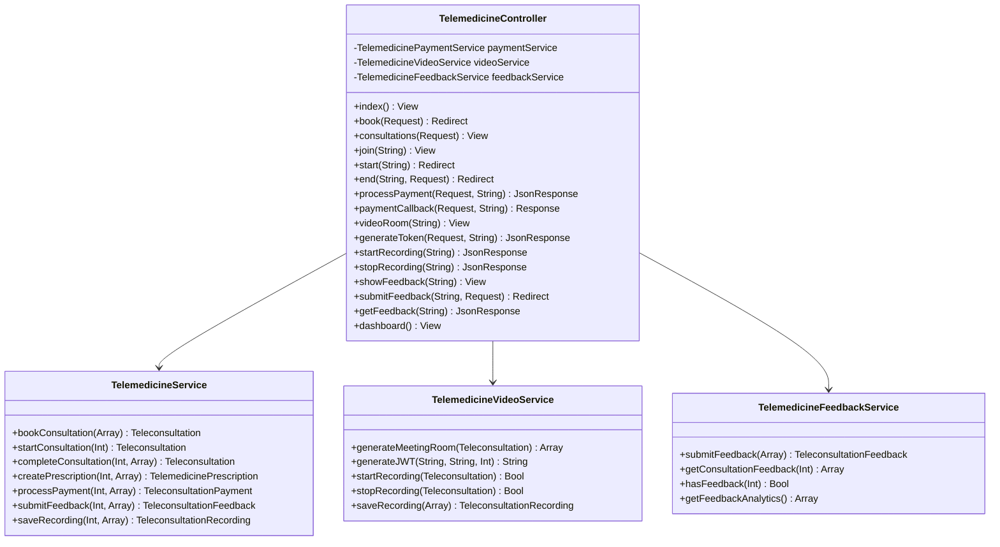

**Diagram sources**
- [app/Http/Controllers/Healthcare/TelemedicineController.php:15-588](file://app/Http/Controllers/Healthcare/TelemedicineController.php#L15-L588)
- [app/Services/TelemedicineService.php:14-585](file://app/Services/TelemedicineService.php#L14-L585)
- [app/Services/TelemedicineVideoService.php:11-210](file://app/Services/TelemedicineVideoService.php#L11-L210)

#### Enhanced Video Conferencing Integration
The video conferencing system now supports advanced features including JWT token generation for self-hosted deployments, waiting room management, and comprehensive recording capabilities.

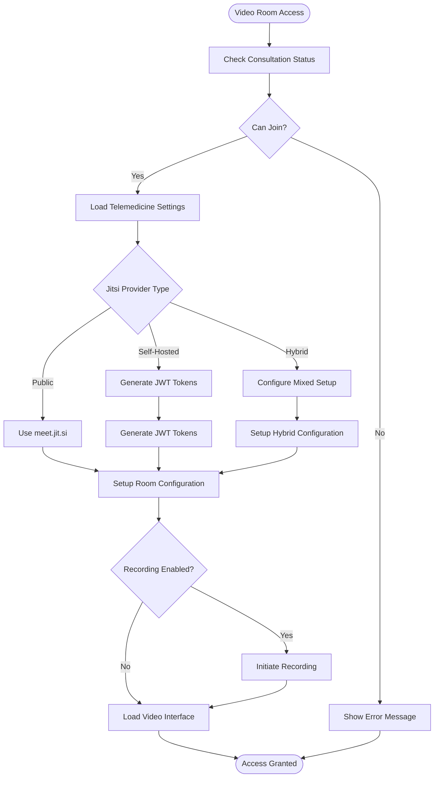

**Diagram sources**
- [app/Http/Controllers/Healthcare/TelemedicineController.php:417-447](file://app/Http/Controllers/Healthcare/TelemedicineController.php#L417-L447)
- [app/Services/TelemedicineVideoService.php:16-79](file://app/Services/TelemedicineVideoService.php#L16-L79)

**Section sources**
- [app/Http/Controllers/Healthcare/TelemedicineController.php:15-588](file://app/Http/Controllers/Healthcare/TelemedicineController.php#L15-L588)

### Enhanced Telemedicine Service Layer
The service layer now encompasses comprehensive business logic for advanced telemedicine operations with transactional integrity and sophisticated error handling.

#### Advanced Payment Processing Integration
The payment processing service supports multiple payment methods with enhanced security and comprehensive transaction tracking.

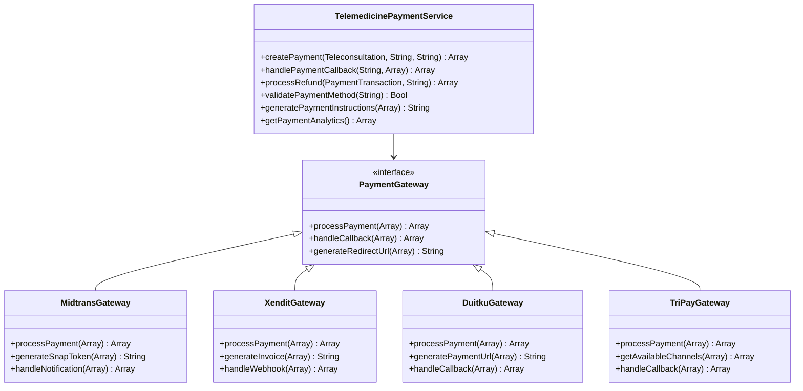

**Diagram sources**
- [app/Services/TelemedicineService.php:229-271](file://app/Services/TelemedicineService.php#L229-L271)

#### Enhanced Feedback Collection System
The feedback system now captures comprehensive patient satisfaction metrics with detailed quality assessments and improvement analytics.

**Section sources**
- [app/Services/TelemedicineService.php:14-585](file://app/Services/TelemedicineService.php#L14-L585)

### Enhanced Data Models and Relationships
The platform employs sophisticated data modeling with enhanced relationships for comprehensive healthcare workflow management and regulatory compliance.

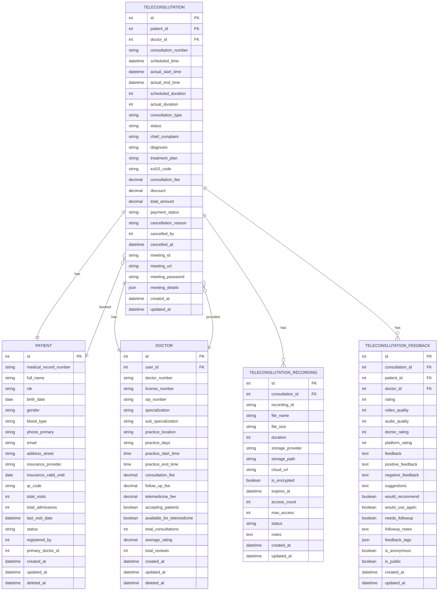

**Diagram sources**
- [app/Models/Teleconsultation.php](file://app/Models/Teleconsultation.php)
- [app/Models/Patient.php:10-396](file://app/Models/Patient.php#L10-L396)
- [app/Models/Doctor.php:9-323](file://app/Models/Doctor.php#L9-L323)

**Section sources**
- [app/Models/Patient.php:10-396](file://app/Models/Patient.php#L10-L396)
- [app/Models/Doctor.php:9-323](file://app/Models/Doctor.php#L9-L323)

## Enhanced Video Room Management
The platform now features comprehensive video room management with advanced security and scalability features.

### JWT Token Generation System
The JWT token generation system provides secure authentication for self-hosted Jitsi Meet deployments with role-based access control and expiration management.

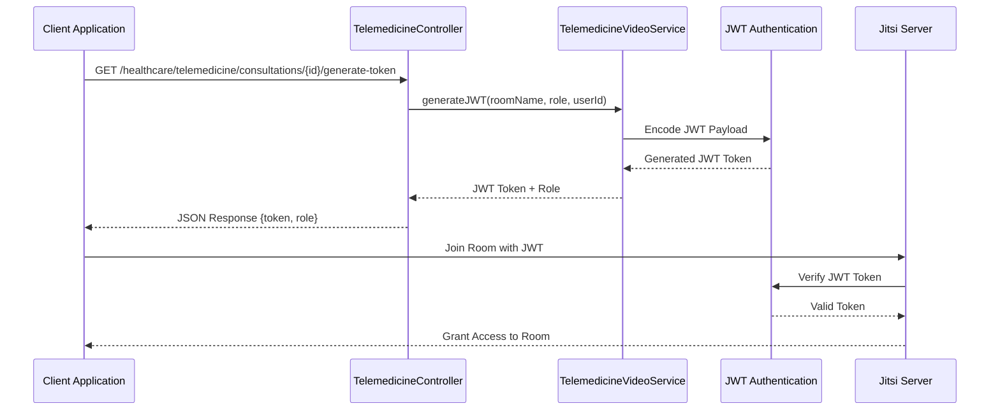

**Diagram sources**
- [app/Http/Controllers/Healthcare/TelemedicineController.php:452-471](file://app/Http/Controllers/Healthcare/TelemedicineController.php#L452-L471)
- [app/Services/TelemedicineVideoService.php:84-120](file://app/Services/TelemedicineVideoService.php#L84-L120)

### Advanced Room Configuration
The system supports dynamic room configuration with customizable settings for waiting rooms, participant limits, and feature enablement based on tenant requirements.

**Section sources**
- [app/Services/TelemedicineVideoService.php:11-210](file://app/Services/TelemedicineVideoService.php#L11-L210)

## Advanced Recording Capabilities
The enhanced recording system provides comprehensive capture, storage, and management of telemedicine consultations with enterprise-grade security and compliance.

### Recording Management Workflow
The recording system automatically captures consultations with encryption, metadata tracking, and retention policy enforcement.

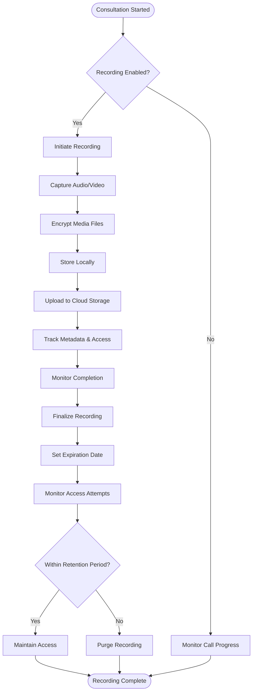

**Diagram sources**
- [app/Services/TelemedicineService.php:137-164](file://app/Services/TelemedicineService.php#L137-L164)
- [app/Services/TelemedicineVideoService.php:122-158](file://app/Services/TelemedicineVideoService.php#L122-L158)

### Security and Compliance Features
The recording system implements enterprise-grade security with AES encryption, access logging, and compliance with healthcare regulations including HIPAA requirements.

**Section sources**
- [app/Services/TelemedicineService.php:137-164](file://app/Services/TelemedicineService.php#L137-L164)
- [app/Services/TelemedicineVideoService.php:163-188](file://app/Services/TelemedicineVideoService.php#L163-L188)

## Comprehensive Feedback Systems
The enhanced feedback system captures detailed patient satisfaction metrics and consultation quality assessments for continuous improvement.

### Multi-Dimensional Feedback Collection
The feedback system collects comprehensive data including technical quality metrics, clinical assessment ratings, and qualitative improvement suggestions.

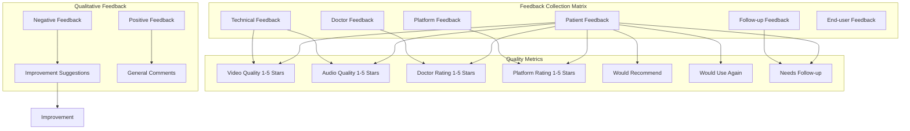

**Diagram sources**
- [app/Http/Controllers/Healthcare/TelemedicineController.php:524-570](file://app/Http/Controllers/Healthcare/TelemedicineController.php#L524-L570)
- [app/Services/TelemedicineService.php:274-310](file://app/Services/TelemedicineService.php#L274-L310)

### Analytics and Insights
The feedback system provides comprehensive analytics including trend analysis, quality improvement tracking, and comparative performance metrics across healthcare providers.

**Section sources**
- [app/Http/Controllers/Healthcare/TelemedicineController.php:508-585](file://app/Http/Controllers/Healthcare/TelemedicineController.php#L508-L585)
- [app/Services/TelemedicineService.php:274-310](file://app/Services/TelemedicineService.php#L274-L310)

## EMR Dashboard Integration
The platform now provides seamless integration with Electronic Medical Records systems for comprehensive patient care coordination.

### Real-Time Data Synchronization
The EMR dashboard provides real-time access to telemedicine consultation data, patient history, and clinical decision support tools.

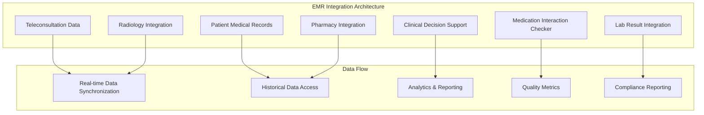

**Diagram sources**
- [routes/healthcare.php:123-141](file://routes/healthcare.php#L123-L141)
- [app/Http/Controllers/Healthcare/TelemedicineController.php:254-265](file://app/Http/Controllers/Healthcare/TelemedicineController.php#L254-L265)

### Clinical Decision Support
The integrated EMR system provides clinical decision support including drug interaction checking, allergy warnings, and evidence-based treatment recommendations.

**Section sources**
- [routes/healthcare.php:123-141](file://routes/healthcare.php#L123-L141)
- [app/Http/Controllers/Healthcare/TelemedicineController.php:254-265](file://app/Http/Controllers/Healthcare/TelemedicineController.php#L254-L265)

## Payment Processing Enhancements
The payment processing system now supports multiple payment gateways with enhanced security and comprehensive transaction tracking.

### Multi-Gateway Payment Integration
The platform supports major Indonesian payment methods including QRIS, credit cards, debit cards, virtual accounts, and e-wallets through integration with multiple payment processors.

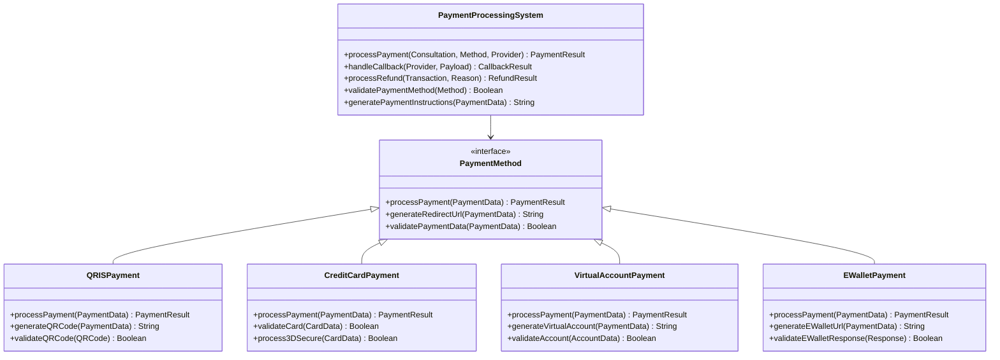

**Diagram sources**
- [app/Services/TelemedicineService.php:229-271](file://app/Services/TelemedicineService.php#L229-L271)

### Enhanced Security Features
The payment system implements comprehensive security measures including PCI DSS compliance, fraud detection, transaction monitoring, and secure data transmission protocols.

**Section sources**
- [app/Services/TelemedicineService.php:229-271](file://app/Services/TelemedicineService.php#L229-L271)

## Administrative Dashboard Features
The enhanced administrative dashboard provides comprehensive oversight of telemedicine operations with real-time analytics and performance metrics.

### Comprehensive Statistics and Analytics
The dashboard displays real-time statistics including consultation volumes, completion rates, patient satisfaction scores, revenue analytics, and operational efficiency metrics.

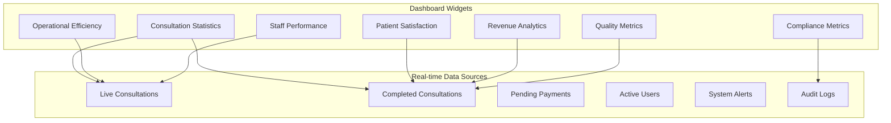

**Diagram sources**
- [app/Http/Controllers/Healthcare/TelemedicineController.php:33-66](file://app/Http/Controllers/Healthcare/TelemedicineController.php#L33-L66)
- [app/Services/TelemedicineService.php:344-361](file://app/Services/TelemedicineService.php#L344-L361)

### Performance Monitoring
The dashboard provides comprehensive performance monitoring with alerting systems, capacity planning tools, and predictive analytics for resource optimization.

**Section sources**
- [app/Http/Controllers/Healthcare/TelemedicineController.php:33-66](file://app/Http/Controllers/Healthcare/TelemedicineController.php#L33-L66)
- [app/Services/TelemedicineService.php:344-361](file://app/Services/TelemedicineService.php#L344-L361)

## Dependency Analysis
The enhanced telemedicine platform maintains well-structured dependencies with expanded external integrations and comprehensive internal model relationships.

```mermaid
graph TB
subgraph "Enhanced External Dependencies"
Laravel[Laravel Framework]
Jitsi[Jitsi Meet API]
JWTAuth[JWT Authentication Library]
Firebase[firebase/php-jwt]
Midtrans[Midtrans Gateway]
Xendit[Xendit Gateway]
Duitku[Duitku Gateway]
TriPay[TriPay Gateway]
EMRSystems[EMR Integration APIs]
AnalyticsEngine[Analytics Engine]
CloudStorage[Cloud Storage Services]
end
subgraph "Expanded Internal Dependencies"
TeleController[TelemedicineController]
TeleService[TelemedicineService]
VideoService[TelemedicineVideoService]
PaymentService[TelemedicinePaymentService]
FeedbackService[TelemedicineFeedbackService]
ReminderService[TelemedicineReminderService]
AnalyticsService[TelemedicineAnalyticsService]
EMRIntegration[EMR Integration Service]
end
subgraph "Enhanced Data Dependencies"
Teleconsultation[Teleconsultation Model]
TeleSetting[TelemedicineSetting Model]
Recording[TeleconsultationRecording Model]
Feedback[TeleconsultationFeedback Model]
Patient[Patient Model]
Doctor[Doctor Model]
Payment[Payment Models]
EMRData[EMR Data Models]
end
TeleController --> TeleService
TeleController --> VideoService
TeleController --> PaymentService
TeleController --> FeedbackService
TeleController --> EMRIntegration
TeleService --> Teleconsultation
TeleService --> Patient
TeleService --> Doctor
TeleService --> Payment
TeleService --> EMRData
VideoService --> TeleSetting
VideoService --> Recording
VideoService --> Jitsi
VideoService --> JWTAuth
PaymentService --> Midtrans
PaymentService --> Xendit
PaymentService --> Duitku
PaymentService --> TriPay
FeedbackService --> Feedback
AnalyticsService --> EMRData
```

**Diagram sources**
- [app/Services/TelemedicineVideoService.php:84-120](file://app/Services/TelemedicineVideoService.php#L84-L120)
- [app/Services/TelemedicineService.php:447-566](file://app/Services/TelemedicineService.php#L447-L566)

The enhanced dependency structure demonstrates:
- Expanded external dependency footprint with multiple payment gateways
- Enhanced internal service integration for comprehensive functionality
- Comprehensive EMR system integration
- Advanced video conferencing and recording infrastructure
- Sophisticated analytics and reporting capabilities

**Section sources**
- [app/Services/TelemedicineService.php:14-585](file://app/Services/TelemedicineService.php#L14-L585)
- [app/Services/TelemedicineVideoService.php:11-210](file://app/Services/TelemedicineVideoService.php#L11-L210)

## Performance Considerations
The enhanced telemedicine platform incorporates comprehensive performance optimization strategies across all functional areas.

### Database Optimization
- Tenant isolation queries use efficient WHERE clauses with proper indexing
- Advanced pagination implementation with optimized query performance
- Eager loading of relationships reduces N+1 query problems
- Soft deletes minimize table bloat and improve query performance
- Dedicated indexes for frequently queried fields including consultation status and timestamps

### Enhanced Caching Strategies
- Session-based caching for frequently accessed consultation data
- Configuration caching for telemedicine settings with automatic invalidation
- Database query result caching for dashboard statistics and analytics
- JWT token caching for reduced authentication overhead
- Static asset optimization for video conferencing interfaces

### Advanced Asynchronous Processing
- Background job processing for payment callbacks and notifications
- Queue-based processing for video recording and file uploads
- Email and SMS notification queuing for improved response times
- Real-time analytics processing with streaming data pipelines
- Automated backup and archival processes for recording data

### Scalability Features
- Multi-tenant architecture supports horizontal scaling with database sharding
- Load balancing compatibility for video conferencing servers
- CDN integration for media file delivery and recording storage
- Microservice architecture readiness for distributed deployment
- Auto-scaling capabilities for peak consultation periods

## Troubleshooting Guide

### Enhanced Common Issues and Solutions

#### Advanced Video Conferencing Problems
**Issue**: Unable to connect to video consultation with JWT authentication
**Causes**: 
- JWT token generation failures
- Self-hosted Jitsi server configuration errors
- Missing Firebase JWT library
- Network connectivity issues to Jitsi server
- Time synchronization issues affecting token validity

**Solutions**:
- Verify JWT secret configuration in telemedicine settings
- Check Firebase JWT library installation and version compatibility
- Validate Jitsi server URL and SSL certificate configuration
- Test network connectivity to Jitsi server on required ports
- Synchronize system time with NTP servers
- Enable detailed logging for JWT token generation

#### Enhanced Recording System Issues
**Issue**: Recording fails to start or save properly
**Causes**:
- Jibri recording service not configured for self-hosted deployments
- Cloud storage access permissions denied
- Encryption key generation failures
- Storage quota exceeded
- File format compatibility issues

**Solutions**:
- Install and configure Jibri recording service for self-hosted deployments
- Verify cloud storage credentials and bucket permissions
- Check encryption key configuration and availability
- Monitor storage quota and implement cleanup policies
- Validate supported recording formats and codecs

#### Advanced Payment Processing Failures
**Issue**: Payment transactions failing or stuck in pending state
**Causes**:
- Multiple payment gateway configuration errors
- Invalid API credentials for different payment providers
- Network connectivity issues to payment gateways
- Callback URL misconfiguration for multiple providers
- Transaction timeout issues

**Solutions**:
- Verify payment gateway credentials for all configured providers
- Test callback URL accessibility from external networks
- Check payment gateway logs for error messages
- Validate SSL certificate installation for all providers
- Implement retry mechanisms for transient failures

#### Enhanced Feedback System Issues
**Issue**: Feedback data not appearing in analytics or reports
**Causes**:
- Feedback submission validation failures
- Database connection issues during feedback persistence
- Analytics pipeline processing errors
- Missing feedback aggregation jobs
- Data export permission issues

**Solutions**:
- Check feedback validation rules and error messages
- Verify database connectivity and write permissions
- Monitor analytics job execution and error logs
- Validate feedback aggregation job scheduling
- Review user permissions for data export functionality

#### EMR Integration Problems
**Issue**: EMR data synchronization failures or delays
**Causes**:
- EMR system API connectivity issues
- Authentication token expiration for EMR systems
- Data format compatibility problems
- Network latency affecting real-time synchronization
- EMR system maintenance windows

**Solutions**:
- Verify EMR system API endpoints and connectivity
- Implement token refresh mechanisms for EMR authentication
- Validate data format mappings between systems
- Monitor network latency and implement retry logic
- Schedule synchronization during EMR system maintenance windows

**Section sources**
- [config/healthcare.php:42-142](file://config/healthcare.php#L42-L142)
- [app/Services/TelemedicineVideoService.php:84-120](file://app/Services/TelemedicineVideoService.php#L84-L120)

## Conclusion
The enhanced Healthcare Telemedicine Platform represents a comprehensive, enterprise-grade solution for modern virtual healthcare delivery. The platform has evolved from basic video consultations to a sophisticated integrated healthcare ecosystem featuring advanced video room management with JWT authentication, comprehensive recording capabilities with encryption and retention policies, detailed feedback collection systems with analytics, and seamless EMR dashboard integration.

Key enhancements include:
- **Advanced Video Infrastructure**: JWT token generation for self-hosted deployments, waiting room management, and comprehensive recording capabilities
- **Enterprise Security**: HIPAA-compliant design with encrypted recording storage, access controls, and audit trails
- **Multi-Gateway Payment Processing**: Support for QRIS, credit cards, debit cards, virtual accounts, and e-wallets with enhanced security
- **Comprehensive Analytics**: Real-time dashboard with performance metrics, quality analytics, and compliance reporting
- **Deep EMR Integration**: Seamless coordination between telemedicine data and Electronic Medical Records
- **Scalable Architecture**: Multi-tenant support with microservice-ready design for horizontal scaling

The platform's modular architecture ensures maintainability and extensibility while its comprehensive feature set positions it for successful deployment across diverse healthcare environments. Future enhancements could include AI-powered clinical decision support, advanced telemonitoring capabilities, and expanded integration with healthcare IoT devices and wearables.