# Laboratory & Radiology Workflow Management

<cite>
**Referenced Files in This Document**
- [routes/healthcare.php](file://routes/healthcare.php)
- [app/Http/Controllers/Healthcare/LaboratoryController.php](file://app/Http/Controllers/Healthcare/LaboratoryController.php)
- [app/Services/LaboratoryService.php](file://app/Services/LaboratoryService.php)
- [database/migrations/2026_04_08_700001_create_laboratory_tables.php](file://database/migrations/2026_04_08_700001_create_laboratory_tables.php)
- [app/Models/RadiologyExam.php](file://app/Models/RadiologyExam.php)
- [app/Services/RadiologyService.php](file://app/Services/RadiologyService.php)
- [app/Http/Controllers/Healthcare/RadiologyController.php](file://app/Http/Controllers/Healthcare/RadiologyController.php)
- [app/Http/Controllers/Healthcare/RadiologyExamController.php](file://app/Http/Controllers/Healthcare/RadiologyExamController.php)
- [app/Console/Commands/PollLabEquipment.php](file://app/Console/Commands/PollLabEquipment.php)
- [app/Services/HealthcareIntegrationService.php](file://app/Services/HealthcareIntegrationService.php)
- [app/Models/LabEquipment.php](file://app/Models/LabEquipment.php)
- [app/Jobs/Healthcare/EscalateCriticalLabResult.php](file://app/Jobs/Healthcare/EscalateCriticalLabResult.php)
- [app/Http/Controllers/Healthcare/LabEquipmentController.php](file://app/Http/Controllers/Healthcare/LabEquipmentController.php)
- [app/Http/Controllers/Healthcare/LabResultController.php](file://app/Http/Controllers/Healthcare/LabResultController.php)
- [app/Http/Controllers/Healthcare/LabTestCatalogController.php](file://app/Http/Controllers/Healthcare/LabTestCatalogController.php)
- [app/Services/RegulatoryComplianceService.php](file://app/Services/RegulatoryComplianceService.php)
- [docs/HEALTHCARE_INTEGRATION_INTEROPERABILITY.md](file://docs/HEALTHCARE_INTEGRATION_INTEROPERABILITY.md)
- [docs/HEALTHCARE_REGULATORY_COMPLIANCE.md](file://docs/HEALTHCARE_REGULATORY_COMPLIANCE.md)
</cite>

## Table of Contents
1. [Introduction](#introduction)
2. [Project Structure](#project-structure)
3. [Core Components](#core-components)
4. [Architecture Overview](#architecture-overview)
5. [Detailed Component Analysis](#detailed-component-analysis)
6. [Dependency Analysis](#dependency-analysis)
7. [Performance Considerations](#performance-considerations)
8. [Troubleshooting Guide](#troubleshooting-guide)
9. [Conclusion](#conclusion)
10. [Appendices](#appendices)

## Introduction
This document describes the Laboratory and Radiology workflow management capabilities implemented in the system. It covers order entry, specimen collection, test tracking, result reporting, quality control, LIS (Laboratory Information System) and PACS (Picture Archiving and Communication System) integration, workflow automation for routine tests and urgent results, barcode scanning readiness, instrument connectivity, result verification, integration with Electronic Health Records, reporting templates, abnormal/critical result notifications, quality assurance protocols, regulatory compliance, and result archiving.

## Project Structure
The solution is organized around dedicated controllers, services, models, and migrations for laboratory and radiology workflows. Routes define the API surface for both domains. Services encapsulate business logic for workflow steps, while migrations define the persistent schema for orders, samples, results, equipment, and QC logs.

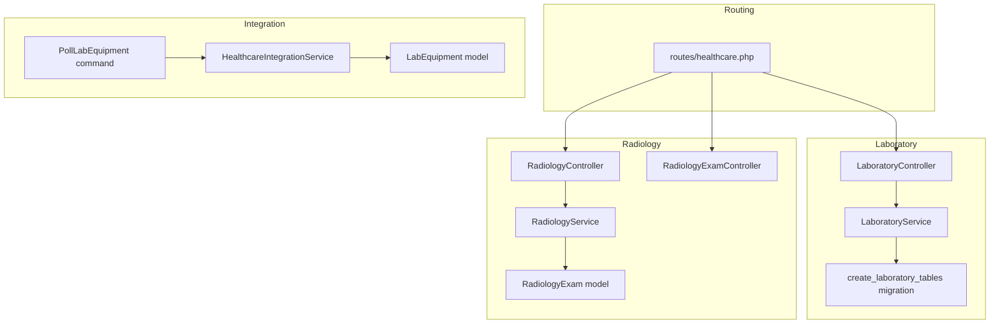

**Diagram sources**
- [routes/healthcare.php:227-245](file://routes/healthcare.php#L227-L245)
- [app/Http/Controllers/Healthcare/LaboratoryController.php:1-44](file://app/Http/Controllers/Healthcare/LaboratoryController.php#L1-L44)
- [app/Services/LaboratoryService.php:1-509](file://app/Services/LaboratoryService.php#L1-L509)
- [database/migrations/2026_04_08_700001_create_laboratory_tables.php:1-313](file://database/migrations/2026_04_08_700001_create_laboratory_tables.php#L1-L313)
- [app/Http/Controllers/Healthcare/RadiologyController.php](file://app/Http/Controllers/Healthcare/RadiologyController.php)
- [app/Http/Controllers/Healthcare/RadiologyExamController.php](file://app/Http/Controllers/Healthcare/RadiologyExamController.php)
- [app/Services/RadiologyService.php:1-320](file://app/Services/RadiologyService.php#L1-L320)
- [app/Models/RadiologyExam.php:1-116](file://app/Models/RadiologyExam.php#L1-L116)
- [app/Console/Commands/PollLabEquipment.php](file://app/Console/Commands/PollLabEquipment.php)
- [app/Services/HealthcareIntegrationService.php:196-217](file://app/Services/HealthcareIntegrationService.php#L196-L217)
- [app/Models/LabEquipment.php](file://app/Models/LabEquipment.php)

**Section sources**
- [routes/healthcare.php:227-245](file://routes/healthcare.php#L227-L245)
- [app/Services/LaboratoryService.php:1-509](file://app/Services/LaboratoryService.php#L1-L509)
- [app/Services/RadiologyService.php:1-320](file://app/Services/RadiologyService.php#L1-L320)
- [database/migrations/2026_04_08_700001_create_laboratory_tables.php:1-313](file://database/migrations/2026_04_08_700001_create_laboratory_tables.php#L1-L313)

## Core Components
- Laboratory workflow engine: order intake, sample creation, collection, processing, result entry, verification, QC, and reporting.
- Radiology workflow engine: order creation, scheduling, exam execution, report generation, verification, and PACS integration.
- Instrument connectivity and polling: automated result ingestion via scheduled jobs and integration service.
- Quality assurance: QC logs, calibration tracking, and critical result escalation.
- Reporting and delivery: structured report templates, digital signatures, and delivery channels.
- Regulatory compliance: audit trails, retention policies, and compliance reporting support.

**Section sources**
- [app/Services/LaboratoryService.php:1-509](file://app/Services/LaboratoryService.php#L1-L509)
- [app/Services/RadiologyService.php:1-320](file://app/Services/RadiologyService.php#L1-L320)
- [database/migrations/2026_04_08_700001_create_laboratory_tables.php:1-313](file://database/migrations/2026_04_08_700001_create_laboratory_tables.php#L1-L313)

## Architecture Overview
The system separates concerns across routing, controllers, services, and persistence. Controllers expose endpoints for laboratory and radiology operations. Services encapsulate domain logic and orchestrate transactions, notifications, and integrations. Migrations define the canonical schema for orders, samples, results, equipment, and QC.

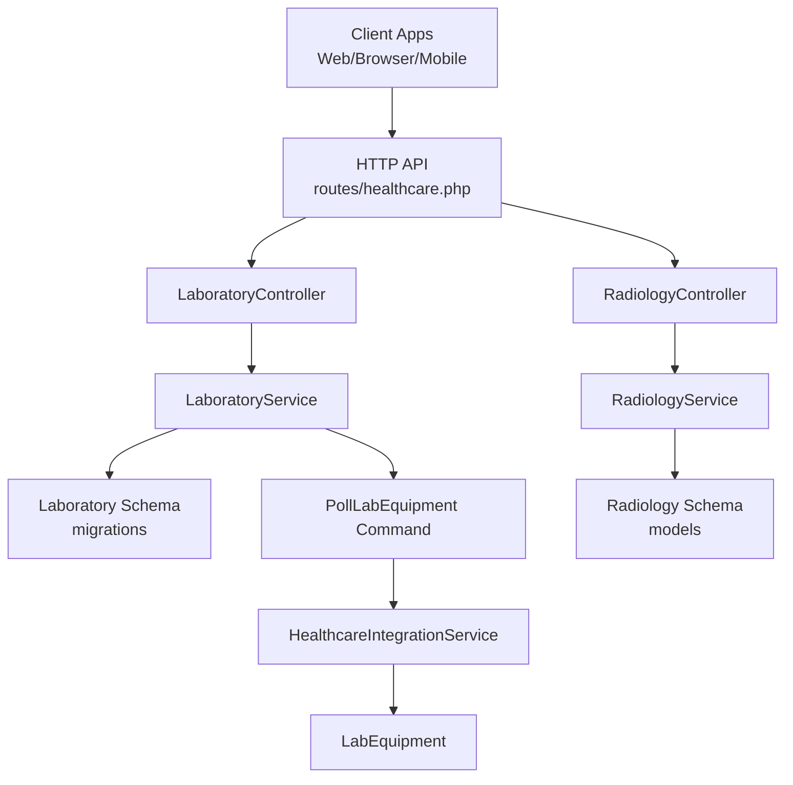

**Diagram sources**
- [routes/healthcare.php:227-245](file://routes/healthcare.php#L227-L245)
- [app/Http/Controllers/Healthcare/LaboratoryController.php:1-44](file://app/Http/Controllers/Healthcare/LaboratoryController.php#L1-L44)
- [app/Http/Controllers/Healthcare/RadiologyController.php](file://app/Http/Controllers/Healthcare/RadiologyController.php)
- [app/Services/LaboratoryService.php:1-509](file://app/Services/LaboratoryService.php#L1-L509)
- [app/Services/RadiologyService.php:1-320](file://app/Services/RadiologyService.php#L1-L320)
- [database/migrations/2026_04_08_700001_create_laboratory_tables.php:1-313](file://database/migrations/2026_04_08_700001_create_laboratory_tables.php#L1-L313)
- [app/Console/Commands/PollLabEquipment.php](file://app/Console/Commands/PollLabEquipment.php)
- [app/Services/HealthcareIntegrationService.php:196-217](file://app/Services/HealthcareIntegrationService.php#L196-L217)
- [app/Models/LabEquipment.php](file://app/Models/LabEquipment.php)

## Detailed Component Analysis

### Laboratory Workflow Engine
LaboratoryService orchestrates the end-to-end lab workflow, including sample lifecycle, result entry and verification, QC, and equipment calibration. It emits critical result alerts and integrates with notifications and audit logs.

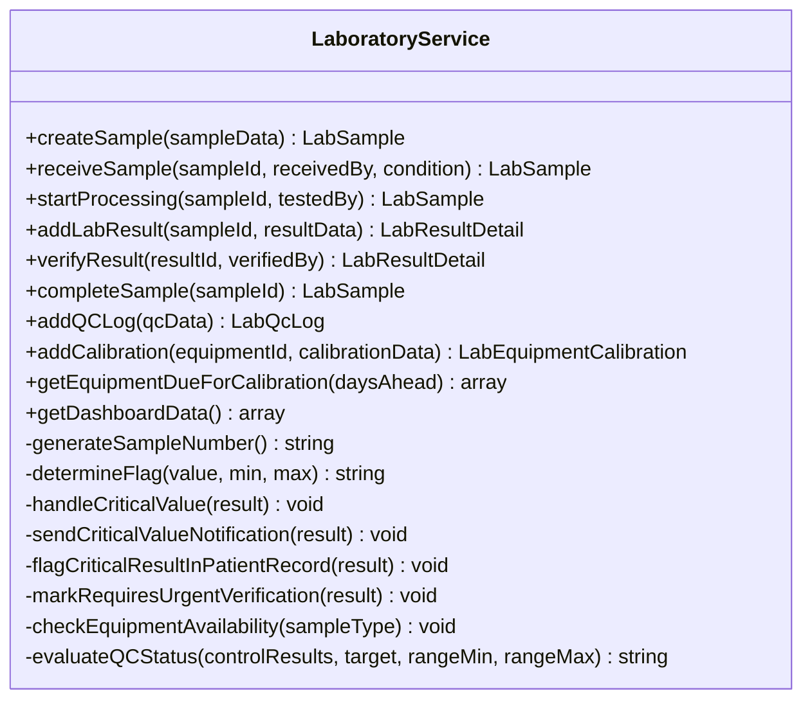

**Diagram sources**
- [app/Services/LaboratoryService.php:1-509](file://app/Services/LaboratoryService.php#L1-L509)

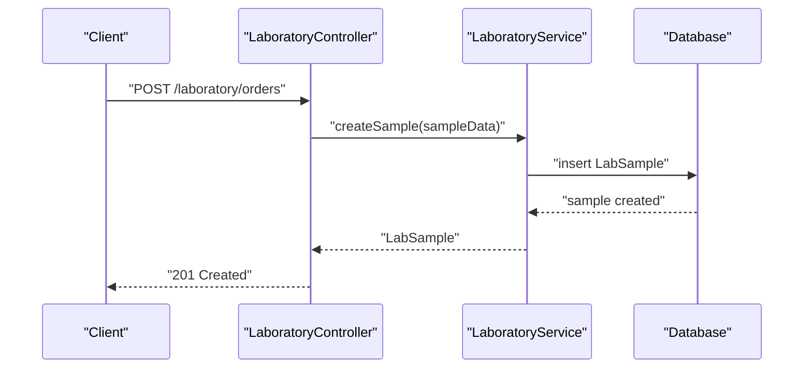

**Diagram sources**
- [routes/healthcare.php:227-245](file://routes/healthcare.php#L227-L245)
- [app/Services/LaboratoryService.php:18-40](file://app/Services/LaboratoryService.php#L18-L40)

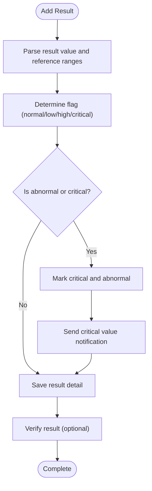

**Diagram sources**
- [app/Services/LaboratoryService.php:96-152](file://app/Services/LaboratoryService.php#L96-L152)
- [app/Services/LaboratoryService.php:322-434](file://app/Services/LaboratoryService.php#L322-L434)

Key capabilities:
- Order entry and sample creation with unique identifiers and timestamps.
- Sample receipt with condition checks and rejection handling.
- Equipment availability checks prior to processing.
- Result entry with automatic abnormal/critical flagging and interpretation fields.
- Verification workflow with preliminary/final statuses.
- QC logging with status evaluation and corrective actions.
- Calibration tracking and equipment operational status updates.
- Dashboard metrics for operational visibility.

**Section sources**
- [app/Services/LaboratoryService.php:18-40](file://app/Services/LaboratoryService.php#L18-L40)
- [app/Services/LaboratoryService.php:45-70](file://app/Services/LaboratoryService.php#L45-L70)
- [app/Services/LaboratoryService.php:75-91](file://app/Services/LaboratoryService.php#L75-L91)
- [app/Services/LaboratoryService.php:96-152](file://app/Services/LaboratoryService.php#L96-L152)
- [app/Services/LaboratoryService.php:174-208](file://app/Services/LaboratoryService.php#L174-L208)
- [app/Services/LaboratoryService.php:213-242](file://app/Services/LaboratoryService.php#L213-L242)
- [app/Services/LaboratoryService.php:288-317](file://app/Services/LaboratoryService.php#L288-L317)
- [app/Services/LaboratoryService.php:322-434](file://app/Services/LaboratoryService.php#L322-L434)
- [app/Services/LaboratoryService.php:489-507](file://app/Services/LaboratoryService.php#L489-L507)

### Radiology Workflow Engine
RadiologyService manages radiology orders, scheduling, exam execution, report creation, verification, and PACS integration. It supports prioritization (routine/stat), modality tracking, and reporting templates.

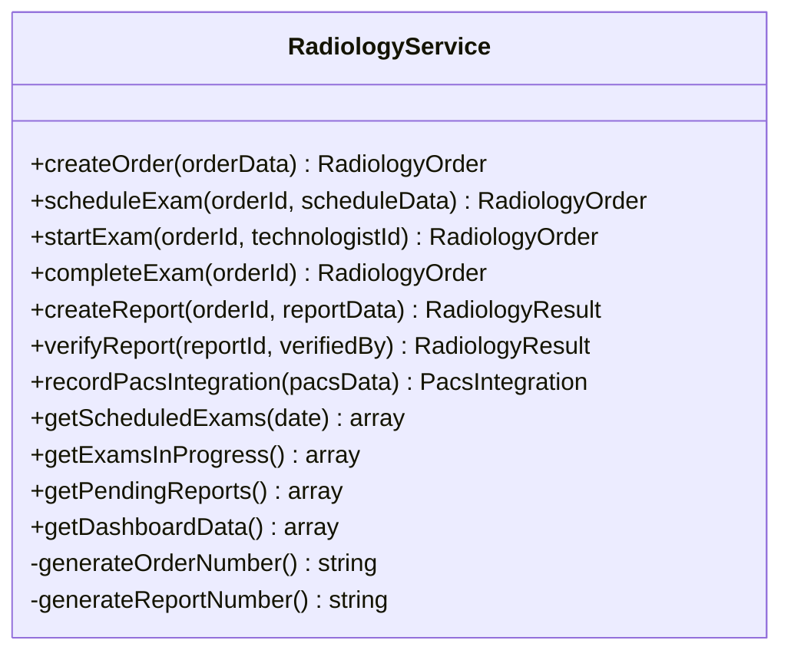

**Diagram sources**
- [app/Services/RadiologyService.php:1-320](file://app/Services/RadiologyService.php#L1-L320)

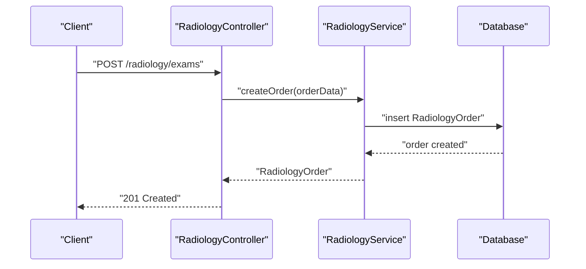

**Diagram sources**
- [routes/healthcare.php:243-260](file://routes/healthcare.php#L243-L260)
- [app/Services/RadiologyService.php:18-49](file://app/Services/RadiologyService.php#L18-L49)

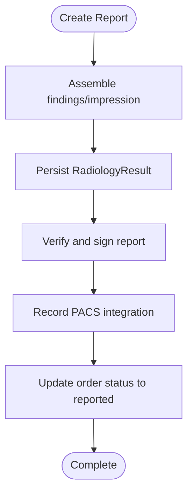

**Diagram sources**
- [app/Services/RadiologyService.php:110-170](file://app/Services/RadiologyService.php#L110-L170)
- [app/Services/RadiologyService.php:175-211](file://app/Services/RadiologyService.php#L175-L211)

Key capabilities:
- Order creation with priority and clinical indication.
- Scheduling with resource assignment (radiologist, technologist, room, equipment).
- Exam execution tracking with start/completion timestamps.
- Report creation with structured fields and DICOM metadata linkage.
- Verification workflow with digital signature and final status.
- PACS integration for image archival and retrieval.

**Section sources**
- [app/Services/RadiologyService.php:18-49](file://app/Services/RadiologyService.php#L18-L49)
- [app/Services/RadiologyService.php:54-88](file://app/Services/RadiologyService.php#L54-L88)
- [app/Services/RadiologyService.php:110-170](file://app/Services/RadiologyService.php#L110-L170)
- [app/Services/RadiologyService.php:175-211](file://app/Services/RadiologyService.php#L175-L211)
- [app/Models/RadiologyExam.php:12-44](file://app/Models/RadiologyExam.php#L12-L44)

### LIS and PACS Integration
- LIS connectivity: Equipment registration and polling via integration service and scheduled command.
- PACS integration: Structured metadata capture for study instance UID, series counts, and viewer URLs.

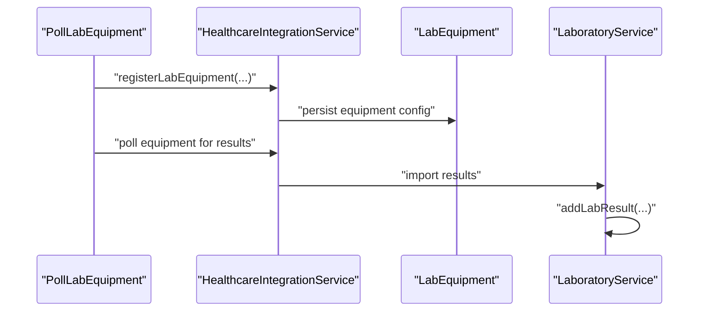

**Diagram sources**
- [app/Console/Commands/PollLabEquipment.php](file://app/Console/Commands/PollLabEquipment.php)
- [app/Services/HealthcareIntegrationService.php:196-217](file://app/Services/HealthcareIntegrationService.php#L196-L217)
- [app/Models/LabEquipment.php](file://app/Models/LabEquipment.php)
- [app/Services/LaboratoryService.php:96-152](file://app/Services/LaboratoryService.php#L96-L152)

**Section sources**
- [app/Services/HealthcareIntegrationService.php:196-217](file://app/Services/HealthcareIntegrationService.php#L196-L217)
- [app/Console/Commands/PollLabEquipment.php](file://app/Console/Commands/PollLabEquipment.php)
- [app/Services/LaboratoryService.php:96-152](file://app/Services/LaboratoryService.php#L96-L152)

### Workflow Automation and Urgent Results
- Routine tests: automated sample numbering, equipment availability checks, QC gating, and dashboard metrics.
- Special studies: prioritized orders with stat turnaround tracking and escalation.
- Urgent results: critical value detection triggers immediate notifications, patient record flags, and scheduled escalation jobs.

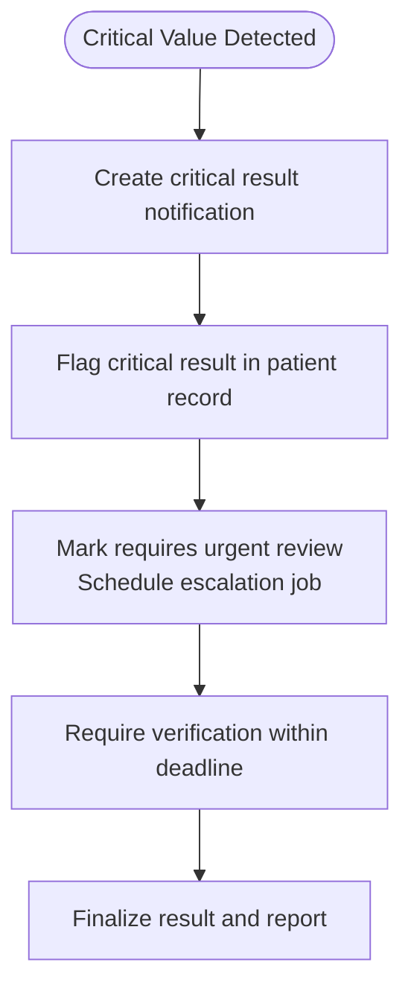

**Diagram sources**
- [app/Services/LaboratoryService.php:322-434](file://app/Services/LaboratoryService.php#L322-L434)

**Section sources**
- [app/Services/LaboratoryService.php:322-434](file://app/Services/LaboratoryService.php#L322-L434)
- [app/Jobs/Healthcare/EscalateCriticalLabResult.php](file://app/Jobs/Healthcare/EscalateCriticalLabResult.php)

### Reporting Templates and Delivery
- Laboratory reports: structured JSON content, overall interpretation, clinical correlation, recommendations, PDF and digital signature support, and delivery methods.
- Radiology reports: structured findings, impression, recommendations, DICOM metadata, and signed final status.

**Section sources**
- [database/migrations/2026_04_08_700001_create_laboratory_tables.php:220-258](file://database/migrations/2026_04_08_700001_create_laboratory_tables.php#L220-L258)
- [app/Services/RadiologyService.php:110-170](file://app/Services/RadiologyService.php#L110-L170)

### Quality Assurance Protocols
- QC logs: control lot numbers, target values, acceptable ranges, status evaluation, corrective actions, and Westgard rule interpretations.
- Calibration: performed/verified dates, standards used, certificate management, and equipment status transitions.
- Equipment oversight: due-for-calibration alerts and maintenance tracking.

**Section sources**
- [database/migrations/2026_04_08_700001_create_laboratory_tables.php:260-296](file://database/migrations/2026_04_08_700001_create_laboratory_tables.php#L260-L296)
- [app/Services/LaboratoryService.php:174-208](file://app/Services/LaboratoryService.php#L174-L208)
- [app/Services/LaboratoryService.php:213-242](file://app/Services/LaboratoryService.php#L213-L242)
- [app/Services/LaboratoryService.php:247-261](file://app/Services/LaboratoryService.php#L247-L261)

### Regulatory Compliance and Result Archiving
- Compliance support: activity logs, audit trails, and notification records for critical events.
- Retention and archival: sample retention periods, report archival paths, and digital signature enforcement.

**Section sources**
- [app/Services/LaboratoryService.php:389-417](file://app/Services/LaboratoryService.php#L389-L417)
- [database/migrations/2026_04_08_700001_create_laboratory_tables.php:131-176](file://database/migrations/2026_04_08_700001_create_laboratory_tables.php#L131-L176)
- [database/migrations/2026_04_08_700001_create_laboratory_tables.php:220-258](file://database/migrations/2026_04_08_700001_create_laboratory_tables.php#L220-L258)
- [app/Services/RegulatoryComplianceService.php](file://app/Services/RegulatoryComplianceService.php)
- [docs/HEALTHCARE_REGULATORY_COMPLIANCE.md](file://docs/HEALTHCARE_REGULATORY_COMPLIANCE.md)

## Dependency Analysis
The controllers depend on services for business logic, while services depend on models and migrations for persistence. Integration commands and services bridge external instruments and PACS systems.

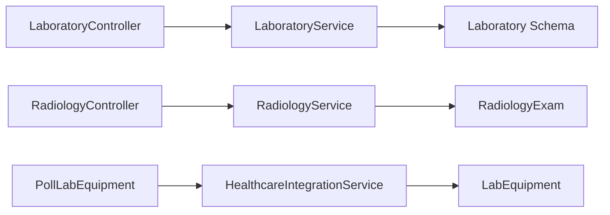

**Diagram sources**
- [app/Http/Controllers/Healthcare/LaboratoryController.php:1-44](file://app/Http/Controllers/Healthcare/LaboratoryController.php#L1-L44)
- [app/Http/Controllers/Healthcare/RadiologyController.php](file://app/Http/Controllers/Healthcare/RadiologyController.php)
- [app/Services/LaboratoryService.php:1-509](file://app/Services/LaboratoryService.php#L1-L509)
- [app/Services/RadiologyService.php:1-320](file://app/Services/RadiologyService.php#L1-L320)
- [database/migrations/2026_04_08_700001_create_laboratory_tables.php:1-313](file://database/migrations/2026_04_08_700001_create_laboratory_tables.php#L1-L313)
- [app/Models/RadiologyExam.php:1-116](file://app/Models/RadiologyExam.php#L1-L116)
- [app/Console/Commands/PollLabEquipment.php](file://app/Console/Commands/PollLabEquipment.php)
- [app/Services/HealthcareIntegrationService.php:196-217](file://app/Services/HealthcareIntegrationService.php#L196-L217)
- [app/Models/LabEquipment.php](file://app/Models/LabEquipment.php)

**Section sources**
- [routes/healthcare.php:227-245](file://routes/healthcare.php#L227-L245)
- [app/Services/LaboratoryService.php:1-509](file://app/Services/LaboratoryService.php#L1-L509)
- [app/Services/RadiologyService.php:1-320](file://app/Services/RadiologyService.php#L1-L320)

## Performance Considerations
- Use database indexes on frequently queried fields (report_number, status, generated_at, sample_number, etc.) as defined in migrations.
- Batch processing for instrument polling and QC evaluations to reduce overhead.
- Asynchronous jobs for escalations and notifications to avoid blocking primary workflows.
- Pagination and filtering in controller endpoints for large datasets (orders, results, reports).

## Troubleshooting Guide
Common issues and resolutions:
- No operational equipment available: Ensure equipment status is operational and calibrated; verify availability checks before processing.
- QC out of control: Review corrective actions captured in QC logs; prevent testing until status returns to control.
- Critical result not delivered: Confirm notification creation and escalation job dispatch; verify user preferences and communication channels.
- PACS integration failures: Validate study instance UID and metadata; confirm server connectivity and permissions.

**Section sources**
- [app/Services/LaboratoryService.php:439-448](file://app/Services/LaboratoryService.php#L439-L448)
- [app/Services/LaboratoryService.php:202-204](file://app/Services/LaboratoryService.php#L202-L204)
- [app/Services/LaboratoryService.php:431-433](file://app/Services/LaboratoryService.php#L431-L433)
- [app/Services/RadiologyService.php:175-211](file://app/Services/RadiologyService.php#L175-L211)

## Conclusion
The system provides robust, integrated workflows for laboratory and radiology operations with strong emphasis on quality control, urgent result management, LIS/PACS interoperability, and regulatory compliance. Services encapsulate business logic, migrations define a resilient schema, and controllers expose a clear API surface for front-end and integration clients.

## Appendices
- Interoperability guidelines and integration patterns are documented in the healthcare documentation set.
- Regulatory compliance and audit trail requirements are outlined in the compliance documentation.

**Section sources**
- [docs/HEALTHCARE_INTEGRATION_INTEROPERABILITY.md](file://docs/HEALTHCARE_INTEGRATION_INTEROPERABILITY.md)
- [docs/HEALTHCARE_REGULATORY_COMPLIANCE.md](file://docs/HEALTHCARE_REGULATORY_COMPLIANCE.md)