# Medical Billing & Insurance Claim Processing

<cite>
**Referenced Files in This Document**
- [MedicalBillingService.php](file://app/Services/MedicalBillingService.php)
- [MedicalBill.php](file://app/Models/MedicalBill.php)
- [InsuranceClaim.php](file://app/Models/InsuranceClaim.php)
- [Icd10Code.php](file://app/Models/Icd10Code.php)
- [Diagnosis.php](file://app/Models/Diagnosis.php)
- [create_medical_billing_tables.php](file://database/migrations/2026_04_08_900001_create_medical_billing_tables.php)
- [BillingController.php](file://app/Http/Controllers/Healthcare/BillingController.php)
- [PatientPortalController.php](file://app/Http/Controllers/Healthcare/PatientPortalController.php)
- [billing.blade.php](file://resources/views/healthcare/patient-portal/billing.blade.php)
- [diagnose.blade.php](file://resources/views/healthcare/emr/diagnose.blade.php)
- [diagnoses.blade.php](file://resources/views/emr/diagnoses.blade.php)
</cite>

## Table of Contents
1. [Introduction](#introduction)
2. [Project Structure](#project-structure)
3. [Core Components](#core-components)
4. [Architecture Overview](#architecture-overview)
5. [Detailed Component Analysis](#detailed-component-analysis)
6. [Dependency Analysis](#dependency-analysis)
7. [Performance Considerations](#performance-considerations)
8. [Troubleshooting Guide](#troubleshooting-guide)
9. [Conclusion](#conclusion)
10. [Appendices](#appendices)

## Introduction
This document describes the medical billing and insurance claim processing system implemented in the codebase. It covers charge entry workflows, insurance eligibility verification, claim submission processes, and payment posting procedures. It also explains integration with ICD-10 diagnosis codes and healthcare billing standards, details the claim adjudication process, denial management, appeal workflows, and revenue cycle management. Additionally, it documents patient billing statements, payment plans, financial assistance programs, and collections management, along with integrations to insurance companies, clearinghouses, and government healthcare programs.

## Project Structure
The billing system is organized around Laravel models, services, controllers, and database migrations. The service layer encapsulates business logic for billing, claims, and payments. Controllers expose endpoints for administrative dashboards and patient portal features. Migrations define the schema for bills, claim submissions, adjudications, copayments, and payment plans.

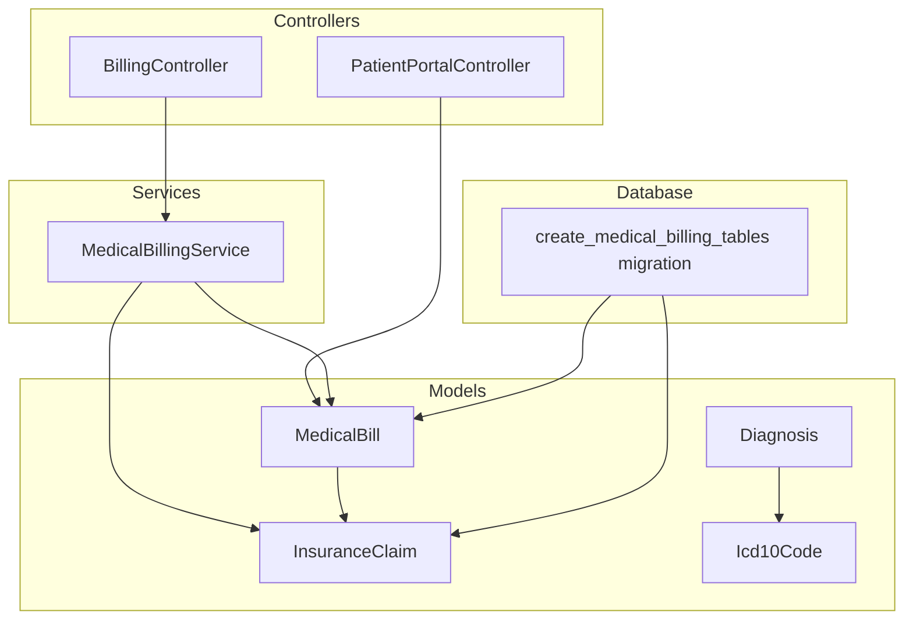

**Diagram sources**
- [BillingController.php:1-296](file://app/Http/Controllers/Healthcare/BillingController.php#L1-L296)
- [PatientPortalController.php:1-346](file://app/Http/Controllers/Healthcare/PatientPortalController.php#L1-L346)
- [MedicalBillingService.php:1-563](file://app/Services/MedicalBillingService.php#L1-L563)
- [MedicalBill.php:1-164](file://app/Models/MedicalBill.php#L1-L164)
- [InsuranceClaim.php:1-56](file://app/Models/InsuranceClaim.php#L1-L56)
- [Icd10Code.php:1-59](file://app/Models/Icd10Code.php#L1-L59)
- [Diagnosis.php:1-115](file://app/Models/Diagnosis.php#L1-L115)
- [create_medical_billing_tables.php:1-286](file://database/migrations/2026_04_08_900001_create_medical_billing_tables.php#L1-L286)

**Section sources**
- [MedicalBillingService.php:1-563](file://app/Services/MedicalBillingService.php#L1-L563)
- [create_medical_billing_tables.php:1-286](file://database/migrations/2026_04_08_900001_create_medical_billing_tables.php#L1-L286)

## Core Components
- MedicalBillingService: Central service orchestrating bill generation, claim creation, claim submission, adjudication, copayment collection, and payment plan creation.
- MedicalBill: Represents patient bills with totals, insurance coverage, payment status, and billing status.
- InsuranceClaim: Stores claim metadata, amounts, submission details, rejection information, and appeal tracking.
- Icd10Code: Maintains ICD-10 terminology for diagnosis coding with scopes for search and filtering.
- Diagnosis: Links visits to ICD-10 codes with types, statuses, and formatted display attributes.
- Controllers: BillingController for administrative billing and reporting; PatientPortalController for patient-facing billing and payment actions.

**Section sources**
- [MedicalBillingService.php:15-563](file://app/Services/MedicalBillingService.php#L15-L563)
- [MedicalBill.php:8-164](file://app/Models/MedicalBill.php#L8-L164)
- [InsuranceClaim.php:9-56](file://app/Models/InsuranceClaim.php#L9-L56)
- [Icd10Code.php:8-59](file://app/Models/Icd10Code.php#L8-L59)
- [Diagnosis.php:9-115](file://app/Models/Diagnosis.php#L9-L115)
- [BillingController.php:13-296](file://app/Http/Controllers/Healthcare/BillingController.php#L13-L296)
- [PatientPortalController.php:15-346](file://app/Http/Controllers/Healthcare/PatientPortalController.php#L15-L346)

## Architecture Overview
The system follows a layered architecture:
- Presentation Layer: Controllers handle HTTP requests and render views for billing dashboards and patient portal pages.
- Application Layer: Services encapsulate business workflows for billing, claims, payments, and analytics.
- Domain Layer: Models represent entities and enforce data integrity and relationships.
- Persistence Layer: Migrations define normalized schemas for billing, claims, adjudications, copayments, and payment plans.

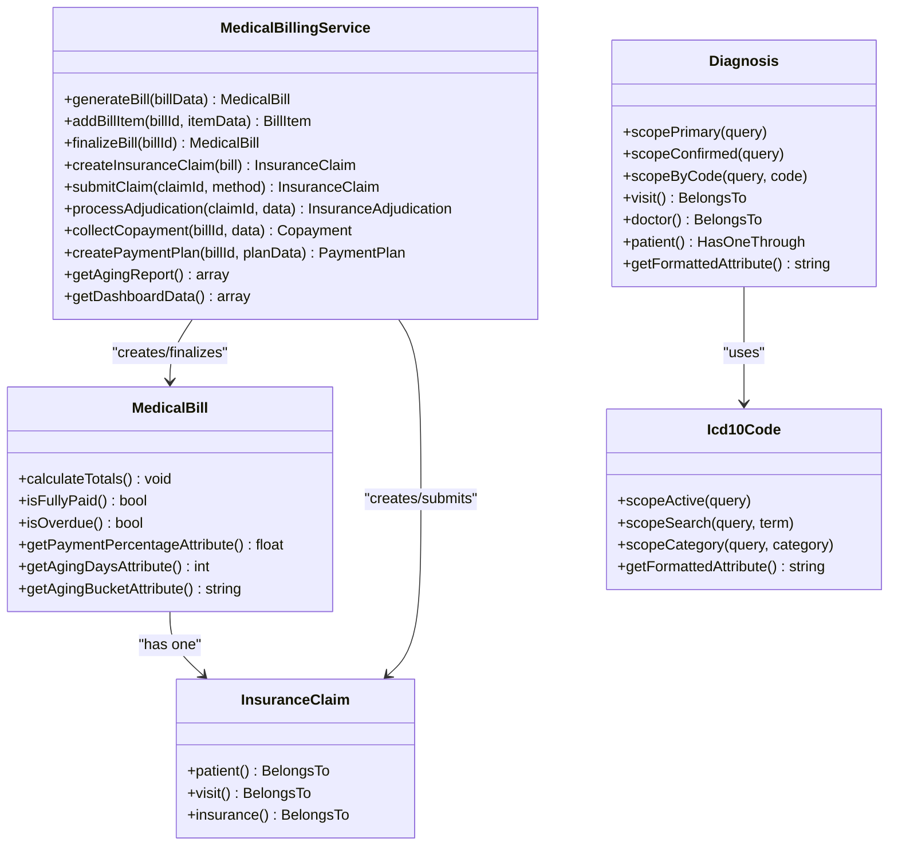

**Diagram sources**
- [MedicalBillingService.php:15-563](file://app/Services/MedicalBillingService.php#L15-L563)
- [MedicalBill.php:8-164](file://app/Models/MedicalBill.php#L8-L164)
- [InsuranceClaim.php:9-56](file://app/Models/InsuranceClaim.php#L9-L56)
- [Icd10Code.php:8-59](file://app/Models/Icd10Code.php#L8-L59)
- [Diagnosis.php:9-115](file://app/Models/Diagnosis.php#L9-L115)

## Detailed Component Analysis

### Charge Entry Workflow
Charge entry captures patient encounter details, applies discounts and taxes, and computes totals. The service supports adding bill items with quantities, unit prices, and insurance coverage flags. Totals are recalculated and stored on the bill.

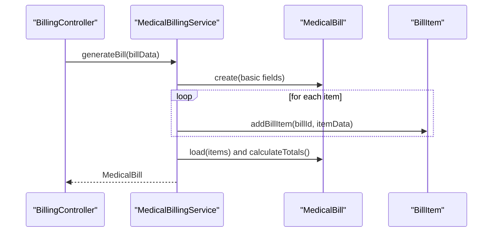

**Diagram sources**
- [MedicalBillingService.php:20-107](file://app/Services/MedicalBillingService.php#L20-L107)
- [MedicalBill.php:93-109](file://app/Models/MedicalBill.php#L93-L109)
- [BillingController.php:60-98](file://app/Http/Controllers/Healthcare/BillingController.php#L60-L98)

**Section sources**
- [MedicalBillingService.php:20-107](file://app/Services/MedicalBillingService.php#L20-L107)
- [MedicalBill.php:93-109](file://app/Models/MedicalBill.php#L93-L109)

### Insurance Eligibility Verification
Eligibility verification is modeled by associating bills with insurance providers and policy/group numbers. The system stores insurance coverage amounts and calculates patient payable and balance due accordingly.

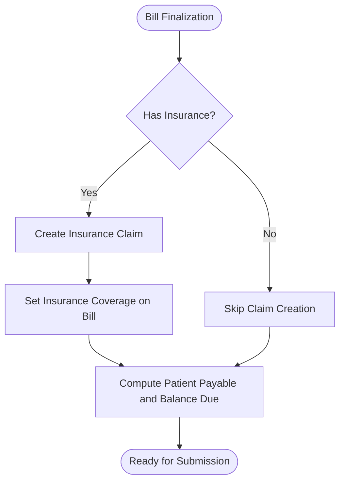

**Diagram sources**
- [MedicalBillingService.php:90-132](file://app/Services/MedicalBillingService.php#L90-L132)
- [MedicalBill.php:93-109](file://app/Models/MedicalBill.php#L93-L109)

**Section sources**
- [MedicalBillingService.php:90-132](file://app/Services/MedicalBillingService.php#L90-L132)
- [MedicalBill.php:93-109](file://app/Models/MedicalBill.php#L93-L109)

### Claim Submission Process
Claims are prepared with standardized fields including claim number, patient, policy details, service dates, diagnosis and procedure codes, billed amount, and bill items. Submission updates claim and bill statuses and logs the event.

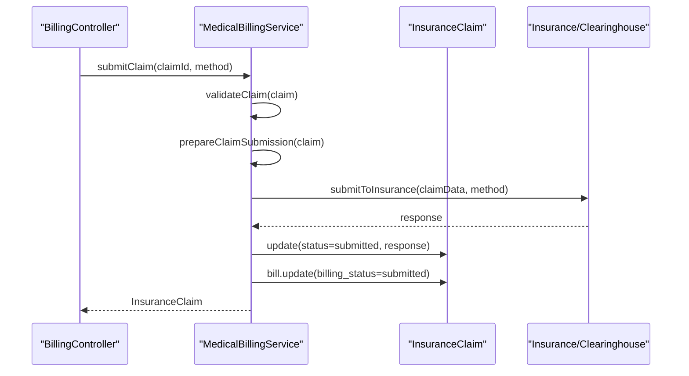

**Diagram sources**
- [MedicalBillingService.php:137-171](file://app/Services/MedicalBillingService.php#L137-L171)
- [BillingController.php:204-216](file://app/Http/Controllers/Healthcare/BillingController.php#L204-L216)

**Section sources**
- [MedicalBillingService.php:137-171](file://app/Services/MedicalBillingService.php#L137-L171)
- [create_medical_billing_tables.php:110-165](file://database/migrations/2026_04_08_900001_create_medical_billing_tables.php#L110-L165)

### Claim Adjudication and Denial Management
Adjudications capture allowed amounts, deductibles, copays, coinsurance, approved/rejected amounts, and remittance details. Partial approvals set claim status accordingly and update bill balances.

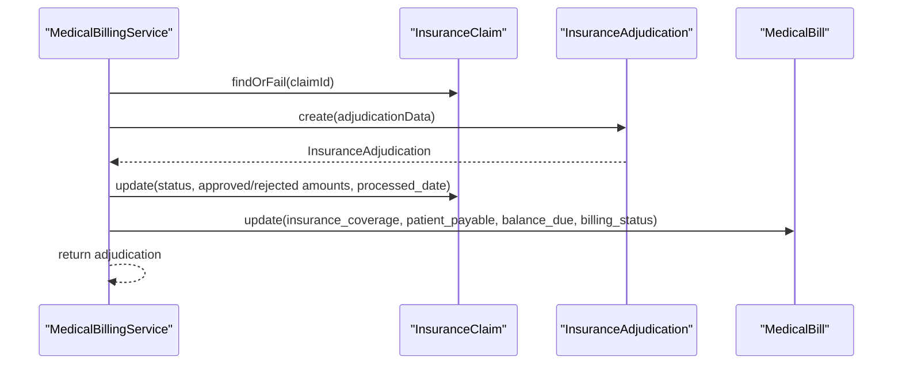

**Diagram sources**
- [MedicalBillingService.php:176-224](file://app/Services/MedicalBillingService.php#L176-L224)

**Section sources**
- [MedicalBillingService.php:176-224](file://app/Services/MedicalBillingService.php#L176-L224)
- [create_medical_billing_tables.php:167-204](file://database/migrations/2026_04_08_900001_create_medical_billing_tables.php#L167-L204)

### Appeal Workflows
Claims marked with rejections support appeals. The schema includes appeal tracking fields (flag, date, notes). Appeals integrate with claim status transitions and remittance updates.

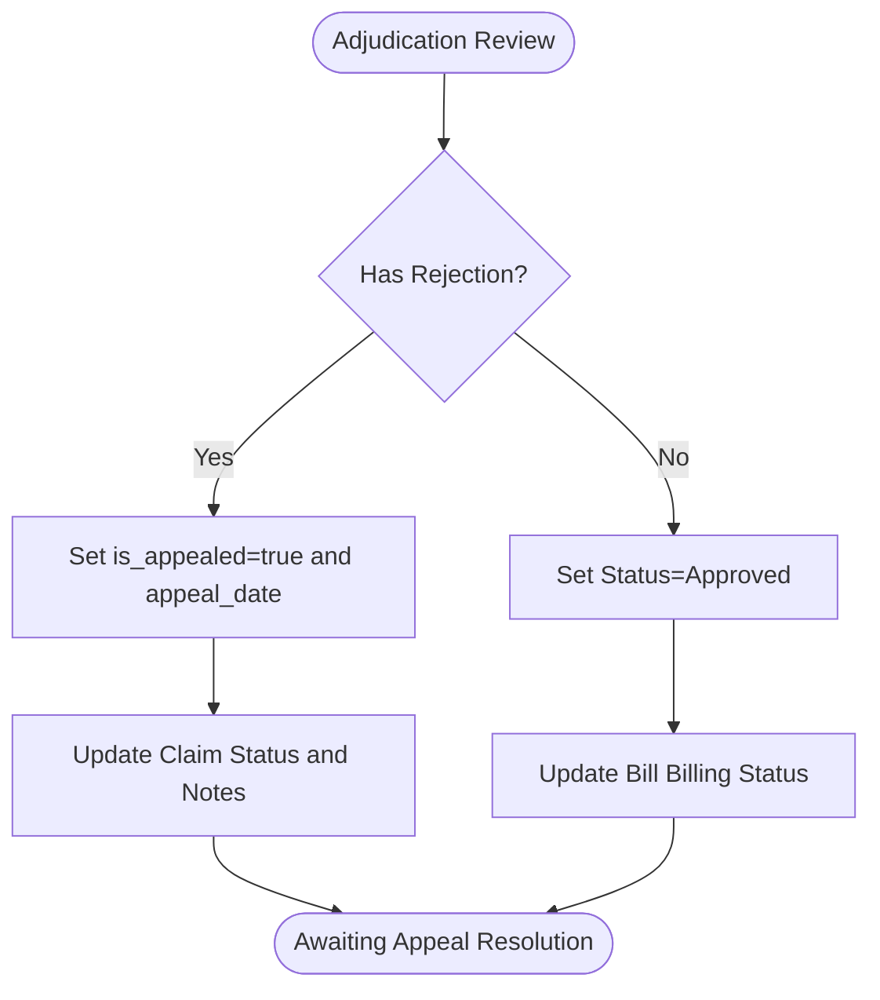

**Diagram sources**
- [create_medical_billing_tables.php:150-156](file://database/migrations/2026_04_08_900001_create_medical_billing_tables.php#L150-L156)

**Section sources**
- [create_medical_billing_tables.php:150-156](file://database/migrations/2026_04_08_900001_create_medical_billing_tables.php#L150-L156)

### Payment Posting Procedures
Payments are posted against bills, updating amount paid and balance due. Fully paid bills transition to paid status; partial payments set partial status.

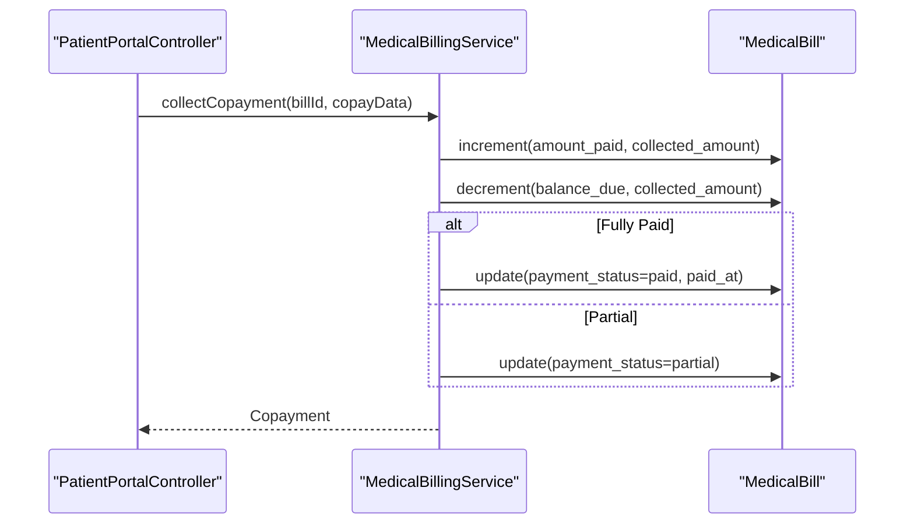

**Diagram sources**
- [MedicalBillingService.php:229-265](file://app/Services/MedicalBillingService.php#L229-L265)

**Section sources**
- [MedicalBillingService.php:229-265](file://app/Services/MedicalBillingService.php#L229-L265)

### Patient Billing Statements and Portal
The patient portal displays billing history, statistics, and allows secure payment initiation. Controllers and views coordinate billing data retrieval and presentation.

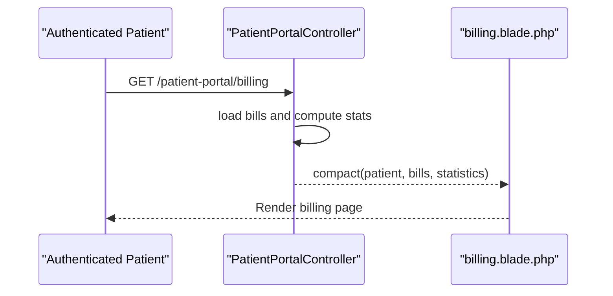

**Diagram sources**
- [PatientPortalController.php:209-239](file://app/Http/Controllers/Healthcare/PatientPortalController.php#L209-L239)
- [billing.blade.php:1-27](file://resources/views/healthcare/patient-portal/billing.blade.php#L1-L27)

**Section sources**
- [PatientPortalController.php:209-239](file://app/Http/Controllers/Healthcare/PatientPortalController.php#L209-L239)
- [billing.blade.php:1-27](file://resources/views/healthcare/patient-portal/billing.blade.php#L1-L27)

### Payment Plans and Financial Assistance
Payment plans enable installment schedules with configurable frequencies and down payments. The service generates payment schedules and updates plan tracking fields.

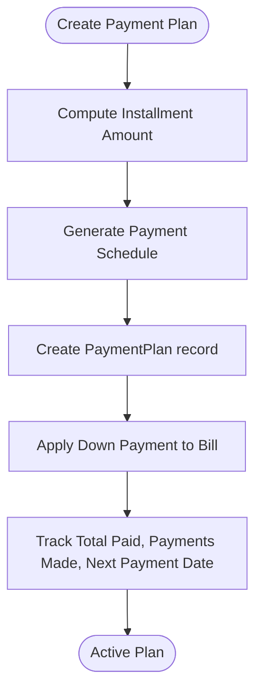

**Diagram sources**
- [MedicalBillingService.php:270-316](file://app/Services/MedicalBillingService.php#L270-L316)

**Section sources**
- [MedicalBillingService.php:270-316](file://app/Services/MedicalBillingService.php#L270-L316)
- [create_medical_billing_tables.php:234-270](file://database/migrations/2026_04_08_900001_create_medical_billing_tables.php#L234-L270)

### Collections Management and Aging Reports
Collections management leverages aging buckets derived from bill dates to categorize receivables. The service aggregates counts and amounts per bucket for reporting.

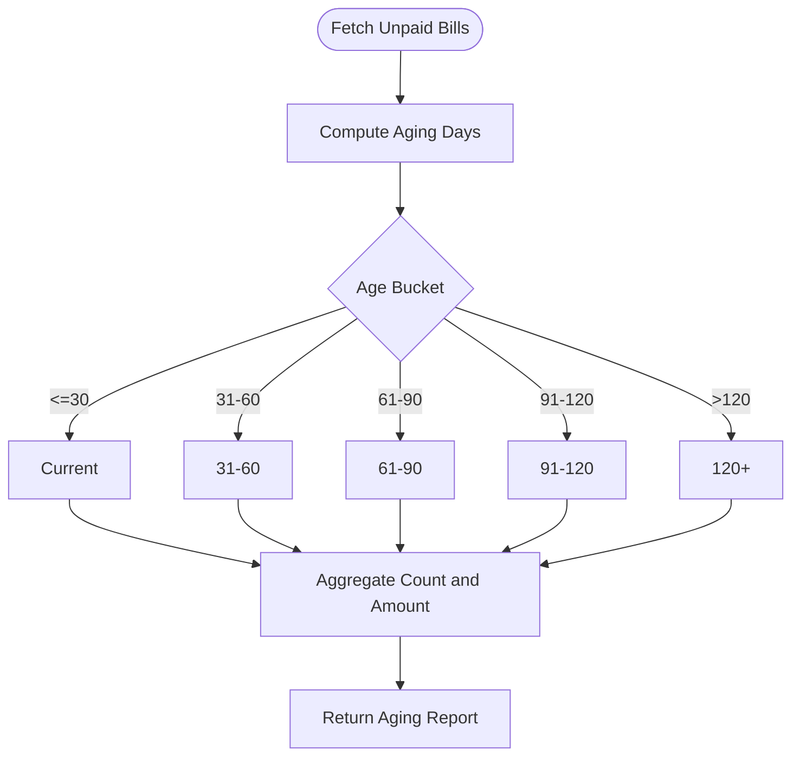

**Diagram sources**
- [MedicalBillingService.php:321-344](file://app/Services/MedicalBillingService.php#L321-L344)
- [MedicalBill.php:149-162](file://app/Models/MedicalBill.php#L149-L162)

**Section sources**
- [MedicalBillingService.php:321-344](file://app/Services/MedicalBillingService.php#L321-L344)
- [MedicalBill.php:149-162](file://app/Models/MedicalBill.php#L149-L162)

### Integration with ICD-10 and Diagnosis Codes
Diagnosis entries link to ICD-10 codes with types and statuses. The system supports searching and filtering ICD-10 codes and formatting display labels.

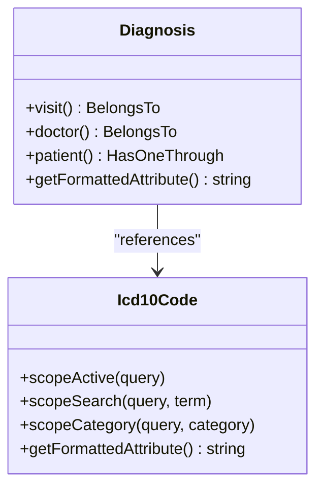

**Diagram sources**
- [Diagnosis.php:9-115](file://app/Models/Diagnosis.php#L9-L115)
- [Icd10Code.php:8-59](file://app/Models/Icd10Code.php#L8-L59)

**Section sources**
- [Diagnosis.php:9-115](file://app/Models/Diagnosis.php#L9-L115)
- [Icd10Code.php:8-59](file://app/Models/Icd10Code.php#L8-L59)
- [diagnose.blade.php:58-229](file://resources/views/healthcare/emr/diagnose.blade.php#L58-L229)
- [diagnoses.blade.php:148-170](file://resources/views/emr/diagnoses.blade.php#L148-L170)

### Revenue Cycle Management
The revenue cycle spans from charge entry to payment posting and collections. Controllers provide dashboards and reports, while services manage statuses and calculations.

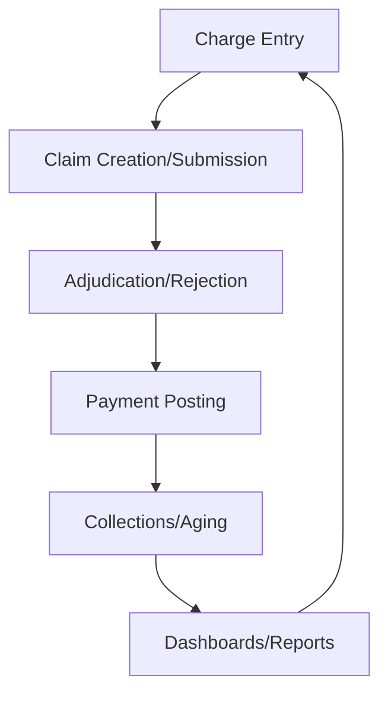

**Diagram sources**
- [BillingController.php:18-31](file://app/Http/Controllers/Healthcare/BillingController.php#L18-L31)
- [MedicalBillingService.php:349-362](file://app/Services/MedicalBillingService.php#L349-L362)

**Section sources**
- [BillingController.php:18-31](file://app/Http/Controllers/Healthcare/BillingController.php#L18-L31)
- [MedicalBillingService.php:349-362](file://app/Services/MedicalBillingService.php#L349-L362)

## Dependency Analysis
The system exhibits clear separation of concerns:
- Controllers depend on services for business logic.
- Services depend on models for persistence and calculations.
- Models define relationships and scopes for queries.
- Migrations define normalized schemas with appropriate indexes.

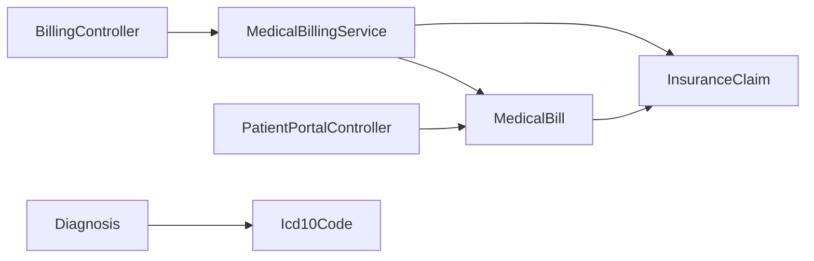

**Diagram sources**
- [BillingController.php:13-296](file://app/Http/Controllers/Healthcare/BillingController.php#L13-L296)
- [PatientPortalController.php:15-346](file://app/Http/Controllers/Healthcare/PatientPortalController.php#L15-L346)
- [MedicalBillingService.php:15-563](file://app/Services/MedicalBillingService.php#L15-L563)
- [MedicalBill.php:8-164](file://app/Models/MedicalBill.php#L8-L164)
- [InsuranceClaim.php:9-56](file://app/Models/InsuranceClaim.php#L9-L56)
- [Icd10Code.php:8-59](file://app/Models/Icd10Code.php#L8-L59)
- [Diagnosis.php:9-115](file://app/Models/Diagnosis.php#L9-L115)

**Section sources**
- [create_medical_billing_tables.php:1-286](file://database/migrations/2026_04_08_900001_create_medical_billing_tables.php#L1-L286)

## Performance Considerations
- Indexes on frequently queried columns (bill_number, patient_id, payment_status, billing_status, bill_date, due_date, claim_number, insurance_provider_id) improve query performance.
- Aggregation queries for dashboards and reports should leverage database-level grouping and caching mechanisms.
- Use pagination for billing lists and reports to limit memory usage.
- Consider background jobs for claim submissions and adjudication updates to avoid long-running requests.

## Troubleshooting Guide
Common issues and resolutions:
- Validation errors during claim submission: Ensure policy number and billed amount are present and valid before submission.
- Adjudication discrepancies: Verify allowed/deductible/copay/coinsurance amounts and remittance details align with claim data.
- Payment posting mismatches: Confirm amount paid increments and balance due decrements are applied consistently.
- Aging report anomalies: Validate bill dates and statuses to ensure accurate bucketing.

**Section sources**
- [MedicalBillingService.php:451-460](file://app/Services/MedicalBillingService.php#L451-L460)
- [MedicalBillingService.php:176-224](file://app/Services/MedicalBillingService.php#L176-L224)
- [MedicalBillingService.php:229-265](file://app/Services/MedicalBillingService.php#L229-L265)
- [MedicalBillingService.php:321-344](file://app/Services/MedicalBillingService.php#L321-L344)

## Conclusion
The system provides a robust foundation for medical billing and insurance claim processing, integrating charge entry, eligibility checks, claim submission, adjudication, payment posting, and collections. It leverages ICD-10 codes for clinical accuracy and offers patient portal capabilities for transparency and convenience. Extending integration points for insurance companies and clearinghouses, and implementing automated adjudication and appeal workflows, will further strengthen the revenue cycle management capabilities.

## Appendices
- Administrative dashboards and reports are exposed via controllers for billing managers.
- Patient portal features support billing visibility and secure payment initiation.
- ICD-10 search and diagnosis management are integrated into EMR and diagnosis screens.

[No sources needed since this section summarizes without analyzing specific files]