# Pharmacy & Medication Dispensing Operations

<cite>
**Referenced Files in This Document**
- [PharmacyController.php](file://app/Http/Controllers/Healthcare/PharmacyController.php)
- [PharmacyService.php](file://app/Services/PharmacyService.php)
- [PharmacyInventory.php](file://app/Models/PharmacyInventory.php)
- [Prescription.php](file://app/Models/Prescription.php)
- [Medicine.php](file://app/Models/Medicine.php)
- [create_pharmacy_tables.php](file://database/migrations/2026_04_08_600001_create_pharmacy_tables.php)
- [create_integration_tables.php](file://database/migrations/2026_04_08_1500001_create_integration_tables.php)
- [HealthcareIntegrationService.php](file://app/Services/HealthcareIntegrationService.php)
- [dispensing.blade.php](file://resources/views/pharmacy/dispensing.blade.php)
- [prescribe.blade.php](file://resources/views/healthcare/emr/prescribe.blade.php)
- [records.blade.php](file://resources/views/healthcare/patient-portal/records.blade.php)
- [show.blade.php](file://resources/views/healthcare/emr/show.blade.php)
- [camera-scanner.js](file://public/js/camera-scanner.js)
- [barcode-scanner.blade.php](file://resources/views/components/barcode-scanner.blade.php)
</cite>

## Table of Contents
1. [Introduction](#introduction)
2. [Project Structure](#project-structure)
3. [Core Components](#core-components)
4. [Architecture Overview](#architecture-overview)
5. [Detailed Component Analysis](#detailed-component-analysis)
6. [Dependency Analysis](#dependency-analysis)
7. [Performance Considerations](#performance-considerations)
8. [Troubleshooting Guide](#troubleshooting-guide)
9. [Conclusion](#conclusion)

## Introduction
This document describes the pharmacy and medication dispensing operations implemented in the system. It covers prescription entry, drug interaction checking, dosage calculations, and medication administration records. It also explains integration with pharmacy management systems, drug formularies, controlled substance tracking, dispensing workflows, automated dispensing systems, barcode scanning, and medication reconciliation processes. Additional topics include inventory management, expiration tracking, drug shortage alerts, therapeutic substitution protocols, integration with electronic prescribing systems and pharmacy benefit managers, and medication therapy management. Safety protocols, adverse drug reaction monitoring, and patient education resources are addressed.

## Project Structure
The pharmacy domain spans controllers, services, models, migrations, and views:
- Controllers orchestrate user actions (dashboard, inventory, prescriptions, dispensing).
- Services encapsulate business logic (stock management, interactions, alerts, analytics).
- Models represent entities (PharmacyInventory, Prescription, Medicine) and define scopes and helpers.
- Migrations define schema for medicines, stock batches, interactions, dispensing, alerts, and analytics.
- Views render dashboards, forms, and lists for prescriptions and dispensing.

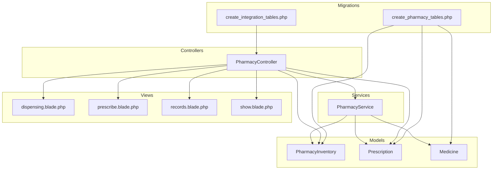

**Diagram sources**
- [PharmacyController.php:1-304](file://app/Http/Controllers/Healthcare/PharmacyController.php#L1-L304)
- [PharmacyService.php:1-363](file://app/Services/PharmacyService.php#L1-L363)
- [PharmacyInventory.php:1-362](file://app/Models/PharmacyInventory.php#L1-L362)
- [Prescription.php:1-201](file://app/Models/Prescription.php#L1-L201)
- [Medicine.php:1-189](file://app/Models/Medicine.php#L1-L189)
- [create_pharmacy_tables.php:1-327](file://database/migrations/2026_04_08_600001_create_pharmacy_tables.php#L1-L327)
- [create_integration_tables.php:142-172](file://database/migrations/2026_04_08_1500001_create_integration_tables.php#L142-L172)
- [dispensing.blade.php:1-144](file://resources/views/pharmacy/dispensing.blade.php#L1-L144)
- [prescribe.blade.php:74-136](file://resources/views/healthcare/emr/prescribe.blade.php#L74-L136)
- [records.blade.php:199-214](file://resources/views/healthcare/patient-portal/records.blade.php#L199-L214)
- [show.blade.php:222-241](file://resources/views/healthcare/emr/show.blade.php#L222-L241)

**Section sources**
- [PharmacyController.php:1-304](file://app/Http/Controllers/Healthcare/PharmacyController.php#L1-L304)
- [PharmacyService.php:1-363](file://app/Services/PharmacyService.php#L1-L363)
- [PharmacyInventory.php:1-362](file://app/Models/PharmacyInventory.php#L1-L362)
- [Prescription.php:1-201](file://app/Models/Prescription.php#L1-L201)
- [Medicine.php:1-189](file://app/Models/Medicine.php#L1-L189)
- [create_pharmacy_tables.php:1-327](file://database/migrations/2026_04_08_600001_create_pharmacy_tables.php#L1-L327)
- [create_integration_tables.php:142-172](file://database/migrations/2026_04_08_1500001_create_integration_tables.php#L142-L172)
- [dispensing.blade.php:1-144](file://resources/views/pharmacy/dispensing.blade.php#L1-L144)
- [prescribe.blade.php:74-136](file://resources/views/healthcare/emr/prescribe.blade.php#L74-L136)
- [records.blade.php:199-214](file://resources/views/healthcare/patient-portal/records.blade.php#L199-L214)
- [show.blade.php:222-241](file://resources/views/healthcare/emr/show.blade.php#L222-L241)

## Core Components
- PharmacyController: Provides endpoints for dashboard, inventory, prescriptions, verification, dispensing, alerts, expiring items, stock opname, and reporting.
- PharmacyService: Implements stock addition, dispensing, FEFO stock deduction, drug interaction checks, expiration tracking, low-stock detection, analytics generation, and search.
- PharmacyInventory: Manages item-level inventory, stock issuance/reservation/adjustment, and computed attributes (available stock, stock status, profit margin).
- Prescription: Manages prescription lifecycle, numbering, expiration, and status transitions.
- Medicine: Represents formulary entries with categories, pricing, stock summaries, and scopes for filtering.
- Migrations: Define schema for medicines, stock batches, interactions, dispensing, alerts, analytics, and integration logs.
- Integration: HealthcareIntegrationService supports sending prescriptions to external pharmacy systems and logging transactions.

**Section sources**
- [PharmacyController.php:15-304](file://app/Http/Controllers/Healthcare/PharmacyController.php#L15-L304)
- [PharmacyService.php:19-363](file://app/Services/PharmacyService.php#L19-L363)
- [PharmacyInventory.php:13-362](file://app/Models/PharmacyInventory.php#L13-L362)
- [Prescription.php:13-201](file://app/Models/Prescription.php#L13-L201)
- [Medicine.php:13-189](file://app/Models/Medicine.php#L13-L189)
- [create_pharmacy_tables.php:38-326](file://database/migrations/2026_04_08_600001_create_pharmacy_tables.php#L38-L326)
- [HealthcareIntegrationService.php:258-301](file://app/Services/HealthcareIntegrationService.php#L258-L301)

## Architecture Overview
The system follows a layered architecture:
- Presentation: Blade views for dashboards, forms, and lists.
- Application: Controllers coordinate requests and delegate to services.
- Domain: Services encapsulate business rules (interactions, stock, alerts, analytics).
- Persistence: Eloquent models and migrations define schema and relationships.

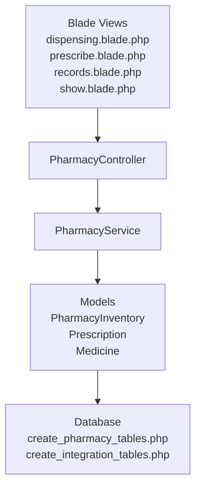

**Diagram sources**
- [PharmacyController.php:1-304](file://app/Http/Controllers/Healthcare/PharmacyController.php#L1-L304)
- [PharmacyService.php:1-363](file://app/Services/PharmacyService.php#L1-L363)
- [PharmacyInventory.php:1-362](file://app/Models/PharmacyInventory.php#L1-L362)
- [Prescription.php:1-201](file://app/Models/Prescription.php#L1-L201)
- [Medicine.php:1-189](file://app/Models/Medicine.php#L1-L189)
- [create_pharmacy_tables.php:1-327](file://database/migrations/2026_04_08_600001_create_pharmacy_tables.php#L1-L327)
- [dispensing.blade.php:1-144](file://resources/views/pharmacy/dispensing.blade.php#L1-L144)
- [prescribe.blade.php:74-136](file://resources/views/healthcare/emr/prescribe.blade.php#L74-L136)
- [records.blade.php:199-214](file://resources/views/healthcare/patient-portal/records.blade.php#L199-L214)
- [show.blade.php:222-241](file://resources/views/healthcare/emr/show.blade.php#L222-L241)

## Detailed Component Analysis

### Prescription Entry and Verification
- Prescription creation generates a unique identifier and supports scoping for active/pending status.
- Verification sets status to verified and records verifier metadata.
- Dispensing requires verified status and validates quantity against inventory.

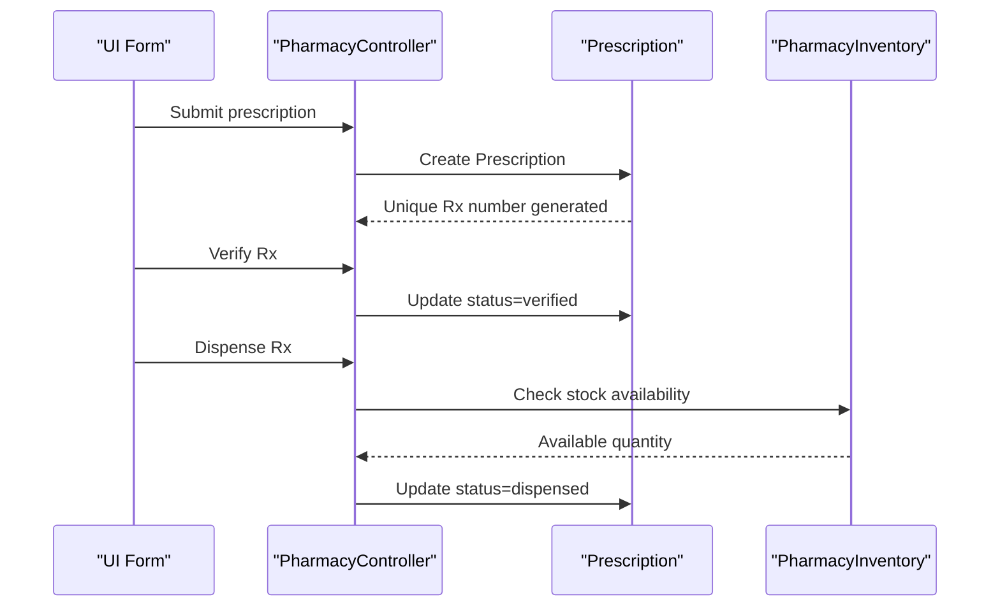

**Diagram sources**
- [Prescription.php:50-80](file://app/Models/Prescription.php#L50-L80)
- [PharmacyController.php:148-197](file://app/Http/Controllers/Healthcare/PharmacyController.php#L148-L197)
- [PharmacyInventory.php:297-304](file://app/Models/PharmacyInventory.php#L297-L304)

**Section sources**
- [Prescription.php:13-201](file://app/Models/Prescription.php#L13-L201)
- [PharmacyController.php:118-197](file://app/Http/Controllers/Healthcare/PharmacyController.php#L118-L197)
- [prescribe.blade.php:74-136](file://resources/views/healthcare/emr/prescribe.blade.php#L74-L136)

### Drug Interaction Checking
- The service computes all pairwise interactions among prescribed medicines and categorizes severity.
- Dispensing is blocked if critical or major interactions are detected.

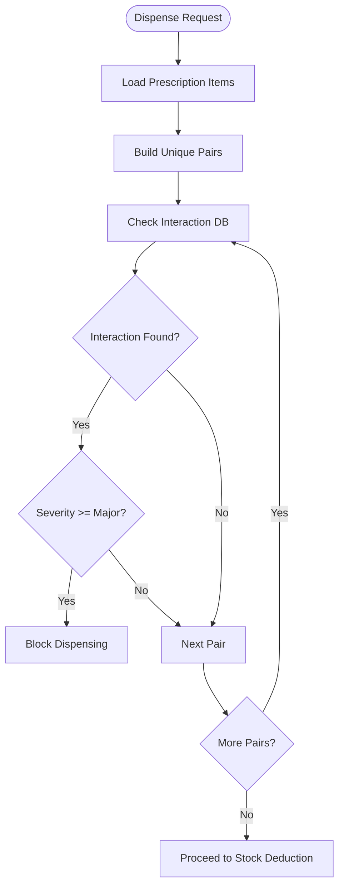

**Diagram sources**
- [PharmacyService.php:142-179](file://app/Services/PharmacyService.php#L142-L179)

**Section sources**
- [PharmacyService.php:61-66](file://app/Services/PharmacyService.php#L61-L66)
- [create_pharmacy_tables.php:162-190](file://database/migrations/2026_04_08_600001_create_pharmacy_tables.php#L162-L190)

### Dosage Calculations and Administration Records
- Dosage and frequency are captured during prescription entry.
- Administration records capture dispensed quantities, batch numbers, and pharmacist notes.
- The system updates totals and maintains transaction logs.

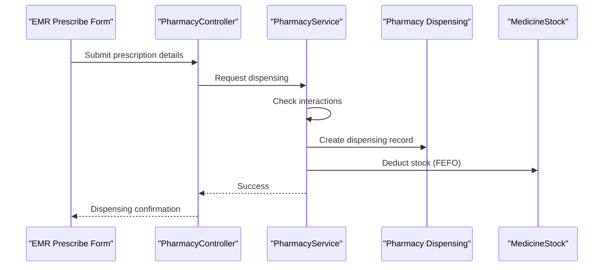

**Diagram sources**
- [prescribe.blade.php:74-136](file://resources/views/healthcare/emr/prescribe.blade.php#L74-L136)
- [PharmacyService.php:56-99](file://app/Services/PharmacyService.php#L56-L99)
- [create_pharmacy_tables.php:192-236](file://database/migrations/2026_04_08_600001_create_pharmacy_tables.php#L192-L236)

**Section sources**
- [PharmacyService.php:56-99](file://app/Services/PharmacyService.php#L56-L99)
- [create_pharmacy_tables.php:192-236](file://database/migrations/2026_04_08_600001_create_pharmacy_tables.php#L192-L236)

### Inventory Management and Expiration Tracking
- Stock addition creates batch-level records with expiry dates and storage locations.
- FEFO (First Expired First Out) ensures oldest stock is issued first.
- Expiring-soon alerts are generated with priority based on days to expiry.
- Low-stock and out-of-stock thresholds trigger alerts.

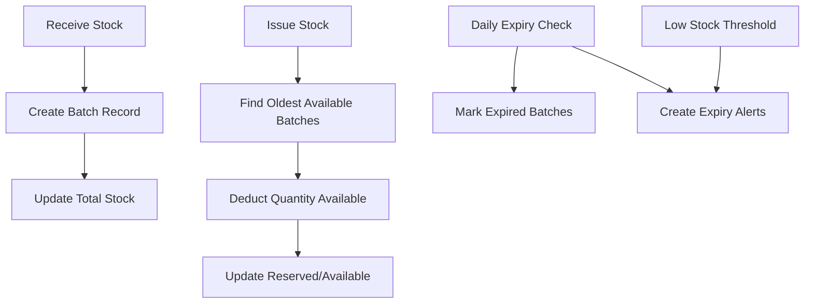

**Diagram sources**
- [PharmacyService.php:19-51](file://app/Services/PharmacyService.php#L19-L51)
- [PharmacyService.php:105-137](file://app/Services/PharmacyService.php#L105-L137)
- [PharmacyService.php:184-206](file://app/Services/PharmacyService.php#L184-L206)
- [PharmacyService.php:211-227](file://app/Services/PharmacyService.php#L211-L227)
- [PharmacyService.php:232-252](file://app/Services/PharmacyService.php#L232-L252)
- [create_pharmacy_tables.php:92-136](file://database/migrations/2026_04_08_600001_create_pharmacy_tables.php#L92-L136)

**Section sources**
- [PharmacyService.php:19-51](file://app/Services/PharmacyService.php#L19-L51)
- [PharmacyService.php:105-137](file://app/Services/PharmacyService.php#L105-L137)
- [PharmacyService.php:184-206](file://app/Services/PharmacyService.php#L184-L206)
- [PharmacyService.php:211-227](file://app/Services/PharmacyService.php#L211-L227)
- [PharmacyService.php:232-252](file://app/Services/PharmacyService.php#L232-L252)
- [PharmacyInventory.php:275-340](file://app/Models/PharmacyInventory.php#L275-L340)

### Controlled Substance Tracking
- Controlled substances are flagged at item and category levels.
- PharmacyInventory and Medicine models include flags for controlled substances.
- Integration logs support directionality for sending data to external systems.

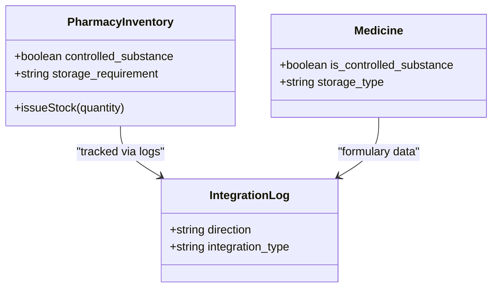

**Diagram sources**
- [PharmacyInventory.php:42-47](file://app/Models/PharmacyInventory.php#L42-L47)
- [Medicine.php:34-36](file://app/Models/Medicine.php#L34-L36)
- [create_integration_tables.php:154-172](file://database/migrations/2026_04_08_1500001_create_integration_tables.php#L154-L172)

**Section sources**
- [PharmacyInventory.php:42-47](file://app/Models/PharmacyInventory.php#L42-L47)
- [Medicine.php:34-36](file://app/Models/Medicine.php#L34-L36)
- [create_integration_tables.php:154-172](file://database/migrations/2026_04_08_1500001_create_integration_tables.php#L154-L172)

### Automated Dispensing Systems and Barcode Scanning
- Barcode scanning components integrate camera-based decoding for quick item identification.
- JavaScript scanner loads ZXing dynamically and handles camera access and scanning events.
- Blade components provide scanner UI with animated overlays and manual fallback.

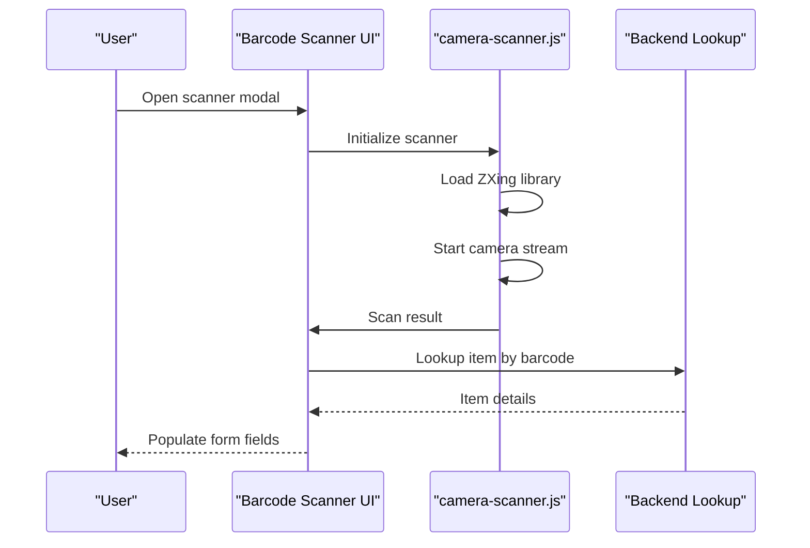

**Diagram sources**
- [camera-scanner.js:1-51](file://public/js/camera-scanner.js#L1-L51)
- [barcode-scanner.blade.php:79-106](file://resources/views/components/barcode-scanner.blade.php#L79-L106)

**Section sources**
- [camera-scanner.js:1-51](file://public/js/camera-scanner.js#L1-L51)
- [barcode-scanner.blade.php:79-106](file://resources/views/components/barcode-scanner.blade.php#L79-L106)

### Medication Reconciliation Processes
- Stock opname allows physical counts to reconcile system inventory.
- Adjustments are recorded with reasons and user attribution.
- Reports summarize dispensed volumes and revenue over time.

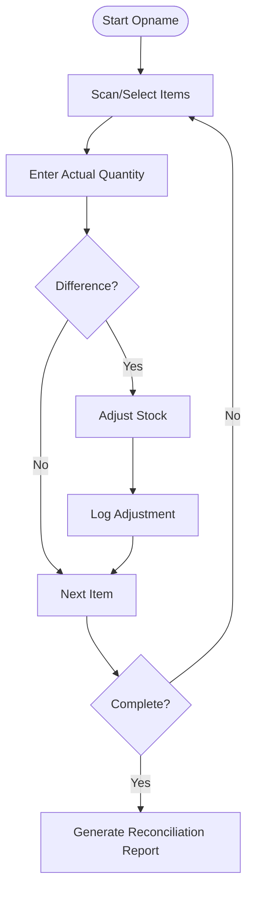

**Diagram sources**
- [PharmacyController.php:232-260](file://app/Http/Controllers/Healthcare/PharmacyController.php#L232-L260)

**Section sources**
- [PharmacyController.php:232-260](file://app/Http/Controllers/Healthcare/PharmacyController.php#L232-L260)

### Integration with Electronic Prescribing Systems and Pharmacy Benefit Managers
- HealthcareIntegrationService sends prescriptions to external pharmacy systems and logs outcomes.
- Integration logs capture direction, status, timing, and response data.

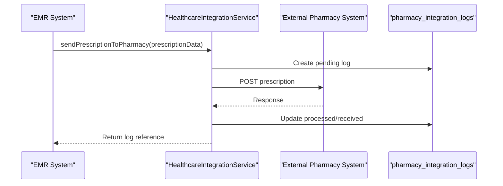

**Diagram sources**
- [HealthcareIntegrationService.php:258-301](file://app/Services/HealthcareIntegrationService.php#L258-L301)
- [create_integration_tables.php:154-172](file://database/migrations/2026_04_08_1500001_create_integration_tables.php#L154-L172)

**Section sources**
- [HealthcareIntegrationService.php:258-301](file://app/Services/HealthcareIntegrationService.php#L258-L301)
- [create_integration_tables.php:154-172](file://database/migrations/2026_04_08_1500001_create_integration_tables.php#L154-L172)

### Safety Protocols, Adverse Drug Reaction Monitoring, and Patient Education Resources
- Safety: Drug interaction checks prevent dispensing of contraindicated combinations; controlled substance flags enable compliance tracking.
- Monitoring: Alerts (low stock, expiring soon, expired) support proactive safety measures.
- Patient Education: Patient portal integrates health education content consumption and rating.

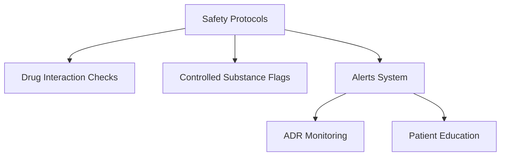

[No sources needed since this diagram shows conceptual workflow, not actual code structure]

**Section sources**
- [PharmacyService.php:142-179](file://app/Services/PharmacyService.php#L142-L179)
- [PharmacyInventory.php:42-47](file://app/Models/PharmacyInventory.php#L42-L47)
- [PharmacyService.php:315-336](file://app/Services/PharmacyService.php#L315-L336)
- [PatientPortalService.php:364-386](file://app/Services/PatientPortalService.php#L364-L386)

## Dependency Analysis
Key dependencies and relationships:
- PharmacyController depends on PharmacyInventory and Prescription models for inventory and Rx operations.
- PharmacyService depends on Medicine, MedicineStock, MedicineInteraction, PharmacyDispensing, and MedicineAlert models.
- Migrations define foreign keys and indexes across medicines, stocks, interactions, dispensing, alerts, and analytics.
- Integration logs connect controllers/services to external systems.

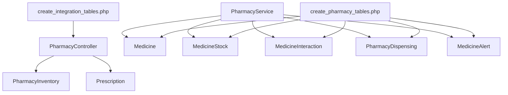

**Diagram sources**
- [PharmacyController.php:1-304](file://app/Http/Controllers/Healthcare/PharmacyController.php#L1-L304)
- [PharmacyService.php:1-363](file://app/Services/PharmacyService.php#L1-L363)
- [create_pharmacy_tables.php:1-327](file://database/migrations/2026_04_08_600001_create_pharmacy_tables.php#L1-L327)
- [create_integration_tables.php:142-172](file://database/migrations/2026_04_08_1500001_create_integration_tables.php#L142-L172)

**Section sources**
- [PharmacyController.php:1-304](file://app/Http/Controllers/Healthcare/PharmacyController.php#L1-L304)
- [PharmacyService.php:1-363](file://app/Services/PharmacyService.php#L1-L363)
- [create_pharmacy_tables.php:1-327](file://database/migrations/2026_04_08_600001_create_pharmacy_tables.php#L1-L327)
- [create_integration_tables.php:142-172](file://database/migrations/2026_04_08_1500001_create_integration_tables.php#L142-L172)

## Performance Considerations
- Indexes on frequently queried columns (expiry_date, status, analytics_date) improve lookup performance.
- FEFO stock deduction iterates available batches; batching and indexing reduce overhead.
- Analytics generation aggregates daily metrics; consider materialized views or scheduled jobs for large datasets.
- Barcode scanning relies on client-side decoding; ensure efficient image handling and minimal DOM updates.

[No sources needed since this section provides general guidance]

## Troubleshooting Guide
Common issues and resolutions:
- Insufficient stock during dispensing: Verify available stock and reserved quantities; ensure FEFO logic is applied.
- Expiration errors: Confirm expiry_date and is_expired flags; run daily expiry marking job.
- Interaction warnings: Review interaction severity and avoid combinations flagged as contraindicated or major.
- Barcode scanning failures: Check camera permissions, HTTPS deployment, and ZXing library loading.

**Section sources**
- [PharmacyInventory.php:297-304](file://app/Models/PharmacyInventory.php#L297-L304)
- [PharmacyService.php:211-227](file://app/Services/PharmacyService.php#L211-L227)
- [PharmacyService.php:64-66](file://app/Services/PharmacyService.php#L64-L66)
- [camera-scanner.js:17-51](file://public/js/camera-scanner.js#L17-L51)

## Conclusion
The system provides a robust foundation for pharmacy operations, integrating prescription lifecycle management, drug interaction checks, inventory control with expiration tracking, and automated dispensing workflows. It supports controlled substance compliance, barcode-assisted operations, reconciliation, and integration with external systems. The modular design enables extension for advanced features such as therapeutic substitution protocols, medication therapy management, and expanded safety monitoring.