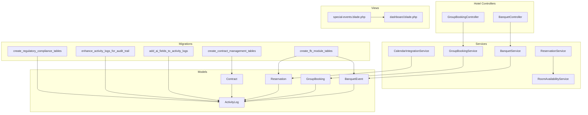
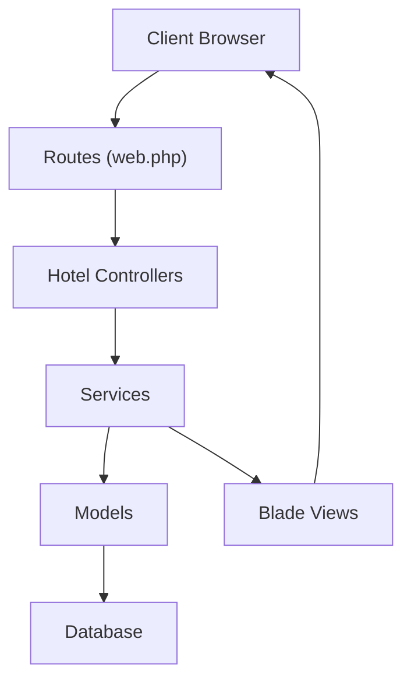
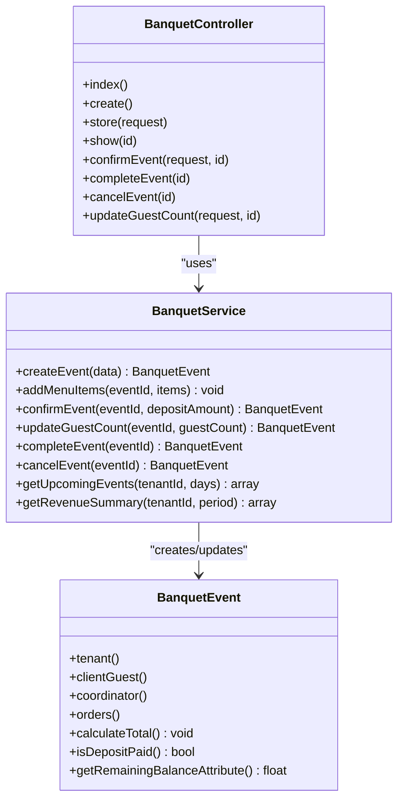
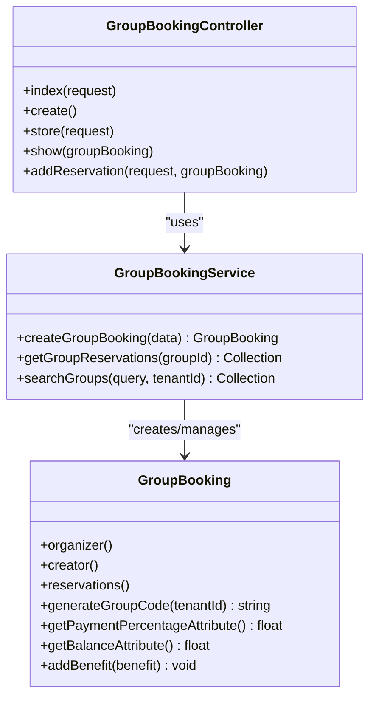
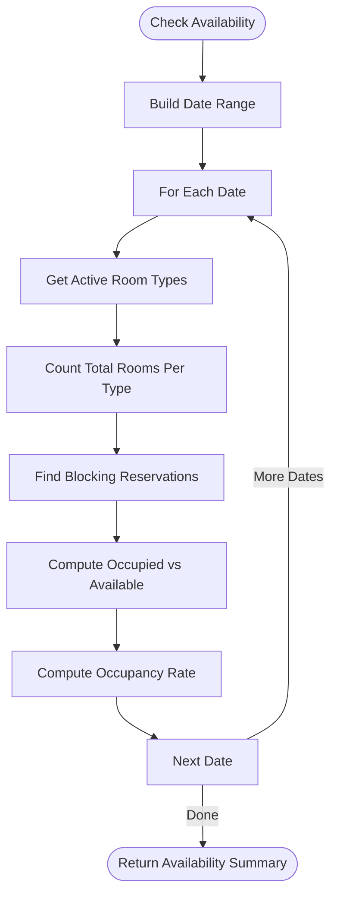
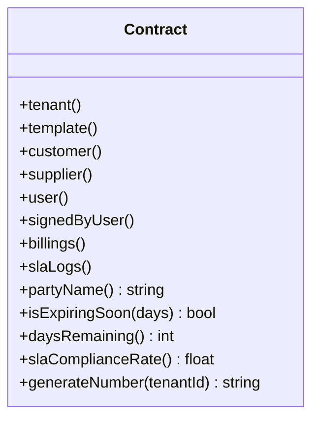
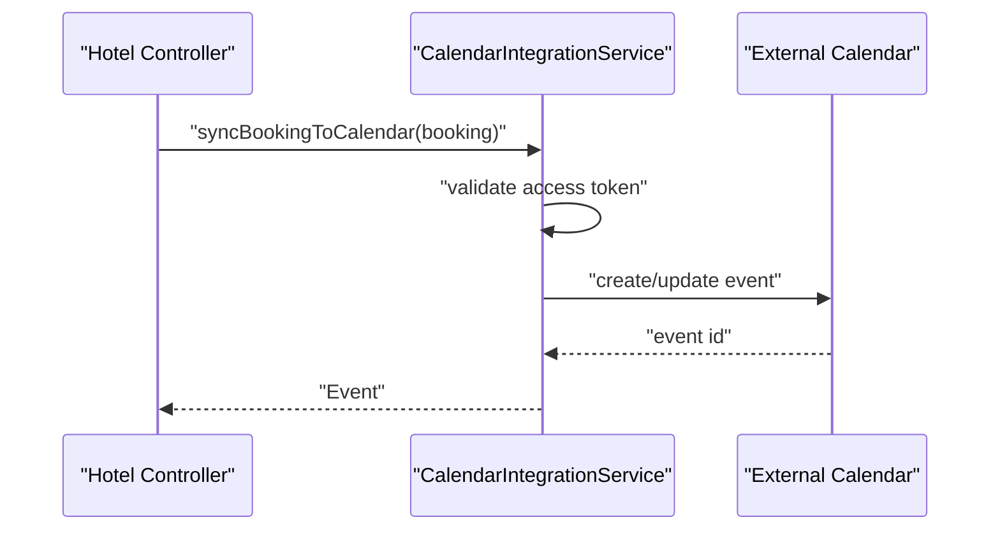
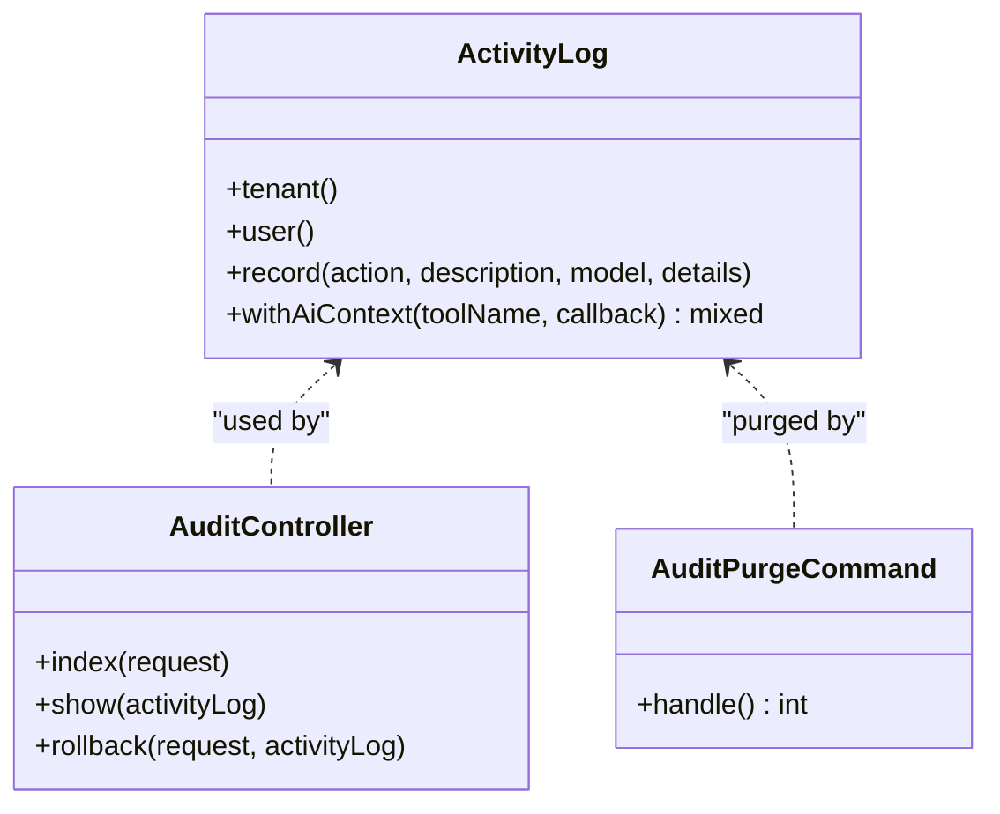
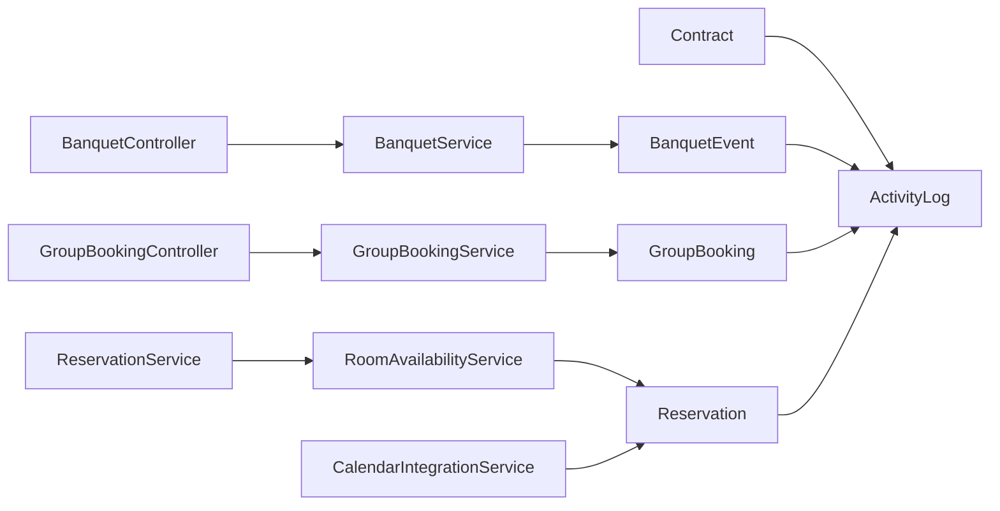

# Event & Conference Management

<cite>
**Referenced Files in This Document**
- [BanquetController.php](file://app/Http/Controllers/Hotel/BanquetController.php)
- [BanquetService.php](file://app/Services/BanquetService.php)
- [BanquetEvent.php](file://app/Models/BanquetEvent.php)
- [create_fb_module_tables.php](file://database/migrations/2026_04_03_400000_create_fb_module_tables.php)
- [GroupBookingController.php](file://app/Http/Controllers/Hotel/GroupBookingController.php)
- [GroupBookingService.php](file://app/Services/GroupBookingService.php)
- [GroupBooking.php](file://app/Models/GroupBooking.php)
- [RoomAvailabilityService.php](file://app/Services/RoomAvailabilityService.php)
- [ReservationService.php](file://app/Services/ReservationService.php)
- [Reservation.php](file://app/Models/Reservation.php)
- [Contract.php](file://app/Models/Contract.php)
- [create_contract_management_tables.php](file://database/migrations/2026_03_25_000003_create_contract_management_tables.php)
- [CalendarIntegrationService.php](file://app/Services/CalendarIntegrationService.php)
- [web.php](file://routes/web.php)
- [ActivityLog.php](file://app/Models/ActivityLog.php)
- [AuditController.php](file://app/Http/Controllers/AuditController.php)
- [AuditPurgeCommand.php](file://app/Console/Commands/AuditPurgeCommand.php)
- [2026_03_22_054510_add_ai_fields_to_activity_logs_table.php](file://database/migrations/2026_03_22_054510_add_ai_fields_to_activity_logs_table.php)
- [2026_04_01_000002_enhance_activity_logs_for_audit_trail.php](file://database/migrations/2026_04_01_000002_enhance_activity_logs_for_audit_trail.php)
- [2026_04_08_1400001_create_regulatory_compliance_tables.php](file://database/migrations/2026_04_08_1400001_create_regulatory_compliance_tables.php)
- [CrmTools.php](file://app/Services/ERP/CrmTools.php)
- [special-events.blade.php](file://resources/views/hotel/revenue/special-events.blade.php)
- [dashboard.blade.php](file://resources/views/hotel/revenue/dashboard.blade.php)
</cite>

## Table of Contents
1. [Introduction](#introduction)
2. [Project Structure](#project-structure)
3. [Core Components](#core-components)
4. [Architecture Overview](#architecture-overview)
5. [Detailed Component Analysis](#detailed-component-analysis)
6. [Dependency Analysis](#dependency-analysis)
7. [Performance Considerations](#performance-considerations)
8. [Troubleshooting Guide](#troubleshooting-guide)
9. [Conclusion](#conclusion)
10. [Appendices](#appendices)

## Introduction
This document describes the Event and Conference Management capabilities implemented in the system. It covers banquet event planning, conference center operations, meeting room management, and event coordination workflows. It also explains event booking systems, venue availability and capacity management, catering services, audiovisual equipment management, event staffing requirements, event revenue tracking, contract management, customer relationship building, integration with corporate booking systems, group rate management, and event marketing automation.

## Project Structure
The Event and Conference Management domain spans several controllers, services, models, migrations, views, and routes:
- Hotel module controllers manage banquet events and group bookings.
- Services encapsulate business logic for availability, reservations, contracts, and integrations.
- Models define the data structures for events, bookings, contracts, and audit trails.
- Migrations establish the database schema for F&B, contracts, and audit infrastructure.
- Views present dashboards and special events configuration.
- Routes expose endpoints for hotel and audit functionalities.

**Diagram sources**
- [BanquetController.php:1-117](file://app/Http/Controllers/Hotel/BanquetController.php#L1-L117)
- [GroupBookingController.php:1-125](file://app/Http/Controllers/Hotel/GroupBookingController.php#L1-L125)
- [BanquetService.php:1-201](file://app/Services/BanquetService.php#L1-L201)
- [RoomAvailabilityService.php:1-119](file://app/Services/RoomAvailabilityService.php#L1-L119)
- [ReservationService.php:1-43](file://app/Services/ReservationService.php#L1-L43)
- [CalendarIntegrationService.php:46-287](file://app/Services/CalendarIntegrationService.php#L46-L287)
- [GroupBookingService.php:1-345](file://app/Services/GroupBookingService.php#L1-L345)
- [BanquetEvent.php:1-119](file://app/Models/BanquetEvent.php#L1-L119)
- [GroupBooking.php:1-129](file://app/Models/GroupBooking.php#L1-L129)
- [Reservation.php](file://app/Models/Reservation.php)
- [Contract.php:1-77](file://app/Models/Contract.php#L1-L77)
- [create_fb_module_tables.php:158-204](file://database/migrations/2026_04_03_400000_create_fb_module_tables.php#L158-L204)
- [create_contract_management_tables.php:1-104](file://database/migrations/2026_03_25_000003_create_contract_management_tables.php#L1-L104)
- [2026_03_22_054510_add_ai_fields_to_activity_logs_table.php:1-23](file://database/migrations/2026_03_22_054510_add_ai_fields_to_activity_logs_table.php#L1-L23)
- [2026_04_01_000002_enhance_activity_logs_for_audit_trail.php:1-25](file://database/migrations/2026_04_01_000002_enhance_activity_logs_for_audit_trail.php#L1-L25)
- [2026_04_08_1400001_create_regulatory_compliance_tables.php:58-92](file://database/migrations/2026_04_08_1400001_create_regulatory_compliance_tables.php#L58-L92)
- [special-events.blade.php:27-151](file://resources/views/hotel/revenue/special-events.blade.php#L27-L151)
- [dashboard.blade.php:241-264](file://resources/views/hotel/revenue/dashboard.blade.php#L241-L264)

**Section sources**
- [BanquetController.php:1-117](file://app/Http/Controllers/Hotel/BanquetController.php#L1-L117)
- [GroupBookingController.php:1-125](file://app/Http/Controllers/Hotel/GroupBookingController.php#L1-L125)
- [BanquetService.php:1-201](file://app/Services/BanquetService.php#L1-L201)
- [RoomAvailabilityService.php:1-119](file://app/Services/RoomAvailabilityService.php#L1-L119)
- [ReservationService.php:1-43](file://app/Services/ReservationService.php#L1-L43)
- [CalendarIntegrationService.php:46-287](file://app/Services/CalendarIntegrationService.php#L46-L287)
- [GroupBookingService.php:1-345](file://app/Services/GroupBookingService.php#L1-L345)
- [BanquetEvent.php:1-119](file://app/Models/BanquetEvent.php#L1-L119)
- [GroupBooking.php:1-129](file://app/Models/GroupBooking.php#L1-L129)
- [Contract.php:1-77](file://app/Models/Contract.php#L1-L77)
- [create_fb_module_tables.php:158-204](file://database/migrations/2026_04_03_400000_create_fb_module_tables.php#L158-L204)
- [create_contract_management_tables.php:1-104](file://database/migrations/2026_03_25_000003_create_contract_management_tables.php#L1-L104)
- [2026_03_22_054510_add_ai_fields_to_activity_logs_table.php:1-23](file://database/migrations/2026_03_22_054510_add_ai_fields_to_activity_logs_table.php#L1-L23)
- [2026_04_01_000002_enhance_activity_logs_for_audit_trail.php:1-25](file://database/migrations/2026_04_01_000002_enhance_activity_logs_for_audit_trail.php#L1-L25)
- [2026_04_08_1400001_create_regulatory_compliance_tables.php:58-92](file://database/migrations/2026_04_08_1400001_create_regulatory_compliance_tables.php#L58-L92)
- [special-events.blade.php:27-151](file://resources/views/hotel/revenue/special-events.blade.php#L27-L151)
- [dashboard.blade.php:241-264](file://resources/views/hotel/revenue/dashboard.blade.php#L241-L264)

## Core Components
- Banquet Event Management: Creation, confirmation, guest count updates, completion, cancellation, and catering order management.
- Group Booking Management: Corporate and group bookings, reservations aggregation, and benefits administration.
- Room Availability and Reservations: Availability checks, blocking statuses, and reservation lifecycle.
- Contract Management: Templates, contracts, billing cycles, SLAs, and renewal tracking.
- Calendar Integration: Booking synchronization to external calendars.
- Audit and Compliance: Activity logging, rollback capability, and regulatory compliance tables.
- CRM Tools: Lead generation and pipeline management for customer relationship building.
- Revenue and Special Events: Dashboards and special event impact on pricing.

**Section sources**
- [BanquetController.php:1-117](file://app/Http/Controllers/Hotel/BanquetController.php#L1-L117)
- [BanquetService.php:1-201](file://app/Services/BanquetService.php#L1-L201)
- [GroupBookingController.php:1-125](file://app/Http/Controllers/Hotel/GroupBookingController.php#L1-L125)
- [GroupBookingService.php:1-345](file://app/Services/GroupBookingService.php#L1-L345)
- [RoomAvailabilityService.php:1-119](file://app/Services/RoomAvailabilityService.php#L1-L119)
- [ReservationService.php:1-43](file://app/Services/ReservationService.php#L1-L43)
- [Contract.php:1-77](file://app/Models/Contract.php#L1-L77)
- [CalendarIntegrationService.php:46-287](file://app/Services/CalendarIntegrationService.php#L46-L287)
- [ActivityLog.php:1-50](file://app/Models/ActivityLog.php#L1-L50)
- [AuditController.php:1-125](file://app/Http/Controllers/AuditController.php#L1-L125)
- [CrmTools.php:1-28](file://app/Services/ERP/CrmTools.php#L1-L28)
- [dashboard.blade.php:241-264](file://resources/views/hotel/revenue/dashboard.blade.php#L241-L264)

## Architecture Overview
The system follows a layered architecture:
- Controllers orchestrate requests and delegate to Services.
- Services encapsulate business logic and coordinate Models and persistence.
- Models represent domain entities and relationships.
- Migrations define schema for events, contracts, and audit infrastructure.
- Views render dashboards and configuration screens.
- Routes bind URLs to controllers.

**Diagram sources**
- [web.php:465-485](file://routes/web.php#L465-L485)
- [BanquetController.php:1-117](file://app/Http/Controllers/Hotel/BanquetController.php#L1-L117)
- [GroupBookingController.php:1-125](file://app/Http/Controllers/Hotel/GroupBookingController.php#L1-L125)
- [BanquetService.php:1-201](file://app/Services/BanquetService.php#L1-L201)
- [GroupBookingService.php:1-345](file://app/Services/GroupBookingService.php#L1-L345)
- [BanquetEvent.php:1-119](file://app/Models/BanquetEvent.php#L1-L119)
- [GroupBooking.php:1-129](file://app/Models/GroupBooking.php#L1-L129)
- [Contract.php:1-77](file://app/Models/Contract.php#L1-L77)
- [ActivityLog.php:1-50](file://app/Models/ActivityLog.php#L1-L50)
- [special-events.blade.php:27-151](file://resources/views/hotel/revenue/special-events.blade.php#L27-L151)
- [dashboard.blade.php:241-264](file://resources/views/hotel/revenue/dashboard.blade.php#L241-L264)

## Detailed Component Analysis

### Banquet Event Management
Banquet events are modeled with lifecycle states, guest counts, venue rental fees, food and beverage totals, additional charges, and deposits. The controller validates inputs, delegates creation to the service, and supports confirmation, completion, cancellation, and guest count updates. The service manages transactional creation, menu item addition, totals calculation, and status transitions.

**Diagram sources**
- [BanquetController.php:1-117](file://app/Http/Controllers/Hotel/BanquetController.php#L1-L117)
- [BanquetService.php:1-201](file://app/Services/BanquetService.php#L1-L201)
- [BanquetEvent.php:1-119](file://app/Models/BanquetEvent.php#L1-L119)

**Section sources**
- [BanquetController.php:19-116](file://app/Http/Controllers/Hotel/BanquetController.php#L19-L116)
- [BanquetService.php:15-200](file://app/Services/BanquetService.php#L15-L200)
- [BanquetEvent.php:84-118](file://app/Models/BanquetEvent.php#L84-L118)
- [create_fb_module_tables.php:158-178](file://database/migrations/2026_04_03_400000_create_fb_module_tables.php#L158-L178)

### Group Booking and Corporate Rate Management
Group bookings aggregate multiple reservations under a single organizer and group code. The controller handles listing, creation, and adding reservations. The service creates group bookings, computes balances, and provides search and filtering. Group benefits can be added to customize rates and services.

**Diagram sources**
- [GroupBookingController.php:1-125](file://app/Http/Controllers/Hotel/GroupBookingController.php#L1-L125)
- [GroupBookingService.php:1-345](file://app/Services/GroupBookingService.php#L1-L345)
- [GroupBooking.php:1-129](file://app/Models/GroupBooking.php#L1-L129)

**Section sources**
- [GroupBookingController.php:27-125](file://app/Http/Controllers/Hotel/GroupBookingController.php#L27-L125)
- [GroupBookingService.php:18-345](file://app/Services/GroupBookingService.php#L18-L345)
- [GroupBooking.php:70-128](file://app/Models/GroupBooking.php#L70-L128)

### Room Availability and Meeting Room Management
Room availability is computed across date ranges and room types, considering blocking statuses. The service checks room availability for specific dates and excludes conflicting reservations. The reservation service coordinates creation, validates availability, and calculates rates.

**Diagram sources**
- [RoomAvailabilityService.php:36-91](file://app/Services/RoomAvailabilityService.php#L36-L91)

**Section sources**
- [RoomAvailabilityService.php:18-119](file://app/Services/RoomAvailabilityService.php#L18-L119)
- [ReservationService.php:18-43](file://app/Services/ReservationService.php#L18-L43)

### Contract Management and SLA Tracking
Contracts support templates, categories, billing cycles, auto-renewals, and SLAs. The model exposes helpers for expiring soon checks, days remaining, and SLA compliance rate. Billing and SLA logs track performance and obligations.

**Diagram sources**
- [Contract.php:1-77](file://app/Models/Contract.php#L1-L77)
- [create_contract_management_tables.php:11-104](file://database/migrations/2026_03_25_000003_create_contract_management_tables.php#L11-L104)

**Section sources**
- [Contract.php:47-76](file://app/Models/Contract.php#L47-L76)
- [create_contract_management_tables.php:1-104](file://database/migrations/2026_03_25_000003_create_contract_management_tables.php#L1-L104)

### Calendar Integration for Bookings
Calendar integration synchronizes bookings to external calendars, generating event summaries and descriptions with check-in/check-out details and totals.

**Diagram sources**
- [CalendarIntegrationService.php:69-287](file://app/Services/CalendarIntegrationService.php#L69-L287)

**Section sources**
- [CalendarIntegrationService.php:69-287](file://app/Services/CalendarIntegrationService.php#L69-L287)

### Audit and Compliance for Event Operations
Activity logging captures user actions, AI context tagging, and rollback metadata. The audit controller provides filtering, timeline inspection, and rollback capability. Regulatory compliance tables track violations and access.

**Diagram sources**
- [ActivityLog.php:1-50](file://app/Models/ActivityLog.php#L1-L50)
- [AuditController.php:1-125](file://app/Http/Controllers/AuditController.php#L1-L125)
- [AuditPurgeCommand.php:1-37](file://app/Console/Commands/AuditPurgeCommand.php#L1-L37)
- [2026_03_22_054510_add_ai_fields_to_activity_logs_table.php:1-23](file://database/migrations/2026_03_22_054510_add_ai_fields_to_activity_logs_table.php#L1-L23)
- [2026_04_01_000002_enhance_activity_logs_for_audit_trail.php:1-25](file://database/migrations/2026_04_01_000002_enhance_activity_logs_for_audit_trail.php#L1-L25)
- [2026_04_08_1400001_create_regulatory_compliance_tables.php:58-92](file://database/migrations/2026_04_08_1400001_create_regulatory_compliance_tables.php#L58-L92)

**Section sources**
- [ActivityLog.php:11-50](file://app/Models/ActivityLog.php#L11-L50)
- [AuditController.php:10-125](file://app/Http/Controllers/AuditController.php#L10-L125)
- [AuditPurgeCommand.php:18-37](file://app/Console/Commands/AuditPurgeCommand.php#L18-L37)
- [2026_03_22_054510_add_ai_fields_to_activity_logs_table.php:11-14](file://database/migrations/2026_03_22_054510_add_ai_fields_to_activity_logs_table.php#L11-L14)
- [2026_04_01_000002_enhance_activity_logs_for_audit_trail.php:11-15](file://database/migrations/2026_04_01_000002_enhance_activity_logs_for_audit_trail.php#L11-L15)
- [2026_04_08_1400001_create_regulatory_compliance_tables.php:74-92](file://database/migrations/2026_04_08_1400001_create_regulatory_compliance_tables.php#L74-L92)

### CRM Tools for Customer Relationship Building
CRM tools enable lead creation with contact details, company info, source, product interest, and estimated value, supporting automated follow-ups and pipeline management.

**Section sources**
- [CrmTools.php:13-28](file://app/Services/ERP/CrmTools.php#L13-L28)

### Revenue Tracking and Special Events
The revenue dashboard links to rate plans, pricing rules, special events, and reports. Special events view allows configuring demand increases and pricing impact.

**Section sources**
- [dashboard.blade.php:241-264](file://resources/views/hotel/revenue/dashboard.blade.php#L241-L264)
- [special-events.blade.php:27-151](file://resources/views/hotel/revenue/special-events.blade.php#L27-L151)

## Dependency Analysis
Key dependencies and relationships:
- Controllers depend on Services for business logic.
- Services depend on Models for persistence and relations.
- Migrations define schema for events, contracts, and audit tables.
- Views depend on models and services for rendering data.
- Routes connect URLs to controllers.

**Diagram sources**
- [BanquetController.php:1-117](file://app/Http/Controllers/Hotel/BanquetController.php#L1-L117)
- [GroupBookingController.php:1-125](file://app/Http/Controllers/Hotel/GroupBookingController.php#L1-L125)
- [BanquetService.php:1-201](file://app/Services/BanquetService.php#L1-L201)
- [GroupBookingService.php:1-345](file://app/Services/GroupBookingService.php#L1-L345)
- [RoomAvailabilityService.php:1-119](file://app/Services/RoomAvailabilityService.php#L1-L119)
- [ReservationService.php:1-43](file://app/Services/ReservationService.php#L1-L43)
- [CalendarIntegrationService.php:46-287](file://app/Services/CalendarIntegrationService.php#L46-L287)
- [BanquetEvent.php:1-119](file://app/Models/BanquetEvent.php#L1-L119)
- [GroupBooking.php:1-129](file://app/Models/GroupBooking.php#L1-L129)
- [Reservation.php](file://app/Models/Reservation.php)
- [Contract.php:1-77](file://app/Models/Contract.php#L1-L77)
- [ActivityLog.php:1-50](file://app/Models/ActivityLog.php#L1-L50)

**Section sources**
- [BanquetController.php:1-117](file://app/Http/Controllers/Hotel/BanquetController.php#L1-L117)
- [GroupBookingController.php:1-125](file://app/Http/Controllers/Hotel/GroupBookingController.php#L1-L125)
- [BanquetService.php:1-201](file://app/Services/BanquetService.php#L1-L201)
- [GroupBookingService.php:1-345](file://app/Services/GroupBookingService.php#L1-L345)
- [RoomAvailabilityService.php:1-119](file://app/Services/RoomAvailabilityService.php#L1-L119)
- [ReservationService.php:1-43](file://app/Services/ReservationService.php#L1-L43)
- [CalendarIntegrationService.php:46-287](file://app/Services/CalendarIntegrationService.php#L46-L287)
- [BanquetEvent.php:1-119](file://app/Models/BanquetEvent.php#L1-L119)
- [GroupBooking.php:1-129](file://app/Models/GroupBooking.php#L1-L129)
- [Contract.php:1-77](file://app/Models/Contract.php#L1-L77)
- [ActivityLog.php:1-50](file://app/Models/ActivityLog.php#L1-L50)

## Performance Considerations
- Use soft deletes and indexes on frequently queried columns (tenant_id, event_date, status) to maintain query performance as data grows.
- Batch operations for revenue summaries and availability computations to avoid N+1 queries.
- Cache upcoming events and availability summaries for high-traffic periods.
- Optimize calendar sync by batching and limiting event descriptions to essential details.

## Troubleshooting Guide
- Audit Logs: Use the audit controller to filter by action, user, date range, and module. Inspect timelines and rollback entries where permitted.
- Activity Logging: Verify AI context flags and tool names for AI-driven actions. Ensure rollback metadata is recorded for recoverable operations.
- Contract Expirations: Monitor expiring contracts and SLA compliance rates to prevent service gaps.
- Room Availability: Confirm blocking statuses include pending, confirmed, and checked-in to prevent double bookings.

**Section sources**
- [AuditController.php:10-125](file://app/Http/Controllers/AuditController.php#L10-L125)
- [ActivityLog.php:11-50](file://app/Models/ActivityLog.php#L11-L50)
- [Contract.php:54-69](file://app/Models/Contract.php#L54-L69)
- [RoomAvailabilityService.php:20-24](file://app/Services/RoomAvailabilityService.php#L20-L24)

## Conclusion
The Event and Conference Management system integrates banquet planning, group bookings, room availability, contracts, calendar synchronization, auditing, and CRM tools. It provides robust workflows for event coordination, capacity management, revenue tracking, and compliance, while enabling corporate booking integrations and group rate management.

## Appendices
- Integration endpoints: Review routes for hotel and approvals modules to understand endpoint exposure and middleware requirements.
- Special events configuration: Use the special events view to set demand impact and pricing adjustments.
- Contract templates: Utilize contract templates to standardize agreements and SLAs across departments.

**Section sources**
- [web.php:465-485](file://routes/web.php#L465-L485)
- [special-events.blade.php:27-151](file://resources/views/hotel/revenue/special-events.blade.php#L27-L151)
- [create_contract_management_tables.php:11-21](file://database/migrations/2026_03_25_000003_create_contract_management_tables.php#L11-L21)