# Food & Beverage Operations

<cite>
**Referenced Files in This Document**
- [KitchenDisplayService.php](file://app/Services/KitchenDisplayService.php)
- [KitchenTicketService.php](file://app/Services/KitchenTicketService.php)
- [KitchenDisplayController.php](file://app/Http/Controllers/Fnb/KitchenDisplayController.php)
- [RestaurantController.php](file://app/Http/Controllers/Hotel/RestaurantController.php)
- [FbReportsController.php](file://app/Http/Controllers/Hotel/FbReportsController.php)
- [OrderService.php](file://app/Services/OrderService.php)
- [FbInventoryService.php](file://app/Services/FbInventoryService.php)
- [MinibarService.php](file://app/Services/MinibarService.php)
- [FbOrder.php](file://app/Models/FbOrder.php)
- [FbSupply.php](file://app/Models/FbSupply.php)
- [MenuItem.php](file://app/Models/MenuItem.php)
- [RestaurantMenu.php](file://app/Models/RestaurantMenu.php)
- [RestaurantTable.php](file://app/Models/RestaurantTable.php)
- [KitchenOrderTicket.php](file://app/Models/KitchenOrderTicket.php)
- [KitchenOrderItem.php](file://app/Models/KitchenOrderItem.php)
- [TableReservation.php](file://app/Models/TableReservation.php)
- [2026_04_04_700000_create_fb_supplier_management_tables.php](file://database/migrations/2026_04_04_700000_create_fb_supplier_management_tables.php)
- [2026_04_06_041804_create_ingredient_wastes_table.php](file://database/migrations/2026_04_06_041804_create_ingredient_wastes_table.php)
- [WasteTrackingController.php](file://app/Http/Controllers/Fnb/WasteTrackingController.php)
- [IngredientWasteTrackingService.php](file://app/Services/IngredientWasteTrackingService.php)
- [pos_printer.php](file://config/pos_printer.php)
- [PrintController.php](file://app/Http/Controllers/Pos/PrintController.php)
- [pos-printer.js](file://resources/js/pos-printer.js)
- [index.blade.php](file://resources/views/hotel/fb/reports/index.blade.php)
</cite>

## Table of Contents
1. [Introduction](#introduction)
2. [Project Structure](#project-structure)
3. [Core Components](#core-components)
4. [Architecture Overview](#architecture-overview)
5. [Detailed Component Analysis](#detailed-component-analysis)
6. [Dependency Analysis](#dependency-analysis)
7. [Performance Considerations](#performance-considerations)
8. [Troubleshooting Guide](#troubleshooting-guide)
9. [Conclusion](#conclusion)
10. [Appendices](#appendices)

## Introduction
This document describes the Food & Beverage (F&B) Operations module within the qalcuityERP system. It covers restaurant management, menu operations, table service workflows, and the Kitchen Display System (KDS). It also documents F&B inventory management, supply chain integration, cost control, beverage service via minibar, reporting and profitability analysis, POS integration for receipts, and food safety and waste management.

## Project Structure
The F&B domain spans models, services, controllers, migrations, and views:
- Models define entities such as orders, menu items, tables, kitchen tickets, supplies, and reservations.
- Services encapsulate business logic for order creation, stock deduction, KDS ticketing, inventory valuation, and minibar operations.
- Controllers expose endpoints for restaurant dashboards, KDS display, F&B reports, and POS receipt printing.
- Migrations define the schema for suppliers, supply transactions, ingredient wastes, and related entities.
- Views render F&B reports and KDS displays.

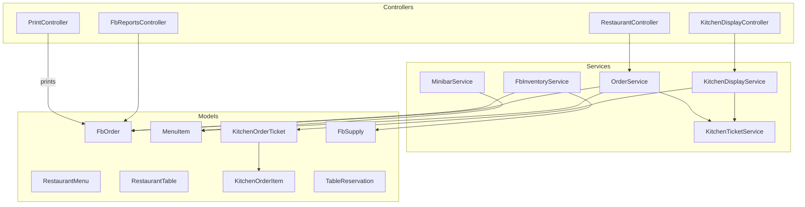

**Diagram sources**
- [RestaurantController.php:12-41](file://app/Http/Controllers/Hotel/RestaurantController.php#L12-L41)
- [KitchenDisplayController.php:10-34](file://app/Http/Controllers/Fnb/KitchenDisplayController.php#L10-L34)
- [FbReportsController.php:13-128](file://app/Http/Controllers/Hotel/FbReportsController.php#L13-L128)
- [OrderService.php:11-184](file://app/Services/OrderService.php#L11-L184)
- [KitchenDisplayService.php:10-52](file://app/Services/KitchenDisplayService.php#L10-L52)
- [KitchenTicketService.php:22-266](file://app/Services/KitchenTicketService.php#L22-L266)
- [FbInventoryService.php:11-250](file://app/Services/FbInventoryService.php#L11-L250)
- [MinibarService.php:10-112](file://app/Services/MinibarService.php#L10-L112)
- [FbOrder.php:13-183](file://app/Models/FbOrder.php#L13-L183)
- [MenuItem.php:13-198](file://app/Models/MenuItem.php#L13-L198)
- [RestaurantMenu.php:13-67](file://app/Models/RestaurantMenu.php#L13-L67)
- [RestaurantTable.php:13-70](file://app/Models/RestaurantTable.php#L13-L70)
- [KitchenOrderTicket.php:14-111](file://app/Models/KitchenOrderTicket.php#L14-L111)
- [KitchenOrderItem.php:10-49](file://app/Models/KitchenOrderItem.php#L10-L49)
- [FbSupply.php:13-154](file://app/Models/FbSupply.php#L13-L154)
- [TableReservation.php:14-91](file://app/Models/TableReservation.php#L14-L91)

**Section sources**
- [RestaurantController.php:12-41](file://app/Http/Controllers/Hotel/RestaurantController.php#L12-L41)
- [KitchenDisplayController.php:10-34](file://app/Http/Controllers/Fnb/KitchenDisplayController.php#L10-L34)
- [FbReportsController.php:13-128](file://app/Http/Controllers/Hotel/FbReportsController.php#L13-L128)
- [OrderService.php:11-184](file://app/Services/OrderService.php#L11-L184)
- [KitchenDisplayService.php:10-52](file://app/Services/KitchenDisplayService.php#L10-L52)
- [KitchenTicketService.php:22-266](file://app/Services/KitchenTicketService.php#L22-L266)
- [FbInventoryService.php:11-250](file://app/Services/FbInventoryService.php#L11-L250)
- [MinibarService.php:10-112](file://app/Services/MinibarService.php#L10-L112)
- [FbOrder.php:13-183](file://app/Models/FbOrder.php#L13-L183)
- [MenuItem.php:13-198](file://app/Models/MenuItem.php#L13-L198)
- [RestaurantMenu.php:13-67](file://app/Models/RestaurantMenu.php#L13-L67)
- [RestaurantTable.php:13-70](file://app/Models/RestaurantTable.php#L13-L70)
- [KitchenOrderTicket.php:14-111](file://app/Models/KitchenOrderTicket.php#L14-L111)
- [KitchenOrderItem.php:10-49](file://app/Models/KitchenOrderItem.php#L10-L49)
- [FbSupply.php:13-154](file://app/Models/FbSupply.php#L13-L154)
- [TableReservation.php:14-91](file://app/Models/TableReservation.php#L14-L91)

## Core Components
- Order Management: Creation, validation, totals calculation, status updates, and payment processing.
- Menu & Recipes: Menu items, categories, pricing, recipe cost calculation, and availability checks.
- Kitchen Display System: Ticket generation, station grouping, priority, and overdue tracking.
- Inventory & Supplies: Stock tracking, usage transactions, low-stock alerts, and valuation.
- Beverage Service (Minibar): Room initialization, consumption recording, restocking, and billing.
- Reporting & Analytics: Revenue by order type, daily trends, top items, category stats, supply usage, and profitability.
- POS Integration: Receipt printing configuration and job-based printing for orders.
- Food Safety & Waste: Ingredient waste logging, trends, and recommendations.

**Section sources**
- [OrderService.php:16-109](file://app/Services/OrderService.php#L16-L109)
- [FbOrder.php:95-181](file://app/Models/FbOrder.php#L95-L181)
- [MenuItem.php:81-161](file://app/Models/MenuItem.php#L81-L161)
- [KitchenDisplayService.php:15-52](file://app/Services/KitchenDisplayService.php#L15-L52)
- [KitchenTicketService.php:32-93](file://app/Services/KitchenTicketService.php#L32-L93)
- [KitchenOrderTicket.php:54-109](file://app/Models/KitchenOrderTicket.php#L54-L109)
- [FbInventoryService.php:23-79](file://app/Services/FbInventoryService.php#L23-L79)
- [FbSupply.php:94-140](file://app/Models/FbSupply.php#L94-L140)
- [MinibarService.php:15-97](file://app/Services/MinibarService.php#L15-L97)
- [FbReportsController.php:23-128](file://app/Http/Controllers/Hotel/FbReportsController.php#L23-L128)
- [PrintController.php:26-47](file://app/Http/Controllers/Pos/PrintController.php#L26-L47)
- [pos_printer.php:1-38](file://config/pos_printer.php#L1-L38)
- [WasteTrackingController.php:24-44](file://app/Http/Controllers/Fnb/WasteTrackingController.php#L24-L44)
- [IngredientWasteTrackingService.php:14-144](file://app/Services/IngredientWasteTrackingService.php#L14-L144)

## Architecture Overview
The F&B system follows a layered architecture:
- Presentation: Controllers handle HTTP requests and render views for reports and KDS.
- Application: Services orchestrate business workflows (orders, tickets, inventory, minibar).
- Domain: Models represent entities and encapsulate domain logic (calculations, validations).
- Persistence: Migrations define normalized schemas for orders, menus, supplies, and waste.

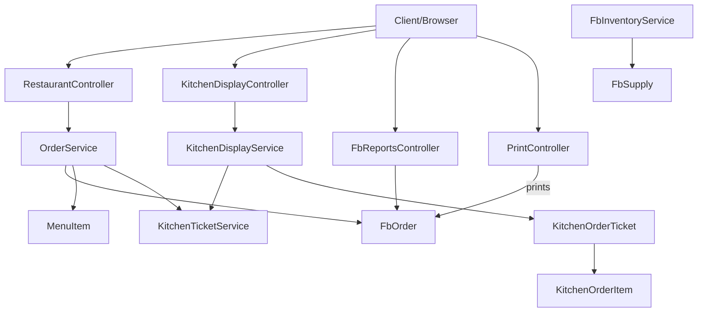

**Diagram sources**
- [RestaurantController.php:12-41](file://app/Http/Controllers/Hotel/RestaurantController.php#L12-L41)
- [KitchenDisplayController.php:10-34](file://app/Http/Controllers/Fnb/KitchenDisplayController.php#L10-L34)
- [FbReportsController.php:13-128](file://app/Http/Controllers/Hotel/FbReportsController.php#L13-L128)
- [PrintController.php:14-47](file://app/Http/Controllers/Pos/PrintController.php#L14-L47)
- [OrderService.php:11-184](file://app/Services/OrderService.php#L11-L184)
- [KitchenDisplayService.php:10-52](file://app/Services/KitchenDisplayService.php#L10-L52)
- [KitchenTicketService.php:22-266](file://app/Services/KitchenTicketService.php#L22-L266)
- [FbInventoryService.php:11-250](file://app/Services/FbInventoryService.php#L11-L250)
- [FbOrder.php:13-183](file://app/Models/FbOrder.php#L13-L183)
- [MenuItem.php:13-198](file://app/Models/MenuItem.php#L13-L198)
- [KitchenOrderTicket.php:14-111](file://app/Models/KitchenOrderTicket.php#L14-L111)
- [KitchenOrderItem.php:10-49](file://app/Models/KitchenOrderItem.php#L10-L49)
- [FbSupply.php:13-154](file://app/Models/FbSupply.php#L13-L154)

## Detailed Component Analysis

### Restaurant Management and Table Service
- Restaurant dashboard aggregates today’s orders, pending orders, and revenue.
- Table availability and reservations are managed via dedicated models and relationships.
- Orders can originate from table reservations and support dine-in/takeaway modes.

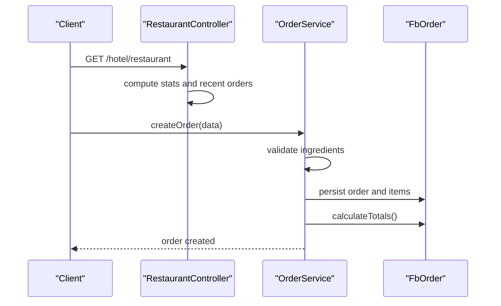

**Diagram sources**
- [RestaurantController.php:21-41](file://app/Http/Controllers/Hotel/RestaurantController.php#L21-L41)
- [OrderService.php:16-60](file://app/Services/OrderService.php#L16-L60)
- [FbOrder.php:95-125](file://app/Models/FbOrder.php#L95-L125)

**Section sources**
- [RestaurantController.php:21-41](file://app/Http/Controllers/Hotel/RestaurantController.php#L21-L41)
- [RestaurantTable.php:49-68](file://app/Models/RestaurantTable.php#L49-L68)
- [TableReservation.php:61-90](file://app/Models/TableReservation.php#L61-L90)

### Menu Operations and Recipe Costing
- Menu items maintain price, cost, preparation time, allergens, and dietary info.
- Recipe cost is calculated from supply ingredients; profit margins are derived from price and cost.
- Availability checks consider daily limits and current stock.

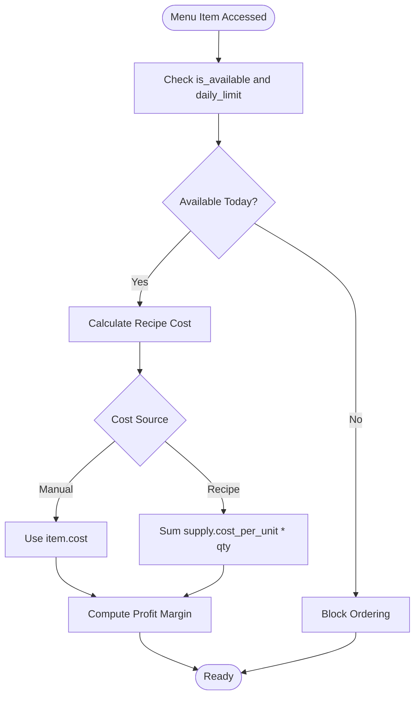

**Diagram sources**
- [MenuItem.php:94-161](file://app/Models/MenuItem.php#L94-L161)
- [MenuItem.php:127-150](file://app/Models/MenuItem.php#L127-L150)

**Section sources**
- [MenuItem.php:81-161](file://app/Models/MenuItem.php#L81-L161)
- [RestaurantMenu.php:49-65](file://app/Models/RestaurantMenu.php#L49-L65)

### Kitchen Display System (KDS)
- Tickets are created per order, grouped by kitchen station, with priority and estimated time.
- Idempotent creation prevents duplicates; validation and cleanup routines maintain integrity.
- Active tickets are filtered by status and station for real-time display.

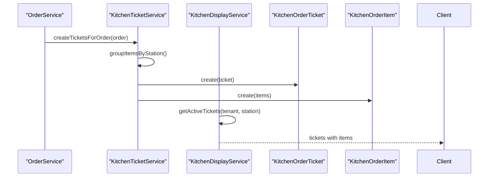

**Diagram sources**
- [OrderService.php:16-60](file://app/Services/OrderService.php#L16-L60)
- [KitchenTicketService.php:32-93](file://app/Services/KitchenTicketService.php#L32-L93)
- [KitchenDisplayService.php:25-38](file://app/Services/KitchenDisplayService.php#L25-L38)
- [KitchenOrderTicket.php:54-84](file://app/Models/KitchenOrderTicket.php#L54-L84)
- [KitchenOrderItem.php:39-47](file://app/Models/KitchenOrderItem.php#L39-L47)

**Section sources**
- [KitchenDisplayService.php:15-52](file://app/Services/KitchenDisplayService.php#L15-L52)
- [KitchenTicketService.php:32-93](file://app/Services/KitchenTicketService.php#L32-L93)
- [KitchenOrderTicket.php:54-109](file://app/Models/KitchenOrderTicket.php#L54-L109)
- [KitchenOrderItem.php:39-47](file://app/Models/KitchenOrderItem.php#L39-L47)

### F&B Inventory Management and Supply Chain
- Automatic stock deduction occurs upon order completion using recipe ingredients.
- Low-stock triggers purchase order generation grouped by supplier.
- Inventory valuation supports category-wise aggregation and low-stock value computation.
- Supply transactions record purchases and usages.

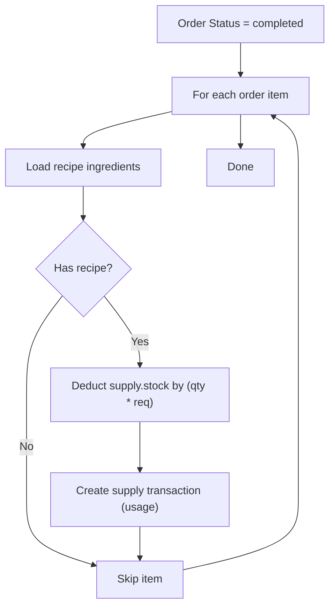

**Diagram sources**
- [FbOrder.php:167-181](file://app/Models/FbOrder.php#L167-L181)
- [FbInventoryService.php:23-79](file://app/Services/FbInventoryService.php#L23-L79)
- [FbSupply.php:120-140](file://app/Models/FbSupply.php#L120-L140)

**Section sources**
- [FbInventoryService.php:23-139](file://app/Services/FbInventoryService.php#L23-L139)
- [FbSupply.php:94-140](file://app/Models/FbSupply.php#L94-L140)
- [2026_04_04_700000_create_fb_supplier_management_tables.php:42-53](file://database/migrations/2026_04_04_700000_create_fb_supplier_management_tables.php#L42-L53)

### Beverage Service and Minibar Operations
- Minibar inventory is initialized per room with default menu items.
- Consumption is recorded with transaction logging; restocking updates inventory and activity logs.
- Charges can be aggregated per reservation for billing.

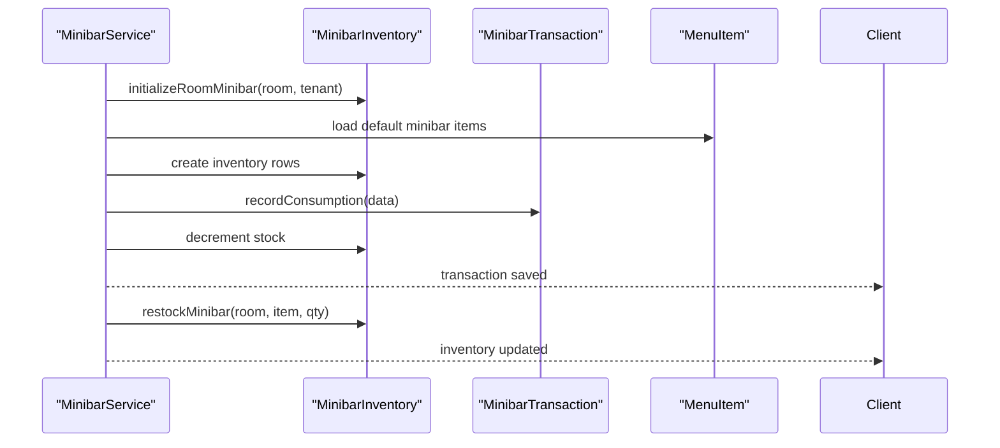

**Diagram sources**
- [MinibarService.php:15-97](file://app/Services/MinibarService.php#L15-L97)
- [MenuItem.php:71-74](file://app/Models/MenuItem.php#L71-L74)

**Section sources**
- [MinibarService.php:15-112](file://app/Services/MinibarService.php#L15-L112)
- [MenuItem.php:71-74](file://app/Models/MenuItem.php#L71-L74)

### Reporting Systems, Revenue Tracking, and Profitability
- Reports dashboard filters by date range and computes revenue by order type, daily trends, top items, category stats, and supply usage.
- Profitability metrics include gross profit and profit margin computed from total revenue minus supply costs.

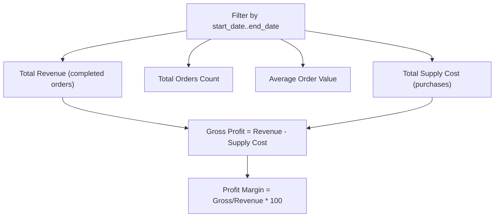

**Diagram sources**
- [FbReportsController.php:23-128](file://app/Http/Controllers/Hotel/FbReportsController.php#L23-L128)

**Section sources**
- [FbReportsController.php:23-128](file://app/Http/Controllers/Hotel/FbReportsController.php#L23-L128)
- [index.blade.php:1-24](file://resources/views/hotel/fb/reports/index.blade.php#L1-L24)

### POS Integration and Receipt Printing
- Receipt printing is configurable via POS printer settings and supports queued jobs.
- Frontend JavaScript handles thermal printer communication and ESC/POS formatting.

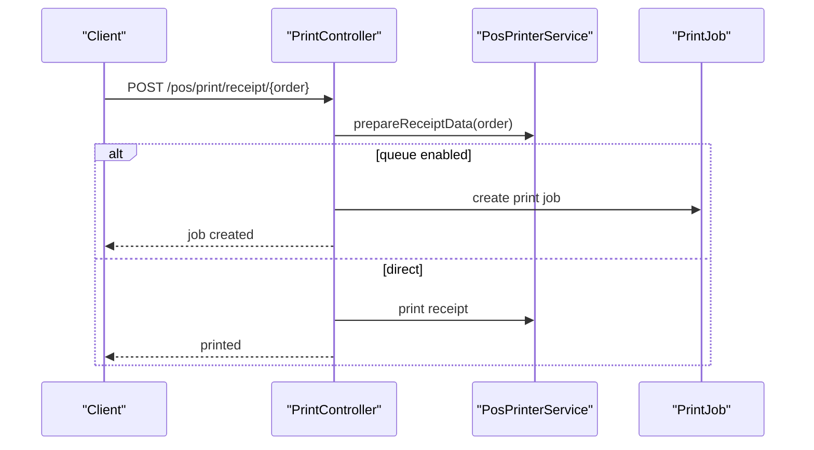

**Diagram sources**
- [PrintController.php:26-47](file://app/Http/Controllers/Pos/PrintController.php#L26-L47)
- [pos_printer.php:1-38](file://config/pos_printer.php#L1-L38)
- [pos-printer.js:412-435](file://resources/js/pos-printer.js#L412-L435)

**Section sources**
- [PrintController.php:26-47](file://app/Http/Controllers/Pos/PrintController.php#L26-L47)
- [pos_printer.php:1-38](file://config/pos_printer.php#L1-L38)
- [pos-printer.js:412-435](file://resources/js/pos-printer.js#L412-L435)

### Food Safety Protocols, Supply Tracking, and Waste Management
- Ingredient waste is tracked with item name, quantity, unit, total cost, type, reason, department, and preventive actions.
- Trends and recommendations help reduce waste and improve controls.
- Future batch/expiry tracking is planned via additional tables.

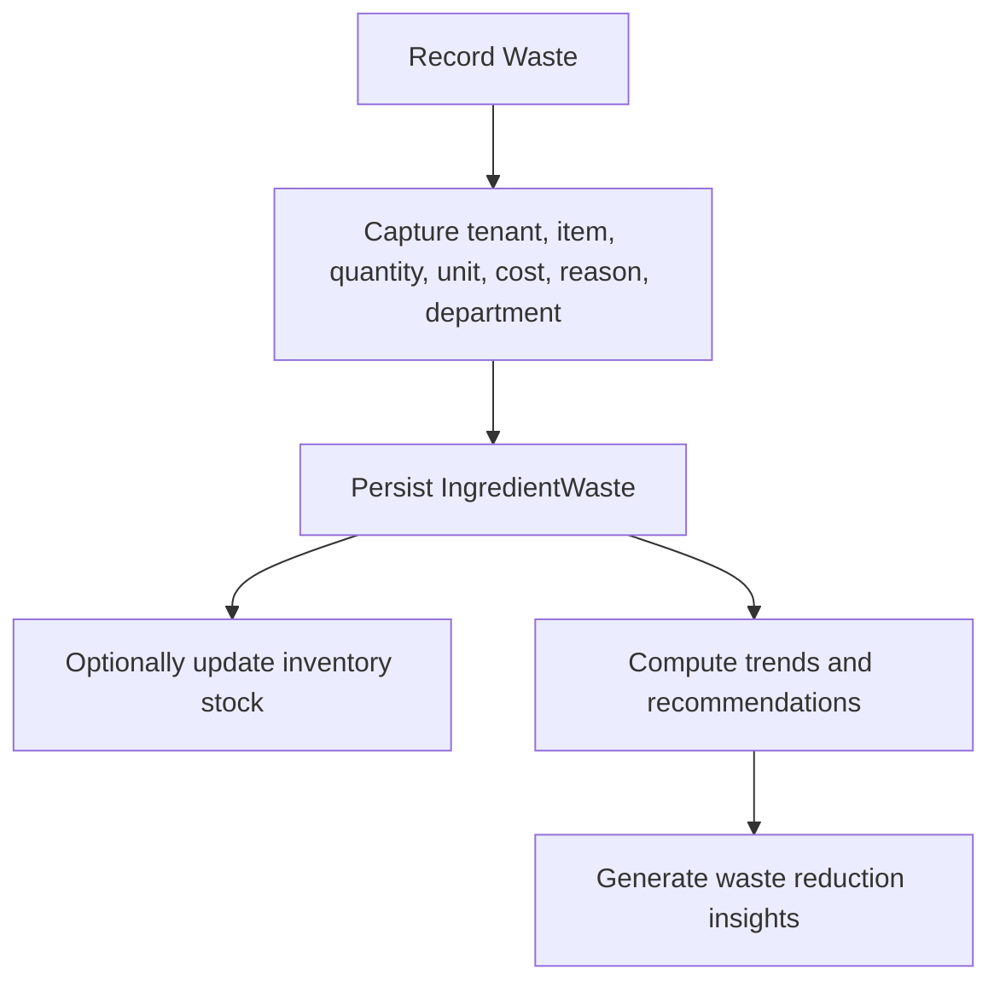

**Diagram sources**
- [IngredientWasteTrackingService.php:14-144](file://app/Services/IngredientWasteTrackingService.php#L14-L144)
- [2026_04_06_041804_create_ingredient_wastes_table.php:29-43](file://database/migrations/2026_04_06_041804_create_ingredient_wastes_table.php#L29-L43)
- [WasteTrackingController.php:24-44](file://app/Http/Controllers/Fnb/WasteTrackingController.php#L24-L44)

**Section sources**
- [IngredientWasteTrackingService.php:14-144](file://app/Services/IngredientWasteTrackingService.php#L14-L144)
- [2026_04_06_041804_create_ingredient_wastes_table.php:29-43](file://database/migrations/2026_04_06_041804_create_ingredient_wastes_table.php#L29-L43)
- [WasteTrackingController.php:24-44](file://app/Http/Controllers/Fnb/WasteTrackingController.php#L24-L44)

## Dependency Analysis
Key dependencies and relationships:
- OrderService depends on FbOrder, MenuItem, and KitchenTicketService.
- KitchenDisplayService delegates ticket creation to KitchenTicketService.
- FbInventoryService coordinates stock deductions and supply transactions.
- MinibarService integrates with MenuItem and transaction models.
- FbReportsController aggregates data from orders and supplies.
- POS printing depends on printer configuration and job queues.

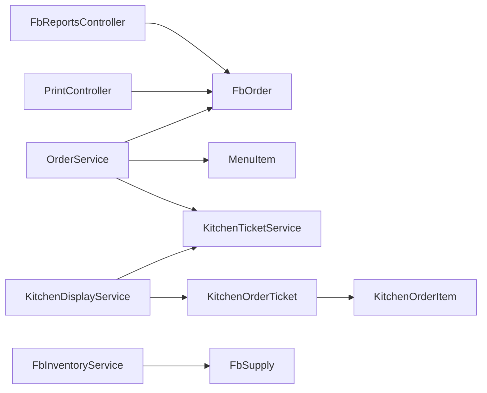

**Diagram sources**
- [OrderService.php:11-184](file://app/Services/OrderService.php#L11-L184)
- [KitchenDisplayService.php:10-52](file://app/Services/KitchenDisplayService.php#L10-L52)
- [KitchenTicketService.php:22-266](file://app/Services/KitchenTicketService.php#L22-L266)
- [KitchenOrderTicket.php:14-111](file://app/Models/KitchenOrderTicket.php#L14-L111)
- [KitchenOrderItem.php:10-49](file://app/Models/KitchenOrderItem.php#L10-L49)
- [FbInventoryService.php:11-250](file://app/Services/FbInventoryService.php#L11-L250)
- [FbSupply.php:13-154](file://app/Models/FbSupply.php#L13-L154)
- [FbReportsController.php:13-128](file://app/Http/Controllers/Hotel/FbReportsController.php#L13-L128)
- [PrintController.php:14-47](file://app/Http/Controllers/Pos/PrintController.php#L14-L47)

**Section sources**
- [OrderService.php:11-184](file://app/Services/OrderService.php#L11-L184)
- [KitchenDisplayService.php:10-52](file://app/Services/KitchenDisplayService.php#L10-L52)
- [KitchenTicketService.php:22-266](file://app/Services/KitchenTicketService.php#L22-L266)
- [FbInventoryService.php:11-250](file://app/Services/FbInventoryService.php#L11-L250)
- [FbReportsController.php:13-128](file://app/Http/Controllers/Hotel/FbReportsController.php#L13-L128)
- [PrintController.php:14-47](file://app/Http/Controllers/Pos/PrintController.php#L14-L47)

## Performance Considerations
- Use database indexing on tenant_id and frequently filtered columns (e.g., order_date, status).
- Batch operations for daily counters reset and low-stock PO generation reduce repeated queries.
- Limit KDS queries by station and status to avoid heavy joins.
- Cache report aggregations for common date ranges to minimize DB load.
- Asynchronous printing via jobs prevents UI blocking.

## Troubleshooting Guide
- Duplicate KDS tickets: Use the idempotent creation and cleanup routines to detect and remove duplicates.
- Insufficient stock on order completion: The inventory service throws exceptions when stock is below required usage; review recipe quantities and replenish supplies.
- Minibar discrepancies: Verify inventory rows exist per room and that consumption/restock operations update stock consistently.
- Waste tracking gaps: Ensure the ingredient wastes table exists and that records include required fields (tenant_id, item_name, quantity_wasted, unit, total_waste_cost, waste_type).

**Section sources**
- [KitchenTicketService.php:158-205](file://app/Services/KitchenTicketService.php#L158-L205)
- [FbInventoryService.php:62-64](file://app/Services/FbInventoryService.php#L62-L64)
- [MinibarService.php:40-76](file://app/Services/MinibarService.php#L40-L76)
- [2026_04_06_041804_create_ingredient_wastes_table.php:29-43](file://database/migrations/2026_04_06_041804_create_ingredient_wastes_table.php#L29-L43)

## Conclusion
The F&B Operations module provides a robust foundation for restaurant and hotel F&B management. It integrates order processing, KDS workflows, inventory control, beverage service, reporting, and POS printing. With built-in stock validation, idempotent ticketing, and waste tracking capabilities, it supports cost control and operational efficiency while laying groundwork for advanced features like batch/expiry tracking.

## Appendices
- POS Printer Configuration: Adjust printer type, destination, paper width, and auto-connect settings.
- Report Filters: Use date range filters to analyze revenue, orders, and supply usage effectively.

**Section sources**
- [pos_printer.php:1-38](file://config/pos_printer.php#L1-L38)
- [index.blade.php:13-24](file://resources/views/hotel/fb/reports/index.blade.php#L13-L24)