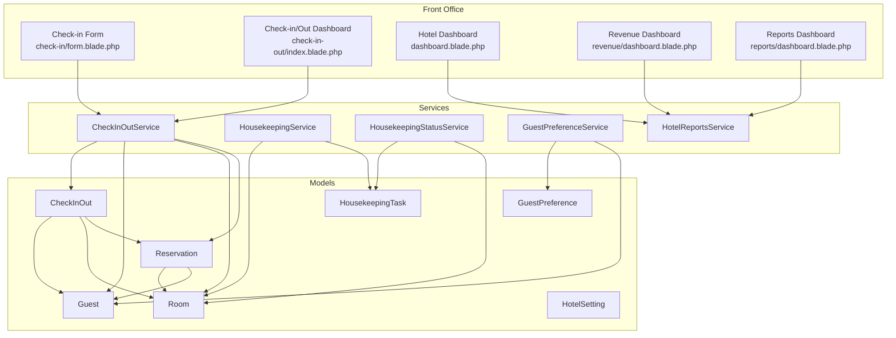
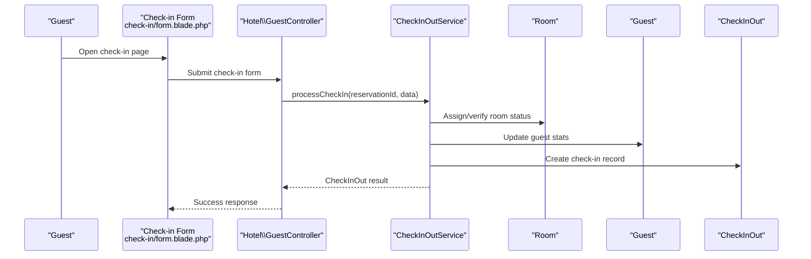
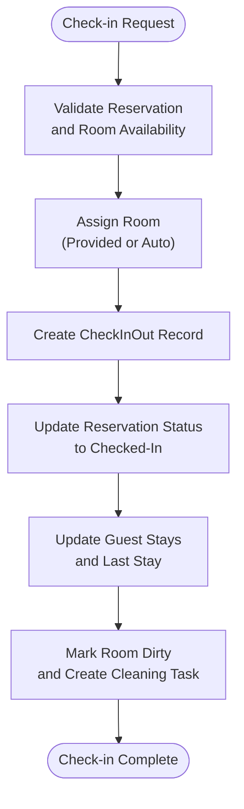
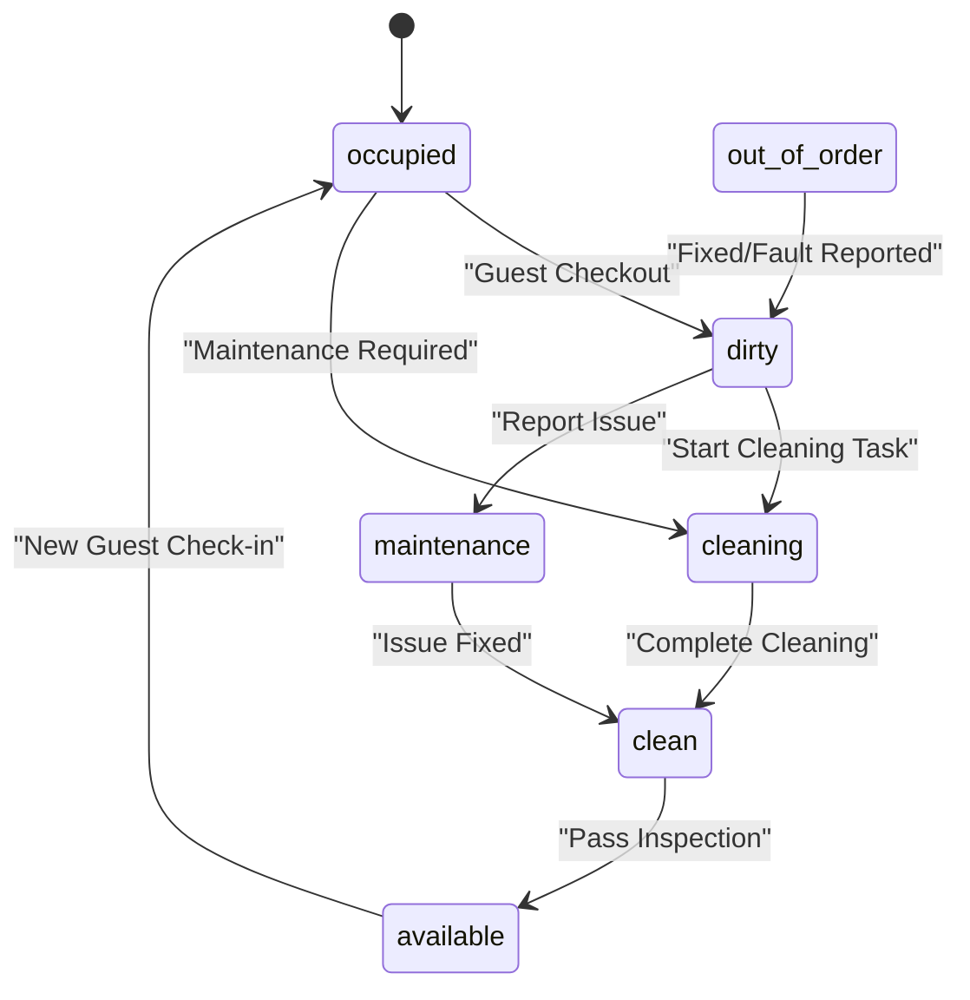
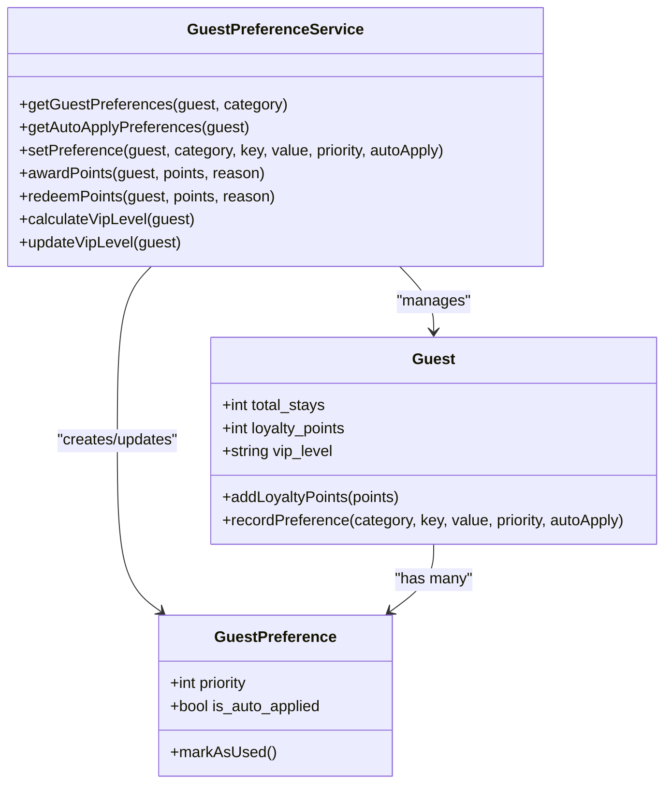
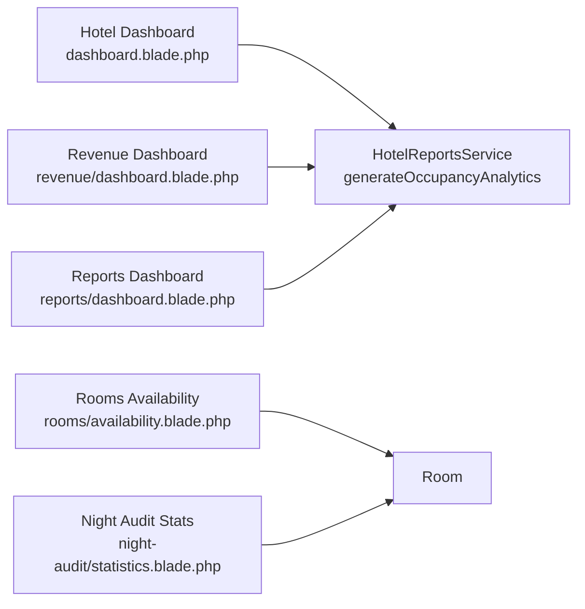
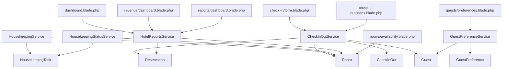

# Guest Services & Front Office

<cite>
**Referenced Files in This Document**
- [CheckInOutService.php](file://app/Services/CheckInOutService.php)
- [HousekeepingService.php](file://app/Services/HousekeepingService.php)
- [HousekeepingStatusService.php](file://app/Services/HousekeepingStatusService.php)
- [GuestPreferenceService.php](file://app/Services/GuestPreferenceService.php)
- [HotelReportsService.php](file://app/Services/HotelReportsService.php)
- [Guest.php](file://app/Models/Guest.php)
- [GuestPreference.php](file://app/Models/GuestPreference.php)
- [HousekeepingTask.php](file://app/Models/HousekeepingTask.php)
- [HotelSetting.php](file://app/Models/HotelSetting.php)
- [Room.php](file://app/Models/Room.php)
- [Reservation.php](file://app/Models/Reservation.php)
- [CheckInOut.php](file://app/Models/CheckInOut.php)
- [GuestController.php](file://app/Http/Controllers/Hotel/GuestController.php)
- [RevenueManagementController.php](file://app/Http/Controllers/Hotel/RevenueManagementController.php)
- [dashboard.blade.php](file://resources/views/hotel/dashboard.blade.php)
- [revenue/dashboard.blade.php](file://resources/views/hotel/revenue/dashboard.blade.php)
- [reports/dashboard.blade.php](file://resources/views/hotel/reports/dashboard.blade.php)
- [rooms/availability.blade.php](file://resources/views/hotel/rooms/availability.blade.php)
- [check-in/form.blade.php](file://resources/views/hotel/check-in/form.blade.php)
- [check-in-out/index.blade.php](file://resources/views/hotel/check-in-out/index.blade.php)
- [night-audit/statistics.blade.php](file://resources/views/hotel/night-audit/statistics.blade.php)
- [guests/preferences.blade.php](file://resources/views/hotel/guests/preferences.blade.php)
- [LoyaltyProgram.php](file://app/Models/LoyaltyProgram.php)
- [LoyaltyTier.php](file://app/Models/LoyaltyTier.php)
- [LoyaltyPoint.php](file://app/Models/LoyaltyPoint.php)
- [PatientSatisfaction.php](file://app/Models/PatientSatisfaction.php)
</cite>

## Table of Contents
1. [Introduction](#introduction)
2. [Project Structure](#project-structure)
3. [Core Components](#core-components)
4. [Architecture Overview](#architecture-overview)
5. [Detailed Component Analysis](#detailed-component-analysis)
6. [Dependency Analysis](#dependency-analysis)
7. [Performance Considerations](#performance-considerations)
8. [Troubleshooting Guide](#troubleshooting-guide)
9. [Conclusion](#conclusion)
10. [Appendices](#appendices)

## Introduction
This document provides comprehensive documentation for Guest Services and Front Office operations within the hotel module. It covers guest registration and check-in/check-out workflows, guest preference management, VIP handling, front office dashboards, real-time occupancy tracking, guest communication systems, guest history management, loyalty program integration, personalized service delivery, feedback collection and satisfaction measurement, and integrations with housekeeping, concierge, and bell desk operations.

## Project Structure
The hotel-related functionality spans services, models, controllers, and Blade views. Key areas include:
- Check-in/out orchestration via CheckInOutService
- Room status lifecycle managed by HousekeepingStatusService and HousekeepingService
- Guest preferences and VIP handling via GuestPreferenceService and Guest model
- Reporting and dashboards via HotelReportsService and several Blade templates
- Room availability and occupancy analytics via Room model and reports
- Reservation lifecycle via Reservation model and CheckInOut records

**Diagram sources**
- [check-in/form.blade.php:1-169](file://resources/views/hotel/check-in/form.blade.php#L1-L169)
- [check-in-out/index.blade.php:110-262](file://resources/views/hotel/check-in-out/index.blade.php#L110-L262)
- [dashboard.blade.php:1-21](file://resources/views/hotel/dashboard.blade.php#L1-L21)
- [revenue/dashboard.blade.php:71-88](file://resources/views/hotel/revenue/dashboard.blade.php#L71-L88)
- [reports/dashboard.blade.php:1-68](file://resources/views/hotel/reports/dashboard.blade.php#L1-L68)
- [CheckInOutService.php:1-43](file://app/Services/CheckInOutService.php#L1-L43)
- [HousekeepingService.php:1-276](file://app/Services/HousekeepingService.php#L1-L276)
- [HousekeepingStatusService.php:1-352](file://app/Services/HousekeepingStatusService.php#L1-L352)
- [GuestPreferenceService.php:1-211](file://app/Services/GuestPreferenceService.php#L1-L211)
- [HotelReportsService.php:283-358](file://app/Services/HotelReportsService.php#L283-L358)
- [Guest.php:1-128](file://app/Models/Guest.php#L1-L128)
- [GuestPreference.php:1-71](file://app/Models/GuestPreference.php#L1-L71)
- [Room.php:1-198](file://app/Models/Room.php#L1-L198)
- [Reservation.php:1-160](file://app/Models/Reservation.php#L1-L160)
- [CheckInOut.php:1-64](file://app/Models/CheckInOut.php#L1-L64)
- [HousekeepingTask.php:1-136](file://app/Models/HousekeepingTask.php#L1-L136)
- [HotelSetting.php:1-43](file://app/Models/HotelSetting.php#L1-L43)

**Section sources**
- [CheckInOutService.php:1-43](file://app/Services/CheckInOutService.php#L1-L43)
- [HousekeepingService.php:1-276](file://app/Services/HousekeepingService.php#L1-L276)
- [HousekeepingStatusService.php:1-352](file://app/Services/HousekeepingStatusService.php#L1-L352)
- [GuestPreferenceService.php:1-211](file://app/Services/GuestPreferenceService.php#L1-L211)
- [HotelReportsService.php:283-358](file://app/Services/HotelReportsService.php#L283-L358)
- [Guest.php:1-128](file://app/Models/Guest.php#L1-L128)
- [GuestPreference.php:1-71](file://app/Models/GuestPreference.php#L1-L71)
- [Room.php:1-198](file://app/Models/Room.php#L1-L198)
- [Reservation.php:1-160](file://app/Models/Reservation.php#L1-L160)
- [CheckInOut.php:1-64](file://app/Models/CheckInOut.php#L1-L64)
- [HousekeepingTask.php:1-136](file://app/Models/HousekeepingTask.php#L1-L136)
- [HotelSetting.php:1-43](file://app/Models/HotelSetting.php#L1-L43)
- [dashboard.blade.php:1-21](file://resources/views/hotel/dashboard.blade.php#L1-L21)
- [revenue/dashboard.blade.php:71-88](file://resources/views/hotel/revenue/dashboard.blade.php#L71-L88)
- [reports/dashboard.blade.php:1-68](file://resources/views/hotel/reports/dashboard.blade.php#L1-L68)
- [rooms/availability.blade.php:87-106](file://resources/views/hotel/rooms/availability.blade.php#L87-L106)
- [check-in/form.blade.php:1-169](file://resources/views/hotel/check-in/form.blade.php#L1-L169)
- [check-in-out/index.blade.php:110-262](file://resources/views/hotel/check-in-out/index.blade.php#L110-L262)
- [night-audit/statistics.blade.php:86-105](file://resources/views/hotel/night-audit/statistics.blade.php#L86-L105)
- [guests/preferences.blade.php:47-239](file://resources/views/hotel/guests/preferences.blade.php#L47-L239)

## Core Components
- Check-in/Check-out orchestration: Processes guest arrival, room assignment, charges, and status updates.
- Housekeeping lifecycle: Manages room status transitions, task creation, and inspection.
- Guest preferences and VIP handling: Stores and applies guest preferences, awards/redeems loyalty points, and calculates VIP tier.
- Reports and dashboards: Provides occupancy analytics, revenue metrics, and operational KPIs.
- Room availability and occupancy: Tracks room counts, occupancy rates, and trends.
- Guest communication: Respects guest communication preferences and logs interactions.

**Section sources**
- [CheckInOutService.php:41-120](file://app/Services/CheckInOutService.php#L41-L120)
- [HousekeepingStatusService.php:33-172](file://app/Services/HousekeepingStatusService.php#L33-L172)
- [GuestPreferenceService.php:138-211](file://app/Services/GuestPreferenceService.php#L138-L211)
- [HotelReportsService.php:283-358](file://app/Services/HotelReportsService.php#L283-L358)
- [Room.php:168-176](file://app/Models/Room.php#L168-L176)
- [Guest.php:98-111](file://app/Models/Guest.php#L98-L111)

## Architecture Overview
The system integrates front office operations with housekeeping and reporting. The flow begins at the check-in form, proceeds through room assignment and status updates, and culminates in housekeeping tasks and inspections. Dashboards consume analytics from HotelReportsService to present occupancy and revenue metrics.

**Diagram sources**
- [check-in/form.blade.php:73-167](file://resources/views/hotel/check-in/form.blade.php#L73-L167)
- [GuestController.php:292-300](file://app/Http/Controllers/Hotel/GuestController.php#L292-L300)
- [CheckInOutService.php:41-120](file://app/Services/CheckInOutService.php#L41-L120)
- [Room.php:1-198](file://app/Models/Room.php#L1-L198)
- [Guest.php:1-128](file://app/Models/Guest.php#L1-L128)
- [CheckInOut.php:1-64](file://app/Models/CheckInOut.php#L1-L64)

## Detailed Component Analysis

### Check-in/Check-out Workflow
- Validates reservation status and room availability.
- Assigns room (explicit or automatic) and creates a CheckInOut record with type=check_in.
- Updates reservation status to checked_in and room status to occupied/dirty.
- Increments guest total_stays and last_stay_at.
- Integrates with housekeeping to mark rooms as dirty post-checkout and trigger cleaning tasks.

**Diagram sources**
- [CheckInOutService.php:41-120](file://app/Services/CheckInOutService.php#L41-L120)
- [HousekeepingStatusService.php:33-76](file://app/Services/HousekeepingStatusService.php#L33-L76)
- [HousekeepingService.php:60-87](file://app/Services/HousekeepingService.php#L60-L87)
- [Guest.php:108-111](file://app/Models/Guest.php#L108-L111)
- [Reservation.php:145-148](file://app/Models/Reservation.php#L145-L148)
- [Room.php:117-121](file://app/Models/Room.php#L117-L121)

**Section sources**
- [CheckInOutService.php:41-120](file://app/Services/CheckInOutService.php#L41-L120)
- [HousekeepingStatusService.php:33-76](file://app/Services/HousekeepingStatusService.php#L33-L76)
- [HousekeepingService.php:60-87](file://app/Services/HousekeepingService.php#L60-L87)
- [Guest.php:108-111](file://app/Models/Guest.php#L108-L111)
- [Reservation.php:145-148](file://app/Models/Reservation.php#L145-L148)
- [Room.php:117-121](file://app/Models/Room.php#L117-L121)

### Housekeeping Lifecycle and Room Status
- Room statuses: occupied, dirty, cleaning, clean, available, maintenance, out_of_order.
- Status transitions enforced by HousekeepingStatusService to prevent invalid states.
- Tasks: checkout_clean, stay_clean, deep_clean, inspection, turndown.
- Maintenance requests can escalate rooms to out_of_order and require resolution.

**Diagram sources**
- [HousekeepingStatusService.php:14-21](file://app/Services/HousekeepingStatusService.php#L14-L21)
- [HousekeepingStatusService.php:306-328](file://app/Services/HousekeepingStatusService.php#L306-L328)
- [Room.php:90-112](file://app/Models/Room.php#L90-L112)
- [HousekeepingTask.php:105-126](file://app/Models/HousekeepingTask.php#L105-L126)

**Section sources**
- [HousekeepingStatusService.php:33-172](file://app/Services/HousekeepingStatusService.php#L33-L172)
- [HousekeepingService.php:16-55](file://app/Services/HousekeepingService.php#L16-L55)
- [Room.php:90-112](file://app/Models/Room.php#L90-L112)
- [HousekeepingTask.php:105-126](file://app/Models/HousekeepingTask.php#L105-L126)

### Guest Preferences and VIP Handling
- Preferences stored per guest with category, key, value, priority, and auto-apply flag.
- Auto-applied preferences are merged into reservation special requests.
- Loyalty points awarded/redeemed with activity logging.
- VIP level calculated from total stays and points, with updates logged.

**Diagram sources**
- [Guest.php:108-126](file://app/Models/Guest.php#L108-L126)
- [GuestPreference.php:66-69](file://app/Models/GuestPreference.php#L66-L69)
- [GuestPreferenceService.php:18-53](file://app/Services/GuestPreferenceService.php#L18-L53)
- [GuestPreferenceService.php:138-211](file://app/Services/GuestPreferenceService.php#L138-L211)

**Section sources**
- [GuestPreferenceService.php:18-53](file://app/Services/GuestPreferenceService.php#L18-L53)
- [GuestPreferenceService.php:138-211](file://app/Services/GuestPreferenceService.php#L138-L211)
- [Guest.php:108-126](file://app/Models/Guest.php#L108-L126)
- [GuestPreference.php:66-69](file://app/Models/GuestPreference.php#L66-L69)

### Front Office Dashboards and Real-time Occupancy
- Hotel dashboard displays occupancy rate with a circular indicator.
- Revenue dashboard shows demand indicators and forecasts.
- Reports dashboard links to daily operations, revenue, occupancy analytics, and guest analytics.
- Room availability view shows total rooms, available, occupied, and occupancy percentage.
- Night audit statistics present occupancy metrics by date.

**Diagram sources**
- [dashboard.blade.php:1-21](file://resources/views/hotel/dashboard.blade.php#L1-L21)
- [revenue/dashboard.blade.php:71-88](file://resources/views/hotel/revenue/dashboard.blade.php#L71-L88)
- [reports/dashboard.blade.php:1-68](file://resources/views/hotel/reports/dashboard.blade.php#L1-L68)
- [rooms/availability.blade.php:87-106](file://resources/views/hotel/rooms/availability.blade.php#L87-L106)
- [night-audit/statistics.blade.php:86-105](file://resources/views/hotel/night-audit/statistics.blade.php#L86-L105)
- [HotelReportsService.php:283-358](file://app/Services/HotelReportsService.php#L283-L358)
- [Room.php:1-198](file://app/Models/Room.php#L1-L198)

**Section sources**
- [dashboard.blade.php:1-21](file://resources/views/hotel/dashboard.blade.php#L1-L21)
- [revenue/dashboard.blade.php:71-88](file://resources/views/hotel/revenue/dashboard.blade.php#L71-L88)
- [reports/dashboard.blade.php:1-68](file://resources/views/hotel/reports/dashboard.blade.php#L1-L68)
- [rooms/availability.blade.php:87-106](file://resources/views/hotel/rooms/availability.blade.php#L87-L106)
- [night-audit/statistics.blade.php:86-105](file://resources/views/hotel/night-audit/statistics.blade.php#L86-L105)
- [HotelReportsService.php:283-358](file://app/Services/HotelReportsService.php#L283-L358)

### Guest Communication Systems
- Guest model exposes preferred communication method (defaults to email).
- GuestPreferenceService provides a method to send communications respecting guest preferences and logs activities.

**Section sources**
- [Guest.php:98-103](file://app/Models/Guest.php#L98-L103)
- [GuestPreferenceService.php:250-274](file://app/Services/GuestPreferenceService.php#L250-L274)

### Guest History Management and Personalized Service
- Guest history tracked via reservations and check-in/out records.
- Preferences applied automatically to reservations and recorded for audit.
- VIP level influences service delivery and promotions.

**Section sources**
- [Reservation.php:98-101](file://app/Models/Reservation.php#L98-L101)
- [CheckInOut.php:39-62](file://app/Models/CheckInOut.php#L39-L62)
- [GuestPreferenceService.php:125-135](file://app/Services/GuestPreferenceService.php#L125-L135)
- [Guest.php:92-95](file://app/Models/Guest.php#L92-L95)

### Loyalty Program Integration and Personalized Service
- Loyalty program defines points per currency unit and IDR conversion.
- Tier configuration supports multipliers and thresholds.
- Points accumulation and tier calculation support personalized offers.

**Section sources**
- [LoyaltyProgram.php:22-25](file://app/Models/LoyaltyProgram.php#L22-L25)
- [LoyaltyTier.php:1-14](file://app/Models/LoyaltyTier.php#L1-L14)
- [LoyaltyPoint.php:1-23](file://app/Models/LoyaltyPoint.php#L1-L23)

### Guest Feedback Collection and Satisfaction Measurement
- Patient satisfaction model captures ratings and comments; analogous structures exist for guest satisfaction.
- Feedback categories, NPS, and resolution tracking enable service improvement workflows.

**Section sources**
- [PatientSatisfaction.php:1-54](file://app/Models/PatientSatisfaction.php#L1-L54)

### Integration with Housekeeping, Concierge, and Bell Desk
- Housekeeping integration: Tasks created and status transitions enforced; inspection required before rooms become available.
- Concierge and Bell Desk: Not modeled in the provided files; however, the system’s modular design allows extending services/controllers for these functions.

**Section sources**
- [HousekeepingService.php:60-87](file://app/Services/HousekeepingService.php#L60-L87)
- [HousekeepingStatusService.php:174-221](file://app/Services/HousekeepingStatusService.php#L174-L221)

## Dependency Analysis
The following diagram highlights key dependencies among services and models involved in guest services and front office operations.

**Diagram sources**
- [CheckInOutService.php:1-43](file://app/Services/CheckInOutService.php#L1-L43)
- [HousekeepingService.php:1-276](file://app/Services/HousekeepingService.php#L1-L276)
- [HousekeepingStatusService.php:1-352](file://app/Services/HousekeepingStatusService.php#L1-L352)
- [GuestPreferenceService.php:1-211](file://app/Services/GuestPreferenceService.php#L1-L211)
- [HotelReportsService.php:283-358](file://app/Services/HotelReportsService.php#L283-L358)
- [check-in/form.blade.php:1-169](file://resources/views/hotel/check-in/form.blade.php#L1-L169)
- [check-in-out/index.blade.php:110-262](file://resources/views/hotel/check-in-out/index.blade.php#L110-L262)
- [dashboard.blade.php:1-21](file://resources/views/hotel/dashboard.blade.php#L1-L21)
- [revenue/dashboard.blade.php:71-88](file://resources/views/hotel/revenue/dashboard.blade.php#L71-L88)
- [reports/dashboard.blade.php:1-68](file://resources/views/hotel/reports/dashboard.blade.php#L1-L68)
- [rooms/availability.blade.php:87-106](file://resources/views/hotel/rooms/availability.blade.php#L87-L106)
- [guests/preferences.blade.php:47-239](file://resources/views/hotel/guests/preferences.blade.php#L47-L239)

**Section sources**
- [CheckInOutService.php:1-43](file://app/Services/CheckInOutService.php#L1-L43)
- [HousekeepingService.php:1-276](file://app/Services/HousekeepingService.php#L1-L276)
- [HousekeepingStatusService.php:1-352](file://app/Services/HousekeepingStatusService.php#L1-L352)
- [GuestPreferenceService.php:1-211](file://app/Services/GuestPreferenceService.php#L1-L211)
- [HotelReportsService.php:283-358](file://app/Services/HotelReportsService.php#L283-L358)

## Performance Considerations
- Use scopes and eager loading to minimize N+1 queries in dashboards and reports.
- Cache frequently accessed hotel settings and occupancy analytics.
- Batch housekeeping task updates and room status transitions to reduce write contention.
- Index reservation and room status fields for fast filtering and reporting.

## Troubleshooting Guide
- Check-in fails due to unavailable room: Verify Room availability and HousekeepingTask status.
- Room stuck as “available” without cleaning: Confirm HousekeepingStatusService transition to “clean” and “available” after inspection.
- Guest preference not applied: Ensure preference priority and auto-apply flags are set; confirm merge into reservation special requests.
- VIP level not updating: Recalculate VIP level and confirm activity log entry.
- Dashboard occupancy anomalies: Cross-check HotelReportsService occupancy calculations and Room counts.

**Section sources**
- [HousekeepingStatusService.php:174-221](file://app/Services/HousekeepingStatusService.php#L174-L221)
- [GuestPreferenceService.php:125-135](file://app/Services/GuestPreferenceService.php#L125-L135)
- [GuestPreferenceService.php:181-211](file://app/Services/GuestPreferenceService.php#L181-L211)
- [HotelReportsService.php:283-358](file://app/Services/HotelReportsService.php#L283-L358)

## Conclusion
The hotel module provides a robust foundation for Guest Services and Front Office operations, integrating check-in workflows, housekeeping lifecycle management, guest preferences, VIP handling, and comprehensive reporting. Extending the system to include concierge and bell desk services follows the established patterns of services, models, and Blade views.

## Appendices
- Early check-in handling and overdue tasks are surfaced in the check-in/out dashboard for timely intervention.
- Communication preference respects guest channel selection and logs interactions for auditability.

**Section sources**
- [check-in-out/index.blade.php:244-262](file://resources/views/hotel/check-in-out/index.blade.php#L244-L262)
- [Guest.php:98-103](file://app/Models/Guest.php#L98-L103)
- [GuestPreferenceService.php:250-274](file://app/Services/GuestPreferenceService.php#L250-L274)