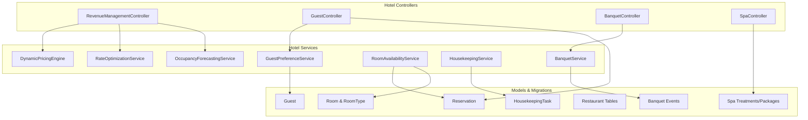
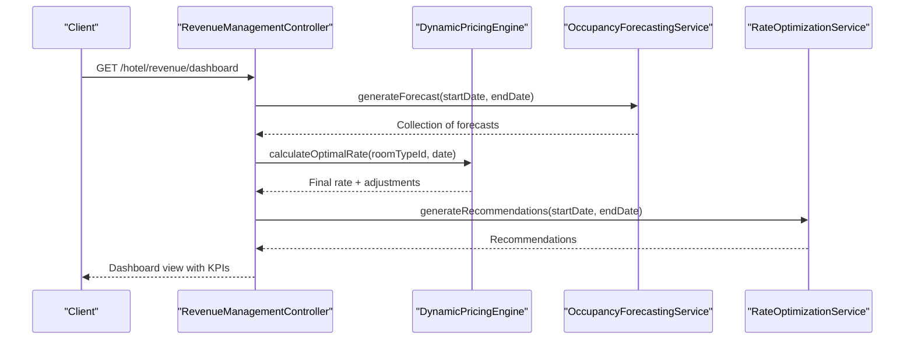
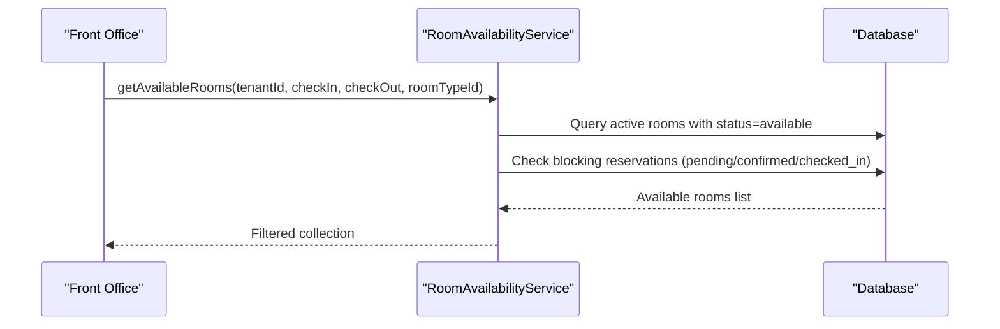
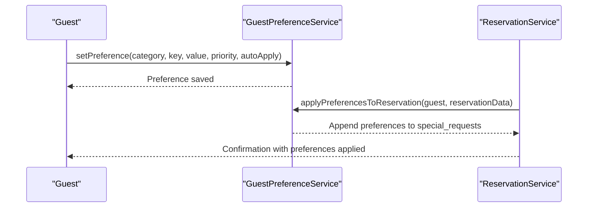
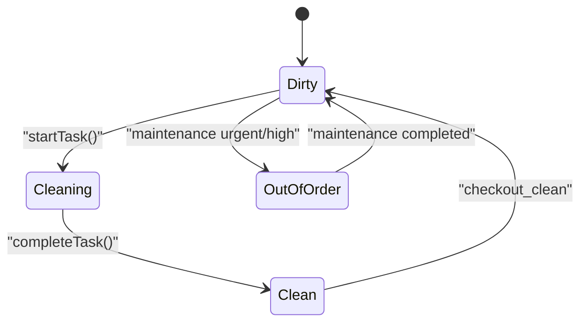
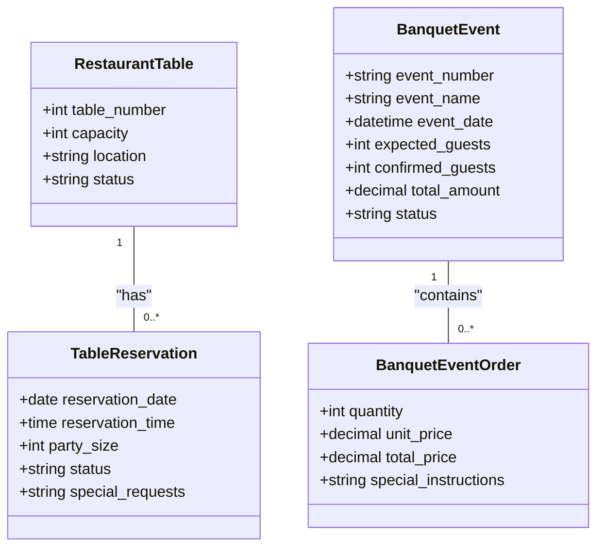
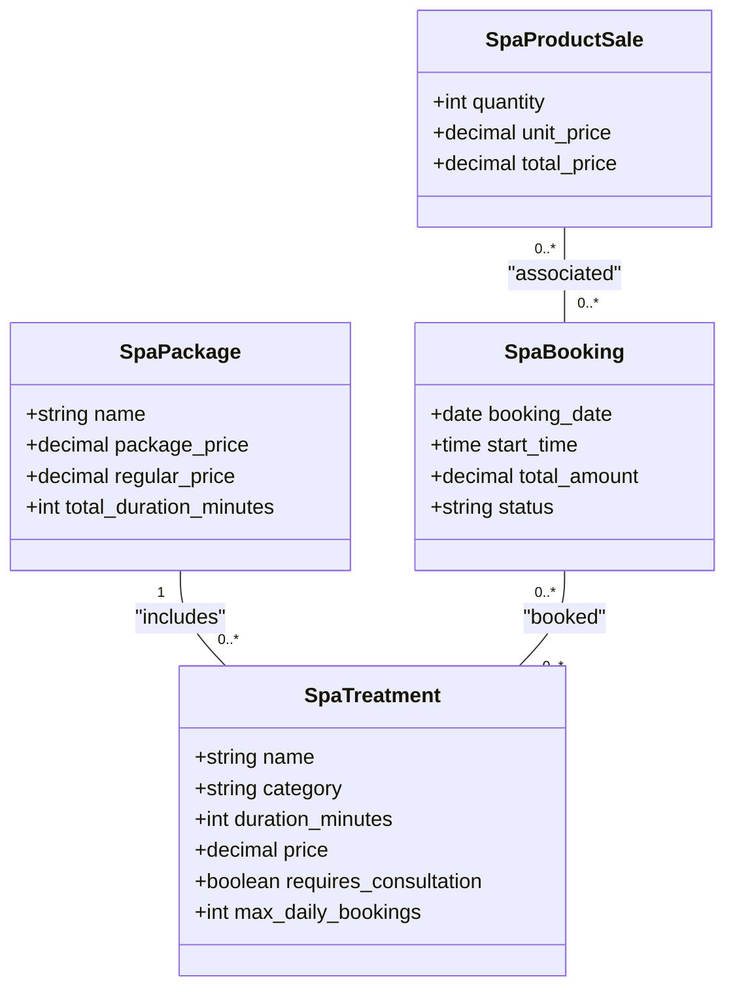
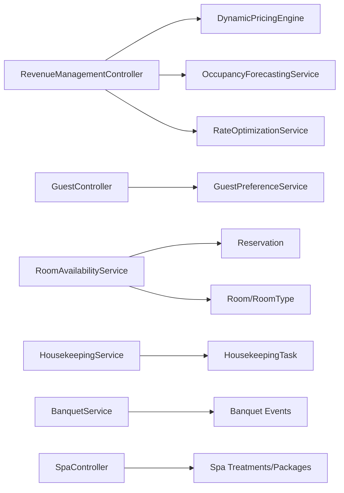

# Hotel & Resort Management Module

<cite>
**Referenced Files in This Document**
- [web.php](file://routes/web.php)
- [RevenueManagementController.php](file://app/Http/Controllers/Hotel/RevenueManagementController.php)
- [DynamicPricingEngine.php](file://app/Services/DynamicPricingEngine.php)
- [RateOptimizationService.php](file://app/Services/RateOptimizationService.php)
- [OccupancyForecastingService.php](file://app/Services/OccupancyForecastingService.php)
- [HotelReportsService.php](file://app/Services/HotelReportsService.php)
- [GuestController.php](file://app/Http/Controllers/Hotel/GuestController.php)
- [GuestPreferenceService.php](file://app/Services/GuestPreferenceService.php)
- [RoomAvailabilityService.php](file://app/Services/RoomAvailabilityService.php)
- [HousekeepingService.php](file://app/Services/HousekeepingService.php)
- [BanquetService.php](file://app/Services/BanquetService.php)
- [BanquetController.php](file://app/Http/Controllers/Hotel/BanquetController.php)
- [SpaController.php](file://app/Http/Controllers/Hotel/SpaController.php)
- [2026_04_03_400000_create_fb_module_tables.php](file://database/migrations/2026_04_03_400000_create_fb_module_tables.php)
- [2026_04_04_600000_create_spa_module_tables.php](file://database/migrations/2026_04_04_600000_create_spa_module_tables.php)
- [TenantDemoSeeder.php](file://database/seeders/TenantDemoSeeder.php)
- [preferences.blade.php](file://resources/views/hotel/guests/preferences.blade.php)
- [special-events.blade.php](file://resources/views/hotel/revenue/special-events.blade.php)
- [yield-optimization.blade.php](file://resources/views/hotel/revenue/yield-optimization.blade.php)
- [index.blade.php](file://resources/views/fnb/tables/index.blade.php)
</cite>

## Table of Contents
1. [Introduction](#introduction)
2. [Project Structure](#project-structure)
3. [Core Components](#core-components)
4. [Architecture Overview](#architecture-overview)
5. [Detailed Component Analysis](#detailed-component-analysis)
6. [Dependency Analysis](#dependency-analysis)
7. [Performance Considerations](#performance-considerations)
8. [Troubleshooting Guide](#troubleshooting-guide)
9. [Conclusion](#conclusion)
10. [Appendices](#appendices)

## Introduction
This document describes the Hotel & Resort Management Module within the qalcuityERP system. It covers room management, reservation handling, guest preference management, housekeeping operations, front office workflows, revenue management and dynamic pricing, food and beverage operations, spa and wellness services, event management, occupancy forecasting, rate optimization algorithms, guest loyalty programs, hospitality analytics dashboards, multi-property management, corporate booking systems, and hospitality compliance requirements. The module integrates tightly with Laravel controllers, services, and database migrations to provide a comprehensive hospitality solution.

## Project Structure
The module is organized around feature domains with dedicated controllers, services, and database migrations. Key areas include:
- Revenue Management: Dynamic pricing, occupancy forecasting, rate optimization, and analytics
- Room & Housekeeping: Availability checks, occupancy calendars, and housekeeping task lifecycle
- Guest Experience: Preferences, loyalty points, VIP tiers, and personalized communications
- Food & Beverage: Restaurant tables, table reservations, minibar, and banquet event management
- Spa & Wellness: Treatments, packages, therapists, and product sales
- Events: Banquet event lifecycle and coordination
- Multi-property: Tenant scoping across services and models

**Diagram sources**
- [RevenueManagementController.php:1-43](file://app/Http/Controllers/Hotel/RevenueManagementController.php#L1-L43)
- [GuestController.php:1-47](file://app/Http/Controllers/Hotel/GuestController.php#L1-L47)
- [BanquetController.php:1-41](file://app/Http/Controllers/Hotel/BanquetController.php#L1-L41)
- [SpaController.php:1-223](file://app/Http/Controllers/Hotel/SpaController.php#L1-L223)
- [DynamicPricingEngine.php:1-426](file://app/Services/DynamicPricingEngine.php#L1-L426)
- [RateOptimizationService.php:1-571](file://app/Services/RateOptimizationService.php#L1-L571)
- [OccupancyForecastingService.php:1-463](file://app/Services/OccupancyForecastingService.php#L1-L463)
- [GuestPreferenceService.php:1-293](file://app/Services/GuestPreferenceService.php#L1-L293)
- [RoomAvailabilityService.php:1-498](file://app/Services/RoomAvailabilityService.php#L1-L498)
- [HousekeepingService.php:1-276](file://app/Services/HousekeepingService.php#L1-L276)
- [BanquetService.php:1-201](file://app/Services/BanquetService.php#L1-L201)

**Section sources**
- [web.php:1996-2011](file://routes/web.php#L1996-L2011)
- [web.php:2079-2093](file://routes/web.php#L2079-L2093)

## Core Components
- Revenue Management: Centralized dashboard, recommendations, rate calendar, yield optimization, and bulk rate updates
- Room Management: Availability checks, occupancy calendars, upcoming availability, and checkout/check-in tracking
- Guest Experience: Preferences, auto-application to reservations, loyalty points, VIP tier calculations, and communication preferences
- Housekeeping: Task lifecycle, room status transitions, maintenance requests, and daily reports
- Food & Beverage: Restaurant tables, table reservations, banquet event creation and management, and menu item ordering
- Spa & Wellness: Treatments, packages, therapist schedules, and product sales
- Analytics: Occupancy analytics, revenue summaries, and guest behavior insights

**Section sources**
- [RevenueManagementController.php:33-43](file://app/Http/Controllers/Hotel/RevenueManagementController.php#L33-L43)
- [RoomAvailabilityService.php:36-91](file://app/Services/RoomAvailabilityService.php#L36-L91)
- [GuestPreferenceService.php:18-79](file://app/Services/GuestPreferenceService.php#L18-L79)
- [HousekeepingService.php:16-55](file://app/Services/HousekeepingService.php#L16-L55)
- [BanquetService.php:15-50](file://app/Services/BanquetService.php#L15-L50)
- [SpaController.php:27-120](file://app/Http/Controllers/Hotel/SpaController.php#L27-L120)

## Architecture Overview
The module follows a layered architecture:
- Controllers orchestrate HTTP requests and delegate to services
- Services encapsulate business logic and coordinate models
- Models represent domain entities with tenant scoping
- Migrations define schema for hotel-specific features
- Views render UI for revenue management, guest preferences, and F&B operations

**Diagram sources**
- [RevenueManagementController.php:33-43](file://app/Http/Controllers/Hotel/RevenueManagementController.php#L33-L43)
- [DynamicPricingEngine.php:39-147](file://app/Services/DynamicPricingEngine.php#L39-L147)
- [RateOptimizationService.php:42-83](file://app/Services/RateOptimizationService.php#L42-L83)
- [OccupancyForecastingService.php:46-57](file://app/Services/OccupancyForecastingService.php#L46-L57)

## Detailed Component Analysis

### Revenue Management
- Dynamic Pricing Engine: Computes optimal rates considering occupancy, competitors, events, day-of-week, length-of-stay, and advance booking adjustments
- Occupancy Forecasting: Predicts occupancy using historical data, booking pace, events, and seasonality with confidence scoring
- Rate Optimization: Generates recommendations, yield optimization, channel mix optimization, and overbooking suggestions
- Analytics: Revenue snapshots, occupancy analytics, and performance reporting

**Diagram sources**
- [DynamicPricingEngine.php:39-147](file://app/Services/DynamicPricingEngine.php#L39-L147)

**Section sources**
- [DynamicPricingEngine.php:15-147](file://app/Services/DynamicPricingEngine.php#L15-L147)
- [OccupancyForecastingService.php:46-128](file://app/Services/OccupancyForecastingService.php#L46-L128)
- [RateOptimizationService.php:42-280](file://app/Services/RateOptimizationService.php#L42-L280)
- [RevenueManagementController.php:33-43](file://app/Http/Controllers/Hotel/RevenueManagementController.php#L33-L43)

### Room Management
- Availability: Checks room availability across date ranges, supports pessimistic locking to prevent race conditions
- Occupancy Calendar: Builds monthly occupancy statistics by room type and overall
- Upcoming Availability: Forecasts next 30 days for a room type
- Checkout/Check-in Tracking: Identifies rooms requiring checkout or check-in today

**Diagram sources**
- [RoomAvailabilityService.php:209-234](file://app/Services/RoomAvailabilityService.php#L209-L234)

**Section sources**
- [RoomAvailabilityService.php:36-91](file://app/Services/RoomAvailabilityService.php#L36-L91)
- [RoomAvailabilityService.php:284-341](file://app/Services/RoomAvailabilityService.php#L284-L341)
- [RoomAvailabilityService.php:413-435](file://app/Services/RoomAvailabilityService.php#L413-L435)

### Guest Preference Management
- Preference Storage: Categorizes preferences (e.g., room, amenity), supports priority and auto-apply flags
- Auto-apply to Reservations: Aggregates preferences into special requests during reservation creation
- Loyalty Program: Awards/redeems points, calculates VIP level based on stays and points
- Communication Preferences: Respects guest preferred communication method

**Diagram sources**
- [GuestPreferenceService.php:44-135](file://app/Services/GuestPreferenceService.php#L44-L135)

**Section sources**
- [GuestPreferenceService.php:18-79](file://app/Services/GuestPreferenceService.php#L18-L79)
- [GuestPreferenceService.php:113-135](file://app/Services/GuestPreferenceService.php#L113-L135)
- [preferences.blade.php:47-374](file://resources/views/hotel/guests/preferences.blade.php#L47-L374)

### Housekeeping Operations
- Task Lifecycle: Create, assign, start, and complete housekeeping tasks with checklist support
- Status Transitions: Proper room status updates during cleaning (e.g., dirty → cleaning → clean)
- Maintenance Requests: Report, assign, and complete maintenance with priority-based room status changes
- Daily Reporting: Tracks rooms cleaned, average cleaning time, maintenance completed, and costs

**Diagram sources**
- [HousekeepingService.php:114-165](file://app/Services/HousekeepingService.php#L114-L165)

**Section sources**
- [HousekeepingService.php:57-165](file://app/Services/HousekeepingService.php#L57-L165)
- [HousekeepingService.php:253-274](file://app/Services/HousekeepingService.php#L253-L274)

### Food & Beverage Operations
- Restaurant Tables: Manage table capacity, location, and reservations
- Table Reservations: Track reservations per table with customer details and timing
- Banquet Events: Full lifecycle from inquiry to completion, including menu ordering and revenue tracking

**Diagram sources**
- [2026_04_03_400000_create_fb_module_tables.php:198-247](file://database/migrations/2026_04_03_400000_create_fb_module_tables.php#L198-L247)
- [2026_04_03_400000_create_fb_module_tables.php:180-195](file://database/migrations/2026_04_03_400000_create_fb_module_tables.php#L180-L195)

**Section sources**
- [index.blade.php:1-75](file://resources/views/fnb/tables/index.blade.php#L1-L75)
- [BanquetService.php:15-50](file://app/Services/BanquetService.php#L15-L50)
- [BanquetService.php:55-82](file://app/Services/BanquetService.php#L55-L82)
- [BanquetController.php:19-41](file://app/Http/Controllers/Hotel/BanquetController.php#L19-L41)

### Spa and Wellness Services
- Treatments and Packages: Define treatments, durations, pricing, and package compositions
- Booking Management: Book treatments, track therapist availability, and manage package bookings
- Product Sales and Reviews: Track product sales and publish reviews with ratings breakdown

**Diagram sources**
- [2026_04_04_600000_create_spa_module_tables.php:32-52](file://database/migrations/2026_04_04_600000_create_spa_module_tables.php#L32-L52)
- [2026_04_04_600000_create_spa_module_tables.php:170-215](file://database/migrations/2026_04_04_600000_create_spa_module_tables.php#L170-L215)

**Section sources**
- [SpaController.php:27-120](file://app/Http/Controllers/Hotel/SpaController.php#L27-L120)
- [TenantDemoSeeder.php:2106-2134](file://database/seeders/TenantDemoSeeder.php#L2106-L2134)

### Event Management
- Banquet Lifecycle: Create, confirm, update guest counts, complete, and cancel events
- Revenue Tracking: Summarize completed events by total revenue, deposits, and average value
- Upcoming Events: Retrieve upcoming confirmed/in-progress events for operational planning

**Section sources**
- [BanquetService.php:87-160](file://app/Services/BanquetService.php#L87-L160)
- [BanquetService.php:165-200](file://app/Services/BanquetService.php#L165-L200)
- [BanquetController.php:19-41](file://app/Http/Controllers/Hotel/BanquetController.php#L19-L41)

### Hospitality Analytics Dashboards
- Occupancy Analytics: Guest counts, repeat guests, average stay duration, and lead time
- Revenue Analytics: Room, F&B, and spa revenue breakdowns, daily trends, and channel revenue by source
- Revenue KPIs: ADR, RevPAR, occupancy rates, and pickup metrics

**Section sources**
- [HotelReportsService.php:258-442](file://app/Services/HotelReportsService.php#L258-L442)
- [HotelReportsService.php:283-442](file://app/Services/HotelReportsService.php#L283-L442)

### Multi-property Management and Corporate Booking Systems
- Tenant Scoping: Services consistently scope queries by tenant_id to support multi-property environments
- Corporate Bookings: Corporate GroupBooking and RatePlan integrations enable group rate management and consolidated billing

**Section sources**
- [RevenueManagementController.php:24-28](file://app/Http/Controllers/Hotel/RevenueManagementController.php#L24-L28)
- [RateOptimizationService.php:526-569](file://app/Services/RateOptimizationService.php#L526-L569)

### Hospitality Compliance Requirements
- Audit Trails: Activity logging for critical operations (e.g., task assignments, maintenance reports, preference updates)
- Data Retention: Configurable retention policies and archival commands for compliance-ready data lifecycle
- Secure Access: Tenant isolation traits and permission services ensure data privacy across properties

**Section sources**
- [GuestPreferenceService.php:146-151](file://app/Services/GuestPreferenceService.php#L146-L151)
- [HousekeepingService.php:101-106](file://app/Services/HousekeepingService.php#L101-L106)
- [BanquetService.php:41-46](file://app/Services/BanquetService.php#L41-L46)

## Dependency Analysis
The module exhibits cohesive internal dependencies:
- Revenue Management depends on forecasting and pricing engines
- Room availability depends on reservation and room models
- Guest preferences integrate with reservations and loyalty services
- Housekeeping coordinates with room status and maintenance models
- F&B and Spa depend on their respective domain models and transactions

**Diagram sources**
- [RevenueManagementController.php:14-18](file://app/Http/Controllers/Hotel/RevenueManagementController.php#L14-L18)
- [RoomAvailabilityService.php:5-8](file://app/Services/RoomAvailabilityService.php#L5-L8)
- [HousekeepingService.php:5-8](file://app/Services/HousekeepingService.php#L5-L8)
- [BanquetService.php:5-7](file://app/Services/BanquetService.php#L5-L7)
- [SpaController.php:6-13](file://app/Http/Controllers/Hotel/SpaController.php#L6-L13)

**Section sources**
- [web.php:1996-2011](file://routes/web.php#L1996-L2011)
- [web.php:2079-2093](file://routes/web.php#L2079-L2093)

## Performance Considerations
- Caching: Pricing engine maintains an in-memory cache keyed by parameters to reduce repeated calculations
- Indexing: Migrations define composite indexes on tenant_id and date/status combinations for fast lookups
- Concurrency: Room availability checks use pessimistic locking to prevent race conditions during booking
- Forecasting: Weighted ensemble approach balances historical, booking pace, event, and seasonal signals with confidence thresholds

[No sources needed since this section provides general guidance]

## Troubleshooting Guide
- Double Booking Prevention: Use locked availability checks when creating reservations to avoid conflicts
- Preference Application: Verify auto-applied preferences are appended to reservation special requests
- Task Completion: Ensure housekeeping tasks trigger proper room status transitions and logging
- Event Cancellation: Confirm banquet events update status and log activities appropriately
- Revenue KPIs: Validate tenant scoping and date range selections when generating reports

**Section sources**
- [RoomAvailabilityService.php:155-197](file://app/Services/RoomAvailabilityService.php#L155-L197)
- [GuestPreferenceService.php:113-135](file://app/Services/GuestPreferenceService.php#L113-L135)
- [HousekeepingService.php:140-165](file://app/Services/HousekeepingService.php#L140-L165)
- [BanquetService.php:146-160](file://app/Services/BanquetService.php#L146-L160)
- [HotelReportsService.php:258-278](file://app/Services/HotelReportsService.php#L258-L278)

## Conclusion
The Hotel & Resort Management Module provides a robust, tenant-scoped solution for modern hospitality operations. It combines advanced revenue management with practical front office, housekeeping, F&B, spa, and event capabilities. The modular design, strong tenant isolation, and comprehensive analytics enable scalable multi-property deployments while maintaining operational excellence.

[No sources needed since this section summarizes without analyzing specific files]

## Appendices

### Revenue Management UI Elements
- Special Events: Enable event-based pricing adjustments and visibility
- Yield Optimization: Overbooking recommendations and length-of-stay restrictions
- Rate Calendar: Visualize rate changes across room types

**Section sources**
- [special-events.blade.php:63-90](file://resources/views/hotel/revenue/special-events.blade.php#L63-L90)
- [yield-optimization.blade.php:27-51](file://resources/views/hotel/revenue/yield-optimization.blade.php#L27-L51)