# Hotel & Resort Management Module

<cite>
**Referenced Files in This Document**
- [web.php](file://routes/web.php)
- [RevenueManagementController.php](file://app/Http/Controllers/Hotel/RevenueManagementController.php)
- [DynamicPricingEngine.php](file://app/Services/DynamicPricingEngine.php)
- [RateOptimizationService.php](file://app/Services/RateOptimizationService.php)
- [OccupancyForecastingService.php](file://app/Services/OccupancyForecastingService.php)
- [HotelReportsService.php](file://app/Services/HotelReportsService.php)
- [GuestController.php](file://app/Http/Controllers/Hotel/GuestController.php)
- [GuestPreferenceService.php](file://app/Services/GuestPreferenceService.php)
- [RoomAvailabilityService.php](file://app/Services/RoomAvailabilityService.php)
- [HousekeepingService.php](file://app/Services/HousekeepingService.php)
- [BanquetService.php](file://app/Services/BanquetService.php)
- [BanquetController.php](file://app/Http/Controllers/Hotel/BanquetController.php)
- [SpaController.php](file://app/Http/Controllers/Hotel/SpaController.php)
- [CheckInOutController.php](file://app/Http/Controllers/Hotel/CheckInOutController.php)
- [MinibarController.php](file://app/Http/Controllers/Hotel/MinibarController.php)
- [RoomChangeController.php](file://app/Http/Controllers/Hotel/RoomChangeController.php)
- [NightAuditController.php](file://app/Http/Controllers/Hotel/NightAuditController.php)
- [CheckoutReceipt.php](file://app/Models/CheckoutReceipt.php)
- [PreArrivalForm.php](file://app/Models/PreArrivalForm.php)
- [ReservationRoomChange.php](file://app/Models/ReservationRoomChange.php)
- [MinibarCharge.php](file://app/Models/MinibarCharge.php)
- [Department.php](file://app/Models/Department.php)
- [MinibarService.php](file://app/Services/MinibarService.php)
- [2026_04_03_400000_create_fb_module_tables.php](file://database/migrations/2026_04_03_400000_create_fb_module_tables.php)
- [2026_04_04_600000_create_spa_module_tables.php](file://database/migrations/2026_04_04_600000_create_spa_module_tables.php)
- [TenantDemoSeeder.php](file://database/seeders/TenantDemoSeeder.php)
- [preferences.blade.php](file://resources/views/hotel/guests/preferences.blade.php)
- [special-events.blade.php](file://resources/views/hotel/revenue/special-events.blade.php)
- [yield-optimization.blade.php](file://resources/views/hotel/revenue/yield-optimization.blade.php)
- [index.blade.php](file://resources/views/fnb/tables/index.blade.php)
- [batch.blade.php](file://resources/views/hotel/night-audit/batch.blade.php)
</cite>

## Update Summary
**Changes Made**
- Enhanced checkout automation with PDF receipt generation and automated minibar charge processing
- Added comprehensive pre-arrival form processing with verification workflows
- Implemented room change management system with visual room mapping and audit trails
- Integrated minibar charge tracking with status management and batch processing
- Added department-based organization infrastructure for multi-property management
- Enhanced guest preference management with AI-powered suggestions and loyalty integration

## Table of Contents
1. [Introduction](#introduction)
2. [Project Structure](#project-structure)
3. [Core Components](#core-components)
4. [Architecture Overview](#architecture-overview)
5. [Detailed Component Analysis](#detailed-component-analysis)
6. [Dependency Analysis](#dependency-analysis)
7. [Performance Considerations](#performance-considerations)
8. [Troubleshooting Guide](#troubleshooting-guide)
9. [Conclusion](#conclusion)
10. [Appendices](#appendices)

## Introduction
This document describes the Hotel & Resort Management Module within the qalcuityERP system. It covers room management, reservation handling, guest preference management, housekeeping operations, front office workflows, revenue management and dynamic pricing, food and beverage operations, spa and wellness services, event management, occupancy forecasting, rate optimization algorithms, guest loyalty programs, hospitality analytics dashboards, multi-property management, corporate booking systems, and hospitality compliance requirements. The module integrates tightly with Laravel controllers, services, and database models to provide a comprehensive hospitality solution.

**Updated** Enhanced with checkout automation, pre-arrival form processing, PDF receipt generation, minibar charge processing, room change management, and department-based organization capabilities.

## Project Structure
The module is organized around feature domains with dedicated controllers, services, and database models. Key areas include:
- Revenue Management: Dynamic pricing, occupancy forecasting, rate optimization, and analytics
- Room & Housekeeping: Availability checks, occupancy calendars, and housekeeping task lifecycle
- Guest Experience: Preferences, loyalty points, VIP tiers, and personalized communications
- Food & Beverage: Restaurant tables, table reservations, minibar, and banquet event management
- Spa & Wellness: Treatments, packages, therapists, and product sales
- Events: Banquet event lifecycle and coordination
- Front Office Operations: Check-in/out automation, pre-arrival forms, and checkout receipts
- Night Audit: Batch processing, revenue posting, and charge reconciliation
- Room Management: Room changes, availability tracking, and room status management
- Multi-property: Tenant scoping across services and models with department-based organization

```mermaid
graph TB
subgraph "Hotel Controllers"
RM["RevenueManagementController"]
GC["GuestController"]
BC["BanquetController"]
SC["SpaController"]
CI["CheckInOutController"]
MC["MinibarController"]
RC["RoomChangeController"]
NAC["NightAuditController"]
end
subgraph "Hotel Services"
DPE["DynamicPricingEngine"]
ROS["RateOptimizationService"]
OFS["OccupancyForecastingService"]
GAS["GuestPreferenceService"]
RAS["RoomAvailabilityService"]
HKS["HousekeepingService"]
BFS["BanquetService"]
MBS["MinibarService"]
end
subgraph "Models & Migrations"
RMModel["Room & RoomType"]
ResModel["Reservation"]
GuestModel["Guest"]
HKModel["HousekeepingTask"]
FBTables["Restaurant Tables"]
SpaTables["Spa Treatments/Packages"]
MinibarModel["MinibarCharge & Inventory"]
PreArrivalModel["PreArrivalForm"]
RoomChangeModel["ReservationRoomChange"]
ReceiptModel["CheckoutReceipt"]
DeptModel["Department"]
end
RM --> DPE
RM --> ROS
RM --> OFS
GC --> GAS
GC --> ResModel
BC --> BFS
SC --> SpaTables
CI --> ReceiptModel
CI --> PreArrivalModel
MC --> MinibarModel
RC --> RoomChangeModel
NAC --> MinibarModel
RAS --> ResModel
RAS --> RMModel
HKS --> HKModel
BFS --> BanquetTables
GAS --> GuestModel
DeptModel --> GuestModel
```

**Diagram sources**
- [RevenueManagementController.php:1-43](file://app/Http/Controllers/Hotel/RevenueManagementController.php#L1-L43)
- [GuestController.php:1-47](file://app/Http/Controllers/Hotel/GuestController.php#L1-L47)
- [BanquetController.php:1-41](file://app/Http/Controllers/Hotel/BanquetController.php#L1-L41)
- [SpaController.php:1-223](file://app/Http/Controllers/Hotel/SpaController.php#L1-L223)
- [CheckInOutController.php:1-338](file://app/Http/Controllers/Hotel/CheckInOutController.php#L1-L338)
- [MinibarController.php:1-89](file://app/Http/Controllers/Hotel/MinibarController.php#L1-L89)
- [RoomChangeController.php:1-191](file://app/Http/Controllers/Hotel/RoomChangeController.php#L1-L191)
- [NightAuditController.php:1-407](file://app/Http/Controllers/Hotel/NightAuditController.php#L1-L407)
- [DynamicPricingEngine.php:1-426](file://app/Services/DynamicPricingEngine.php#L1-L426)
- [RateOptimizationService.php:1-571](file://app/Services/RateOptimizationService.php#L1-L571)
- [OccupancyForecastingService.php:1-463](file://app/Services/OccupancyForecastingService.php#L1-L463)
- [GuestPreferenceService.php:1-527](file://app/Services/GuestPreferenceService.php#L1-L527)
- [RoomAvailabilityService.php:1-498](file://app/Services/RoomAvailabilityService.php#L1-L498)
- [HousekeepingService.php:1-276](file://app/Services/HousekeepingService.php#L1-L276)
- [BanquetService.php:1-201](file://app/Services/BanquetService.php#L1-L201)
- [MinibarService.php:1-146](file://app/Services/MinibarService.php#L1-L146)
- [PreArrivalForm.php:1-177](file://app/Models/PreArrivalForm.php#L1-L177)
- [MinibarCharge.php:1-105](file://app/Models/MinibarCharge.php#L1-L105)
- [Department.php:1-126](file://app/Models/Department.php#L1-L126)

**Section sources**
- [web.php:1996-2011](file://routes/web.php#L1996-L2011)
- [web.php:2074-2204](file://routes/web.php#L2074-L2204)

## Core Components
- Revenue Management: Centralized dashboard, recommendations, rate calendar, yield optimization, and bulk rate updates
- Room Management: Availability checks, occupancy calendars, upcoming availability, checkout/check-in tracking, and room change management with visual mapping
- Guest Experience: Preferences, auto-application to reservations, loyalty points, VIP tier calculations, communication preferences, and AI-powered suggestions
- Housekeeping: Task lifecycle, room status transitions, maintenance requests, and daily reports
- Food & Beverage: Restaurant tables, table reservations, minibar charge processing, and banquet event management
- Spa & Wellness: Treatments, packages, therapist schedules, and product sales
- Front Office Operations: Check-in/out automation with PDF receipts, pre-arrival form processing, and guest verification
- Night Audit: Batch processing with step-by-step execution, revenue posting, and charge reconciliation
- Analytics: Occupancy analytics, revenue summaries, and guest behavior insights
- Department Organization: Multi-property management with department-based hierarchy and tenant scoping

**Updated** Enhanced checkout automation, pre-arrival form workflows, minibar charge processing, room change management, and department-based organization.

**Section sources**
- [RevenueManagementController.php:33-43](file://app/Http/Controllers/Hotel/RevenueManagementController.php#L33-L43)
- [RoomAvailabilityService.php:36-91](file://app/Services/RoomAvailabilityService.php#L36-L91)
- [GuestPreferenceService.php:18-79](file://app/Services/GuestPreferenceService.php#L18-L79)
- [HousekeepingService.php:16-55](file://app/Services/HousekeepingService.php#L16-L55)
- [BanquetService.php:15-50](file://app/Services/BanquetService.php#L15-L50)
- [SpaController.php:27-120](file://app/Http/Controllers/Hotel/SpaController.php#L27-L120)
- [CheckInOutController.php:145-216](file://app/Http/Controllers/Hotel/CheckInOutController.php#L145-L216)
- [MinibarService.php:102-132](file://app/Services/MinibarService.php#L102-L132)
- [RoomChangeController.php:41-98](file://app/Http/Controllers/Hotel/RoomChangeController.php#L41-L98)
- [NightAuditController.php:74-128](file://app/Http/Controllers/Hotel/NightAuditController.php#L74-L128)
- [Department.php:13-26](file://app/Models/Department.php#L13-L26)

## Architecture Overview
The module follows a layered architecture:
- Controllers orchestrate HTTP requests and delegate to services
- Services encapsulate business logic and coordinate models
- Models represent domain entities with tenant scoping and department associations
- Migrations define schema for hotel-specific features
- Views render UI for revenue management, guest preferences, and F&B operations

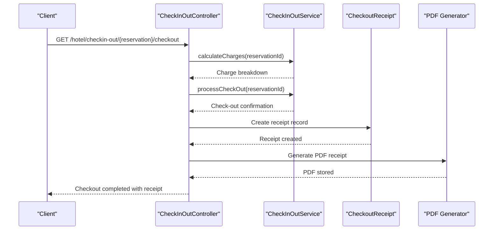

**Diagram sources**
- [CheckInOutController.php:155-216](file://app/Http/Controllers/Hotel/CheckInOutController.php#L155-L216)

## Detailed Component Analysis

### Revenue Management
- Dynamic Pricing Engine: Computes optimal rates considering occupancy, competitors, events, day-of-week, length-of-stay, and advance booking adjustments
- Occupancy Forecasting: Predicts occupancy using historical data, booking pace, events, and seasonality with confidence scoring
- Rate Optimization: Generates recommendations, yield optimization, channel mix optimization, and overbooking suggestions
- Analytics: Revenue snapshots, occupancy analytics, and performance reporting

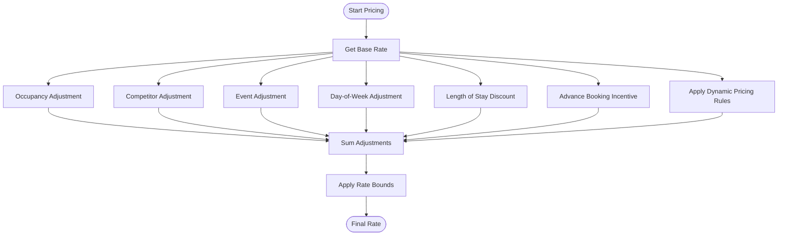

**Diagram sources**
- [DynamicPricingEngine.php:39-147](file://app/Services/DynamicPricingEngine.php#L39-L147)

**Section sources**
- [DynamicPricingEngine.php:15-147](file://app/Services/DynamicPricingEngine.php#L15-L147)
- [OccupancyForecastingService.php:46-128](file://app/Services/OccupancyForecastingService.php#L46-L128)
- [RateOptimizationService.php:42-280](file://app/Services/RateOptimizationService.php#L42-L280)
- [RevenueManagementController.php:33-43](file://app/Http/Controllers/Hotel/RevenueManagementController.php#L33-L43)

### Room Management
- Availability: Checks room availability across date ranges, supports pessimistic locking to prevent race conditions
- Occupancy Calendar: Builds monthly occupancy statistics by room type and overall
- Upcoming Availability: Forecasts next 30 days for a room type
- Checkout/Check-in Tracking: Identifies rooms requiring checkout or check-in today
- Room Change Management: Processes room upgrades/downgrades with rate calculations and audit trails
- Visual Room Mapping: Interactive room status visualization with floor filtering and real-time status updates

**Updated** Added comprehensive room change management with automatic rate difference calculations, detailed audit trails, and visual room mapping capabilities.

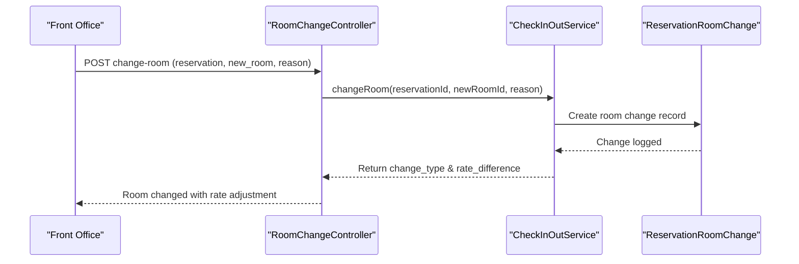

**Diagram sources**
- [RoomChangeController.php:67-98](file://app/Http/Controllers/Hotel/RoomChangeController.php#L67-L98)
- [ReservationRoomChange.php:69-83](file://app/Models/ReservationRoomChange.php#L69-L83)

**Section sources**
- [RoomAvailabilityService.php:36-91](file://app/Services/RoomAvailabilityService.php#L36-L91)
- [RoomAvailabilityService.php:284-341](file://app/Services/RoomAvailabilityService.php#L284-L341)
- [RoomAvailabilityService.php:413-435](file://app/Services/RoomAvailabilityService.php#L413-L435)
- [RoomChangeController.php:41-98](file://app/Http/Controllers/Hotel/RoomChangeController.php#L41-L98)
- [RoomChangeController.php:138-174](file://app/Http/Controllers/Hotel/RoomChangeController.php#L138-L174)
- [ReservationRoomChange.php:17-37](file://app/Models/ReservationRoomChange.php#L17-L37)

### Guest Preference Management
- Preference Storage: Categorizes preferences (e.g., room, amenity), supports priority and auto-apply flags
- Auto-apply to Reservations: Aggregates preferences into special requests during reservation creation
- AI-Powered Suggestions: Analyzes stay history to suggest preferences with confidence scoring
- Loyalty Program: Awards/redeems points, calculates VIP level based on stays and points
- Communication Preferences: Respects guest preferred communication method
- Loyalty-Based Recommendations: Provides VIP-specific rewards and preference suggestions

**Updated** Enhanced with AI-powered preference suggestions, loyalty-based recommendations, and automated preference application from stay history.

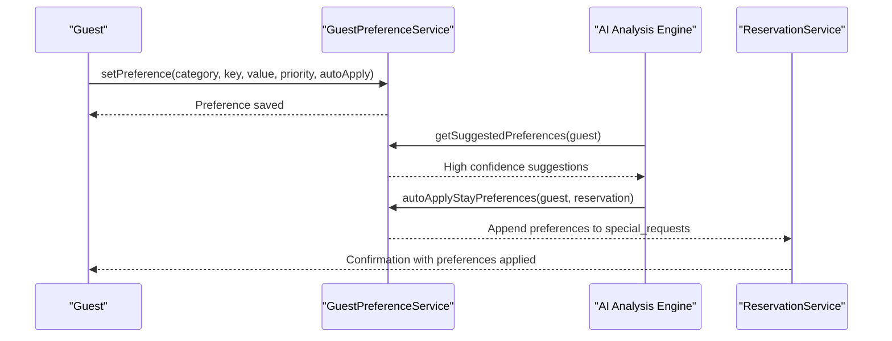

**Diagram sources**
- [GuestPreferenceService.php:44-135](file://app/Services/GuestPreferenceService.php#L44-L135)
- [GuestPreferenceService.php:298-432](file://app/Services/GuestPreferenceService.php#L298-L432)
- [GuestPreferenceService.php:498-525](file://app/Services/GuestPreferenceService.php#L498-L525)

**Section sources**
- [GuestPreferenceService.php:18-79](file://app/Services/GuestPreferenceService.php#L18-L79)
- [GuestPreferenceService.php:113-135](file://app/Services/GuestPreferenceService.php#L113-L135)
- [GuestPreferenceService.php:298-432](file://app/Services/GuestPreferenceService.php#L298-L432)
- [GuestPreferenceService.php:438-493](file://app/Services/GuestPreferenceService.php#L438-L493)
- [preferences.blade.php:47-374](file://resources/views/hotel/guests/preferences.blade.php#L47-L374)

### Housekeeping Operations
- Task Lifecycle: Create, assign, start, and complete housekeeping tasks with checklist support
- Status Transitions: Proper room status updates during cleaning (e.g., dirty → cleaning → clean)
- Maintenance Requests: Report, assign, and complete maintenance with priority-based room status changes
- Daily Reporting: Tracks rooms cleaned, average cleaning time, maintenance completed, and costs

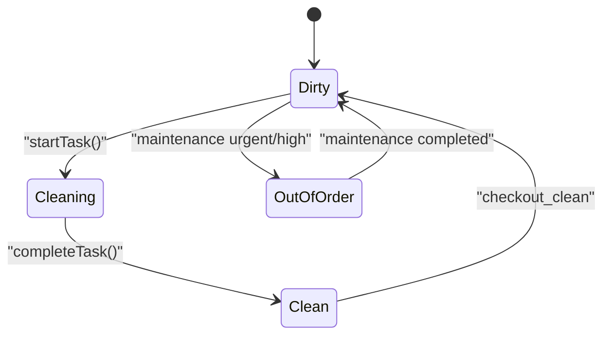

**Diagram sources**
- [HousekeepingService.php:114-165](file://app/Services/HousekeepingService.php#L114-L165)

**Section sources**
- [HousekeepingService.php:57-165](file://app/Services/HousekeepingService.php#L57-L165)
- [HousekeepingService.php:253-274](file://app/Services/HousekeepingService.php#L253-L274)

### Front Office Operations
- Check-in/Check-out Automation: Streamlined check-in with room assignment and deposit processing, automated check-out with charge calculation and receipt generation
- PDF Receipt Generation: Automatic PDF receipt creation and storage with payment detail tracking
- Pre-arrival Form Processing: Comprehensive guest information collection with verification workflows and consent management
- Guest Verification: Pre-arrival form verification with audit trail logging

**Updated** Enhanced with comprehensive checkout automation, PDF receipt generation, and pre-arrival form processing workflows.

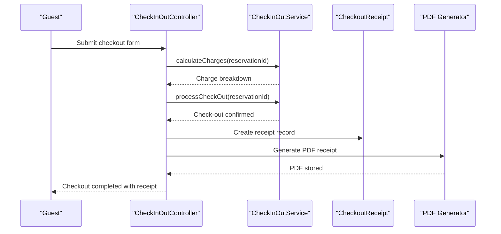

**Diagram sources**
- [CheckInOutController.php:155-216](file://app/Http/Controllers/Hotel/CheckInOutController.php#L155-L216)
- [CheckoutReceipt.php:52-63](file://app/Models/CheckoutReceipt.php#L52-L63)

**Section sources**
- [CheckInOutController.php:51-98](file://app/Http/Controllers/Hotel/CheckInOutController.php#L51-L98)
- [CheckInOutController.php:145-216](file://app/Http/Controllers/Hotel/CheckInOutController.php#L145-L216)
- [CheckInOutController.php:218-293](file://app/Http/Controllers/Hotel/CheckInOutController.php#L218-L293)
- [CheckInOutController.php:295-336](file://app/Http/Controllers/Hotel/CheckInOutController.php#L295-L336)
- [CheckoutReceipt.php:12-35](file://app/Models/CheckoutReceipt.php#L12-L35)
- [PreArrivalForm.php:12-54](file://app/Models/PreArrivalForm.php#L12-L54)

### Food & Beverage Operations
- Restaurant Tables: Manage table capacity, location, and reservations
- Table Reservations: Track reservations per table with customer details and timing
- Minibar Charge Processing: Comprehensive minibar consumption tracking, inventory management, and automated billing
- Banquet Events: Full lifecycle from inquiry to completion, including menu ordering and revenue tracking

**Updated** Enhanced with automated minibar charge processing integrated into checkout and nightly audit workflows.

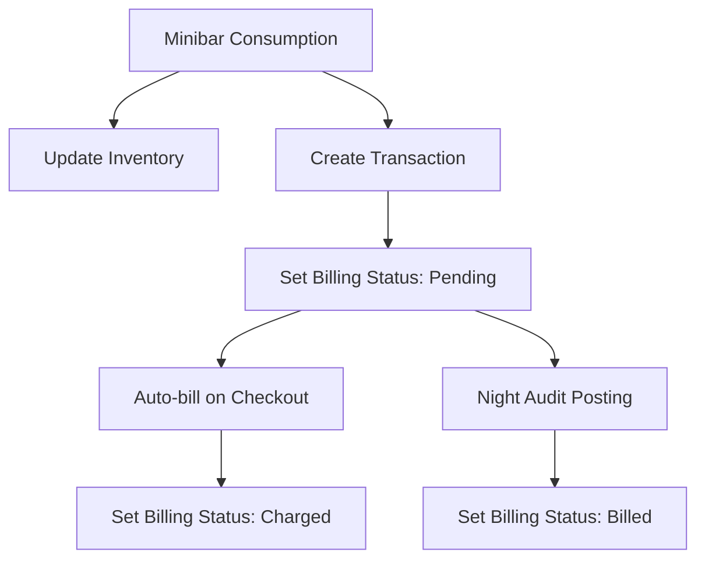

**Diagram sources**
- [MinibarService.php:38-76](file://app/Services/MinibarService.php#L38-L76)
- [MinibarService.php:102-132](file://app/Services/MinibarService.php#L102-L132)

**Section sources**
- [MinibarController.php:20-89](file://app/Http/Controllers/Hotel/MinibarController.php#L20-L89)
- [MinibarService.php:15-146](file://app/Services/MinibarService.php#L15-L146)
- [NightAuditController.php:114-128](file://app/Http/Controllers/Hotel/NightAuditController.php#L114-L128)
- [batch.blade.php:113-125](file://resources/views/hotel/night-audit/batch.blade.php#L113-L125)

### Spa and Wellness Services
- Treatments and Packages: Define treatments, durations, pricing, and package compositions
- Booking Management: Book treatments, track therapist availability, and manage package bookings
- Product Sales and Reviews: Track product sales and publish reviews with ratings breakdown

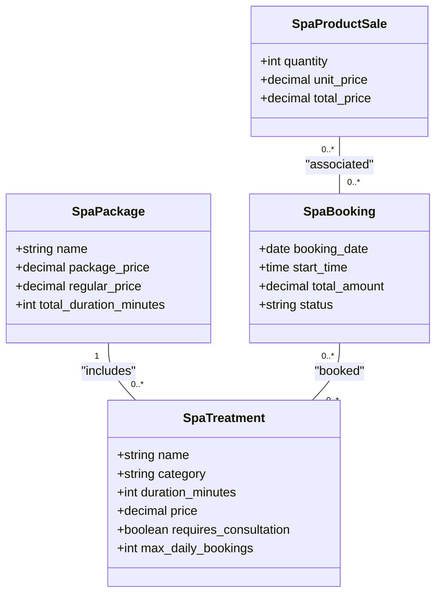

**Diagram sources**
- [2026_04_04_600000_create_spa_module_tables.php:32-52](file://database/migrations/2026_04_04_600000_create_spa_module_tables.php#L32-L52)
- [2026_04_04_600000_create_spa_module_tables.php:170-215](file://database/migrations/2026_04_04_600000_create_spa_module_tables.php#L170-L215)

**Section sources**
- [SpaController.php:27-120](file://app/Http/Controllers/Hotel/SpaController.php#L27-L120)
- [TenantDemoSeeder.php:2106-2134](file://database/seeders/TenantDemoSeeder.php#L2106-L2134)

### Event Management
- Banquet Lifecycle: Create, confirm, update guest counts, complete, and cancel events
- Revenue Tracking: Summarize completed events by total revenue, deposits, and average value
- Upcoming Events: Retrieve upcoming confirmed/in-progress events for operational planning

**Section sources**
- [BanquetService.php:87-160](file://app/Services/BanquetService.php#L87-L160)
- [BanquetService.php:165-200](file://app/Services/BanquetService.php#L165-L200)
- [BanquetController.php:19-41](file://app/Http/Controllers/Hotel/BanquetController.php#L19-L41)

### Night Audit Operations
- Batch Processing: Step-by-step execution of nightly procedures including room charges, F&B revenue, and minibar charges
- Revenue Posting: Automated posting of various revenue types with audit trails
- Charge Reconciliation: Comprehensive charge processing and revenue reconciliation
- Audit Controls: Batch status management, retry mechanisms, and cancellation with rollback capabilities

**Updated** Enhanced with automated minibar charge posting and comprehensive batch processing controls.

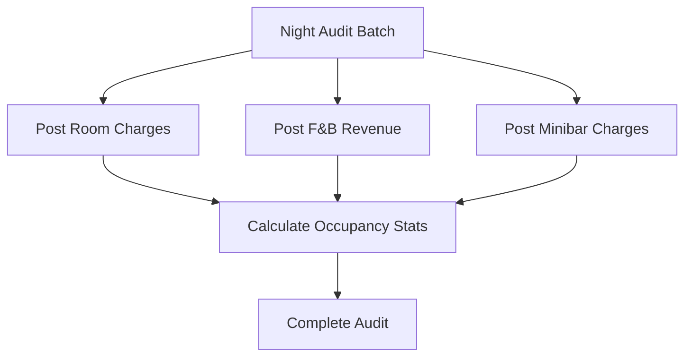

**Diagram sources**
- [NightAuditController.php:74-144](file://app/Http/Controllers/Hotel/NightAuditController.php#L74-L144)

**Section sources**
- [NightAuditController.php:26-179](file://app/Http/Controllers/Hotel/NightAuditController.php#L26-L179)
- [NightAuditController.php:185-272](file://app/Http/Controllers/Hotel/NightAuditController.php#L185-L272)
- [batch.blade.php:105-125](file://resources/views/hotel/night-audit/batch.blade.php#L105-L125)

### Hospitality Analytics Dashboards
- Occupancy Analytics: Guest counts, repeat guests, average stay duration, and lead time
- Revenue Analytics: Room, F&B, and spa revenue breakdowns, daily trends, and channel revenue by source
- Revenue KPIs: ADR, RevPAR, occupancy rates, and pickup metrics

**Section sources**
- [HotelReportsService.php:258-442](file://app/Services/HotelReportsService.php#L258-L442)
- [HotelReportsService.php:283-442](file://app/Services/HotelReportsService.php#L283-L442)

### Multi-property Management and Corporate Booking Systems
- Tenant Scoping: Services consistently scope queries by tenant_id to support multi-property environments
- Department-Based Organization: Hierarchical department structure with parent-child relationships and tenant isolation
- Corporate Bookings: Corporate GroupBooking and RatePlan integrations enable group rate management and consolidated billing

**Updated** Enhanced with department-based organization infrastructure supporting multi-property management.

**Section sources**
- [RevenueManagementController.php:24-28](file://app/Http/Controllers/Hotel/RevenueManagementController.php#L24-L28)
- [RateOptimizationService.php:526-569](file://app/Services/RateOptimizationService.php#L526-L569)
- [Department.php:13-26](file://app/Models/Department.php#L13-L26)
- [Department.php:44-55](file://app/Models/Department.php#L44-L55)

### Hospitality Compliance Requirements
- Audit Trails: Activity logging for critical operations (e.g., task assignments, maintenance reports, preference updates, room changes)
- Data Retention: Configurable retention policies and archival commands for compliance-ready data lifecycle
- Secure Access: Tenant isolation traits and permission services ensure data privacy across properties
- Department Security: Role-based access control through department hierarchies and user assignments

**Updated** Enhanced with comprehensive audit trails for checkout operations, pre-arrival form processing, room change management, and department-based security controls.

**Section sources**
- [GuestPreferenceService.php:146-151](file://app/Services/GuestPreferenceService.php#L146-L151)
- [HousekeepingService.php:101-106](file://app/Services/HousekeepingService.php#L101-L106)
- [BanquetService.php:41-46](file://app/Services/BanquetService.php#L41-L46)
- [CheckInOutController.php:202](file://app/Http/Controllers/Hotel/CheckInOutController.php#L202)
- [CheckInOutController.php:286](file://app/Http/Controllers/Hotel/CheckInOutController.php#L286)
- [CheckInOutController.php:333](file://app/Http/Controllers/Hotel/CheckInOutController.php#L333)
- [RoomChangeController.php:83-87](file://app/Http/Controllers/Hotel/RoomChangeController.php#L83-L87)
- [Department.php:36-46](file://app/Models/Department.php#L36-L46)

## Dependency Analysis
The module exhibits cohesive internal dependencies:
- Revenue Management depends on forecasting and pricing engines
- Room availability depends on reservation and room models
- Guest preferences integrate with reservations and loyalty services
- Housekeeping coordinates with room status and maintenance models
- F&B and Spa depend on their respective domain models and transactions
- Front Office operations integrate with checkout processes and receipt generation
- Night Audit coordinates with multiple revenue streams and charge processing
- Room Change Management integrates with availability services and rate calculations
- Pre-arrival Forms integrate with reservation and guest verification workflows
- Minibar Charges integrate with checkout and nightly audit processes
- Department models provide organizational structure for multi-property management

**Updated** Enhanced dependencies for checkout automation, minibar processing, room change management, and department-based organization.

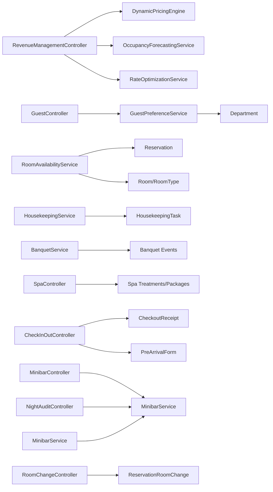

**Diagram sources**
- [RevenueManagementController.php:14-18](file://app/Http/Controllers/Hotel/RevenueManagementController.php#L14-L18)
- [RoomAvailabilityService.php:5-8](file://app/Services/RoomAvailabilityService.php#L5-L8)
- [HousekeepingService.php:5-8](file://app/Services/HousekeepingService.php#L5-L8)
- [BanquetService.php:5-7](file://app/Services/BanquetService.php#L5-L7)
- [SpaController.php:6-13](file://app/Http/Controllers/Hotel/SpaController.php#L6-L13)
- [CheckInOutController.php:7-12](file://app/Http/Controllers/Hotel/CheckInOutController.php#L7-L12)
- [MinibarController.php:8](file://app/Http/Controllers/Hotel/MinibarController.php#L8)
- [RoomChangeController.php:9](file://app/Http/Controllers/Hotel/RoomChangeController.php#L9)
- [NightAuditController.php:10](file://app/Http/Controllers/Hotel/NightAuditController.php#L10)
- [MinibarService.php:8](file://app/Services/MinibarService.php#L8)
- [GuestPreferenceService.php:5-7](file://app/Services/GuestPreferenceService.php#L5-L7)

**Section sources**
- [web.php:1996-2011](file://routes/web.php#L1996-L2011)
- [web.php:2074-2204](file://routes/web.php#L2074-L2204)

## Performance Considerations
- Caching: Pricing engine maintains an in-memory cache keyed by parameters to reduce repeated calculations
- Indexing: Migrations define composite indexes on tenant_id and date/status combinations for fast lookups
- Concurrency: Room availability checks use pessimistic locking to prevent race conditions during booking
- Forecasting: Weighted ensemble approach balances historical, booking pace, event, and seasonal signals with confidence thresholds
- Batch Processing: Night audit operations use transactional batch processing to ensure data consistency
- PDF Generation: Receipt PDF generation uses efficient DOMPDF integration with proper storage management
- Department Queries: Hierarchical department queries optimized with eager loading and tenant scoping
- AI Analysis: Guest preference suggestions cached and refreshed periodically to balance accuracy and performance

**Updated** Enhanced with batch processing optimizations, PDF generation performance considerations, and department query optimizations.

## Troubleshooting Guide
- Double Booking Prevention: Use locked availability checks when creating reservations to avoid conflicts
- Preference Application: Verify auto-applied preferences are appended to reservation special requests
- Task Completion: Ensure housekeeping tasks trigger proper room status transitions and logging
- Event Cancellation: Confirm banquet events update status and log activities appropriately
- Revenue KPIs: Validate tenant scoping and date range selections when generating reports
- Checkout Automation: Verify receipt generation and minibar charge processing during checkout
- Pre-arrival Forms: Confirm form submission and verification workflows are functioning correctly
- Room Changes: Validate rate difference calculations and audit trail logging for room change operations
- Night Audit: Monitor batch processing status and revenue posting accuracy
- Department Access: Verify user department assignments and hierarchical permissions for multi-property access
- Minibar Charges: Check charge status transitions from pending to charged during checkout and night audit

**Updated** Added troubleshooting guidance for checkout automation, pre-arrival forms, room changes, night audit operations, department access, and minibar charge processing.

**Section sources**
- [RoomAvailabilityService.php:155-197](file://app/Services/RoomAvailabilityService.php#L155-L197)
- [GuestPreferenceService.php:113-135](file://app/Services/GuestPreferenceService.php#L113-L135)
- [HousekeepingService.php:140-165](file://app/Services/HousekeepingService.php#L140-L165)
- [BanquetService.php:146-160](file://app/Services/BanquetService.php#L146-L160)
- [HotelReportsService.php:258-278](file://app/Services/HotelReportsService.php#L258-L278)
- [CheckInOutController.php:202-208](file://app/Http/Controllers/Hotel/CheckInOutController.php#L202-L208)
- [RoomChangeController.php:83-94](file://app/Http/Controllers/Hotel/RoomChangeController.php#L83-L94)
- [NightAuditController.php:114-128](file://app/Http/Controllers/Hotel/NightAuditController.php#L114-L128)
- [Department.php:84-87](file://app/Models/Department.php#L84-L87)

## Conclusion
The Hotel & Resort Management Module provides a robust, tenant-scoped solution for modern hospitality operations. It combines advanced revenue management with practical front office, housekeeping, F&B, spa, and event capabilities. The module has been significantly enhanced with checkout automation, pre-arrival form processing, PDF receipt generation, minibar charge processing, room change management, and department-based organization. The modular design, strong tenant isolation, comprehensive analytics, automated workflows, and hierarchical department structure enable scalable multi-property deployments while maintaining operational excellence and regulatory compliance.

## Appendices

### Revenue Management UI Elements
- Special Events: Enable event-based pricing adjustments and visibility
- Yield Optimization: Overbooking recommendations and length-of-stay restrictions
- Rate Calendar: Visualize rate changes across room types

**Section sources**
- [special-events.blade.php:63-90](file://resources/views/hotel/revenue/special-events.blade.php#L63-L90)
- [yield-optimization.blade.php:27-51](file://resources/views/hotel/revenue/yield-optimization.blade.php#L27-L51)

### Front Office Operations Features
- Checkout Automation: Streamlined checkout process with automatic charge calculation and receipt generation
- Pre-arrival Form Processing: Comprehensive guest information collection with verification workflows
- PDF Receipt Generation: Automatic receipt creation and storage with payment detail tracking
- Guest Verification: Pre-arrival form verification with audit trail logging

**Section sources**
- [CheckInOutController.php:145-216](file://app/Http/Controllers/Hotel/CheckInOutController.php#L145-L216)
- [CheckInOutController.php:218-293](file://app/Http/Controllers/Hotel/CheckInOutController.php#L218-L293)
- [CheckInOutController.php:295-336](file://app/Http/Controllers/Hotel/CheckInOutController.php#L295-L336)
- [CheckoutReceipt.php:52-95](file://app/Models/CheckoutReceipt.php#L52-L95)
- [PreArrivalForm.php:102-125](file://app/Models/PreArrivalForm.php#L102-L125)

### Night Audit Operations Features
- Batch Processing: Step-by-step execution of nightly procedures with progress tracking
- Revenue Posting: Automated posting of room charges, F&B revenue, and minibar charges
- Charge Reconciliation: Comprehensive charge processing and revenue reconciliation
- Audit Controls: Batch status management, retry mechanisms, and cancellation with rollback

**Section sources**
- [NightAuditController.php:74-179](file://app/Http/Controllers/Hotel/NightAuditController.php#L74-L179)
- [NightAuditController.php:185-272](file://app/Http/Controllers/Hotel/NightAuditController.php#L185-L272)
- [batch.blade.php:105-125](file://resources/views/hotel/night-audit/batch.blade.php#L105-L125)

### Room Change Management Features
- Room Change Processing: Automated room upgrade/downgrade with rate difference calculations
- Audit Trails: Comprehensive logging of room change operations with processor identification
- Rate Calculations: Automatic rate difference computation based on room type changes
- Historical Tracking: Detailed room change history with effective dates and reasons
- Visual Room Mapping: Interactive room status visualization with floor filtering and real-time updates

**Section sources**
- [RoomChangeController.php:41-98](file://app/Http/Controllers/Hotel/RoomChangeController.php#L41-L98)
- [RoomChangeController.php:138-174](file://app/Http/Controllers/Hotel/RoomChangeController.php#L138-L174)
- [ReservationRoomChange.php:17-37](file://app/Models/ReservationRoomChange.php#L17-L37)
- [ReservationRoomChange.php:69-83](file://app/Models/ReservationRoomChange.php#L69-L83)

### Guest Preference Management Features
- AI-Powered Suggestions: Analyze stay history to suggest preferences with confidence scoring
- Loyalty-Based Recommendations: Provide VIP-specific rewards and preference suggestions
- Automated Preference Application: Apply high-confidence preferences to future reservations
- Communication Preferences: Respect guest preferred communication methods

**Section sources**
- [GuestPreferenceService.php:298-432](file://app/Services/GuestPreferenceService.php#L298-L432)
- [GuestPreferenceService.php:438-493](file://app/Services/GuestPreferenceService.php#L438-L493)
- [GuestPreferenceService.php:498-525](file://app/Services/GuestPreferenceService.php#L498-L525)

### Department-Based Organization Features
- Hierarchical Structure: Parent-child department relationships with multi-level organization
- Tenant Isolation: Department models scoped to specific tenants for multi-property management
- User Assignments: Department-head relationships and doctor/appointment associations
- Active Status Management: Department activation/deactivation with filtering capabilities

**Section sources**
- [Department.php:13-26](file://app/Models/Department.php#L13-L26)
- [Department.php:44-55](file://app/Models/Department.php#L44-L55)
- [Department.php:84-87](file://app/Models/Department.php#L84-L87)
- [Department.php:108-116](file://app/Models/Department.php#L108-L116)