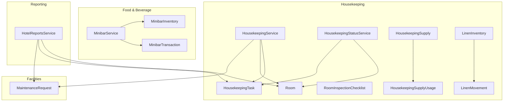
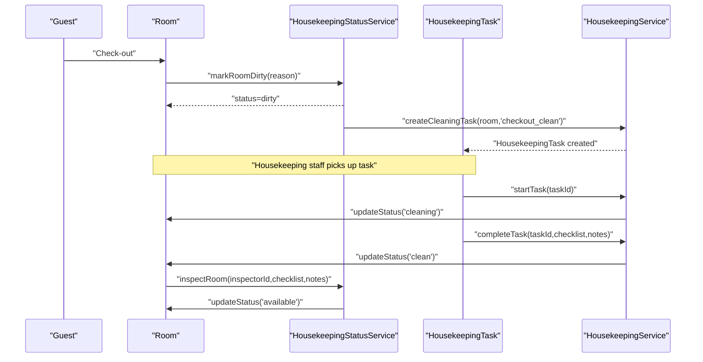
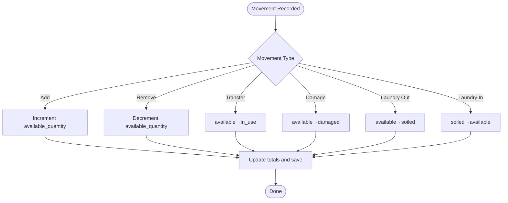
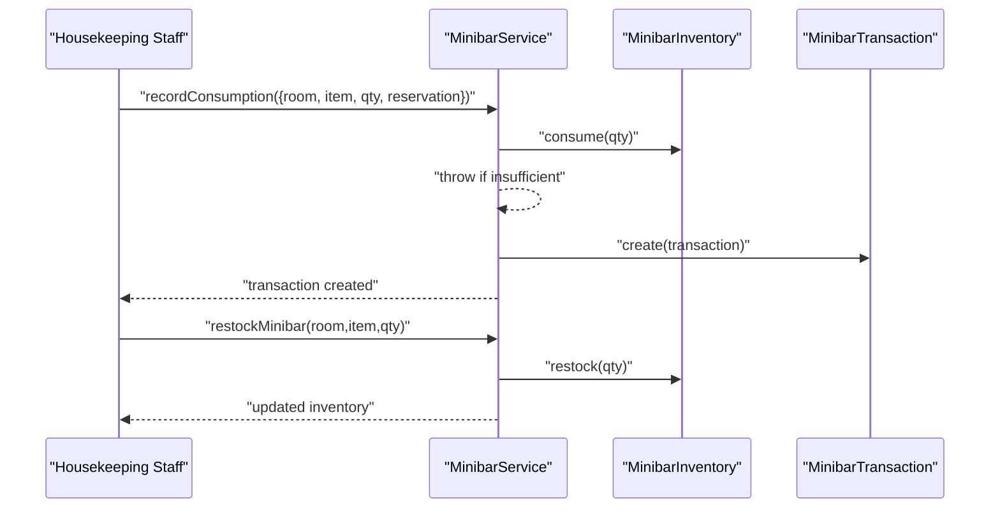
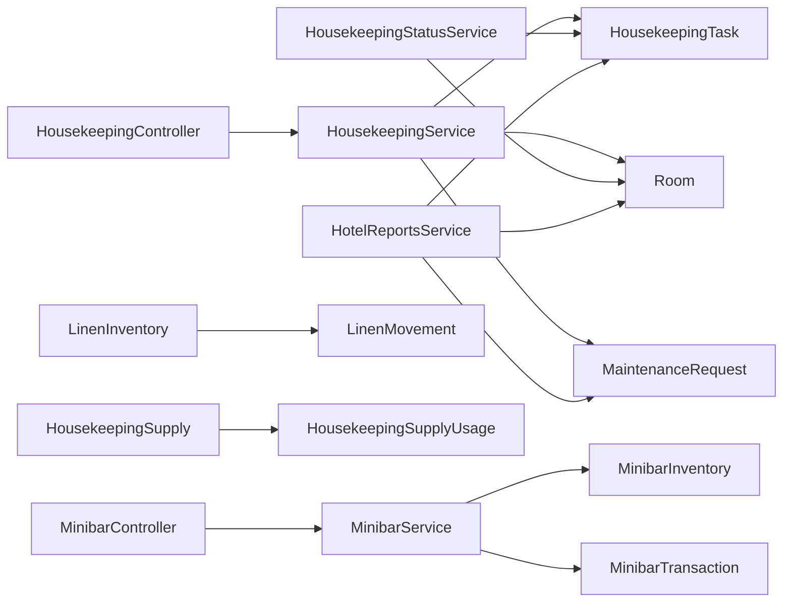
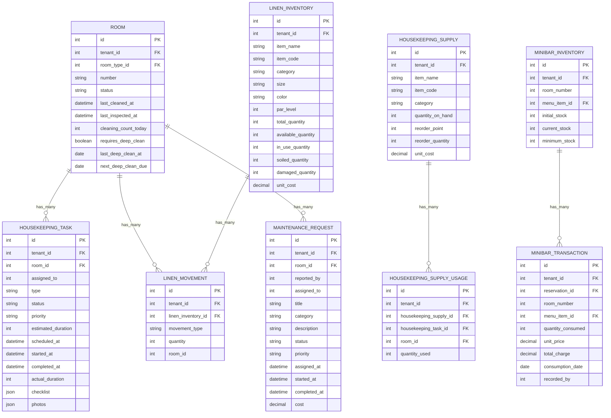

# Housekeeping & Facilities Management

<cite>
**Referenced Files in This Document**
- [HousekeepingService.php](file://app/Services/HousekeepingService.php)
- [HousekeepingStatusService.php](file://app/Services/HousekeepingStatusService.php)
- [HousekeepingTask.php](file://app/Models/HousekeepingTask.php)
- [Room.php](file://app/Models/Room.php)
- [RoomInspectionChecklist.php](file://app/Models/RoomInspectionChecklist.php)
- [HousekeepingSupply.php](file://app/Models/HousekeepingSupply.php)
- [HousekeepingSupplyUsage.php](file://app/Models/HousekeepingSupplyUsage.php)
- [LinenInventory.php](file://app/Models/LinenInventory.php)
- [LinenMovement.php](file://app/Models/LinenMovement.php)
- [MaintenanceRequest.php](file://app/Models/MaintenanceRequest.php)
- [MinibarService.php](file://app/Services/MinibarService.php)
- [MinibarInventory.php](file://app/Models/MinibarInventory.php)
- [MinibarTransaction.php](file://app/Models/MinibarTransaction.php)
- [MinibarController.php](file://app/Http/Controllers/Hotel/MinibarController.php)
- [HousekeepingController.php](file://app/Http/Controllers/Hotel/HousekeepingController.php)
- [HotelReportsService.php](file://app/Services/HotelReportsService.php)
- [2026_04_03_400000_create_fb_module_tables.php](file://database/migrations/2026_04_03_400000_create_fb_module_tables.php)
</cite>

## Table of Contents
1. [Introduction](#introduction)
2. [Project Structure](#project-structure)
3. [Core Components](#core-components)
4. [Architecture Overview](#architecture-overview)
5. [Detailed Component Analysis](#detailed-component-analysis)
6. [Dependency Analysis](#dependency-analysis)
7. [Performance Considerations](#performance-considerations)
8. [Troubleshooting Guide](#troubleshooting-guide)
9. [Conclusion](#conclusion)
10. [Appendices](#appendices)

## Introduction
This document explains the Housekeeping and Facilities Management capabilities implemented in the system. It covers housekeeping task scheduling and room cleaning workflows, linens management, supply inventory tracking, minibar management and consumption tracking, restocking procedures, facility maintenance scheduling and preventive maintenance workflows, equipment servicing, housekeeping staff management and productivity tracking, quality assurance processes, integration with room status systems, guest satisfaction metrics, and operational efficiency monitoring.

## Project Structure
The housekeeping and facilities domain spans services, models, controllers, and database migrations. Key areas:
- Housekeeping workflow orchestration via services and models
- Room lifecycle and status transitions
- Linens and supplies inventory with movements and usage
- Minibar consumption and restocking
- Maintenance requests and preventive maintenance
- Reporting and analytics for operational efficiency

**Diagram sources**
- [HousekeepingService.php:11-276](file://app/Services/HousekeepingService.php#L11-L276)
- [HousekeepingStatusService.php:22-352](file://app/Services/HousekeepingStatusService.php#L22-L352)
- [HousekeepingTask.php:13-136](file://app/Models/HousekeepingTask.php#L13-L136)
- [Room.php:14-198](file://app/Models/Room.php#L14-L198)
- [RoomInspectionChecklist.php:12-147](file://app/Models/RoomInspectionChecklist.php#L12-L147)
- [HousekeepingSupply.php:13-125](file://app/Models/HousekeepingSupply.php#L13-L125)
- [HousekeepingSupplyUsage.php:12-77](file://app/Models/HousekeepingSupplyUsage.php#L12-L77)
- [LinenInventory.php:13-132](file://app/Models/LinenInventory.php#L13-L132)
- [LinenMovement.php:12-120](file://app/Models/LinenMovement.php#L12-L120)
- [MaintenanceRequest.php:12-177](file://app/Models/MaintenanceRequest.php#L12-L177)
- [MinibarService.php:10-112](file://app/Services/MinibarService.php#L10-L112)
- [MinibarInventory.php](file://app/Models/MinibarInventory.php)
- [MinibarTransaction.php:12-69](file://app/Models/MinibarTransaction.php#L12-L69)
- [HotelReportsService.php:105-446](file://app/Services/HotelReportsService.php#L105-L446)

**Section sources**
- [HousekeepingService.php:11-276](file://app/Services/HousekeepingService.php#L11-L276)
- [HousekeepingStatusService.php:22-352](file://app/Services/HousekeepingStatusService.php#L22-L352)
- [HousekeepingTask.php:13-136](file://app/Models/HousekeepingTask.php#L13-L136)
- [Room.php:14-198](file://app/Models/Room.php#L14-L198)
- [RoomInspectionChecklist.php:12-147](file://app/Models/RoomInspectionChecklist.php#L12-L147)
- [HousekeepingSupply.php:13-125](file://app/Models/HousekeepingSupply.php#L13-L125)
- [HousekeepingSupplyUsage.php:12-77](file://app/Models/HousekeepingSupplyUsage.php#L12-L77)
- [LinenInventory.php:13-132](file://app/Models/LinenInventory.php#L13-L132)
- [LinenMovement.php:12-120](file://app/Models/LinenMovement.php#L12-L120)
- [MaintenanceRequest.php:12-177](file://app/Models/MaintenanceRequest.php#L12-L177)
- [MinibarService.php:10-112](file://app/Services/MinibarService.php#L10-L112)
- [MinibarInventory.php](file://app/Models/MinibarInventory.php)
- [MinibarTransaction.php:12-69](file://app/Models/MinibarTransaction.php#L12-L69)
- [HotelReportsService.php:105-446](file://app/Services/HotelReportsService.php#L105-L446)

## Core Components
- Housekeeping workflow orchestration: creation, assignment, start, completion, and reporting of housekeeping tasks; room status transitions; maintenance request handling.
- Room lifecycle: status updates, occupancy tracking, deep-clean triggers, and inspection readiness.
- Linens management: inventory tracking, movement types, PAR levels, and stock status.
- Supplies inventory: stock status, reorder points, and usage logging.
- Minibar management: initialization, consumption recording, restocking, and billing.
- Reporting and analytics: housekeeping completion rates, maintenance metrics, and operational summaries.

**Section sources**
- [HousekeepingService.php:16-55](file://app/Services/HousekeepingService.php#L16-L55)
- [Room.php:88-176](file://app/Models/Room.php#L88-L176)
- [LinenInventory.php:66-105](file://app/Models/LinenInventory.php#L66-L105)
- [HousekeepingSupply.php:60-90](file://app/Models/HousekeepingSupply.php#L60-L90)
- [MinibarService.php:15-97](file://app/Services/MinibarService.php#L15-L97)
- [HotelReportsService.php:119-132](file://app/Services/HotelReportsService.php#L119-L132)

## Architecture Overview
The system separates concerns across services and models:
- Controllers coordinate user actions (e.g., housekeeping dashboard, minibar transactions).
- Services encapsulate business logic for workflows (tasks, statuses, maintenance, minibar).
- Models define persistence, relationships, and derived attributes.
- Migrations define schema for housekeeping, linens, supplies, and minibar.

```mermaid
classDiagram
class HousekeepingService {
+getDashboardStats(tenantId) array
+createCleaningTask(roomId,type,priority,est,details) HousekeepingTask
+assignTask(taskId,userId) HousekeepingTask
+startTask(taskId,userId) HousekeepingTask
+completeTask(taskId,checklist,notes) HousekeepingTask
+createMaintenanceRequest(roomId,title,cat,desc,priority,reportedBy) MaintenanceRequest
+assignMaintenanceRequest(reqId,userId) MaintenanceRequest
+completeMaintenanceRequest(reqId,resolution,cost) MaintenanceRequest
+generateDailyReport(tenantId,date) array
}
class HousekeepingStatusService {
+markRoomDirty(room,reason) array
+startCleaning(room,task) array
+completeCleaning(room,task,checklist,notes) array
+inspectRoom(room,inspectorId,checklist,notes) array
+rejectAfterInspection(room,reason) array
+getStatusWorkflow(room) array
+isValidTransition(from,to) bool
}
class HousekeepingTask {
+start(userId)
+complete(checklist,notes)
+markForInspection()
+isOverdue() bool
+duration int
}
class Room {
+updateStatus(newStatus,userId) void
+markAsDirty() void
+incrementCleaningCount() void
+checkDeepCleanRequired() bool
+markDeepCleanCompleted() void
+housekeepingStats array
}
class MaintenanceRequest {
+assign(userId,notes) void
+startWork() void
+complete(resolutionNotes,cost) void
+isOverdue() bool
}
class LinenInventory {
+generateItemCode(tenantId,category) string
+updateQuantities() void
+isBelowParLevel() bool
+getStockStatusAttribute() string
+recordMovement(type,quantity,roomId,fromId,toId,reason,recordedBy) LinenMovement
}
class LinenMovement {
+updateInventory() void
}
class HousekeepingSupply {
+generateItemCode(tenantId,category) string
+needsReorder() bool
+getStockStatusAttribute() string
+recordUsage(quantity,roomId,taskId,notes,usedBy) HousekeepingSupplyUsage
+adjustQuantity(adj) void
}
class HousekeepingSupplyUsage {
+housekeepingSupply HousekeepingSupply
+housekeepingTask HousekeepingTask
+room Room
+usedBy User
}
class MinibarService {
+initializeRoomMinibar(roomNumber,tenantId) void
+recordConsumption(data) MinibarTransaction
+restockMinibar(roomNumber,menuItemId,quantity) MinibarInventory
+getReservationCharges(reservationId) array
}
class MinibarInventory
class MinibarTransaction
HousekeepingService --> HousekeepingTask : "manages"
HousekeepingService --> Room : "updates status"
HousekeepingService --> MaintenanceRequest : "manages"
HousekeepingStatusService --> Room : "transitions"
HousekeepingStatusService --> HousekeepingTask : "creates"
LinenInventory --> LinenMovement : "creates"
HousekeepingSupply --> HousekeepingSupplyUsage : "creates"
MinibarService --> MinibarInventory : "uses"
MinibarService --> MinibarTransaction : "creates"
```

**Diagram sources**
- [HousekeepingService.php:11-276](file://app/Services/HousekeepingService.php#L11-L276)
- [HousekeepingStatusService.php:22-352](file://app/Services/HousekeepingStatusService.php#L22-L352)
- [HousekeepingTask.php:13-136](file://app/Models/HousekeepingTask.php#L13-L136)
- [Room.php:14-198](file://app/Models/Room.php#L14-L198)
- [MaintenanceRequest.php:12-177](file://app/Models/MaintenanceRequest.php#L12-L177)
- [LinenInventory.php:13-132](file://app/Models/LinenInventory.php#L13-L132)
- [LinenMovement.php:12-120](file://app/Models/LinenMovement.php#L12-L120)
- [HousekeepingSupply.php:13-125](file://app/Models/HousekeepingSupply.php#L13-L125)
- [HousekeepingSupplyUsage.php:12-77](file://app/Models/HousekeepingSupplyUsage.php#L12-L77)
- [MinibarService.php:10-112](file://app/Services/MinibarService.php#L10-L112)
- [MinibarInventory.php](file://app/Models/MinibarInventory.php)
- [MinibarTransaction.php:12-69](file://app/Models/MinibarTransaction.php#L12-L69)

## Detailed Component Analysis

### Housekeeping Task Scheduling and Room Cleaning Workflows
- Task lifecycle: creation, assignment, start, completion with optional inspection, overdue checks, and duration tracking.
- Room status transitions: occupied → dirty (after checkout) → cleaning (task started) → clean (task completed) → available (after inspection).
- Deep clean triggers: based on occupancy days and last deep clean date.
- Productivity metrics: daily reports include rooms cleaned, average cleaning time, maintenance counts, and costs.

**Diagram sources**
- [HousekeepingStatusService.php:33-221](file://app/Services/HousekeepingStatusService.php#L33-L221)
- [HousekeepingTask.php:105-126](file://app/Models/HousekeepingTask.php#L105-L126)
- [Room.php:88-121](file://app/Models/Room.php#L88-L121)
- [HousekeepingService.php:58-165](file://app/Services/HousekeepingService.php#L58-L165)

**Section sources**
- [HousekeepingService.php:58-165](file://app/Services/HousekeepingService.php#L58-L165)
- [HousekeepingStatusService.php:33-221](file://app/Services/HousekeepingStatusService.php#L33-L221)
- [HousekeepingTask.php:105-126](file://app/Models/HousekeepingTask.php#L105-L126)
- [Room.php:136-176](file://app/Models/Room.php#L136-L176)

### Linens Management
- Inventory: tracks total, available, in-use, soiled, damaged quantities; PAR levels; stock status.
- Movements: add/remove/transfer/damage/laundry-in/laundry-out with automatic quantity updates.
- Item code generation and stock status helpers.

**Diagram sources**
- [LinenMovement.php:81-118](file://app/Models/LinenMovement.php#L81-L118)
- [LinenInventory.php:80-84](file://app/Models/LinenInventory.php#L80-L84)

**Section sources**
- [LinenInventory.php:66-105](file://app/Models/LinenInventory.php#L66-L105)
- [LinenMovement.php:81-118](file://app/Models/LinenMovement.php#L81-L118)

### Supply Inventory Tracking
- Tracks quantity on hand, reorder points, unit cost, supplier info, and stock status.
- Usage logging automatically adjusts inventory upon creation/deletion of usage records.

**Section sources**
- [HousekeepingSupply.php:74-90](file://app/Models/HousekeepingSupply.php#L74-L90)
- [HousekeepingSupplyUsage.php:66-75](file://app/Models/HousekeepingSupplyUsage.php#L66-L75)

### Minibar Management, Consumption Tracking, and Restocking
- Initialization: creates default items per minibar menu with initial/current/minimum stock.
- Consumption: validates stock, decrements inventory, and records transaction with billing status.
- Restocking: increases current stock and logs activity.
- Charges: aggregates reservation-level charges and pending amounts.

**Diagram sources**
- [MinibarService.php:38-97](file://app/Services/MinibarService.php#L38-L97)
- [MinibarInventory.php](file://app/Models/MinibarInventory.php)
- [MinibarTransaction.php:12-69](file://app/Models/MinibarTransaction.php#L12-L69)

**Section sources**
- [MinibarService.php:15-112](file://app/Services/MinibarService.php#L15-L112)
- [MinibarController.php:20-47](file://app/Http/Controllers/Hotel/MinibarController.php#L20-L47)
- [2026_04_03_400000_create_fb_module_tables.php:113-136](file://database/migrations/2026_04_03_400000_create_fb_module_tables.php#L113-L136)

### Facility Maintenance Scheduling and Preventive Maintenance
- Maintenance request lifecycle: report, assign, start, complete with resolution notes and cost.
- Priority-based SLA checks and room status updates for urgent/high priority.
- Preventive maintenance workflows are integrated into room status transitions and can trigger re-cleaning when inspections fail.

**Section sources**
- [MaintenanceRequest.php:91-161](file://app/Models/MaintenanceRequest.php#L91-L161)
- [HousekeepingStatusService.php:230-266](file://app/Services/HousekeepingStatusService.php#L230-L266)
- [HousekeepingService.php:168-226](file://app/Services/HousekeepingService.php#L168-L226)

### Housekeeping Staff Management, Productivity Tracking, and Quality Assurance
- Task assignment and productivity: task durations, overdue tracking, and daily reports.
- Quality assurance: inspection checklists and status transitions require inspection before rooms become available.
- Room statistics: times cleaned today, days since last clean, days until deep clean, and consecutive occupancy days.

**Section sources**
- [HousekeepingTask.php:94-100](file://app/Models/HousekeepingTask.php#L94-L100)
- [Room.php:168-176](file://app/Models/Room.php#L168-L176)
- [RoomInspectionChecklist.php:49-67](file://app/Models/RoomInspectionChecklist.php#L49-L67)
- [HousekeepingService.php:253-274](file://app/Services/HousekeepingService.php#L253-L274)

### Integration with Room Status Systems and Operational Efficiency Monitoring
- Room status lifecycle enforced through dedicated status service to prevent invalid state transitions.
- Reporting service aggregates housekeeping completion rate, tasks pending, and maintenance metrics for operational dashboards.

**Section sources**
- [HousekeepingStatusService.php:306-328](file://app/Services/HousekeepingStatusService.php#L306-L328)
- [HotelReportsService.php:119-125](file://app/Services/HotelReportsService.php#L119-L125)

## Dependency Analysis
- Controllers depend on services for business logic.
- Services depend on models for persistence and derived attributes.
- Models encapsulate domain logic and enforce data integrity.
- Migrations define schema and indices for performance.

**Diagram sources**
- [HousekeepingController.php:19-46](file://app/Http/Controllers/Hotel/HousekeepingController.php#L19-L46)
- [MinibarController.php:11-47](file://app/Http/Controllers/Hotel/MinibarController.php#L11-L47)
- [HousekeepingService.php:11-276](file://app/Services/HousekeepingService.php#L11-L276)
- [HousekeepingStatusService.php:22-352](file://app/Services/HousekeepingStatusService.php#L22-L352)
- [HousekeepingTask.php:13-136](file://app/Models/HousekeepingTask.php#L13-L136)
- [Room.php:14-198](file://app/Models/Room.php#L14-L198)
- [MaintenanceRequest.php:12-177](file://app/Models/MaintenanceRequest.php#L12-L177)
- [LinenInventory.php:13-132](file://app/Models/LinenInventory.php#L13-L132)
- [LinenMovement.php:12-120](file://app/Models/LinenMovement.php#L12-L120)
- [HousekeepingSupply.php:13-125](file://app/Models/HousekeepingSupply.php#L13-L125)
- [HousekeepingSupplyUsage.php:12-77](file://app/Models/HousekeepingSupplyUsage.php#L12-L77)
- [MinibarService.php:10-112](file://app/Services/MinibarService.php#L10-L112)
- [MinibarInventory.php](file://app/Models/MinibarInventory.php)
- [MinibarTransaction.php:12-69](file://app/Models/MinibarTransaction.php#L12-L69)
- [HotelReportsService.php:105-446](file://app/Services/HotelReportsService.php#L105-L446)

**Section sources**
- [HousekeepingController.php:19-46](file://app/Http/Controllers/Hotel/HousekeepingController.php#L19-L46)
- [MinibarController.php:11-47](file://app/Http/Controllers/Hotel/MinibarController.php#L11-L47)
- [HousekeepingService.php:11-276](file://app/Services/HousekeepingService.php#L11-L276)
- [HousekeepingStatusService.php:22-352](file://app/Services/HousekeepingStatusService.php#L22-L352)
- [HotelReportsService.php:105-446](file://app/Services/HotelReportsService.php#L105-L446)

## Performance Considerations
- Indexes on tenant-scoped fields and frequently filtered columns (e.g., room number, status, dates) improve query performance.
- Aggregation queries for daily reports and dashboard stats should leverage indexed columns and avoid N+1 selects.
- Use batch operations for bulk inventory adjustments and periodic cleanup jobs for orphaned records.

[No sources needed since this section provides general guidance]

## Troubleshooting Guide
- Room status anomalies: verify status transitions through the dedicated status service to ensure correct ordering (dirty → cleaning → clean → available).
- Overdue tasks: use task overdue checks and daily reports to identify delays.
- Minibar stockouts: monitor low stock alerts and ensure restocking procedures are followed.
- Maintenance SLAs: confirm priority-based thresholds and room status updates for urgent/high requests.
- Linen discrepancies: reconcile movements and PAR levels regularly.

**Section sources**
- [HousekeepingStatusService.php:337-350](file://app/Services/HousekeepingStatusService.php#L337-L350)
- [HousekeepingTask.php:94-100](file://app/Models/HousekeepingTask.php#L94-L100)
- [MinibarService.php:48-50](file://app/Services/MinibarService.php#L48-L50)
- [MaintenanceRequest.php:146-161](file://app/Models/MaintenanceRequest.php#L146-L161)
- [LinenInventory.php:89-92](file://app/Models/LinenInventory.php#L89-L92)

## Conclusion
The system provides a robust foundation for housekeeping and facilities management with clear workflows for room cleaning, linens and supply tracking, minibar operations, maintenance requests, and quality assurance. Integration with room status systems ensures operational integrity, while reporting services enable productivity and efficiency monitoring.

[No sources needed since this section summarizes without analyzing specific files]

## Appendices

### Data Models Overview

**Diagram sources**
- [Room.php:14-198](file://app/Models/Room.php#L14-L198)
- [HousekeepingTask.php:13-136](file://app/Models/HousekeepingTask.php#L13-L136)
- [LinenInventory.php:13-132](file://app/Models/LinenInventory.php#L13-L132)
- [LinenMovement.php:12-120](file://app/Models/LinenMovement.php#L12-L120)
- [HousekeepingSupply.php:13-125](file://app/Models/HousekeepingSupply.php#L13-L125)
- [HousekeepingSupplyUsage.php:12-77](file://app/Models/HousekeepingSupplyUsage.php#L12-L77)
- [MaintenanceRequest.php:12-177](file://app/Models/MaintenanceRequest.php#L12-L177)
- [MinibarInventory.php](file://app/Models/MinibarInventory.php)
- [MinibarTransaction.php:12-69](file://app/Models/MinibarTransaction.php#L12-L69)