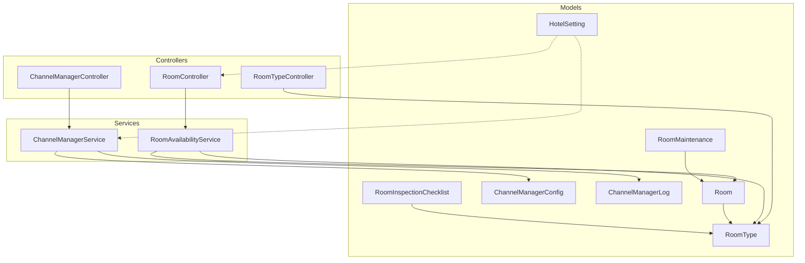
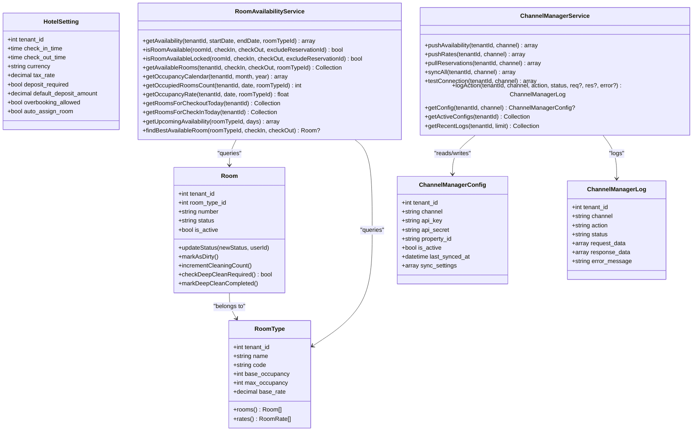
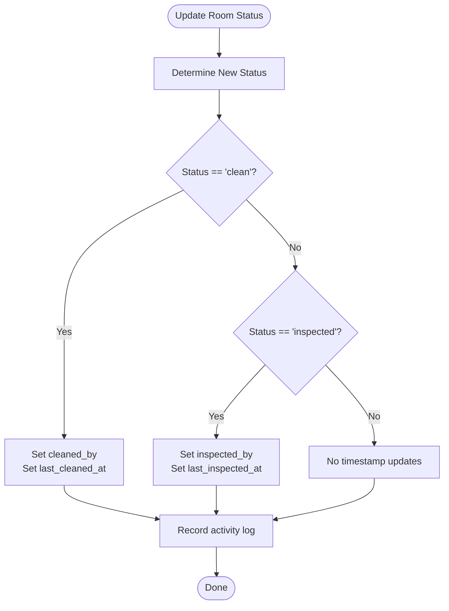
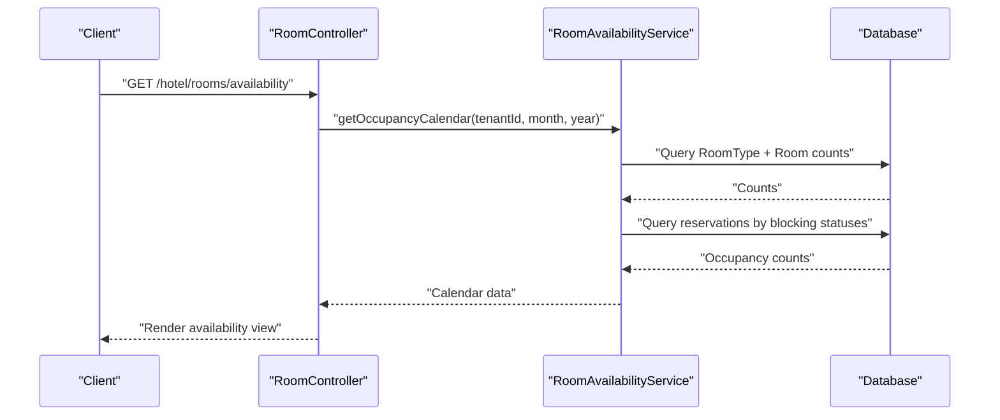
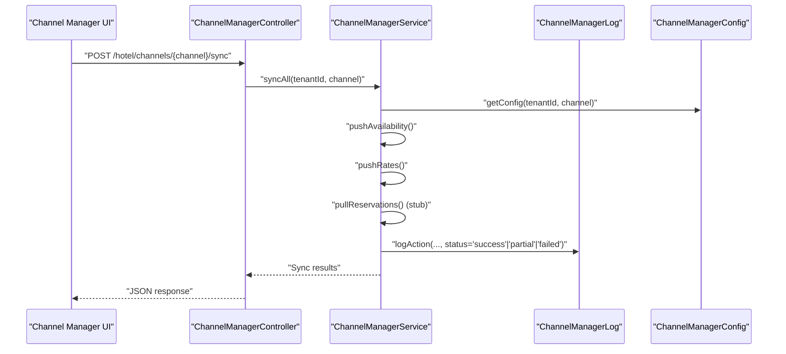
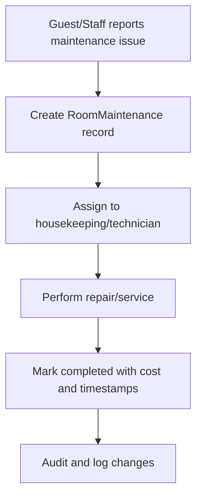
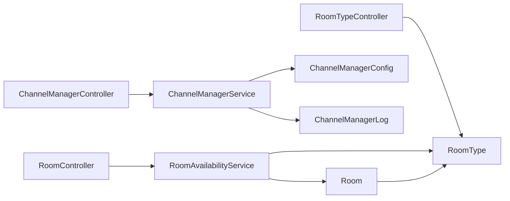

# Property Management System

<cite>
**Referenced Files in This Document**
- [Room.php](file://app/Models/Room.php)
- [RoomType.php](file://app/Models/RoomType.php)
- [HotelSetting.php](file://app/Models/HotelSetting.php)
- [RoomAvailabilityService.php](file://app/Services/RoomAvailabilityService.php)
- [ChannelManagerService.php](file://app/Services/ChannelManagerService.php)
- [ChannelManagerConfig.php](file://app/Models/ChannelManagerConfig.php)
- [ChannelManagerLog.php](file://app/Models/ChannelManagerLog.php)
- [ChannelManagerController.php](file://app/Http/Controllers/Hotel/ChannelManagerController.php)
- [RoomController.php](file://app/Http/Controllers/Hotel/RoomController.php)
- [RoomTypeController.php](file://app/Http/Controllers/Hotel/RoomTypeController.php)
- [RoomMaintenance.php](file://app/Models/RoomMaintenance.php)
- [RoomInspectionChecklist.php](file://app/Models/RoomInspectionChecklist.php)
- [2026_04_03_000001_create_hotel_tables.php](file://database/migrations/2026_04_03_000001_create_hotel_tables.php)
- [web.php](file://routes/web.php)
- [app.blade.php](file://resources/views/layouts/app.blade.php)
- [index.blade.php](file://resources/views/hotel/channels/index.blade.php)
- [configure.blade.php](file://resources/views/hotel/channels/configure.blade.php)
</cite>

## Table of Contents
1. [Introduction](#introduction)
2. [Project Structure](#project-structure)
3. [Core Components](#core-components)
4. [Architecture Overview](#architecture-overview)
5. [Detailed Component Analysis](#detailed-component-analysis)
6. [Dependency Analysis](#dependency-analysis)
7. [Performance Considerations](#performance-considerations)
8. [Troubleshooting Guide](#troubleshooting-guide)
9. [Conclusion](#conclusion)

## Introduction
This document describes the Property Management System with a focus on room inventory management, hotel settings, room availability algorithms, channel manager integrations, and operational workflows. It explains how rooms, room types, and reservations interact, how hotel-wide settings influence operations, and how inventory and rates synchronize across distribution channels. It also covers maintenance and inspection processes, upgrade/downgrade procedures, and rate parity enforcement.

## Project Structure
The system organizes hotel-related functionality under dedicated controllers, services, and models. Key areas include:
- Room inventory: Room and RoomType models with RoomController and RoomTypeController
- Availability engine: RoomAvailabilityService
- Hotel settings: HotelSetting model and related configuration
- Channel manager: ChannelManagerService, ChannelManagerConfig, ChannelManagerLog, ChannelManagerController
- Operational workflows: Room maintenance and inspection checklists
- UI navigation: Channels, Tariff & Distribution menu items

**Diagram sources**
- [RoomController.php:14-205](file://app/Http/Controllers/Hotel/RoomController.php#L14-L205)
- [RoomTypeController.php:11-113](file://app/Http/Controllers/Hotel/RoomTypeController.php#L11-L113)
- [ChannelManagerController.php:12-155](file://app/Http/Controllers/Hotel/ChannelManagerController.php#L12-L155)
- [RoomAvailabilityService.php:18-498](file://app/Services/RoomAvailabilityService.php#L18-L498)
- [ChannelManagerService.php:15-481](file://app/Services/ChannelManagerService.php#L15-L481)
- [Room.php:14-198](file://app/Models/Room.php#L14-L198)
- [RoomType.php:13-71](file://app/Models/RoomType.php#L13-L71)
- [HotelSetting.php:11-43](file://app/Models/HotelSetting.php#L11-L43)
- [ChannelManagerConfig.php:12-47](file://app/Models/ChannelManagerConfig.php#L12-L47)
- [ChannelManagerLog.php:12-49](file://app/Models/ChannelManagerLog.php#L12-L49)
- [RoomMaintenance.php:12-54](file://app/Models/RoomMaintenance.php#L12-L54)
- [RoomInspectionChecklist.php:12-147](file://app/Models/RoomInspectionChecklist.php#L12-L147)

**Section sources**
- [web.php:2161-2168](file://routes/web.php#L2161-L2168)
- [app.blade.php:1810-1853](file://resources/views/layouts/app.blade.php#L1810-L1853)

## Core Components
- Room inventory: Room and RoomType define physical rooms and room categories, including status, occupancy, and housekeeping metadata.
- Availability engine: RoomAvailabilityService computes availability, occupancy, and provides locking mechanisms to prevent race conditions.
- Hotel settings: HotelSetting centralizes operational parameters such as check-in/out times, currency, tax rate, deposit policy, overbooking allowance, and auto room assignment.
- Channel manager: ChannelManagerService orchestrates synchronization of availability and rates with external channels, with robust logging and configuration models.
- Maintenance and inspection: RoomMaintenance tracks maintenance requests and costs; RoomInspectionChecklist defines standardized inspection templates.

**Section sources**
- [Room.php:14-198](file://app/Models/Room.php#L14-L198)
- [RoomType.php:13-71](file://app/Models/RoomType.php#L13-L71)
- [RoomAvailabilityService.php:18-498](file://app/Services/RoomAvailabilityService.php#L18-L498)
- [HotelSetting.php:11-43](file://app/Models/HotelSetting.php#L11-L43)
- [ChannelManagerService.php:15-481](file://app/Services/ChannelManagerService.php#L15-L481)
- [ChannelManagerConfig.php:12-47](file://app/Models/ChannelManagerConfig.php#L12-L47)
- [ChannelManagerLog.php:12-49](file://app/Models/ChannelManagerLog.php#L12-L49)
- [RoomMaintenance.php:12-54](file://app/Models/RoomMaintenance.php#L12-L54)
- [RoomInspectionChecklist.php:12-147](file://app/Models/RoomInspectionChecklist.php#L12-L147)

## Architecture Overview
The system follows a layered architecture:
- Controllers handle HTTP requests and delegate to services.
- Services encapsulate business logic (availability checks, channel sync).
- Models represent domain entities and relationships.
- Migrations define the schema for hotel data, including rooms, room types, hotel settings, and channel manager artifacts.

**Diagram sources**
- [Room.php:14-198](file://app/Models/Room.php#L14-L198)
- [RoomType.php:13-71](file://app/Models/RoomType.php#L13-L71)
- [HotelSetting.php:11-43](file://app/Models/HotelSetting.php#L11-L43)
- [RoomAvailabilityService.php:18-498](file://app/Services/RoomAvailabilityService.php#L18-L498)
- [ChannelManagerService.php:15-481](file://app/Services/ChannelManagerService.php#L15-L481)
- [ChannelManagerConfig.php:12-47](file://app/Models/ChannelManagerConfig.php#L12-L47)
- [ChannelManagerLog.php:12-49](file://app/Models/ChannelManagerLog.php#L12-L49)

## Detailed Component Analysis

### Room Inventory Management
- Room lifecycle and status tracking:
  - Status transitions are logged and audited, with automatic updates for cleaning and inspection timestamps.
  - Dirty marking after checkout increments occupancy counters to trigger deep clean scheduling.
- Room categorization:
  - Rooms belong to RoomType with base/max occupancy and associated amenities.
- Filtering and scoping:
  - Scopes support availability filtering, floor, and type-based queries.

**Diagram sources**
- [Room.php:90-112](file://app/Models/Room.php#L90-L112)

**Section sources**
- [Room.php:14-198](file://app/Models/Room.php#L14-L198)
- [RoomType.php:13-71](file://app/Models/RoomType.php#L13-L71)
- [RoomController.php:168-203](file://app/Http/Controllers/Hotel/RoomController.php#L168-L203)

### Room Availability Algorithms and Blocking Mechanisms
- Blocking statuses:
  - Reservations in pending, confirmed, or checked_in states block room availability.
- Availability computation:
  - Computes daily totals, occupied, and available rooms per room type.
  - Supports calendar generation and occupancy rate calculations.
- Race condition prevention:
  - Provides locked variants of availability checks and room retrieval using database row-level locking.

**Diagram sources**
- [RoomController.php:151-166](file://app/Http/Controllers/Hotel/RoomController.php#L151-L166)
- [RoomAvailabilityService.php:284-341](file://app/Services/RoomAvailabilityService.php#L284-L341)

**Section sources**
- [RoomAvailabilityService.php:18-498](file://app/Services/RoomAvailabilityService.php#L18-L498)

### Hotel Settings Configuration and Operational Parameters
- Centralized hotel settings include:
  - Check-in/check-out times, currency, tax rate, deposit requirements, default deposit amount, overbooking allowance, and auto room assignment.
- These settings influence:
  - Front-desk operations, billing, and automated room assignment policies.

**Section sources**
- [HotelSetting.php:11-43](file://app/Models/HotelSetting.php#L11-L43)
- [2026_04_03_000001_create_hotel_tables.php:205-218](file://database/migrations/2026_04_03_000001_create_hotel_tables.php#L205-L218)

### Channel Manager Integration, Rate Parity, and Inventory Synchronization
- Supported channels:
  - Booking.com, Agoda, Expedia, Airbnb, TripAdvisor, Direct.
- Capabilities:
  - Push availability and rates to channels.
  - Pull reservations (stub with logging).
  - Full sync orchestration and connection testing.
- Configuration and logging:
  - ChannelManagerConfig stores credentials and sync settings.
  - ChannelManagerLog records actions, statuses, request/response payloads, and errors.
- UI and routing:
  - Routes expose index, logs, configure, and sync endpoints.
  - Blade views present channel cards, configuration forms, and recent logs.

**Diagram sources**
- [ChannelManagerController.php:91-115](file://app/Http/Controllers/Hotel/ChannelManagerController.php#L91-L115)
- [ChannelManagerService.php:246-293](file://app/Services/ChannelManagerService.php#L246-L293)
- [ChannelManagerLog.php:12-49](file://app/Models/ChannelManagerLog.php#L12-L49)
- [ChannelManagerConfig.php:12-47](file://app/Models/ChannelManagerConfig.php#L12-L47)
- [web.php:2161-2168](file://routes/web.php#L2161-L2168)
- [index.blade.php:1-90](file://resources/views/hotel/channels/index.blade.php#L1-L90)
- [configure.blade.php:143-165](file://resources/views/hotel/channels/configure.blade.php#L143-L165)

**Section sources**
- [ChannelManagerService.php:15-481](file://app/Services/ChannelManagerService.php#L15-L481)
- [ChannelManagerConfig.php:12-47](file://app/Models/ChannelManagerConfig.php#L12-L47)
- [ChannelManagerLog.php:12-49](file://app/Models/ChannelManagerLog.php#L12-L49)
- [ChannelManagerController.php:12-155](file://app/Http/Controllers/Hotel/ChannelManagerController.php#L12-L155)
- [web.php:2161-2168](file://routes/web.php#L2161-L2168)
- [index.blade.php:1-90](file://resources/views/hotel/channels/index.blade.php#L1-L90)
- [configure.blade.php:143-165](file://resources/views/hotel/channels/configure.blade.php#L143-L165)

### Room Maintenance Workflows and Inspection Processes
- Maintenance:
  - RoomMaintenance captures reported issues, priorities, start/end times, and costs, linked to rooms and reporters.
- Inspections:
  - RoomInspectionChecklist defines structured checklists per room type with default templates and hierarchical items.

**Diagram sources**
- [RoomMaintenance.php:12-54](file://app/Models/RoomMaintenance.php#L12-L54)

**Section sources**
- [RoomMaintenance.php:12-54](file://app/Models/RoomMaintenance.php#L12-L54)
- [RoomInspectionChecklist.php:12-147](file://app/Models/RoomInspectionChecklist.php#L12-L147)

### Room Upgrade/Downgrade Procedures
- Room upgrades/downgrades are managed by assigning a guest to a different room type during a reservation lifecycle.
- Room availability checks ensure the target room is available for the requested dates.
- Auto room assignment can be toggled via hotel settings.

**Section sources**
- [RoomAvailabilityService.php:104-142](file://app/Services/RoomAvailabilityService.php#L104-L142)
- [HotelSetting.php:11-43](file://app/Models/HotelSetting.php#L11-L43)

## Dependency Analysis
- Controllers depend on services for business logic and on models for persistence.
- Services encapsulate complex queries and cross-entity computations.
- Models define relationships and scopes to support efficient filtering and reporting.
- Channel manager service depends on configuration and logging models to maintain auditability and operational visibility.

**Diagram sources**
- [RoomController.php:14-205](file://app/Http/Controllers/Hotel/RoomController.php#L14-L205)
- [RoomTypeController.php:11-113](file://app/Http/Controllers/Hotel/RoomTypeController.php#L11-L113)
- [ChannelManagerController.php:12-155](file://app/Http/Controllers/Hotel/ChannelManagerController.php#L12-L155)
- [RoomAvailabilityService.php:18-498](file://app/Services/RoomAvailabilityService.php#L18-L498)
- [ChannelManagerService.php:15-481](file://app/Services/ChannelManagerService.php#L15-L481)
- [Room.php:14-198](file://app/Models/Room.php#L14-L198)
- [RoomType.php:13-71](file://app/Models/RoomType.php#L13-L71)
- [ChannelManagerConfig.php:12-47](file://app/Models/ChannelManagerConfig.php#L12-L47)
- [ChannelManagerLog.php:12-49](file://app/Models/ChannelManagerLog.php#L12-L49)

**Section sources**
- [RoomController.php:14-205](file://app/Http/Controllers/Hotel/RoomController.php#L14-L205)
- [RoomTypeController.php:11-113](file://app/Http/Controllers/Hotel/RoomTypeController.php#L11-L113)
- [ChannelManagerController.php:12-155](file://app/Http/Controllers/Hotel/ChannelManagerController.php#L12-L155)
- [RoomAvailabilityService.php:18-498](file://app/Services/RoomAvailabilityService.php#L18-L498)
- [ChannelManagerService.php:15-481](file://app/Services/ChannelManagerService.php#L15-L481)

## Performance Considerations
- Use the locked availability methods within database transactions to avoid race conditions during booking.
- Prefer scoped queries (by tenant, type, floor) to reduce dataset sizes.
- Cache frequently accessed room type and hotel setting data where appropriate.
- Limit pagination sizes for large datasets (e.g., logs, rooms).
- Indexes on tenant_id, status, and date ranges improve query performance.

## Troubleshooting Guide
- Channel sync failures:
  - Review ChannelManagerLog entries for failed actions, request/response payloads, and error messages.
  - Verify ChannelManagerConfig credentials and activation status.
- Availability discrepancies:
  - Confirm blocking statuses and date overlap logic.
  - Use locked availability checks in transactional contexts.
- Room status anomalies:
  - Check activity logs for status change events.
  - Validate housekeeping counters and deep clean triggers.

**Section sources**
- [ChannelManagerLog.php:12-49](file://app/Models/ChannelManagerLog.php#L12-L49)
- [ChannelManagerController.php:117-153](file://app/Http/Controllers/Hotel/ChannelManagerController.php#L117-L153)
- [RoomAvailabilityService.php:155-197](file://app/Services/RoomAvailabilityService.php#L155-L197)
- [Room.php:90-112](file://app/Models/Room.php#L90-L112)

## Conclusion
The Property Management System provides a robust foundation for managing room inventory, enforcing operational parameters via hotel settings, and synchronizing inventory and rates across distribution channels. The RoomAvailabilityService ensures accurate availability and safe concurrent booking, while the ChannelManagerService offers extensible integration points. Maintenance and inspection workflows support ongoing property quality and compliance.