# Reservation Management System

<cite>
**Referenced Files in This Document**
- [Reservation.php](file://app/Models/Reservation.php)
- [ReservationService.php](file://app/Services/ReservationService.php)
- [ReservationController.php](file://app/Http/Controllers/Hotel/ReservationController.php)
- [WalkInReservation.php](file://app/Models/WalkInReservation.php)
- [WalkInReservationController.php](file://app/Http/Controllers/Hotel/WalkInReservationController.php)
- [GroupBooking.php](file://app/Models/GroupBooking.php)
- [GroupBookingService.php](file://app/Services/GroupBookingService.php)
- [GroupBookingController.php](file://app/Http/Controllers/Hotel/GroupBookingController.php)
- [ChannelManagerService.php](file://app/Services/ChannelManagerService.php)
- [DynamicPricingEngine.php](file://app/Services/DynamicPricingEngine.php)
- [RateOptimizationService.php](file://app/Services/RateOptimizationService.php)
- [RevenueManagementController.php](file://app/Http/Controllers/Hotel/RevenueManagementController.php)
- [Payment.php](file://app/Models/Payment.php)
- [DownPayment.php](file://app/Models/DownPayment.php)
- [PaymentGatewayService.php](file://app/Services/PaymentGatewayService.php)
- [HotelSetting.php](file://app/Models/HotelSetting.php)
- [2026_04_03_100000_create_front_office_tables.php](file://database/migrations/2026_04_03_100000_create_front_office_tables.php)
</cite>

## Table of Contents
1. [Introduction](#introduction)
2. [Project Structure](#project-structure)
3. [Core Components](#core-components)
4. [Architecture Overview](#architecture-overview)
5. [Detailed Component Analysis](#detailed-component-analysis)
6. [Dependency Analysis](#dependency-analysis)
7. [Performance Considerations](#performance-considerations)
8. [Troubleshooting Guide](#troubleshooting-guide)
9. [Conclusion](#conclusion)

## Introduction
This document describes the Reservation Management System within the qalcuityERP platform. It covers end-to-end reservation workflows including online booking creation, walk-in guest processing, group and corporate bookings, and reservation lifecycle management (status tracking, modifications, cancellations, and refunds). It also documents channel manager integration for OTA synchronization, rate parity enforcement, inventory blocking, analytics and revenue optimization through dynamic pricing, and integration with payment systems including deposit management and advance booking requirements.

## Project Structure
The reservation system is organized around Laravel models, services, controllers, and supporting components:

- Models define domain entities such as reservations, walk-in records, group bookings, payments, and down payments.
- Services encapsulate business logic for reservations, availability, pricing, channel synchronization, and revenue optimization.
- Controllers manage HTTP requests for reservation CRUD, walk-in processing, group booking management, and revenue dashboards.
- Migrations define the database schema for front office entities including reservations, walk-ins, and group bookings.

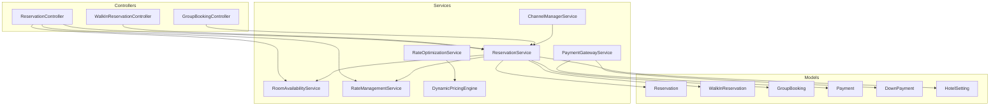

**Diagram sources**
- [ReservationController.php:17-28](file://app/Http/Controllers/Hotel/ReservationController.php#L17-L28)
- [ReservationService.php:18-24](file://app/Services/ReservationService.php#L18-L24)
- [ChannelManagerService.php:15-27](file://app/Services/ChannelManagerService.php#L15-L27)
- [DynamicPricingEngine.php:26-34](file://app/Services/DynamicPricingEngine.php#L26-L34)
- [RateOptimizationService.php:26-37](file://app/Services/RateOptimizationService.php#L26-L37)
- [PaymentGatewayService.php:13-26](file://app/Services/PaymentGatewayService.php#L13-L26)
- [Reservation.php:15-16](file://app/Models/Reservation.php#L15-L16)
- [WalkInReservation.php:12-13](file://app/Models/WalkInReservation.php#L12-L13)
- [GroupBooking.php:13-14](file://app/Models/GroupBooking.php#L13-L14)
- [Payment.php:12-13](file://app/Models/Payment.php#L12-L13)
- [DownPayment.php:13-14](file://app/Models/DownPayment.php#L13-L14)
- [HotelSetting.php:11-12](file://app/Models/HotelSetting.php#L11-L12)

**Section sources**
- [ReservationController.php:17-28](file://app/Http/Controllers/Hotel/ReservationController.php#L17-L28)
- [ReservationService.php:18-24](file://app/Services/ReservationService.php#L18-L24)
- [ChannelManagerService.php:15-27](file://app/Services/ChannelManagerService.php#L15-L27)
- [DynamicPricingEngine.php:26-34](file://app/Services/DynamicPricingEngine.php#L26-L34)
- [RateOptimizationService.php:26-37](file://app/Services/RateOptimizationService.php#L26-L37)
- [PaymentGatewayService.php:13-26](file://app/Services/PaymentGatewayService.php#L13-L26)
- [Reservation.php:15-16](file://app/Models/Reservation.php#L15-L16)
- [WalkInReservation.php:12-13](file://app/Models/WalkInReservation.php#L12-L13)
- [GroupBooking.php:13-14](file://app/Models/GroupBooking.php#L13-L14)
- [Payment.php:12-13](file://app/Models/Payment.php#L12-L13)
- [DownPayment.php:13-14](file://app/Models/DownPayment.php#L13-L14)
- [HotelSetting.php:11-12](file://app/Models/HotelSetting.php#L11-L12)

## Core Components
This section outlines the primary building blocks of the reservation system and their responsibilities.

- Reservation model: central entity storing reservation metadata, guest associations, room assignments, pricing, taxes, and lifecycle timestamps.
- ReservationService: orchestrates creation, confirmation, updates, cancellations, room assignment, rate calculations, and special requests (early check-in/late check-out).
- WalkInReservation model and controller: handles walk-in guest arrivals, arrival time recording, and source attribution.
- GroupBooking model and service/controller: manages group bookings, group codes, organizer guests, benefits, and payment tracking.
- ChannelManagerService: provides stubbed integration points for OTA synchronization (availability, rates, reservations).
- DynamicPricingEngine and RateOptimizationService: compute optimal rates considering occupancy, events, day-of-week, length of stay, advance booking, and dynamic rules.
- PaymentGatewayService: integrates with multiple payment providers for QRIS payments, status checks, and webhook processing.
- HotelSetting: stores operational settings such as tax rate, deposit requirements, overbooking allowance, and check-in/out times.

**Section sources**
- [Reservation.php:15-160](file://app/Models/Reservation.php#L15-L160)
- [ReservationService.php:34-140](file://app/Services/ReservationService.php#L34-L140)
- [WalkInReservation.php:12-98](file://app/Models/WalkInReservation.php#L12-L98)
- [GroupBooking.php:13-129](file://app/Models/GroupBooking.php#L13-L129)
- [ChannelManagerService.php:15-298](file://app/Services/ChannelManagerService.php#L15-L298)
- [DynamicPricingEngine.php:26-426](file://app/Services/DynamicPricingEngine.php#L26-L426)
- [RateOptimizationService.php:26-458](file://app/Services/RateOptimizationService.php#L26-L458)
- [PaymentGatewayService.php:13-637](file://app/Services/PaymentGatewayService.php#L13-L637)
- [HotelSetting.php:11-43](file://app/Models/HotelSetting.php#L11-L43)

## Architecture Overview
The system follows a layered architecture:
- Presentation layer: Controllers handle HTTP requests and delegate to services.
- Application layer: Services encapsulate business logic and coordinate model operations.
- Domain layer: Models represent entities and relationships.
- Infrastructure layer: Services integrate with external systems (payment gateways, OTAs).

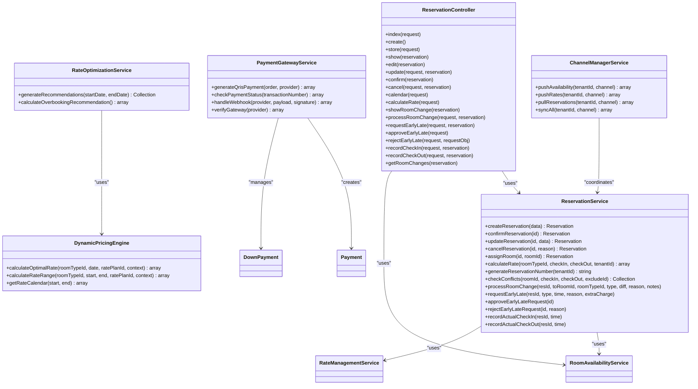

**Diagram sources**
- [ReservationController.php:17-523](file://app/Http/Controllers/Hotel/ReservationController.php#L17-L523)
- [ReservationService.php:18-750](file://app/Services/ReservationService.php#L18-L750)
- [ChannelManagerService.php:15-298](file://app/Services/ChannelManagerService.php#L15-L298)
- [DynamicPricingEngine.php:26-426](file://app/Services/DynamicPricingEngine.php#L26-L426)
- [RateOptimizationService.php:26-458](file://app/Services/RateOptimizationService.php#L26-L458)
- [PaymentGatewayService.php:13-637](file://app/Services/PaymentGatewayService.php#L13-L637)

## Detailed Component Analysis

### Reservation Creation and Lifecycle
Reservation creation validates room availability with pessimistic locking, calculates nightly and total rates, applies discounts and taxes, and generates a unique reservation number. Confirmation transitions status to confirmed, while cancellations enforce business rules (no cancellation after check-in) and free up room assignments. Updates recalculate rates when dates change and maintain tax consistency.

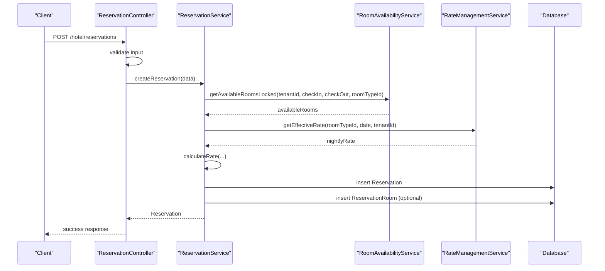

**Diagram sources**
- [ReservationController.php:90-141](file://app/Http/Controllers/Hotel/ReservationController.php#L90-L141)
- [ReservationService.php:34-140](file://app/Services/ReservationService.php#L34-L140)

**Section sources**
- [ReservationService.php:34-140](file://app/Services/ReservationService.php#L34-L140)
- [ReservationController.php:90-141](file://app/Http/Controllers/Hotel/ReservationController.php#L90-L141)

### Walk-In Guest Processing
Walk-in guests are processed through a dedicated controller and model. The system generates a unique walk-in number, records arrival time, associates with the reservation, and tracks source and handler. Filtering supports date ranges and source channels.

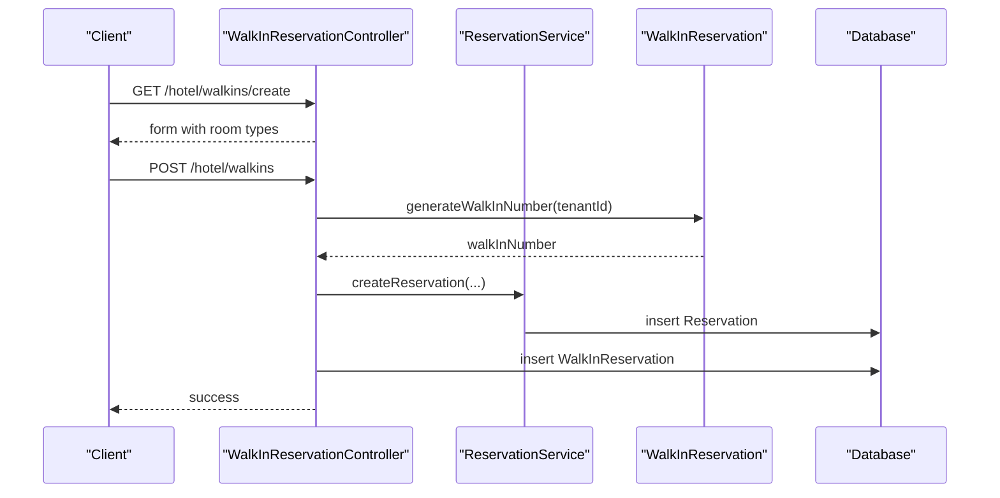

**Diagram sources**
- [WalkInReservationController.php:66-86](file://app/Http/Controllers/Hotel/WalkInReservationController.php#L66-L86)
- [WalkInReservation.php:60-71](file://app/Models/WalkInReservation.php#L60-L71)
- [ReservationService.php:34-140](file://app/Services/ReservationService.php#L34-L140)

**Section sources**
- [WalkInReservationController.php:37-86](file://app/Http/Controllers/Hotel/WalkInReservationController.php#L37-L86)
- [WalkInReservation.php:12-98](file://app/Models/WalkInReservation.php#L12-L98)
- [ReservationService.php:34-140](file://app/Services/ReservationService.php#L34-L140)

### Group Booking Management
Group bookings support organizers, group codes, types (corporate, family, tour, etc.), and payment tracking. The service creates group bookings within transactions, ensuring atomicity. Group benefits can be added dynamically.

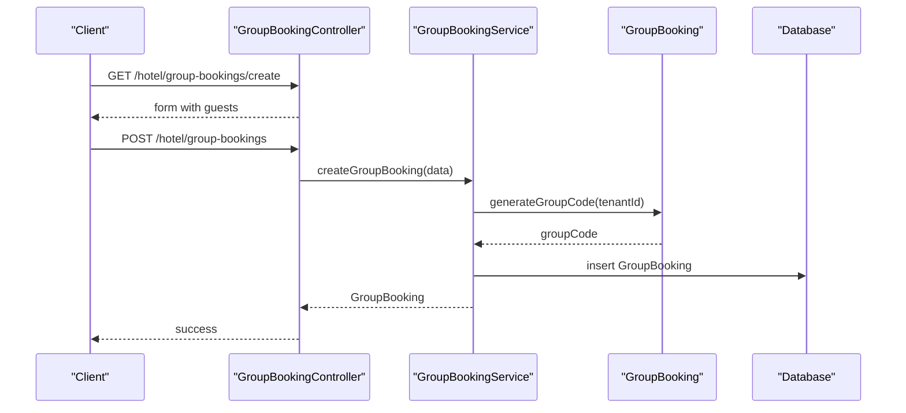

**Diagram sources**
- [GroupBookingController.php:65-88](file://app/Http/Controllers/Hotel/GroupBookingController.php#L65-L88)
- [GroupBookingService.php:20-37](file://app/Services/GroupBookingService.php#L20-L37)
- [GroupBooking.php:73-82](file://app/Models/GroupBooking.php#L73-L82)

**Section sources**
- [GroupBookingController.php:50-88](file://app/Http/Controllers/Hotel/GroupBookingController.php#L50-L88)
- [GroupBookingService.php:15-37](file://app/Services/GroupBookingService.php#L15-L37)
- [GroupBooking.php:13-129](file://app/Models/GroupBooking.php#L13-L129)

### Corporate Booking Systems
Corporate bookings are modeled as group bookings with type "corporate". The system supports organizer identification, group codes, total rooms/guests, amounts, and payment statuses. Group benefits can be associated for negotiated rates or packages.

**Section sources**
- [GroupBooking.php:18-35](file://app/Models/GroupBooking.php#L18-L35)
- [GroupBookingService.php:20-37](file://app/Services/GroupBookingService.php#L20-L37)

### Reservation Status Tracking and Modifications
Status tracking is enforced through service methods for confirmation, cancellation, and room changes. Room upgrades/downgrades adjust nightly rates and totals, while early/late requests capture extra charges and update actual check-in/out times.

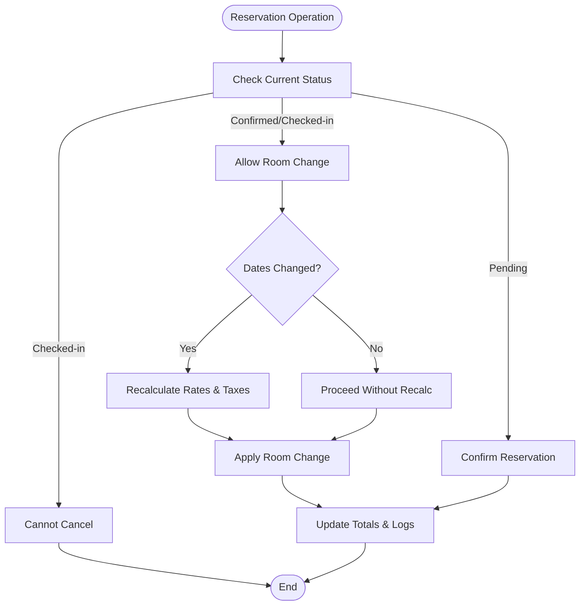

**Diagram sources**
- [ReservationService.php:148-206](file://app/Services/ReservationService.php#L148-L206)
- [ReservationService.php:383-437](file://app/Services/ReservationService.php#L383-L437)
- [ReservationService.php:514-585](file://app/Services/ReservationService.php#L514-L585)

**Section sources**
- [ReservationService.php:148-206](file://app/Services/ReservationService.php#L148-L206)
- [ReservationService.php:383-437](file://app/Services/ReservationService.php#L383-L437)
- [ReservationService.php:514-585](file://app/Services/ReservationService.php#L514-L585)

### Cancellation Policies and Refund Processing
Cancellation enforces business rules: reservations already checked-in cannot be canceled, already-canceled reservations are rejected, and room assignments are freed. Refunds are integrated via the payment system; the payment gateway service handles status updates and webhook processing.

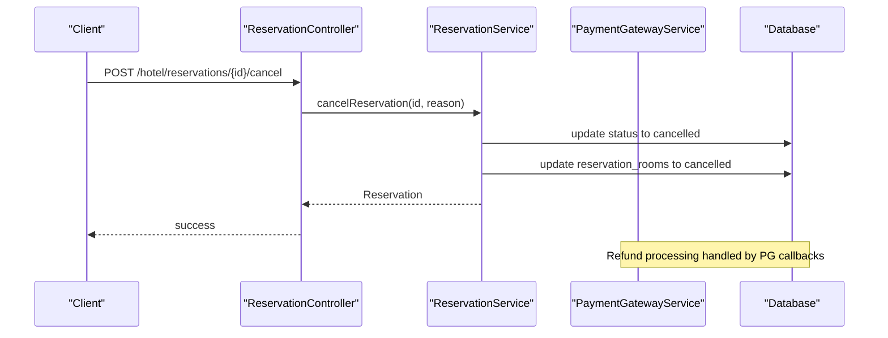

**Diagram sources**
- [ReservationController.php:215-232](file://app/Http/Controllers/Hotel/ReservationController.php#L215-L232)
- [ReservationService.php:174-206](file://app/Services/ReservationService.php#L174-L206)
- [PaymentGatewayService.php:166-217](file://app/Services/PaymentGatewayService.php#L166-L217)

**Section sources**
- [ReservationController.php:215-232](file://app/Http/Controllers/Hotel/ReservationController.php#L215-L232)
- [ReservationService.php:174-206](file://app/Services/ReservationService.php#L174-L206)
- [PaymentGatewayService.php:166-217](file://app/Services/PaymentGatewayService.php#L166-L217)

### Channel Manager Integration for OTA Synchronization
The ChannelManagerService provides standardized methods for pushing availability, rates, pulling reservations, and full sync operations. It includes stubbed implementations with logging and returns structured results for each operation.

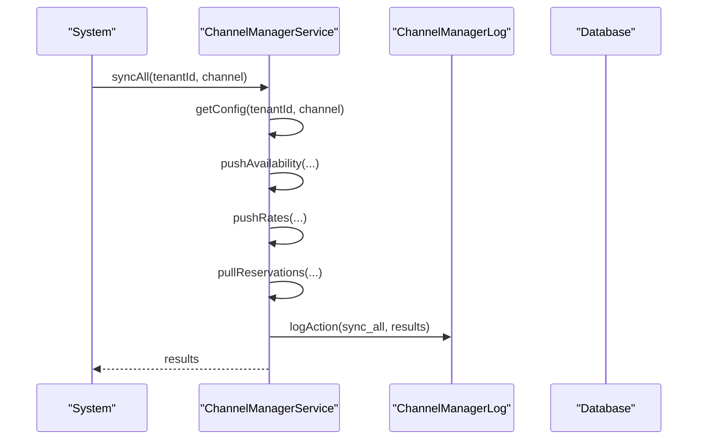

**Diagram sources**
- [ChannelManagerService.php:246-293](file://app/Services/ChannelManagerService.php#L246-L293)
- [ChannelManagerService.php:38-57](file://app/Services/ChannelManagerService.php#L38-L57)
- [ChannelManagerService.php:109-141](file://app/Services/ChannelManagerService.php#L109-L141)

**Section sources**
- [ChannelManagerService.php:15-298](file://app/Services/ChannelManagerService.php#L15-L298)

### Rate Parity Enforcement and Inventory Blocking
Rate parity is enforced through the DynamicPricingEngine, which computes optimal rates considering occupancy forecasts, competitor rates, events, day-of-week, length of stay, and advance booking windows. Inventory blocking occurs during reservation creation via locked availability checks to prevent overbooking.

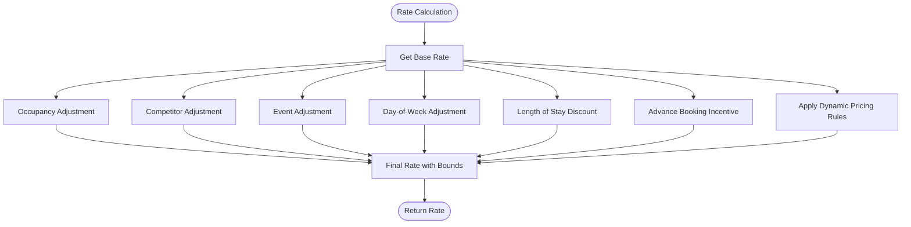

**Diagram sources**
- [DynamicPricingEngine.php:39-147](file://app/Services/DynamicPricingEngine.php#L39-L147)
- [DynamicPricingEngine.php:173-196](file://app/Services/DynamicPricingEngine.php#L173-L196)
- [DynamicPricingEngine.php:201-227](file://app/Services/DynamicPricingEngine.php#L201-L227)
- [DynamicPricingEngine.php:232-251](file://app/Services/DynamicPricingEngine.php#L232-L251)
- [DynamicPricingEngine.php:256-267](file://app/Services/DynamicPricingEngine.php#L256-L267)
- [DynamicPricingEngine.php:272-281](file://app/Services/DynamicPricingEngine.php#L272-L281)
- [DynamicPricingEngine.php:286-297](file://app/Services/DynamicPricingEngine.php#L286-L297)
- [DynamicPricingEngine.php:302-333](file://app/Services/DynamicPricingEngine.php#L302-L333)
- [DynamicPricingEngine.php:338-349](file://app/Services/DynamicPricingEngine.php#L338-L349)

**Section sources**
- [DynamicPricingEngine.php:26-426](file://app/Services/DynamicPricingEngine.php#L26-L426)

### Reservation Analytics, Booking Trends, and Revenue Optimization
The RateOptimizationService generates pricing recommendations across room types, analyzes cancellation rates for overbooking recommendations, and suggests channel mix targets. The RevenueManagementController aggregates KPIs and dashboards for revenue insights.

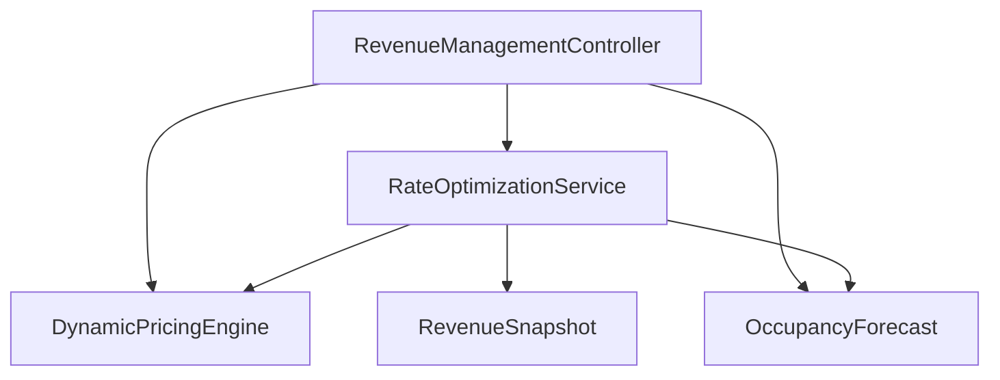

**Diagram sources**
- [RateOptimizationService.php:26-458](file://app/Services/RateOptimizationService.php#L26-L458)
- [RevenueManagementController.php:22-43](file://app/Http/Controllers/Hotel/RevenueManagementController.php#L22-L43)

**Section sources**
- [RateOptimizationService.php:42-432](file://app/Services/RateOptimizationService.php#L42-L432)
- [RevenueManagementController.php:33-43](file://app/Http/Controllers/Hotel/RevenueManagementController.php#L33-L43)

### Payment Systems, Deposit Management, and Advance Booking Requirements
Payment processing is handled by the PaymentGatewayService, which supports QRIS payments, status checks, and webhooks for multiple providers. Deposits are modeled by DownPayment and Payment entities, with HotelSetting controlling defaults such as deposit requirement and overbooking allowance.

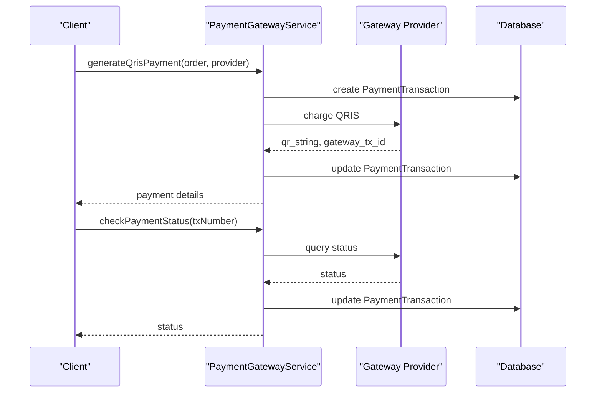

**Diagram sources**
- [PaymentGatewayService.php:31-104](file://app/Services/PaymentGatewayService.php#L31-L104)
- [PaymentGatewayService.php:109-161](file://app/Services/PaymentGatewayService.php#L109-L161)

**Section sources**
- [PaymentGatewayService.php:13-637](file://app/Services/PaymentGatewayService.php#L13-L637)
- [DownPayment.php:13-72](file://app/Models/DownPayment.php#L13-L72)
- [Payment.php:12-49](file://app/Models/Payment.php#L12-L49)
- [HotelSetting.php:15-36](file://app/Models/HotelSetting.php#L15-L36)

## Dependency Analysis
The reservation system exhibits clear separation of concerns:
- Controllers depend on services for business logic.
- Services depend on models for persistence and on other services for specialized operations.
- Models encapsulate relationships and validations.
- External integrations are isolated in dedicated services (ChannelManagerService, PaymentGatewayService).

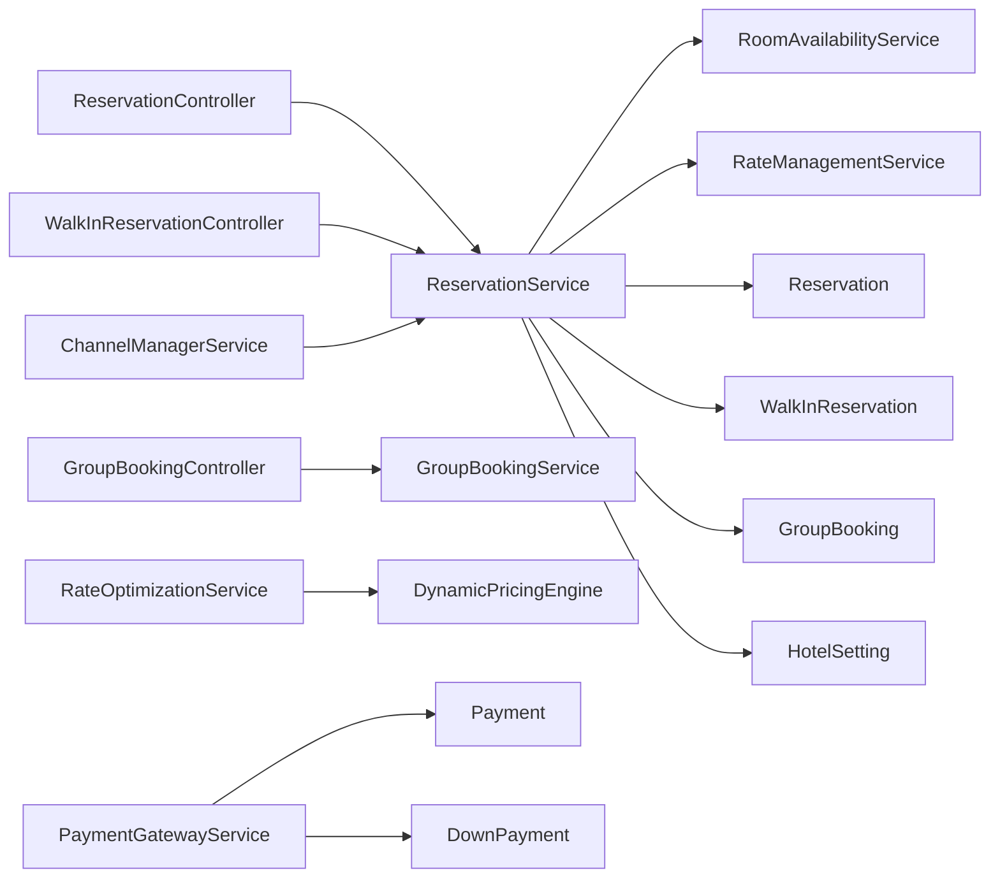

**Diagram sources**
- [ReservationController.php:17-28](file://app/Http/Controllers/Hotel/ReservationController.php#L17-L28)
- [ReservationService.php:18-24](file://app/Services/ReservationService.php#L18-L24)
- [WalkInReservationController.php:16-27](file://app/Http/Controllers/Hotel/WalkInReservationController.php#L16-L27)
- [GroupBookingController.php:50-88](file://app/Http/Controllers/Hotel/GroupBookingController.php#L50-L88)
- [GroupBookingService.php:15-37](file://app/Services/GroupBookingService.php#L15-L37)
- [ChannelManagerService.php:15-27](file://app/Services/ChannelManagerService.php#L15-L27)
- [RateOptimizationService.php:26-37](file://app/Services/RateOptimizationService.php#L26-L37)
- [DynamicPricingEngine.php:26-34](file://app/Services/DynamicPricingEngine.php#L26-L34)
- [PaymentGatewayService.php:13-26](file://app/Services/PaymentGatewayService.php#L13-L26)
- [Reservation.php:15-16](file://app/Models/Reservation.php#L15-L16)
- [WalkInReservation.php:12-13](file://app/Models/WalkInReservation.php#L12-L13)
- [GroupBooking.php:13-14](file://app/Models/GroupBooking.php#L13-L14)
- [Payment.php:12-13](file://app/Models/Payment.php#L12-L13)
- [DownPayment.php:13-14](file://app/Models/DownPayment.php#L13-L14)
- [HotelSetting.php:11-12](file://app/Models/HotelSetting.php#L11-L12)

**Section sources**
- [ReservationController.php:17-28](file://app/Http/Controllers/Hotel/ReservationController.php#L17-L28)
- [ReservationService.php:18-24](file://app/Services/ReservationService.php#L18-L24)
- [ChannelManagerService.php:15-27](file://app/Services/ChannelManagerService.php#L15-L27)
- [DynamicPricingEngine.php:26-34](file://app/Services/DynamicPricingEngine.php#L26-L34)
- [RateOptimizationService.php:26-37](file://app/Services/RateOptimizationService.php#L26-L37)
- [PaymentGatewayService.php:13-26](file://app/Services/PaymentGatewayService.php#L13-L26)
- [Reservation.php:15-16](file://app/Models/Reservation.php#L15-L16)
- [WalkInReservation.php:12-13](file://app/Models/WalkInReservation.php#L12-L13)
- [GroupBooking.php:13-14](file://app/Models/GroupBooking.php#L13-L14)
- [Payment.php:12-13](file://app/Models/Payment.php#L12-L13)
- [DownPayment.php:13-14](file://app/Models/DownPayment.php#L13-L14)
- [HotelSetting.php:11-12](file://app/Models/HotelSetting.php#L11-L12)

## Performance Considerations
- Availability locking prevents race conditions during reservation creation, reducing conflicts and rejections.
- Rate calculations iterate per night; caching or batch computation could improve performance for bulk operations.
- Webhook processing should be idempotent and logged to avoid duplicate actions.
- Pagination is used in listing endpoints to limit memory usage.

## Troubleshooting Guide
Common issues and resolutions:
- Availability conflicts: Use the conflict detection method to identify overlapping reservations and resolve accordingly.
- Cancellation errors: Ensure the reservation is not already checked-in; check current status before attempting cancellation.
- Payment webhook verification: Validate signatures using the configured webhook secret to prevent tampering.
- Channel sync failures: Review logs for specific channel errors and retry operations as needed.

**Section sources**
- [ReservationService.php:283-313](file://app/Services/ReservationService.php#L283-L313)
- [ReservationService.php:174-206](file://app/Services/ReservationService.php#L174-L206)
- [PaymentGatewayService.php:622-635](file://app/Services/PaymentGatewayService.php#L622-L635)
- [ChannelManagerService.php:223-236](file://app/Services/ChannelManagerService.php#L223-L236)

## Conclusion
The Reservation Management System provides a robust foundation for managing reservations, walk-ins, groups, and corporate bookings. It integrates with channel managers and payment providers, enforces rate parity and inventory controls, and offers analytics and revenue optimization capabilities. The modular architecture ensures maintainability and extensibility for future enhancements.