# Revenue Management & Analytics

<cite>
**Referenced Files in This Document**
- [RevenueManagementController.php](file://app/Http/Controllers/Hotel/RevenueManagementController.php)
- [DynamicPricingEngine.php](file://app/Services/DynamicPricingEngine.php)
- [OccupancyForecastingService.php](file://app/Services/OccupancyForecastingService.php)
- [RateOptimizationService.php](file://app/Services/RateOptimizationService.php)
- [CompetitorRateTrackingService.php](file://app/Services/CompetitorRateTrackingService.php)
- [AdvancedAnalyticsService.php](file://app/Services/AdvancedAnalyticsService.php)
- [ChannelManagerService.php](file://app/Services/ChannelManagerService.php)
- [DynamicPricingRule.php](file://app/Models/DynamicPricingRule.php)
- [OccupancyForecast.php](file://app/Models/OccupancyForecast.php)
- [CompetitorRate.php](file://app/Models/CompetitorRate.php)
- [RevenueSnapshot.php](file://app/Models/RevenueSnapshot.php)
- [ChannelSalesPerformance.php](file://app/Models/ChannelSalesPerformance.php)
- [DistributionChannel.php](file://app/Models/DistributionChannel.php)
- [2026_04_07_200000_create_distribution_channels_tables.php](file://database/migrations/2026_04_07_200000_create_distribution_channels_tables.php)
- [dashboard.blade.php](file://resources/views/hotel/revenue/dashboard.blade.php)
- [competitor-rates.blade.php](file://resources/views/hotel/revenue/competitor-rates.blade.php)
- [AdvancedAnalyticsDashboardController.php](file://app/Http/Controllers/Analytics/AdvancedAnalyticsDashboardController.php)
</cite>

## Table of Contents
1. [Introduction](#introduction)
2. [Project Structure](#project-structure)
3. [Core Components](#core-components)
4. [Architecture Overview](#architecture-overview)
5. [Detailed Component Analysis](#detailed-component-analysis)
6. [Dependency Analysis](#dependency-analysis)
7. [Performance Considerations](#performance-considerations)
8. [Troubleshooting Guide](#troubleshooting-guide)
9. [Conclusion](#conclusion)
10. [Appendices](#appendices)

## Introduction
This document provides comprehensive coverage of Revenue Management and Analytics capabilities within the system. It explains dynamic pricing algorithms, occupancy forecasting models, and competitive rate tracking systems. It also documents revenue optimization strategies, demand forecasting, pricing elasticity analysis, analytics dashboards, performance metrics, profitability tracking, market segmentation analysis, booking channel optimization, revenue distribution management, distribution channel integrations, rate parity enforcement, and revenue reporting systems. Advanced analytics for forecasting and optimization recommendations are included to support data-driven decision-making.

## Project Structure
The revenue management and analytics functionality spans controllers, services, models, views, and database migrations. The primary entry point for hotel revenue management is the Revenue Management Controller, which orchestrates dynamic pricing, forecasting, and competitive tracking. Supporting services encapsulate pricing engines, forecasting logic, optimization strategies, and channel integrations. Models represent domain entities such as pricing rules, forecasts, competitor rates, revenue snapshots, and distribution channels. Views render dashboards and reports. Migrations define the schema for distribution channels and related analytics tables.

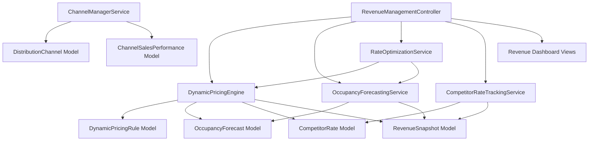

**Diagram sources**
- [RevenueManagementController.php:22-512](file://app/Http/Controllers/Hotel/RevenueManagementController.php#L22-L512)
- [DynamicPricingEngine.php:26-426](file://app/Services/DynamicPricingEngine.php#L26-L426)
- [OccupancyForecastingService.php:26-463](file://app/Services/OccupancyForecastingService.php#L26-L463)
- [RateOptimizationService.php:26-426](file://app/Services/RateOptimizationService.php#L26-L426)
- [CompetitorRateTrackingService.php:22-487](file://app/Services/CompetitorRateTrackingService.php#L22-L487)
- [DynamicPricingRule.php:10-44](file://app/Models/DynamicPricingRule.php#L10-L44)
- [OccupancyForecast.php:12-79](file://app/Models/OccupancyForecast.php#L12-L79)
- [CompetitorRate.php:12-74](file://app/Models/CompetitorRate.php#L12-L74)
- [RevenueSnapshot.php:12-132](file://app/Models/RevenueSnapshot.php#L12-L132)
- [ChannelManagerService.php:15-481](file://app/Services/ChannelManagerService.php#L15-L481)
- [DistributionChannel.php:12-95](file://app/Models/DistributionChannel.php#L12-L95)
- [ChannelSalesPerformance.php:11-95](file://app/Models/ChannelSalesPerformance.php#L11-L95)

**Section sources**
- [RevenueManagementController.php:22-512](file://app/Http/Controllers/Hotel/RevenueManagementController.php#L22-L512)
- [DynamicPricingEngine.php:26-426](file://app/Services/DynamicPricingEngine.php#L26-L426)
- [OccupancyForecastingService.php:26-463](file://app/Services/OccupancyForecastingService.php#L26-L463)
- [RateOptimizationService.php:26-426](file://app/Services/RateOptimizationService.php#L26-L426)
- [CompetitorRateTrackingService.php:22-487](file://app/Services/CompetitorRateTrackingService.php#L22-L487)
- [ChannelManagerService.php:15-481](file://app/Services/ChannelManagerService.php#L15-L481)

## Core Components
- Dynamic Pricing Engine: Calculates optimal rates considering occupancy, competitor rates, events, day-of-week, length-of-stay, and advance booking factors. Supports rule-based adjustments and rate bounds.
- Occupancy Forecasting Service: Predicts future occupancy using historical data, booking pace, event impacts, and seasonal factors, generating confidence levels and derived metrics.
- Rate Optimization Service: Implements yield optimization, length-of-stay restrictions, overbooking recommendations, and channel mix optimization with profitability analysis.
- Competitor Rate Tracking Service: Manages manual and automated competitor rate recording, trend analysis, comparative positioning, and rate parity monitoring.
- Channel Manager Service: Integrates with distribution channels (OTA, direct), syncing availability and rates, and logging actions for auditability.
- Analytics Services: Provide advanced analytics including RFM analysis, product profitability matrix, employee performance metrics, churn risk prediction, and seasonal trend analysis.
- Models: Represent pricing rules, forecasts, competitor rates, revenue snapshots, distribution channels, and channel sales performance with appropriate casting and relationships.

**Section sources**
- [DynamicPricingEngine.php:26-426](file://app/Services/DynamicPricingEngine.php#L26-L426)
- [OccupancyForecastingService.php:26-463](file://app/Services/OccupancyForecastingService.php#L26-L463)
- [RateOptimizationService.php:26-426](file://app/Services/RateOptimizationService.php#L26-L426)
- [CompetitorRateTrackingService.php:22-487](file://app/Services/CompetitorRateTrackingService.php#L22-L487)
- [ChannelManagerService.php:15-481](file://app/Services/ChannelManagerService.php#L15-L481)
- [AdvancedAnalyticsService.php:13-811](file://app/Services/AdvancedAnalyticsService.php#L13-L811)
- [DynamicPricingRule.php:10-44](file://app/Models/DynamicPricingRule.php#L10-L44)
- [OccupancyForecast.php:12-79](file://app/Models/OccupancyForecast.php#L12-L79)
- [CompetitorRate.php:12-74](file://app/Models/CompetitorRate.php#L12-L74)
- [RevenueSnapshot.php:12-132](file://app/Models/RevenueSnapshot.php#L12-L132)
- [DistributionChannel.php:12-95](file://app/Models/DistributionChannel.php#L12-L95)
- [ChannelSalesPerformance.php:11-95](file://app/Models/ChannelSalesPerformance.php#L11-L95)

## Architecture Overview
The system follows a layered architecture:
- Presentation Layer: Controllers handle HTTP requests and render views for revenue dashboards and reports.
- Application Layer: Services encapsulate business logic for pricing, forecasting, optimization, and channel management.
- Domain Layer: Models represent entities and enforce data integrity with casting and relationships.
- Persistence Layer: Database migrations define schema for distribution channels, sales performance, and analytics.

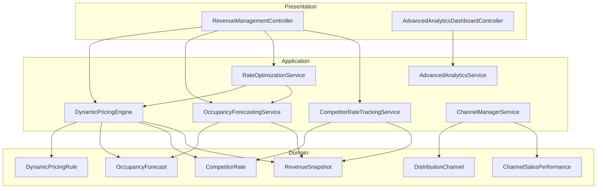

**Diagram sources**
- [RevenueManagementController.php:22-512](file://app/Http/Controllers/Hotel/RevenueManagementController.php#L22-L512)
- [AdvancedAnalyticsDashboardController.php:19-667](file://app/Http/Controllers/Analytics/AdvancedAnalyticsDashboardController.php#L19-L667)
- [DynamicPricingEngine.php:26-426](file://app/Services/DynamicPricingEngine.php#L26-L426)
- [OccupancyForecastingService.php:26-463](file://app/Services/OccupancyForecastingService.php#L26-L463)
- [RateOptimizationService.php:26-426](file://app/Services/RateOptimizationService.php#L26-L426)
- [CompetitorRateTrackingService.php:22-487](file://app/Services/CompetitorRateTrackingService.php#L22-L487)
- [ChannelManagerService.php:15-481](file://app/Services/ChannelManagerService.php#L15-L481)
- [AdvancedAnalyticsService.php:13-811](file://app/Services/AdvancedAnalyticsService.php#L13-L811)
- [DynamicPricingRule.php:10-44](file://app/Models/DynamicPricingRule.php#L10-L44)
- [OccupancyForecast.php:12-79](file://app/Models/OccupancyForecast.php#L12-L79)
- [CompetitorRate.php:12-74](file://app/Models/CompetitorRate.php#L12-L74)
- [RevenueSnapshot.php:12-132](file://app/Models/RevenueSnapshot.php#L12-L132)
- [DistributionChannel.php:12-95](file://app/Models/DistributionChannel.php#L12-L95)
- [ChannelSalesPerformance.php:11-95](file://app/Models/ChannelSalesPerformance.php#L11-L95)

## Detailed Component Analysis

### Dynamic Pricing Engine
The Dynamic Pricing Engine computes optimal rates by combining multiple factors:
- Base rate selection from rate plans or room types
- Occupancy-based adjustments using forecasted occupancy
- Competitor-based adjustments aligned with market averages
- Event-based adjustments for special events
- Day-of-week and length-of-stay modifiers
- Advance booking incentives
- Database-driven pricing rules with priority ordering
- Rate bounds ensuring realistic adjustments

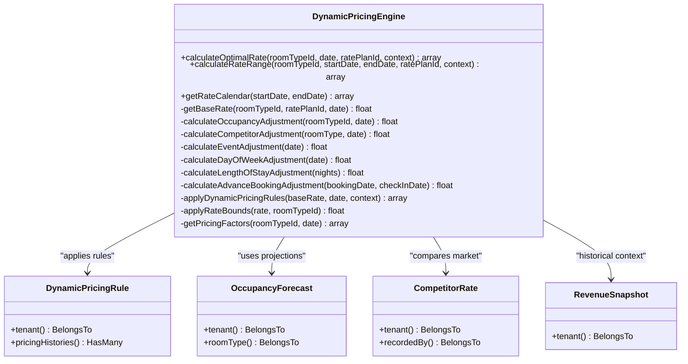

**Diagram sources**
- [DynamicPricingEngine.php:26-426](file://app/Services/DynamicPricingEngine.php#L26-L426)
- [DynamicPricingRule.php:10-44](file://app/Models/DynamicPricingRule.php#L10-L44)
- [OccupancyForecast.php:12-79](file://app/Models/OccupancyForecast.php#L12-L79)
- [CompetitorRate.php:12-74](file://app/Models/CompetitorRate.php#L12-L74)
- [RevenueSnapshot.php:12-132](file://app/Models/RevenueSnapshot.php#L12-L132)

**Section sources**
- [DynamicPricingEngine.php:39-147](file://app/Services/DynamicPricingEngine.php#L39-L147)
- [DynamicPricingEngine.php:302-333](file://app/Services/DynamicPricingEngine.php#L302-L333)
- [DynamicPricingEngine.php:338-349](file://app/Services/DynamicPricingEngine.php#L338-L349)

### Occupancy Forecasting Service
The Occupancy Forecasting Service generates daily forecasts using:
- Historical occupancy patterns (same-day-of-week across weeks and prior year)
- Current booking pace adjusted by typical booking patterns
- Event impact multipliers
- Seasonal factors and day-of-week adjustments
- Confidence calculations based on method agreement and temporal decay
- Derived metrics including projected booked rooms, ADR, and RevPAR

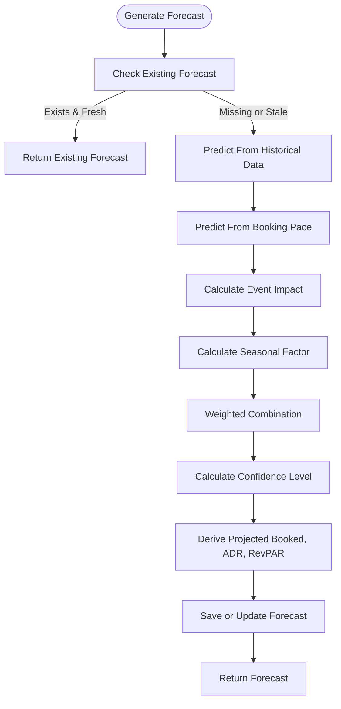

**Diagram sources**
- [OccupancyForecastingService.php:46-128](file://app/Services/OccupancyForecastingService.php#L46-L128)
- [OccupancyForecastingService.php:133-176](file://app/Services/OccupancyForecastingService.php#L133-L176)
- [OccupancyForecastingService.php:181-215](file://app/Services/OccupancyForecastingService.php#L181-L215)
- [OccupancyForecastingService.php:237-262](file://app/Services/OccupancyForecastingService.php#L237-L262)
- [OccupancyForecastingService.php:267-299](file://app/Services/OccupancyForecastingService.php#L267-L299)
- [OccupancyForecastingService.php:333-353](file://app/Services/OccupancyForecastingService.php#L333-L353)

**Section sources**
- [OccupancyForecastingService.php:46-128](file://app/Services/OccupancyForecastingService.php#L46-L128)
- [OccupancyForecastingService.php:375-409](file://app/Services/OccupancyForecastingService.php#L375-L409)
- [OccupancyForecastingService.php:414-430](file://app/Services/OccupancyForecastingService.php#L414-L430)

### Rate Optimization Service
The Rate Optimization Service performs:
- Yield optimization across room types and dates
- Length-of-stay restriction recommendations
- Overbooking optimization suggestions
- Channel mix optimization with profitability analysis
- Automated pricing recommendations incorporating price elasticity
- Profitability metrics including net revenue, commission percentages, and average booking value

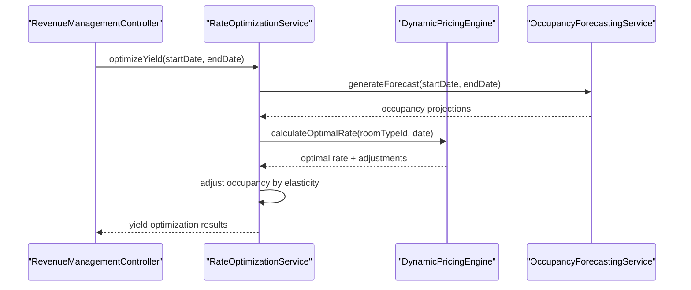

**Diagram sources**
- [RateOptimizationService.php:42-262](file://app/Services/RateOptimizationService.php#L42-L262)
- [DynamicPricingEngine.php:39-147](file://app/Services/DynamicPricingEngine.php#L39-L147)
- [OccupancyForecastingService.php:46-128](file://app/Services/OccupancyForecastingService.php#L46-L128)

**Section sources**
- [RateOptimizationService.php:42-262](file://app/Services/RateOptimizationService.php#L42-L262)
- [RateOptimizationService.php:364-426](file://app/Services/RateOptimizationService.php#L364-L426)

### Competitor Rate Tracking Service
The Competitor Rate Tracking Service supports:
- Recording competitor rates (manual and bulk)
- Analyzing rate trends and market averages
- Comparing rates against competitors by date and room type
- Generating rate parity reports and alerts
- Exporting competitor data for external analysis

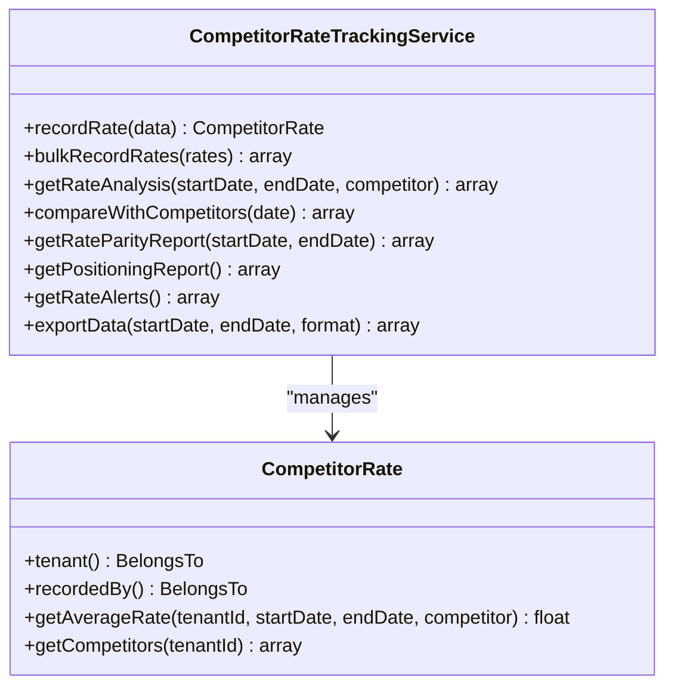

**Diagram sources**
- [CompetitorRateTrackingService.php:22-487](file://app/Services/CompetitorRateTrackingService.php#L22-L487)
- [CompetitorRate.php:12-74](file://app/Models/CompetitorRate.php#L12-L74)

**Section sources**
- [CompetitorRateTrackingService.php:79-125](file://app/Services/CompetitorRateTrackingService.php#L79-L125)
- [CompetitorRateTrackingService.php:165-229](file://app/Services/CompetitorRateTrackingService.php#L165-L229)
- [CompetitorRateTrackingService.php:259-297](file://app/Services/CompetitorRateTrackingService.php#L259-L297)
- [CompetitorRateTrackingService.php:410-453](file://app/Services/CompetitorRateTrackingService.php#L410-L453)

### Channel Manager Service
The Channel Manager Service integrates with distribution channels:
- Supported channels include major OTAs and direct booking
- Methods for pushing availability and rates, pulling reservations, and full synchronization
- Logging of actions for auditability and troubleshooting
- Stubbed implementations with placeholders for actual API integrations

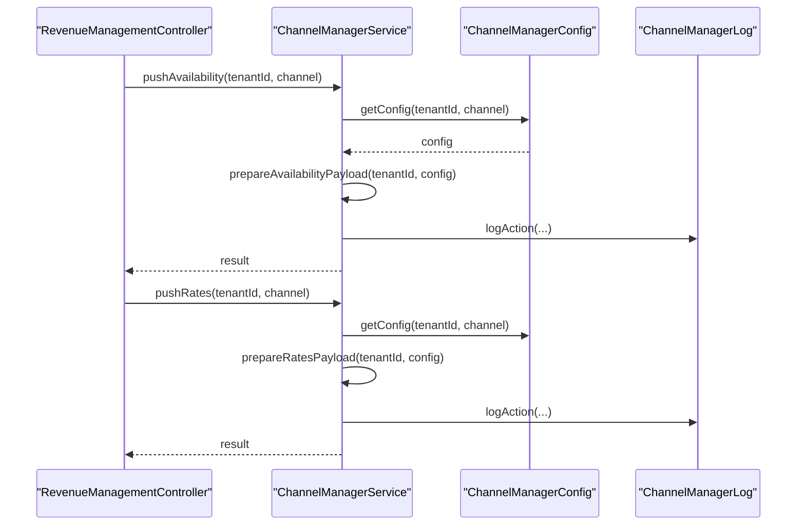

**Diagram sources**
- [ChannelManagerService.php:38-103](file://app/Services/ChannelManagerService.php#L38-L103)
- [ChannelManagerService.php:112-174](file://app/Services/ChannelManagerService.php#L112-L174)
- [ChannelManagerService.php:307-325](file://app/Services/ChannelManagerService.php#L307-L325)

**Section sources**
- [ChannelManagerService.php:18-27](file://app/Services/ChannelManagerService.php#L18-L27)
- [ChannelManagerService.php:246-293](file://app/Services/ChannelManagerService.php#L246-L293)
- [ChannelManagerService.php:449-480](file://app/Services/ChannelManagerService.php#L449-L480)

### Advanced Analytics and Dashboards
Advanced analytics services provide:
- RFM analysis for customer segmentation
- Product profitability matrix with quadrant assignments
- Employee performance metrics and rankings
- Churn risk prediction with risk scoring
- Seasonal trend analysis and peak season identification
- Business health score with weighted components

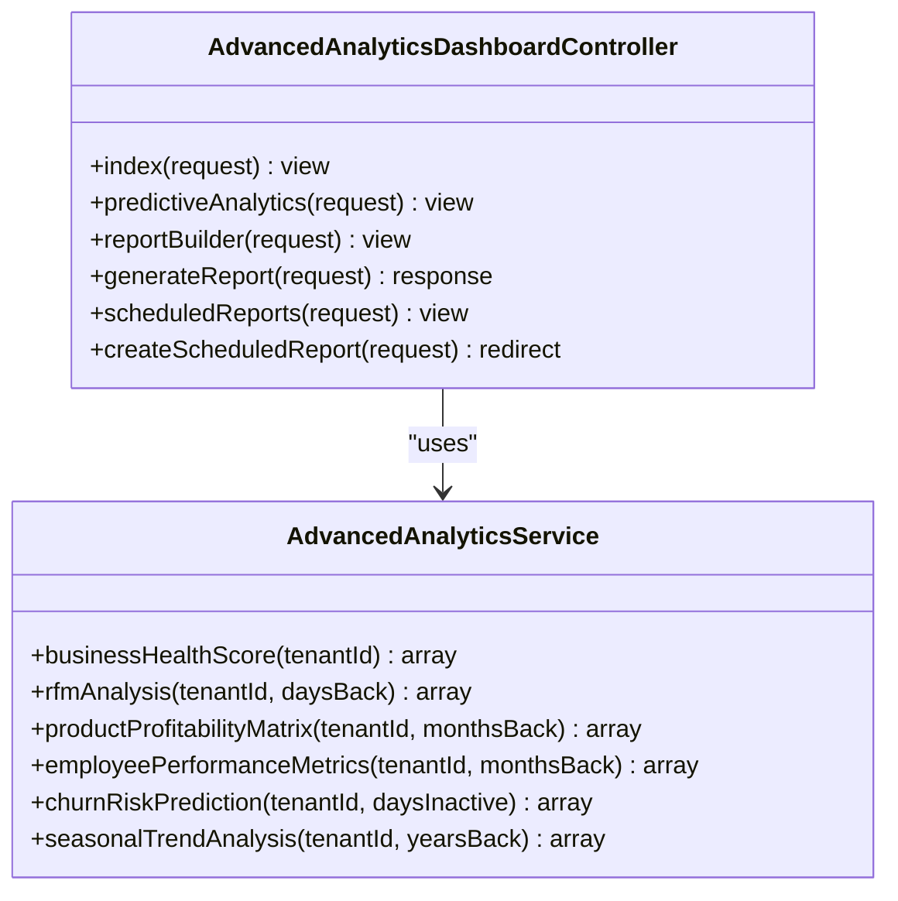

**Diagram sources**
- [AdvancedAnalyticsService.php:13-811](file://app/Services/AdvancedAnalyticsService.php#L13-L811)
- [AdvancedAnalyticsDashboardController.php:19-667](file://app/Http/Controllers/Analytics/AdvancedAnalyticsDashboardController.php#L19-L667)

**Section sources**
- [AdvancedAnalyticsService.php:68-144](file://app/Services/AdvancedAnalyticsService.php#L68-L144)
- [AdvancedAnalyticsService.php:149-223](file://app/Services/AdvancedAnalyticsService.php#L149-L223)
- [AdvancedAnalyticsService.php:228-292](file://app/Services/AdvancedAnalyticsService.php#L228-L292)
- [AdvancedAnalyticsService.php:297-355](file://app/Services/AdvancedAnalyticsService.php#L297-L355)
- [AdvancedAnalyticsService.php:360-398](file://app/Services/AdvancedAnalyticsService.php#L360-L398)
- [AdvancedAnalyticsDashboardController.php:24-48](file://app/Http/Controllers/Analytics/AdvancedAnalyticsDashboardController.php#L24-L48)
- [AdvancedAnalyticsDashboardController.php:190-204](file://app/Http/Controllers/Analytics/AdvancedAnalyticsDashboardController.php#L190-L204)

### Revenue Management Dashboard
The revenue dashboard aggregates key performance indicators, demand indicators, pricing recommendations, and forecasting summaries. It provides quick access to pricing rules, occupancy forecasts, competitor rate tracking, and yield optimization insights.

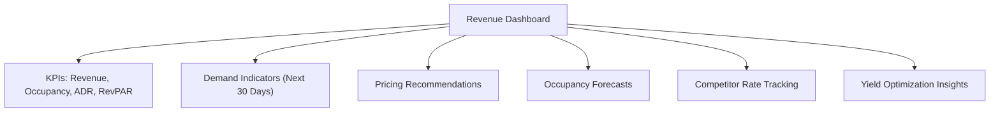

**Diagram sources**
- [dashboard.blade.php:47-71](file://resources/views/hotel/revenue/dashboard.blade.php#L47-L71)
- [RevenueManagementController.php:33-512](file://app/Http/Controllers/Hotel/RevenueManagementController.php#L33-L512)

**Section sources**
- [dashboard.blade.php:1-71](file://resources/views/hotel/revenue/dashboard.blade.php#L1-L71)
- [RevenueManagementController.php:33-512](file://app/Http/Controllers/Hotel/RevenueManagementController.php#L33-L512)

## Dependency Analysis
The following diagram illustrates key dependencies among components:

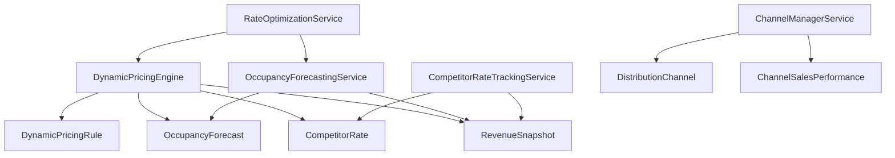

**Diagram sources**
- [DynamicPricingEngine.php:26-426](file://app/Services/DynamicPricingEngine.php#L26-L426)
- [OccupancyForecastingService.php:26-463](file://app/Services/OccupancyForecastingService.php#L26-L463)
- [RateOptimizationService.php:26-426](file://app/Services/RateOptimizationService.php#L26-L426)
- [CompetitorRateTrackingService.php:22-487](file://app/Services/CompetitorRateTrackingService.php#L22-L487)
- [ChannelManagerService.php:15-481](file://app/Services/ChannelManagerService.php#L15-L481)
- [DynamicPricingRule.php:10-44](file://app/Models/DynamicPricingRule.php#L10-L44)
- [OccupancyForecast.php:12-79](file://app/Models/OccupancyForecast.php#L12-L79)
- [CompetitorRate.php:12-74](file://app/Models/CompetitorRate.php#L12-L74)
- [RevenueSnapshot.php:12-132](file://app/Models/RevenueSnapshot.php#L12-L132)
- [DistributionChannel.php:12-95](file://app/Models/DistributionChannel.php#L12-L95)
- [ChannelSalesPerformance.php:11-95](file://app/Models/ChannelSalesPerformance.php#L11-L95)

**Section sources**
- [DynamicPricingEngine.php:26-426](file://app/Services/DynamicPricingEngine.php#L26-L426)
- [OccupancyForecastingService.php:26-463](file://app/Services/OccupancyForecastingService.php#L26-L463)
- [RateOptimizationService.php:26-426](file://app/Services/RateOptimizationService.php#L26-L426)
- [CompetitorRateTrackingService.php:22-487](file://app/Services/CompetitorRateTrackingService.php#L22-L487)
- [ChannelManagerService.php:15-481](file://app/Services/ChannelManagerService.php#L15-L481)

## Performance Considerations
- Caching: Revenue dashboards and analytics queries leverage caching to reduce database load and improve response times.
- Forecasting accuracy: Confidence levels and accuracy analysis help assess forecast reliability and guide decision-making.
- Elasticity modeling: Incorporating price elasticity ensures rate adjustments align with expected demand changes.
- Channel integration stubs: Initial implementations log actions and prepare payloads; production readiness requires implementing actual API adapters.
- Scalability: Models use appropriate casting and indexing to support large datasets and frequent queries.

[No sources needed since this section provides general guidance]

## Troubleshooting Guide
Common issues and resolutions:
- Channel configuration errors: Verify channel configurations and activation status before attempting pushes or pulls.
- Missing historical data: Ensure Revenue Snapshot entries exist for accurate occupancy forecasting and historical comparisons.
- Forecast staleness: Confirm forecast generation runs and that existing forecasts are not cached beyond acceptable freshness windows.
- Competitor data gaps: Validate competitor rate entries and ensure room type matching logic aligns with property offerings.
- Performance bottlenecks: Review caching strategies and consider optimizing queries for large date ranges or high-volume datasets.

**Section sources**
- [ChannelManagerService.php:38-103](file://app/Services/ChannelManagerService.php#L38-L103)
- [ChannelManagerService.php:112-174](file://app/Services/ChannelManagerService.php#L112-L174)
- [OccupancyForecastingService.php:64-72](file://app/Services/OccupancyForecastingService.php#L64-L72)
- [CompetitorRateTrackingService.php:34-74](file://app/Services/CompetitorRateTrackingService.php#L34-L74)

## Conclusion
The Revenue Management and Analytics module provides a robust foundation for dynamic pricing, occupancy forecasting, competitive rate tracking, and channel optimization. By leveraging the Dynamic Pricing Engine, Occupancy Forecasting Service, Rate Optimization Service, and Competitor Rate Tracking Service, organizations can implement data-driven revenue strategies. Advanced analytics and integrated dashboards enable comprehensive performance monitoring and informed decision-making. Distribution channel integration supports seamless rate parity enforcement and revenue distribution management.

[No sources needed since this section summarizes without analyzing specific files]

## Appendices

### Distribution Channels Schema
The distribution channels schema defines tables for managing channel configurations, sales performance, pricing, and inventory.

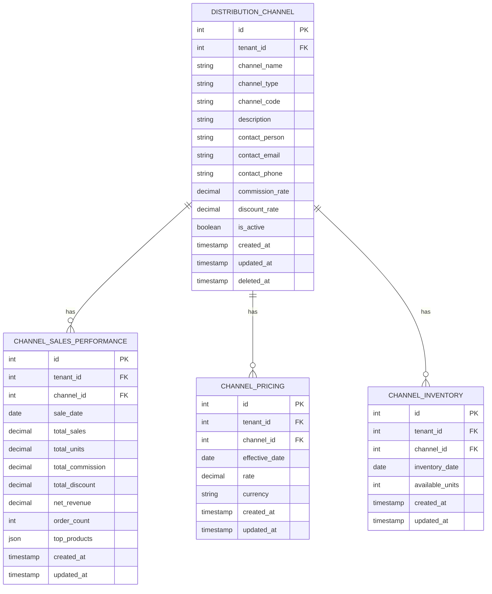

**Diagram sources**
- [2026_04_07_200000_create_distribution_channels_tables.php:1-101](file://database/migrations/2026_04_07_200000_create_distribution_channels_tables.php#L1-L101)
- [DistributionChannel.php:12-95](file://app/Models/DistributionChannel.php#L12-L95)
- [ChannelSalesPerformance.php:11-95](file://app/Models/ChannelSalesPerformance.php#L11-L95)

**Section sources**
- [2026_04_07_200000_create_distribution_channels_tables.php:75-101](file://database/migrations/2026_04_07_200000_create_distribution_channels_tables.php#L75-L101)
- [DistributionChannel.php:12-95](file://app/Models/DistributionChannel.php#L12-L95)
- [ChannelSalesPerformance.php:11-95](file://app/Models/ChannelSalesPerformance.php#L11-L95)