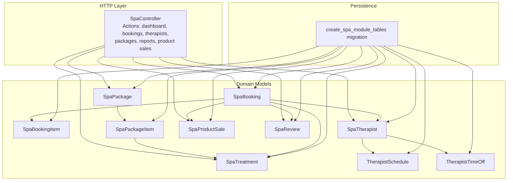
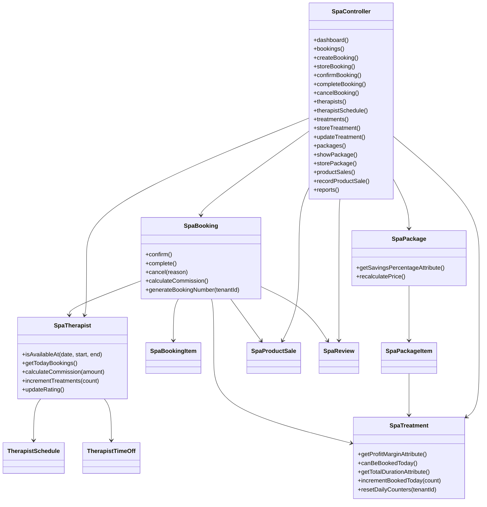
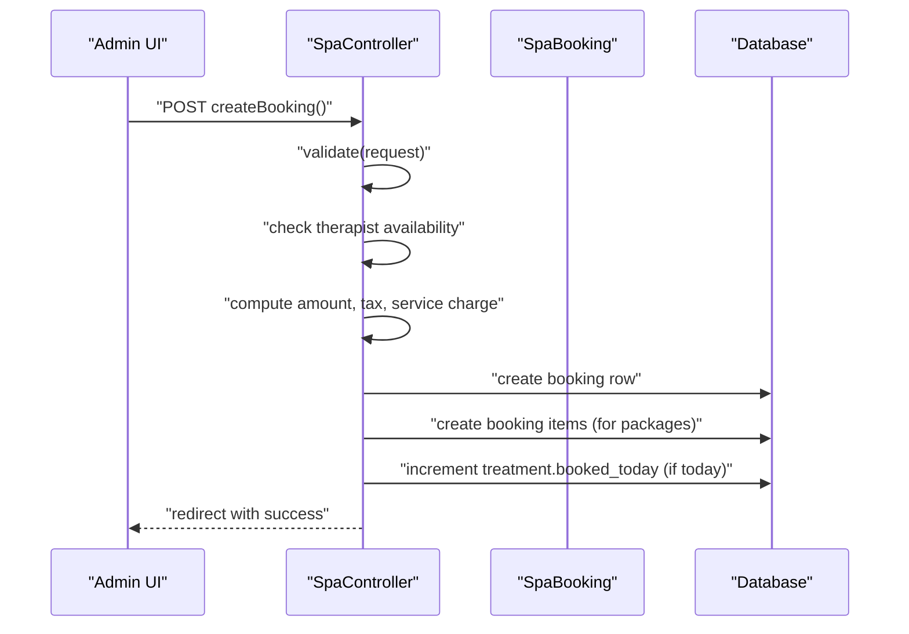
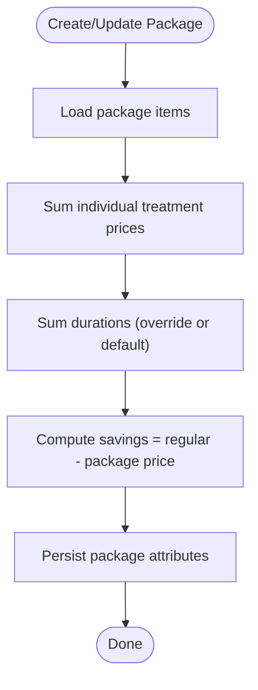
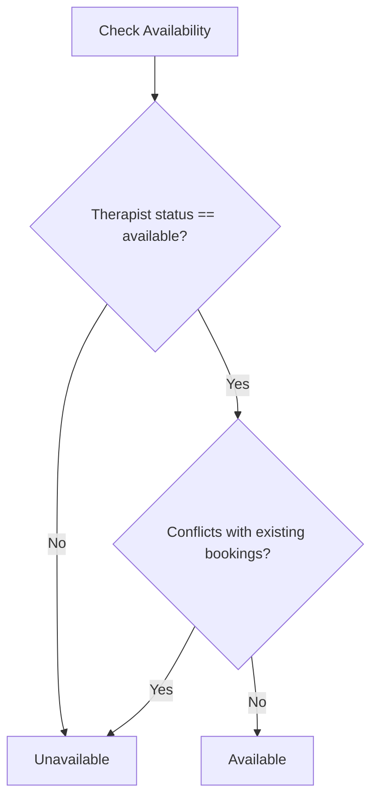
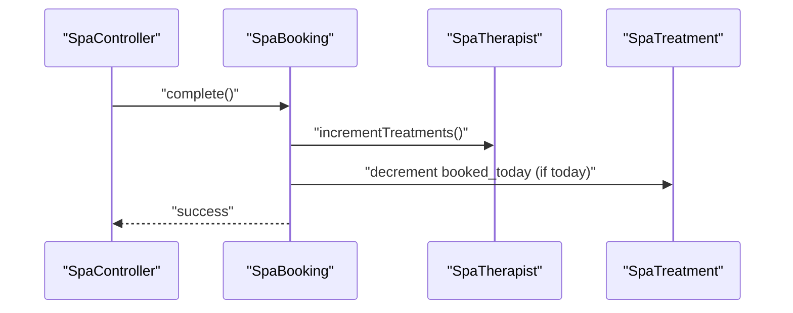
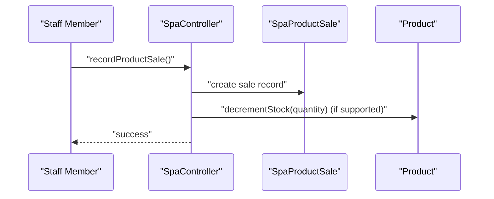
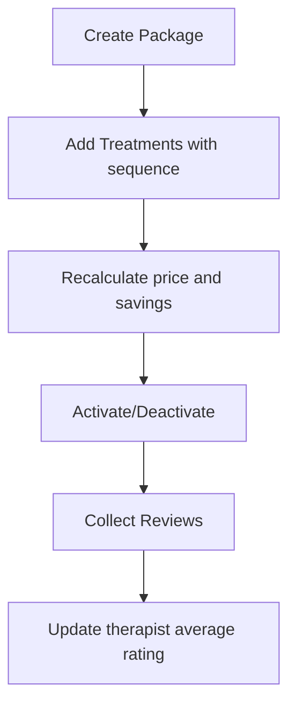
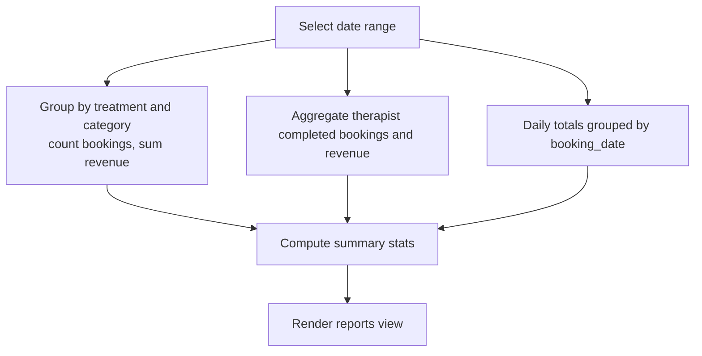
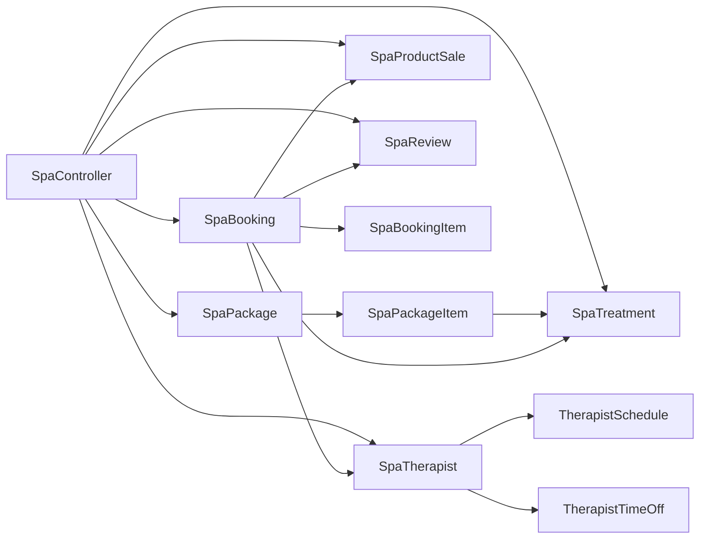

# Spa & Wellness Services

<cite>
**Referenced Files in This Document**
- [SpaController.php](file://app/Http/Controllers/Hotel/SpaController.php)
- [SpaBooking.php](file://app/Models/SpaBooking.php)
- [SpaBookingItem.php](file://app/Models/SpaBookingItem.php)
- [SpaPackage.php](file://app/Models/SpaPackage.php)
- [SpaPackageItem.php](file://app/Models/SpaPackageItem.php)
- [SpaTreatment.php](file://app/Models/SpaTreatment.php)
- [SpaTherapist.php](file://app/Models/SpaTherapist.php)
- [TherapistSchedule.php](file://app/Models/TherapistSchedule.php)
- [TherapistTimeOff.php](file://app/Models/TherapistTimeOff.php)
- [SpaProductSale.php](file://app/Models/SpaProductSale.php)
- [SpaReview.php](file://app/Models/SpaReview.php)
- [create_spa_module_tables.php](file://database/migrations/2026_04_04_600000_create_spa_module_tables.php)
</cite>

## Table of Contents
1. [Introduction](#introduction)
2. [Project Structure](#project-structure)
3. [Core Components](#core-components)
4. [Architecture Overview](#architecture-overview)
5. [Detailed Component Analysis](#detailed-component-analysis)
6. [Dependency Analysis](#dependency-analysis)
7. [Performance Considerations](#performance-considerations)
8. [Troubleshooting Guide](#troubleshooting-guide)
9. [Conclusion](#conclusion)
10. [Appendices](#appendices)

## Introduction
This document describes the Spa & Wellness Services module within the ERP system. It covers booking management, treatment and package configuration, therapist scheduling and time-off, service delivery workflows, retail product sales, reporting and revenue analytics, and integration touchpoints with guest and reservation systems. The module is implemented as a Laravel application with dedicated models, controller actions, and database migrations.

## Project Structure
The Spa module is organized around:
- A controller that exposes CRUD and workflow actions for spa operations
- Eloquent models representing spa entities and their relationships
- Database migrations defining the spa domain schema
- Views and routes supporting admin UI for spa management



**Diagram sources**
- [SpaController.php:17-626](file://app/Http/Controllers/Hotel/SpaController.php#L17-L626)
- [create_spa_module_tables.php:1-232](file://database/migrations/2026_04_04_600000_create_spa_module_tables.php#L1-L232)

**Section sources**
- [SpaController.php:17-626](file://app/Http/Controllers/Hotel/SpaController.php#L17-L626)
- [create_spa_module_tables.php:1-232](file://database/migrations/2026_04_04_600000_create_spa_module_tables.php#L1-L232)

## Core Components
- SpaBooking: central entity for appointments, including pricing, timing, status, and relationships to guests, rooms, therapists, treatments, packages, and sales/reviews
- SpaTreatment: service catalog with pricing, durations, preparation/cleanup windows, daily caps, and cost/profit metrics
- SpaPackage and SpaPackageItem: bundled offerings with recalculated pricing and ordered treatment sequences
- SpaTherapist: provider profile, availability, ratings, and scheduling/time-off records
- SpaBookingItem: per-booking treatment sequencing for packages
- TherapistSchedule and TherapistTimeOff: availability and leave management
- SpaProductSale: retail sales linked to bookings with inventory impact
- SpaReview: feedback collection against bookings/treatments/therapists

**Section sources**
- [SpaBooking.php:13-212](file://app/Models/SpaBooking.php#L13-L212)
- [SpaTreatment.php:13-125](file://app/Models/SpaTreatment.php#L13-L125)
- [SpaPackage.php:13-87](file://app/Models/SpaPackage.php#L13-L87)
- [SpaPackageItem.php:10-44](file://app/Models/SpaPackageItem.php#L10-L44)
- [SpaTherapist.php:12-133](file://app/Models/SpaTherapist.php#L12-L133)
- [SpaBookingItem.php:10-45](file://app/Models/SpaBookingItem.php#L10-L45)
- [TherapistSchedule.php:10-43](file://app/Models/TherapistSchedule.php#L10-L43)
- [TherapistTimeOff.php:10-49](file://app/Models/TherapistTimeOff.php#L10-L49)
- [SpaProductSale.php:10-58](file://app/Models/SpaProductSale.php#L10-L58)
- [SpaReview.php:10-59](file://app/Models/SpaReview.php#L10-L59)

## Architecture Overview
The Spa module follows a layered MVC pattern:
- Controller orchestrates requests, validates inputs, coordinates transactions, and renders views
- Models encapsulate domain logic (availability checks, pricing calculations, counters, and status transitions)
- Database schema enforces referential integrity and indexes for performance
- Tenant scoping ensures multi-tenancy isolation across all spa entities



**Diagram sources**
- [SpaController.php:17-626](file://app/Http/Controllers/Hotel/SpaController.php#L17-L626)
- [SpaBooking.php:13-212](file://app/Models/SpaBooking.php#L13-L212)
- [SpaTreatment.php:13-125](file://app/Models/SpaTreatment.php#L13-L125)
- [SpaPackage.php:13-87](file://app/Models/SpaPackage.php#L13-L87)
- [SpaTherapist.php:12-133](file://app/Models/SpaTherapist.php#L12-L133)
- [TherapistSchedule.php:10-43](file://app/Models/TherapistSchedule.php#L10-L43)
- [TherapistTimeOff.php:10-49](file://app/Models/TherapistTimeOff.php#L10-L49)
- [SpaBookingItem.php:10-45](file://app/Models/SpaBookingItem.php#L10-L45)
- [SpaPackageItem.php:10-44](file://app/Models/SpaPackageItem.php#L10-L44)
- [SpaProductSale.php:10-58](file://app/Models/SpaProductSale.php#L10-L58)
- [SpaReview.php:10-59](file://app/Models/SpaReview.php#L10-L59)

## Detailed Component Analysis

### Spa Booking Management
Spa bookings represent scheduled services with support for single treatments and bundled packages. The controller handles creation, confirmation, completion, cancellation, and filtering. Pricing includes amount, tax, service charge, and total. Availability checks prevent double-booking for therapists.



**Diagram sources**
- [SpaController.php:343-435](file://app/Http/Controllers/Hotel/SpaController.php#L343-L435)
- [SpaBooking.php:13-212](file://app/Models/SpaBooking.php#L13-L212)
- [SpaTreatment.php:13-125](file://app/Models/SpaTreatment.php#L13-L125)

Key behaviors:
- Booking number generation with tenant-scoped sequence
- Status transitions: pending → confirmed → in_progress → completed
- Cancellation rules and audit timestamps
- Commission calculation via associated therapist hourly rate

**Section sources**
- [SpaController.php:318-435](file://app/Http/Controllers/Hotel/SpaController.php#L318-L435)
- [SpaBooking.php:126-211](file://app/Models/SpaBooking.php#L126-L211)

### Treatment Package Configuration
Packages bundle multiple treatments with an aggregated price and total duration. The system recalculates regular price and savings based on included treatments and optional duration overrides.



**Diagram sources**
- [SpaPackage.php:67-85](file://app/Models/SpaPackage.php#L67-L85)
- [SpaPackageItem.php:10-44](file://app/Models/SpaPackageItem.php#L10-L44)

**Section sources**
- [SpaPackage.php:56-85](file://app/Models/SpaPackage.php#L56-L85)
- [SpaPackageItem.php:10-44](file://app/Models/SpaPackageItem.php#L10-L44)

### Therapist Scheduling and Availability
Therapists maintain availability via schedules and time-off requests. The system prevents overlapping bookings and integrates with daily booking counters for treatments.



**Diagram sources**
- [SpaTherapist.php:67-91](file://app/Models/SpaTherapist.php#L67-L91)
- [TherapistSchedule.php:10-43](file://app/Models/TherapistSchedule.php#L10-L43)
- [TherapistTimeOff.php:10-49](file://app/Models/TherapistTimeOff.php#L10-L49)

**Section sources**
- [SpaTherapist.php:67-131](file://app/Models/SpaTherapist.php#L67-L131)
- [TherapistSchedule.php:10-43](file://app/Models/TherapistSchedule.php#L10-L43)
- [TherapistTimeOff.php:10-49](file://app/Models/TherapistTimeOff.php#L10-L49)

### Service Delivery Workflows
Service delivery is tracked per booking item for packages. Completion updates therapist totals and treatment counters.



**Diagram sources**
- [SpaController.php:454-463](file://app/Http/Controllers/Hotel/SpaController.php#L454-L463)
- [SpaBooking.php:179-198](file://app/Models/SpaBooking.php#L179-L198)
- [SpaTherapist.php:113-119](file://app/Models/SpaTherapist.php#L113-L119)
- [SpaTreatment.php:117-123](file://app/Models/SpaTreatment.php#L117-L123)

**Section sources**
- [SpaController.php:451-463](file://app/Http/Controllers/Hotel/SpaController.php#L451-L463)
- [SpaBooking.php:179-198](file://app/Models/SpaBooking.php#L179-L198)

### Spa Inventory Tracking and Product Sales
Retail product sales are recorded per booking with unit price, quantity, cost, and computed profit. Inventory adjustments can be applied when supported by product stock logic.



**Diagram sources**
- [SpaController.php:516-547](file://app/Http/Controllers/Hotel/SpaController.php#L516-L547)
- [SpaProductSale.php:10-58](file://app/Models/SpaProductSale.php#L10-L58)

**Section sources**
- [SpaController.php:488-547](file://app/Http/Controllers/Hotel/SpaController.php#L488-L547)
- [SpaProductSale.php:10-58](file://app/Models/SpaProductSale.php#L10-L58)

### Wellness Program Administration and Customer Feedback
Wellness program administration is supported by package creation and management. Customer feedback is captured via reviews linked to bookings, treatments, and therapists, with average rating updates.



**Diagram sources**
- [SpaController.php:174-212](file://app/Http/Controllers/Hotel/SpaController.php#L174-L212)
- [SpaPackage.php:67-85](file://app/Models/SpaPackage.php#L67-L85)
- [SpaReview.php:10-59](file://app/Models/SpaReview.php#L10-L59)
- [SpaTherapist.php:121-131](file://app/Models/SpaTherapist.php#L121-L131)

**Section sources**
- [SpaController.php:144-212](file://app/Http/Controllers/Hotel/SpaController.php#L144-L212)
- [SpaReview.php:10-59](file://app/Models/SpaReview.php#L10-L59)
- [SpaTherapist.php:121-131](file://app/Models/SpaTherapist.php#L121-L131)

### Reporting, Revenue Tracking, and Profitability
The reporting endpoint aggregates:
- Revenue by treatment/service category
- Therapist performance by completed bookings and revenue
- Daily revenue trends
- Summary statistics (total bookings, completed, revenue, average booking value)

Profitability insights leverage treatment cost and price attributes.



**Diagram sources**
- [SpaController.php:552-624](file://app/Http/Controllers/Hotel/SpaController.php#L552-L624)
- [SpaTreatment.php:74-83](file://app/Models/SpaTreatment.php#L74-L83)

**Section sources**
- [SpaController.php:552-624](file://app/Http/Controllers/Hotel/SpaController.php#L552-L624)
- [SpaTreatment.php:74-83](file://app/Models/SpaTreatment.php#L74-L83)

### Integration with Guest Management and Reservations
- Guest association: bookings optionally link to hotel guests
- Room association: bookings optionally link to room numbers
- Reservation linkage: bookings optionally reference reservations
- Created-by attribution: audit trail linking to user who created the booking

These integrations enable seamless cross-system workflows for guest-facing services.

**Section sources**
- [SpaBooking.php:71-124](file://app/Models/SpaBooking.php#L71-L124)

### Spa Facility Management, Equipment Maintenance, and Quality Assurance
- Facility and equipment: not modeled in the current spa module schema
- Maintenance: not modeled in the current spa module schema
- Quality assurance: reviews and ratings capture service quality feedback

Recommendations:
- Extend schema with facility/equipment entities and maintenance logs
- Integrate QA checklists and compliance tracking into booking lifecycle
- Link maintenance schedules to facility assets and therapist availability

[No sources needed since this section provides general guidance]

## Dependency Analysis
The Spa module exhibits cohesive internal dependencies:
- SpaBooking depends on SpaTreatment, SpaPackage, SpaTherapist, SpaBookingItem, SpaProductSale, and SpaReview
- SpaPackage depends on SpaPackageItem and SpaTreatment
- SpaTherapist depends on TherapistSchedule and TherapistTimeOff
- Controllers orchestrate model interactions and enforce tenant scoping



**Diagram sources**
- [SpaController.php:17-626](file://app/Http/Controllers/Hotel/SpaController.php#L17-L626)
- [SpaBooking.php:13-212](file://app/Models/SpaBooking.php#L13-L212)
- [SpaPackage.php:13-87](file://app/Models/SpaPackage.php#L13-L87)
- [SpaTherapist.php:12-133](file://app/Models/SpaTherapist.php#L12-L133)
- [TherapistSchedule.php:10-43](file://app/Models/TherapistSchedule.php#L10-L43)
- [TherapistTimeOff.php:10-49](file://app/Models/TherapistTimeOff.php#L10-L49)
- [SpaBookingItem.php:10-45](file://app/Models/SpaBookingItem.php#L10-L45)
- [SpaPackageItem.php:10-44](file://app/Models/SpaPackageItem.php#L10-L44)
- [SpaProductSale.php:10-58](file://app/Models/SpaProductSale.php#L10-L58)
- [SpaReview.php:10-59](file://app/Models/SpaReview.php#L10-L59)

**Section sources**
- [SpaController.php:17-626](file://app/Http/Controllers/Hotel/SpaController.php#L17-L626)

## Performance Considerations
- Indexes on tenant_id, booking_date, status, therapist_id, and schedule_date improve query performance
- Aggregation queries in reports should leverage appropriate grouping and date-range filters
- Use pagination for large booking/product-sale lists
- Consider background jobs for heavy report generation or inventory adjustments

[No sources needed since this section provides general guidance]

## Troubleshooting Guide
Common issues and resolutions:
- Booking conflicts: Verify therapist availability before creation; the controller checks overlapping bookings and returns errors when unavailable
- Cancellation restrictions: Bookings can only be cancelled when in pending or confirmed state
- Package recalculation: After adding/removing treatments, trigger price recalculation to reflect savings and total duration
- Daily booking limits: Treatments enforce max_daily_bookings; ensure counters reset appropriately

**Section sources**
- [SpaController.php:361-367](file://app/Http/Controllers/Hotel/SpaController.php#L361-L367)
- [SpaController.php:474-476](file://app/Http/Controllers/Hotel/SpaController.php#L474-L476)
- [SpaPackage.php:70-85](file://app/Models/SpaPackage.php#L70-L85)
- [SpaTreatment.php:88-99](file://app/Models/SpaTreatment.php#L88-L99)

## Conclusion
The Spa & Wellness Services module provides a robust foundation for managing bookings, treatments, packages, therapists, and retail sales, with integrated reporting and tenant-aware operations. Extending the schema to include facility/equipment and maintenance, and deepening QA and supply chain integrations, would further strengthen operational excellence.

## Appendices

### Database Schema Overview
The spa module schema defines tables for therapists, treatments, packages, bookings, booking items, schedules, time-off, product sales, and reviews, with tenant foreign keys and soft deletes.

```mermaid
erDiagram
SPA_THERAPISTS {
bigint id PK
bigint tenant_id FK
string employee_number UK
string name
string phone
string email
json specializations
enum status
decimal hourly_rate
integer rating
integer total_treatments
boolean is_active
timestamps timestamps
softdeleted deleted_at
}
SPA_TREATMENTS {
bigint id PK
bigint tenant_id FK
string name
text description
string category
integer duration_minutes
decimal price
decimal cost
string image_path
json benefits
boolean requires_consultation
integer preparation_time
integer cleanup_time
integer max_daily_bookings
integer booked_today
boolean is_active
integer display_order
timestamps timestamps
softdeleted deleted_at
}
SPA_PACKAGES {
bigint id PK
bigint tenant_id FK
string name
text description
decimal package_price
decimal regular_price
decimal savings
integer total_duration_minutes
string image_path
boolean is_active
timestamps timestamps
softdeleted deleted_at
}
SPA_PACKAGE_ITEMS {
bigint id PK
bigint tenant_id FK
bigint package_id FK
bigint treatment_id FK
integer sequence_order
integer duration_override
timestamps timestamps
}
SPA_BOOKINGS {
bigint id PK
bigint tenant_id FK
string booking_number UK
bigint guest_id FK
integer room_number
bigint reservation_id FK
bigint therapist_id FK
bigint treatment_id FK
bigint package_id FK
date booking_date
time start_time
time end_time
integer duration_minutes
decimal amount
decimal tax_amount
decimal service_charge
decimal total_amount
enum status
text special_requests
text therapist_notes
text cancellation_reason
timestamp confirmed_at
timestamp completed_at
timestamp cancelled_at
bigint created_by FK
timestamps timestamps
softdeleted deleted_at
}
SPA_BOOKING_ITEMS {
bigint id PK
bigint tenant_id FK
bigint booking_id FK
bigint treatment_id FK
integer sequence_order
time scheduled_start
time scheduled_end
enum status
timestamps timestamps
}
THERAPIST_SCHEDULES {
bigint id PK
bigint tenant_id FK
bigint therapist_id FK
date schedule_date
time start_time
time end_time
boolean is_available
json breaks
text notes
timestamps timestamps
}
THERAPIST_TIME_OFF {
bigint id PK
bigint tenant_id FK
bigint therapist_id FK
date start_date
date end_date
enum type
text reason
enum status
bigint approved_by FK
timestamp approved_at
timestamps timestamps
}
SPA_PRODUCT_SALES {
bigint id PK
bigint tenant_id FK
bigint booking_id FK
bigint product_id FK
integer quantity
decimal unit_price
decimal total_price
decimal cost_price
decimal profit SToredAs
bigint sold_by FK
timestamp sale_date
text notes
timestamps timestamps
}
SPA_REVIEWS {
bigint id PK
bigint tenant_id FK
bigint booking_id FK
bigint guest_id FK
bigint therapist_id FK
bigint treatment_id FK
integer rating
text comment
json ratings_breakdown
boolean is_published
timestamps timestamps
}
SPA_BOOKINGS ||--o{ SPA_BOOKING_ITEMS : "has many"
SPA_PACKAGES ||--o{ SPA_PACKAGE_ITEMS : "has many"
SPA_PACKAGE_ITEMS }o--|| SPA_TREATMENTS : "includes"
SPA_BOOKINGS }o--|| SPA_TREATMENTS : "uses"
SPA_BOOKINGS }o--|| SPA_THERAPISTS : "assigns"
SPA_THERAPISTS ||--o{ THERAPIST_SCHEDULES : "has many"
SPA_THERAPISTS ||--o{ THERAPIST_TIME_OFF : "has many"
SPA_BOOKINGS ||--o{ SPA_PRODUCT_SALES : "generates"
SPA_BOOKINGS ||--o{ SPA_REVIEWS : "generates"
```

**Diagram sources**
- [create_spa_module_tables.php:10-232](file://database/migrations/2026_04_04_600000_create_spa_module_tables.php#L10-L232)