# Industry-Specific Modules

<cite>
**Referenced Files in This Document**
- [healthcare.php](file://routes/healthcare.php)
- [EMRController.php](file://app/Http/Controllers/Healthcare/EMRController.php)
- [IntegrationController.php](file://app/Http/Controllers/Healthcare/IntegrationController.php)
- [HealthcareIntegrationService.php](file://app/Services/HealthcareIntegrationService.php)
- [PatientMedicalRecord.php](file://app/Models/PatientMedicalRecord.php)
- [healthcare.php](file://config/healthcare.php)
- [HEALTHCARE_REGULATORY_COMPLIANCE.md](file://docs/HEALTHCARE_REGULATORY_COMPLIANCE.md)
- [HEALTHCARE_INTEGRATION_INTEROPERABILITY.md](file://docs/HEALTHCARE_INTEGRATION_INTEROPERABILITY.md)
- [web.php](file://routes/web.php)
- [MaterialDeliveryController.php](file://app/Http/Controllers/Construction/MaterialDeliveryController.php)
- [MaterialDeliveryService.php](file://app/Services/MaterialDeliveryService.php)
- [MaterialDelivery.php](file://app/Models/MaterialDelivery.php)
- [ConstructionPdfService.php](file://app/Services/ConstructionPdfService.php)
- [Project.php](file://app/Models/Project.php)
- [ProjectTask.php](file://app/Models/ProjectTask.php)
- [web.php](file://routes/web.php)
- [2026_03_31_700000_create_crop_cycles_table.php](file://database/migrations/2026_03_31_700000_create_crop_cycles_table.php)
- [CropCycleController.php](file://app/Http/Controllers/CropCycleController.php)
- [LivestockHerd.php](file://app/Models/LivestockHerd.php)
- [FarmAnalyticsService.php](file://app/Services/FarmAnalyticsService.php)
- [web.php](file://routes/web.php)
- [RouterIntegrationService.php](file://app/Services/Telecom/RouterIntegrationService.php)
- [BandwidthMonitoringService.php](file://app/Services/Telecom/BandwidthMonitoringService.php)
- [TelecomSubscription.php](file://app/Models/TelecomSubscription.php)
- [InternetPackage.php](file://app/Models/InternetPackage.php)
- [index.blade.php](file://resources/views/telecom/reports/index.blade.php)
</cite>

## Table of Contents
1. [Introduction](#introduction)
2. [Project Structure](#project-structure)
3. [Core Components](#core-components)
4. [Architecture Overview](#architecture-overview)
5. [Detailed Component Analysis](#detailed-component-analysis)
6. [Dependency Analysis](#dependency-analysis)
7. [Performance Considerations](#performance-considerations)
8. [Troubleshooting Guide](#troubleshooting-guide)
9. [Conclusion](#conclusion)

## Introduction
This document explains Qalcuity ERP’s industry-specific modules designed for specialized verticals: healthcare, telecom/ISP, construction, fisheries/livestock, and agriculture. It covers workflows, compliance, integrations, and operational patterns implemented across controllers, services, models, routes, and configuration.

## Project Structure
Qalcuity organizes industry modules by domain under dedicated namespaces and routes:
- Healthcare: EMR, integrations, compliance, and patient portal features
- Telecom/ISP: router orchestration, bandwidth monitoring, subscriptions, and billing
- Construction: project tracking, material delivery, workforce/timekeeping
- Agriculture: crop cycles, harvesting, analytics, and plot management
- Livestock: herd management, feed, health, and financial metrics

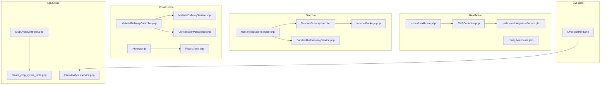

**Diagram sources**
- [healthcare.php:113-135](file://routes/healthcare.php#L113-L135)
- [EMRController.php:1-121](file://app/Http/Controllers/Healthcare/EMRController.php#L1-L121)
- [HealthcareIntegrationService.php:1-591](file://app/Services/HealthcareIntegrationService.php#L1-L591)
- [RouterIntegrationService.php:1-396](file://app/Services/Telecom/RouterIntegrationService.php#L1-L396)
- [BandwidthMonitoringService.php:1-144](file://app/Services/Telecom/BandwidthMonitoringService.php#L1-L144)
- [TelecomSubscription.php:1-304](file://app/Models/TelecomSubscription.php#L1-L304)
- [InternetPackage.php:1-148](file://app/Models/InternetPackage.php#L1-L148)
- [MaterialDeliveryController.php:1-82](file://app/Http/Controllers/Construction/MaterialDeliveryController.php#L1-L82)
- [MaterialDeliveryService.php:1-150](file://app/Services/MaterialDeliveryService.php#L1-L150)
- [ConstructionPdfService.php:1-94](file://app/Services/ConstructionPdfService.php#L1-L94)
- [Project.php:1-82](file://app/Models/Project.php#L1-L82)
- [ProjectTask.php:1-101](file://app/Models/ProjectTask.php#L1-L101)
- [CropCycleController.php:1-35](file://app/Http/Controllers/CropCycleController.php#L1-L35)
- [2026_03_31_700000_create_crop_cycles_table.php:52-75](file://database/migrations/2026_03_31_700000_create_crop_cycles_table.php#L52-L75)
- [FarmAnalyticsService.php:1-160](file://app/Services/FarmAnalyticsService.php#L1-L160)
- [LivestockHerd.php:1-197](file://app/Models/LivestockHerd.php#L1-L197)

**Section sources**
- [healthcare.php:113-135](file://routes/healthcare.php#L113-L135)
- [web.php:2338-2347](file://routes/web.php#L2338-L2347)
- [web.php:1408-1418](file://routes/web.php#L1408-L1418)

## Core Components
- Healthcare EMR and integrations: EMR CRUD, HL7/FHIR ingestion, BPJS claims, lab/pharmacy integrations, and notifications
- Telecom router orchestration: device connection testing, hotspot user provisioning, usage sync, bandwidth profiles, and alerts
- Construction project and delivery: project lifecycle, task tracking, material delivery, quality checks, and PDF reporting
- Agriculture crop cycles: cycle creation, phase transitions, activity logging, and analytics
- Livestock herd management: counts, mortality, FCR, feed costs, and revenue tracking

**Section sources**
- [EMRController.php:1-121](file://app/Http/Controllers/Healthcare/EMRController.php#L1-L121)
- [HealthcareIntegrationService.php:1-591](file://app/Services/HealthcareIntegrationService.php#L1-L591)
- [RouterIntegrationService.php:1-396](file://app/Services/Telecom/RouterIntegrationService.php#L1-L396)
- [MaterialDeliveryController.php:1-82](file://app/Http/Controllers/Construction/MaterialDeliveryController.php#L1-L82)
- [MaterialDeliveryService.php:1-150](file://app/Services/MaterialDeliveryService.php#L1-L150)
- [ConstructionPdfService.php:1-94](file://app/Services/ConstructionPdfService.php#L1-L94)
- [CropCycleController.php:1-35](file://app/Http/Controllers/CropCycleController.php#L1-L35)
- [LivestockHerd.php:1-197](file://app/Models/LivestockHerd.php#L1-L197)

## Architecture Overview
The system follows layered architecture:
- Routes define domain-specific endpoints
- Controllers coordinate requests and delegate to services
- Services encapsulate business logic and integrations
- Models represent domain entities and relationships
- Configuration governs compliance, security, and behavior

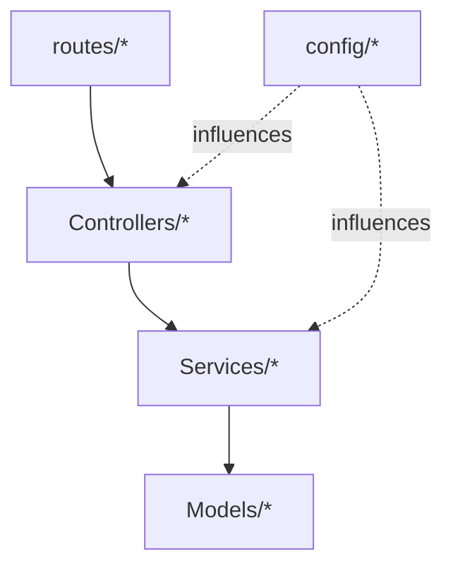

[No sources needed since this diagram shows conceptual workflow, not actual code structure]

## Detailed Component Analysis

### Healthcare Management System
- EMR: create, update, history, diagnosis, prescriptions, lab orders, timeline, export
- Integrations: HL7/FHIR inbound/outbound, BPJS eligibility/claims, lab equipment import, pharmacy e-prescription, SMS/WhatsApp/email notifications
- Compliance: HIPAA, Permenkes, audit trails, access logs, anonymization, backup/disaster recovery
- Patient portal: booking, lab results, prescriptions, billing, downloads

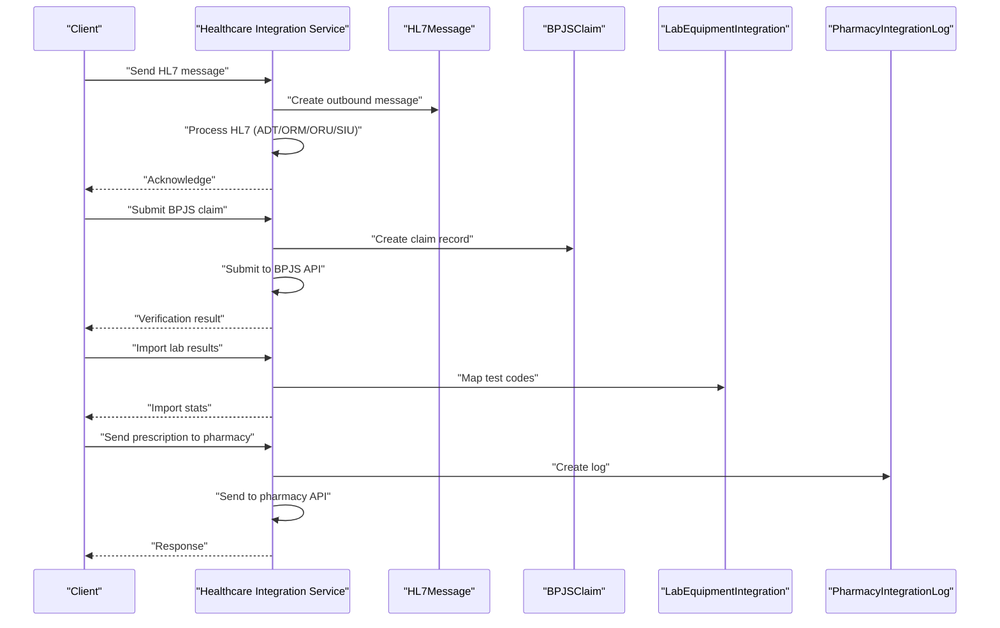

**Diagram sources**
- [HealthcareIntegrationService.php:1-591](file://app/Services/HealthcareIntegrationService.php#L1-L591)
- [IntegrationController.php:1-51](file://app/Http/Controllers/Healthcare/IntegrationController.php#L1-L51)

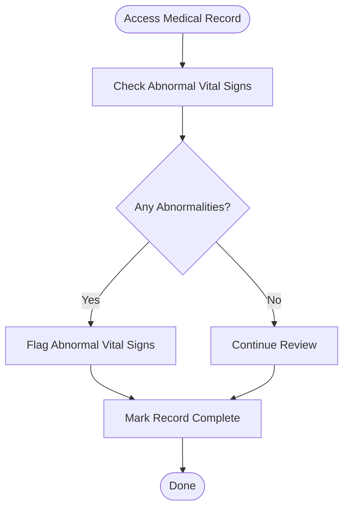

**Diagram sources**
- [PatientMedicalRecord.php:94-168](file://app/Models/PatientMedicalRecord.php#L94-L168)

**Section sources**
- [healthcare.php:113-135](file://routes/healthcare.php#L113-L135)
- [EMRController.php:1-121](file://app/Http/Controllers/Healthcare/EMRController.php#L1-L121)
- [IntegrationController.php:1-51](file://app/Http/Controllers/Healthcare/IntegrationController.php#L1-L51)
- [HealthcareIntegrationService.php:1-591](file://app/Services/HealthcareIntegrationService.php#L1-L591)
- [PatientMedicalRecord.php:1-274](file://app/Models/PatientMedicalRecord.php#L1-L274)
- [healthcare.php:1-251](file://config/healthcare.php#L1-L251)
- [HEALTHCARE_REGULATORY_COMPLIANCE.md:1-44](file://docs/HEALTHCARE_REGULATORY_COMPLIANCE.md#L1-L44)
- [HEALTHCARE_INTEGRATION_INTEROPERABILITY.md:1-55](file://docs/HEALTHCARE_INTEGRATION_INTEROPERABILITY.md#L1-L55)

### Telecom/ISP Management
- Router orchestration: connect/test, create/remove hotspot users, sync usage, apply bandwidth profiles, device health alerts
- Bandwidth monitoring: device usage, top consumers, allocation monitoring
- Subscriptions: activation/suspension/cancellation, quota tracking/reset, password encryption/decryption
- Packages: speed tiers, quotas, rollover, pricing, overage calculation

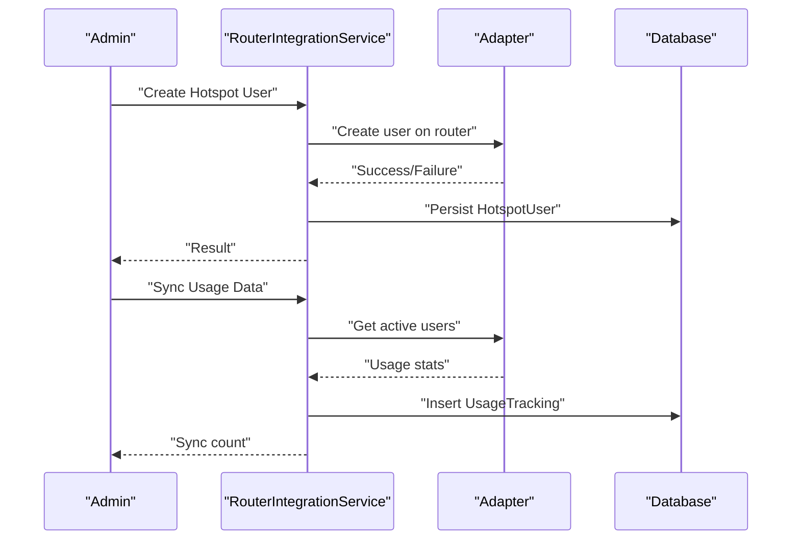

**Diagram sources**
- [RouterIntegrationService.php:76-253](file://app/Services/Telecom/RouterIntegrationService.php#L76-L253)

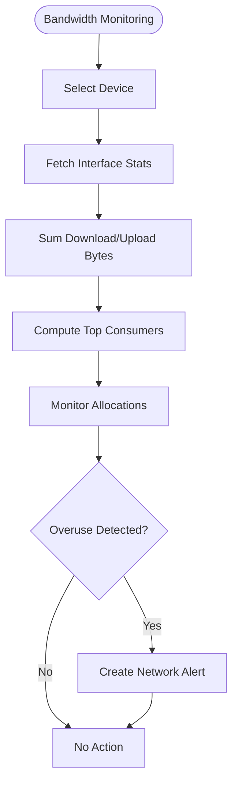

**Diagram sources**
- [BandwidthMonitoringService.php:29-144](file://app/Services/Telecom/BandwidthMonitoringService.php#L29-L144)

**Section sources**
- [RouterIntegrationService.php:1-396](file://app/Services/Telecom/RouterIntegrationService.php#L1-L396)
- [BandwidthMonitoringService.php:1-144](file://app/Services/Telecom/BandwidthMonitoringService.php#L1-L144)
- [TelecomSubscription.php:1-304](file://app/Models/TelecomSubscription.php#L1-L304)
- [InternetPackage.php:1-148](file://app/Models/InternetPackage.php#L1-L148)
- [index.blade.php:26-46](file://resources/views/telecom/reports/index.blade.php#L26-L46)

### Construction Management
- Material delivery: create, mark in-transit, receive, quality pass/fail, summary by project/period
- Project tracking: tasks with volume or status-based progress, milestone tracking, expense aggregation
- Reporting: daily site report PDF, project summary PDF, subcontractor contract PDF

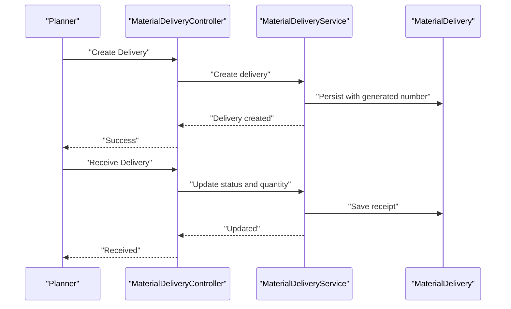

**Diagram sources**
- [MaterialDeliveryController.php:70-82](file://app/Http/Controllers/Construction/MaterialDeliveryController.php#L70-L82)
- [MaterialDeliveryService.php:16-111](file://app/Services/MaterialDeliveryService.php#L16-L111)

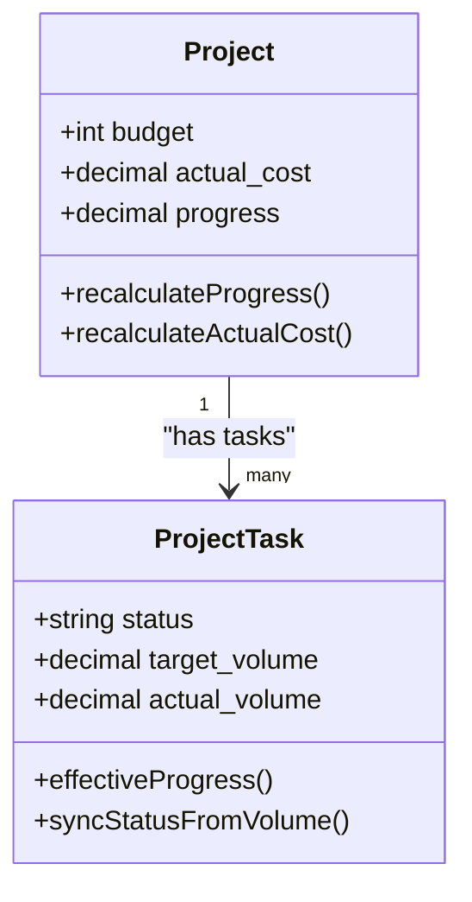

**Diagram sources**
- [Project.php:50-81](file://app/Models/Project.php#L50-L81)
- [ProjectTask.php:66-100](file://app/Models/ProjectTask.php#L66-L100)

**Section sources**
- [web.php:2338-2347](file://routes/web.php#L2338-L2347)
- [MaterialDeliveryController.php:1-82](file://app/Http/Controllers/Construction/MaterialDeliveryController.php#L1-L82)
- [MaterialDeliveryService.php:1-150](file://app/Services/MaterialDeliveryService.php#L1-L150)
- [MaterialDelivery.php:1-50](file://app/Models/MaterialDelivery.php#L1-L50)
- [ConstructionPdfService.php:1-94](file://app/Services/ConstructionPdfService.php#L1-L94)
- [Project.php:1-82](file://app/Models/Project.php#L1-L82)
- [ProjectTask.php:1-101](file://app/Models/ProjectTask.php#L1-L101)

### Agriculture and Fisheries
- Crop cycles: create, advance phase, log activities, view harvests, analytics
- Farm analytics: cost breakdown, cost per hectare, HPP per kg, yield per hectare, plot comparison, monthly trends
- Livestock: herd metrics, mortality, FCR, feed consumption, revenue, and cost calculations

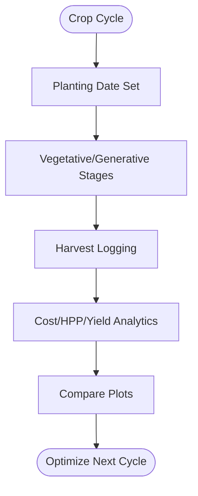

**Diagram sources**
- [CropCycleController.php:15-35](file://app/Http/Controllers/CropCycleController.php#L15-L35)
- [2026_03_31_700000_create_crop_cycles_table.php:52-75](file://database/migrations/2026_03_31_700000_create_crop_cycles_table.php#L52-L75)
- [FarmAnalyticsService.php:16-158](file://app/Services/FarmAnalyticsService.php#L16-L158)

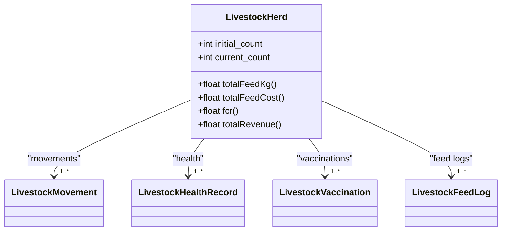

**Diagram sources**
- [LivestockHerd.php:119-182](file://app/Models/LivestockHerd.php#L119-L182)

**Section sources**
- [web.php:1408-1418](file://routes/web.php#L1408-L1418)
- [CropCycleController.php:1-35](file://app/Http/Controllers/CropCycleController.php#L1-L35)
- [2026_03_31_700000_create_crop_cycles_table.php:52-75](file://database/migrations/2026_03_31_700000_create_crop_cycles_table.php#L52-L75)
- [FarmAnalyticsService.php:1-160](file://app/Services/FarmAnalyticsService.php#L1-L160)
- [LivestockHerd.php:1-197](file://app/Models/LivestockHerd.php#L1-L197)

## Dependency Analysis
- Healthcare EMR depends on PatientMedicalRecord and integrates with HL7/FHIR, BPJS, lab/pharmacy systems
- Telecom router operations depend on RouterAdapterFactory and NetworkDevice models; bandwidth monitoring aggregates usage and allocations
- Construction delivery depends on MaterialDeliveryService and MaterialDelivery model; PDF generation uses ConstructionPdfService
- Agriculture depends on CropCycle and FarmAnalyticsService; LivestockHerd ties to plot activities and movement logs
- Telecommunications rely on TelecomSubscription and InternetPackage for service plans and billing

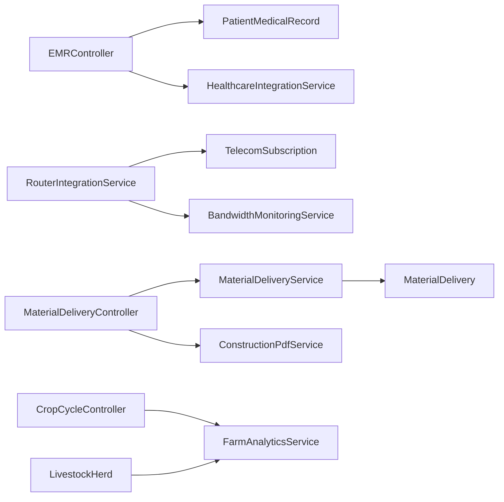

**Diagram sources**
- [EMRController.php:1-121](file://app/Http/Controllers/Healthcare/EMRController.php#L1-L121)
- [PatientMedicalRecord.php:1-274](file://app/Models/PatientMedicalRecord.php#L1-L274)
- [HealthcareIntegrationService.php:1-591](file://app/Services/HealthcareIntegrationService.php#L1-L591)
- [RouterIntegrationService.php:1-396](file://app/Services/Telecom/RouterIntegrationService.php#L1-L396)
- [BandwidthMonitoringService.php:1-144](file://app/Services/Telecom/BandwidthMonitoringService.php#L1-L144)
- [MaterialDeliveryController.php:1-82](file://app/Http/Controllers/Construction/MaterialDeliveryController.php#L1-L82)
- [MaterialDeliveryService.php:1-150](file://app/Services/MaterialDeliveryService.php#L1-L150)
- [MaterialDelivery.php:1-50](file://app/Models/MaterialDelivery.php#L1-L50)
- [ConstructionPdfService.php:1-94](file://app/Services/ConstructionPdfService.php#L1-L94)
- [CropCycleController.php:1-35](file://app/Http/Controllers/CropCycleController.php#L1-L35)
- [FarmAnalyticsService.php:1-160](file://app/Services/FarmAnalyticsService.php#L1-L160)
- [LivestockHerd.php:1-197](file://app/Models/LivestockHerd.php#L1-L197)

**Section sources**
- [healthcare.php:113-135](file://routes/healthcare.php#L113-L135)
- [web.php:2338-2347](file://routes/web.php#L2338-L2347)
- [web.php:1408-1418](file://routes/web.php#L1408-L1418)

## Performance Considerations
- Use pagination for EMR listings and material delivery summaries
- Cache device bandwidth usage to reduce router adapter calls
- Batch usage sync operations to minimize database writes
- Optimize analytics queries with appropriate indexing on timestamps and tenant_id
- Encrypt sensitive telecom credentials and avoid logging raw secrets

[No sources needed since this section provides general guidance]

## Troubleshooting Guide
- Healthcare integration failures: inspect HL7 message status, acknowledgments, and error messages; verify BPJS API credentials and signatures
- Router operations: confirm device connectivity, adapter compatibility, and transaction rollbacks on errors
- Material delivery discrepancies: reconcile quantity_ordered vs quantity_delivered and quality_check_status
- Telecom quota exceeded: reset quota and recalculate next reset date; verify package rollover settings
- Compliance and audit: ensure retention policies are met and anonymization is enabled for research logs

**Section sources**
- [HealthcareIntegrationService.php:490-515](file://app/Services/HealthcareIntegrationService.php#L490-L515)
- [RouterIntegrationService.php:135-142](file://app/Services/Telecom/RouterIntegrationService.php#L135-L142)
- [MaterialDeliveryService.php:116-129](file://app/Services/MaterialDeliveryService.php#L116-L129)
- [TelecomSubscription.php:195-224](file://app/Models/TelecomSubscription.php#L195-L224)
- [HEALTHCARE_REGULATORY_COMPLIANCE.md:1-44](file://docs/HEALTHCARE_REGULATORY_COMPLIANCE.md#L1-L44)

## Conclusion
Qalcuity ERP’s industry modules provide robust, integrated solutions tailored to healthcare interoperability, telecom router orchestration, construction project delivery, and agriculture/livestock operations. The modular design, strong compliance controls, and service-layer abstractions enable scalable customization and reliable integrations across domains.