# Agricultural Analytics

<cite>
**Referenced Files in This Document**
- [AgricultureController.php](file://app/Http/Controllers/AgricultureController.php)
- [WeatherIntegrationService.php](file://app/Services/WeatherIntegrationService.php)
- [PestDetectionService.php](file://app/Services/PestDetectionService.php)
- [IrrigationAutomationService.php](file://app/Services/IrrigationAutomationService.php)
- [MarketPriceMonitorService.php](file://app/Services/MarketPriceMonitorService.php)
- [FarmAnalyticsService.php](file://app/Services/FarmAnalyticsService.php)
- [FarmTools.php](file://app/Services/ERP/FarmTools.php)
- [GeminiService.php](file://app/Services/GeminiService.php)
- [CropCycle.php](file://app/Models/CropCycle.php)
- [FarmPlot.php](file://app/Models/FarmPlot.php)
- [HarvestLog.php](file://app/Models/HarvestLog.php)
- [FarmPlotActivity.php](file://app/Models/FarmPlotActivity.php)
- [IrrigationSchedule.php](file://app/Models/IrrigationSchedule.php)
- [PestDetection.php](file://app/Models/PestDetection.php)
- [WeatherData.php](file://app/Models/WeatherData.php)
- [2026_04_06_060000_create_agriculture_tables.php](file://database/migrations/2026_04_06_060000_create_agriculture_tables.php)
- [AnalyticsDashboardController.php](file://app/Http/Controllers/Analytics/AnalyticsDashboardController.php)
- [AdvancedAnalyticsDashboardController.php](file://app/Http/Controllers/Analytics/AdvancedAnalyticsDashboardController.php)
- [DashboardTools.php](file://app/Services/ERP/DashboardTools.php)
</cite>

## Table of Contents
1. [Introduction](#introduction)
2. [Project Structure](#project-structure)
3. [Core Components](#core-components)
4. [Architecture Overview](#architecture-overview)
5. [Detailed Component Analysis](#detailed-component-analysis)
6. [Dependency Analysis](#dependency-analysis)
7. [Performance Considerations](#performance-considerations)
8. [Troubleshooting Guide](#troubleshooting-guide)
9. [Conclusion](#conclusion)
10. [Appendices](#appendices)

## Introduction
This document describes the Agricultural Analytics and Reporting system within the qalcuityERP platform. It focuses on yield forecasting, production trend analysis, performance benchmarking, real-time dashboards, predictive analytics for weather, pest outbreaks, and market prices, automated reporting, compliance reporting, and stakeholder communication tools. The system integrates weather services, pest detection via AI, irrigation automation, market price monitoring, and farm analytics to deliver actionable insights for agricultural decision-making.

## Project Structure
The system is organized around:
- Controllers for agriculture and analytics dashboards
- Services for weather integration, pest detection, irrigation automation, market price monitoring, and advanced analytics
- Models representing farm plots, crop cycles, harvest logs, pest detections, and irrigation schedules
- Migration files defining the agricultural domain schema
- Blade templates for dashboards and reports

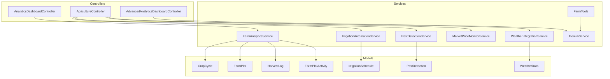

**Diagram sources**
- [AgricultureController.php:1-81](file://app/Http/Controllers/AgricultureController.php#L1-L81)
- [WeatherIntegrationService.php:126-170](file://app/Services/WeatherIntegrationService.php#L126-L170)
- [PestDetectionService.php:1-191](file://app/Services/PestDetectionService.php#L1-L191)
- [IrrigationAutomationService.php:1-222](file://app/Services/IrrigationAutomationService.php#L1-L222)
- [MarketPriceMonitorService.php:1-263](file://app/Services/MarketPriceMonitorService.php#L1-L263)
- [FarmAnalyticsService.php:1-41](file://app/Services/FarmAnalyticsService.php#L1-L41)
- [FarmTools.php:134-730](file://app/Services/ERP/FarmTools.php#L134-L730)
- [GeminiService.php:329-345](file://app/Services/GeminiService.php#L329-L345)
- [CropCycle.php:1-96](file://app/Models/CropCycle.php#L1-L96)
- [FarmPlot.php:1-104](file://app/Models/FarmPlot.php#L1-L104)
- [HarvestLog.php:1-80](file://app/Models/HarvestLog.php#L1-L80)
- [FarmPlotActivity.php:1-48](file://app/Models/FarmPlotActivity.php#L1-L48)
- [IrrigationSchedule.php:1-94](file://app/Models/IrrigationSchedule.php#L1-L94)
- [PestDetection.php:1-55](file://app/Models/PestDetection.php#L1-L55)
- [WeatherData.php:140-181](file://app/Models/WeatherData.php#L140-L181)

**Section sources**
- [AgricultureController.php:1-81](file://app/Http/Controllers/AgricultureController.php#L1-L81)
- [AnalyticsDashboardController.php:1-185](file://app/Http/Controllers/Analytics/AnalyticsDashboardController.php#L1-L185)
- [AdvancedAnalyticsDashboardController.php:1-667](file://app/Http/Controllers/Analytics/AdvancedAnalyticsDashboardController.php#L1-L667)

## Core Components
- Agriculture dashboard controller orchestrates weather, pest, irrigation, and market price data for a unified view.
- Weather integration service fetches current conditions and provides farming recommendations and harvest readiness predictions.
- Pest detection service analyzes plant images via AI and tracks detection history and severity statistics.
- Irrigation automation service generates schedules, adjusts for weather, records events, and computes water usage statistics.
- Market price monitor service records, trends, and alerts on commodity prices and provides selling recommendations.
- Farm analytics service computes cost breakdowns, cost per hectare, and comparative plot performance.
- Farm tools integrate with AI to log harvests, compute yield per hectare, HPP per kg, and produce comparative analyses.
- Models define the agricultural domain: crop cycles, farm plots, harvest logs, plot activities, irrigation schedules, pest detections, and weather data.

**Section sources**
- [AgricultureController.php:1-81](file://app/Http/Controllers/AgricultureController.php#L1-L81)
- [WeatherIntegrationService.php:126-170](file://app/Services/WeatherIntegrationService.php#L126-L170)
- [PestDetectionService.php:1-191](file://app/Services/PestDetectionService.php#L1-L191)
- [IrrigationAutomationService.php:1-222](file://app/Services/IrrigationAutomationService.php#L1-L222)
- [MarketPriceMonitorService.php:1-263](file://app/Services/MarketPriceMonitorService.php#L1-L263)
- [FarmAnalyticsService.php:1-41](file://app/Services/FarmAnalyticsService.php#L1-L41)
- [FarmTools.php:134-730](file://app/Services/ERP/FarmTools.php#L134-L730)
- [CropCycle.php:1-96](file://app/Models/CropCycle.php#L1-L96)
- [FarmPlot.php:1-104](file://app/Models/FarmPlot.php#L1-L104)
- [HarvestLog.php:1-80](file://app/Models/HarvestLog.php#L1-L80)
- [FarmPlotActivity.php:1-48](file://app/Models/FarmPlotActivity.php#L1-L48)
- [IrrigationSchedule.php:1-94](file://app/Models/IrrigationSchedule.php#L1-L94)
- [PestDetection.php:1-55](file://app/Models/PestDetection.php#L1-L55)
- [WeatherData.php:140-181](file://app/Models/WeatherData.php#L140-L181)

## Architecture Overview
The system follows a layered architecture:
- Presentation layer: Controllers render dashboards and handle requests.
- Application layer: Services encapsulate business logic for analytics, automation, and integrations.
- Domain layer: Models represent entities and relationships.
- Data layer: Migrations define agricultural schema.

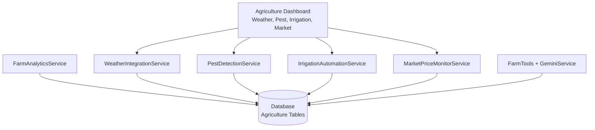

**Diagram sources**
- [AgricultureController.php:37-72](file://app/Http/Controllers/AgricultureController.php#L37-L72)
- [WeatherIntegrationService.php:126-170](file://app/Services/WeatherIntegrationService.php#L126-L170)
- [PestDetectionService.php:1-191](file://app/Services/PestDetectionService.php#L1-L191)
- [IrrigationAutomationService.php:1-222](file://app/Services/IrrigationAutomationService.php#L1-L222)
- [MarketPriceMonitorService.php:1-263](file://app/Services/MarketPriceMonitorService.php#L1-L263)
- [FarmAnalyticsService.php:1-41](file://app/Services/FarmAnalyticsService.php#L1-L41)
- [FarmTools.php:134-730](file://app/Services/ERP/FarmTools.php#L134-L730)
- [2026_04_06_060000_create_agriculture_tables.php:30-55](file://database/migrations/2026_04_06_060000_create_agriculture_tables.php#L30-L55)

## Detailed Component Analysis

### Agriculture Dashboard
The AgricultureController aggregates:
- Active crop cycles with pest detection counts
- Current weather and farming recommendations
- Upcoming irrigation schedules
- Market price summaries

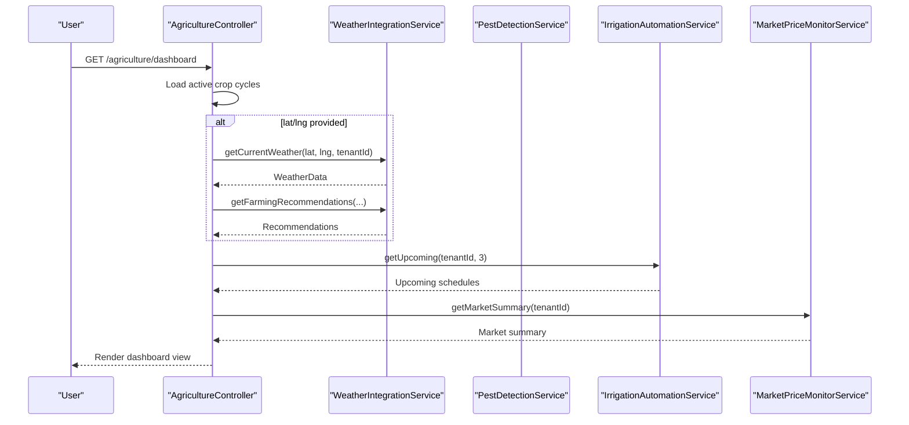

**Diagram sources**
- [AgricultureController.php:37-72](file://app/Http/Controllers/AgricultureController.php#L37-L72)
- [WeatherIntegrationService.php:144-153](file://app/Services/WeatherIntegrationService.php#L144-L153)
- [IrrigationAutomationService.php:110-119](file://app/Services/IrrigationAutomationService.php#L110-L119)
- [MarketPriceMonitorService.php:235-261](file://app/Services/MarketPriceMonitorService.php#L235-L261)

**Section sources**
- [AgricultureController.php:1-81](file://app/Http/Controllers/AgricultureController.php#L1-L81)

### Weather Integration and Forecasting
The WeatherIntegrationService retrieves current weather and provides:
- Farming recommendations
- Harvest readiness prediction based on crop type and days planted

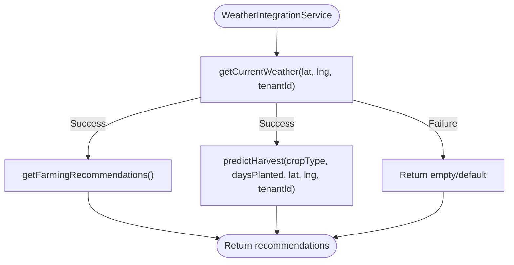

**Diagram sources**
- [WeatherIntegrationService.php:144-170](file://app/Services/WeatherIntegrationService.php#L144-L170)
- [WeatherData.php:148-181](file://app/Models/WeatherData.php#L148-L181)

**Section sources**
- [WeatherIntegrationService.php:126-170](file://app/Services/WeatherIntegrationService.php#L126-L170)
- [WeatherData.php:140-181](file://app/Models/WeatherData.php#L140-L181)

### Pest Detection and Outbreak Prediction
The PestDetectionService:
- Accepts plant photos, encodes them, and calls Gemini Vision
- Parses AI results into structured detection data
- Stores pest detections with severity and treatment recommendations
- Provides history and statistics

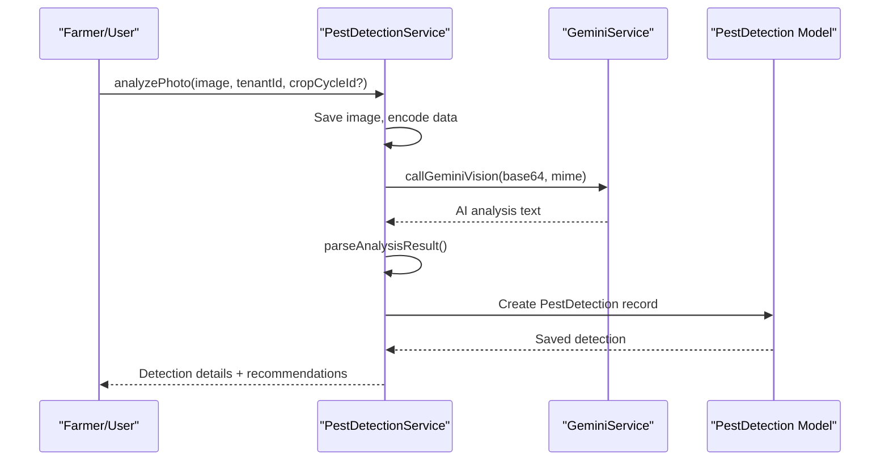

**Diagram sources**
- [PestDetectionService.php:22-72](file://app/Services/PestDetectionService.php#L22-L72)
- [PestDetectionService.php:77-149](file://app/Services/PestDetectionService.php#L77-L149)
- [PestDetection.php:1-55](file://app/Models/PestDetection.php#L1-L55)

**Section sources**
- [PestDetectionService.php:1-191](file://app/Services/PestDetectionService.php#L1-L191)
- [PestDetection.php:1-55](file://app/Models/PestDetection.php#L1-L55)

### Irrigation Automation and Water Efficiency
The IrrigationAutomationService:
- Generates automatic schedules based on crop type, growth stage, soil type, and method
- Adjusts schedules based on rainfall, temperature, and humidity
- Records irrigation events and computes water usage statistics

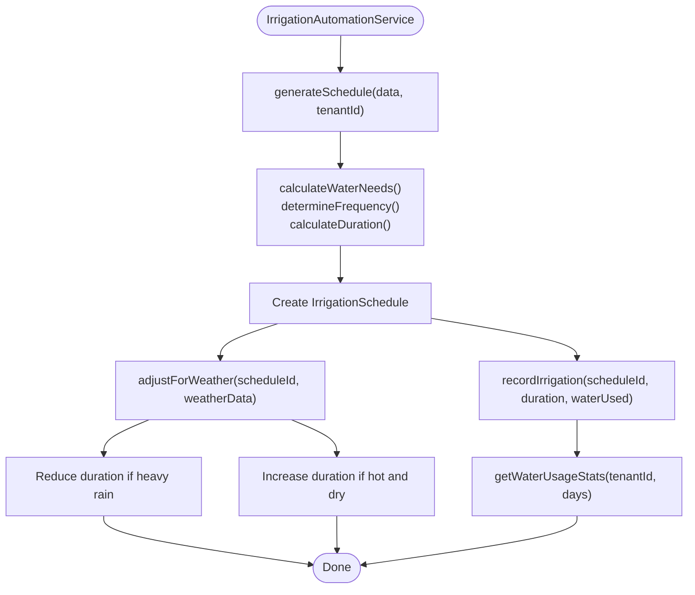

**Diagram sources**
- [IrrigationAutomationService.php:16-84](file://app/Services/IrrigationAutomationService.php#L16-L84)
- [IrrigationAutomationService.php:89-144](file://app/Services/IrrigationAutomationService.php#L89-L144)
- [IrrigationSchedule.php:61-93](file://app/Models/IrrigationSchedule.php#L61-L93)

**Section sources**
- [IrrigationAutomationService.php:1-222](file://app/Services/IrrigationAutomationService.php#L1-L222)
- [IrrigationSchedule.php:1-94](file://app/Models/IrrigationSchedule.php#L1-L94)

### Market Price Monitoring and Selling Recommendations
The MarketPriceMonitorService:
- Records manual prices and compares to previous entries
- Computes trends over configurable periods
- Provides selling recommendations based on recent peaks and trends
- Manages price alerts

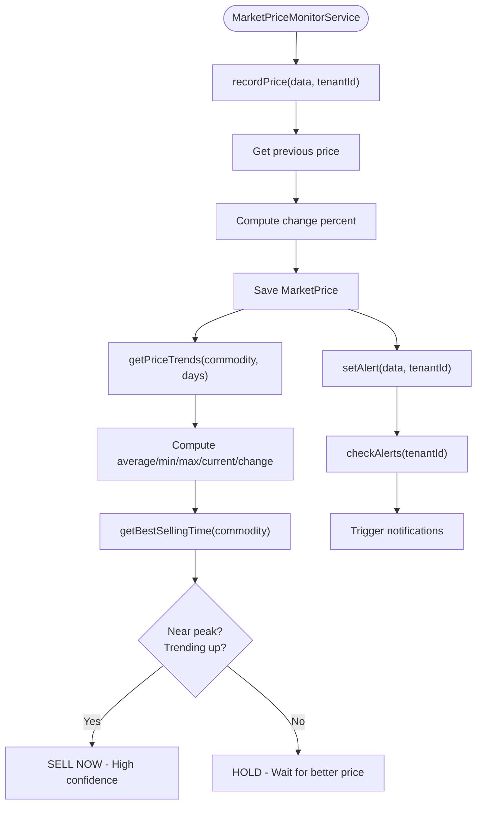

**Diagram sources**
- [MarketPriceMonitorService.php:15-47](file://app/Services/MarketPriceMonitorService.php#L15-L47)
- [MarketPriceMonitorService.php:80-129](file://app/Services/MarketPriceMonitorService.php#L80-L129)
- [MarketPriceMonitorService.php:185-230](file://app/Services/MarketPriceMonitorService.php#L185-L230)
- [MarketPriceMonitorService.php:134-180](file://app/Services/MarketPriceMonitorService.php#L134-L180)

**Section sources**
- [MarketPriceMonitorService.php:1-263](file://app/Services/MarketPriceMonitorService.php#L1-L263)

### Farm Analytics: Cost Breakdown and Benchmarking
The FarmAnalyticsService:
- Computes cost breakdown by activity type for a plot and optional cycle
- Calculates cost per hectare for a plot
- Supports comparative analysis across plots

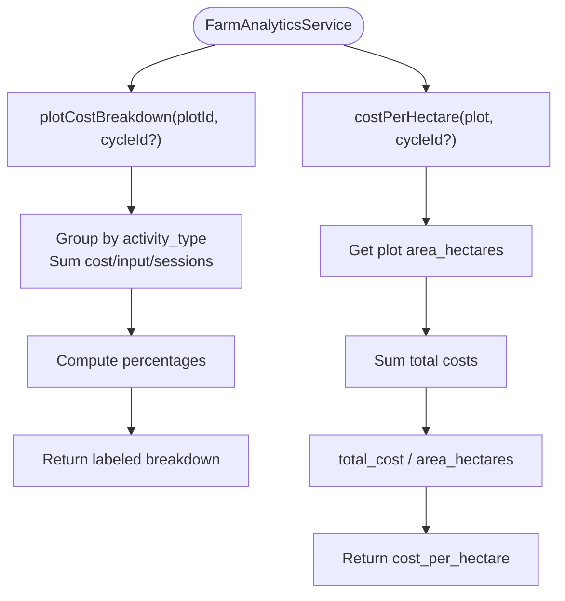

**Diagram sources**
- [FarmAnalyticsService.php:16-35](file://app/Services/FarmAnalyticsService.php#L16-L35)
- [FarmAnalyticsService.php:40-41](file://app/Services/FarmAnalyticsService.php#L40-L41)

**Section sources**
- [FarmAnalyticsService.php:1-41](file://app/Services/FarmAnalyticsService.php#L1-L41)

### Yield Forecasting and Input Efficiency via Farm Tools
FarmTools integrates with GeminiService to:
- Log harvests with grades, workers, and costs
- Compute yield per hectare, HPP per kg, and cost per hectare
- Provide comparative analysis across plots

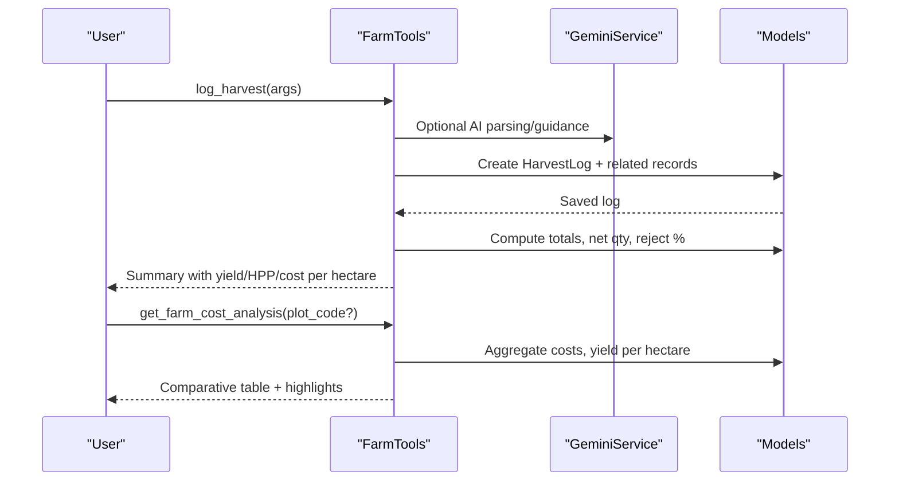

**Diagram sources**
- [FarmTools.php:134-189](file://app/Services/ERP/FarmTools.php#L134-L189)
- [FarmTools.php:671-730](file://app/Services/ERP/FarmTools.php#L671-L730)
- [GeminiService.php:329-345](file://app/Services/GeminiService.php#L329-L345)

**Section sources**
- [FarmTools.php:134-730](file://app/Services/ERP/FarmTools.php#L134-L730)
- [GeminiService.php:329-345](file://app/Services/GeminiService.php#L329-L345)

### Real-Time Dashboards and KPIs
The analytics controllers provide:
- Real-time KPIs (revenue, orders, inventory, customers)
- Revenue trends and top metrics
- Predictive analytics with AI insights
- Scheduled reports and export capabilities

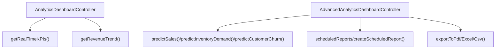

**Diagram sources**
- [AnalyticsDashboardController.php:26-140](file://app/Http/Controllers/Analytics/AnalyticsDashboardController.php#L26-L140)
- [AdvancedAnalyticsDashboardController.php:24-204](file://app/Http/Controllers/Analytics/AdvancedAnalyticsDashboardController.php#L24-L204)
- [AdvancedAnalyticsDashboardController.php:398-438](file://app/Http/Controllers/Analytics/AdvancedAnalyticsDashboardController.php#L398-L438)
- [AdvancedAnalyticsDashboardController.php:617-653](file://app/Http/Controllers/Analytics/AdvancedAnalyticsDashboardController.php#L617-L653)

**Section sources**
- [AnalyticsDashboardController.php:1-185](file://app/Http/Controllers/Analytics/AnalyticsDashboardController.php#L1-L185)
- [AdvancedAnalyticsDashboardController.php:1-667](file://app/Http/Controllers/Analytics/AdvancedAnalyticsDashboardController.php#L1-L667)

## Dependency Analysis
- Controllers depend on services for business logic.
- Services depend on models for persistence and on external APIs (weather, AI) via adapters.
- Farm analytics depends on domain models for cost and yield computations.
- Predictive analytics leverages caching and optional AI enhancement.

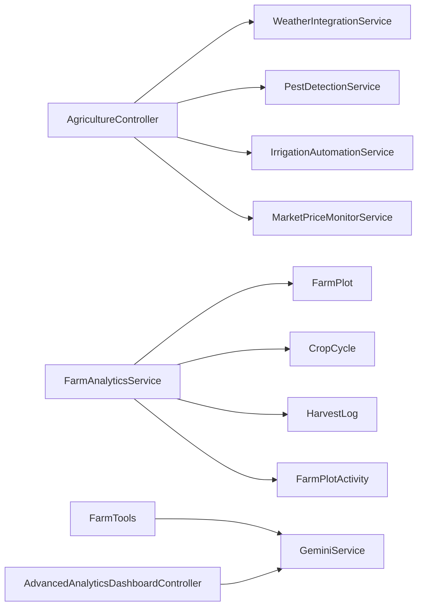

**Diagram sources**
- [AgricultureController.php:15-32](file://app/Http/Controllers/AgricultureController.php#L15-L32)
- [FarmAnalyticsService.php:1-41](file://app/Services/FarmAnalyticsService.php#L1-L41)
- [FarmTools.php:134-189](file://app/Services/ERP/FarmTools.php#L134-L189)
- [AdvancedAnalyticsDashboardController.php:227-237](file://app/Http/Controllers/Analytics/AdvancedAnalyticsDashboardController.php#L227-L237)

**Section sources**
- [AgricultureController.php:1-81](file://app/Http/Controllers/AgricultureController.php#L1-L81)
- [FarmAnalyticsService.php:1-41](file://app/Services/FarmAnalyticsService.php#L1-L41)
- [FarmTools.php:134-189](file://app/Services/ERP/FarmTools.php#L134-L189)
- [AdvancedAnalyticsDashboardController.php:209-246](file://app/Http/Controllers/Analytics/AdvancedAnalyticsDashboardController.php#L209-L246)

## Performance Considerations
- Caching: Advanced analytics controllers cache KPIs, trends, and predictions to reduce repeated computation.
- Aggregation: Farm analytics groups by activity type and computes percentages client-side for reduced DB load.
- Weather adjustments: Irrigation automation reduces unnecessary watering based on rainfall, saving water and energy.
- Trend analysis: Market price trends and seasonal analysis use rolling windows to balance accuracy and performance.

[No sources needed since this section provides general guidance]

## Troubleshooting Guide
- Weather integration failures: The service catches exceptions and returns empty arrays; verify credentials and network connectivity.
- Pest detection errors: Image encoding and AI parsing failures are logged; ensure image upload and Gemini API availability.
- Irrigation adjustments: If weather data is missing, durations remain unchanged; confirm weather service updates.
- Market price alerts: Alerts require latest price retrieval; verify cron jobs and data freshness.
- Farm analytics: Ensure plot area and activity cost data are populated; otherwise cost per hectare may be null.

**Section sources**
- [WeatherIntegrationService.php:135-138](file://app/Services/WeatherIntegrationService.php#L135-L138)
- [PestDetectionService.php:63-71](file://app/Services/PestDetectionService.php#L63-L71)
- [IrrigationAutomationService.php:53-84](file://app/Services/IrrigationAutomationService.php#L53-L84)
- [MarketPriceMonitorService.php:150-180](file://app/Services/MarketPriceMonitorService.php#L150-L180)

## Conclusion
The Agricultural Analytics and Reporting system integrates weather intelligence, pest detection, irrigation automation, and market monitoring to support informed decision-making. It provides real-time dashboards, predictive insights, and automated reporting to improve yield forecasting, input efficiency, and profitability while enabling compliance and stakeholder communication.

[No sources needed since this section summarizes without analyzing specific files]

## Appendices

### Key Performance Indicators (KPIs)
- Yield per hectare: computed from total harvest and plot area
- Cost per hectare: total activity costs divided by hectares
- HPP per kg: harvest cost divided by net quantity
- Input efficiency ratios: cost per unit of input applied
- Profitability metrics: revenue minus costs, margins, and turnover rates
- Resource utilization: irrigation water usage and schedule adherence
- Market timing: price trends and selling recommendations

**Section sources**
- [FarmTools.php:696-721](file://app/Services/ERP/FarmTools.php#L696-L721)
- [FarmAnalyticsService.php:40-41](file://app/Services/FarmAnalyticsService.php#L40-L41)
- [HarvestLog.php:41-66](file://app/Models/HarvestLog.php#L41-L66)
- [IrrigationAutomationService.php:124-144](file://app/Services/IrrigationAutomationService.php#L124-L144)
- [MarketPriceMonitorService.php:185-230](file://app/Services/MarketPriceMonitorService.php#L185-L230)

### Data Visualization Techniques
- Time series charts for revenue trends and price movements
- Bar charts for cost breakdowns by activity type
- Heatmaps for plot performance comparisons
- Scatter plots for inventory turnover and sales correlation
- Forecast bands with confidence intervals for predictive analytics

[No sources needed since this section provides general guidance]

### Trend Analysis Methodologies
- Moving averages and seasonal decomposition for revenue and demand
- Regression-based forecasting for sales and inventory
- RFM segmentation for customer retention modeling
- Variance analysis for cost centers and input categories

[No sources needed since this section provides general guidance]

### Decision Support Systems
- Automated recommendations for irrigation adjustments based on weather
- Pest outbreak risk scoring and treatment suggestions
- Market selling recommendations aligned with price trends
- Benchmarking tools comparing plots and activities

**Section sources**
- [IrrigationAutomationService.php:53-84](file://app/Services/IrrigationAutomationService.php#L53-L84)
- [PestDetectionService.php:115-149](file://app/Services/PestDetectionService.php#L115-L149)
- [MarketPriceMonitorService.php:185-230](file://app/Services/MarketPriceMonitorService.php#L185-L230)
- [FarmTools.php:696-721](file://app/Services/ERP/FarmTools.php#L696-L721)