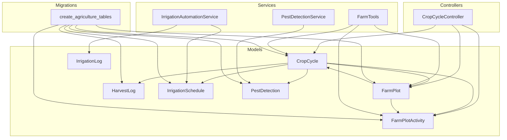
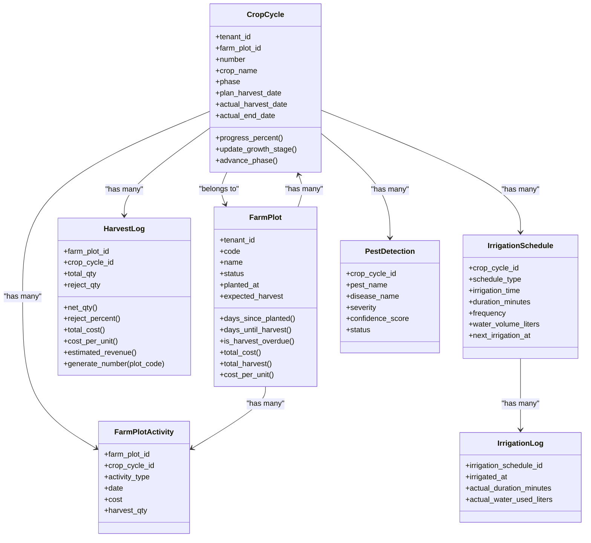
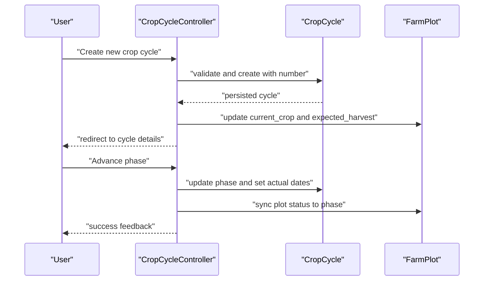
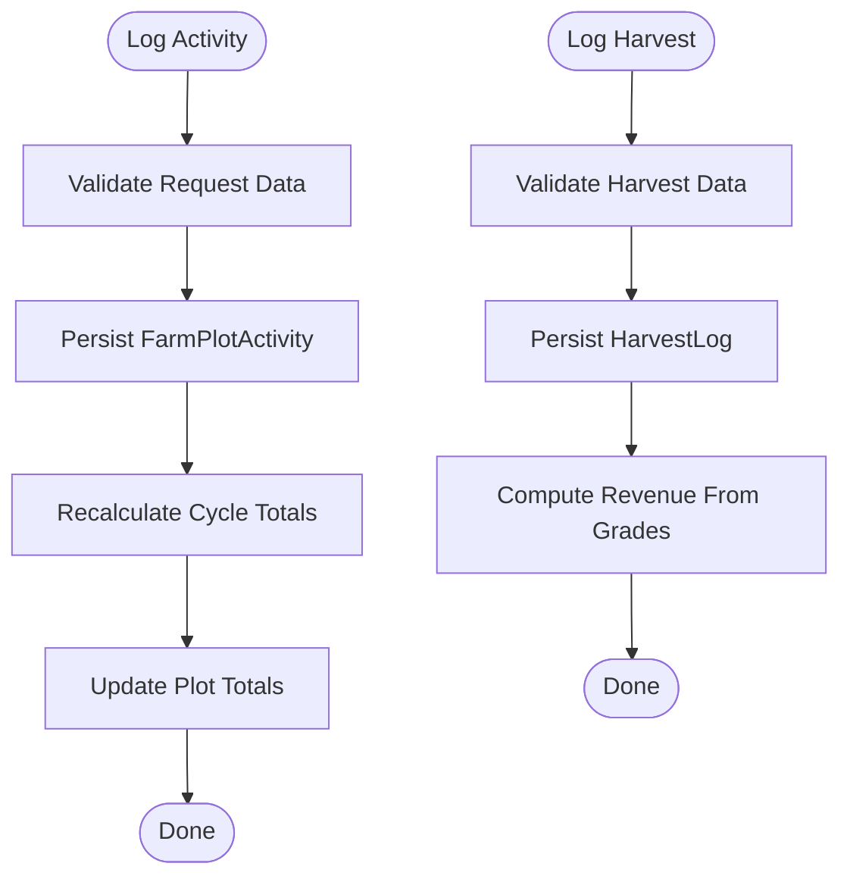
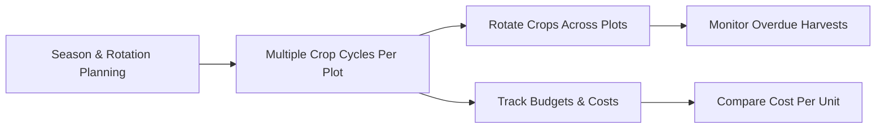
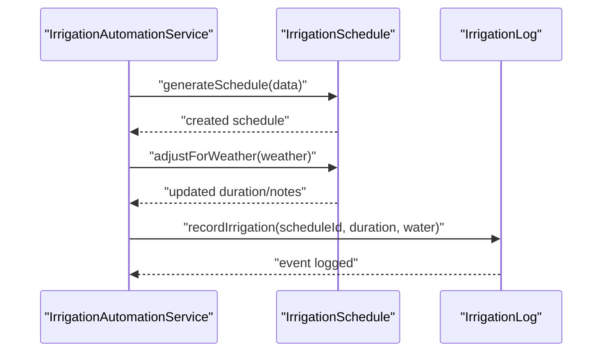
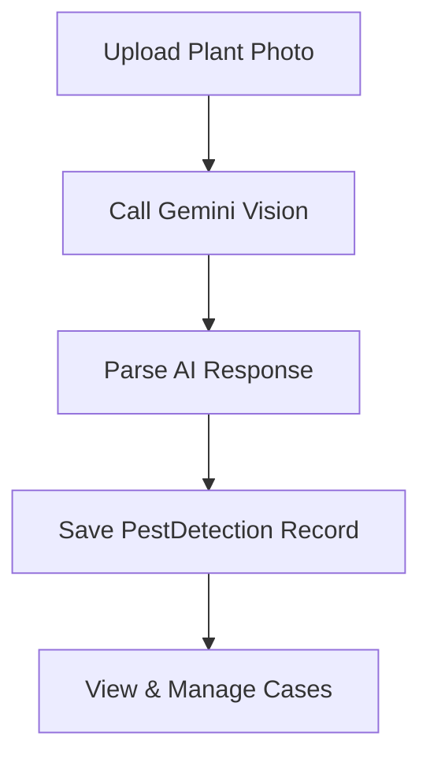
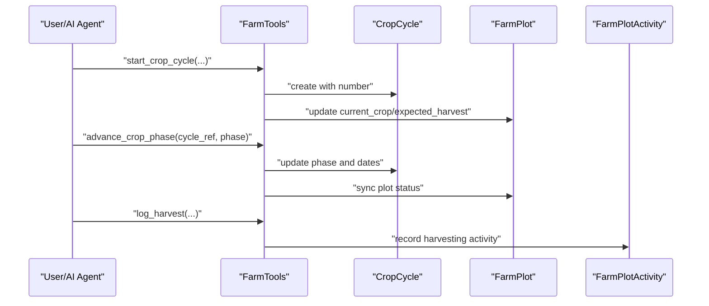
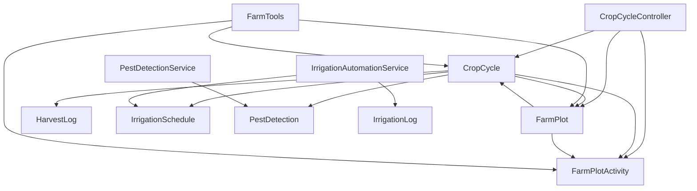

# Crop Cycle Management

<cite>
**Referenced Files in This Document**
- [CropCycle.php](file://app/Models/CropCycle.php)
- [FarmPlot.php](file://app/Models/FarmPlot.php)
- [FarmPlotActivity.php](file://app/Models/FarmPlotActivity.php)
- [HarvestLog.php](file://app/Models/HarvestLog.php)
- [IrrigationLog.php](file://app/Models/IrrigationLog.php)
- [IrrigationSchedule.php](file://app/Models/IrrigationSchedule.php)
- [CropCycleController.php](file://app/Http/Controllers/CropCycleController.php)
- [FarmTools.php](file://app/Services/ERP/FarmTools.php)
- [IrrigationAutomationService.php](file://app/Services/IrrigationAutomationService.php)
- [PestDetection.php](file://app/Models/PestDetection.php)
- [PestDetectionService.php](file://app/Services/PestDetectionService.php)
- [2026_04_06_060000_create_agriculture_tables.php](file://database/migrations/2026_04_06_060000_create_agriculture_tables.php)
</cite>

## Table of Contents
1. [Introduction](#introduction)
2. [Project Structure](#project-structure)
3. [Core Components](#core-components)
4. [Architecture Overview](#architecture-overview)
5. [Detailed Component Analysis](#detailed-component-analysis)
6. [Dependency Analysis](#dependency-analysis)
7. [Performance Considerations](#performance-considerations)
8. [Troubleshooting Guide](#troubleshooting-guide)
9. [Conclusion](#conclusion)
10. [Appendices](#appendices)

## Introduction
This document describes the crop cycle management system within the agricultural domain of the ERP. It covers the lifecycle of agricultural production cycles from planning to post-harvest, including automatic numbering, phase tracking, status management, and activity logging. It also documents the four-phase progression (land preparation, planting, growing stages, and post-harvest), integration with farm plot management, and connections to activity tracking, irrigation automation, and pest detection systems.

## Project Structure
The crop cycle management spans models, controllers, services, and migrations that collectively manage planning, scheduling, monitoring, and reporting of agricultural activities.

**Diagram sources**
- [CropCycle.php:11-96](file://app/Models/CropCycle.php#L11-L96)
- [FarmPlot.php:11-104](file://app/Models/FarmPlot.php#L11-L104)
- [FarmPlotActivity.php:10-48](file://app/Models/FarmPlotActivity.php#L10-L48)
- [HarvestLog.php:11-80](file://app/Models/HarvestLog.php#L11-L80)
- [IrrigationLog.php:10-39](file://app/Models/IrrigationLog.php#L10-L39)
- [IrrigationSchedule.php:11-53](file://app/Models/IrrigationSchedule.php#L11-L53)
- [PestDetection.php:10-55](file://app/Models/PestDetection.php#L10-L55)
- [CropCycleController.php:11-178](file://app/Http/Controllers/CropCycleController.php#L11-L178)
- [FarmTools.php:9-200](file://app/Services/ERP/FarmTools.php#L9-L200)
- [IrrigationAutomationService.php:11-221](file://app/Services/IrrigationAutomationService.php#L11-L221)
- [PestDetectionService.php:10-191](file://app/Services/PestDetectionService.php#L10-L191)
- [2026_04_06_060000_create_agriculture_tables.php:101-121](file://database/migrations/2026_04_06_060000_create_agriculture_tables.php#L101-L121)

**Section sources**
- [CropCycle.php:11-96](file://app/Models/CropCycle.php#L11-L96)
- [FarmPlot.php:11-104](file://app/Models/FarmPlot.php#L11-L104)
- [FarmPlotActivity.php:10-48](file://app/Models/FarmPlotActivity.php#L10-L48)
- [HarvestLog.php:11-80](file://app/Models/HarvestLog.php#L11-L80)
- [IrrigationLog.php:10-39](file://app/Models/IrrigationLog.php#L10-L39)
- [IrrigationSchedule.php:11-53](file://app/Models/IrrigationSchedule.php#L11-L53)
- [CropCycleController.php:11-178](file://app/Http/Controllers/CropCycleController.php#L11-L178)
- [FarmTools.php:9-200](file://app/Services/ERP/FarmTools.php#L9-L200)
- [IrrigationAutomationService.php:11-221](file://app/Services/IrrigationAutomationService.php#L11-L221)
- [PestDetectionService.php:10-191](file://app/Services/PestDetectionService.php#L10-L191)
- [2026_04_06_060000_create_agriculture_tables.php:101-121](file://database/migrations/2026_04_06_060000_create_agriculture_tables.php#L101-L121)

## Core Components
- CropCycle: central entity representing a single crop production cycle with planning, scheduling, progress tracking, and status management.
- FarmPlot: field or plot entity with lifecycle status synchronized to active crop cycles.
- FarmPlotActivity: granular activity logging for inputs, costs, and harvest quantities per plot and cycle.
- HarvestLog: detailed post-harvest records including grades, workers, and costs.
- IrrigationSchedule/IrrigationLog: automated and recorded irrigation planning and execution.
- PestDetection/PestDetectionService: AI-powered pest and disease detection with treatment recommendations.
- CropCycleController: CRUD and lifecycle operations for crop cycles, including phase advancement and activity logging.
- FarmTools: orchestration service exposing tool-like functions for creating plots, cycles, advancing phases, and logging harvests.
- IrrigationAutomationService: generates and adjusts irrigation schedules and records events.
- Migration: creates agriculture-related tables and indices.

**Section sources**
- [CropCycle.php:11-96](file://app/Models/CropCycle.php#L11-L96)
- [FarmPlot.php:11-104](file://app/Models/FarmPlot.php#L11-L104)
- [FarmPlotActivity.php:10-48](file://app/Models/FarmPlotActivity.php#L10-L48)
- [HarvestLog.php:11-80](file://app/Models/HarvestLog.php#L11-L80)
- [IrrigationSchedule.php:11-53](file://app/Models/IrrigationSchedule.php#L11-L53)
- [IrrigationLog.php:10-39](file://app/Models/IrrigationLog.php#L10-L39)
- [PestDetection.php:10-55](file://app/Models/PestDetection.php#L10-L55)
- [CropCycleController.php:11-178](file://app/Http/Controllers/CropCycleController.php#L11-L178)
- [FarmTools.php:9-200](file://app/Services/ERP/FarmTools.php#L9-L200)
- [IrrigationAutomationService.php:11-221](file://app/Services/IrrigationAutomationService.php#L11-L221)
- [2026_04_06_060000_create_agriculture_tables.php:101-121](file://database/migrations/2026_04_06_060000_create_agriculture_tables.php#L101-L121)

## Architecture Overview
The system follows a layered architecture:
- Presentation: Controllers handle HTTP requests and render views.
- Domain: Models encapsulate business entities and relationships.
- Services: Orchestrate cross-cutting operations (agricultural tools, irrigation automation, pest detection).
- Persistence: Migrations define the schema for crop cycles, plots, activities, harvests, irrigation, and pest detection.

**Diagram sources**
- [CropCycle.php:11-96](file://app/Models/CropCycle.php#L11-L96)
- [FarmPlot.php:11-104](file://app/Models/FarmPlot.php#L11-L104)
- [FarmPlotActivity.php:10-48](file://app/Models/FarmPlotActivity.php#L10-L48)
- [HarvestLog.php:11-80](file://app/Models/HarvestLog.php#L11-L80)
- [IrrigationSchedule.php:11-53](file://app/Models/IrrigationSchedule.php#L11-L53)
- [IrrigationLog.php:10-39](file://app/Models/IrrigationLog.php#L10-L39)
- [PestDetection.php:10-55](file://app/Models/PestDetection.php#L10-L55)

## Detailed Component Analysis

### Crop Cycle Lifecycle and Phase Management
- Planning: Create a cycle with crop name, variety, season, planned dates, target yield, budget, and seed details. Automatic numbering is generated per tenant and plot code.
- Phase Tracking: Four-phase progression includes land preparation, planting, growing stages (vegetative/generative), and post-harvest. Phases can be advanced manually or automatically.
- Status Synchronization: Plot status mirrors current cycle phase (preparing, planted, growing, harvesting, post_harvest, idle).
- Progress Metrics: Days since planted, days to harvest, and progress percentage computed dynamically.

**Diagram sources**
- [CropCycleController.php:57-92](file://app/Http/Controllers/CropCycleController.php#L57-L92)
- [CropCycleController.php:94-145](file://app/Http/Controllers/CropCycleController.php#L94-L145)
- [CropCycle.php:77-94](file://app/Models/CropCycle.php#L77-L94)
- [FarmPlot.php:55-58](file://app/Models/FarmPlot.php#L55-L58)

**Section sources**
- [CropCycleController.php:57-92](file://app/Http/Controllers/CropCycleController.php#L57-L92)
- [CropCycleController.php:94-145](file://app/Http/Controllers/CropCycleController.php#L94-L145)
- [CropCycle.php:15-41](file://app/Models/CropCycle.php#L15-L41)
- [CropCycle.php:56-75](file://app/Models/CropCycle.php#L56-L75)
- [FarmPlot.php:55-58](file://app/Models/FarmPlot.php#L55-L58)

### Activity Logging and Cost Tracking
- Activities are logged per cycle and plot with type, date, inputs, quantities, unit, cost, and optional harvest details.
- Aggregates: cost by activity type, total cost, total harvest, and cost per unit are computed at the plot level.
- Harvest logging captures total quantity, rejects, moisture, storage, labor, transport, and estimated revenue via grades.

**Diagram sources**
- [FarmPlotActivity.php:10-48](file://app/Models/FarmPlotActivity.php#L10-L48)
- [FarmPlot.php:85-102](file://app/Models/FarmPlot.php#L85-L102)
- [HarvestLog.php:11-80](file://app/Models/HarvestLog.php#L11-L80)
- [CropCycleController.php:147-176](file://app/Http/Controllers/CropCycleController.php#L147-L176)

**Section sources**
- [FarmPlotActivity.php:13-27](file://app/Models/FarmPlotActivity.php#L13-L27)
- [FarmPlotActivity.php:29-39](file://app/Models/FarmPlotActivity.php#L29-L39)
- [FarmPlot.php:85-102](file://app/Models/FarmPlot.php#L85-L102)
- [HarvestLog.php:41-72](file://app/Models/HarvestLog.php#L41-L72)
- [CropCycleController.php:147-176](file://app/Http/Controllers/CropCycleController.php#L147-L176)

### Season Planning, Rotation Strategies, and Resource Allocation
- Season planning: cycles capture season and planned dates to coordinate planting and harvesting windows.
- Rotation strategies: multiple cycles per plot enable rotation tracking; plots maintain current crop and expected harvest date.
- Resource allocation: budgets, seed quantities, and costs are tracked per cycle; plots compute cost per unit harvested.

**Diagram sources**
- [FarmPlot.php:14-29](file://app/Models/FarmPlot.php#L14-L29)
- [FarmPlot.php:77-83](file://app/Models/FarmPlot.php#L77-L83)
- [FarmPlot.php:97-102](file://app/Models/FarmPlot.php#L97-L102)
- [CropCycleController.php:57-92](file://app/Http/Controllers/CropCycleController.php#L57-L92)

**Section sources**
- [FarmPlot.php:14-29](file://app/Models/FarmPlot.php#L14-L29)
- [FarmPlot.php:77-83](file://app/Models/FarmPlot.php#L77-L83)
- [FarmPlot.php:97-102](file://app/Models/FarmPlot.php#L97-L102)
- [CropCycleController.php:57-92](file://app/Http/Controllers/CropCycleController.php#L57-L92)

### Irrigation Automation and Monitoring
- Scheduling: intelligent generation of irrigation schedules based on crop type, area, growth stage, soil type, and method.
- Weather adjustment: dynamic adjustments to duration based on rainfall and temperature.
- Logging: recording actual durations and water usage per scheduled event.

**Diagram sources**
- [IrrigationAutomationService.php:16-48](file://app/Services/IrrigationAutomationService.php#L16-L48)
- [IrrigationAutomationService.php:53-84](file://app/Services/IrrigationAutomationService.php#L53-L84)
- [IrrigationAutomationService.php:89-105](file://app/Services/IrrigationAutomationService.php#L89-L105)
- [IrrigationSchedule.php:11-53](file://app/Models/IrrigationSchedule.php#L11-L53)
- [IrrigationLog.php:10-39](file://app/Models/IrrigationLog.php#L10-L39)

**Section sources**
- [IrrigationAutomationService.php:16-48](file://app/Services/IrrigationAutomationService.php#L16-L48)
- [IrrigationAutomationService.php:53-84](file://app/Services/IrrigationAutomationService.php#L53-L84)
- [IrrigationAutomationService.php:89-105](file://app/Services/IrrigationAutomationService.php#L89-L105)
- [IrrigationSchedule.php:15-46](file://app/Models/IrrigationSchedule.php#L15-L46)
- [IrrigationLog.php:14-28](file://app/Models/IrrigationLog.php#L14-L28)

### Pest Detection and Treatment Recommendations
- AI-powered analysis of plant photos to detect pests/diseases, severity, confidence, and recommendations.
- Persistent records with status tracking and severity color coding.

**Diagram sources**
- [PestDetectionService.php:22-72](file://app/Services/PestDetectionService.php#L22-L72)
- [PestDetectionService.php:115-149](file://app/Services/PestDetectionService.php#L115-L149)
- [PestDetection.php:14-39](file://app/Models/PestDetection.php#L14-L39)

**Section sources**
- [PestDetectionService.php:22-72](file://app/Services/PestDetectionService.php#L22-L72)
- [PestDetectionService.php:115-149](file://app/Services/PestDetectionService.php#L115-L149)
- [PestDetection.php:50-55](file://app/Models/PestDetection.php#L50-L55)

### Tool-Based Operations (FarmTools)
- Functions for creating plots, updating statuses, recording activities, starting crop cycles, listing cycles, advancing phases, and logging harvests.
- These functions integrate with CropCycle, FarmPlot, and FarmPlotActivity models.

**Diagram sources**
- [FarmTools.php:88-135](file://app/Services/ERP/FarmTools.php#L88-L135)
- [FarmTools.php:498-530](file://app/Services/ERP/FarmTools.php#L498-L530)
- [FarmTools.php:532-560](file://app/Services/ERP/FarmTools.php#L532-L560)
- [CropCycleController.php:57-92](file://app/Http/Controllers/CropCycleController.php#L57-L92)
- [CropCycleController.php:94-145](file://app/Http/Controllers/CropCycleController.php#L94-L145)
- [FarmPlotActivity.php:10-48](file://app/Models/FarmPlotActivity.php#L10-L48)

**Section sources**
- [FarmTools.php:88-135](file://app/Services/ERP/FarmTools.php#L88-L135)
- [FarmTools.php:498-530](file://app/Services/ERP/FarmTools.php#L498-L530)
- [FarmTools.php:532-560](file://app/Services/ERP/FarmTools.php#L532-L560)
- [CropCycleController.php:57-92](file://app/Http/Controllers/CropCycleController.php#L57-L92)
- [CropCycleController.php:94-145](file://app/Http/Controllers/CropCycleController.php#L94-L145)
- [FarmPlotActivity.php:13-17](file://app/Models/FarmPlotActivity.php#L13-L17)

## Dependency Analysis
- CropCycle depends on FarmPlot (many-to-one), FarmPlotActivity (one-to-many), HarvestLog (one-to-many), IrrigationSchedule (one-to-many), and PestDetection (one-to-many).
- FarmPlot depends on FarmPlotActivity and CropCycle.
- Controllers depend on models and services for orchestration.
- Services encapsulate cross-domain logic (irrigation automation, pest detection, and farm tools).

**Diagram sources**
- [CropCycleController.php:11-178](file://app/Http/Controllers/CropCycleController.php#L11-L178)
- [CropCycle.php:11-96](file://app/Models/CropCycle.php#L11-L96)
- [FarmPlot.php:11-104](file://app/Models/FarmPlot.php#L11-L104)
- [FarmPlotActivity.php:10-48](file://app/Models/FarmPlotActivity.php#L10-L48)
- [HarvestLog.php:11-80](file://app/Models/HarvestLog.php#L11-L80)
- [IrrigationSchedule.php:11-53](file://app/Models/IrrigationSchedule.php#L11-L53)
- [IrrigationLog.php:10-39](file://app/Models/IrrigationLog.php#L10-L39)
- [PestDetection.php:10-55](file://app/Models/PestDetection.php#L10-L55)
- [IrrigationAutomationService.php:11-221](file://app/Services/IrrigationAutomationService.php#L11-L221)
- [PestDetectionService.php:10-191](file://app/Services/PestDetectionService.php#L10-L191)
- [FarmTools.php:9-200](file://app/Services/ERP/FarmTools.php#L9-L200)

**Section sources**
- [CropCycleController.php:11-178](file://app/Http/Controllers/CropCycleController.php#L11-L178)
- [CropCycle.php:11-96](file://app/Models/CropCycle.php#L11-L96)
- [FarmPlot.php:11-104](file://app/Models/FarmPlot.php#L11-L104)
- [FarmPlotActivity.php:10-48](file://app/Models/FarmPlotActivity.php#L10-L48)
- [HarvestLog.php:11-80](file://app/Models/HarvestLog.php#L11-L80)
- [IrrigationSchedule.php:11-53](file://app/Models/IrrigationSchedule.php#L11-L53)
- [IrrigationLog.php:10-39](file://app/Models/IrrigationLog.php#L10-L39)
- [PestDetection.php:10-55](file://app/Models/PestDetection.php#L10-L55)
- [IrrigationAutomationService.php:11-221](file://app/Services/IrrigationAutomationService.php#L11-L221)
- [PestDetectionService.php:10-191](file://app/Services/PestDetectionService.php#L10-L191)
- [FarmTools.php:9-200](file://app/Services/ERP/FarmTools.php#L9-L200)

## Performance Considerations
- Indexing: The irrigation schedule migration includes composite indexing for tenant and active status to improve query performance.
- Aggregation: Plot-level computations (total cost, total harvest, cost per unit) rely on aggregated queries; ensure appropriate indexing on activity and log tables.
- AI Processing: Pest detection calls external APIs; batch processing and caching can reduce latency and cost.
- Pagination: Controllers paginate crop cycles and activities to limit payload sizes.

**Section sources**
- [2026_04_06_060000_create_agriculture_tables.php:113-121](file://database/migrations/2026_04_06_060000_create_agriculture_tables.php#L113-L121)
- [FarmPlot.php:85-102](file://app/Models/FarmPlot.php#L85-L102)
- [PestDetectionService.php:22-72](file://app/Services/PestDetectionService.php#L22-L72)

## Troubleshooting Guide
- Phase Advancement Conflicts: Ensure the cycle belongs to the authenticated tenant before updating phase. Actual dates are set only once per phase to avoid overwriting.
- Plot Status Sync: When advancing phases, plot status is synchronized; verify that the target phase maps correctly to the intended plot status.
- Harvest Logging: Use the dedicated function to generate harvest numbers and compute net quantity, reject percentage, and cost per unit.
- Irrigation Logs: Confirm schedule exists and record actual durations and water volumes to keep totals accurate.
- Pest Detection: Validate AI response parsing; fallback logic ensures minimal failure impact.

**Section sources**
- [CropCycleController.php:94-145](file://app/Http/Controllers/CropCycleController.php#L94-L145)
- [HarvestLog.php:74-78](file://app/Models/HarvestLog.php#L74-L78)
- [IrrigationLog.php:14-28](file://app/Models/IrrigationLog.php#L14-L28)
- [PestDetectionService.php:115-149](file://app/Services/PestDetectionService.php#L115-L149)

## Conclusion
The crop cycle management system integrates planning, scheduling, monitoring, and post-harvest tracking with robust activity logging, irrigation automation, and AI-driven pest detection. It supports season planning, rotation strategies, and efficient resource allocation while maintaining clear phase progression and status synchronization across plots and cycles.

## Appendices

### Data Model Definitions
- CropCycle: identifiers, planning and actual dates, growth stage, yield estimates, status, and metadata.
- FarmPlot: plot identification, area, location, soil and irrigation types, current crop, status, and lifecycle metrics.
- FarmPlotActivity: activity type, date, inputs, quantities, unit, cost, and optional harvest details.
- HarvestLog: total quantity, reject quantity, moisture, grades, workers, labor and transport costs, and computed metrics.
- IrrigationSchedule/IrrigationLog: schedule parameters and actual irrigation events.
- PestDetection: detection results, severity, confidence, and treatment recommendations.

**Section sources**
- [CropCycle.php:15-41](file://app/Models/CropCycle.php#L15-L41)
- [FarmPlot.php:14-30](file://app/Models/FarmPlot.php#L14-L30)
- [FarmPlotActivity.php:13-27](file://app/Models/FarmPlotActivity.php#L13-L27)
- [HarvestLog.php:14-32](file://app/Models/HarvestLog.php#L14-L32)
- [IrrigationSchedule.php:15-46](file://app/Models/IrrigationSchedule.php#L15-L46)
- [IrrigationLog.php:14-28](file://app/Models/IrrigationLog.php#L14-L28)
- [PestDetection.php:14-39](file://app/Models/PestDetection.php#L14-L39)