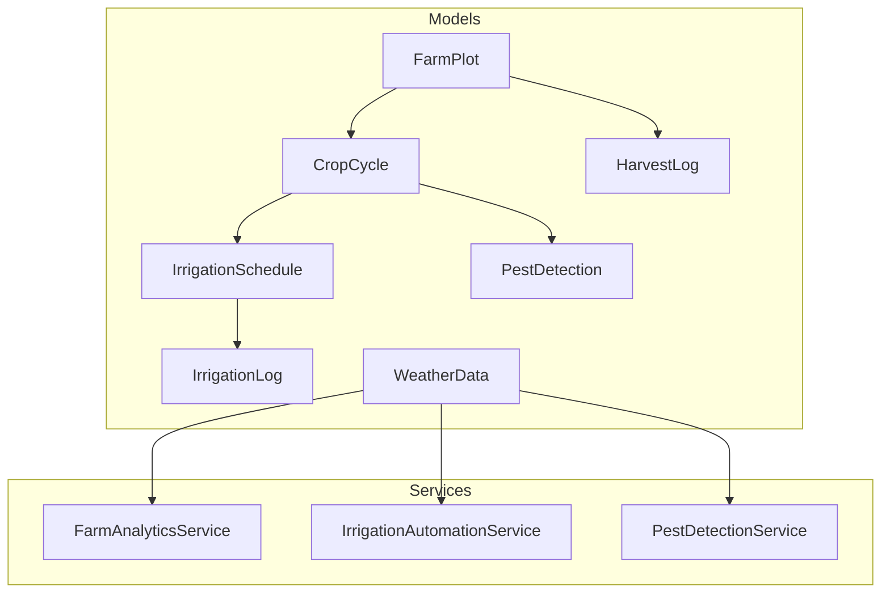
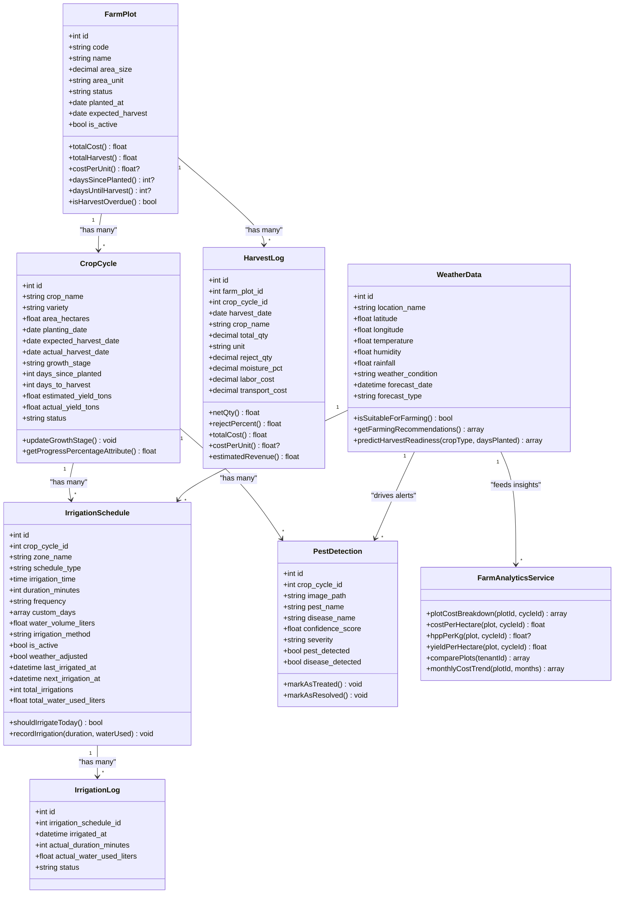
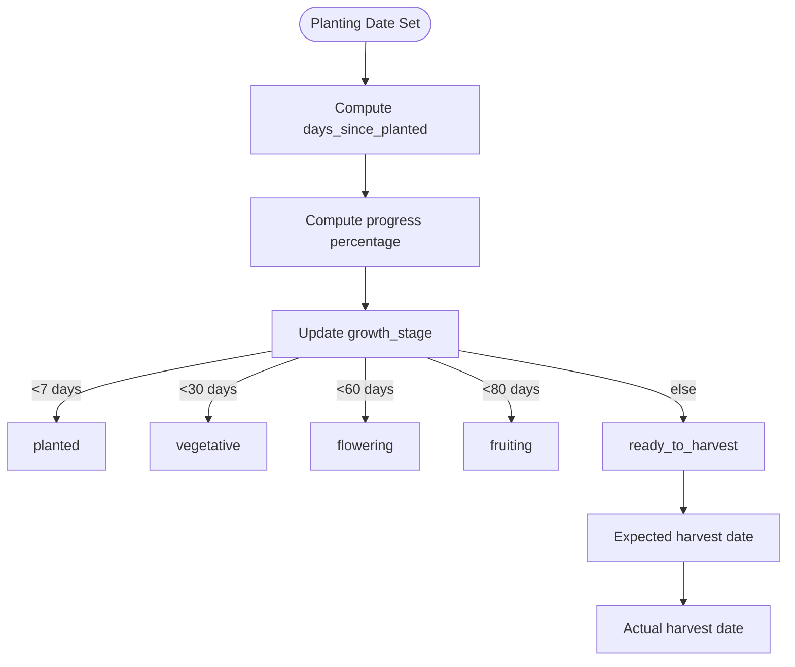
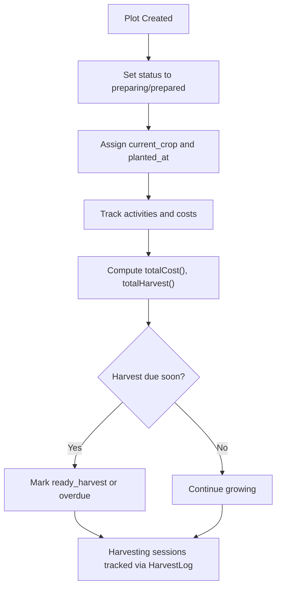
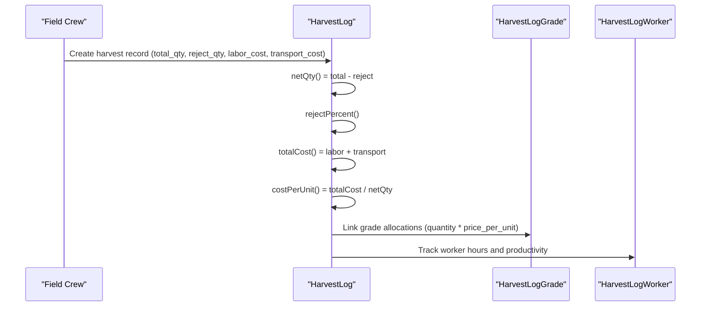
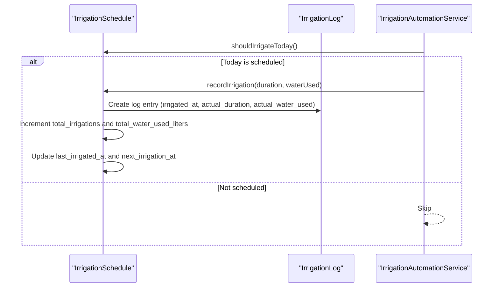
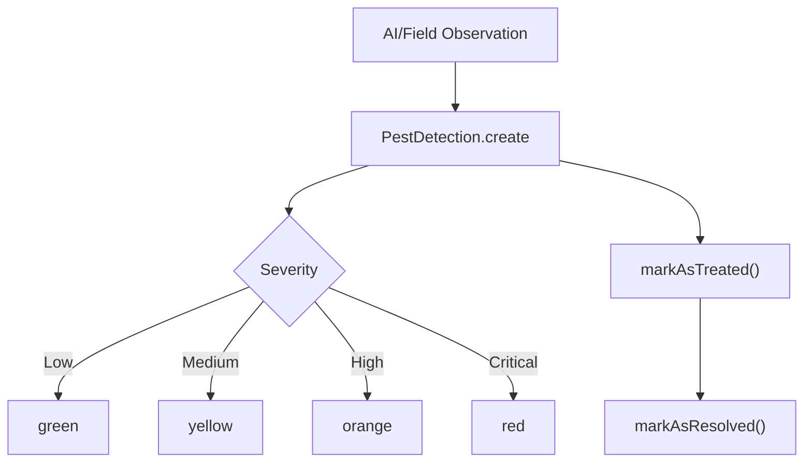
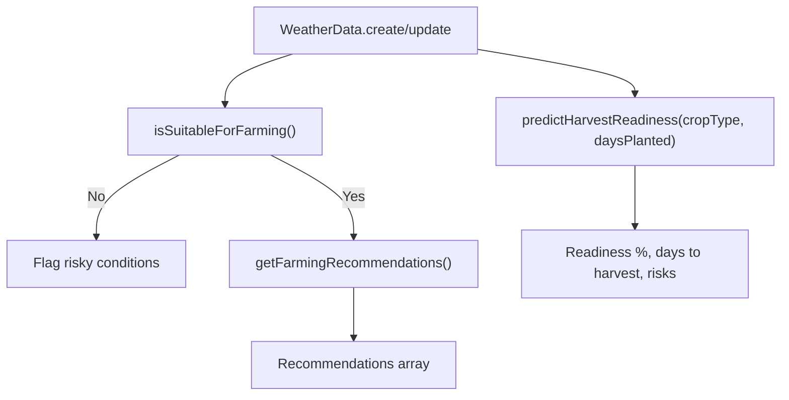
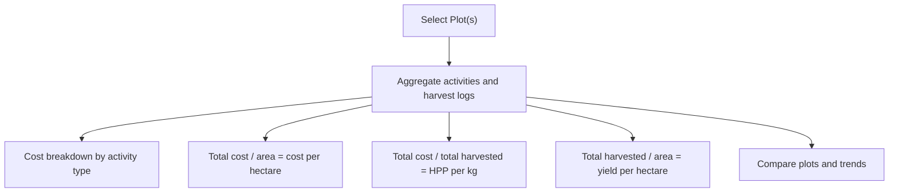
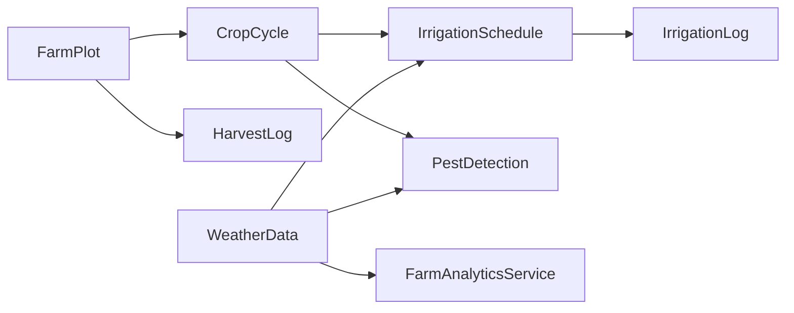

# Crop Production Management

<cite>
**Referenced Files in This Document**
- [CropCycle.php](file://app/Models/CropCycle.php)
- [FarmPlot.php](file://app/Models/FarmPlot.php)
- [HarvestLog.php](file://app/Models/HarvestLog.php)
- [IrrigationLog.php](file://app/Models/IrrigationLog.php)
- [IrrigationSchedule.php](file://app/Models/IrrigationSchedule.php)
- [PestDetection.php](file://app/Models/PestDetection.php)
- [WeatherData.php](file://app/Models/WeatherData.php)
- [FarmAnalyticsService.php](file://app/Services/FarmAnalyticsService.php)
- [IrrigationAutomationService.php](file://app/Services/IrrigationAutomationService.php)
- [PestDetectionService.php](file://app/Services/PestDetectionService.php)
</cite>

## Table of Contents
1. [Introduction](#introduction)
2. [Project Structure](#project-structure)
3. [Core Components](#core-components)
4. [Architecture Overview](#architecture-overview)
5. [Detailed Component Analysis](#detailed-component-analysis)
6. [Dependency Analysis](#dependency-analysis)
7. [Performance Considerations](#performance-considerations)
8. [Troubleshooting Guide](#troubleshooting-guide)
9. [Conclusion](#conclusion)
10. [Appendices](#appendices)

## Introduction
This document describes the Crop Production Management capabilities present in the codebase. It focuses on crop cycle planning, farm plot management, harvest operations, irrigation scheduling, pest and disease monitoring, weather-driven insights, analytics, and operational efficiency. The system models core entities such as Crop Cycle, Farm Plot, Harvest Log, Irrigation Schedule/Log, Pest Detection, and Weather Data, and exposes analytical services for cost, yield, and performance benchmarking. It also outlines automation-ready patterns for irrigation and pest detection.

## Project Structure
The relevant domain is organized around Eloquent models and service classes:
- Models define data structures, relationships, computed attributes, and helper methods for planning, monitoring, and reporting.
- Services encapsulate analytics and automation logic to support decision-making and operational workflows.

**Diagram sources**
- [FarmPlot.php:11-104](file://app/Models/FarmPlot.php#L11-L104)
- [CropCycle.php:11-96](file://app/Models/CropCycle.php#L11-L96)
- [HarvestLog.php:11-80](file://app/Models/HarvestLog.php#L11-L80)
- [IrrigationSchedule.php:11-94](file://app/Models/IrrigationSchedule.php#L11-L94)
- [IrrigationLog.php:10-39](file://app/Models/IrrigationLog.php#L10-L39)
- [PestDetection.php:10-74](file://app/Models/PestDetection.php#L10-L74)
- [WeatherData.php:16-194](file://app/Models/WeatherData.php#L16-L194)
- [FarmAnalyticsService.php:11-160](file://app/Services/FarmAnalyticsService.php#L11-L160)
- [IrrigationAutomationService.php](file://app/Services/IrrigationAutomationService.php)
- [PestDetectionService.php](file://app/Services/PestDetectionService.php)

**Section sources**
- [FarmPlot.php:11-104](file://app/Models/FarmPlot.php#L11-L104)
- [CropCycle.php:11-96](file://app/Models/CropCycle.php#L11-L96)
- [HarvestLog.php:11-80](file://app/Models/HarvestLog.php#L11-L80)
- [IrrigationSchedule.php:11-94](file://app/Models/IrrigationSchedule.php#L11-L94)
- [IrrigationLog.php:10-39](file://app/Models/IrrigationLog.php#L10-L39)
- [PestDetection.php:10-74](file://app/Models/PestDetection.php#L10-L74)
- [WeatherData.php:16-194](file://app/Models/WeatherData.php#L16-L194)
- [FarmAnalyticsService.php:11-160](file://app/Services/FarmAnalyticsService.php#L11-L160)

## Core Components
- Crop Cycle: Tracks planting, growth stages, expected/actual harvest dates, and progress metrics.
- Farm Plot: Manages plot metadata, status lifecycle, and aggregated costs/yields.
- Harvest Log: Captures harvest quantities, rejects, moisture, labor/transport costs, and generates revenue estimates.
- Irrigation Schedule/Log: Defines scheduled irrigation events, frequency, and records actual water usage and timing.
- Pest Detection: Stores AI-driven pest/disease observations, severity, and treatment status.
- Weather Data: Provides current and forecast weather metrics and farming suitability/recommendations.
- Analytics Service: Computes cost breakdowns, cost-per-hectare, HPP per kg, yield per hectare, comparisons, and trends.
- Automation Services: Offer hooks for irrigation scheduling and pest detection workflows.

**Section sources**
- [CropCycle.php:15-96](file://app/Models/CropCycle.php#L15-L96)
- [FarmPlot.php:14-103](file://app/Models/FarmPlot.php#L14-L103)
- [HarvestLog.php:14-79](file://app/Models/HarvestLog.php#L14-L79)
- [IrrigationSchedule.php:15-94](file://app/Models/IrrigationSchedule.php#L15-L94)
- [IrrigationLog.php:14-38](file://app/Models/IrrigationLog.php#L14-L38)
- [PestDetection.php:14-74](file://app/Models/PestDetection.php#L14-L74)
- [WeatherData.php:20-194](file://app/Models/WeatherData.php#L20-L194)
- [FarmAnalyticsService.php:16-158](file://app/Services/FarmAnalyticsService.php#L16-L158)

## Architecture Overview
The system follows a layered pattern:
- Domain models encapsulate business entities and derived computations.
- Services orchestrate analytics and automation logic.
- Weather data integrates with scheduling and pest detection to inform decisions.

**Diagram sources**
- [FarmPlot.php:11-104](file://app/Models/FarmPlot.php#L11-L104)
- [CropCycle.php:11-96](file://app/Models/CropCycle.php#L11-L96)
- [IrrigationSchedule.php:11-94](file://app/Models/IrrigationSchedule.php#L11-L94)
- [IrrigationLog.php:10-39](file://app/Models/IrrigationLog.php#L10-L39)
- [PestDetection.php:10-74](file://app/Models/PestDetection.php#L10-L74)
- [HarvestLog.php:11-80](file://app/Models/HarvestLog.php#L11-L80)
- [WeatherData.php:16-194](file://app/Models/WeatherData.php#L16-L194)
- [FarmAnalyticsService.php:11-160](file://app/Services/FarmAnalyticsService.php#L11-L160)

## Detailed Component Analysis

### Crop Cycle Planning
- Fields capture planting and harvest timelines, growth stage transitions, and yield estimates.
- Computed attributes track elapsed time since planting, remaining days to harvest, and progress percentage.
- Growth stage updates based on days since planting guide planning milestones.

**Diagram sources**
- [CropCycle.php:56-94](file://app/Models/CropCycle.php#L56-L94)

**Section sources**
- [CropCycle.php:15-41](file://app/Models/CropCycle.php#L15-L41)
- [CropCycle.php:56-94](file://app/Models/CropCycle.php#L56-L94)

### Farm Plot Management
- Stores plot metadata, ownership, and status lifecycle with localized labels and colors.
- Aggregates activity costs and harvest quantities to compute cost per unit and days indicators.
- Supports active cycle lookup and status helpers for planning.

**Diagram sources**
- [FarmPlot.php:32-102](file://app/Models/FarmPlot.php#L32-L102)

**Section sources**
- [FarmPlot.php:14-30](file://app/Models/FarmPlot.php#L14-L30)
- [FarmPlot.php:32-50](file://app/Models/FarmPlot.php#L32-L50)
- [FarmPlot.php:55-83](file://app/Models/FarmPlot.php#L55-L83)
- [FarmPlot.php:85-102](file://app/Models/FarmPlot.php#L85-L102)

### Harvest Operations
- Captures harvest batch number generation, quantities, rejects, moisture, and logistics costs.
- Computes net quantity, reject percentage, total cost, and cost per unit.
- Estimates revenue from grade allocations.

**Diagram sources**
- [HarvestLog.php:41-79](file://app/Models/HarvestLog.php#L41-L79)

**Section sources**
- [HarvestLog.php:14-32](file://app/Models/HarvestLog.php#L14-L32)
- [HarvestLog.php:41-79](file://app/Models/HarvestLog.php#L41-L79)

### Irrigation Scheduling and Automation
- Irrigation Schedule defines zones, methods, frequency, and weather-adjusted flags.
- Determines whether irrigation should occur today based on frequency and custom days.
- Records actual durations and water volumes, updating counters and next irrigation time.

**Diagram sources**
- [IrrigationSchedule.php:61-92](file://app/Models/IrrigationSchedule.php#L61-L92)
- [IrrigationLog.php:14-38](file://app/Models/IrrigationLog.php#L14-L38)
- [IrrigationAutomationService.php](file://app/Services/IrrigationAutomationService.php)

**Section sources**
- [IrrigationSchedule.php:15-46](file://app/Models/IrrigationSchedule.php#L15-L46)
- [IrrigationSchedule.php:61-92](file://app/Models/IrrigationSchedule.php#L61-L92)
- [IrrigationLog.php:14-38](file://app/Models/IrrigationLog.php#L14-L38)

### Pest and Disease Management
- Pest Detection stores AI-derived observations, confidence, severity, and treatment status.
- Provides severity color mapping and status transitions (treated/resolved).

**Diagram sources**
- [PestDetection.php:50-73](file://app/Models/PestDetection.php#L50-L73)

**Section sources**
- [PestDetection.php:14-39](file://app/Models/PestDetection.php#L14-L39)
- [PestDetection.php:50-73](file://app/Models/PestDetection.php#L50-L73)

### Weather-Driven Insights and Recommendations
- WeatherData captures current and forecast metrics and evaluates suitability for farming.
- Generates actionable recommendations (spray postponement, fungal checks, irrigation adjustments).
- Predicts harvest readiness and quality risks based on rainfall and crop type.

**Diagram sources**
- [WeatherData.php:85-146](file://app/Models/WeatherData.php#L85-L146)
- [WeatherData.php:151-192](file://app/Models/WeatherData.php#L151-L192)

**Section sources**
- [WeatherData.php:20-53](file://app/Models/WeatherData.php#L20-L53)
- [WeatherData.php:85-146](file://app/Models/WeatherData.php#L85-L146)
- [WeatherData.php:151-192](file://app/Models/WeatherData.php#L151-L192)

### Analytics and Performance Benchmarking
- Computes cost breakdowns by activity type, cost per hectare, HPP per kg, and yield per hectare.
- Compares plots across key metrics and shows monthly cost trends.

**Diagram sources**
- [FarmAnalyticsService.php:16-158](file://app/Services/FarmAnalyticsService.php#L16-L158)

**Section sources**
- [FarmAnalyticsService.php:16-35](file://app/Services/FarmAnalyticsService.php#L16-L35)
- [FarmAnalyticsService.php:40-78](file://app/Services/FarmAnalyticsService.php#L40-L78)
- [FarmAnalyticsService.php:83-96](file://app/Services/FarmAnalyticsService.php#L83-L96)
- [FarmAnalyticsService.php:101-137](file://app/Services/FarmAnalyticsService.php#L101-L137)
- [FarmAnalyticsService.php:142-158](file://app/Services/FarmAnalyticsService.php#L142-L158)

## Dependency Analysis
- FarmPlot depends on CropCycle and FarmPlotActivity for lifecycle and cost aggregation.
- CropCycle links to IrrigationSchedule and PestDetection for planning and health monitoring.
- IrrigationSchedule produces IrrigationLog entries upon execution.
- WeatherData informs scheduling and pest detection decisions.
- FarmAnalyticsService consumes multiple models to produce insights.

**Diagram sources**
- [FarmPlot.php:53-58](file://app/Models/FarmPlot.php#L53-L58)
- [CropCycle.php:47-54](file://app/Models/CropCycle.php#L47-L54)
- [IrrigationSchedule.php:52-59](file://app/Models/IrrigationSchedule.php#L52-L59)
- [IrrigationLog.php:30-37](file://app/Models/IrrigationLog.php#L30-L37)
- [PestDetection.php:41-48](file://app/Models/PestDetection.php#L41-L48)
- [HarvestLog.php:34-39](file://app/Models/HarvestLog.php#L34-L39)
- [WeatherData.php:58-61](file://app/Models/WeatherData.php#L58-L61)
- [FarmAnalyticsService.php:11-160](file://app/Services/FarmAnalyticsService.php#L11-L160)

**Section sources**
- [FarmPlot.php:53-58](file://app/Models/FarmPlot.php#L53-L58)
- [CropCycle.php:47-54](file://app/Models/CropCycle.php#L47-L54)
- [IrrigationSchedule.php:52-59](file://app/Models/IrrigationSchedule.php#L52-L59)
- [IrrigationLog.php:30-37](file://app/Models/IrrigationLog.php#L30-L37)
- [PestDetection.php:41-48](file://app/Models/PestDetection.php#L41-L48)
- [HarvestLog.php:34-39](file://app/Models/HarvestLog.php#L34-L39)
- [WeatherData.php:58-61](file://app/Models/WeatherData.php#L58-L61)
- [FarmAnalyticsService.php:11-160](file://app/Services/FarmAnalyticsService.php#L11-L160)

## Performance Considerations
- Prefer indexed foreign keys on tenant_id, crop_cycle_id, farm_plot_id for efficient joins.
- Use aggregated queries in analytics to minimize N+1 selects and reduce DB load.
- Cache frequently accessed weather forecasts and recommendations to avoid repeated API calls.
- Batch irrigation log updates and limit recomputation of next irrigation timestamps to necessary intervals.

## Troubleshooting Guide
- Irrigation not recorded: Verify schedule is active and today matches frequency/custom days; confirm automation invoked recordIrrigation with valid duration and water volume.
- Pest detection not treated: Ensure markAsTreated/markAsResolved is called after intervention; check severity thresholds and status transitions.
- Weather recommendations not applied: Confirm forecast_type and location filters; validate isSuitableForFarming and recommendation generation logic.
- Analytics discrepancies: Cross-check activity vs. harvest log totals; ensure correct cycle scoping and unit conversions.

**Section sources**
- [IrrigationSchedule.php:61-92](file://app/Models/IrrigationSchedule.php#L61-L92)
- [IrrigationLog.php:14-38](file://app/Models/IrrigationLog.php#L14-L38)
- [PestDetection.php:61-73](file://app/Models/PestDetection.php#L61-L73)
- [WeatherData.php:85-146](file://app/Models/WeatherData.php#L85-L146)
- [FarmAnalyticsService.php:16-158](file://app/Services/FarmAnalyticsService.php#L16-L158)

## Conclusion
The system provides a robust foundation for crop cycle planning, plot lifecycle management, harvest tracking, irrigation automation, pest monitoring, and weather-informed decision support. Analytics services enable cost, yield, and comparative performance insights. The modular design supports extension for precision agriculture sensors, IoT devices, and advanced forecasting models.

## Appendices
- Precision Agriculture Implementation Examples
  - Sensor integration: Extend WeatherData to ingest IoT sensor readings (soil moisture, EC, temperature) and derive actionable thresholds for irrigation and fertilization triggers.
  - Drone/imagery pipeline: Store PestDetection image_path and integrate AI classification APIs; surface severity and treatment recommendations.
  - Variable rate application: Map application logs to FarmPlotActivity with input_quantity and cost to refine HPP calculations.
- Sustainable Farming Practices
  - Organic compliance: Add organic_certification and inputs_category to activities; flag restricted inputs in recommendations.
  - Water conservation: Enforce minimum water_volume_liters per hectare targets; track drought tolerance crops via metadata.
- Supply Chain Integration
  - Grade modeling: Enhance HarvestLogGrade with customer-specific categories and pricing tiers; export estimated revenue for sales planning.
  - Traceability: Link HarvestLog to product variants and batches for downstream traceability workflows.