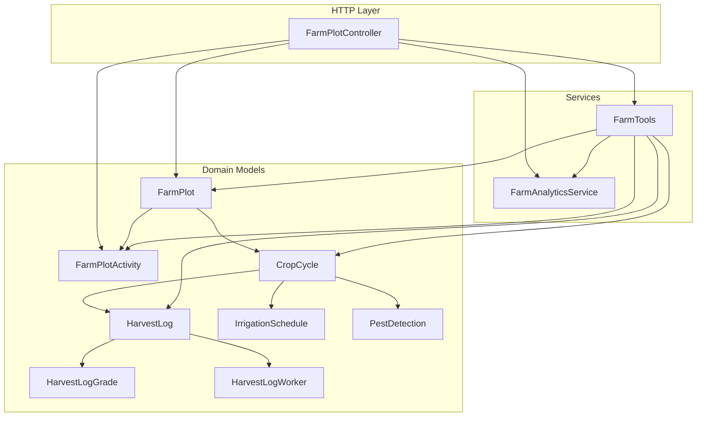
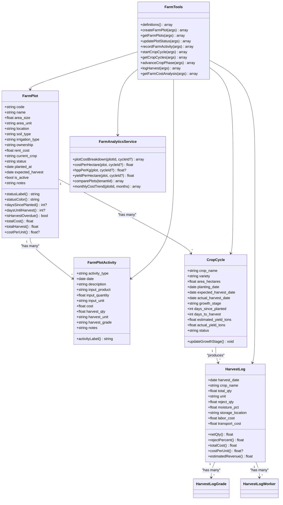
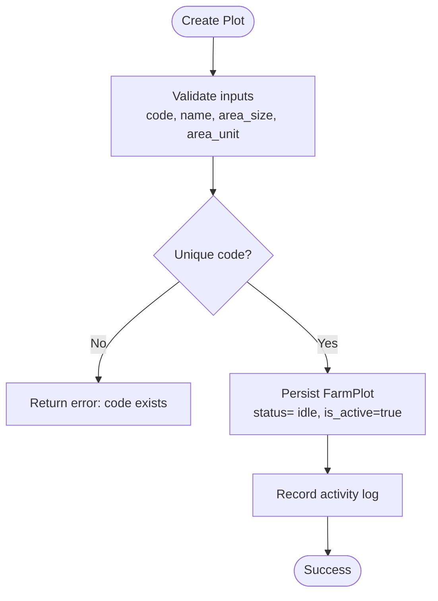
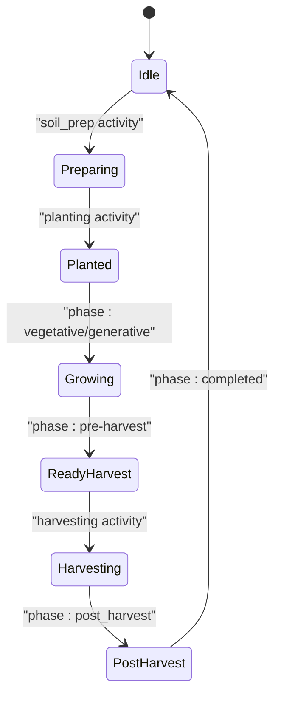
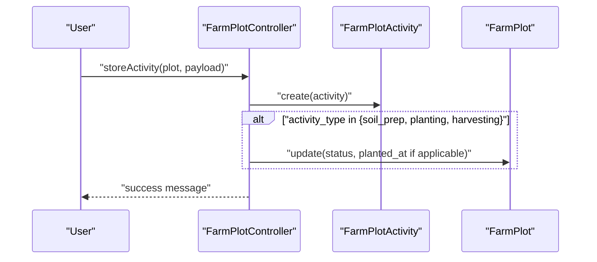
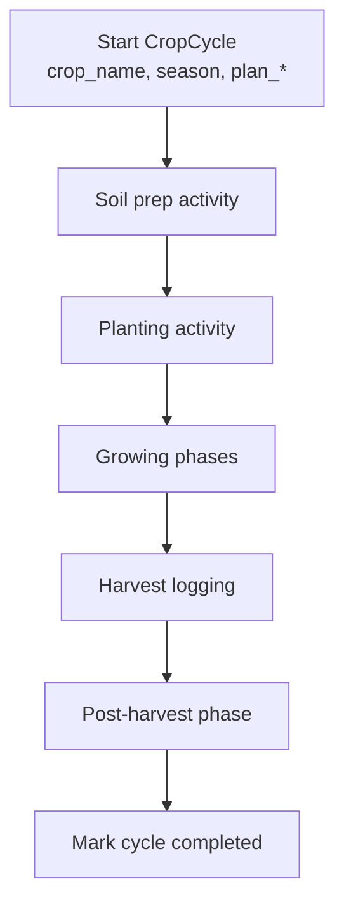
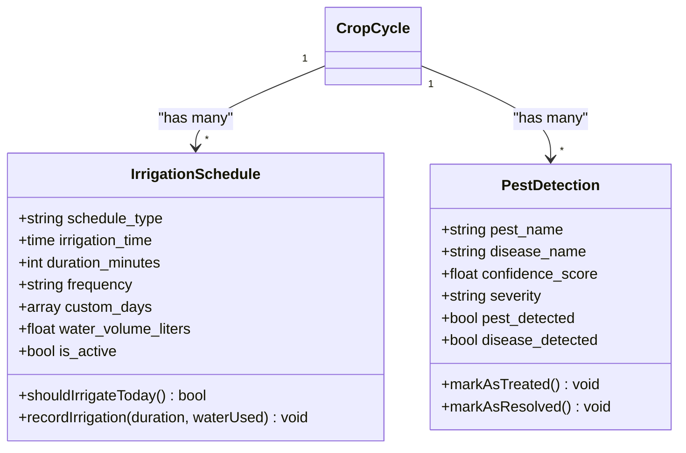
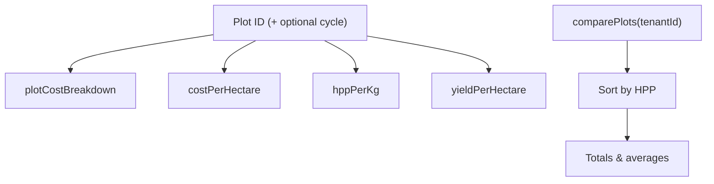
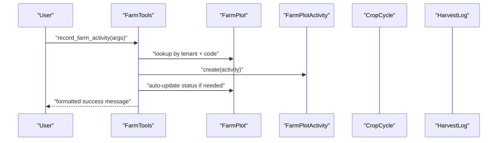
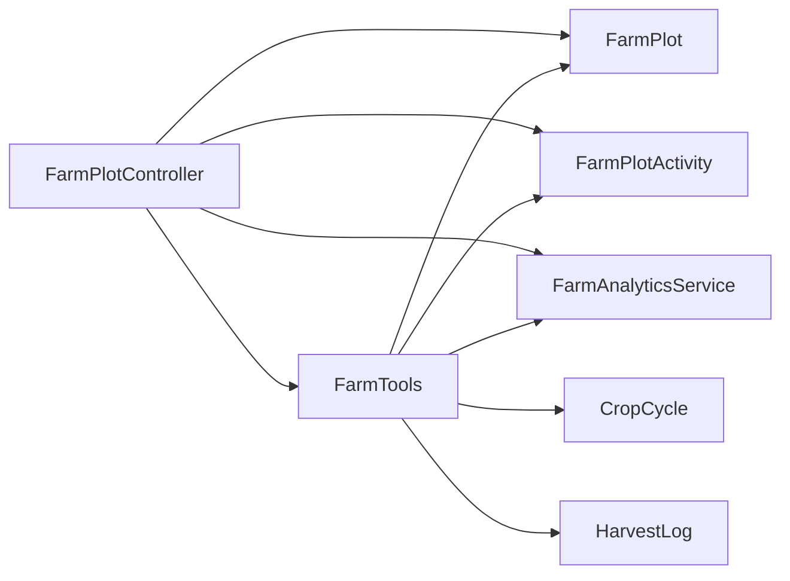

# Farm Plot Management

<cite>
**Referenced Files in This Document**
- [FarmPlot.php](file://app/Models/FarmPlot.php)
- [FarmPlotActivity.php](file://app/Models/FarmPlotActivity.php)
- [FarmPlotController.php](file://app/Http/Controllers/FarmPlotController.php)
- [FarmAnalyticsService.php](file://app/Services/FarmAnalyticsService.php)
- [FarmTools.php](file://app/Services/ERP/FarmTools.php)
- [CropCycle.php](file://app/Models/CropCycle.php)
- [HarvestLog.php](file://app/Models/HarvestLog.php)
- [HarvestLogGrade.php](file://app/Models/HarvestLogGrade.php)
- [HarvestLogWorker.php](file://app/Models/HarvestLogWorker.php)
- [IrrigationSchedule.php](file://app/Models/IrrigationSchedule.php)
- [PestDetection.php](file://app/Models/PestDetection.php)
</cite>

## Table of Contents
1. [Introduction](#introduction)
2. [Project Structure](#project-structure)
3. [Core Components](#core-components)
4. [Architecture Overview](#architecture-overview)
5. [Detailed Component Analysis](#detailed-component-analysis)
6. [Dependency Analysis](#dependency-analysis)
7. [Performance Considerations](#performance-considerations)
8. [Troubleshooting Guide](#troubleshooting-guide)
9. [Conclusion](#conclusion)

## Introduction
This document describes the farm plot management system, focusing on plot registration, classification, spatial organization, status tracking across production phases, activity logging, analytics, and operational integrations such as crop cycles, harvest logging, irrigation scheduling, and pest detection. It synthesizes the model and service layers to present a practical guide for managing agricultural operations within the platform.

## Project Structure
The farm module centers around domain models for plots, activities, cycles, and harvests, supported by a controller for CRUD and analytics, and a service layer that orchestrates farm operations and exposes a natural-language API via a Farm Tools executor.

**Diagram sources**
- [FarmPlotController.php:10-198](file://app/Http/Controllers/FarmPlotController.php#L10-L198)
- [FarmPlot.php:11-104](file://app/Models/FarmPlot.php#L11-L104)
- [FarmPlotActivity.php:10-48](file://app/Models/FarmPlotActivity.php#L10-L48)
- [FarmAnalyticsService.php:11-160](file://app/Services/FarmAnalyticsService.php#L11-L160)
- [FarmTools.php:9-1127](file://app/Services/ERP/FarmTools.php#L9-L1127)
- [CropCycle.php:11-96](file://app/Models/CropCycle.php#L11-L96)
- [HarvestLog.php:11-80](file://app/Models/HarvestLog.php#L11-L80)
- [HarvestLogGrade.php:8-21](file://app/Models/HarvestLogGrade.php#L8-L21)
- [HarvestLogWorker.php:8-20](file://app/Models/HarvestLogWorker.php#L8-L20)
- [IrrigationSchedule.php:11-94](file://app/Models/IrrigationSchedule.php#L11-L94)
- [PestDetection.php:10-74](file://app/Models/PestDetection.php#L10-L74)

**Section sources**
- [FarmPlotController.php:10-198](file://app/Http/Controllers/FarmPlotController.php#L10-L198)
- [FarmPlot.php:11-104](file://app/Models/FarmPlot.php#L11-L104)
- [FarmPlotActivity.php:10-48](file://app/Models/FarmPlotActivity.php#L10-L48)
- [FarmAnalyticsService.php:11-160](file://app/Services/FarmAnalyticsService.php#L11-L160)
- [FarmTools.php:9-1127](file://app/Services/ERP/FarmTools.php#L9-L1127)
- [CropCycle.php:11-96](file://app/Models/CropCycle.php#L11-L96)
- [HarvestLog.php:11-80](file://app/Models/HarvestLog.php#L11-L80)
- [HarvestLogGrade.php:8-21](file://app/Models/HarvestLogGrade.php#L8-L21)
- [HarvestLogWorker.php:8-20](file://app/Models/HarvestLogWorker.php#L8-L20)
- [IrrigationSchedule.php:11-94](file://app/Models/IrrigationSchedule.php#L11-L94)
- [PestDetection.php:10-74](file://app/Models/PestDetection.php#L10-L74)

## Core Components
- FarmPlot: Central entity representing a plot with attributes for identification, area, location, ownership, current crop, status, and timestamps. Provides helpers for status labels/colors, days calculations, and cost/productivity metrics aggregation.
- FarmPlotActivity: Records daily farming operations with typed activity categories, input usage, costs, and harvest quantities/grades.
- CropCycle: Tracks planned and actual phases of a cropping season, enabling progress calculation and synchronization with plot status.
- HarvestLog: Captures detailed harvest events including grades, workers, labor/transport costs, and derived metrics.
- Analytics Service: Aggregates costs, yields, and productivity metrics across plots and cycles, including HPP per kg, yield per hectare, and cost per hectare.
- Farm Tools: Natural language interface for plot creation, status updates, activity recording, cycle management, and analytics retrieval.

**Section sources**
- [FarmPlot.php:11-104](file://app/Models/FarmPlot.php#L11-L104)
- [FarmPlotActivity.php:10-48](file://app/Models/FarmPlotActivity.php#L10-L48)
- [CropCycle.php:11-96](file://app/Models/CropCycle.php#L11-L96)
- [HarvestLog.php:11-80](file://app/Models/HarvestLog.php#L11-L80)
- [FarmAnalyticsService.php:11-160](file://app/Services/FarmAnalyticsService.php#L11-L160)
- [FarmTools.php:9-1127](file://app/Services/ERP/FarmTools.php#L9-L1127)

## Architecture Overview
The system follows a layered architecture:
- HTTP layer: Controller handles requests, validations, and orchestrates model updates and analytics.
- Domain models: Encapsulate business rules, relationships, and computed metrics.
- Services: Provide cross-cutting operations such as analytics and natural language farm command execution.

**Diagram sources**
- [FarmPlot.php:11-104](file://app/Models/FarmPlot.php#L11-L104)
- [FarmPlotActivity.php:10-48](file://app/Models/FarmPlotActivity.php#L10-L48)
- [CropCycle.php:11-96](file://app/Models/CropCycle.php#L11-L96)
- [HarvestLog.php:11-80](file://app/Models/HarvestLog.php#L11-L80)
- [FarmAnalyticsService.php:11-160](file://app/Services/FarmAnalyticsService.php#L11-L160)
- [FarmTools.php:9-1127](file://app/Services/ERP/FarmTools.php#L9-L1127)

## Detailed Component Analysis

### Plot Registration and Classification
- Registration: Plots are created with unique codes, names, area, units, location, soil type, irrigation type, ownership, and optional notes. Default status is idle and activation flag is set to true.
- Classification: Status values include idle, preparing, planted, growing, ready_harvest, harvesting, and post_harvest. Each status has localized label and color metadata for UI rendering.
- Spatial organization: Area size and unit are stored, enabling productivity metrics. Ownership and rent cost are captured for financial modeling.

**Diagram sources**
- [FarmPlotController.php:52-81](file://app/Http/Controllers/FarmPlotController.php#L52-L81)
- [FarmPlot.php:14-30](file://app/Models/FarmPlot.php#L14-L30)

**Section sources**
- [FarmPlotController.php:52-81](file://app/Http/Controllers/FarmPlotController.php#L52-L81)
- [FarmPlot.php:14-50](file://app/Models/FarmPlot.php#L14-L50)

### Status Tracking Across Production Phases
- Status lifecycle: The system tracks idle → preparing → planted → growing → ready_harvest → harvesting → post_harvest, with helpers to compute days since planted and until harvest, and to detect overdue harvests.
- Automatic transitions: Activities such as soil preparation, planting, and harvesting can trigger status updates. Crop cycles also drive phase transitions and plot status synchronization.

**Diagram sources**
- [FarmPlot.php:32-50](file://app/Models/FarmPlot.php#L32-L50)
- [FarmPlotController.php:180-192](file://app/Http/Controllers/FarmPlotController.php#L180-L192)
- [FarmTools.php:557-563](file://app/Services/ERP/FarmTools.php#L557-L563)

**Section sources**
- [FarmPlot.php:32-83](file://app/Models/FarmPlot.php#L32-L83)
- [FarmPlotController.php:180-192](file://app/Http/Controllers/FarmPlotController.php#L180-L192)
- [FarmTools.php:557-563](file://app/Services/ERP/FarmTools.php#L557-L563)

### Plot Activity Logging
- Activity types: Planting, fertilizing, spraying, watering, weeding, pruning, harvesting, soil preparation, and other activities. Each activity stores date, description, input product/quantity/unit, cost, and harvest quantity/grade.
- Auto-status updates: Certain activities automatically adjust plot status and planting date.
- Aggregation: Plots expose total cost and total harvest quantities, and derived cost-per-unit metric.

**Diagram sources**
- [FarmPlotController.php:155-196](file://app/Http/Controllers/FarmPlotController.php#L155-L196)
- [FarmPlotActivity.php:13-46](file://app/Models/FarmPlotActivity.php#L13-L46)
- [FarmPlot.php:85-102](file://app/Models/FarmPlot.php#L85-L102)

**Section sources**
- [FarmPlotActivity.php:13-46](file://app/Models/FarmPlotActivity.php#L13-L46)
- [FarmPlotController.php:155-196](file://app/Http/Controllers/FarmPlotController.php#L155-L196)
- [FarmPlot.php:85-102](file://app/Models/FarmPlot.php#L85-L102)

### Soil Analysis Integration, Crop Rotation Planning, and Field Preparation Protocols
- Soil and field data: Plots capture soil type and irrigation type, enabling tailored field preparation and water management.
- Crop rotation: Planned via CropCycle entries with crop name, season, and target yield. The system supports multiple cycles per plot and tracks actual vs. planned dates.
- Field preparation: Logged as dedicated activity type and can trigger status transitions.

**Diagram sources**
- [FarmTools.php:458-496](file://app/Services/ERP/FarmTools.php#L458-L496)
- [FarmTools.php:532-575](file://app/Services/ERP/FarmTools.php#L532-L575)
- [FarmPlotActivity.php:29-39](file://app/Models/FarmPlotActivity.php#L29-L39)

**Section sources**
- [FarmTools.php:458-496](file://app/Services/ERP/FarmTools.php#L458-L496)
- [FarmTools.php:532-575](file://app/Services/ERP/FarmTools.php#L532-L575)
- [FarmPlotActivity.php:29-39](file://app/Models/FarmPlotActivity.php#L29-L39)

### Infrastructure Tracking and Environmental Monitoring
- Irrigation scheduling: Crop cycles maintain schedules with frequency, timing, duration, and water volume, supporting automated reminders and usage tracking.
- Pest detection: Crops can be monitored for pests/diseases with severity levels, treatment recommendations, and status tracking.

**Diagram sources**
- [IrrigationSchedule.php:11-94](file://app/Models/IrrigationSchedule.php#L11-L94)
- [PestDetection.php:10-74](file://app/Models/PestDetection.php#L10-L74)

**Section sources**
- [IrrigationSchedule.php:61-83](file://app/Models/IrrigationSchedule.php#L61-L83)
- [PestDetection.php:50-73](file://app/Models/PestDetection.php#L50-L73)

### Analytics and Productivity Metrics
- Cost breakdown: By activity type, including total cost and percentage contribution.
- Productivity metrics: Cost per hectare, yield per hectare, and HPP per kg (cost per kilogram harvested), with fallbacks to harvest logs or activity records.
- Comparative analysis: Side-by-side comparison across plots with rankings by HPP.

**Diagram sources**
- [FarmAnalyticsService.php:16-158](file://app/Services/FarmAnalyticsService.php#L16-L158)

**Section sources**
- [FarmAnalyticsService.php:16-158](file://app/Services/FarmAnalyticsService.php#L16-L158)

### Natural Language Farm Operations (FarmTools)
- Definitions: JSON schema exposing commands for plot creation, status updates, activity recording, cycle management, and analytics.
- Executors: Implement the commands, validate inputs, persist data, and return formatted messages with contextual summaries.

**Diagram sources**
- [FarmTools.php:67-86](file://app/Services/ERP/FarmTools.php#L67-L86)
- [FarmTools.php:409-454](file://app/Services/ERP/FarmTools.php#L409-L454)

**Section sources**
- [FarmTools.php:13-305](file://app/Services/ERP/FarmTools.php#L13-L305)
- [FarmTools.php:409-454](file://app/Services/ERP/FarmTools.php#L409-L454)

## Dependency Analysis
- Controller depends on models and services for persistence, validation, and analytics.
- Models encapsulate relationships and computed metrics, reducing duplication across layers.
- FarmTools acts as a facade for orchestration, delegating to models and services while providing a unified command surface.

**Diagram sources**
- [FarmPlotController.php:10-198](file://app/Http/Controllers/FarmPlotController.php#L10-L198)
- [FarmTools.php:9-1127](file://app/Services/ERP/FarmTools.php#L9-L1127)

**Section sources**
- [FarmPlotController.php:10-198](file://app/Http/Controllers/FarmPlotController.php#L10-L198)
- [FarmTools.php:9-1127](file://app/Services/ERP/FarmTools.php#L9-L1127)

## Performance Considerations
- Aggregation queries: Use database-level aggregations (sums, counts, groupings) to avoid loading unnecessary rows.
- Indexing: Ensure tenant_id, code, and foreign keys are indexed for fast lookups.
- Pagination: Controllers already paginate lists; keep page sizes reasonable for large datasets.
- Computed metrics: Prefer storing derived metrics (e.g., total cost, total harvest) at the plot level to reduce repeated joins.

## Troubleshooting Guide
- Duplicate plot code: Creation fails if the code is not unique for the tenant. Resolve by changing the code.
- Not found errors: Updating status or recording activities requires an existing plot; verify plot code and tenant association.
- Overdue harvests: Use the plot helper to detect overdue status and take corrective actions.
- Inconsistent status: Activities and crop cycle phases are designed to synchronize plot status; check recent transitions and cycle phases.

**Section sources**
- [FarmPlotController.php:69-71](file://app/Http/Controllers/FarmPlotController.php#L69-L71)
- [FarmPlot.php:77-83](file://app/Models/FarmPlot.php#L77-L83)
- [FarmTools.php:389-391](file://app/Services/ERP/FarmTools.php#L389-L391)

## Conclusion
The farm plot management system integrates plot registration, status tracking, activity logging, analytics, and operational workflows. It supports structured crop cycle management, detailed harvest accounting, and operational insights through natural language commands. The modular design enables scalability and maintainability while keeping the user-facing operations straightforward.