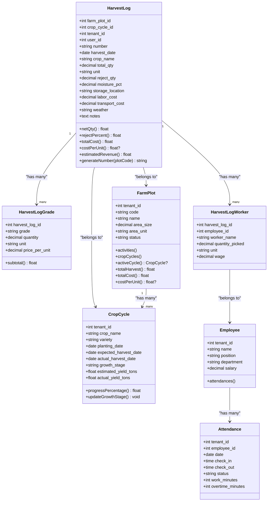
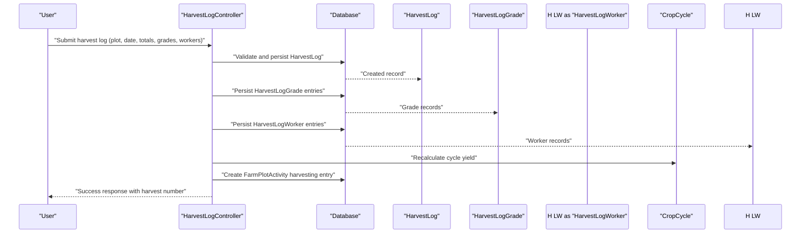
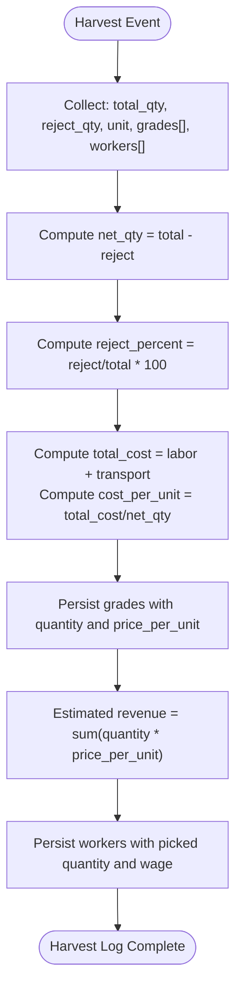
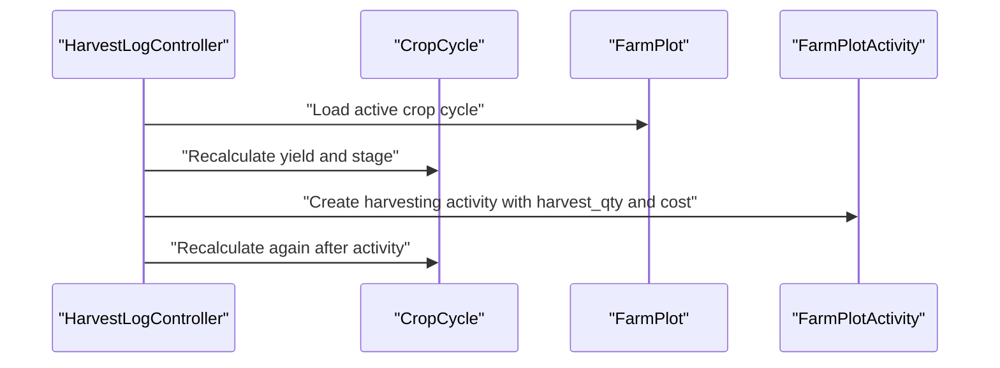
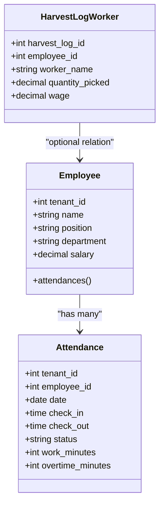

# Harvest Operations

<cite>
**Referenced Files in This Document**
- [HarvestLog.php](file://app/Models/HarvestLog.php)
- [HarvestLogGrade.php](file://app/Models/HarvestLogGrade.php)
- [HarvestLogWorker.php](file://app/Models/HarvestLogWorker.php)
- [FarmPlot.php](file://app/Models/FarmPlot.php)
- [CropCycle.php](file://app/Models/CropCycle.php)
- [Employee.php](file://app/Models/Employee.php)
- [Attendance.php](file://app/Models/Attendance.php)
- [HarvestLogController.php](file://app/Http/Controllers/HarvestLogController.php)
- [2026_03_31_800000_create_harvest_logs_table.php](file://database/migrations/2026_03_31_800000_create_harvest_logs_table.php)
- [harvest-logs.blade.php](file://resources/views/farm/harvest-logs.blade.php)
- [harvest-show.blade.php](file://resources/views/farm/harvest-show.blade.php)
- [FarmTools.php](file://app/Services/ERP/FarmTools.php)
- [GeminiService.php](file://app/Services/GeminiService.php)
</cite>

## Table of Contents
1. [Introduction](#introduction)
2. [Project Structure](#project-structure)
3. [Core Components](#core-components)
4. [Architecture Overview](#architecture-overview)
5. [Detailed Component Analysis](#detailed-component-analysis)
6. [Dependency Analysis](#dependency-analysis)
7. [Performance Considerations](#performance-considerations)
8. [Troubleshooting Guide](#troubleshooting-guide)
9. [Conclusion](#conclusion)
10. [Appendices](#appendices)

## Introduction
This document describes the harvest operations management capabilities implemented in the system. It covers harvest scheduling, yield tracking, and quality assessment via a three-tier harvest log system: quantity tracking, quality grading, and worker productivity monitoring. It also documents harvest worker management with attendance tracking, productivity metrics, and compensation calculations. Post-harvest processing workflows, storage requirements, and supply chain integration touchpoints are outlined, along with quality control procedures, grading standards, and compliance reporting. Finally, it provides examples of optimization strategies, labor scheduling, and equipment utilization tracking grounded in the available models and controllers.

## Project Structure
The harvest operations domain centers around:
- Models representing harvest records, grades, workers, plots, cycles, employees, and attendance
- A controller for harvest log creation, listing, and viewing
- Database migrations defining the harvest-related tables and indexes
- Blade views for listing and displaying harvest logs
- Supporting services for farm operations and AI-driven guidance

```mermaid
graph TB
subgraph "Models"
HL["HarvestLog"]
HLG["HarvestLogGrade"]
H LW["HarvestLogWorker"]
FP["FarmPlot"]
CC["CropCycle"]
EMP["Employee"]
ATT["Attendance"]
end
subgraph "Controller"
HLC["HarvestLogController"]
end
subgraph "Views"
LIST["harvest-logs.blade.php"]
DETAIL["harvest-show.blade.php"]
end
subgraph "Migrations"
MIG["create_harvest_logs_table.php"]
end
subgraph "Services"
FT["FarmTools"]
GS["GeminiService"]
end
HLC --> HL
HL --> HLG
HL --> H LW
HL --> FP
HL --> CC
H LW --> EMP
EMP --> ATT
HLC --> LIST
HLC --> DETAIL
MIG --> HL
MIG --> HLG
MIG --> H LW
FT --> HL
GS --> HLC
```

**Diagram sources**
- [HarvestLog.php:11-79](file://app/Models/HarvestLog.php#L11-L79)
- [HarvestLogGrade.php:8-20](file://app/Models/HarvestLogGrade.php#L8-L20)
- [HarvestLogWorker.php:8-19](file://app/Models/HarvestLogWorker.php#L8-L19)
- [FarmPlot.php:11-103](file://app/Models/FarmPlot.php#L11-L103)
- [CropCycle.php:11-95](file://app/Models/CropCycle.php#L11-L95)
- [Employee.php:13-99](file://app/Models/Employee.php#L13-L99)
- [Attendance.php:10-39](file://app/Models/Attendance.php#L10-L39)
- [HarvestLogController.php:15-157](file://app/Http/Controllers/HarvestLogController.php#L15-L157)
- [2026_03_31_800000_create_harvest_logs_table.php:7-67](file://database/migrations/2026_03_31_800000_create_harvest_logs_table.php#L7-L67)
- [harvest-logs.blade.php](file://resources/views/farm/harvest-logs.blade.php)
- [harvest-show.blade.php](file://resources/views/farm/harvest-show.blade.php)
- [FarmTools.php:587-672](file://app/Services/ERP/FarmTools.php#L587-L672)
- [GeminiService.php:314-329](file://app/Services/GeminiService.php#L314-L329)

**Section sources**
- [HarvestLog.php:11-79](file://app/Models/HarvestLog.php#L11-L79)
- [HarvestLogGrade.php:8-20](file://app/Models/HarvestLogGrade.php#L8-L20)
- [HarvestLogWorker.php:8-19](file://app/Models/HarvestLogWorker.php#L8-L19)
- [FarmPlot.php:11-103](file://app/Models/FarmPlot.php#L11-L103)
- [CropCycle.php:11-95](file://app/Models/CropCycle.php#L11-L95)
- [Employee.php:13-99](file://app/Models/Employee.php#L13-L99)
- [Attendance.php:10-39](file://app/Models/Attendance.php#L10-L39)
- [HarvestLogController.php:15-157](file://app/Http/Controllers/HarvestLogController.php#L15-L157)
- [2026_03_31_800000_create_harvest_logs_table.php:7-67](file://database/migrations/2026_03_31_800000_create_harvest_logs_table.php#L7-L67)
- [harvest-logs.blade.php](file://resources/views/farm/harvest-logs.blade.php)
- [harvest-show.blade.php](file://resources/views/farm/harvest-show.blade.php)
- [FarmTools.php:587-672](file://app/Services/ERP/FarmTools.php#L587-L672)
- [GeminiService.php:314-329](file://app/Services/GeminiService.php#L314-L329)

## Core Components
- HarvestLog: central record capturing total quantity, rejects, moisture, storage location, labor and transport costs, weather, and notes; provides computed metrics (net quantity, reject percent, total cost, cost per unit, estimated revenue) and links to grades and workers.
- HarvestLogGrade: per-grade breakdown with quantity and price per unit, enabling revenue estimation and quality segmentation.
- HarvestLogWorker: worker participation records with picked quantity and wage, linking to Employees when applicable.
- FarmPlot: field-level entity with status lifecycle, activity history, and cost-per-unit metrics.
- CropCycle: lifecycle tracking for planting to harvest, progress calculation, and integration with harvest logs.
- Employee and Attendance: worker identity, employment metadata, and attendance records supporting productivity and compensation tracking.
- HarvestLogController: CRUD and analytics for harvest logs, including filtering, pagination, summary statistics, and productivity per plot.
- Migrations: define tables, foreign keys, indexes, and data types for harvest operations.
- Views: listing and detail pages for harvest logs.
- Services: FarmTools encapsulates automated harvest logging and analytics; GeminiService defines AI commands for crop cycle and harvest log operations.

**Section sources**
- [HarvestLog.php:11-79](file://app/Models/HarvestLog.php#L11-L79)
- [HarvestLogGrade.php:8-20](file://app/Models/HarvestLogGrade.php#L8-L20)
- [HarvestLogWorker.php:8-19](file://app/Models/HarvestLogWorker.php#L8-L19)
- [FarmPlot.php:11-103](file://app/Models/FarmPlot.php#L11-L103)
- [CropCycle.php:11-95](file://app/Models/CropCycle.php#L11-L95)
- [Employee.php:13-99](file://app/Models/Employee.php#L13-L99)
- [Attendance.php:10-39](file://app/Models/Attendance.php#L10-L39)
- [HarvestLogController.php:19-157](file://app/Http/Controllers/HarvestLogController.php#L19-L157)
- [2026_03_31_800000_create_harvest_logs_table.php:7-67](file://database/migrations/2026_03_31_800000_create_harvest_logs_table.php#L7-L67)
- [harvest-logs.blade.php](file://resources/views/farm/harvest-logs.blade.php)
- [harvest-show.blade.php](file://resources/views/farm/harvest-show.blade.php)
- [FarmTools.php:587-672](file://app/Services/ERP/FarmTools.php#L587-L672)
- [GeminiService.php:314-329](file://app/Services/GeminiService.php#L314-L329)

## Architecture Overview
The system implements a three-tier harvest log:
- Quantity tracking: total quantity, reject quantity, unit, and computed net quantity and reject percentage
- Quality grading: grade breakdown with quantity and price per unit, enabling estimated revenue computation
- Worker productivity monitoring: per-worker picked quantity and wage, linked to employees and attendance



**Diagram sources**
- [HarvestLog.php:11-79](file://app/Models/HarvestLog.php#L11-L79)
- [HarvestLogGrade.php:8-20](file://app/Models/HarvestLogGrade.php#L8-L20)
- [HarvestLogWorker.php:8-19](file://app/Models/HarvestLogWorker.php#L8-L19)
- [FarmPlot.php:11-103](file://app/Models/FarmPlot.php#L11-L103)
- [CropCycle.php:11-95](file://app/Models/CropCycle.php#L11-L95)
- [Employee.php:13-99](file://app/Models/Employee.php#L13-L99)
- [Attendance.php:10-39](file://app/Models/Attendance.php#L10-L39)

## Detailed Component Analysis

### Harvest Log Management
HarvestLog captures the core operational data for each harvest event, including quantities, quality attributes, logistics, and costs. It computes derived metrics for quick insights and integrates with grades and workers for a complete picture.



**Diagram sources**
- [HarvestLogController.php:51-149](file://app/Http/Controllers/HarvestLogController.php#L51-L149)
- [HarvestLog.php:74-78](file://app/Models/HarvestLog.php#L74-L78)
- [2026_03_31_800000_create_harvest_logs_table.php:36-58](file://database/migrations/2026_03_31_800000_create_harvest_logs_table.php#L36-L58)

**Section sources**
- [HarvestLogController.php:51-149](file://app/Http/Controllers/HarvestLogController.php#L51-L149)
- [HarvestLog.php:11-79](file://app/Models/HarvestLog.php#L11-L79)
- [2026_03_31_800000_create_harvest_logs_table.php:7-67](file://database/migrations/2026_03_31_800000_create_harvest_logs_table.php#L7-L67)

### Three-Tier Harvest Log System
- Quantity tracking: total quantity, reject quantity, unit, computed net quantity, reject percentage, and cost per unit
- Quality grading: grade categories with quantity and price per unit, enabling estimated revenue calculation
- Worker productivity monitoring: per-worker picked quantity and wage, linking to employees and attendance



**Diagram sources**
- [HarvestLog.php:41-72](file://app/Models/HarvestLog.php#L41-L72)
- [HarvestLogGrade.php:19](file://app/Models/HarvestLogGrade.php#L19)
- [HarvestLogWorker.php:10-18](file://app/Models/HarvestLogWorker.php#L10-L18)

**Section sources**
- [HarvestLog.php:41-72](file://app/Models/HarvestLog.php#L41-L72)
- [HarvestLogGrade.php:10-20](file://app/Models/HarvestLogGrade.php#L10-L20)
- [HarvestLogWorker.php:8-19](file://app/Models/HarvestLogWorker.php#L8-L19)

### Yield Tracking and Crop Cycle Integration
CropCycle tracks planting, growth stages, and yields. After harvest logging, the system recalculates cycle metrics and records the activity against the plot.



**Diagram sources**
- [HarvestLogController.php:126-143](file://app/Http/Controllers/HarvestLogController.php#L126-L143)
- [CropCycle.php:77-94](file://app/Models/CropCycle.php#L77-L94)
- [FarmPlot.php:54-58](file://app/Models/FarmPlot.php#L54-L58)

**Section sources**
- [HarvestLogController.php:126-143](file://app/Http/Controllers/HarvestLogController.php#L126-L143)
- [CropCycle.php:56-94](file://app/Models/CropCycle.php#L56-L94)
- [FarmPlot.php:54-58](file://app/Models/FarmPlot.php#L54-L58)

### Worker Management, Attendance, and Compensation
Workers participating in harvest are recorded with picked quantities and wages. Employee and Attendance models support productivity and compensation tracking.



**Diagram sources**
- [HarvestLogWorker.php:8-19](file://app/Models/HarvestLogWorker.php#L8-L19)
- [Employee.php:13-99](file://app/Models/Employee.php#L13-L99)
- [Attendance.php:10-39](file://app/Models/Attendance.php#L10-L39)

**Section sources**
- [HarvestLogWorker.php:8-19](file://app/Models/HarvestLogWorker.php#L8-L19)
- [Employee.php:48-99](file://app/Models/Employee.php#L48-L99)
- [Attendance.php:10-39](file://app/Models/Attendance.php#L10-L39)

### Post-Harvest Processing, Storage, and Supply Chain
- Storage location is captured during harvest logging for traceability and inventory handover.
- Transport costs are tracked alongside labor costs to compute total cost and cost per unit.
- Estimated revenue is derived from grade quantities and price per unit, supporting supply chain pricing and invoicing.

**Section sources**
- [HarvestLog.php:14-31](file://app/Models/HarvestLog.php#L14-L31)
- [HarvestLog.php:55-72](file://app/Models/HarvestLog.php#L55-L72)
- [2026_03_31_800000_create_harvest_logs_table.php:17-28](file://database/migrations/2026_03_31_800000_create_harvest_logs_table.php#L17-L28)

### Quality Control, Grading Standards, and Compliance Reporting
- Grading standards are represented by grade names and quantities; price per unit enables revenue estimation.
- Compliance reporting can leverage stored notes, weather conditions, and storage location for audit trails.
- The system supports filtering and analytics via the harvest log listing page and controller.

**Section sources**
- [HarvestLogGrade.php:10-19](file://app/Models/HarvestLogGrade.php#L10-L19)
- [HarvestLogController.php:19-49](file://app/Http/Controllers/HarvestLogController.php#L19-L49)
- [harvest-logs.blade.php](file://resources/views/farm/harvest-logs.blade.php)

### Examples: Optimization Strategies, Labor Scheduling, Equipment Utilization
- Optimization strategies can be inferred from computed metrics (cost per unit, reject percentage) and productivity per plot analytics exposed by the controller.
- Labor scheduling and productivity can be supported by linking worker records to employees and attendance, enabling capacity planning and overtime tracking.
- Equipment utilization can be integrated conceptually by associating harvest events with equipment logs (not present in the referenced files) and aligning scheduling with plot status and cycle progress.

[No sources needed since this section provides conceptual guidance]

## Dependency Analysis
HarvestLog depends on FarmPlot, CropCycle, and aggregates data from HarvestLogGrade and HarvestLogWorker. The controller orchestrates persistence and analytics, while migrations define the relational structure.

```mermaid
graph LR
HLC["HarvestLogController"] --> HL["HarvestLog"]
HL --> HLG["HarvestLogGrade"]
HL --> H LW["HarvestLogWorker"]
HL --> FP["FarmPlot"]
HL --> CC["CropCycle"]
H LW --> EMP["Employee"]
EMP --> ATT["Attendance"]
HLC --> VIEW1["harvest-logs.blade.php"]
HLC --> VIEW2["harvest-show.blade.php"]
HL --> MIG["create_harvest_logs_table.php"]
HLG --> MIG
H LW --> MIG
```

**Diagram sources**
- [HarvestLogController.php:15-157](file://app/Http/Controllers/HarvestLogController.php#L15-L157)
- [HarvestLog.php:11-79](file://app/Models/HarvestLog.php#L11-L79)
- [HarvestLogGrade.php:8-20](file://app/Models/HarvestLogGrade.php#L8-L20)
- [HarvestLogWorker.php:8-19](file://app/Models/HarvestLogWorker.php#L8-L19)
- [FarmPlot.php:11-103](file://app/Models/FarmPlot.php#L11-L103)
- [CropCycle.php:11-95](file://app/Models/CropCycle.php#L11-L95)
- [Employee.php:13-99](file://app/Models/Employee.php#L13-L99)
- [Attendance.php:10-39](file://app/Models/Attendance.php#L10-L39)
- [2026_03_31_800000_create_harvest_logs_table.php:7-67](file://database/migrations/2026_03_31_800000_create_harvest_logs_table.php#L7-L67)
- [harvest-logs.blade.php](file://resources/views/farm/harvest-logs.blade.php)
- [harvest-show.blade.php](file://resources/views/farm/harvest-show.blade.php)

**Section sources**
- [HarvestLogController.php:15-157](file://app/Http/Controllers/HarvestLogController.php#L15-L157)
- [HarvestLog.php:11-79](file://app/Models/HarvestLog.php#L11-L79)
- [2026_03_31_800000_create_harvest_logs_table.php:7-67](file://database/migrations/2026_03_31_800000_create_harvest_logs_table.php#L7-L67)

## Performance Considerations
- Indexes on tenant_id, harvest_date, farm_plot_id, and crop_cycle_id improve filtering and aggregation performance for harvest logs.
- Computed metrics (net quantity, reject percent, cost per unit) reduce repeated calculations in views and reports.
- Aggregation queries in the controller (summary stats and productivity per plot) should be monitored for large datasets; consider caching or materialized summaries if needed.

**Section sources**
- [2026_03_31_800000_create_harvest_logs_table.php:31-33](file://database/migrations/2026_03_31_800000_create_harvest_logs_table.php#L31-L33)
- [HarvestLogController.php:31-46](file://app/Http/Controllers/HarvestLogController.php#L31-L46)
- [HarvestLog.php:41-72](file://app/Models/HarvestLog.php#L41-L72)

## Troubleshooting Guide
- Validation failures: ensure required fields (plot, date, total quantity) and numeric constraints are met; grades and workers arrays must satisfy item-level validations.
- Tenant scoping: harvest logs and related entities are tenant-scoped; confirm user’s tenant matches the records being accessed.
- Crop cycle synchronization: after logging harvest, ensure the active cycle is recalculated and that the activity is recorded to keep yield and cost metrics accurate.
- Attendance linkage: worker records can reference employees; if missing, the worker can still be recorded by name for ad-hoc tracking.

**Section sources**
- [HarvestLogController.php:51-76](file://app/Http/Controllers/HarvestLogController.php#L51-L76)
- [HarvestLogController.php:126-143](file://app/Http/Controllers/HarvestLogController.php#L126-L143)
- [HarvestLogWorker.php:10-18](file://app/Models/HarvestLogWorker.php#L10-L18)

## Conclusion
The system provides a robust foundation for managing harvest operations with a three-tier log covering quantity, quality, and workforce metrics. It integrates with crop cycle tracking, plot analytics, and worker attendance to support productivity and compensation insights. The controller exposes analytics and filtering, while migrations define scalable data structures. Supply chain and compliance workflows can be extended by leveraging stored metadata and computed metrics.

## Appendices
- AI-assisted guidance: GeminiService outlines natural-language commands for crop cycle and harvest log operations, enabling conversational workflows aligned with the implemented models and controller actions.

**Section sources**
- [GeminiService.php:314-329](file://app/Services/GeminiService.php#L314-L329)