# Farm Analytics & Monitoring

<cite>
**Referenced Files in This Document**
- [AgricultureController.php](file://app/Http/Controllers/AgricultureController.php)
- [FarmAnalyticsService.php](file://app/Services/FarmAnalyticsService.php)
- [WeatherIntegrationService.php](file://app/Services/WeatherIntegrationService.php)
- [WeatherData.php](file://app/Models/WeatherData.php)
- [IrrigationAutomationService.php](file://app/Services/IrrigationAutomationService.php)
- [IrrigationSchedule.php](file://app/Models/IrrigationSchedule.php)
- [IrrigationLog.php](file://app/Models/IrrigationLog.php)
- [PestDetectionService.php](file://app/Services/PestDetectionService.php)
- [PestDetection.php](file://app/Models/PestDetection.php)
- [FarmPlotController.php](file://app/Http/Controllers/FarmPlotController.php)
- [FarmPlot.php](file://app/Models/FarmPlot.php)
</cite>

## Table of Contents
1. [Introduction](#introduction)
2. [Project Structure](#project-structure)
3. [Core Components](#core-components)
4. [Architecture Overview](#architecture-overview)
5. [Detailed Component Analysis](#detailed-component-analysis)
6. [Dependency Analysis](#dependency-analysis)
7. [Performance Considerations](#performance-considerations)
8. [Troubleshooting Guide](#troubleshooting-guide)
9. [Conclusion](#conclusion)
10. [Appendices](#appendices)

## Introduction
This document describes the Farm Analytics and Monitoring capabilities implemented in the system. It covers real-time farm monitoring via weather integration, automated irrigation scheduling and water conservation metrics, pest detection using AI-powered image analysis, yield forecasting and production optimization, sustainability and environmental impact considerations, and practical tools for farm management including dashboards, alerts, and decision support.

## Project Structure
The analytics and monitoring features are organized around:
- Controllers orchestrating requests and injecting tenant-aware services
- Services encapsulating domain logic for weather, irrigation, pest detection, and analytics
- Models representing persisted entities such as weather data, irrigation schedules/logs, and pest detection records
- A dedicated controller for farm plots and analytics views

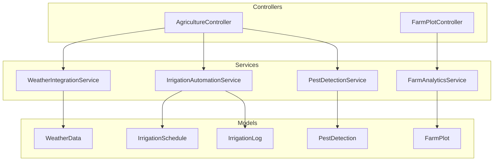

**Diagram sources**
- [AgricultureController.php:13-32](file://app/Http/Controllers/AgricultureController.php#L13-L32)
- [FarmAnalyticsService.php:11-159](file://app/Services/FarmAnalyticsService.php#L11-L159)
- [WeatherIntegrationService.php:11-222](file://app/Services/WeatherIntegrationService.php#L11-L222)
- [IrrigationAutomationService.php:11-221](file://app/Services/IrrigationAutomationService.php#L11-L221)
- [PestDetectionService.php:10-191](file://app/Services/PestDetectionService.php#L10-L191)
- [WeatherData.php:16-193](file://app/Models/WeatherData.php#L16-L193)
- [IrrigationSchedule.php:11-93](file://app/Models/IrrigationSchedule.php#L11-L93)
- [IrrigationLog.php:10-38](file://app/Models/IrrigationLog.php#L10-L38)
- [PestDetection.php:10-73](file://app/Models/PestDetection.php#L10-L73)
- [FarmPlot.php:11-103](file://app/Models/FarmPlot.php#L11-L103)

**Section sources**
- [AgricultureController.php:13-32](file://app/Http/Controllers/AgricultureController.php#L13-L32)
- [FarmAnalyticsService.php:11-159](file://app/Services/FarmAnalyticsService.php#L11-L159)
- [WeatherIntegrationService.php:11-222](file://app/Services/WeatherIntegrationService.php#L11-L222)
- [IrrigationAutomationService.php:11-221](file://app/Services/IrrigationAutomationService.php#L11-L221)
- [PestDetectionService.php:10-191](file://app/Services/PestDetectionService.php#L10-L191)
- [WeatherData.php:16-193](file://app/Models/WeatherData.php#L16-L193)
- [IrrigationSchedule.php:11-93](file://app/Models/IrrigationSchedule.php#L11-L93)
- [IrrigationLog.php:10-38](file://app/Models/IrrigationLog.php#L10-L38)
- [PestDetection.php:10-73](file://app/Models/PestDetection.php#L10-L73)
- [FarmPlot.php:11-103](file://app/Models/FarmPlot.php#L11-L103)

## Core Components
- Real-time weather integration and recommendations
- Automated irrigation scheduling with weather-adjusted protocols
- Pest detection via AI image analysis with treatment recommendations
- Farm analytics for cost, yield, and operational comparisons
- Plot lifecycle and status tracking

**Section sources**
- [WeatherIntegrationService.php:39-172](file://app/Services/WeatherIntegrationService.php#L39-L172)
- [IrrigationAutomationService.php:16-144](file://app/Services/IrrigationAutomationService.php#L16-L144)
- [PestDetectionService.php:22-72](file://app/Services/PestDetectionService.php#L22-L72)
- [FarmAnalyticsService.php:16-158](file://app/Services/FarmAnalyticsService.php#L16-L158)
- [FarmPlot.php:32-83](file://app/Models/FarmPlot.php#L32-L83)

## Architecture Overview
The system integrates external weather APIs, persists weather data, and exposes recommendations and forecasts. It generates and adjusts irrigation schedules based on crop, growth stage, and soil type, and records usage for conservation metrics. Pest detection leverages AI vision to analyze images and produce actionable insights. Analytics services compute cost, yield, and comparative performance across plots.

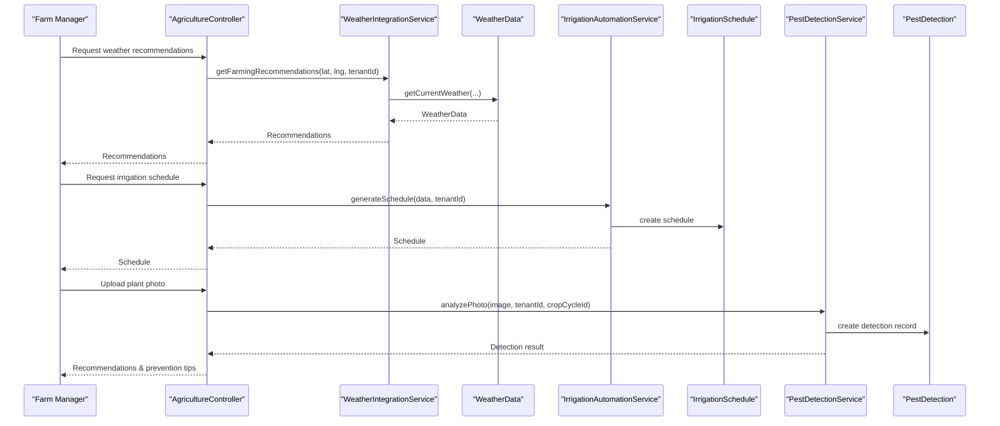

**Diagram sources**
- [AgricultureController.php:37-40](file://app/Http/Controllers/AgricultureController.php#L37-L40)
- [WeatherIntegrationService.php:144-153](file://app/Services/WeatherIntegrationService.php#L144-L153)
- [WeatherData.php:101-146](file://app/Models/WeatherData.php#L101-L146)
- [IrrigationAutomationService.php:16-48](file://app/Services/IrrigationAutomationService.php#L16-L48)
- [IrrigationSchedule.php:15-33](file://app/Models/IrrigationSchedule.php#L15-L33)
- [PestDetectionService.php:22-72](file://app/Services/PestDetectionService.php#L22-L72)
- [PestDetection.php:14-30](file://app/Models/PestDetection.php#L14-L30)

## Detailed Component Analysis

### Weather Integration and Recommendations
- Retrieves current weather and 5-day forecasts from an external API, caches responses, and persists structured data.
- Provides farming recommendations based on rainfall, humidity, temperature, and wind speed.
- Offers harvest readiness predictions using crop-specific growth cycles and weather adjustments.
- Issues severe weather alerts for heavy rain, strong winds, heat waves, and frost.

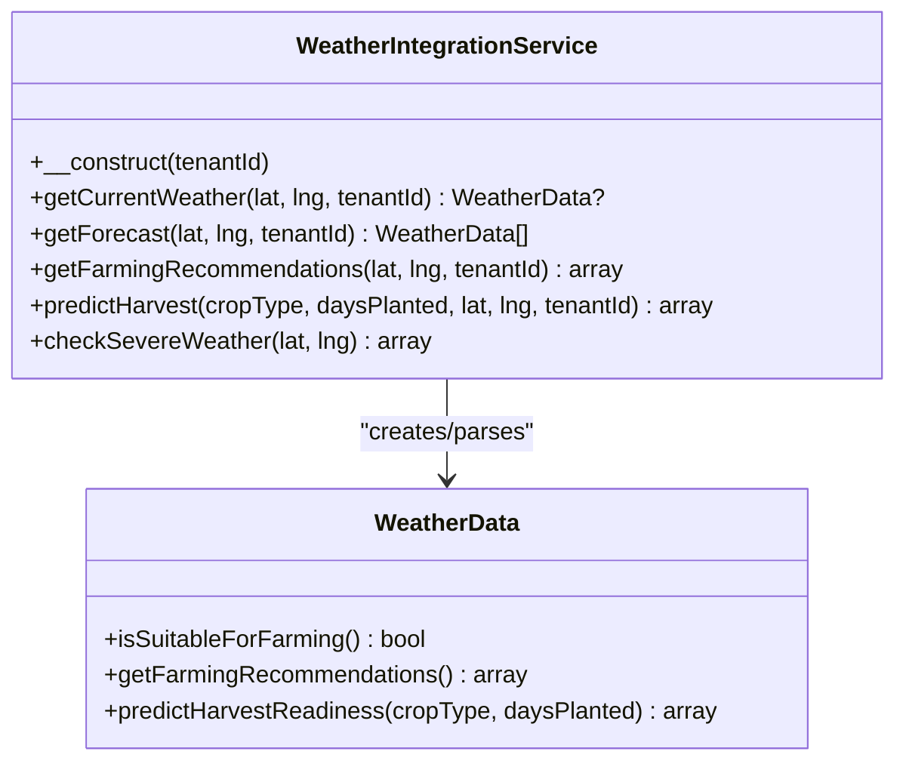

**Diagram sources**
- [WeatherIntegrationService.php:11-222](file://app/Services/WeatherIntegrationService.php#L11-L222)
- [WeatherData.php:16-193](file://app/Models/WeatherData.php#L16-L193)

**Section sources**
- [WeatherIntegrationService.php:39-172](file://app/Services/WeatherIntegrationService.php#L39-L172)
- [WeatherData.php:85-192](file://app/Models/WeatherData.php#L85-L192)

### Automated Irrigation Systems
- Generates smart irrigation schedules based on crop type, growth stage, soil type, and irrigation method.
- Adjusts schedule duration based on recent weather (rainfall and temperature/humidity).
- Records irrigation events and maintains usage statistics for conservation reporting.

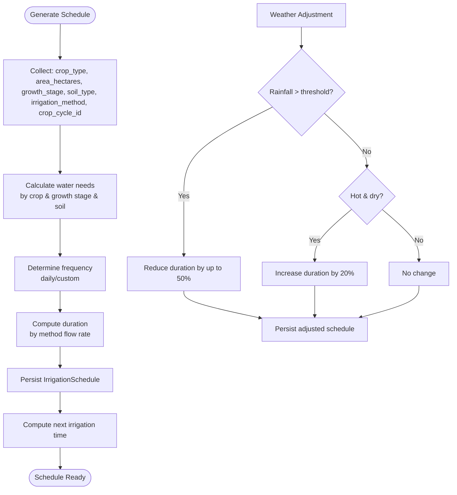

**Diagram sources**
- [IrrigationAutomationService.php:16-84](file://app/Services/IrrigationAutomationService.php#L16-L84)
- [IrrigationSchedule.php:61-92](file://app/Models/IrrigationSchedule.php#L61-L92)

**Section sources**
- [IrrigationAutomationService.php:16-144](file://app/Services/IrrigationAutomationService.php#L16-L144)
- [IrrigationSchedule.php:15-93](file://app/Models/IrrigationSchedule.php#L15-L93)
- [IrrigationLog.php:14-38](file://app/Models/IrrigationLog.php#L14-L38)

### Pest Detection and Crop Protection
- Accepts plant photos, stores them, and sends them to an AI vision service for pest/disease analysis.
- Parses AI responses into structured results including confidence, severity, treatments, and prevention tips.
- Persists detection records and supports historical queries and statistics.

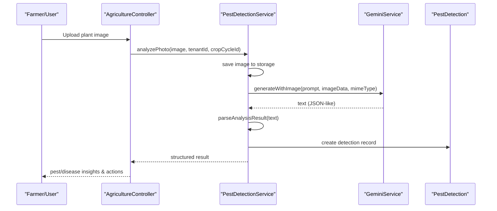

**Diagram sources**
- [PestDetectionService.php:22-109](file://app/Services/PestDetectionService.php#L22-L109)
- [PestDetection.php:14-48](file://app/Models/PestDetection.php#L14-L48)

**Section sources**
- [PestDetectionService.php:22-191](file://app/Services/PestDetectionService.php#L22-L191)
- [PestDetection.php:14-73](file://app/Models/PestDetection.php#L14-L73)

### Yield Forecasting and Production Optimization
- Uses weather-derived predictions to estimate readiness percentage and risks.
- Computes cost per hectare, HPP per kg, yield per hectare, and rejects percentage.
- Compares plots across a tenant to rank efficiency and guide resource allocation.

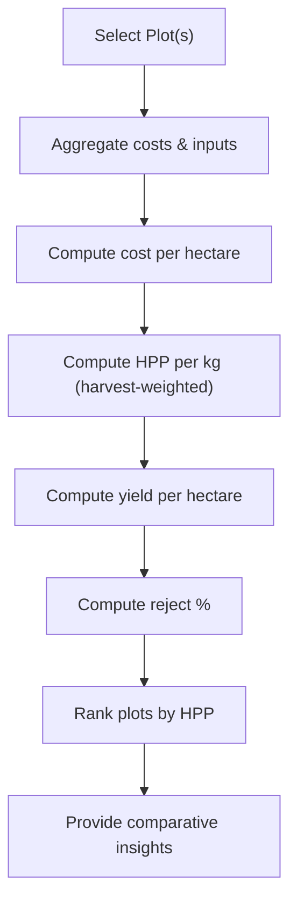

**Diagram sources**
- [FarmAnalyticsService.php:16-137](file://app/Services/FarmAnalyticsService.php#L16-L137)
- [FarmPlot.php:85-102](file://app/Models/FarmPlot.php#L85-L102)

**Section sources**
- [FarmAnalyticsService.php:16-158](file://app/Services/FarmAnalyticsService.php#L16-L158)
- [WeatherData.php:151-192](file://app/Models/WeatherData.php#L151-L192)

### Sustainability and Environmental Impact
- Water usage tracking via irrigation logs enables conservation metrics (total liters, average per session).
- Weather-adjusted irrigation reduces overwatering during rain and increases during heat stress.
- Recommendations mitigate risks (heavy rain, wind, frost) to reduce crop loss and resource waste.

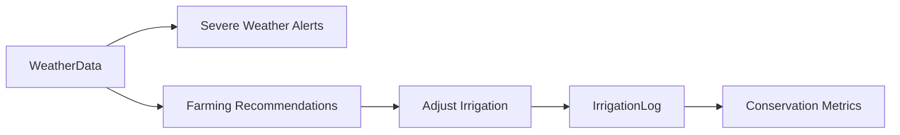

**Diagram sources**
- [WeatherIntegrationService.php:177-221](file://app/Services/WeatherIntegrationService.php#L177-L221)
- [IrrigationAutomationService.php:53-84](file://app/Services/IrrigationAutomationService.php#L53-L84)
- [IrrigationLog.php:14-22](file://app/Models/IrrigationLog.php#L14-L22)

**Section sources**
- [WeatherIntegrationService.php:177-221](file://app/Services/WeatherIntegrationService.php#L177-L221)
- [IrrigationAutomationService.php:124-144](file://app/Services/IrrigationAutomationService.php#L124-L144)
- [IrrigationLog.php:14-22](file://app/Models/IrrigationLog.php#L14-L22)

### Mobile Monitoring Applications and Decision Support
- Controllers expose endpoints for dashboards and analytics, enabling web-based farm management.
- Pest detection service supports image uploads for on-the-go diagnostics.
- Weather recommendations and irrigation alerts can be surfaced in dashboards for timely decisions.

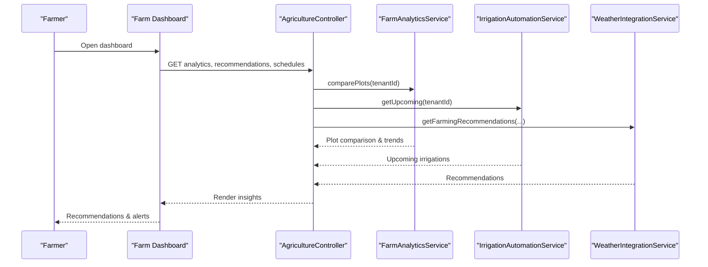

**Diagram sources**
- [FarmPlotController.php:133-151](file://app/Http/Controllers/FarmPlotController.php#L133-L151)
- [FarmAnalyticsService.php:101-137](file://app/Services/FarmAnalyticsService.php#L101-L137)
- [IrrigationAutomationService.php:110-119](file://app/Services/IrrigationAutomationService.php#L110-L119)
- [WeatherIntegrationService.php:144-153](file://app/Services/WeatherIntegrationService.php#L144-L153)

**Section sources**
- [FarmPlotController.php:133-151](file://app/Http/Controllers/FarmPlotController.php#L133-L151)
- [PestDetectionService.php:154-191](file://app/Services/PestDetectionService.php#L154-L191)

## Dependency Analysis
- Controllers depend on tenant-aware services resolved via the container with tenant context.
- Services encapsulate external integrations (weather API) and local persistence (models).
- Models define relationships and computed attributes supporting analytics and UI rendering.

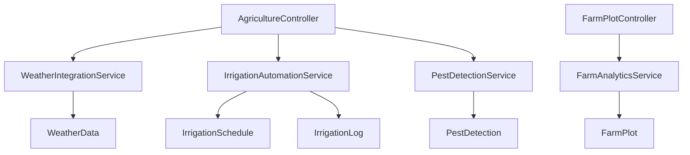

**Diagram sources**
- [AgricultureController.php:23-31](file://app/Http/Controllers/AgricultureController.php#L23-L31)
- [FarmPlotController.php:135-136](file://app/Http/Controllers/FarmPlotController.php#L135-L136)

**Section sources**
- [AgricultureController.php:23-31](file://app/Http/Controllers/AgricultureController.php#L23-L31)
- [FarmPlotController.php:135-136](file://app/Http/Controllers/FarmPlotController.php#L135-L136)

## Performance Considerations
- Caching: Weather API responses are cached to minimize latency and external calls.
- Aggregation: Analytics queries group and summarize costs/yields to reduce report generation overhead.
- Scheduling: Irrigation schedules precompute next irrigation time to avoid repeated calculations.
- Recommendations: Weather-derived checks are lightweight and deterministic.

[No sources needed since this section provides general guidance]

## Troubleshooting Guide
- Weather API failures: Errors are logged and fallback returns empty arrays or nulls to prevent outages.
- Image analysis errors: Parsing failures fall back to conservative defaults; logs capture underlying exceptions.
- Irrigation adjustments: If weather thresholds are not met, schedules remain unchanged; verify sensor inputs and API responses.
- Data availability: Analytics rely on persisted harvest and activity logs; ensure accurate data entry and reconciliation.

**Section sources**
- [WeatherIntegrationService.php:81-84](file://app/Services/WeatherIntegrationService.php#L81-L84)
- [PestDetectionService.php:63-71](file://app/Services/PestDetectionService.php#L63-L71)
- [IrrigationAutomationService.php:53-84](file://app/Services/IrrigationAutomationService.php#L53-L84)

## Conclusion
The system provides a robust foundation for farm analytics and monitoring, integrating weather intelligence, automated irrigation, AI-driven pest detection, and comprehensive analytics. These capabilities enable informed decision-making, resource optimization, and sustainable farming practices.

[No sources needed since this section summarizes without analyzing specific files]

## Appendices

### Example Workflows

#### Weather-Based Irrigation Adjustment
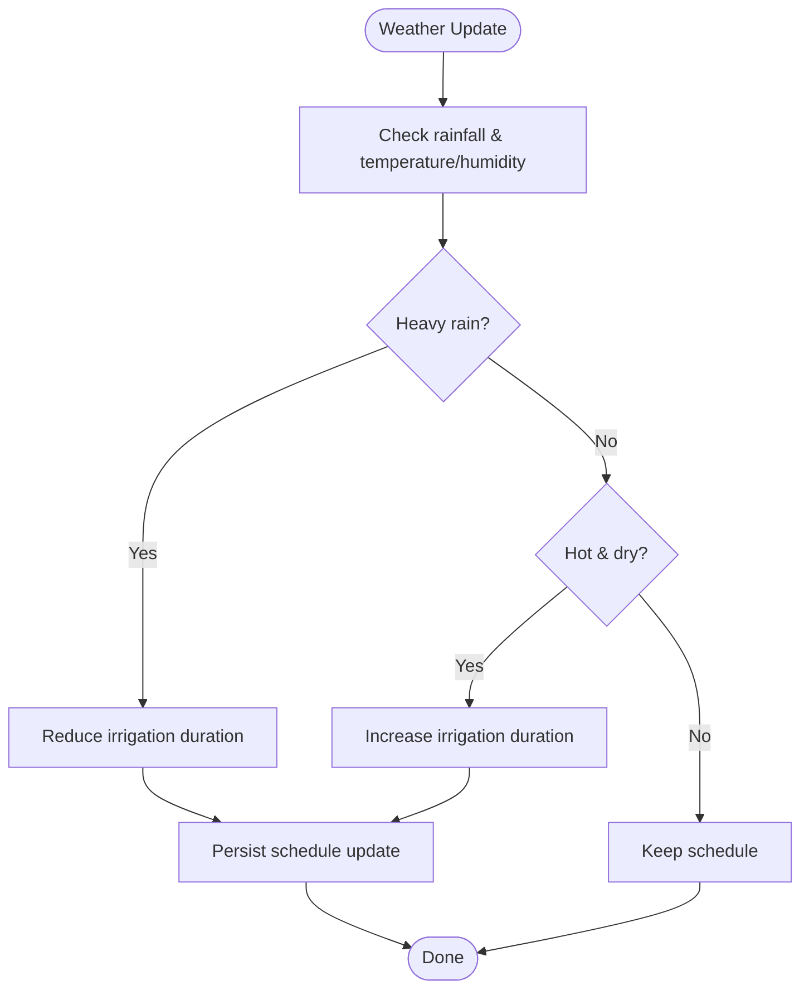

**Diagram sources**
- [IrrigationAutomationService.php:53-84](file://app/Services/IrrigationAutomationService.php#L53-L84)

### Data Models Overview
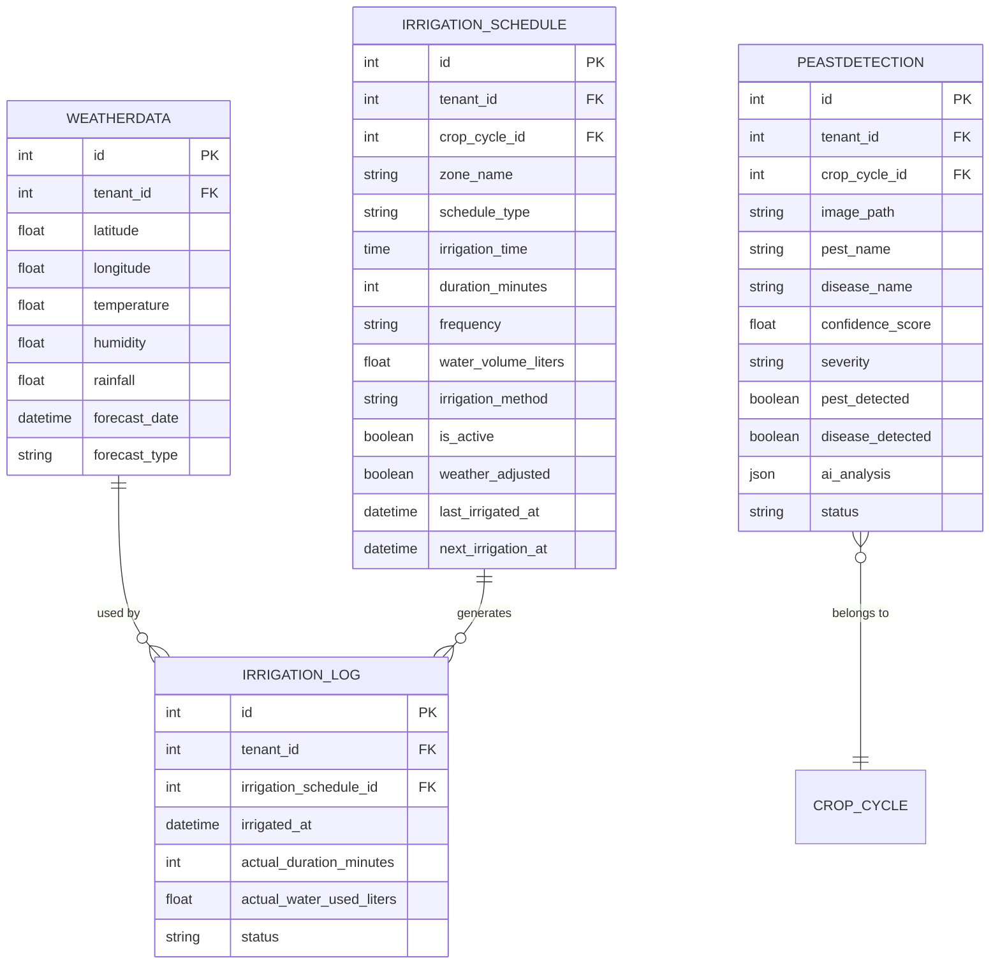

**Diagram sources**
- [WeatherData.php:20-53](file://app/Models/WeatherData.php#L20-L53)
- [IrrigationSchedule.php:15-46](file://app/Models/IrrigationSchedule.php#L15-L46)
- [IrrigationLog.php:14-28](file://app/Models/IrrigationLog.php#L14-L28)
- [PestDetection.php:14-39](file://app/Models/PestDetection.php#L14-L39)