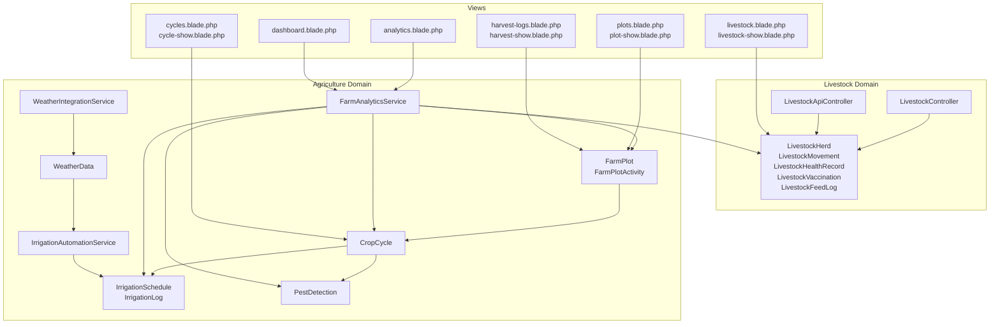
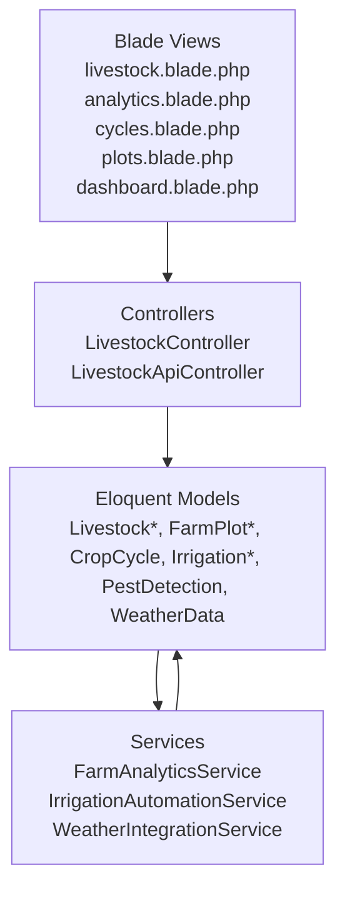
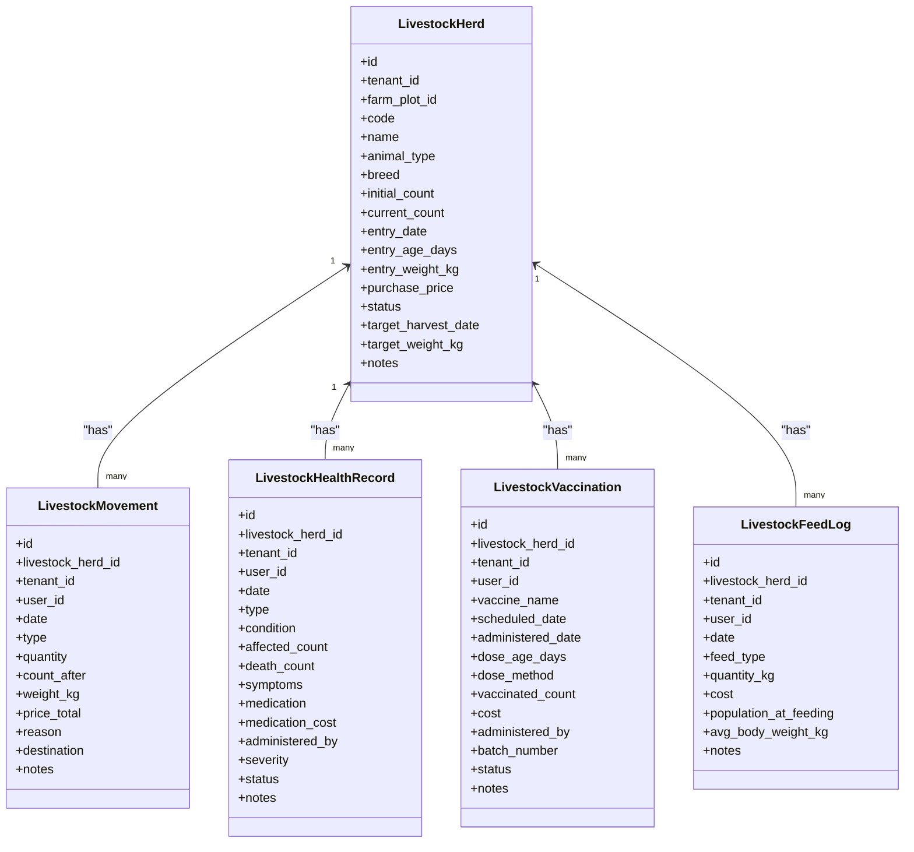
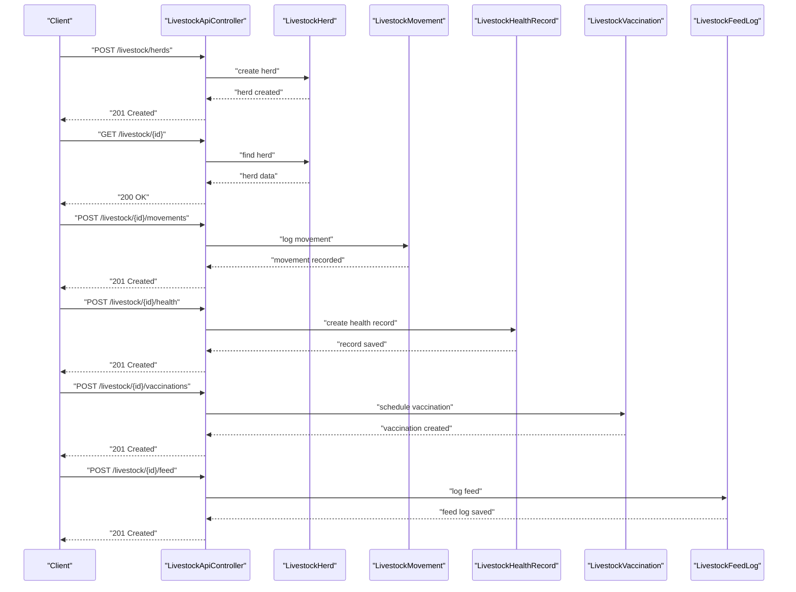
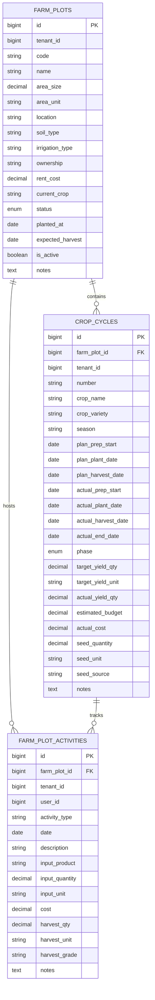
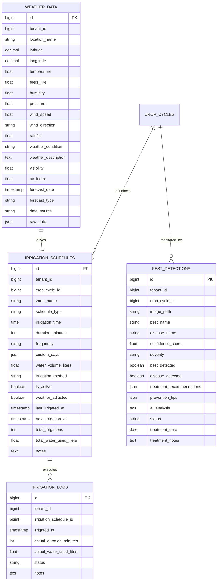
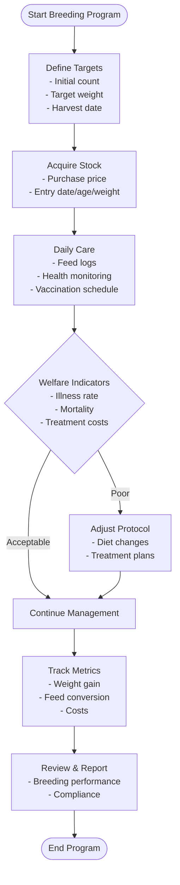
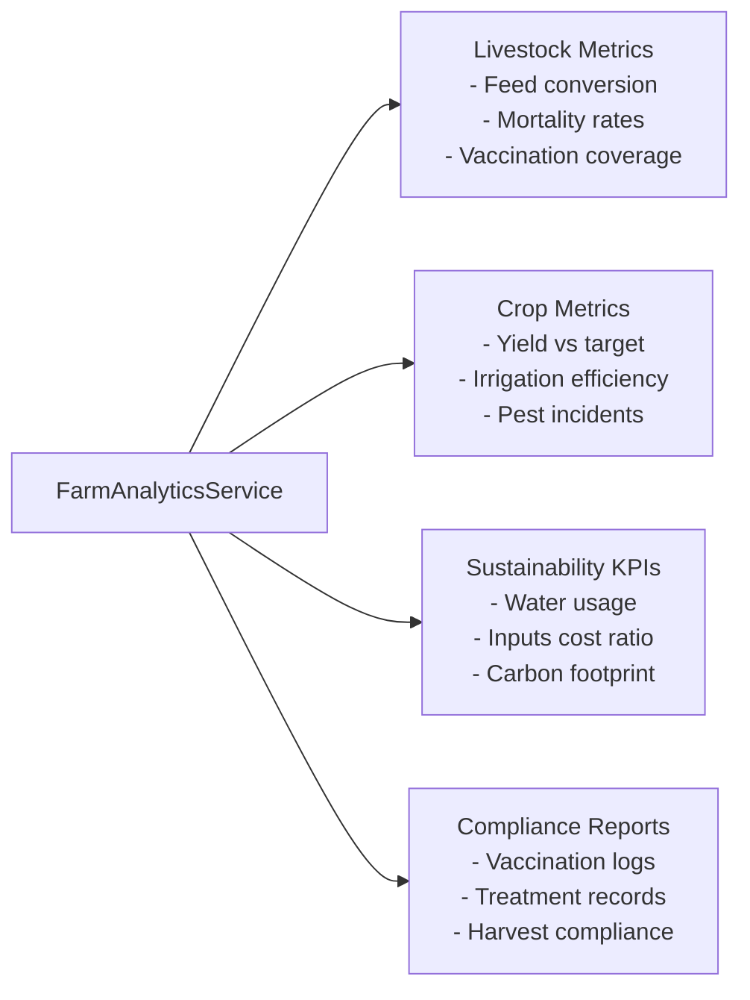

# Livestock & Agriculture Module

<cite>
**Referenced Files in This Document**
- [2026_04_01_100000_create_livestock_tables.php](file://database/migrations/2026_04_01_100000_create_livestock_tables.php)
- [2026_04_01_200000_create_livestock_health_tables.php](file://database/migrations/2026_04_01_200000_create_livestock_health_tables.php)
- [2026_04_01_300000_create_livestock_feed_logs_table.php](file://database/migrations/2026_04_01_300000_create_livestock_feed_logs_table.php)
- [2026_03_31_600000_create_farm_plots_table.php](file://database/migrations/2026_03_31_600000_create_farm_plots_table.php)
- [2026_03_31_700000_create_crop_cycles_table.php](file://database/migrations/2026_03_31_700000_create_crop_cycles_table.php)
- [2026_04_06_060000_create_agriculture_tables.php](file://database/migrations/2026_04_06_060000_create_agriculture_tables.php)
- [LivestockController.php](file://app/Http/Controllers/LivestockController.php)
- [LivestockApiController.php](file://app/Http/Controllers/Api/LivestockApiController.php)
- [LivestockHerd.php](file://app/Models/LivestockHerd.php)
- [LivestockMovement.php](file://app/Models/LivestockMovement.php)
- [LivestockHealthRecord.php](file://app/Models/LivestockHealthRecord.php)
- [LivestockVaccination.php](file://app/Models/LivestockVaccination.php)
- [LivestockFeedLog.php](file://app/Models/LivestockFeedLog.php)
- [FarmPlot.php](file://app/Models/FarmPlot.php)
- [FarmPlotActivity.php](file://app/Models/FarmPlotActivity.php)
- [CropCycle.php](file://app/Models/CropCycle.php)
- [IrrigationSchedule.php](file://app/Models/IrrigationSchedule.php)
- [IrrigationLog.php](file://app/Models/IrrigationLog.php)
- [PestDetection.php](file://app/Models/PestDetection.php)
- [WeatherData.php](file://app/Models/WeatherData.php)
- [FarmAnalyticsService.php](file://app/Services/FarmAnalyticsService.php)
- [IrrigationAutomationService.php](file://app/Services/IrrigationAutomationService.php)
- [WeatherIntegrationService.php](file://app/Services/WeatherIntegrationService.php)
- [livestock.blade.php](file://resources/views/farm/livestock.blade.php)
- [livestock-show.blade.php](file://resources/views/farm/livestock-show.blade.php)
- [cycles.blade.php](file://resources/views/farm/cycles.blade.php)
- [cycle-show.blade.php](file://resources/views/farm/cycle-show.blade.php)
- [plots.blade.php](file://resources/views/farm/plots.blade.php)
- [plot-show.blade.php](file://resources/views/farm/plot-show.blade.php)
- [dashboard.blade.php](file://resources/views/agriculture/dashboard.blade.php)
- [analytics.blade.php](file://resources/views/farm/analytics.blade.php)
- [harvest-logs.blade.php](file://resources/views/farm/harvest-logs.blade.php)
- [harvest-show.blade.php](file://resources/views/farm/harvest-show.blade.php)
</cite>

## Table of Contents
1. [Introduction](#introduction)
2. [Project Structure](#project-structure)
3. [Core Components](#core-components)
4. [Architecture Overview](#architecture-overview)
5. [Detailed Component Analysis](#detailed-component-analysis)
6. [Dependency Analysis](#dependency-analysis)
7. [Performance Considerations](#performance-considerations)
8. [Troubleshooting Guide](#troubleshooting-guide)
9. [Conclusion](#conclusion)
10. [Appendices](#appendices)

## Introduction
This document describes the Livestock & Agriculture Module, covering livestock herd management, breeding programs, feed tracking, health monitoring, vaccination schedules, and animal movement tracking. It also documents crop cycle management, planting and harvesting operations, irrigation scheduling, pest detection, yield forecasting, and agricultural analytics. Additional capabilities include livestock welfare monitoring, farm productivity metrics, supply chain tracking, agricultural compliance reporting, precision agriculture technologies, weather integration, and sustainable farming practices.

## Project Structure
The module is implemented using Laravel’s MVC pattern with dedicated models, controllers, services, and Blade views. Database migrations define core entities and relationships for livestock and agriculture domains. Services encapsulate business logic for analytics, automation, and integrations.

**Diagram sources**
- [2026_04_01_100000_create_livestock_tables.php:11-75](file://database/migrations/2026_04_01_100000_create_livestock_tables.php#L11-L75)
- [2026_04_01_200000_create_livestock_health_tables.php:11-65](file://database/migrations/2026_04_01_200000_create_livestock_health_tables.php#L11-L65)
- [2026_04_01_300000_create_livestock_feed_logs_table.php:11-35](file://database/migrations/2026_04_01_300000_create_livestock_feed_logs_table.php#L11-L35)
- [2026_03_31_600000_create_farm_plots_table.php:11-73](file://database/migrations/2026_03_31_600000_create_farm_plots_table.php#L11-L73)
- [2026_03_31_700000_create_crop_cycles_table.php:11-76](file://database/migrations/2026_03_31_700000_create_crop_cycles_table.php#L11-L76)
- [2026_04_06_060000_create_agriculture_tables.php:13-203](file://database/migrations/2026_04_06_060000_create_agriculture_tables.php#L13-L203)
- [LivestockController.php](file://app/Http/Controllers/LivestockController.php)
- [LivestockApiController.php](file://app/Http/Controllers/Api/LivestockApiController.php)
- [FarmAnalyticsService.php](file://app/Services/FarmAnalyticsService.php)
- [IrrigationAutomationService.php](file://app/Services/IrrigationAutomationService.php)
- [WeatherIntegrationService.php](file://app/Services/WeatherIntegrationService.php)
- [livestock.blade.php](file://resources/views/farm/livestock.blade.php)
- [analytics.blade.php](file://resources/views/farm/analytics.blade.php)
- [cycles.blade.php](file://resources/views/farm/cycles.blade.php)
- [plots.blade.php](file://resources/views/farm/plots.blade.php)
- [dashboard.blade.php](file://resources/views/agriculture/dashboard.blade.php)

**Section sources**
- [2026_04_01_100000_create_livestock_tables.php:11-75](file://database/migrations/2026_04_01_100000_create_livestock_tables.php#L11-L75)
- [2026_04_01_200000_create_livestock_health_tables.php:11-65](file://database/migrations/2026_04_01_200000_create_livestock_health_tables.php#L11-L65)
- [2026_04_01_300000_create_livestock_feed_logs_table.php:11-35](file://database/migrations/2026_04_01_300000_create_livestock_feed_logs_table.php#L11-L35)
- [2026_03_31_600000_create_farm_plots_table.php:11-73](file://database/migrations/2026_03_31_600000_create_farm_plots_table.php#L11-L73)
- [2026_03_31_700000_create_crop_cycles_table.php:11-76](file://database/migrations/2026_03_31_700000_create_crop_cycles_table.php#L11-L76)
- [2026_04_06_060000_create_agriculture_tables.php:13-203](file://database/migrations/2026_04_06_060000_create_agriculture_tables.php#L13-L203)

## Core Components
- Livestock Herds and Movements: Track groups of animals, population changes, and reasons for movement.
- Health Monitoring: Record illnesses, treatments, observations, and quarantine actions with severity and status.
- Vaccination Schedules: Manage scheduled and administered vaccinations, including batch tracking and costs.
- Feed Tracking: Log daily feed consumption, cost, and body weight sampling.
- Crop Cycle Management: Plan and track planting, growth stages, and harvest with targets and actuals.
- Farm Plots: Manage field-level activities, inputs, costs, and current crop status.
- Irrigation: Schedule and log water usage with methods, frequencies, and automation support.
- Pest Detection: Capture image-based pest/disease detection with severity, recommendations, and treatment tracking.
- Weather Integration: Store and index weather data for precision agriculture insights.
- Analytics and Reporting: Aggregate productivity metrics, compliance indicators, and sustainability KPIs.

**Section sources**
- [LivestockHerd.php](file://app/Models/LivestockHerd.php)
- [LivestockMovement.php](file://app/Models/LivestockMovement.php)
- [LivestockHealthRecord.php](file://app/Models/LivestockHealthRecord.php)
- [LivestockVaccination.php](file://app/Models/LivestockVaccination.php)
- [LivestockFeedLog.php](file://app/Models/LivestockFeedLog.php)
- [FarmPlot.php](file://app/Models/FarmPlot.php)
- [FarmPlotActivity.php](file://app/Models/FarmPlotActivity.php)
- [CropCycle.php](file://app/Models/CropCycle.php)
- [IrrigationSchedule.php](file://app/Models/IrrigationSchedule.php)
- [IrrigationLog.php](file://app/Models/IrrigationLog.php)
- [PestDetection.php](file://app/Models/PestDetection.php)
- [WeatherData.php](file://app/Models/WeatherData.php)
- [FarmAnalyticsService.php](file://app/Services/FarmAnalyticsService.php)

## Architecture Overview
The module follows a layered architecture:
- Data Access: Eloquent models mapped to migration-defined tables.
- Business Logic: Services encapsulate analytics, automation, and integrations.
- Presentation: Blade views render dashboards, lists, and detail pages.
- Controllers: Coordinate requests for livestock and agriculture CRUD and reporting.

**Diagram sources**
- [LivestockController.php](file://app/Http/Controllers/LivestockController.php)
- [LivestockApiController.php](file://app/Http/Controllers/Api/LivestockApiController.php)
- [FarmAnalyticsService.php](file://app/Services/FarmAnalyticsService.php)
- [IrrigationAutomationService.php](file://app/Services/IrrigationAutomationService.php)
- [WeatherIntegrationService.php](file://app/Services/WeatherIntegrationService.php)
- [livestock.blade.php](file://resources/views/farm/livestock.blade.php)
- [analytics.blade.php](file://resources/views/farm/analytics.blade.php)
- [cycles.blade.php](file://resources/views/farm/cycles.blade.php)
- [plots.blade.php](file://resources/views/farm/plots.blade.php)
- [dashboard.blade.php](file://resources/views/agriculture/dashboard.blade.php)

## Detailed Component Analysis

### Livestock Herd Management
Livestock herds represent groups of animals managed together. Movements capture all population changes with reasons and destinations. Health records and vaccinations provide disease control and wellness tracking. Feed logs capture daily nutrition intake and associated costs.

**Diagram sources**
- [2026_04_01_100000_create_livestock_tables.php:11-75](file://database/migrations/2026_04_01_100000_create_livestock_tables.php#L11-L75)
- [2026_04_01_200000_create_livestock_health_tables.php:11-65](file://database/migrations/2026_04_01_200000_create_livestock_health_tables.php#L11-L65)
- [2026_04_01_300000_create_livestock_feed_logs_table.php:11-35](file://database/migrations/2026_04_01_300000_create_livestock_feed_logs_table.php#L11-L35)

**Section sources**
- [2026_04_01_100000_create_livestock_tables.php:11-75](file://database/migrations/2026_04_01_100000_create_livestock_tables.php#L11-L75)
- [2026_04_01_200000_create_livestock_health_tables.php:11-65](file://database/migrations/2026_04_01_200000_create_livestock_health_tables.php#L11-L65)
- [2026_04_01_300000_create_livestock_feed_logs_table.php:11-35](file://database/migrations/2026_04_01_300000_create_livestock_feed_logs_table.php#L11-L35)

### Livestock API Workflow
The API controller coordinates livestock operations via standardized endpoints.

**Diagram sources**
- [LivestockApiController.php](file://app/Http/Controllers/Api/LivestockApiController.php)
- [LivestockHerd.php](file://app/Models/LivestockHerd.php)
- [LivestockMovement.php](file://app/Models/LivestockMovement.php)
- [LivestockHealthRecord.php](file://app/Models/LivestockHealthRecord.php)
- [LivestockVaccination.php](file://app/Models/LivestockVaccination.php)
- [LivestockFeedLog.php](file://app/Models/LivestockFeedLog.php)

**Section sources**
- [LivestockApiController.php](file://app/Http/Controllers/Api/LivestockApiController.php)

### Crop Cycle Management
Crop cycles link plots to planting phases, targets, and actual outcomes. Activities are tracked per plot and optionally linked to a crop cycle.

**Diagram sources**
- [2026_03_31_600000_create_farm_plots_table.php:11-73](file://database/migrations/2026_03_31_600000_create_farm_plots_table.php#L11-L73)
- [2026_03_31_700000_create_crop_cycles_table.php:11-76](file://database/migrations/2026_03_31_700000_create_crop_cycles_table.php#L11-L76)

**Section sources**
- [2026_03_31_600000_create_farm_plots_table.php:11-73](file://database/migrations/2026_03_31_600000_create_farm_plots_table.php#L11-L73)
- [2026_03_31_700000_create_crop_cycles_table.php:11-76](file://database/migrations/2026_03_31_700000_create_crop_cycles_table.php#L11-L76)

### Agriculture Data and Operations
Irrigation scheduling and logging, pest detection, and weather data form the backbone of precision agriculture.

**Diagram sources**
- [2026_04_06_060000_create_agriculture_tables.php:13-203](file://database/migrations/2026_04_06_060000_create_agriculture_tables.php#L13-L203)
- [2026_03_31_700000_create_crop_cycles_table.php:11-76](file://database/migrations/2026_03_31_700000_create_crop_cycles_table.php#L11-L76)

**Section sources**
- [2026_04_06_060000_create_agriculture_tables.php:13-203](file://database/migrations/2026_04_06_060000_create_agriculture_tables.php#L13-L203)

### Livestock Welfare and Breeding Programs
Welfare is monitored through health records and vaccination compliance. Breeding programs are supported by initial and target metrics captured in herds and linked to movement and health events.

[No sources needed since this diagram shows conceptual workflow, not actual code structure]

### Farm Productivity and Sustainability
Analytics services aggregate productivity metrics, sustainability KPIs, and compliance indicators across livestock and crops.

[No sources needed since this diagram shows conceptual workflow, not actual code structure]

## Dependency Analysis
The module exhibits clear separation of concerns:
- Controllers depend on models for persistence.
- Services encapsulate cross-domain logic and integrations.
- Views render domain-specific dashboards and forms.
- Migrations define immutable schema contracts.

```mermaid
graph TB
CTRL_L["LivestockController"] --> MODEL_LH["LivestockHerd"]
CTRL_L --> MODEL_LM["LivestockMovement"]
CTRL_L --> MODEL_LHR["LivestockHealthRecord"]
CTRL_L --> MODEL_LV["LivestockVaccination"]
CTRL_L --> MODEL_LF["LivestockFeedLog"]
CTRL_A["LivestockApiController"] --> MODEL_LH
CTRL_A --> MODEL_LM
CTRL_A --> MODEL_LHR
CTRL_A --> MODEL_LV
CTRL_A --> MODEL_LF
SVC_F["FarmAnalyticsService"] --> MODEL_LH
SVC_F --> MODEL_LM
SVC_F --> MODEL_LHR
SVC_F --> MODEL_LV
SVC_F --> MODEL_LF
SVC_F --> MODEL_FP["FarmPlot"]
SVC_F --> MODEL_FPA["FarmPlotActivity"]
SVC_F --> MODEL_CC["CropCycle"]
SVC_F --> MODEL_IR["IrrigationSchedule"]
SVC_F --> MODEL_IL["IrrigationLog"]
SVC_F --> MODEL_PD["PestDetection"]
SVC_F --> MODEL_WD["WeatherData"]
SVC_IA["IrrigationAutomationService"] --> MODEL_IR
SVC_IA --> MODEL_IL
SVC_WI["WeatherIntegrationService"] --> MODEL_WD
```

**Diagram sources**
- [LivestockController.php](file://app/Http/Controllers/LivestockController.php)
- [LivestockApiController.php](file://app/Http/Controllers/Api/LivestockApiController.php)
- [FarmAnalyticsService.php](file://app/Services/FarmAnalyticsService.php)
- [IrrigationAutomationService.php](file://app/Services/IrrigationAutomationService.php)
- [WeatherIntegrationService.php](file://app/Services/WeatherIntegrationService.php)
- [LivestockHerd.php](file://app/Models/LivestockHerd.php)
- [LivestockMovement.php](file://app/Models/LivestockMovement.php)
- [LivestockHealthRecord.php](file://app/Models/LivestockHealthRecord.php)
- [LivestockVaccination.php](file://app/Models/LivestockVaccination.php)
- [LivestockFeedLog.php](file://app/Models/LivestockFeedLog.php)
- [FarmPlot.php](file://app/Models/FarmPlot.php)
- [FarmPlotActivity.php](file://app/Models/FarmPlotActivity.php)
- [CropCycle.php](file://app/Models/CropCycle.php)
- [IrrigationSchedule.php](file://app/Models/IrrigationSchedule.php)
- [IrrigationLog.php](file://app/Models/IrrigationLog.php)
- [PestDetection.php](file://app/Models/PestDetection.php)
- [WeatherData.php](file://app/Models/WeatherData.php)

**Section sources**
- [LivestockController.php](file://app/Http/Controllers/LivestockController.php)
- [LivestockApiController.php](file://app/Http/Controllers/Api/LivestockApiController.php)
- [FarmAnalyticsService.php](file://app/Services/FarmAnalyticsService.php)
- [IrrigationAutomationService.php](file://app/Services/IrrigationAutomationService.php)
- [WeatherIntegrationService.php](file://app/Services/WeatherIntegrationService.php)

## Performance Considerations
- Indexing: Migrations include strategic indexes on tenant_id, status, dates, and foreign keys to improve query performance for filtering and joins.
- Aggregation: Analytics services should leverage database aggregations and materialized summaries for large datasets.
- Automation: Irrigation automation and weather-driven adjustments reduce manual overhead and improve resource efficiency.
- Scalability: Partitioning by tenant_id and time-series indexing support horizontal scaling.

[No sources needed since this section provides general guidance]

## Troubleshooting Guide
- Livestock Movement Validation: Ensure quantity and destination fields are populated for transfers and sales; verify count_after matches computed population after each movement.
- Health Record Severity: Confirm severity levels align with organizational standards; monitor unresolved conditions and escalation thresholds.
- Vaccination Compliance: Track missed vaccinations and batch numbers; reconcile scheduled vs. administered dates.
- Feed Log Accuracy: Validate feed_type and quantity_kg; reconcile cost with purchase records.
- Crop Cycle Stages: Verify phase transitions and update actual dates; reconcile targets with actual yields.
- Plot Activities: Ensure activity_type and input_quantity are recorded consistently; link activities to appropriate crop cycles.
- Irrigation Efficiency: Compare scheduled and actual durations; investigate failed/skipped logs; adjust schedules based on weather data.
- Pest Detection: Review treatment recommendations and status updates; escalate critical severity cases.
- Weather Data: Confirm forecast_date and forecast_type; validate data_source and index usage for fast retrieval.

**Section sources**
- [2026_04_01_100000_create_livestock_tables.php:37-66](file://database/migrations/2026_04_01_100000_create_livestock_tables.php#L37-L66)
- [2026_04_01_200000_create_livestock_health_tables.php:11-56](file://database/migrations/2026_04_01_200000_create_livestock_health_tables.php#L11-L56)
- [2026_04_01_300000_create_livestock_feed_logs_table.php:11-27](file://database/migrations/2026_04_01_300000_create_livestock_feed_logs_table.php#L11-L27)
- [2026_03_31_600000_create_farm_plots_table.php:43-64](file://database/migrations/2026_03_31_600000_create_farm_plots_table.php#L43-L64)
- [2026_03_31_700000_create_crop_cycles_table.php:20-58](file://database/migrations/2026_03_31_700000_create_crop_cycles_table.php#L20-L58)
- [2026_04_06_060000_create_agriculture_tables.php:98-142](file://database/migrations/2026_04_06_060000_create_agriculture_tables.php#L98-L142)

## Conclusion
The Livestock & Agriculture Module provides a comprehensive foundation for modern farming operations. It integrates livestock management, crop cycle tracking, precision agriculture, and analytics to support productivity, welfare, sustainability, and compliance. The modular design enables scalable enhancements and seamless integration with external systems such as weather services and automation platforms.

[No sources needed since this section summarizes without analyzing specific files]

## Appendices

### UI Navigation and Dashboards
- Livestock: [livestock.blade.php](file://resources/views/farm/livestock.blade.php), [livestock-show.blade.php](file://resources/views/farm/livestock-show.blade.php)
- Analytics: [analytics.blade.php](file://resources/views/farm/analytics.blade.php)
- Crop Cycles: [cycles.blade.php](file://resources/views/farm/cycles.blade.php), [cycle-show.blade.php](file://resources/views/farm/cycle-show.blade.php)
- Farm Plots: [plots.blade.php](file://resources/views/farm/plots.blade.php), [plot-show.blade.php](file://resources/views/farm/plot-show.blade.php)
- Agriculture Dashboard: [dashboard.blade.php](file://resources/views/agriculture/dashboard.blade.php)
- Harvest Logs: [harvest-logs.blade.php](file://resources/views/farm/harvest-logs.blade.php), [harvest-show.blade.php](file://resources/views/farm/harvest-show.blade.php)

**Section sources**
- [livestock.blade.php](file://resources/views/farm/livestock.blade.php)
- [livestock-show.blade.php](file://resources/views/farm/livestock-show.blade.php)
- [analytics.blade.php](file://resources/views/farm/analytics.blade.php)
- [cycles.blade.php](file://resources/views/farm/cycles.blade.php)
- [cycle-show.blade.php](file://resources/views/farm/cycle-show.blade.php)
- [plots.blade.php](file://resources/views/farm/plots.blade.php)
- [plot-show.blade.php](file://resources/views/farm/plot-show.blade.php)
- [dashboard.blade.php](file://resources/views/agriculture/dashboard.blade.php)
- [harvest-logs.blade.php](file://resources/views/farm/harvest-logs.blade.php)
- [harvest-show.blade.php](file://resources/views/farm/harvest-show.blade.php)