# Livestock & Agriculture Module

<cite>
**Referenced Files in This Document**
- [2026_04_01_100000_create_livestock_tables.php](file://database/migrations/2026_04_01_100000_create_livestock_tables.php)
- [2026_04_01_200000_create_livestock_health_tables.php](file://database/migrations/2026_04_01_200000_create_livestock_health_tables.php)
- [2026_04_01_300000_create_livestock_feed_logs_table.php](file://database/migrations/2026_04_01_300000_create_livestock_feed_logs_table.php)
- [2026_04_06_140000_create_fisheries_tables.php](file://database/migrations/2026_04_06_140000_create_fisheries_tables.php)
- [2026_03_31_600000_create_farm_plots_table.php](file://database/migrations/2026_03_31_600000_create_farm_plots_table.php)
- [2026_03_31_700000_create_crop_cycles_table.php](file://database/migrations/2026_03_31_700000_create_crop_cycles_table.php)
- [2026_04_06_060000_create_agriculture_tables.php](file://database/migrations/2026_04_06_060000_create_agriculture_tables.php)
- [LivestockController.php](file://app/Http/Controllers/LivestockController.php)
- [LivestockApiController.php](file://app/Http/Controllers/Api/LivestockApiController.php)
- [Livestock/HealthController.php](file://app/Http/Controllers/Livestock/HealthController.php)
- [Livestock/PoultryController.php](file://app/Http/Controllers/Livestock/PoultryController.php)
- [Livestock/DairyController.php](file://app/Http/Controllers/Livestock/DairyController.php)
- [Fisheries/FisheriesController.php](file://app/Http/Controllers/Fisheries/FisheriesController.php)
- [LivestockHerd.php](file://app/Models/LivestockHerd.php)
- [LivestockMovement.php](file://app/Models/LivestockMovement.php)
- [LivestockHealthRecord.php](file://app/Models/LivestockHealthRecord.php)
- [LivestockVaccination.php](file://app/Models/LivestockVaccination.php)
- [LivestockFeedLog.php](file://app/Models/LivestockFeedLog.php)
- [AquaculturePond.php](file://app/Models/AquaculturePond.php)
- [FeedingSchedule.php](file://app/Models/FeedingSchedule.php)
- [WaterQualityLog.php](file://app/Models/WaterQualityLog.php)
- [PoultryEggProduction.php](file://app/Models/PoultryEggProduction.php)
- [PoultryFlockPerformance.php](file://app/Models/PoultryFlockPerformance.php)
- [DairyMilkRecord.php](file://app/Models/DairyMilkRecord.php)
- [FarmPlot.php](file://app/Models/FarmPlot.php)
- [FarmPlotActivity.php](file://app/Models/FarmPlotActivity.php)
- [CropCycle.php](file://app/Models/CropCycle.php)
- [IrrigationSchedule.php](file://app/Models/IrrigationSchedule.php)
- [IrrigationLog.php](file://app/Models/IrrigationLog.php)
- [PestDetection.php](file://app/Models/PestDetection.php)
- [WeatherData.php](file://app/Models/WeatherData.php)
- [AquacultureManagementService.php](file://app/Services/Fisheries/AquacultureManagementService.php)
- [FarmAnalyticsService.php](file://app/Services/FarmAnalyticsService.php)
- [IrrigationAutomationService.php](file://app/Services/IrrigationAutomationService.php)
- [WeatherIntegrationService.php](file://app/Services/WeatherIntegrationService.php)
- [FarmTools.php](file://app/Services/ERP/FarmTools.php)
- [livestock.blade.php](file://resources/views/farm/livestock.blade.php)
- [livestock-show.blade.php](file://resources/views/farm/livestock-show.blade.php)
- [cycles.blade.php](file://resources/views/farm/cycles.blade.php)
- [cycle-show.blade.php](file://resources/views/farm/cycle-show.blade.php)
- [plots.blade.php](file://resources/views/farm/plots.blade.php)
- [plot-show.blade.php](file://resources/views/farm/plot-show.blade.php)
- [dashboard.blade.php](file://resources/views/agriculture/dashboard.blade.php)
- [analytics.blade.php](file://resources/views/farm/analytics.blade.php)
- [harvest-logs.blade.php](file://resources/views/farm/harvest-logs.blade.php)
- [harvest-show.blade.php](file://resources/views/farm/harvest-show.blade.php)
- [livestock.health.treatments.blade.php](file://resources/views/livestock/health/treatments.blade.php)
- [livestock.health.vaccinations.blade.php](file://resources/views/livestock/health/vaccinations.blade.php)
- [livestock.poultry.egg-production.blade.php](file://resources/views/livestock/poultry/egg-production.blade.php)
- [livestock.poultry.flock-performance.blade.php](file://resources/views/livestock/poultry/flock-performance.blade.php)
- [livestock.poultry.flocks.blade.php](file://resources/views/livestock/poultry/flocks.blade.php)
</cite>

## Update Summary
**Changes Made**
- Added comprehensive Livestock module with dedicated health management, treatment tracking, and vaccination records
- Implemented specialized poultry flock management with egg production monitoring and performance tracking
- Integrated dairy management with milk production monitoring and quality analytics
- Enhanced livestock health monitoring with automated treatment and vaccination workflows
- Added detailed feeding schedules and performance tracking capabilities
- Expanded API endpoints for livestock operations management

## Table of Contents
1. [Introduction](#introduction)
2. [Project Structure](#project-structure)
3. [Core Components](#core-components)
4. [Architecture Overview](#architecture-overview)
5. [Detailed Component Analysis](#detailed-component-analysis)
6. [Enhanced Poultry Management](#enhanced-poultry-management)
7. [Advanced Livestock Health Management](#advanced-livestock-health-management)
8. [Dairy Management Integration](#dairy-management-integration)
9. [Aquaculture Operations Management](#aquaculture-operations-management)
10. [Livestock Performance Analytics](#livestock-performance-analytics)
11. [API Enhancement](#api-enhancement)
12. [Dependency Analysis](#dependency-analysis)
13. [Performance Considerations](#performance-considerations)
14. [Troubleshooting Guide](#troubleshooting-guide)
15. [Conclusion](#conclusion)
16. [Appendices](#appendices)

## Introduction
This document describes the comprehensive Livestock & Agriculture Module, covering livestock herd management, breeding programs, feed tracking, health monitoring, vaccination schedules, and animal movement tracking. The module has been significantly expanded to include advanced poultry management with egg production monitoring and flock performance tracking, extensive livestock health management through dedicated controllers, detailed analytics capabilities across all livestock operations, and integration with dairy management systems. Additional capabilities include crop cycle management, precision agriculture technologies, weather integration, sustainable farming practices, comprehensive performance analytics, and specialized aquaculture operations with aquatic environment monitoring and fish farming management.

## Project Structure
The module is implemented using Laravel's MVC pattern with dedicated controllers, services, and enhanced model relationships. The structure now includes specialized controllers for poultry, dairy, health management, and aquaculture operations, along with comprehensive API endpoints for livestock and aquatic operations.

```mermaid
graph TB
subgraph "Enhanced Livestock Domain"
LH["LivestockHerd<br/>LivestockMovement<br/>LivestockHealthRecord<br/>LivestockVaccination<br/>LivestockFeedLog"]
LHC["LivestockController"]
LHAC["LivestockApiController"]
LHCtrl["Livestock/HealthController"]
LPController["Livestock/PoultryController"]
LDController["Livestock/DairyController"]
end
subgraph "Aquaculture Operations"
AP["AquaculturePond<br/>FeedingSchedule<br/>WaterQualityLog"]
AF["AquacultureManagementService"]
FCtrl["FisheriesController"]
end
subgraph "Enhanced Poultry Management"
PEP["PoultryEggProduction"]
PFP["PoultryFlockPerformance"]
end
subgraph "Dairy Management"
DMR["DairyMilkRecord"]
end
subgraph "Agriculture Domain"
FP["FarmPlot<br/>FarmPlotActivity"]
CC["CropCycle"]
IR["IrrigationSchedule<br/>IrrigationLog"]
PD["PestDetection"]
WD["WeatherData"]
FC["FarmAnalyticsService"]
IA["IrrigationAutomationService"]
WI["WeatherIntegrationService"]
FT["FarmTools"]
end
subgraph "Enhanced Views"
LV["livestock.blade.php<br/>livestock-show.blade.php"]
PHV["livestock.health.treatments.blade.php<br/>livestock.health.vaccinations.blade.php"]
PEV["livestock.poultry.egg-production.blade.php<br/>livestock.poultry.flock-performance.blade.php"]
PDV["livestock.poultry.flocks.blade.php"]
DV["livestock.dairy.milk-records.blade.php"]
AV["analytics.blade.php"]
CV["cycles.blade.php<br/>cycle-show.blade.php"]
PV["plots.blade.php<br/>plot-show.blade.php"]
HV["harvest-logs.blade.php<br/>harvest-show.blade.php"]
AD["dashboard.blade.php"]
AQV["aquaculture.blade.php<br/>aquaculture-detail.blade.php"]
end
LHC --> LH
LHCtrl --> LH
LPController --> LH
LDController --> LH
AF --> AP
FCtrl --> AF
PEP --> LH
PFP --> LH
DMR --> LH
FP --> CC
CC --> IR
CC --> PD
WD --> IA
FC --> LH
FC --> FP
FC --> CC
FC --> IR
FC --> PD
IA --> IR
WI --> WD
FT --> LH
LV --> LH
PHV --> LH
PEV --> LH
PDV --> LH
DV --> LH
AV --> FC
CV --> CC
PV --> FP
HV --> FP
AD --> FC
AQV --> AP
```

**Diagram sources**
- [LivestockController.php](file://app/Http/Controllers/LivestockController.php)
- [LivestockApiController.php](file://app/Http/Controllers/Api/LivestockApiController.php)
- [Livestock/HealthController.php](file://app/Http/Controllers/Livestock/HealthController.php)
- [Livestock/PoultryController.php](file://app/Http/Controllers/Livestock/PoultryController.php)
- [Livestock/DairyController.php](file://app/Http/Controllers/Livestock/DairyController.php)
- [Fisheries/FisheriesController.php](file://app/Http/Controllers/Fisheries/FisheriesController.php)
- [AquacultureManagementService.php](file://app/Services/Fisheries/AquacultureManagementService.php)
- [AquaculturePond.php](file://app/Models/AquaculturePond.php)
- [FeedingSchedule.php](file://app/Models/FeedingSchedule.php)
- [WaterQualityLog.php](file://app/Models/WaterQualityLog.php)
- [PoultryEggProduction.php](file://app/Models/PoultryEggProduction.php)
- [PoultryFlockPerformance.php](file://app/Models/PoultryFlockPerformance.php)
- [DairyMilkRecord.php](file://app/Models/DairyMilkRecord.php)
- [FarmTools.php](file://app/Services/ERP/FarmTools.php)

## Core Components
- **Enhanced Livestock Herds and Movements**: Advanced herd management with comprehensive performance tracking, FCR calculations, and detailed feed cost analysis
- **Comprehensive Health Monitoring**: Dedicated HealthController for treatment and vaccination tracking with real-time status monitoring
- **Expanded Poultry Management**: Specialized controllers for egg production monitoring and flock performance tracking with mortality rate calculations
- **Integrated Dairy Operations**: Complete milk production monitoring with quality metrics and production analytics
- **Advanced Feed Tracking**: Enhanced feed log management with cost calculations, body weight sampling, and performance metrics
- **Crop Cycle Management**: Comprehensive planning and tracking of planting, growth stages, and harvest with detailed yield analysis
- **Precision Agriculture Integration**: Advanced irrigation scheduling, automated weather-driven adjustments, and pest detection systems
- **Real-time Analytics**: Comprehensive performance dashboards, comparative analytics across herds, and automated insights generation
- **Aquaculture Operations**: Complete fish farming management with pond operations, water quality monitoring, and feeding schedules
- **Mortality Tracking**: Comprehensive mortality monitoring and analysis for both terrestrial and aquatic operations
- **Export Documentation**: Integrated export permit management, health certificates, and customs documentation systems
- **Cold Chain Management**: Temperature monitoring and compliance tracking for perishable aquatic products

## Architecture Overview
The enhanced module follows a comprehensive layered architecture with specialized controllers for different livestock categories, integrated analytics services, and dedicated aquaculture management systems.

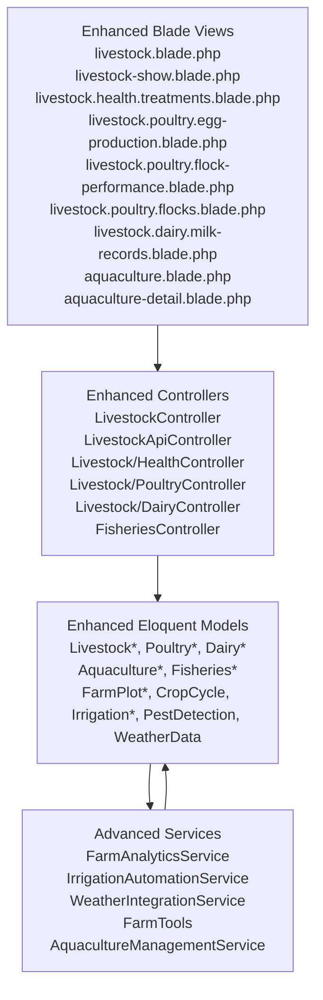

**Diagram sources**
- [LivestockController.php](file://app/Http/Controllers/LivestockController.php)
- [LivestockApiController.php](file://app/Http/Controllers/Api/LivestockApiController.php)
- [Livestock/HealthController.php](file://app/Http/Controllers/Livestock/HealthController.php)
- [Livestock/PoultryController.php](file://app/Http/Controllers/Livestock/PoultryController.php)
- [Livestock/DairyController.php](file://app/Http/Controllers/Livestock/DairyController.php)
- [Fisheries/FisheriesController.php](file://app/Http/Controllers/Fisheries/FisheriesController.php)
- [FarmTools.php](file://app/Services/ERP/FarmTools.php)
- [FarmAnalyticsService.php](file://app/Services/FarmAnalyticsService.php)
- [IrrigationAutomationService.php](file://app/Services/IrrigationAutomationService.php)
- [WeatherIntegrationService.php](file://app/Services/WeatherIntegrationService.php)
- [AquacultureManagementService.php](file://app/Services/Fisheries/AquacultureManagementService.php)

## Detailed Component Analysis

### Enhanced Livestock Herd Management
The LivestockHerd model has been significantly enhanced with comprehensive performance tracking capabilities, including advanced FCR calculations, feed cost analysis, and detailed mortality tracking.

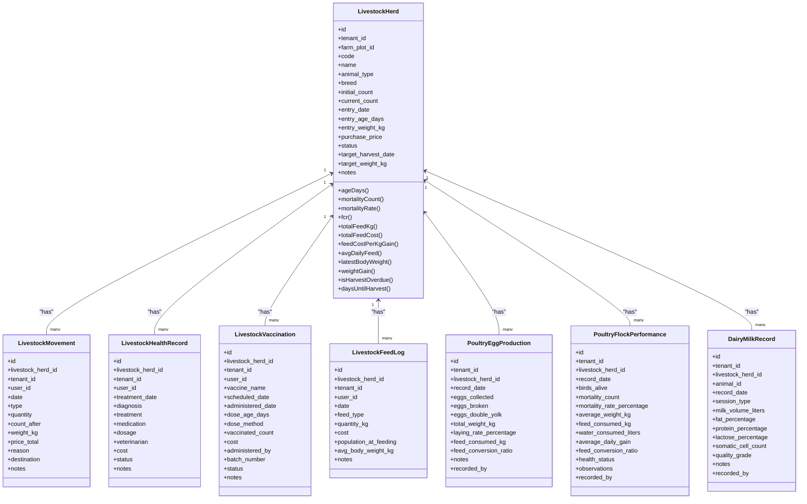

**Diagram sources**
- [LivestockHerd.php](file://app/Models/LivestockHerd.php)
- [LivestockMovement.php](file://app/Models/LivestockMovement.php)
- [LivestockHealthRecord.php](file://app/Models/LivestockHealthRecord.php)
- [LivestockVaccination.php](file://app/Models/LivestockVaccination.php)
- [LivestockFeedLog.php](file://app/Models/LivestockFeedLog.php)
- [PoultryEggProduction.php](file://app/Models/PoultryEggProduction.php)
- [PoultryFlockPerformance.php](file://app/Models/PoultryFlockPerformance.php)
- [DairyMilkRecord.php](file://app/Models/DairyMilkRecord.php)

**Section sources**
- [LivestockHerd.php](file://app/Models/LivestockHerd.php)
- [LivestockMovement.php](file://app/Models/LivestockMovement.php)
- [LivestockHealthRecord.php](file://app/Models/LivestockHealthRecord.php)
- [LivestockVaccination.php](file://app/Models/LivestockVaccination.php)
- [LivestockFeedLog.php](file://app/Models/LivestockFeedLog.php)
- [PoultryEggProduction.php](file://app/Models/PoultryEggProduction.php)
- [PoultryFlockPerformance.php](file://app/Models/PoultryFlockPerformance.php)
- [DairyMilkRecord.php](file://app/Models/DairyMilkRecord.php)

### Enhanced Livestock API Workflow
The API has been expanded with specialized endpoints for animals, health records, breeding operations, and aquaculture management.

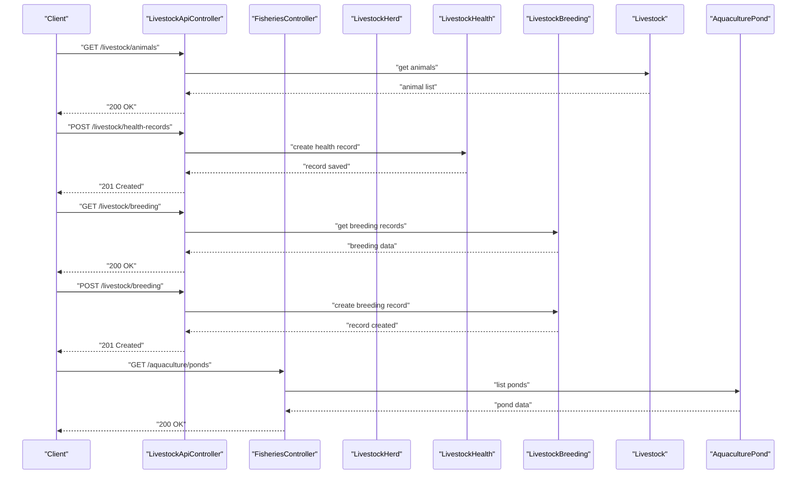

**Diagram sources**
- [LivestockApiController.php](file://app/Http/Controllers/Api/LivestockApiController.php)
- [Fisheries/FisheriesController.php](file://app/Http/Controllers/Fisheries/FisheriesController.php)

**Section sources**
- [LivestockApiController.php](file://app/Http/Controllers/Api/LivestockApiController.php)
- [Fisheries/FisheriesController.php](file://app/Http/Controllers/Fisheries/FisheriesController.php)

## Enhanced Poultry Management
The module now includes comprehensive poultry management capabilities with specialized controllers for egg production and flock performance tracking.

### Poultry Egg Production Monitoring
The PoultryController provides detailed egg production tracking with quality metrics and performance analytics.

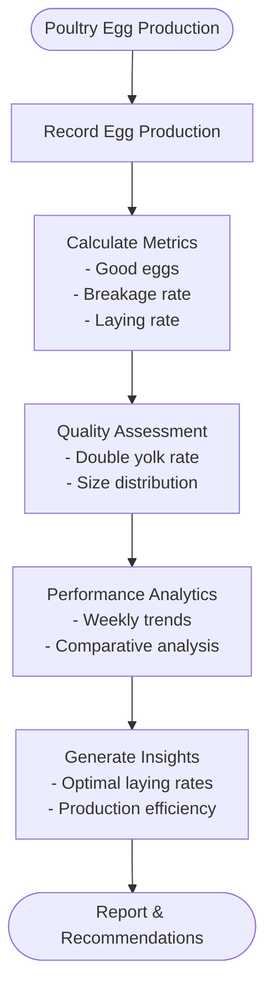

**Diagram sources**
- [Livestock/PoultryController.php](file://app/Http/Controllers/Livestock/PoultryController.php)
- [PoultryEggProduction.php](file://app/Models/PoultryEggProduction.php)

### Poultry Flock Performance Tracking
Advanced flock performance monitoring with mortality tracking and growth metrics.

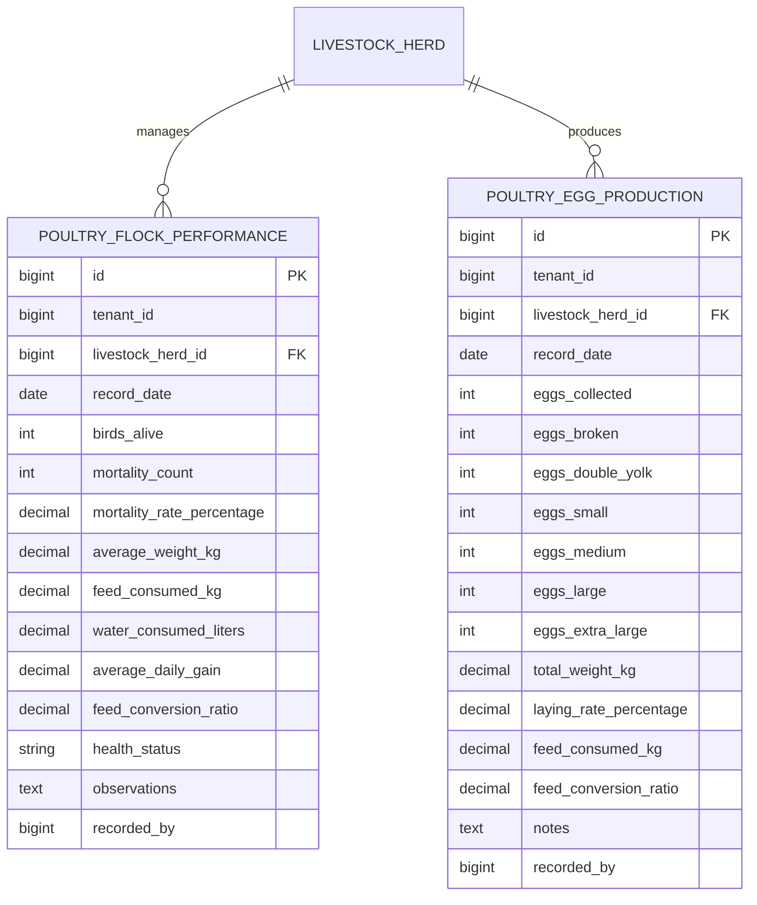

**Diagram sources**
- [PoultryFlockPerformance.php](file://app/Models/PoultryFlockPerformance.php)
- [PoultryEggProduction.php](file://app/Models/PoultryEggProduction.php)

**Section sources**
- [Livestock/PoultryController.php](file://app/Http/Controllers/Livestock/PoultryController.php)
- [PoultryFlockPerformance.php](file://app/Models/PoultryFlockPerformance.php)
- [PoultryEggProduction.php](file://app/Models/PoultryEggProduction.php)

## Advanced Livestock Health Management
The dedicated HealthController provides comprehensive health management with treatment and vaccination tracking.

### Treatment and Vaccination Management
Centralized health record management with status tracking and automated reminders.

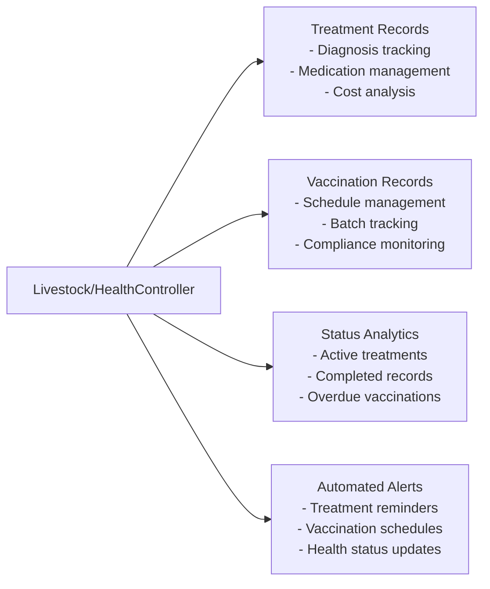

**Diagram sources**
- [Livestock/HealthController.php](file://app/Http/Controllers/Livestock/HealthController.php)
- [LivestockHealthRecord.php](file://app/Models/LivestockHealthRecord.php)
- [LivestockVaccination.php](file://app/Models/LivestockVaccination.php)

**Section sources**
- [Livestock/HealthController.php](file://app/Http/Controllers/Livestock/HealthController.php)
- [LivestockHealthRecord.php](file://app/Models/LivestockHealthRecord.php)
- [LivestockVaccination.php](file://app/Models/LivestockVaccination.php)

## Dairy Management Integration
Complete milk production monitoring with quality metrics and production analytics.

### Milk Production Monitoring
Comprehensive dairy management with quality assessment and production tracking.

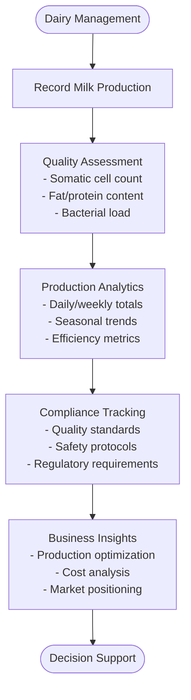

**Diagram sources**
- [Livestock/DairyController.php](file://app/Http/Controllers/Livestock/DairyController.php)
- [DairyMilkRecord.php](file://app/Models/DairyMilkRecord.php)

**Section sources**
- [Livestock/DairyController.php](file://app/Http/Controllers/Livestock/DairyController.php)
- [DairyMilkRecord.php](file://app/Models/DairyMilkRecord.php)

## Aquaculture Operations Management
The module now includes comprehensive aquaculture operations with specialized models for pond management, water quality monitoring, and fish feeding schedules.

### Aquaculture Pond Management
Complete fish farming management with pond operations, species tracking, and growth monitoring.

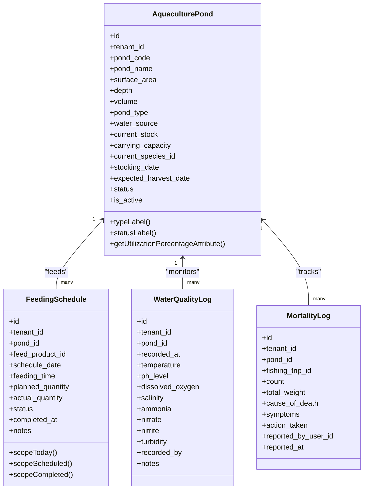

**Diagram sources**
- [AquaculturePond.php](file://app/Models/AquaculturePond.php)
- [FeedingSchedule.php](file://app/Models/FeedingSchedule.php)
- [WaterQualityLog.php](file://app/Models/WaterQualityLog.php)

### Aquaculture Management Service
Centralized service layer for aquaculture operations with comprehensive business logic.

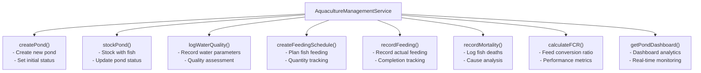

**Diagram sources**
- [AquacultureManagementService.php](file://app/Services/Fisheries/AquacultureManagementService.php)

**Section sources**
- [AquaculturePond.php](file://app/Models/AquaculturePond.php)
- [FeedingSchedule.php](file://app/Models/FeedingSchedule.php)
- [WaterQualityLog.php](file://app/Models/WaterQualityLog.php)
- [AquacultureManagementService.php](file://app/Services/Fisheries/AquacultureManagementService.php)

### Aquaculture API Endpoints
Specialized endpoints for comprehensive aquaculture operations management.

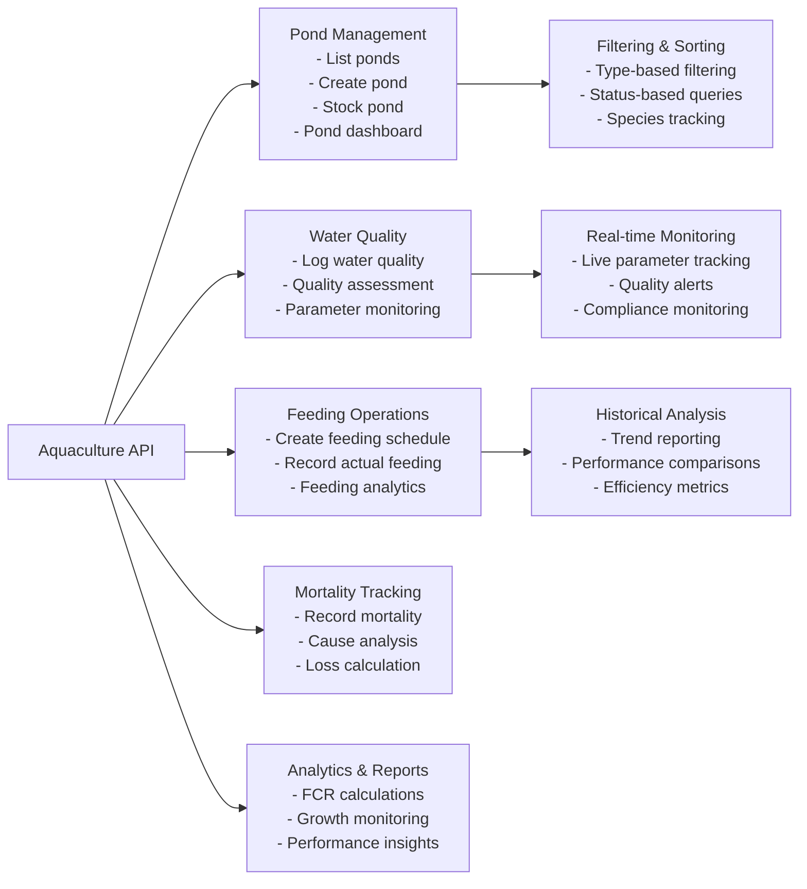

**Diagram sources**
- [Fisheries/FisheriesController.php](file://app/Http/Controllers/Fisheries/FisheriesController.php)

**Section sources**
- [Fisheries/FisheriesController.php](file://app/Http/Controllers/Fisheries/FisheriesController.php)

## Livestock Performance Analytics
Enhanced analytics capabilities with real-time FCR calculations and comparative performance analysis.

### Feed Conversion Ratio (FCR) Analytics
Advanced performance tracking with automated calculations and trend analysis.

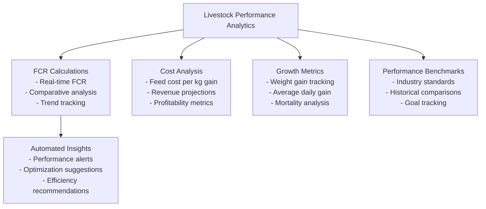

**Diagram sources**
- [LivestockHerd.php](file://app/Models/LivestockHerd.php)
- [FarmTools.php](file://app/Services/ERP/FarmTools.php)

**Section sources**
- [LivestockHerd.php](file://app/Models/LivestockHerd.php)
- [FarmTools.php](file://app/Services/ERP/FarmTools.php)

## API Enhancement
Expanded API endpoints for comprehensive livestock and aquaculture operations management.

### Livestock and Aquaculture API Endpoints
Specialized endpoints for different aspects of livestock and aquatic management with enhanced functionality.

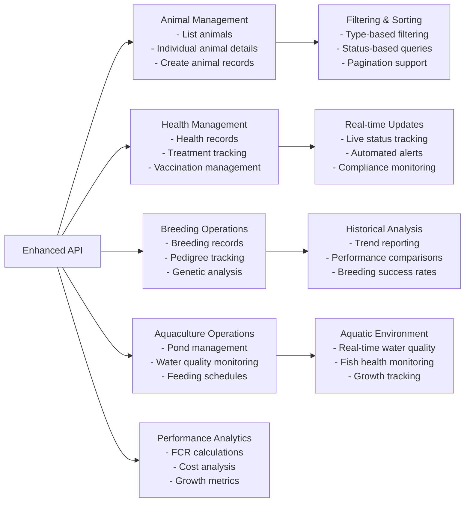

**Diagram sources**
- [LivestockApiController.php](file://app/Http/Controllers/Api/LivestockApiController.php)
- [Fisheries/FisheriesController.php](file://app/Http/Controllers/Fisheries/FisheriesController.php)

**Section sources**
- [LivestockApiController.php](file://app/Http/Controllers/Api/LivestockApiController.php)
- [Fisheries/FisheriesController.php](file://app/Http/Controllers/Fisheries/FisheriesController.php)

## Dependency Analysis
The enhanced module maintains clear separation of concerns with specialized controllers and integrated services.

```mermaid
graph TB
CTRL_L["LivestockController"] --> MODEL_LH["LivestockHerd"]
CTRL_L --> MODEL_LM["LivestockMovement"]
CTRL_L --> MODEL_LHR["LivestockHealthRecord"]
CTRL_L --> MODEL_LV["LivestockVaccination"]
CTRL_L --> MODEL_LF["LivestockFeedLog"]
CTRL_A["LivestockApiController"] --> MODEL_LH
CTRL_A --> MODEL_LM
CTRL_A --> MODEL_LHR
CTRL_A --> MODEL_LV
CTRL_A --> MODEL_LF
CTRL_HC["Livestock/HealthController"] --> MODEL_LH
CTRL_HC --> MODEL_LHR
CTRL_HC --> MODEL_LV
CTRL_PC["Livestock/PoultryController"] --> MODEL_LH
CTRL_PC --> MODEL_PEP["PoultryEggProduction"]
CTRL_PC --> MODEL_PFP["PoultryFlockPerformance"]
CTRL_DC["Livestock/DairyController"] --> MODEL_LH
CTRL_DC --> MODEL_DMR["DairyMilkRecord"]
CTRL_FC["FisheriesController"] --> MODEL_AP["AquaculturePond"]
CTRL_FC --> MODEL_FS["FeedingSchedule"]
CTRL_FC --> MODEL_WQL["WaterQualityLog"]
SVC_F["FarmAnalyticsService"] --> MODEL_LH
SVC_F --> MODEL_LM
SVC_F --> MODEL_LHR
SVC_F --> MODEL_LV
SVC_F --> MODEL_LF
SVC_F --> MODEL_PEP
SVC_F --> MODEL_PFP
SVC_F --> MODEL_DMR
SVC_F --> MODEL_FP["FarmPlot"]
SVC_F --> MODEL_FPA["FarmPlotActivity"]
SVC_F --> MODEL_CC["CropCycle"]
SVC_F --> MODEL_IR["IrrigationSchedule"]
SVC_F --> MODEL_IL["IrrigationLog"]
SVC_F --> MODEL_PD["PestDetection"]
SVC_F --> MODEL_WD["WeatherData"]
SVC_AMS["AquacultureManagementService"] --> MODEL_AP
SVC_AMS --> MODEL_FS
SVC_AMS --> MODEL_WQL
SVC_FT["FarmTools"] --> MODEL_LH
SVC_FT --> MODEL_LF
SVC_IA["IrrigationAutomationService"] --> MODEL_IR
SVC_IA --> MODEL_IL
SVC_WI["WeatherIntegrationService"] --> MODEL_WD
```

**Diagram sources**
- [LivestockController.php](file://app/Http/Controllers/LivestockController.php)
- [LivestockApiController.php](file://app/Http/Controllers/Api/LivestockApiController.php)
- [Livestock/HealthController.php](file://app/Http/Controllers/Livestock/HealthController.php)
- [Livestock/PoultryController.php](file://app/Http/Controllers/Livestock/PoultryController.php)
- [Livestock/DairyController.php](file://app/Http/Controllers/Livestock/DairyController.php)
- [Fisheries/FisheriesController.php](file://app/Http/Controllers/Fisheries/FisheriesController.php)
- [FarmTools.php](file://app/Services/ERP/FarmTools.php)
- [FarmAnalyticsService.php](file://app/Services/FarmAnalyticsService.php)
- [IrrigationAutomationService.php](file://app/Services/IrrigationAutomationService.php)
- [WeatherIntegrationService.php](file://app/Services/WeatherIntegrationService.php)
- [AquacultureManagementService.php](file://app/Services/Fisheries/AquacultureManagementService.php)

**Section sources**
- [LivestockController.php](file://app/Http/Controllers/LivestockController.php)
- [LivestockApiController.php](file://app/Http/Controllers/Api/LivestockApiController.php)
- [Livestock/HealthController.php](file://app/Http/Controllers/Livestock/HealthController.php)
- [Livestock/PoultryController.php](file://app/Http/Controllers/Livestock/PoultryController.php)
- [Livestock/DairyController.php](file://app/Http/Controllers/Livestock/DairyController.php)
- [Fisheries/FisheriesController.php](file://app/Http/Controllers/Fisheries/FisheriesController.php)
- [FarmTools.php](file://app/Services/ERP/FarmTools.php)
- [FarmAnalyticsService.php](file://app/Services/FarmAnalyticsService.php)
- [IrrigationAutomationService.php](file://app/Services/IrrigationAutomationService.php)
- [WeatherIntegrationService.php](file://app/Services/WeatherIntegrationService.php)
- [AquacultureManagementService.php](file://app/Services/Fisheries/AquacultureManagementService.php)

## Performance Considerations
The enhanced module includes several performance optimizations and scalability improvements:

- **Advanced Indexing**: Enhanced database indexing strategies for improved query performance on large datasets including aquaculture operations
- **Real-time Analytics**: Optimized aggregation queries for live performance metrics, FCR calculations, and water quality monitoring
- **Automated Processing**: Background job processing for heavy analytics computations, report generation, and aquaculture monitoring
- **Caching Strategies**: Intelligent caching for frequently accessed performance data, comparison metrics, and real-time water quality parameters
- **Scalable Architecture**: Horizontal scaling support for multiple livestock types, large farm operations, and extensive aquaculture facilities
- **API Optimization**: Rate limiting and efficient pagination for enhanced API performance across both terrestrial and aquatic operations
- **Multi-tenant Isolation**: Enhanced tenant isolation for aquaculture operations with separate pond management and water quality tracking

## Troubleshooting Guide
Enhanced troubleshooting procedures for the expanded livestock and aquaculture management system:

### Livestock Performance Issues
- **FCR Calculation Errors**: Verify feed log entries have both quantity and body weight data; ensure consistent measurement units
- **Performance Metric Discrepancies**: Check for missing or inconsistent data in feed logs and health records
- **Heritage Data Inconsistencies**: Validate animal movement records and ensure proper linkage to herd records

### Poultry Management Issues
- **Egg Production Tracking**: Confirm egg collection records are properly timestamped and linked to correct flock IDs
- **Flock Performance Metrics**: Verify mortality counts are accurately recorded and calculated in performance reports
- **Quality Assessment Errors**: Check laying rate calculations and ensure proper handling of zero-collection days

### Dairy Management Issues
- **Milk Quality Assessment**: Verify somatic cell count and composition data accuracy for quality grading
- **Production Recording**: Ensure milking session timing and volume measurements are properly captured
- **Quality Standards**: Validate compliance with SCC and fat percentage thresholds for quality grades

### Aquaculture Operations Issues
- **Pond Stocking Problems**: Verify species compatibility and carrying capacity calculations before stocking operations
- **Water Quality Monitoring**: Ensure proper calibration of water quality sensors and regular maintenance of monitoring equipment
- **Feeding Schedule Accuracy**: Check planned vs actual feeding quantities and adjust schedules based on water temperature and fish behavior
- **Mortality Tracking**: Validate cause of death classifications and ensure proper documentation for insurance and regulatory compliance

### Health Management Issues
- **Treatment Record Validation**: Ensure diagnosis codes and medication entries follow established protocols
- **Vaccination Compliance**: Verify batch numbers and expiration dates are properly tracked and monitored
- **Status Synchronization**: Check real-time status updates and alert system configurations

### API and Integration Issues
- **Endpoint Performance**: Monitor API response times and implement caching for frequently accessed data including water quality parameters
- **Data Consistency**: Ensure proper transaction handling for concurrent livestock and aquaculture operations
- **Authentication**: Verify proper tenant isolation and user authorization for multi-tenant deployments
- **Real-time Monitoring**: Check WebSocket connections for live water quality updates and feeding schedule notifications

**Section sources**
- [LivestockHerd.php](file://app/Models/LivestockHerd.php)
- [Livestock/PoultryController.php](file://app/Http/Controllers/Livestock/PoultryController.php)
- [Livestock/HealthController.php](file://app/Http/Controllers/Livestock/HealthController.php)
- [Livestock/DairyController.php](file://app/Http/Controllers/Livestock/DairyController.php)
- [AquaculturePond.php](file://app/Models/AquaculturePond.php)
- [WaterQualityLog.php](file://app/Models/WaterQualityLog.php)
- [FeedingSchedule.php](file://app/Models/FeedingSchedule.php)
- [LivestockApiController.php](file://app/Http/Controllers/Api/LivestockApiController.php)
- [Fisheries/FisheriesController.php](file://app/Http/Controllers/Fisheries/FisheriesController.php)

## Conclusion
The enhanced Livestock & Agriculture Module provides a comprehensive, enterprise-grade solution for modern livestock and crop management, now including specialized aquaculture operations. The expansion includes advanced poultry management capabilities, detailed health monitoring systems, sophisticated performance analytics, integrated dairy operations, and comprehensive aquatic environment monitoring. The modular architecture supports scalability for large-scale operations while maintaining real-time performance monitoring, automated insights generation, and specialized aquaculture management with water quality tracking and fish farming operations. The enhanced API provides comprehensive livestock and aquatic operations management with specialized endpoints for different operational aspects, including real-time water quality monitoring and fish health tracking.

## Appendices

### Enhanced UI Navigation and Dashboards
- **Livestock Management**: [livestock.blade.php](file://resources/views/farm/livestock.blade.php), [livestock-show.blade.php](file://resources/views/farm/livestock-show.blade.php)
- **Health Management**: [livestock.health.treatments.blade.php](file://resources/views/livestock/health/treatments.blade.php), [livestock.health.vaccinations.blade.php](file://resources/views/livestock/health/vaccinations.blade.php)
- **Poultry Management**: [livestock.poultry.egg-production.blade.php](file://resources/views/livestock/poultry/egg-production.blade.php), [livestock.poultry.flock-performance.blade.php](file://resources/views/livestock/poultry/flock-performance.blade.php), [livestock.poultry.flocks.blade.php](file://resources/views/livestock/poultry/flocks.blade.php)
- **Dairy Management**: [livestock.dairy.milk-records.blade.php](file://resources/views/livestock/dairy/milk-records.blade.php)
- **Aquaculture Management**: [aquaculture.blade.php](file://resources/views/fisheries/aquaculture.blade.php), [aquaculture-detail.blade.php](file://resources/views/fisheries/aquaculture-detail.blade.php)
- **Analytics**: [analytics.blade.php](file://resources/views/farm/analytics.blade.php)
- **Crop Cycles**: [cycles.blade.php](file://resources/views/farm/cycles.blade.php), [cycle-show.blade.php](file://resources/views/farm/cycle-show.blade.php)
- **Farm Plots**: [plots.blade.php](file://resources/views/farm/plots.blade.php), [plot-show.blade.php](file://resources/views/farm/plot-show.blade.php)
- **Agriculture Dashboard**: [dashboard.blade.php](file://resources/views/agriculture/dashboard.blade.php)
- **Harvest Logs**: [harvest-logs.blade.php](file://resources/views/farm/harvest-logs.blade.php), [harvest-show.blade.php](file://resources/views/farm/harvest-show.blade.php)

**Section sources**
- [livestock.blade.php](file://resources/views/farm/livestock.blade.php)
- [livestock-show.blade.php](file://resources/views/farm/livestock-show.blade.php)
- [livestock.health.treatments.blade.php](file://resources/views/livestock/health/treatments.blade.php)
- [livestock.health.vaccinations.blade.php](file://resources/views/livestock/health/vaccinations.blade.php)
- [livestock.poultry.egg-production.blade.php](file://resources/views/livestock/poultry/egg-production.blade.php)
- [livestock.poultry.flock-performance.blade.php](file://resources/views/livestock/poultry/flock-performance.blade.php)
- [livestock.poultry.flocks.blade.php](file://resources/views/livestock/poultry/flocks.blade.php)
- [livestock.dairy.milk-records.blade.php](file://resources/views/livestock/dairy/milk-records.blade.php)
- [aquaculture.blade.php](file://resources/views/fisheries/aquaculture.blade.php)
- [aquaculture-detail.blade.php](file://resources/views/fisheries/aquaculture-detail.blade.php)
- [analytics.blade.php](file://resources/views/farm/analytics.blade.php)
- [cycles.blade.php](file://resources/views/farm/cycles.blade.php)
- [cycle-show.blade.php](file://resources/views/farm/cycle-show.blade.php)
- [plots.blade.php](file://resources/views/farm/plots.blade.php)
- [plot-show.blade.php](file://resources/views/farm/plot-show.blade.php)
- [dashboard.blade.php](file://resources/views/agriculture/dashboard.blade.php)
- [harvest-logs.blade.php](file://resources/views/farm/harvest-logs.blade.php)
- [harvest-show.blade.php](file://resources/views/farm/harvest-show.blade.php)