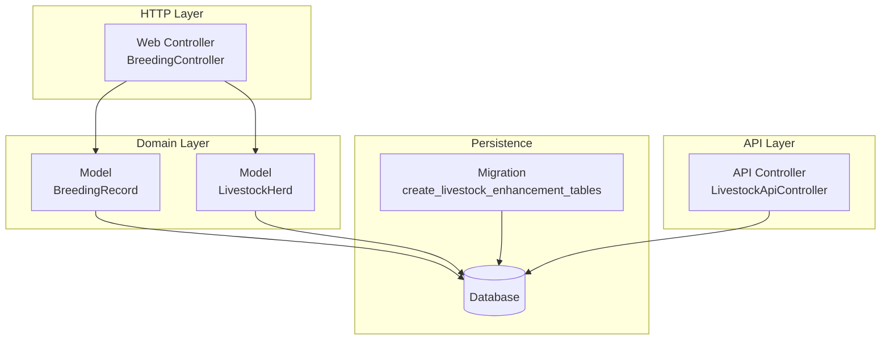
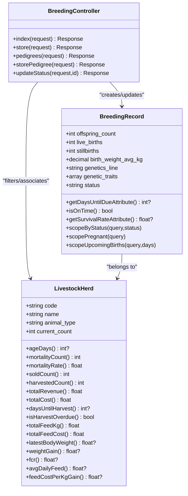
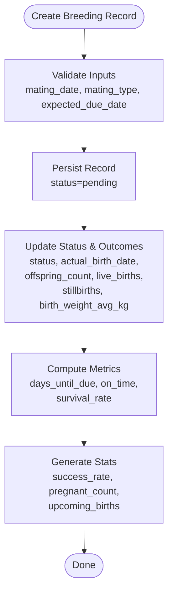
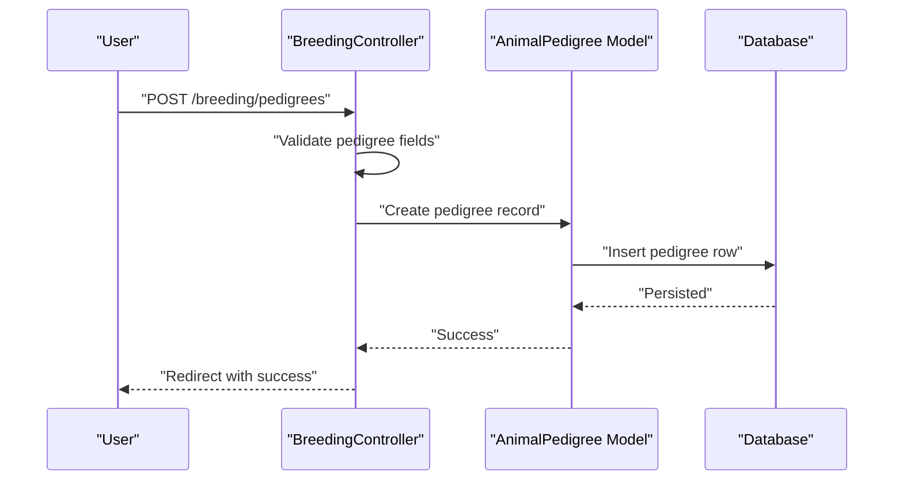
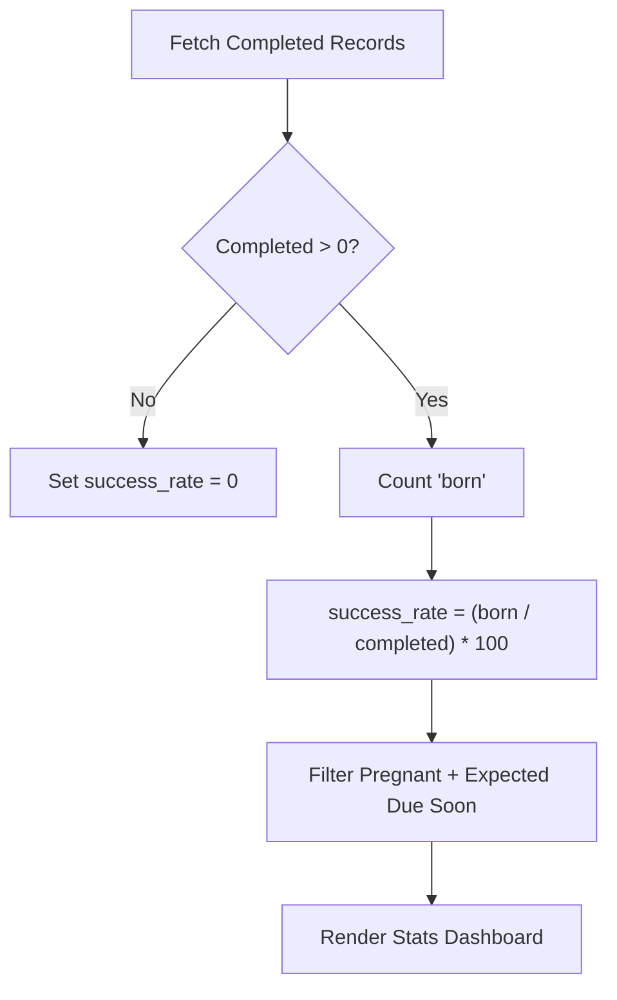
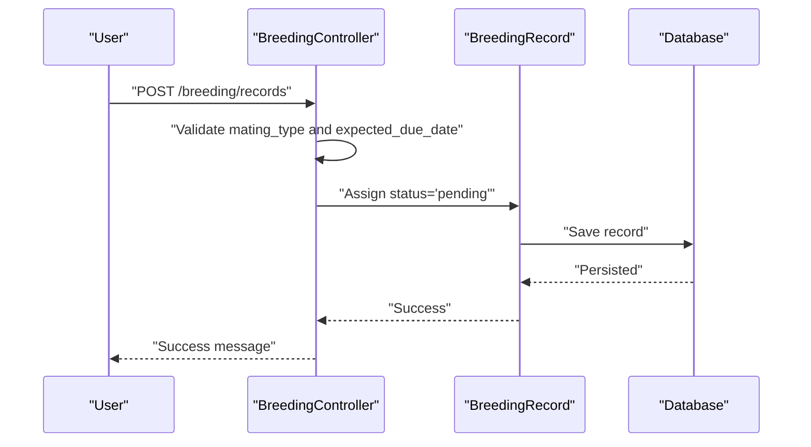
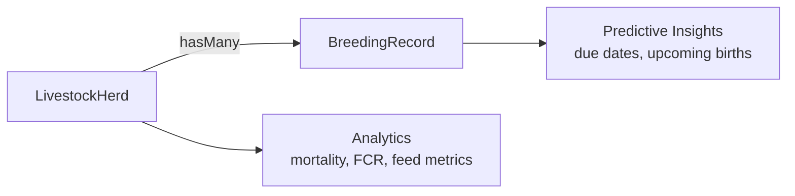
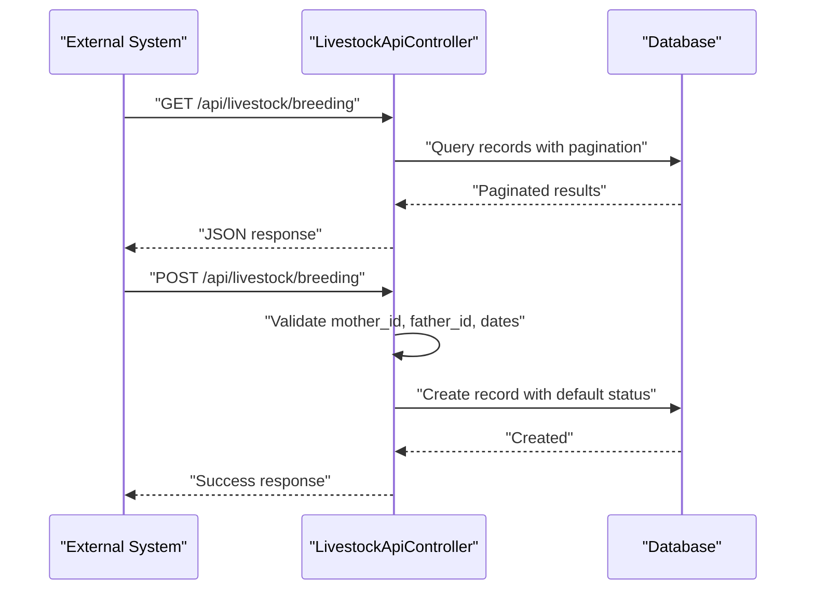
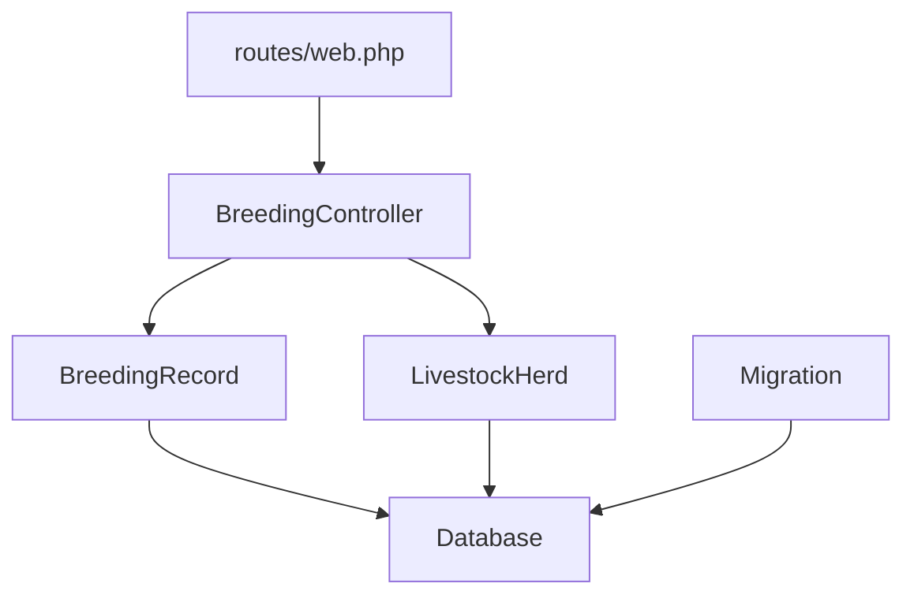

# Breeding Program Management

<cite>
**Referenced Files in This Document**
- [BreedingRecord.php](file://app/Models/BreedingRecord.php)
- [LivestockHerd.php](file://app/Models/LivestockHerd.php)
- [BreedingController.php](file://app/Http/Controllers/Livestock/BreedingController.php)
- [create_livestock_enhancement_tables.php](file://database/migrations/2026_04_07_120000_create_livestock_enhancement_tables.php)
- [web.php](file://routes/web.php)
- [LivestockApiController.php](file://app/Http/Controllers/Api/LivestockApiController.php)
</cite>

## Table of Contents
1. [Introduction](#introduction)
2. [Project Structure](#project-structure)
3. [Core Components](#core-components)
4. [Architecture Overview](#architecture-overview)
5. [Detailed Component Analysis](#detailed-component-analysis)
6. [Dependency Analysis](#dependency-analysis)
7. [Performance Considerations](#performance-considerations)
8. [Troubleshooting Guide](#troubleshooting-guide)
9. [Conclusion](#conclusion)

## Introduction
This document describes the Breeding Program Management system within the qalcuityERP platform. It covers breeding record tracking (mating dates, artificial insemination protocols, embryo transfer procedures, expected due dates), pedigree registration with genetic lineage tracking and performance data, breeding success rate calculations, pregnancy monitoring, and birth outcome tracking. It also outlines practical examples of workflow automation, genetic selection criteria, reproductive health monitoring, and integration with herd management systems and automated breeding cycle predictions.

## Project Structure
The breeding program is implemented through:
- A dedicated controller for web interactions
- A model representing breeding records with computed attributes and scopes
- A model for livestock herds linking animals to management units
- Database migrations defining core tables for breeding records and pedigrees
- API endpoints for external integrations
- Routing configuration exposing web endpoints

**Diagram sources**
- [BreedingController.php:10-174](file://app/Http/Controllers/Livestock/BreedingController.php#L10-L174)
- [BreedingRecord.php:11-136](file://app/Models/BreedingRecord.php#L11-L136)
- [LivestockHerd.php:11-197](file://app/Models/LivestockHerd.php#L11-L197)
- [create_livestock_enhancement_tables.php:113-165](file://database/migrations/2026_04_07_120000_create_livestock_enhancement_tables.php#L113-L165)
- [LivestockApiController.php:90-116](file://app/Http/Controllers/Api/LivestockApiController.php#L90-L116)

**Section sources**
- [web.php:948-954](file://routes/web.php#L948-L954)
- [create_livestock_enhancement_tables.php:113-165](file://database/migrations/2026_04_07_120000_create_livestock_enhancement_tables.php#L113-L165)

## Core Components
- BreedingRecord model: central entity for mating, pregnancy, and birth outcomes; includes computed attributes for due-date proximity, on-time birth assessment, and survival rate; scopes for filtering by status and upcoming births.
- LivestockHerd model: represents managed groups of animals, supports herd-level analytics and integrates with breeding records.
- BreedingController: handles web UI for viewing statistics, creating records, managing pedigrees, and updating statuses.
- API endpoints: expose breeding data retrieval and creation for external systems.
- Database schema: defines normalized tables for breeding records and pedigrees with appropriate indices.

Key capabilities:
- Track mating types: natural, artificial insemination, embryo transfer
- Monitor pregnancy and due dates
- Record birth outcomes and survival metrics
- Compute success rates and upcoming birth alerts
- Register pedigrees with genetic lineage and performance data

**Section sources**
- [BreedingRecord.php:15-44](file://app/Models/BreedingRecord.php#L15-L44)
- [LivestockHerd.php:14-30](file://app/Models/LivestockHerd.php#L14-L30)
- [BreedingController.php:15-48](file://app/Http/Controllers/Livestock/BreedingController.php#L15-L48)
- [create_livestock_enhancement_tables.php:113-165](file://database/migrations/2026_04_07_120000_create_livestock_enhancement_tables.php#L113-L165)

## Architecture Overview
The system follows a layered architecture:
- Web/UI layer: BreedingController renders statistics and manages CRUD operations
- Domain models: BreedingRecord and LivestockHerd encapsulate business logic and data
- Persistence: Laravel Eloquent ORM backed by migrations
- API layer: LivestockApiController provides programmatic access

**Diagram sources**
- [BreedingRecord.php:11-136](file://app/Models/BreedingRecord.php#L11-L136)
- [LivestockHerd.php:11-197](file://app/Models/LivestockHerd.php#L11-L197)
- [BreedingController.php:10-174](file://app/Http/Controllers/Livestock/BreedingController.php#L10-L174)

## Detailed Component Analysis

### Breeding Record Tracking
The BreedingRecord model captures:
- Identity and parentage: dam_id, sire_id
- Breeding event: mating_date, mating_type
- Gestation and outcomes: expected_due_date, actual_birth_date, offspring_count, live_births, stillbirths, birth_weight_avg_kg
- Genetics: genetics_line, genetic_traits
- Administrative: status, notes, recorded_by, livestock_herd_id

Computed attributes and scopes enable:
- Days until due calculation
- On-time birth determination (±7 days tolerance)
- Survival rate computation
- Filtering by status and upcoming births

**Diagram sources**
- [BreedingController.php:54-80](file://app/Http/Controllers/Livestock/BreedingController.php#L54-L80)
- [BreedingRecord.php:82-118](file://app/Models/BreedingRecord.php#L82-L118)

**Section sources**
- [BreedingRecord.php:15-44](file://app/Models/BreedingRecord.php#L15-L44)
- [BreedingRecord.php:82-135](file://app/Models/BreedingRecord.php#L82-L135)
- [BreedingController.php:54-80](file://app/Http/Controllers/Livestock/BreedingController.php#L54-L80)

### Pedigree Registration System
The system supports pedigree registration with:
- Unique animal identifiers and names
- Breed, birth date, gender
- Parentage (dam_id, sire_id)
- Genetic line and markers
- Performance data and registration numbers
- Active status and notes

**Diagram sources**
- [BreedingController.php:98-126](file://app/Http/Controllers/Livestock/BreedingController.php#L98-L126)
- [create_livestock_enhancement_tables.php:142-165](file://database/migrations/2026_04_07_120000_create_livestock_enhancement_tables.php#L142-L165)

**Section sources**
- [BreedingController.php:85-126](file://app/Http/Controllers/Livestock/BreedingController.php#L85-L126)
- [create_livestock_enhancement_tables.php:142-165](file://database/migrations/2026_04_07_120000_create_livestock_enhancement_tables.php#L142-L165)

### Breeding Success Rate and Pregnancy Monitoring
Success rate is calculated as:
- Success rate = (Count of records with status 'born') / (Count of records with status in ['born','failed']) × 100

Pregnancy monitoring includes:
- Upcoming births within a configurable window (e.g., 30 days)
- Status updates to 'pregnant' and 'born'
- Birth outcome capture for live vs stillbirths and average birth weight

**Diagram sources**
- [BreedingController.php:17-36](file://app/Http/Controllers/Livestock/BreedingController.php#L17-L36)
- [BreedingRecord.php:120-135](file://app/Models/BreedingRecord.php#L120-L135)

**Section sources**
- [BreedingController.php:15-48](file://app/Http/Controllers/Livestock/BreedingController.php#L15-L48)
- [BreedingRecord.php:120-135](file://app/Models/BreedingRecord.php#L120-L135)

### Artificial Insemination and Embryo Transfer Protocols
Protocols are captured via mating_type enumeration:
- natural
- artificial_insemination
- embryo_transfer

Expected due dates are validated to be after mating_date. The system supports:
- Recording protocol type
- Estimating due dates
- Updating outcomes and weights

**Diagram sources**
- [BreedingController.php:54-80](file://app/Http/Controllers/Livestock/BreedingController.php#L54-L80)
- [BreedingRecord.php:15-44](file://app/Models/BreedingRecord.php#L15-L44)

**Section sources**
- [BreedingController.php:56-66](file://app/Http/Controllers/Livestock/BreedingController.php#L56-L66)
- [create_livestock_enhancement_tables.php:121-122](file://database/migrations/2026_04_07_120000_create_livestock_enhancement_tables.php#L121-L122)

### Herd Integration and Automated Predictions
LivestockHerd integrates with breeding via:
- Association of breeding records to herds
- Herd-level analytics supporting management decisions
- Automated predictions through computed attributes (e.g., days until harvest, FCR) that inform breeding timing and resource allocation

**Diagram sources**
- [LivestockHerd.php:46-48](file://app/Models/LivestockHerd.php#L46-L48)
- [BreedingRecord.php:51-53](file://app/Models/BreedingRecord.php#L51-L53)

**Section sources**
- [LivestockHerd.php:14-30](file://app/Models/LivestockHerd.php#L14-L30)
- [LivestockHerd.php:119-182](file://app/Models/LivestockHerd.php#L119-L182)

### API Integration
External systems can integrate via:
- Listing breeding records with associated animals
- Creating new breeding events with status defaults

**Diagram sources**
- [LivestockApiController.php:90-116](file://app/Http/Controllers/Api/LivestockApiController.php#L90-L116)

**Section sources**
- [LivestockApiController.php:90-116](file://app/Http/Controllers/Api/LivestockApiController.php#L90-L116)

## Dependency Analysis
- BreedingController depends on BreedingRecord and LivestockHerd for data access and rendering.
- BreedingRecord belongs to LivestockHerd and User (recorded_by).
- Database migrations define foreign keys and indexes for performance and referential integrity.
- Routes bind web endpoints to BreedingController actions.

**Diagram sources**
- [web.php:948-954](file://routes/web.php#L948-L954)
- [BreedingController.php:10-174](file://app/Http/Controllers/Livestock/BreedingController.php#L10-L174)
- [create_livestock_enhancement_tables.php:113-165](file://database/migrations/2026_04_07_120000_create_livestock_enhancement_tables.php#L113-L165)

**Section sources**
- [web.php:948-954](file://routes/web.php#L948-L954)
- [create_livestock_enhancement_tables.php:113-165](file://database/migrations/2026_04_07_120000_create_livestock_enhancement_tables.php#L113-L165)

## Performance Considerations
- Indexes on tenant_id and status in breeding_records support fast filtering and reporting.
- Pagination in controller actions prevents heavy loads on large datasets.
- Scopes limit queries to relevant subsets (e.g., pregnant, upcoming births).
- Consider adding composite indexes for frequent filters (e.g., expected_due_date range) to further optimize reporting.

## Troubleshooting Guide
Common issues and resolutions:
- Validation errors on creation: ensure mating_date precedes expected_due_date and mating_type is one of the allowed values.
- Status transitions: update status to 'pregnant' after confirmation and 'born' with actual_birth_date and birth outcomes.
- Missing due date: days until due will be null; set expected_due_date to enable calculations.
- API creation: confirm mother_id exists and optional father_id conforms to existing records.

**Section sources**
- [BreedingController.php:56-66](file://app/Http/Controllers/Livestock/BreedingController.php#L56-L66)
- [BreedingController.php:133-140](file://app/Http/Controllers/Livestock/BreedingController.php#L133-L140)
- [BreedingRecord.php:85-92](file://app/Models/BreedingRecord.php#L85-L92)

## Conclusion
The Breeding Program Management system provides a robust foundation for tracking breeding events, managing genetic lineages, and monitoring reproductive outcomes. Its modular design enables integration with herd analytics and external systems, while computed metrics and scopes streamline reporting and decision-making. By leveraging the provided APIs and controller actions, organizations can automate workflows, enforce standardized protocols, and maintain accurate records for long-term genetic improvement.