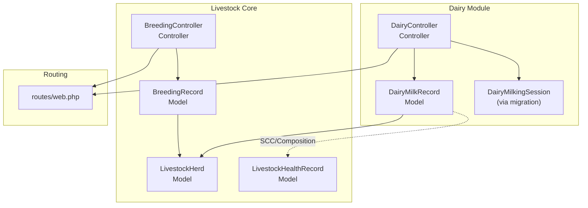
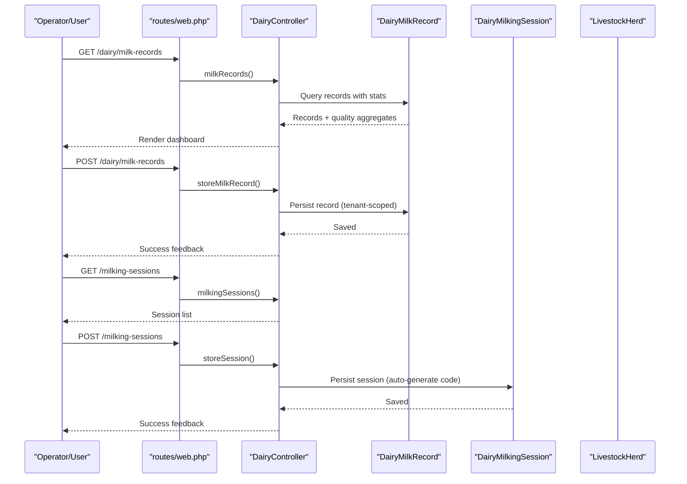
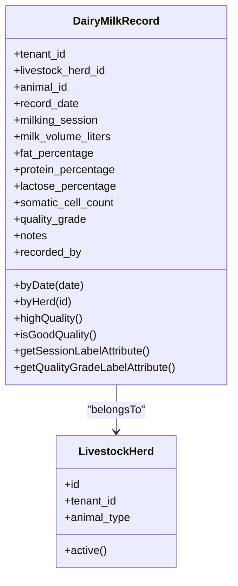
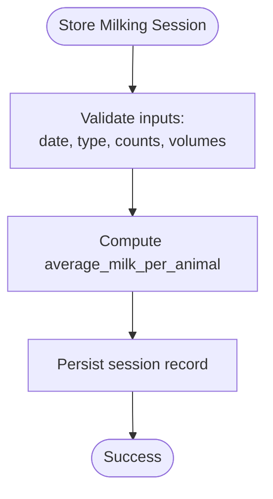
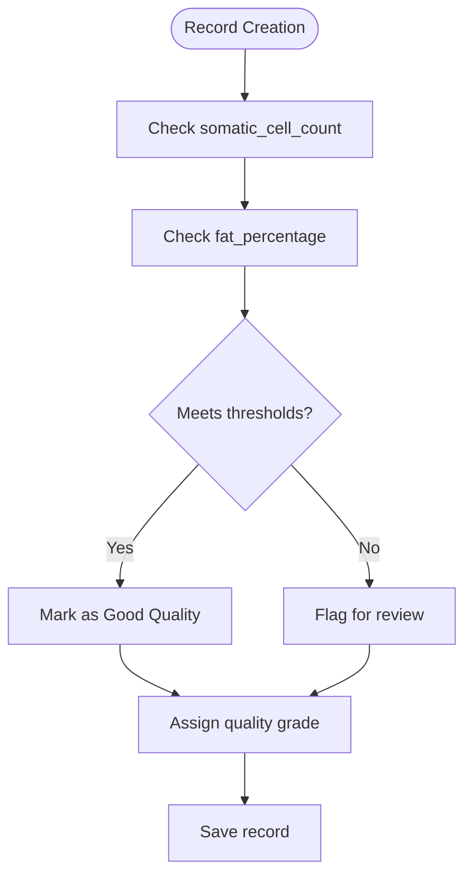
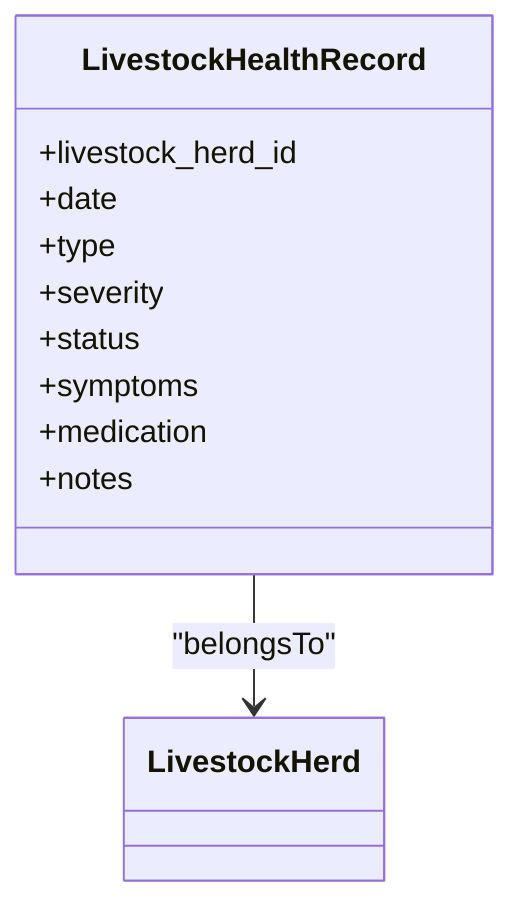
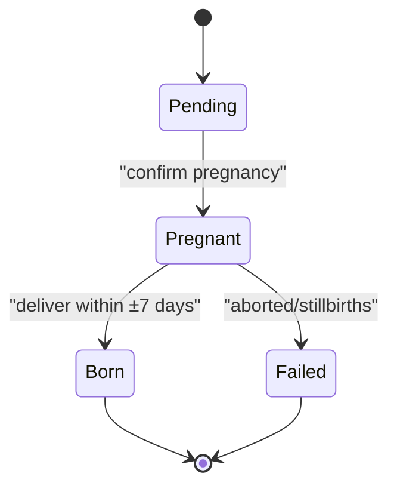
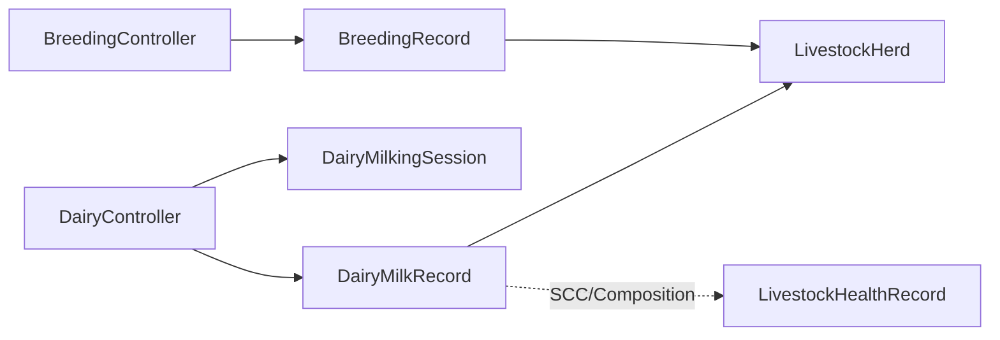

# Dairy Operations Management

<cite>
**Referenced Files in This Document**
- [DairyMilkRecord.php](file://app/Models/DairyMilkRecord.php)
- [DairyController.php](file://app/Http/Controllers/Livestock/DairyController.php)
- [LivestockHerd.php](file://app/Models/LivestockHerd.php)
- [BreedingRecord.php](file://app/Models/BreedingRecord.php)
- [BreedingController.php](file://app/Http/Controllers/Livestock/BreedingController.php)
- [LivestockHealthRecord.php](file://app/Models/LivestockHealthRecord.php)
- [2026_04_07_120000_create_livestock_enhancement_tables.php](file://database/migrations/2026_04_07_120000_create_livestock_enhancement_tables.php)
- [web.php](file://routes/web.php)
</cite>

## Table of Contents
1. [Introduction](#introduction)
2. [Project Structure](#project-structure)
3. [Core Components](#core-components)
4. [Architecture Overview](#architecture-overview)
5. [Detailed Component Analysis](#detailed-component-analysis)
6. [Dependency Analysis](#dependency-analysis)
7. [Performance Considerations](#performance-considerations)
8. [Troubleshooting Guide](#troubleshooting-guide)
9. [Conclusion](#conclusion)
10. [Appendices](#appendices)

## Introduction
This document describes the Dairy Operations Management capabilities implemented in the system, focusing on:
- Milk production monitoring and analytics
- Milking schedule recording and optimization
- Quality control protocols (composition and SCC)
- Udder health monitoring via integrated livestock health records
- Automated milking system integration pathways
- Dry period and calving preparation workflows
- Practical examples of milk analytics, automated workflows, and compliance reporting

The solution leverages dedicated dairy models and controllers alongside existing livestock herd and breeding infrastructure to support end-to-end dairy operations.

## Project Structure
The dairy module is organized around:
- Models for milk records, milking sessions, herds, breeding, and health
- Controllers for dairy and breeding workflows
- Migrations defining dairy-specific tables and indexes
- Routes exposing dairy endpoints

**Diagram sources**
- [DairyController.php:10-138](file://app/Http/Controllers/Livestock/DairyController.php#L10-L138)
- [DairyMilkRecord.php:11-109](file://app/Models/DairyMilkRecord.php#L11-L109)
- [2026_04_07_120000_create_livestock_enhancement_tables.php:14-58](file://database/migrations/2026_04_07_120000_create_livestock_enhancement_tables.php#L14-L58)
- [LivestockHerd.php:11-197](file://app/Models/LivestockHerd.php#L11-L197)
- [BreedingRecord.php:11-136](file://app/Models/BreedingRecord.php#L11-L136)
- [BreedingController.php:10-174](file://app/Http/Controllers/Livestock/BreedingController.php#L10-L174)
- [LivestockHealthRecord.php:10-44](file://app/Models/LivestockHealthRecord.php#L10-L44)
- [web.php:935-936](file://routes/web.php#L935-L936)

**Section sources**
- [DairyController.php:10-138](file://app/Http/Controllers/Livestock/DairyController.php#L10-L138)
- [DairyMilkRecord.php:11-109](file://app/Models/DairyMilkRecord.php#L11-L109)
- [2026_04_07_120000_create_livestock_enhancement_tables.php:14-58](file://database/migrations/2026_04_07_120000_create_livestock_enhancement_tables.php#L14-L58)
- [LivestockHerd.php:11-197](file://app/Models/LivestockHerd.php#L11-L197)
- [BreedingRecord.php:11-136](file://app/Models/BreedingRecord.php#L11-L136)
- [BreedingController.php:10-174](file://app/Http/Controllers/Livestock/BreedingController.php#L10-L174)
- [LivestockHealthRecord.php:10-44](file://app/Models/LivestockHealthRecord.php#L10-L44)
- [web.php:935-936](file://routes/web.php#L935-L936)

## Core Components
- DairyMilkRecord: Captures per-cow or per-parlor milk volumes, composition (fat/protein/lactose), SCC, quality grade, and session timing. Includes scopes and helpers for quality checks and labeling.
- DairyController: Provides endpoints to list milk records, compute stats (daily totals, weekly averages, high-quality percentage), and record milking sessions with operator and equipment notes.
- LivestockHerd: Represents dairy herds and supports filtering by animal types including cattle and goats/sheep, enabling targeted dairy analytics.
- BreedingRecord and BreedingController: Manage mating, pregnancy, expected birth dates, live births, stillbirths, and survival metrics—key for dry period and calving planning.
- LivestockHealthRecord: Supports udder health observations, treatments, and severity levels, enabling SCC-linked quality monitoring and outbreak tracking.
- Migrations: Define dairy_milk_records and dairy_milking_sessions tables with appropriate indexes and enums for morning/afternoon/evening sessions.

**Section sources**
- [DairyMilkRecord.php:11-109](file://app/Models/DairyMilkRecord.php#L11-L109)
- [DairyController.php:10-138](file://app/Http/Controllers/Livestock/DairyController.php#L10-L138)
- [LivestockHerd.php:11-197](file://app/Models/LivestockHerd.php#L11-L197)
- [BreedingRecord.php:11-136](file://app/Models/BreedingRecord.php#L11-L136)
- [BreedingController.php:10-174](file://app/Http/Controllers/Livestock/BreedingController.php#L10-L174)
- [LivestockHealthRecord.php:10-44](file://app/Models/LivestockHealthRecord.php#L10-L44)
- [2026_04_07_120000_create_livestock_enhancement_tables.php:14-58](file://database/migrations/2026_04_07_120000_create_livestock_enhancement_tables.php#L14-L58)

## Architecture Overview
The dairy workflow integrates data capture, analytics, and reporting across models and controllers, with routing exposing endpoints for session logging and record retrieval.

**Diagram sources**
- [DairyController.php:10-138](file://app/Http/Controllers/Livestock/DairyController.php#L10-L138)
- [web.php:935-936](file://routes/web.php#L935-L936)
- [DairyMilkRecord.php:11-109](file://app/Models/DairyMilkRecord.php#L11-L109)
- [2026_04_07_120000_create_livestock_enhancement_tables.php:14-58](file://database/migrations/2026_04_07_120000_create_livestock_enhancement_tables.php#L14-L58)

## Detailed Component Analysis

### Dairy Milk Records and Analytics
- Data capture: Per-session milk volume, composition (fat/protein/lactose), SCC, quality grade, and notes.
- Quality checks: Built-in helpers to label grades and assess “good quality” based on SCC threshold and minimum fat percentage.
- Aggregates: Controller computes total production today, 7-day average, and high-quality percentage from SCC thresholds.
- Filtering: Scopes enable date and herd-based queries for targeted dashboards.

**Diagram sources**
- [DairyMilkRecord.php:11-109](file://app/Models/DairyMilkRecord.php#L11-L109)
- [LivestockHerd.php:11-197](file://app/Models/LivestockHerd.php#L11-L197)

**Section sources**
- [DairyMilkRecord.php:11-109](file://app/Models/DairyMilkRecord.php#L11-L109)
- [DairyController.php:15-52](file://app/Http/Controllers/Livestock/DairyController.php#L15-L52)

### Milking Schedule and Automated Milking Integration
- Milking sessions capture session code, date/time, total animals milked, total volume, average per animal, operator, equipment notes, and issues.
- Automatic average calculation when animals and volume are provided.
- Routing exposes endpoints for listing and recording sessions.

**Diagram sources**
- [DairyController.php:101-136](file://app/Http/Controllers/Livestock/DairyController.php#L101-L136)
- [2026_04_07_120000_create_livestock_enhancement_tables.php:38-58](file://database/migrations/2026_04_07_120000_create_livestock_enhancement_tables.php#L38-L58)

**Section sources**
- [DairyController.php:89-136](file://app/Http/Controllers/Livestock/DairyController.php#L89-L136)
- [web.php:935-936](file://routes/web.php#L935-L936)
- [2026_04_07_120000_create_livestock_enhancement_tables.php:38-58](file://database/migrations/2026_04_07_120000_create_livestock_enhancement_tables.php#L38-L58)

### Quality Control Protocols
- Composition tracking: Fat, protein, lactose percentages captured per record.
- SCC-based quality: Thresholds define “good quality,” with automatic labeling and scopes for high-quality filtering.
- Reporting: High-quality percentage computed from SCC data.

**Diagram sources**
- [DairyMilkRecord.php:75-85](file://app/Models/DairyMilkRecord.php#L75-L85)
- [DairyController.php:28-38](file://app/Http/Controllers/Livestock/DairyController.php#L28-L38)

**Section sources**
- [DairyMilkRecord.php:75-109](file://app/Models/DairyMilkRecord.php#L75-L109)
- [DairyController.php:15-52](file://app/Http/Controllers/Livestock/DairyController.php#L15-L52)

### Udder Health Monitoring
- LivestockHealthRecord supports disease/treatment/observation/quarantine/recovery entries with severity and notes.
- SCC-linked quality monitoring enables early detection of mastitis indicators.
- Integration with dairy records allows correlation of production quality with health events.

**Diagram sources**
- [LivestockHealthRecord.php:10-44](file://app/Models/LivestockHealthRecord.php#L10-L44)
- [LivestockHerd.php:11-197](file://app/Models/LivestockHerd.php#L11-L197)

**Section sources**
- [LivestockHealthRecord.php:10-44](file://app/Models/LivestockHealthRecord.php#L10-L44)
- [DairyMilkRecord.php:75-85](file://app/Models/DairyMilkRecord.php#L75-L85)

### Breeding Cycles, Dry Periods, and Calving Preparation
- BreedingRecord captures mating type, expected due date, actual birth date, offspring counts, live births, stillbirths, and survival rate.
- Status lifecycle: pending → pregnant → born/failed.
- Upcoming births window and on-time birth calculation support dry period planning and calving preparation.

**Diagram sources**
- [BreedingRecord.php:82-118](file://app/Models/BreedingRecord.php#L82-L118)
- [BreedingController.php:128-172](file://app/Http/Controllers/Livestock/BreedingController.php#L128-L172)

**Section sources**
- [BreedingRecord.php:11-136](file://app/Models/BreedingRecord.php#L11-L136)
- [BreedingController.php:12-174](file://app/Http/Controllers/Livestock/BreedingController.php#L12-L174)

### Automated Milking System Integration Pathways
- The milking session model supports operator and equipment notes, enabling integration with sensors and equipment logs.
- Average milk per animal computed automatically to track per-cow throughput.
- Future integrations can populate session totals and SCC/composition via external APIs or IoT devices.

**Section sources**
- [DairyController.php:101-136](file://app/Http/Controllers/Livestock/DairyController.php#L101-L136)
- [2026_04_07_120000_create_livestock_enhancement_tables.php:38-58](file://database/migrations/2026_04_07_120000_create_livestock_enhancement_tables.php#L38-L58)

### Milk Storage Temperature Controls and Contamination Prevention
- While dedicated refrigeration or pasteurization modules are not present in the referenced files, SCC and composition data enable contamination risk assessment.
- Quality grade and high-quality percentage metrics support batch release decisions and traceability.

**Section sources**
- [DairyMilkRecord.php:55-85](file://app/Models/DairyMilkRecord.php#L55-L85)
- [DairyController.php:28-38](file://app/Http/Controllers/Livestock/DairyController.php#L28-L38)

### Compliance Reporting for Dairy Standards
- The system provides standardized record-keeping for milk composition, SCC, and quality grading.
- Breeding and health records support traceability and regulatory audits.
- Aggregated statistics (production totals, averages, survival rates) support routine compliance reporting.

**Section sources**
- [DairyController.php:15-52](file://app/Http/Controllers/Livestock/DairyController.php#L15-L52)
- [BreedingController.php:15-49](file://app/Http/Controllers/Livestock/BreedingController.php#L15-L49)

## Dependency Analysis
- DairyController depends on DairyMilkRecord and LivestockHerd for analytics and filtering.
- Milking sessions are persisted via the dairy_milking_sessions table defined in the migration.
- Breeding workflows depend on BreedingRecord and LivestockHerd for herd-level insights.
- LivestockHealthRecord underpins udder health monitoring and SCC-linked quality checks.

**Diagram sources**
- [DairyController.php:10-138](file://app/Http/Controllers/Livestock/DairyController.php#L10-L138)
- [DairyMilkRecord.php:11-109](file://app/Models/DairyMilkRecord.php#L11-L109)
- [2026_04_07_120000_create_livestock_enhancement_tables.php:14-58](file://database/migrations/2026_04_07_120000_create_livestock_enhancement_tables.php#L14-L58)
- [BreedingController.php:10-174](file://app/Http/Controllers/Livestock/BreedingController.php#L10-L174)
- [BreedingRecord.php:11-136](file://app/Models/BreedingRecord.php#L11-L136)
- [LivestockHealthRecord.php:10-44](file://app/Models/LivestockHealthRecord.php#L10-L44)

**Section sources**
- [DairyController.php:10-138](file://app/Http/Controllers/Livestock/DairyController.php#L10-L138)
- [BreedingController.php:10-174](file://app/Http/Controllers/Livestock/BreedingController.php#L10-L174)
- [2026_04_07_120000_create_livestock_enhancement_tables.php:14-58](file://database/migrations/2026_04_07_120000_create_livestock_enhancement_tables.php#L14-L58)

## Performance Considerations
- Indexes on tenant_id and record_date for dairy_milk_records and dairy_milking_sessions improve query performance for time-series analytics.
- Aggregation queries (totals, averages, percentages) are scoped to tenant_id to maintain isolation across multi-tenant environments.
- Consider partitioning or materialized summaries for very large datasets to accelerate reporting.

[No sources needed since this section provides general guidance]

## Troubleshooting Guide
- If high-quality percentage appears incorrect, verify SCC thresholds and presence of null values in composition fields.
- For missing session averages, ensure total_animals_milked is greater than zero before computing average_milk_per_animal.
- If herds do not appear in dropdowns, confirm animal_type filters align with targeted species (e.g., cattle and goats/sheep).

**Section sources**
- [DairyController.php:28-38](file://app/Http/Controllers/Livestock/DairyController.php#L28-L38)
- [DairyController.php:122-128](file://app/Http/Controllers/Livestock/DairyController.php#L122-L128)
- [LivestockHerd.php:32-42](file://app/Models/LivestockHerd.php#L32-L42)

## Conclusion
The dairy module provides a robust foundation for milk production monitoring, milking schedule tracking, and quality control. By combining SCC-based quality checks, composition analytics, and integrated breeding and health records, operators can manage dry periods, calving preparation, and compliance reporting effectively. Automated milking system integration can be achieved through session logging and equipment metadata, while future enhancements can incorporate specialized storage and safety modules.

[No sources needed since this section summarizes without analyzing specific files]

## Appendices

### Practical Examples

- Milk Production Analytics
  - Compute total production for today and 7-day average per herd.
  - Track high-quality percentage using SCC thresholds to identify trends and isolate issues.
  - Filter records by session type (morning/afternoon/evening) for scheduling insights.

- Automated Milking Workflows
  - Log milking sessions with automatic average computation per cow.
  - Capture operator and equipment notes to support maintenance and hygiene tracking.

- Compliance Reporting
  - Generate reports on milk composition, SCC, and quality grades.
  - Include breeding success rates, survival metrics, and upcoming births for regulatory submissions.

**Section sources**
- [DairyController.php:15-52](file://app/Http/Controllers/Livestock/DairyController.php#L15-L52)
- [DairyController.php:89-136](file://app/Http/Controllers/Livestock/DairyController.php#L89-L136)
- [BreedingController.php:15-49](file://app/Http/Controllers/Livestock/BreedingController.php#L15-L49)