# Feed & Nutrition Management

<cite>
**Referenced Files in This Document**
- [LivestockFeedLog.php](file://app/Models/LivestockFeedLog.php)
- [LivestockHerd.php](file://app/Models/LivestockHerd.php)
- [FarmTools.php](file://app/Services/ERP/FarmTools.php)
- [2026_04_01_300000_create_livestock_feed_logs_table.php](file://database/migrations/2026_04_01_300000_create_livestock_feed_logs_table.php)
- [livestock-show.blade.php](file://resources/views/farm/livestock-show.blade.php)
- [aquaculture.blade.php](file://resources/views/fisheries/aquaculture.blade.php)
- [AquacultureManagementService.php](file://app/Services/Fisheries/AquacultureManagementService.php)
- [WasteManagementController.php](file://app/Http/Controllers/Livestock/WasteManagementController.php)
- [IngredientWasteTrackingService.php](file://app/Services/IngredientWasteTrackingService.php)
- [IngredientWaste.php](file://app/Models/IngredientWaste.php)
- [FbInventoryService.php](file://app/Services/FbInventoryService.php)
- [FbSupply.php](file://app/Models/FbSupply.php)
- [2026_04_04_700000_create_fb_supplier_management_tables.php](file://database/migrations/2026_04_04_700000_create_fb_supplier_management_tables.php)
- [Supplier.php](file://app/Models/Supplier.php)
- [LivestockVaccination.php](file://app/Models/LivestockVaccination.php)
- [2026_04_01_200000_create_livestock_health_tables.php](file://database/migrations/2026_04_01_200000_create_livestock_health_tables.php)
</cite>

## Table of Contents
1. [Introduction](#introduction)
2. [Project Structure](#project-structure)
3. [Core Components](#core-components)
4. [Architecture Overview](#architecture-overview)
5. [Detailed Component Analysis](#detailed-component-analysis)
6. [Dependency Analysis](#dependency-analysis)
7. [Performance Considerations](#performance-considerations)
8. [Troubleshooting Guide](#troubleshooting-guide)
9. [Conclusion](#conclusion)
10. [Appendices](#appendices)

## Introduction
This document describes the Feed & Nutrition Management capabilities implemented in the system, focusing on:
- Feed formulation and ration balancing via daily feed logging
- Nutritional requirements by animal stage (broiler and layer schedules)
- Feed efficiency calculations (Feed Conversion Ratio and feed per head)
- Feed inventory tracking and supplier management
- Automated feed scheduling systems (aquaculture)
- Feed quality monitoring and wastage reduction strategies
- Practical examples of FCR tracking, automated feeding schedules, and nutritional deficiency prevention

The content is grounded in the existing models, services, controllers, and views that capture feed intake, compute efficiency metrics, and support operational workflows.

## Project Structure
The Feed & Nutrition Management domain spans models, migrations, services, and views:
- Models define livestock herds, feed logs, supplies, suppliers, and waste tracking
- Migrations define schema for feed logs, aquaculture feeds, and supplier management
- Services encapsulate feed logging, automated scheduling, and inventory deduction
- Views render feed logs, FCR metrics, and supplier/supply screens

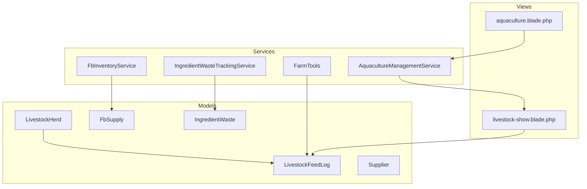

**Diagram sources**
- [LivestockHerd.php:11-49](file://app/Models/LivestockHerd.php#L11-L49)
- [LivestockFeedLog.php:10-31](file://app/Models/LivestockFeedLog.php#L10-L31)
- [FarmTools.php:912-941](file://app/Services/ERP/FarmTools.php#L912-L941)
- [AquacultureManagementService.php:106-113](file://app/Services/Fisheries/AquacultureManagementService.php#L106-L113)
- [FbInventoryService.php:23-55](file://app/Services/FbInventoryService.php#L23-L55)
- [livestock-show.blade.php:140-174](file://resources/views/farm/livestock-show.blade.php#L140-L174)
- [aquaculture.blade.php:240-256](file://resources/views/fisheries/aquaculture.blade.php#L240-L256)

**Section sources**
- [LivestockHerd.php:11-49](file://app/Models/LivestockHerd.php#L11-L49)
- [LivestockFeedLog.php:10-31](file://app/Models/LivestockFeedLog.php#L10-L31)
- [FarmTools.php:912-941](file://app/Services/ERP/FarmTools.php#L912-L941)
- [AquacultureManagementService.php:106-113](file://app/Services/Fisheries/AquacultureManagementService.php#L106-L113)
- [FbInventoryService.php:23-55](file://app/Services/FbInventoryService.php#L23-L55)
- [livestock-show.blade.php:140-174](file://resources/views/farm/livestock-show.blade.php#L140-L174)
- [aquaculture.blade.php:240-256](file://resources/views/fisheries/aquaculture.blade.php#L240-L256)

## Core Components
- LivestockFeedLog: Captures daily feed entries (type, quantity, cost, population, average body weight)
- LivestockHerd: Aggregates feed totals, computes FCR, daily feed average, and feed cost per kg gain
- FarmTools.recordFeed: Creates feed logs and calculates per-head feed and FCR indicators
- LivestockVaccination: Provides stage-specific vaccination schedules to prevent deficiencies and disease
- AquacultureManagementService.createFeedingSchedule: Automated fish feeding schedule generator
- FbInventoryService.deductStockForOrder: Deducts supply usage from inventory when orders are completed
- IngredientWasteTrackingService: Tracks ingredient waste and generates reduction recommendations

**Section sources**
- [LivestockFeedLog.php:10-40](file://app/Models/LivestockFeedLog.php#L10-L40)
- [LivestockHerd.php:121-182](file://app/Models/LivestockHerd.php#L121-L182)
- [FarmTools.php:912-941](file://app/Services/ERP/FarmTools.php#L912-L941)
- [LivestockVaccination.php:41-68](file://app/Models/LivestockVaccination.php#L41-L68)
- [AquacultureManagementService.php:106-113](file://app/Services/Fisheries/AquacultureManagementService.php#L106-L113)
- [FbInventoryService.php:23-55](file://app/Services/FbInventoryService.php#L23-L55)
- [IngredientWasteTrackingService.php:138-183](file://app/Services/IngredientWasteTrackingService.php#L138-L183)

## Architecture Overview
The system integrates feed logging, efficiency metrics, automated scheduling, and inventory/supplier workflows.

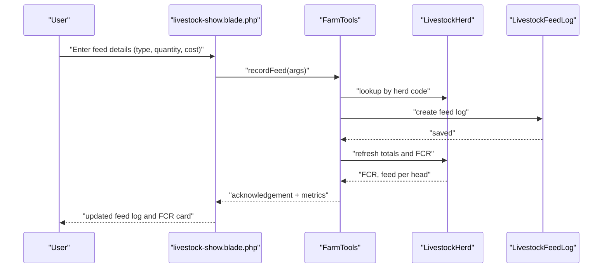

**Diagram sources**
- [livestock-show.blade.php:380-400](file://resources/views/farm/livestock-show.blade.php#L380-L400)
- [FarmTools.php:912-941](file://app/Services/ERP/FarmTools.php#L912-L941)
- [LivestockHerd.php:121-182](file://app/Models/LivestockHerd.php#L121-L182)
- [LivestockFeedLog.php:10-40](file://app/Models/LivestockFeedLog.php#L10-L40)

## Detailed Component Analysis

### Feed Logging and Efficiency Metrics
- LivestockFeedLog stores daily feed events with type, quantity, cost, population, and average body weight.
- LivestockHerd aggregates:
  - Total feed (kg)
  - Total feed cost
  - Latest average body weight
  - Weight gain (current minus entry)
  - FCR = Total Feed / Total Weight Gain
  - Average daily feed (distinct days)
  - Feed cost per kg of gain
- FarmTools.recordFeed persists a feed log and returns computed metrics (feed per head, FCR status).

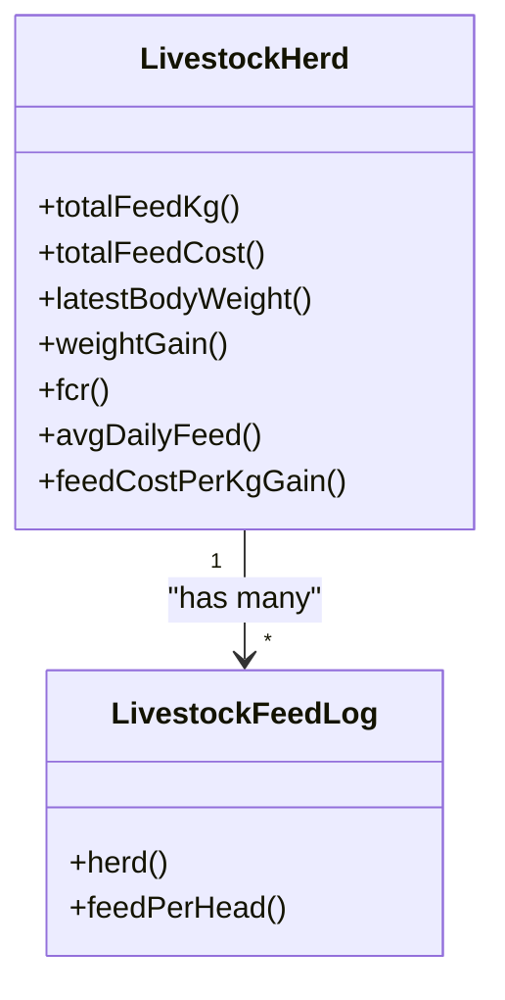

**Diagram sources**
- [LivestockHerd.php:121-182](file://app/Models/LivestockHerd.php#L121-L182)
- [LivestockFeedLog.php:10-40](file://app/Models/LivestockFeedLog.php#L10-L40)

**Section sources**
- [LivestockFeedLog.php:10-40](file://app/Models/LivestockFeedLog.php#L10-L40)
- [LivestockHerd.php:121-182](file://app/Models/LivestockHerd.php#L121-L182)
- [FarmTools.php:912-941](file://app/Services/ERP/FarmTools.php#L912-L941)
- [2026_04_01_300000_create_livestock_feed_logs_table.php:11-27](file://database/migrations/2026_04_01_300000_create_livestock_feed_logs_table.php#L11-L27)

### Automated Feed Scheduling (Aquaculture)
- The service creates a feeding schedule for a pond with date, time, feed product, and quantity.
- This enables automated, repeatable schedules aligned with growth stages and water conditions.

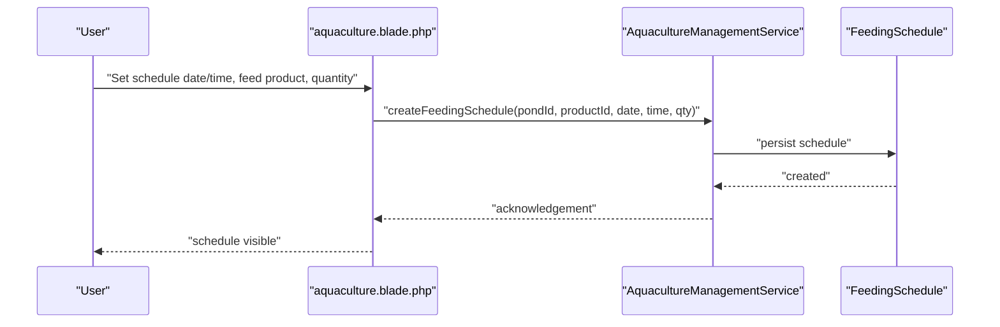

**Diagram sources**
- [aquaculture.blade.php:240-256](file://resources/views/fisheries/aquaculture.blade.php#L240-L256)
- [AquacultureManagementService.php:106-113](file://app/Services/Fisheries/AquacultureManagementService.php#L106-L113)

**Section sources**
- [AquacultureManagementService.php:106-113](file://app/Services/Fisheries/AquacultureManagementService.php#L106-L113)
- [aquaculture.blade.php:240-256](file://resources/views/fisheries/aquaculture.blade.php#L240-L256)

### Nutritional Requirements by Animal Stage
- Vaccination schedules are auto-generated based on animal type:
  - Broiler schedule includes ND-IB, Gumboro, and boosters
  - Layer schedule includes Marek, ND-IB, Gumboro, ND booster, Fowl Pox, and Coryza
- These schedules help prevent nutritional and infectious deficiencies during critical ages.

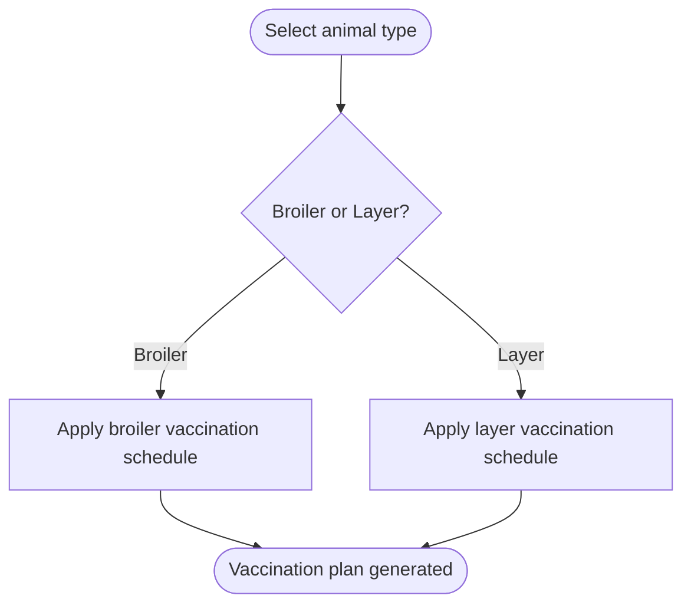

**Diagram sources**
- [LivestockVaccination.php:41-68](file://app/Models/LivestockVaccination.php#L41-L68)

**Section sources**
- [LivestockVaccination.php:41-68](file://app/Models/LivestockVaccination.php#L41-L68)
- [2026_04_01_200000_create_livestock_health_tables.php:36-47](file://database/migrations/2026_04_01_200000_create_livestock_health_tables.php#L36-L47)

### Feed Inventory Tracking and Deduction
- FbInventoryService.deductStockForOrder automatically reduces supply quantities when orders are completed, linking recipe ingredients to supply usage.
- FbSupply tracks current stock, minimum stock thresholds, and inventory value.

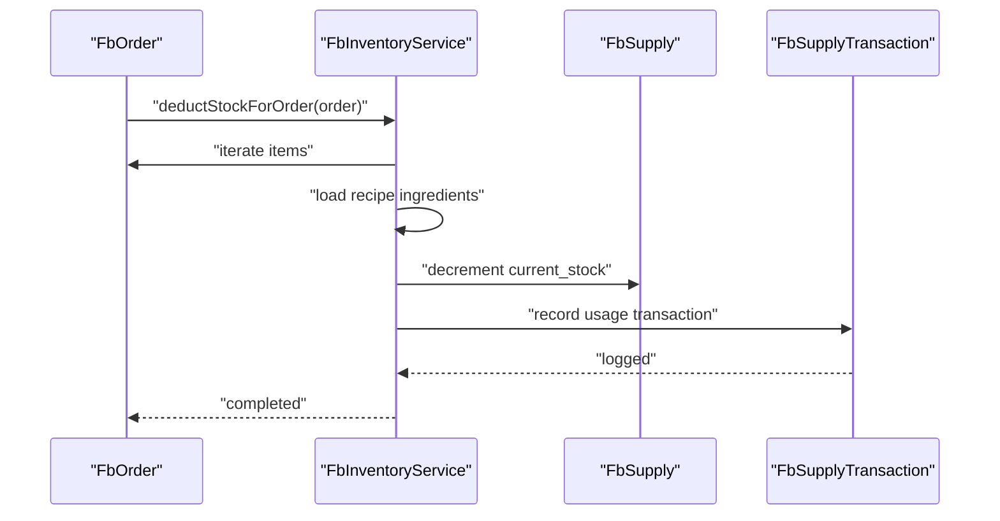

**Diagram sources**
- [FbInventoryService.php:23-55](file://app/Services/FbInventoryService.php#L23-L55)
- [FbSupply.php:86-89](file://app/Models/FbSupply.php#L86-L89)

**Section sources**
- [FbInventoryService.php:23-55](file://app/Services/FbInventoryService.php#L23-L55)
- [FbSupply.php:65-89](file://app/Models/FbSupply.php#L65-L89)

### Supplier Management and Cost Optimization
- Supplier model supports active/inactive status and links to purchase orders and scorecards.
- Supplier-product linkage defines pricing, lead times, and primary supplier flags.
- Scorecards enable supplier evaluation and preferred supplier designation.

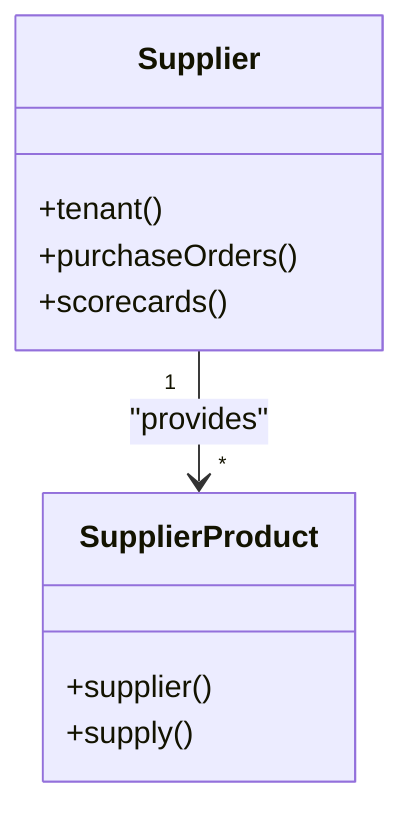

**Diagram sources**
- [Supplier.php:37-50](file://app/Models/Supplier.php#L37-L50)
- [2026_04_04_700000_create_fb_supplier_management_tables.php:42-53](file://database/migrations/2026_04_04_700000_create_fb_supplier_management_tables.php#L42-L53)

**Section sources**
- [Supplier.php:37-50](file://app/Models/Supplier.php#L37-L50)
- [2026_04_04_700000_create_fb_supplier_management_tables.php:29-53](file://database/migrations/2026_04_04_700000_create_fb_supplier_management_tables.php#L29-L53)

### Feed Quality Monitoring and Wastage Reduction
- IngredientWasteTrackingService aggregates waste by item, type, and reason, and generates recommendations for reducing spoilage and expired inventory.
- WasteManagementController provides statistics on total waste, eco-friendly disposal percentage, and revenue from waste utilization.

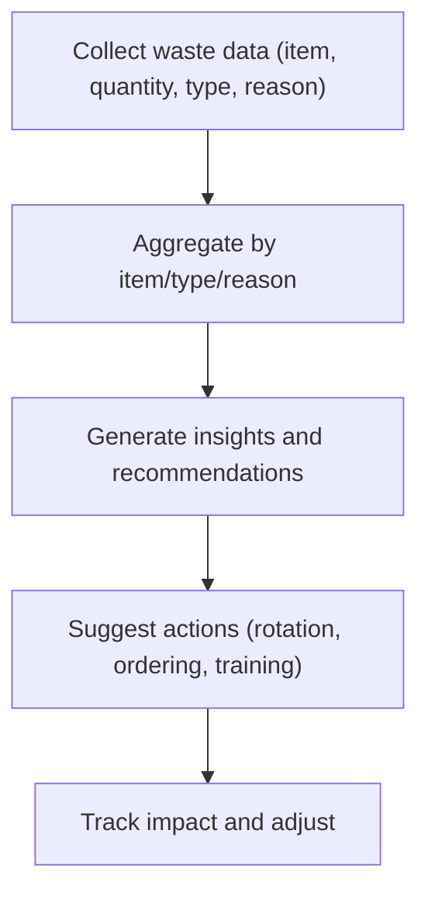

**Diagram sources**
- [IngredientWasteTrackingService.php:105-183](file://app/Services/IngredientWasteTrackingService.php#L105-L183)
- [WasteManagementController.php:15-35](file://app/Http/Controllers/Livestock/WasteManagementController.php#L15-L35)

**Section sources**
- [IngredientWasteTrackingService.php:105-183](file://app/Services/IngredientWasteTrackingService.php#L105-L183)
- [WasteManagementController.php:15-35](file://app/Http/Controllers/Livestock/WasteManagementController.php#L15-L35)
- [IngredientWaste.php:16-30](file://app/Models/IngredientWaste.php#L16-L30)

### Practical Examples

#### Example 1: Feed Conversion Ratio (FCR) Tracking
- Daily feed logs are displayed with feed per head and FCR status.
- The view renders recent logs and shows FCR classification (very good, good, fair, needs improvement).

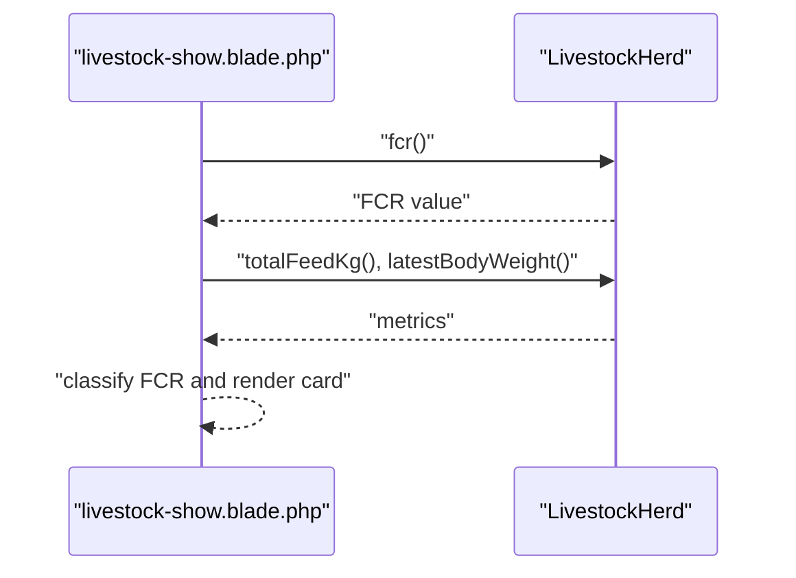

**Diagram sources**
- [livestock-show.blade.php:87-103](file://resources/views/farm/livestock-show.blade.php#L87-L103)
- [LivestockHerd.php:153-163](file://app/Models/LivestockHerd.php#L153-L163)

**Section sources**
- [livestock-show.blade.php:87-103](file://resources/views/farm/livestock-show.blade.php#L87-L103)
- [LivestockHerd.php:153-163](file://app/Models/LivestockHerd.php#L153-L163)

#### Example 2: Automated Feeding Schedule (Aquaculture)
- Users set date/time, feed product, and quantity; the system persists a schedule for repeated delivery.

**Section sources**
- [aquaculture.blade.php:240-256](file://resources/views/fisheries/aquaculture.blade.php#L240-L256)
- [AquacultureManagementService.php:106-113](file://app/Services/Fisheries/AquacultureManagementService.php#L106-L113)

#### Example 3: Nutritional Deficiency Prevention Protocols
- Auto-generated vaccination schedules reduce disease risk and support optimal growth.

**Section sources**
- [LivestockVaccination.php:41-68](file://app/Models/LivestockVaccination.php#L41-L68)

## Dependency Analysis
- LivestockHerd depends on LivestockFeedLog for feed metrics and FCR computation.
- FarmTools depends on LivestockHerd and LivestockFeedLog to persist feed logs and compute indicators.
- FbInventoryService depends on FbSupply and RecipeIngredient to update stock and record transactions.
- IngredientWasteTrackingService depends on IngredientWaste to aggregate and recommend actions.
- Views depend on models/services to render feed logs, FCR cards, and supplier/supply screens.

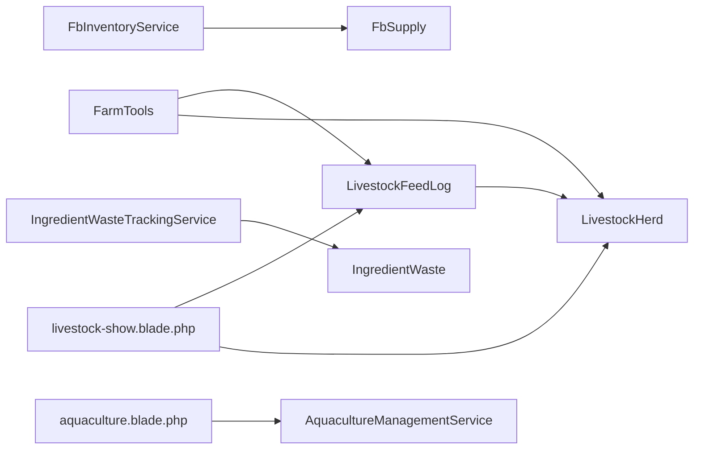

**Diagram sources**
- [LivestockFeedLog.php:10-40](file://app/Models/LivestockFeedLog.php#L10-L40)
- [LivestockHerd.php:11-49](file://app/Models/LivestockHerd.php#L11-L49)
- [FarmTools.php:912-941](file://app/Services/ERP/FarmTools.php#L912-L941)
- [FbInventoryService.php:23-55](file://app/Services/FbInventoryService.php#L23-L55)
- [IngredientWasteTrackingService.php:105-183](file://app/Services/IngredientWasteTrackingService.php#L105-L183)
- [livestock-show.blade.php:140-174](file://resources/views/farm/livestock-show.blade.php#L140-L174)
- [aquaculture.blade.php:240-256](file://resources/views/fisheries/aquaculture.blade.php#L240-L256)

**Section sources**
- [LivestockFeedLog.php:10-40](file://app/Models/LivestockFeedLog.php#L10-L40)
- [LivestockHerd.php:11-49](file://app/Models/LivestockHerd.php#L11-L49)
- [FarmTools.php:912-941](file://app/Services/ERP/FarmTools.php#L912-L941)
- [FbInventoryService.php:23-55](file://app/Services/FbInventoryService.php#L23-L55)
- [IngredientWasteTrackingService.php:105-183](file://app/Services/IngredientWasteTrackingService.php#L105-L183)
- [livestock-show.blade.php:140-174](file://resources/views/farm/livestock-show.blade.php#L140-L174)
- [aquaculture.blade.php:240-256](file://resources/views/fisheries/aquaculture.blade.php#L240-L256)

## Performance Considerations
- Indexes on livestock_feed_logs for herd/date and tenant/date improve query performance for daily summaries and FCR computations.
- Aggregation queries (sums, distinct counts) should leverage these indexes to minimize scan overhead.
- Deducting stock in a single transaction ensures atomicity and avoids partial updates.

[No sources needed since this section provides general guidance]

## Troubleshooting Guide
- Missing or insufficient data for FCR: Ensure daily feed logs are recorded with population and average body weight.
- Incorrect feed per head calculation: Verify quantity_kg and population_at_feeding values.
- Supplier product pricing/lead time issues: Confirm supplier_products entries for active supplies and preferred suppliers.
- Inventory deduction failures: Check available stock and recipe ingredient quantities before order completion.

**Section sources**
- [LivestockFeedLog.php:13-26](file://app/Models/LivestockFeedLog.php#L13-L26)
- [LivestockHerd.php:153-163](file://app/Models/LivestockHerd.php#L153-L163)
- [FbInventoryService.php:62-64](file://app/Services/FbInventoryService.php#L62-L64)
- [2026_04_04_700000_create_fb_supplier_management_tables.php:42-53](file://database/migrations/2026_04_04_700000_create_fb_supplier_management_tables.php#L42-L53)

## Conclusion
The system provides a robust foundation for Feed & Nutrition Management:
- Daily feed logging with automatic efficiency metrics (FCR, feed per head)
- Automated scheduling for aquaculture operations
- Integrated inventory deduction linked to recipes and orders
- Supplier management with scorecards and preferred supplier tracking
- Waste tracking and actionable recommendations to reduce losses

These components work together to support informed decisions around feed formulation, nutritional timing, and cost optimization while maintaining compliance with operational standards.

[No sources needed since this section summarizes without analyzing specific files]

## Appendices

### Appendix A: Data Model Overview
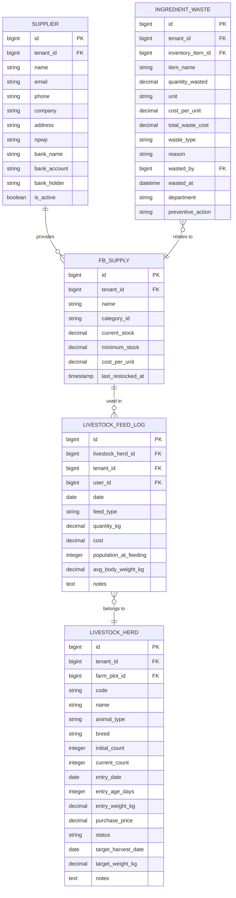

**Diagram sources**
- [2026_04_01_300000_create_livestock_feed_logs_table.php:11-27](file://database/migrations/2026_04_01_300000_create_livestock_feed_logs_table.php#L11-L27)
- [LivestockHerd.php:14-29](file://app/Models/LivestockHerd.php#L14-L29)
- [Supplier.php:18-35](file://app/Models/Supplier.php#L18-L35)
- [FbSupply.php:14-30](file://app/Models/FbSupply.php#L14-L30)
- [IngredientWaste.php:16-30](file://app/Models/IngredientWaste.php#L16-L30)