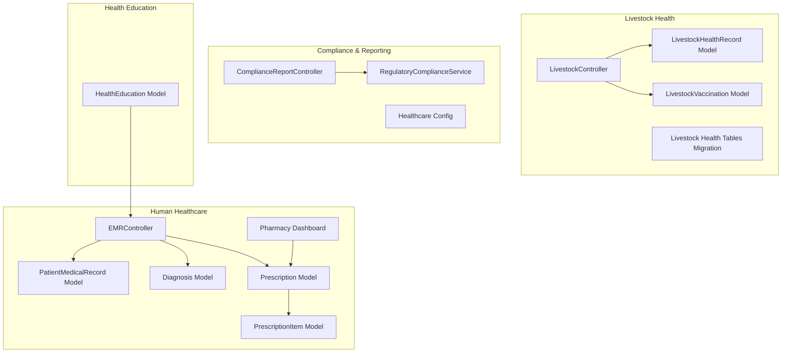
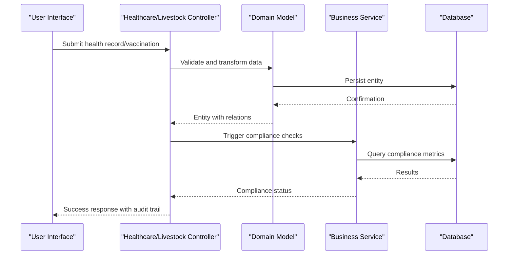
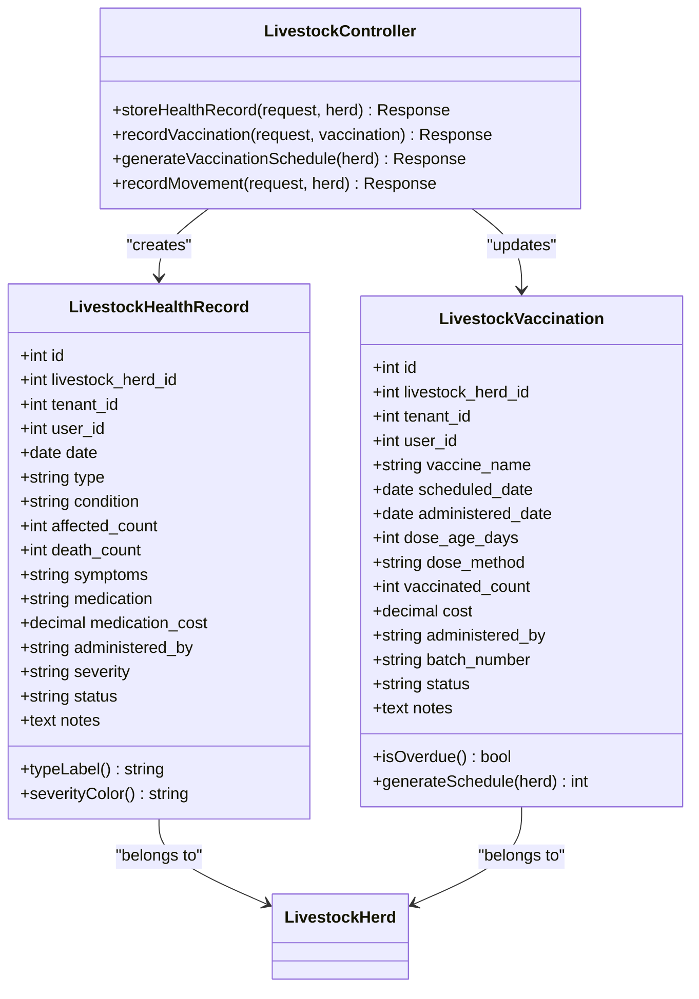
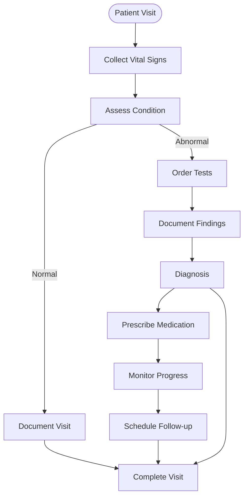
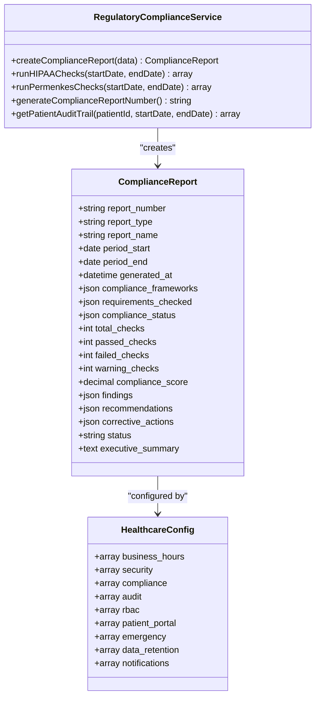
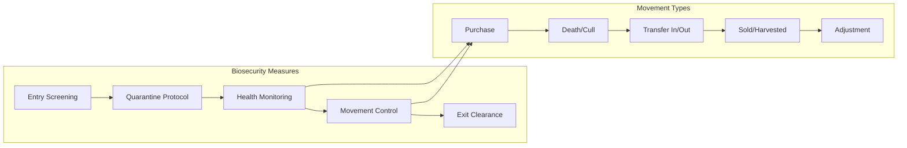
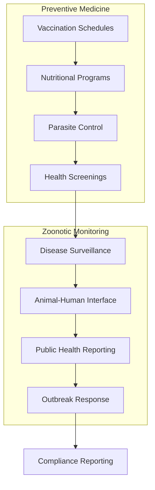
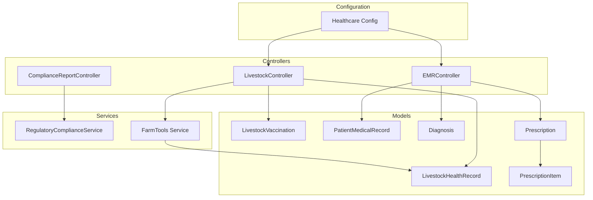

# Health & Disease Control

<cite>
**Referenced Files in This Document**
- [Livestock Health Records Model](file://app/Models/LivestockHealthRecord.php)
- [Livestock Vaccination Model](file://app/Models/LivestockVaccination.php)
- [Livestock Controller](file://app/Http/Controllers/LivestockController.php)
- [Livestock Health Tables Migration](file://database/migrations/2026_04_01_200000_create_livestock_health_tables.php)
- [Farm Tools Service](file://app/Services/ERP/FarmTools.php)
- [Healthcare Configuration](file://config/healthcare.php)
- [Patient Medical Record Model](file://app/Models/PatientMedicalRecord.php)
- [Diagnosis Model](file://app/Models/Diagnosis.php)
- [Prescription Model](file://app/Models/Prescription.php)
- [Prescription Item Model](file://app/Models/PrescriptionItem.php)
- [Healthcare EMR Controller](file://app/Http/Controllers/Healthcare/EMRController.php)
- [Healthcare Compliance Report Controller](file://app/Http/Controllers/Healthcare/ComplianceReportController.php)
- [Regulatory Compliance Service](file://app/Services/RegulatoryComplianceService.php)
- [Livestock Routes](file://routes/web.php)
- [Healthcare Routes](file://routes/healthcare.php)
- [Livestock Show View](file://resources/views/farm/livestock-show.blade.php)
- [Healthcare EMR View](file://resources/views/emr/diagnoses.blade.php)
- [Healthcare Compliance Reports Views](file://resources/views/healthcare/compliance-reports/)
- [Health Education Content Model](file://app/Models/HealthEducation.php)
- [Healthcare Pharmacy Dashboard View](file://resources/views/healthcare/pharmacy/dashboard.blade.php)
</cite>

## Table of Contents
1. [Introduction](#introduction)
2. [Project Structure](#project-structure)
3. [Core Components](#core-components)
4. [Architecture Overview](#architecture-overview)
5. [Detailed Component Analysis](#detailed-component-analysis)
6. [Dependency Analysis](#dependency-analysis)
7. [Performance Considerations](#performance-considerations)
8. [Troubleshooting Guide](#troubleshooting-guide)
9. [Conclusion](#conclusion)

## Introduction
This document provides comprehensive documentation for Health & Disease Control within the qalcuityERP system. It covers animal health monitoring, vaccination protocols, disease prevention strategies, health record keeping, treatment administration, quarantine procedures, biosecurity measures, movement control protocols, zoonotic disease monitoring, preventive medicine programs, parasite control, nutritional health optimization, outbreak response procedures, treatment efficacy tracking, and health compliance reporting systems. The content is derived from the existing codebase and focuses on practical implementation patterns and workflows.

## Project Structure
The Health & Disease Control functionality spans several modules:
- Livestock health and vaccination management
- Human healthcare (EMR, pharmacy, compliance)
- Regulatory compliance and reporting
- Health education content management

**Diagram sources**
- [Livestock Controller:1-259](file://app/Http/Controllers/LivestockController.php#L1-259)
- [Livestock Health Records Model:1-44](file://app/Models/LivestockHealthRecord.php#L1-44)
- [Livestock Vaccination Model:1-95](file://app/Models/LivestockVaccination.php#L1-95)
- [Livestock Health Tables Migration:1-65](file://database/migrations/2026_04_01_200000_create_livestock_health_tables.php#L1-65)
- [Healthcare EMR Controller:47-157](file://app/Http/Controllers/Healthcare/EMRController.php#L47-157)
- [Patient Medical Record Model:1-274](file://app/Models/PatientMedicalRecord.php#L1-274)
- [Diagnosis Model:1-115](file://app/Models/Diagnosis.php#L1-115)
- [Prescription Model:1-201](file://app/Models/Prescription.php#L1-201)
- [Prescription Item Model:1-110](file://app/Models/PrescriptionItem.php#L1-110)
- [Healthcare Compliance Report Controller:1-74](file://app/Http/Controllers/Healthcare/ComplianceReportController.php#L1-74)
- [Regulatory Compliance Service:130-163](file://app/Services/RegulatoryComplianceService.php#L130-163)
- [Healthcare Configuration:1-251](file://config/healthcare.php#L1-251)
- [Health Education Content Model:1-37](file://app/Models/HealthEducation.php#L1-37)

**Section sources**
- [Livestock Controller:1-259](file://app/Http/Controllers/LivestockController.php#L1-259)
- [Healthcare EMR Controller:47-157](file://app/Http/Controllers/Healthcare/EMRController.php#L47-157)
- [Healthcare Compliance Report Controller:1-74](file://app/Http/Controllers/Healthcare/ComplianceReportController.php#L1-74)

## Core Components
The system implements robust health and disease control capabilities through specialized models, controllers, and services:

### Livestock Health Management
- **LivestockHealthRecord**: Tracks animal health events, treatments, observations, quarantine, and recovery
- **LivestockVaccination**: Manages vaccination schedules, administration records, and compliance tracking
- **LivestockController**: Provides CRUD operations and automated workflows for health monitoring

### Human Healthcare Management
- **PatientMedicalRecord**: Comprehensive electronic medical records with vital signs tracking
- **Diagnosis**: ICD-10 based diagnostic categorization and management
- **Prescription**: Medication management with dispensing workflows
- **PrescriptionItem**: Individual medication item tracking and dispensing

### Compliance and Reporting
- **ComplianceReportController**: Regulatory compliance report creation and management
- **RegulatoryComplianceService**: Automated compliance checking and reporting
- **Healthcare Configuration**: Security, audit, and access control settings

**Section sources**
- [Livestock Health Records Model:1-44](file://app/Models/LivestockHealthRecord.php#L1-44)
- [Livestock Vaccination Model:1-95](file://app/Models/LivestockVaccination.php#L1-95)
- [Livestock Controller:179-221](file://app/Http/Controllers/LivestockController.php#L179-221)
- [Patient Medical Record Model:1-274](file://app/Models/PatientMedicalRecord.php#L1-274)
- [Diagnosis Model:1-115](file://app/Models/Diagnosis.php#L1-115)
- [Prescription Model:1-201](file://app/Models/Prescription.php#L1-201)
- [Prescription Item Model:1-110](file://app/Models/PrescriptionItem.php#L1-110)
- [Healthcare Compliance Report Controller:1-74](file://app/Http/Controllers/Healthcare/ComplianceReportController.php#L1-74)
- [Regulatory Compliance Service:130-163](file://app/Services/RegulatoryComplianceService.php#L130-163)
- [Healthcare Configuration:1-251](file://config/healthcare.php#L1-251)

## Architecture Overview
The system follows a layered architecture with clear separation of concerns:

**Diagram sources**
- [Livestock Controller:179-221](file://app/Http/Controllers/LivestockController.php#L179-221)
- [Healthcare EMR Controller:60-103](file://app/Http/Controllers/Healthcare/EMRController.php#L60-103)
- [Regulatory Compliance Service:286-361](file://app/Services/RegulatoryComplianceService.php#L286-361)

The architecture ensures:
- **Separation of concerns**: Controllers handle HTTP requests, models manage data, services encapsulate business logic
- **Auditability**: All actions are logged for compliance and traceability
- **Extensibility**: Modular design allows easy addition of new health protocols
- **Security**: Role-based access control and compliance monitoring

## Detailed Component Analysis

### Livestock Health Monitoring System
The livestock health monitoring system provides comprehensive disease surveillance and control:

**Diagram sources**
- [Livestock Health Records Model:10-43](file://app/Models/LivestockHealthRecord.php#L10-43)
- [Livestock Vaccination Model:10-94](file://app/Models/LivestockVaccination.php#L10-94)
- [Livestock Controller:179-257](file://app/Http/Controllers/LivestockController.php#L179-257)

#### Health Record Types and Severity Management
The system supports five primary health record types:
- **Illness**: Disease onset and progression tracking
- **Treatment**: Medication administration and therapy monitoring
- **Observation**: Health surveillance and monitoring activities
- **Quarantine**: Isolation procedures for disease containment
- **Recovery**: Healing and rehabilitation progress

Severity levels (low, medium, high, critical) enable appropriate resource allocation and response prioritization.

#### Vaccination Protocol Management
The vaccination system implements automated scheduling based on animal type:
- **Broiler Schedule**: ND-IB, Gumboro, ND Booster vaccinations at specific age intervals
- **Layer Schedule**: Comprehensive vaccination program including Marek, Fowl Pox, Coryza
- **Automated Generation**: System-generated schedules prevent missed vaccinations
- **Batch Tracking**: Vaccine batch numbers enable traceability and quality control

**Section sources**
- [Livestock Health Records Model:25-42](file://app/Models/LivestockHealthRecord.php#L25-42)
- [Livestock Vaccination Model:41-93](file://app/Models/LivestockVaccination.php#L41-93)
- [Livestock Controller:225-236](file://app/Http/Controllers/LivestockController.php#L225-236)

### Human Healthcare Management System
The electronic medical record (EMR) system provides comprehensive patient health management:

**Diagram sources**
- [Healthcare EMR Controller:60-157](file://app/Http/Controllers/Healthcare/EMRController.php#L60-157)
- [Patient Medical Record Model:54-138](file://app/Models/PatientMedicalRecord.php#L54-138)

#### Medical Record Management
The EMR system includes:
- **Comprehensive Data Capture**: Chief complaints, history, physical examinations, diagnoses
- **Vital Signs Integration**: Automatic BMI calculation and abnormality detection
- **Medication Tracking**: Full prescription management with dispensing workflows
- **Follow-up Management**: Automated reminders and progress tracking

#### Diagnostic and Treatment Protocols
- **ICD-10 Integration**: Standardized diagnostic coding for research and reporting
- **Multi-level Diagnoses**: Primary, secondary, differential, and working diagnoses
- **Treatment Planning**: Structured treatment plans with outcome tracking
- **Prescription Management**: Controlled substance tracking and dispensing verification

**Section sources**
- [Healthcare EMR Controller:47-157](file://app/Http/Controllers/Healthcare/EMRController.php#L47-157)
- [Patient Medical Record Model:13-49](file://app/Models/PatientMedicalRecord.php#L13-49)
- [Diagnosis Model:13-27](file://app/Models/Diagnosis.php#L13-27)
- [Prescription Model:13-35](file://app/Models/Prescription.php#L13-35)

### Compliance and Regulatory Framework
The system implements comprehensive compliance management:

**Diagram sources**
- [Healthcare Compliance Report Controller:40-74](file://app/Http/Controllers/Healthcare/ComplianceReportController.php#L40-74)
- [Regulatory Compliance Service:139-163](file://app/Services/RegulatoryComplianceService.php#L139-163)
- [Healthcare Configuration:10-251](file://config/healthcare.php#L10-251)

#### Compliance Framework Implementation
The system supports multiple regulatory frameworks:
- **HIPAA Compliance**: Access controls, audit trails, data integrity, transmission security
- **Permenkes Standards**: Indonesian Ministry of Health regulations
- **Custom Frameworks**: Extensible architecture for additional compliance requirements

#### Automated Compliance Checking
- **Access Logging**: Comprehensive audit trails for all healthcare operations
- **Security Alerts**: Real-time notifications for unauthorized access attempts
- **Data Retention**: Automated cleanup policies based on regulatory requirements
- **Training Compliance**: Staff certification tracking and reminders

**Section sources**
- [Healthcare Compliance Report Controller:1-74](file://app/Http/Controllers/Healthcare/ComplianceReportController.php#L1-74)
- [Regulatory Compliance Service:286-361](file://app/Services/RegulatoryComplianceService.php#L286-361)
- [Healthcare Configuration:20-251](file://config/healthcare.php#L20-251)

### Biosecurity and Movement Control
The system implements comprehensive biosecurity measures:

**Diagram sources**
- [Livestock Controller:95-147](file://app/Http/Controllers/LivestockController.php#L95-147)
- [Livestock Health Tables Migration:12-33](file://database/migrations/2026_04_01_200000_create_livestock_health_tables.php#L12-33)

#### Quarantine Procedures
- **Isolation Protocols**: Dedicated quarantine areas and procedures
- **Monitoring Requirements**: Regular health assessments during quarantine
- **Contact Tracing**: Exposure investigation and notification
- **Release Criteria**: Health clearance and monitoring requirements

#### Movement Control Protocols
- **Population Tracking**: Real-time population counts and movements
- **Weight Management**: Weight tracking for nutritional and health monitoring
- **Reason Documentation**: Required documentation for all movements
- **Destination Tracking**: Destination verification and compliance

**Section sources**
- [Livestock Controller:95-147](file://app/Http/Controllers/LivestockController.php#L95-147)
- [Livestock Health Tables Migration:12-33](file://database/migrations/2026_04_01_200000_create_livestock_health_tables.php#L12-33)

### Preventive Medicine and Zoonotic Disease Monitoring
The system integrates preventive care and zoonotic disease surveillance:

**Diagram sources**
- [Livestock Vaccination Model:41-56](file://app/Models/LivestockVaccination.php#L41-56)
- [Farm Tools Service:240-256](file://app/Services/ERP/FarmTools.php#L240-256)

#### Preventive Medicine Programs
- **Vaccination Schedules**: Automated generation based on animal type and age
- **Nutritional Optimization**: Feed logging and growth monitoring
- **Parasite Control**: Regular deworming and ectoparasite management
- **Health Screenings**: Routine health assessments and monitoring

#### Zoonotic Disease Monitoring
- **Surveillance Systems**: Disease reporting and tracking
- **Animal-Human Interface**: Close monitoring of zoonotic risks
- **Public Health Integration**: Reporting to public health authorities
- **Outbreak Response**: Rapid response protocols and containment measures

**Section sources**
- [Livestock Vaccination Model:41-56](file://app/Models/LivestockVaccination.php#L41-56)
- [Farm Tools Service:240-256](file://app/Services/ERP/FarmTools.php#L240-256)

## Dependency Analysis
The system exhibits well-structured dependencies with clear boundaries:

**Diagram sources**
- [Livestock Controller:1-259](file://app/Http/Controllers/LivestockController.php#L1-259)
- [Healthcare EMR Controller:47-157](file://app/Http/Controllers/Healthcare/EMRController.php#L47-157)
- [Healthcare Compliance Report Controller:1-74](file://app/Http/Controllers/Healthcare/ComplianceReportController.php#L1-74)
- [Regulatory Compliance Service:130-163](file://app/Services/RegulatoryComplianceService.php#L130-163)
- [Farm Tools Service:240-256](file://app/Services/ERP/FarmTools.php#L240-256)
- [Healthcare Configuration:1-251](file://config/healthcare.php#L1-251)

Key dependency characteristics:
- **Low Coupling**: Controllers depend on models, not on each other
- **High Cohesion**: Related functionality grouped within models and services
- **Clear Interfaces**: Well-defined method signatures and return types
- **Extensible Design**: Easy addition of new health protocols and compliance requirements

**Section sources**
- [Livestock Controller:1-259](file://app/Http/Controllers/LivestockController.php#L1-259)
- [Healthcare EMR Controller:47-157](file://app/Http/Controllers/Healthcare/EMRController.php#L47-157)
- [Regulatory Compliance Service:130-163](file://app/Services/RegulatoryComplianceService.php#L130-163)

## Performance Considerations
The system is designed with performance optimization in mind:

### Database Optimization
- **Indexed Fields**: Strategic indexing on frequently queried fields (date, type, status)
- **Query Optimization**: Efficient queries with proper joins and filtering
- **Pagination**: Built-in pagination for large datasets
- **Caching**: Potential for implementing caching strategies for frequently accessed data

### Scalability Features
- **Tenant Isolation**: Multi-tenancy support for separate data isolation
- **Modular Design**: Independent modules can be scaled separately
- **Background Processing**: Potential for implementing background jobs for heavy operations
- **API Ready**: RESTful APIs enable integration with external systems

### Monitoring and Analytics
- **Real-time Dashboards**: Live health monitoring and reporting
- **Performance Metrics**: Built-in analytics for system performance
- **Alerting Systems**: Automated notifications for critical health events
- **Audit Trails**: Comprehensive logging for compliance and troubleshooting

## Troubleshooting Guide

### Common Issues and Solutions

#### Health Record Creation Failures
**Symptoms**: Unable to create health records or vaccinations
**Causes**: 
- Invalid data validation
- Missing required fields
- Population count conflicts

**Solutions**:
- Verify required fields are populated
- Check data type validation rules
- Ensure population counts remain non-negative

#### Compliance Report Generation Issues
**Symptoms**: Compliance reports fail to generate or contain errors
**Causes**:
- Missing compliance framework configuration
- Data inconsistencies in audit trails
- Time period mismatches

**Solutions**:
- Verify healthcare configuration settings
- Check audit trail data integrity
- Validate reporting period dates

#### Vaccination Schedule Generation Problems
**Symptoms**: Vaccination schedules not generating correctly
**Causes**:
- Incorrect animal type specification
- Missing entry date information
- Existing vaccination records preventing duplicates

**Solutions**:
- Verify animal type matches supported schedules
- Ensure entry date is properly recorded
- Check for existing vaccination conflicts

**Section sources**
- [Livestock Controller:117-119](file://app/Http/Controllers/LivestockController.php#L117-119)
- [Healthcare Compliance Report Controller:42-50](file://app/Http/Controllers/Healthcare/ComplianceReportController.php#L42-50)
- [Livestock Vaccination Model:61-93](file://app/Models/LivestockVaccination.php#L61-93)

## Conclusion
The qalcuityERP Health & Disease Control system provides a comprehensive, integrated solution for managing animal and human health across multiple domains. The system's modular architecture, robust compliance framework, and automated workflows enable efficient disease prevention, monitoring, and response capabilities.

Key strengths of the implementation include:
- **Integrated Approach**: Unified system for both livestock and human healthcare
- **Automated Workflows**: Intelligent scheduling and compliance checking
- **Comprehensive Tracking**: Full lifecycle management from prevention to treatment
- **Regulatory Compliance**: Built-in compliance monitoring and reporting
- **Scalable Design**: Modular architecture supporting future enhancements

The system provides a solid foundation for health and disease control operations, with clear pathways for customization and extension based on specific organizational needs and regulatory requirements.