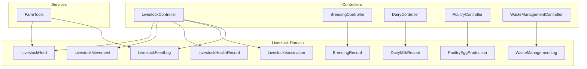
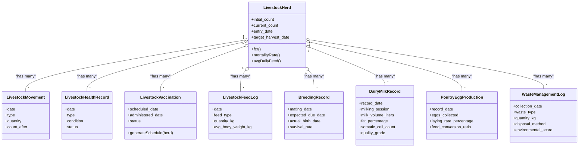
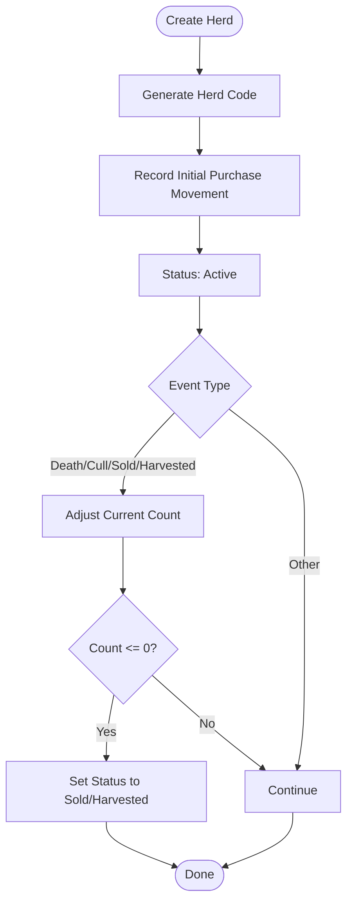
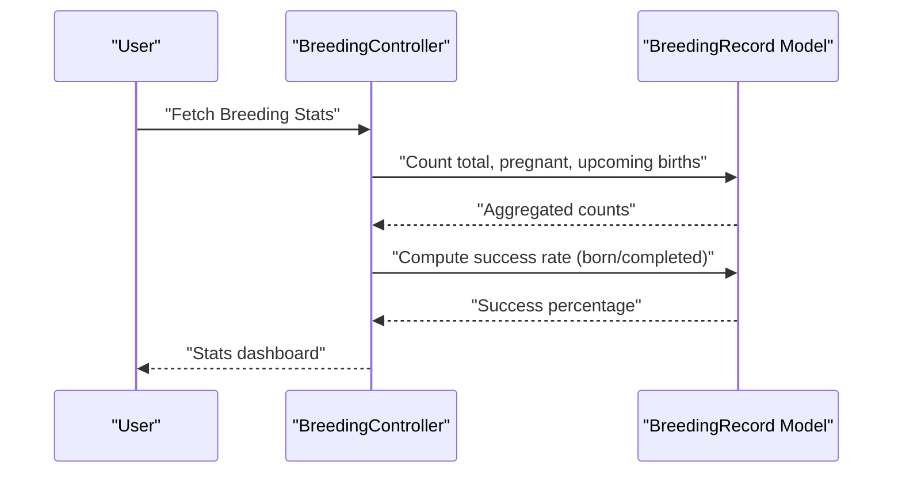
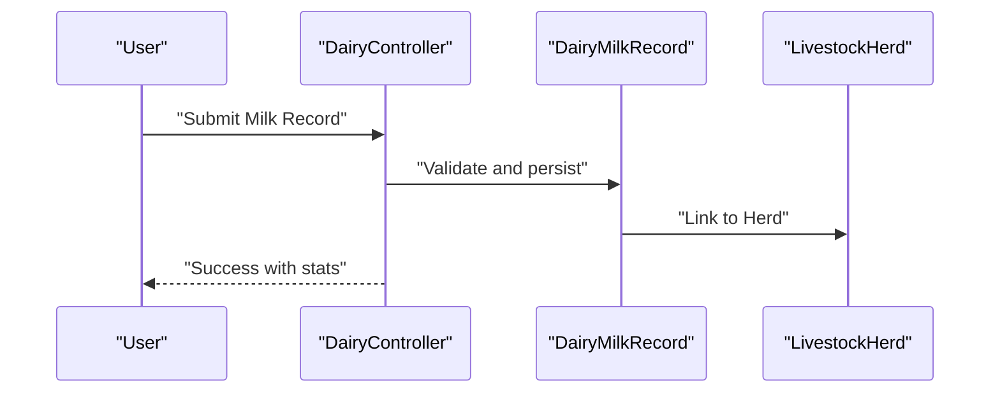
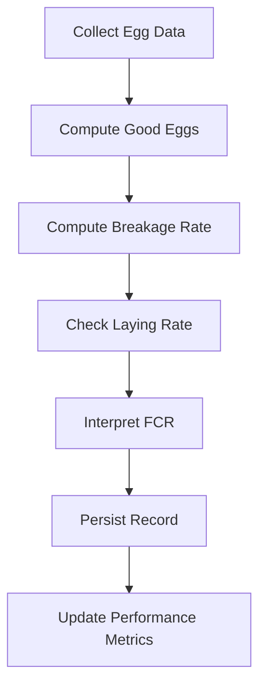
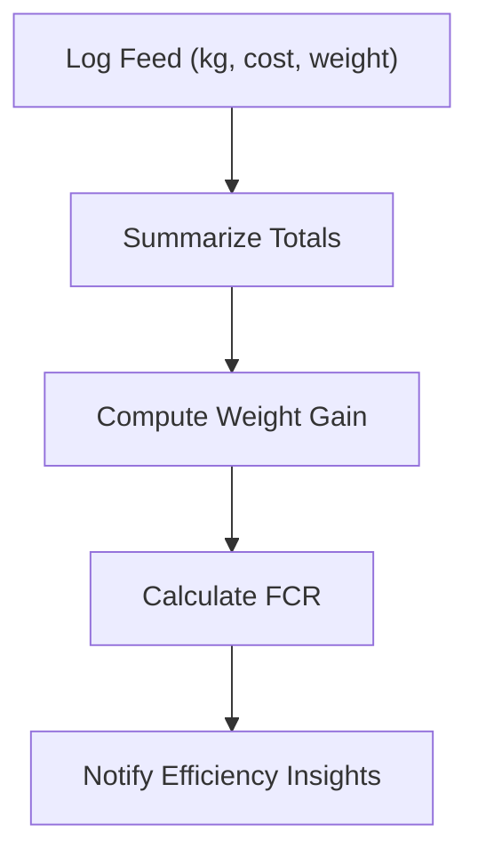
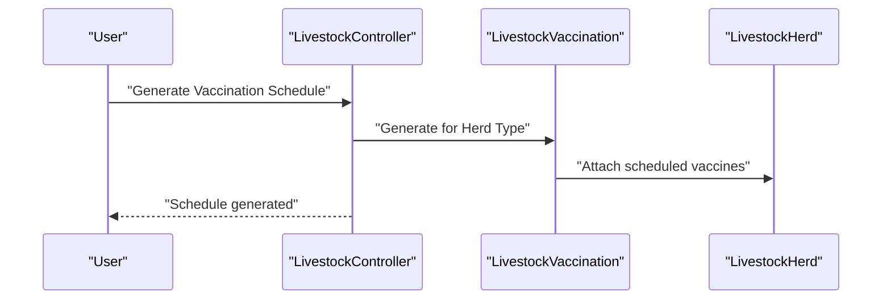
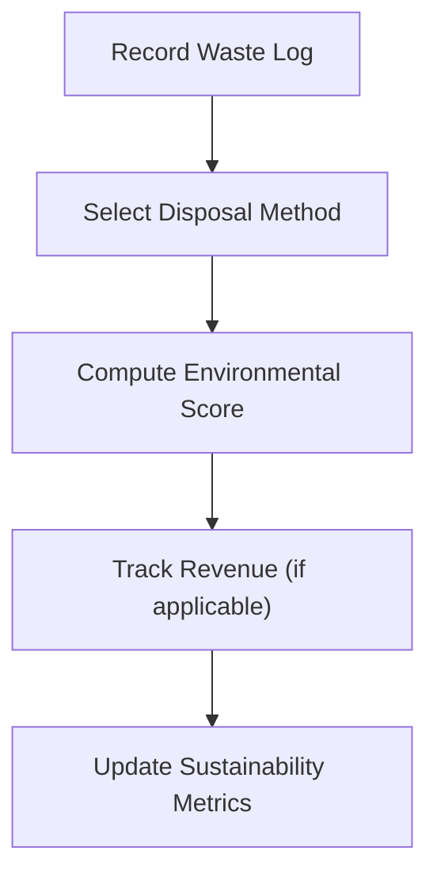
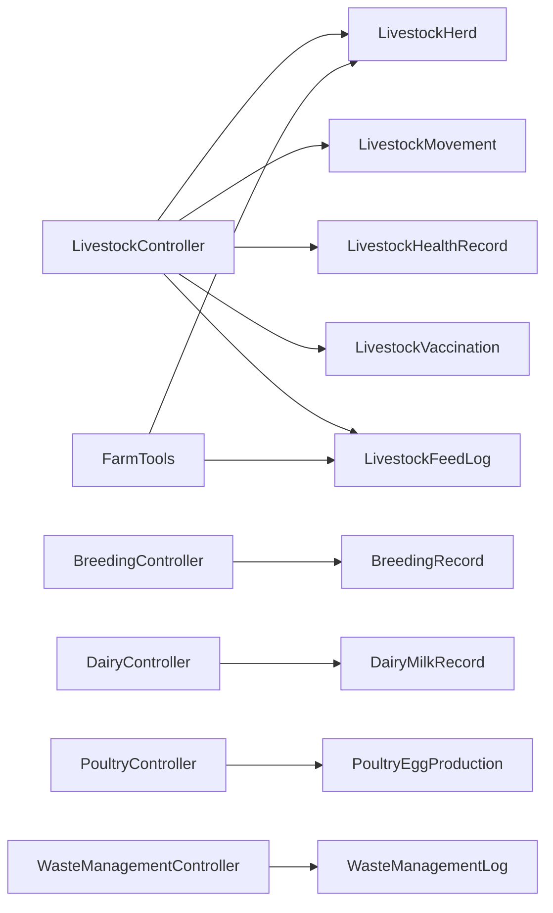

# Livestock Management

<cite>
**Referenced Files in This Document**
- [LivestockHerd.php](file://app/Models/LivestockHerd.php)
- [LivestockMovement.php](file://app/Models/LivestockMovement.php)
- [LivestockHealthRecord.php](file://app/Models/LivestockHealthRecord.php)
- [LivestockVaccination.php](file://app/Models/LivestockVaccination.php)
- [LivestockFeedLog.php](file://app/Models/LivestockFeedLog.php)
- [BreedingRecord.php](file://app/Models/BreedingRecord.php)
- [DairyMilkRecord.php](file://app/Models/DairyMilkRecord.php)
- [PoultryEggProduction.php](file://app/Models/PoultryEggProduction.php)
- [WasteManagementLog.php](file://app/Models/WasteManagementLog.php)
- [LivestockController.php](file://app/Http/Controllers/LivestockController.php)
- [BreedingController.php](file://app/Http/Controllers/Livestock/BreedingController.php)
- [DairyController.php](file://app/Http/Controllers/Livestock/DairyController.php)
- [PoultryController.php](file://app/Http/Controllers/Livestock/PoultryController.php)
- [WasteManagementController.php](file://app/Http/Controllers/Livestock/WasteManagementController.php)
- [FarmTools.php](file://app/Services/ERP/FarmTools.php)
- [2026_04_07_120000_create_livestock_enhancement_tables.php](file://database/migrations/2026_04_07_120000_create_livestock_enhancement_tables.php)
- [livestock.blade.php](file://resources/views/farm/livestock.blade.php)
- [livestock-show.blade.php](file://resources/views/farm/livestock-show.blade.php)
- [documentation.blade.php](file://resources/views/documentation.blade.php)
</cite>

## Table of Contents
1. [Introduction](#introduction)
2. [Project Structure](#project-structure)
3. [Core Components](#core-components)
4. [Architecture Overview](#architecture-overview)
5. [Detailed Component Analysis](#detailed-component-analysis)
6. [Dependency Analysis](#dependency-analysis)
7. [Performance Considerations](#performance-considerations)
8. [Troubleshooting Guide](#troubleshooting-guide)
9. [Conclusion](#conclusion)
10. [Appendices](#appendices)

## Introduction
This document describes the Livestock Management module within the qalcuityERP system. It covers herd management (identification, breeding, reproduction tracking, genetic selection), dairy operations (milk production monitoring, milking schedules, quality control), poultry management (egg production tracking, flock health, growth metrics), feed management (nutrition tracking, feed efficiency), health monitoring (vaccination schedules, disease prevention, treatment records), waste management (composting, environmental impact), and practical examples of workflow automation, compliance reporting, and productivity analytics.

## Project Structure
The Livestock Management system is implemented using Laravel models, controllers, and views. The core domain entities are:
- Herd registry and analytics
- Movement tracking (births, transfers, sales, culling, deaths)
- Health and vaccination records
- Breeding program records
- Dairy milk production and quality
- Poultry egg production and performance
- Feed consumption and efficiency metrics
- Waste management and sustainability

**Diagram sources**
- [LivestockController.php:11-259](file://app/Http/Controllers/LivestockController.php#L11-L259)
- [BreedingController.php:10-37](file://app/Http/Controllers/Livestock/BreedingController.php#L10-L37)
- [DairyController.php:10-105](file://app/Http/Controllers/Livestock/DairyController.php#L10-L105)
- [PoultryController.php:10-126](file://app/Http/Controllers/Livestock/PoultryController.php#L10-L126)
- [WasteManagementController.php:10-172](file://app/Http/Controllers/Livestock/WasteManagementController.php#L10-L172)
- [LivestockHerd.php:11-197](file://app/Models/LivestockHerd.php#L11-L197)
- [LivestockMovement.php:10-50](file://app/Models/LivestockMovement.php#L10-L50)
- [LivestockHealthRecord.php:10-44](file://app/Models/LivestockHealthRecord.php#L10-L44)
- [LivestockVaccination.php:10-94](file://app/Models/LivestockVaccination.php#L10-L94)
- [LivestockFeedLog.php:10-40](file://app/Models/LivestockFeedLog.php#L10-L40)
- [BreedingRecord.php:11-136](file://app/Models/BreedingRecord.php#L11-L136)
- [DairyMilkRecord.php:11-96](file://app/Models/DairyMilkRecord.php#L11-L96)
- [PoultryEggProduction.php:11-102](file://app/Models/PoultryEggProduction.php#L11-L102)
- [WasteManagementLog.php:87-139](file://app/Models/WasteManagementLog.php#L87-L139)
- [FarmTools.php:921-941](file://app/Services/ERP/FarmTools.php#L921-L941)

**Section sources**
- [LivestockHerd.php:11-197](file://app/Models/LivestockHerd.php#L11-L197)
- [LivestockController.php:11-259](file://app/Http/Controllers/LivestockController.php#L11-L259)
- [documentation.blade.php:474-481](file://resources/views/documentation.blade.php#L474-L481)

## Core Components
- LivestockHerd: Central entity for animal groups, including population counts, entry conditions, target harvest, and derived metrics (FCR, mortality rate, weight gain).
- LivestockMovement: Tracks inbound/outbound events (purchase, birth, transfer, sale, cull, death, harvest).
- LivestockHealthRecord: Captures illness, treatment, observation, quarantine, and recovery events.
- LivestockVaccination: Manages scheduled and administered vaccines with auto-generated schedules for poultry.
- LivestockFeedLog: Records daily feed intake, cost, and body weight for efficiency calculations.
- BreedingRecord: Documents mating, pregnancy, expected/actual birth dates, offspring counts, and genetic traits.
- DairyMilkRecord: Records milk volume, composition (fat/protein/lactose), somatic cell count, quality grades, and milking sessions.
- PoultryEggProduction: Tracks eggs collected/broken, weights, laying rates, feed conversion ratio, and performance metrics.
- WasteManagementLog: Logs solid/liquid manure, urine, bedding, mortality, and disposal methods with environmental scoring and revenue tracking.

**Section sources**
- [LivestockHerd.php:11-197](file://app/Models/LivestockHerd.php#L11-L197)
- [LivestockMovement.php:10-50](file://app/Models/LivestockMovement.php#L10-L50)
- [LivestockHealthRecord.php:10-44](file://app/Models/LivestockHealthRecord.php#L10-L44)
- [LivestockVaccination.php:10-94](file://app/Models/LivestockVaccination.php#L10-L94)
- [LivestockFeedLog.php:10-40](file://app/Models/LivestockFeedLog.php#L10-L40)
- [BreedingRecord.php:11-136](file://app/Models/BreedingRecord.php#L11-L136)
- [DairyMilkRecord.php:11-96](file://app/Models/DairyMilkRecord.php#L11-L96)
- [PoultryEggProduction.php:11-102](file://app/Models/PoultryEggProduction.php#L11-L102)
- [WasteManagementLog.php:87-139](file://app/Models/WasteManagementLog.php#L87-L139)

## Architecture Overview
The system follows a layered MVC pattern:
- Controllers orchestrate requests, validate input, and coordinate model operations.
- Models encapsulate domain logic, relationships, and computed metrics.
- Services (e.g., FarmTools) provide reusable utilities for workflows like feed logging and analytics summaries.
- Views render herd dashboards, forms, and reports.

**Diagram sources**
- [LivestockHerd.php:11-197](file://app/Models/LivestockHerd.php#L11-L197)
- [LivestockMovement.php:10-50](file://app/Models/LivestockMovement.php#L10-L50)
- [LivestockHealthRecord.php:10-44](file://app/Models/LivestockHealthRecord.php#L10-L44)
- [LivestockVaccination.php:10-94](file://app/Models/LivestockVaccination.php#L10-L94)
- [LivestockFeedLog.php:10-40](file://app/Models/LivestockFeedLog.php#L10-L40)
- [BreedingRecord.php:11-136](file://app/Models/BreedingRecord.php#L11-L136)
- [DairyMilkRecord.php:11-96](file://app/Models/DairyMilkRecord.php#L11-L96)
- [PoultryEggProduction.php:11-102](file://app/Models/PoultryEggProduction.php#L11-L102)
- [WasteManagementLog.php:87-139](file://app/Models/WasteManagementLog.php#L87-L139)

## Detailed Component Analysis

### Herd Management
- Animal identification and grouping via LivestockHerd with auto-generated codes by animal type.
- Population dynamics tracked through LivestockMovement with inbound/outbound categorization.
- Analytics include mortality rate, days to harvest, and sustainability-derived metrics.

**Diagram sources**
- [LivestockController.php:54-147](file://app/Http/Controllers/LivestockController.php#L54-L147)
- [LivestockHerd.php:184-196](file://app/Models/LivestockHerd.php#L184-L196)
- [LivestockMovement.php:28-49](file://app/Models/LivestockMovement.php#L28-L49)

**Section sources**
- [LivestockHerd.php:11-197](file://app/Models/LivestockHerd.php#L11-L197)
- [LivestockMovement.php:10-50](file://app/Models/LivestockMovement.php#L10-L50)
- [LivestockController.php:15-147](file://app/Http/Controllers/LivestockController.php#L15-L147)

### Breeding Programs and Reproduction Tracking
- BreedingRecord captures mating type, expected/actual birth dates, offspring counts, stillbirths, and survival rate.
- Automated success metrics (pregnancy, upcoming births, success rate) exposed via BreedingController.

**Diagram sources**
- [BreedingController.php:15-37](file://app/Http/Controllers/Livestock/BreedingController.php#L15-L37)
- [BreedingRecord.php:71-118](file://app/Models/BreedingRecord.php#L71-L118)

**Section sources**
- [BreedingRecord.php:11-136](file://app/Models/BreedingRecord.php#L11-L136)
- [BreedingController.php:10-37](file://app/Http/Controllers/Livestock/BreedingController.php#L10-L37)

### Dairy Operations
- DairyMilkRecord stores daily milk volumes, composition, SCC, quality grade, and milking session.
- DairyController provides milk records, quality stats (high-quality percentage), and milking sessions.

**Diagram sources**
- [DairyController.php:57-84](file://app/Http/Controllers/Livestock/DairyController.php#L57-L84)
- [DairyMilkRecord.php:15-96](file://app/Models/DairyMilkRecord.php#L15-L96)

**Section sources**
- [DairyMilkRecord.php:11-96](file://app/Models/DairyMilkRecord.php#L11-L96)
- [DairyController.php:10-105](file://app/Http/Controllers/Livestock/DairyController.php#L10-L105)

### Poultry Management
- PoultryEggProduction tracks eggs collected/broken, weights, laying rate, and FCR.
- PoultryController manages egg production records, flock performance, and generates performance summaries.

**Diagram sources**
- [PoultryEggProduction.php:64-102](file://app/Models/PoultryEggProduction.php#L64-L102)
- [PoultryController.php:15-75](file://app/Http/Controllers/Livestock/PoultryController.php#L15-L75)

**Section sources**
- [PoultryEggProduction.php:11-102](file://app/Models/PoultryEggProduction.php#L11-L102)
- [PoultryController.php:10-126](file://app/Http/Controllers/Livestock/PoultryController.php#L10-L126)

### Feed Management and Efficiency
- LivestockFeedLog captures daily feed type, quantity, cost, and average body weight.
- LivestockHerd computes derived metrics: total feed (kg), total cost, FCR, daily average feed, feed cost per kg gain.

**Diagram sources**
- [LivestockFeedLog.php:13-40](file://app/Models/LivestockFeedLog.php#L13-L40)
- [LivestockHerd.php:121-182](file://app/Models/LivestockHerd.php#L121-L182)
- [FarmTools.php:921-941](file://app/Services/ERP/FarmTools.php#L921-L941)

**Section sources**
- [LivestockFeedLog.php:10-40](file://app/Models/LivestockFeedLog.php#L10-L40)
- [LivestockHerd.php:119-182](file://app/Models/LivestockHerd.php#L119-L182)
- [FarmTools.php:921-941](file://app/Services/ERP/FarmTools.php#L921-L941)

### Health Monitoring and Vaccination Schedules
- LivestockHealthRecord captures condition, symptoms, medication, severity, and status transitions.
- LivestockVaccination supports auto-generation of schedules for broiler and layer flocks and overdue detection.
- LivestockController integrates health and vaccination workflows.

**Diagram sources**
- [LivestockController.php:225-236](file://app/Http/Controllers/LivestockController.php#L225-L236)
- [LivestockVaccination.php:61-93](file://app/Models/LivestockVaccination.php#L61-L93)

**Section sources**
- [LivestockHealthRecord.php:10-44](file://app/Models/LivestockHealthRecord.php#L10-L44)
- [LivestockVaccination.php:10-94](file://app/Models/LivestockVaccination.php#L10-L94)
- [LivestockController.php:179-257](file://app/Http/Controllers/LivestockController.php#L179-L257)

### Waste Management and Sustainability
- WasteManagementLog tracks waste type, quantity, disposal method, environmental impact, and revenue.
- Eco-friendly scoring and revenue-generating indicators support sustainability reporting.

**Diagram sources**
- [WasteManagementController.php:51-80](file://app/Http/Controllers/Livestock/WasteManagementController.php#L51-L80)
- [WasteManagementLog.php:106-117](file://app/Models/WasteManagementLog.php#L106-L117)

**Section sources**
- [WasteManagementLog.php:87-139](file://app/Models/WasteManagementLog.php#L87-L139)
- [WasteManagementController.php:10-172](file://app/Http/Controllers/Livestock/WasteManagementController.php#L10-L172)

### Views and User Interfaces
- Livestock listing and herd detail views provide quick access to movements, health, vaccination schedules, and efficiency metrics.
- Add herd modal supports animal type selection and breed specification.

**Section sources**
- [livestock.blade.php:72-90](file://resources/views/farm/livestock.blade.php#L72-L90)
- [livestock-show.blade.php:15-27](file://resources/views/farm/livestock-show.blade.php#L15-L27)
- [livestock-show.blade.php:239-275](file://resources/views/farm/livestock-show.blade.php#L239-L275)

## Dependency Analysis
- Controllers depend on models for persistence and computation.
- LivestockHerd aggregates metrics from related models (Movements, FeedLogs, HealthRecords, Vaccinations).
- Services like FarmTools encapsulate cross-cutting utilities for feed logging and analytics summaries.
- Migrations define the schema for dairy milking sessions and waste/composting tables.

**Diagram sources**
- [LivestockController.php:11-259](file://app/Http/Controllers/LivestockController.php#L11-L259)
- [BreedingController.php:10-37](file://app/Http/Controllers/Livestock/BreedingController.php#L10-L37)
- [DairyController.php:10-105](file://app/Http/Controllers/Livestock/DairyController.php#L10-L105)
- [PoultryController.php:10-126](file://app/Http/Controllers/Livestock/PoultryController.php#L10-L126)
- [WasteManagementController.php:10-172](file://app/Http/Controllers/Livestock/WasteManagementController.php#L10-L172)
- [FarmTools.php:921-941](file://app/Services/ERP/FarmTools.php#L921-L941)

**Section sources**
- [2026_04_07_120000_create_livestock_enhancement_tables.php:38-51](file://database/migrations/2026_04_07_120000_create_livestock_enhancement_tables.php#L38-L51)
- [2026_04_07_120000_create_livestock_enhancement_tables.php:181-205](file://database/migrations/2026_04_07_120000_create_livestock_enhancement_tables.php#L181-L205)

## Performance Considerations
- Indexes on tenant_id and record_date improve query performance for analytics and filtering.
- Aggregated statistics (e.g., high-quality milk percentage, eco-friendly disposal percentage) reduce UI load by precomputing metrics.
- Efficient daily feed aggregation avoids repeated heavy computations by leveraging distinct date counts.

[No sources needed since this section provides general guidance]

## Troubleshooting Guide
Common issues and resolutions:
- Negative population after outbound movement: The controller validates and prevents negative counts, returning an error message.
- Vaccination schedule generation: If no schedule exists for the herd type, the system informs the user; otherwise, it creates scheduled entries.
- Feed efficiency insights: FarmTools calculates FCR and returns contextual feedback; ensure body weight and feed quantities are recorded consistently.

**Section sources**
- [LivestockController.php:117-119](file://app/Http/Controllers/LivestockController.php#L117-L119)
- [LivestockController.php:225-236](file://app/Http/Controllers/LivestockController.php#L225-L236)
- [FarmTools.php:921-941](file://app/Services/ERP/FarmTools.php#L921-L941)

## Conclusion
The Livestock Management module provides a comprehensive foundation for farm operations, integrating herd tracking, health and vaccination protocols, production monitoring (dairy and poultry), feed efficiency, and sustainable waste handling. Built-in analytics and automated workflows streamline daily tasks while supporting compliance reporting and productivity insights.

[No sources needed since this section summarizes without analyzing specific files]

## Appendices

### Practical Examples and Workflows
- Automated vaccination scheduling for poultry broilers and layers based on entry date and predefined schedules.
- Feed logging with automatic FCR calculation and efficiency messaging.
- Health record creation with automatic death movement recording when applicable.
- Sustainability reporting via waste disposal scoring and revenue-from-sale tracking.

**Section sources**
- [LivestockVaccination.php:61-93](file://app/Models/LivestockVaccination.php#L61-L93)
- [FarmTools.php:921-941](file://app/Services/ERP/FarmTools.php#L921-L941)
- [LivestockController.php:179-221](file://app/Http/Controllers/LivestockController.php#L179-L221)
- [WasteManagementLog.php:106-117](file://app/Models/WasteManagementLog.php#L106-L117)