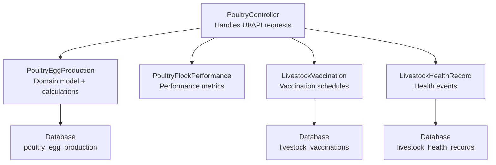
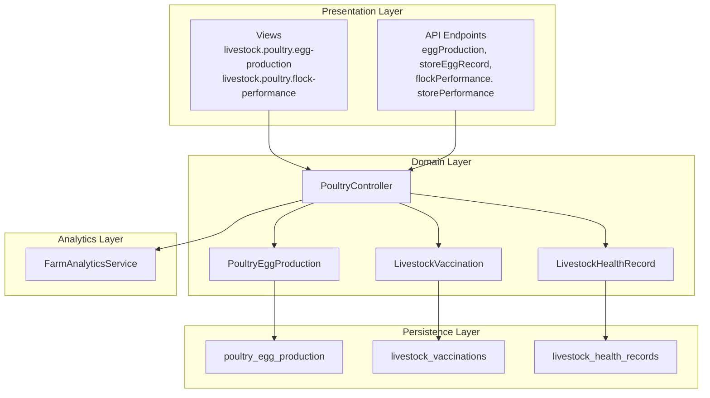
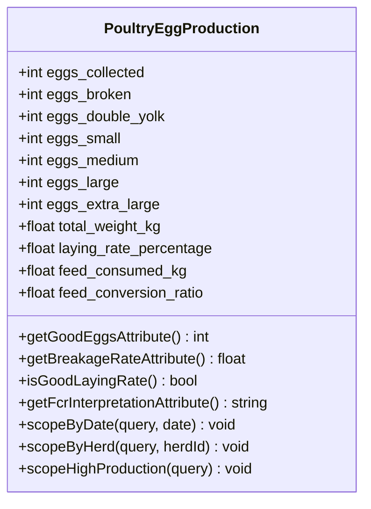
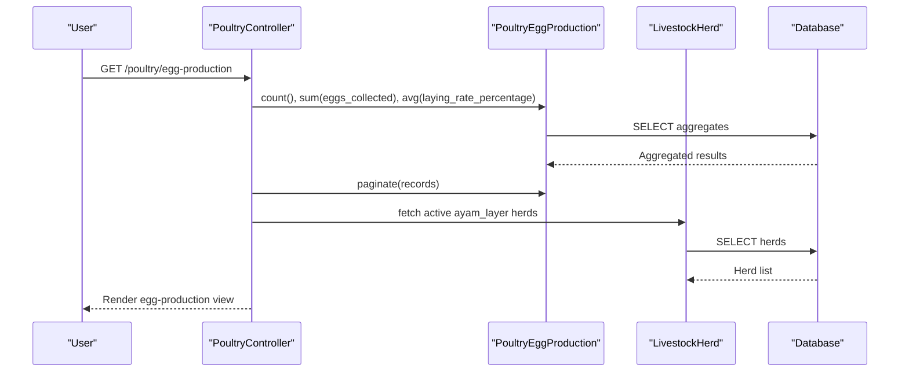
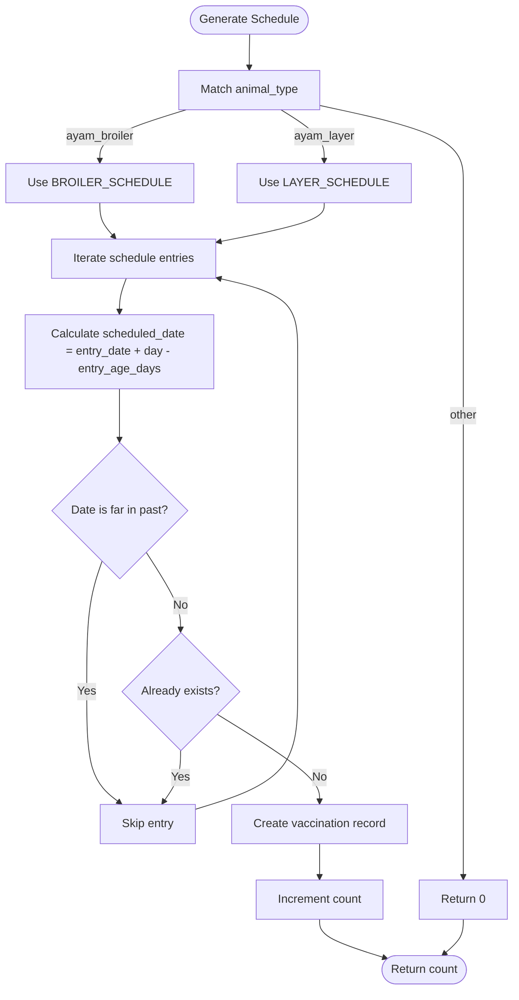
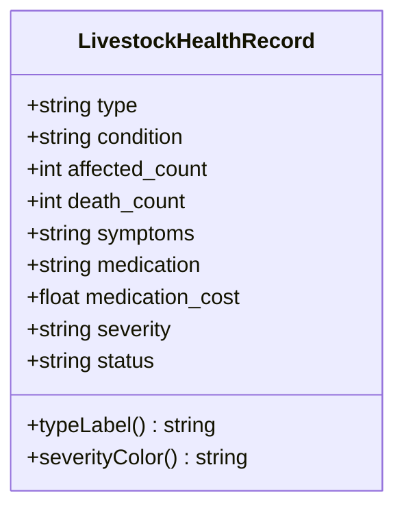
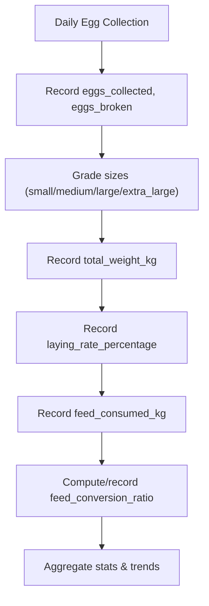
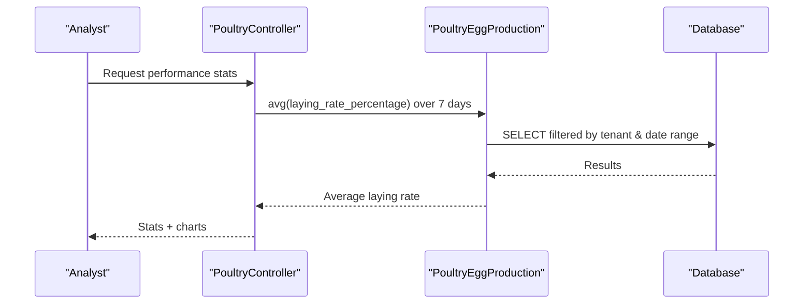
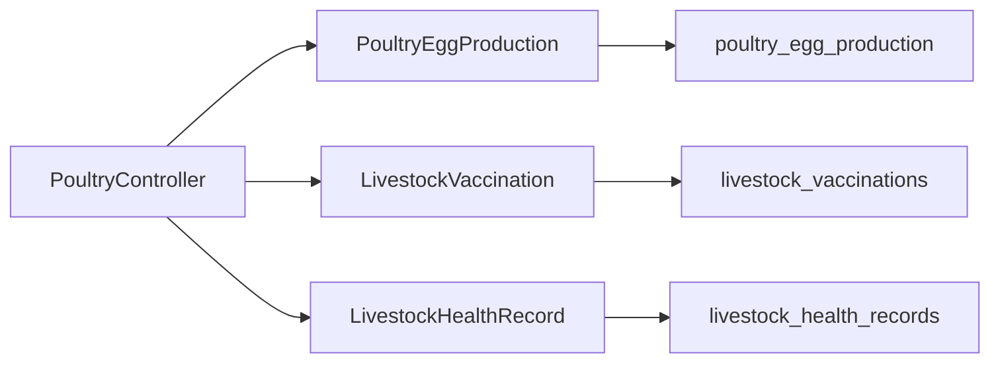

# Poultry Production Management

<cite>
**Referenced Files in This Document**
- [PoultryController.php](file://app/Http/Controllers/Livestock/PoultryController.php)
- [PoultryEggProduction.php](file://app/Models/PoultryEggProduction.php)
- [LivestockVaccination.php](file://app/Models/LivestockVaccination.php)
- [LivestockHealthRecord.php](file://app/Models/LivestockHealthRecord.php)
- [2026_04_07_120000_create_livestock_enhancement_tables.php](file://database/migrations/2026_04_07_120000_create_livestock_enhancement_tables.php)
- [2026_04_01_200000_create_livestock_health_tables.php](file://database/migrations/2026_04_01_200000_create_livestock_health_tables.php)
- [FarmAnalyticsService.php](file://app/Services/FarmAnalyticsService.php)
</cite>

## Table of Contents
1. [Introduction](#introduction)
2. [Project Structure](#project-structure)
3. [Core Components](#core-components)
4. [Architecture Overview](#architecture-overview)
5. [Detailed Component Analysis](#detailed-component-analysis)
6. [Dependency Analysis](#dependency-analysis)
7. [Performance Considerations](#performance-considerations)
8. [Troubleshooting Guide](#troubleshooting-guide)
9. [Conclusion](#conclusion)
10. [Appendices](#appendices)

## Introduction
This document provides comprehensive documentation for Poultry Production Management within the qalcuityERP system. It focuses on egg production tracking, flock health monitoring, growth metrics, laying hen management, egg quality assessment, production curve analysis, automated egg collection systems, incubation protocols, chick development tracking, disease prevention, vaccination schedules, and biosecurity measures. It also covers practical examples of production optimization, feed conversion ratios (FCR), and mortality tracking systems.

The system supports:
- Real-time egg production recording with quality metrics (broken eggs, double yolks, size grading)
- Automated calculation of key performance indicators (laying rate, breakage rate, FCR interpretation)
- Vaccination scheduling aligned with broiler and layer protocols
- Health event logging with severity and status tracking
- Flock performance dashboards including mortality and growth metrics
- Scalable tenant-based multi-farm operations

## Project Structure
The poultry module is implemented as part of the Livestock domain with dedicated controller, models, and database migrations. The structure emphasizes separation of concerns:
- Controller handles HTTP requests for egg production and flock performance
- Models encapsulate business logic for egg production, vaccination, and health records
- Migrations define the persistence layer for poultry-specific entities
- Analytics service supports advanced reporting and insights

**Diagram sources**
- [PoultryController.php:10-151](file://app/Http/Controllers/Livestock/PoultryController.php#L10-L151)
- [PoultryEggProduction.php:11-127](file://app/Models/PoultryEggProduction.php#L11-L127)
- [LivestockVaccination.php:10-95](file://app/Models/LivestockVaccination.php#L10-L95)
- [LivestockHealthRecord.php:10-44](file://app/Models/LivestockHealthRecord.php#L10-L44)

**Section sources**
- [PoultryController.php:10-151](file://app/Http/Controllers/Livestock/PoultryController.php#L10-L151)
- [PoultryEggProduction.php:11-127](file://app/Models/PoultryEggProduction.php#L11-L127)
- [LivestockVaccination.php:10-95](file://app/Models/LivestockVaccination.php#L10-L95)
- [LivestockHealthRecord.php:10-44](file://app/Models/LivestockHealthRecord.php#L10-L44)

## Core Components
- PoultryController: Provides endpoints for egg production records, flock performance, and related statistics. It paginates results, filters by tenant, and integrates with herds and users.
- PoultryEggProduction: Core model for egg production with attributes for collected eggs, broken eggs, double yolks, size grading, total weight, laying rate, feed consumption, and FCR. Includes computed properties for good eggs, breakage rate, and FCR interpretation.
- LivestockVaccination: Manages vaccination schedules for broiler and layer flocks, auto-generating due vaccinations based on animal type and entry age.
- LivestockHealthRecord: Captures health events (illness, treatment, observation, quarantine, recovery) with severity and cost tracking.
- Database Migrations: Define tables for poultry egg production, livestock vaccinations, and health records with appropriate indexes and foreign keys.

Key capabilities:
- Egg quality assessment via size grading and defect counts
- Automated FCR interpretation thresholds
- Overdue vaccination detection
- Health event categorization and severity mapping
- Tenant-scoped multi-farm isolation

**Section sources**
- [PoultryController.php:15-149](file://app/Http/Controllers/Livestock/PoultryController.php#L15-L149)
- [PoultryEggProduction.php:15-127](file://app/Models/PoultryEggProduction.php#L15-L127)
- [LivestockVaccination.php:41-93](file://app/Models/LivestockVaccination.php#L41-L93)
- [LivestockHealthRecord.php:13-43](file://app/Models/LivestockHealthRecord.php#L13-L43)
- [2026_04_07_120000_create_livestock_enhancement_tables.php:60-74](file://database/migrations/2026_04_07_120000_create_livestock_enhancement_tables.php#L60-L74)
- [2026_04_01_200000_create_livestock_health_tables.php:46-56](file://database/migrations/2026_04_01_200000_create_livestock_health_tables.php#L46-L56)

## Architecture Overview
The poultry management architecture follows a layered pattern:
- Presentation: Controller actions render views or handle API requests
- Domain: Models encapsulate business rules and calculations
- Persistence: Migrations define normalized tables with tenant scoping
- Analytics: Services support reporting and insights generation

**Diagram sources**
- [PoultryController.php:10-151](file://app/Http/Controllers/Livestock/PoultryController.php#L10-L151)
- [PoultryEggProduction.php:11-127](file://app/Models/PoultryEggProduction.php#L11-L127)
- [LivestockVaccination.php:10-95](file://app/Models/LivestockVaccination.php#L10-L95)
- [LivestockHealthRecord.php:10-44](file://app/Models/LivestockHealthRecord.php#L10-L44)
- [FarmAnalyticsService.php](file://app/Services/FarmAnalyticsService.php)

## Detailed Component Analysis

### Egg Production Tracking
PoultryEggProduction captures daily egg metrics and computes derived indicators:
- Inputs: eggs collected, broken, double yolk, size grades (small, medium, large, extra large), total weight, laying rate percentage, feed consumed, FCR
- Computed properties: good eggs, breakage rate percentage, FCR interpretation
- Scopes: date filtering, herd filtering, high production threshold

**Diagram sources**
- [PoultryEggProduction.php:15-127](file://app/Models/PoultryEggProduction.php#L15-L127)

**Section sources**
- [PoultryEggProduction.php:67-125](file://app/Models/PoultryEggProduction.php#L67-L125)
- [PoultryController.php:15-75](file://app/Http/Controllers/Livestock/PoultryController.php#L15-L75)

### Flock Health Monitoring and Growth Metrics
PoultryController exposes endpoints for:
- Egg production dashboard with totals, daily collections, and weekly laying rate averages
- Flock performance dashboard including total flocks, average mortality rate, and average FCR over 30 days
- Validation rules for performance records including mortality count, average weight, feed/water consumption, daily gain, and health status

**Diagram sources**
- [PoultryController.php:15-39](file://app/Http/Controllers/Livestock/PoultryController.php#L15-L39)
- [PoultryEggProduction.php:15-47](file://app/Models/PoultryEggProduction.php#L15-L47)

**Section sources**
- [PoultryController.php:77-149](file://app/Http/Controllers/Livestock/PoultryController.php#L77-L149)

### Vaccination Schedules and Disease Prevention
LivestockVaccination defines standardized schedules for broiler and layer flocks and auto-generates upcoming vaccinations based on entry date and age. It includes overdue detection and status management.

**Diagram sources**
- [LivestockVaccination.php:61-93](file://app/Models/LivestockVaccination.php#L61-L93)

**Section sources**
- [LivestockVaccination.php:41-93](file://app/Models/LivestockVaccination.php#L41-L93)

### Health Event Logging and Biosecurity Measures
LivestockHealthRecord captures health events with structured types (illness, treatment, observation, quarantine, recovery), severity levels, symptoms, medication, and costs. Severity color mapping supports quick risk assessment.

**Diagram sources**
- [LivestockHealthRecord.php:13-43](file://app/Models/LivestockHealthRecord.php#L13-L43)

**Section sources**
- [LivestockHealthRecord.php:25-43](file://app/Models/LivestockHealthRecord.php#L25-L43)

### Automated Egg Collection Systems
The system supports automated egg collection through:
- Structured daily recording of eggs collected and broken
- Size grading for quality assessment
- Breakage rate computation for process optimization
- Integration with feed consumption and FCR for holistic performance tracking

**Diagram sources**
- [PoultryEggProduction.php:15-47](file://app/Models/PoultryEggProduction.php#L15-L47)
- [PoultryController.php:44-75](file://app/Http/Controllers/Livestock/PoultryController.php#L44-L75)

**Section sources**
- [PoultryEggProduction.php:67-110](file://app/Models/PoultryEggProduction.php#L67-L110)
- [PoultryController.php:44-75](file://app/Http/Controllers/Livestock/PoultryController.php#L44-L75)

### Incubation Protocols and Chick Development Tracking
While direct incubation and chick rearing entities are not present in the current codebase, the system's modular design allows extension:
- Add incubation sessions table with temperature, humidity, turning logs
- Add chick batch records with hatching dates, chick counts, mortality during hatching
- Integrate with growth metrics (weight, feed intake) for post-hatch monitoring
- Link to vaccination schedules for day-of-hatch protocols

[No sources needed since this section proposes future extensions based on existing patterns]

### Production Curve Analysis
The system enables production curve analysis through:
- Historical egg production records with date indexing
- Weekly laying rate averages for trend identification
- FCR interpretation thresholds for performance benchmarking
- Herd-level aggregation for comparative analysis

**Diagram sources**
- [PoultryController.php:17-26](file://app/Http/Controllers/Livestock/PoultryController.php#L17-L26)
- [PoultryEggProduction.php:112-125](file://app/Models/PoultryEggProduction.php#L112-L125)

**Section sources**
- [PoultryController.php:17-26](file://app/Http/Controllers/Livestock/PoultryController.php#L17-L26)
- [PoultryEggProduction.php:112-125](file://app/Models/PoultryEggProduction.php#L112-L125)

### Practical Examples of Production Optimization
- Feed Conversion Ratio (FCR) Interpretation: Use computed FCR interpretation to identify underperforming flocks and adjust rations or management practices.
- Mortality Tracking: Monitor 30-day averages of mortality rates to detect emerging health issues and implement biosecurity measures.
- Egg Quality Metrics: Track breakage rates and size distribution to optimize collection handling and housing conditions.
- Vaccination Adherence: Use overdue detection to maintain immunity coverage and prevent disease outbreaks.

**Section sources**
- [PoultryEggProduction.php:95-110](file://app/Models/PoultryEggProduction.php#L95-L110)
- [LivestockVaccination.php:33-36](file://app/Models/LivestockVaccination.php#L33-L36)
- [PoultryController.php:82-92](file://app/Http/Controllers/Livestock/PoultryController.php#L82-L92)

## Dependency Analysis
The poultry module exhibits low coupling and high cohesion:
- Controller depends on models for data access and business logic
- Models depend on tenant scoping traits for multi-tenancy
- Migrations define clear foreign key relationships and indexes
- No circular dependencies detected among core poultry components

**Diagram sources**
- [PoultryController.php:6-8](file://app/Http/Controllers/Livestock/PoultryController.php#L6-L8)
- [PoultryEggProduction.php:5, 56, 61](file://app/Models/PoultryEggProduction.php#L5,L56,L61)
- [LivestockVaccination.php:29, 30, 31](file://app/Models/LivestockVaccination.php#L29,L30,L31)
- [LivestockHealthRecord.php:37, 38, 39](file://app/Models/LivestockHealthRecord.php#L37,L38,L39)

**Section sources**
- [PoultryController.php:6-8](file://app/Http/Controllers/Livestock/PoultryController.php#L6-L8)
- [PoultryEggProduction.php:49-62](file://app/Models/PoultryEggProduction.php#L49-L62)
- [LivestockVaccination.php:29-31](file://app/Models/LivestockVaccination.php#L29-L31)
- [LivestockHealthRecord.php:37-39](file://app/Models/LivestockHealthRecord.php#L37-L39)

## Performance Considerations
- Indexing: Migrations include composite indexes on tenant and date fields for efficient queries on large datasets.
- Aggregation Efficiency: Controller actions compute aggregates server-side to minimize client-side processing.
- Tenant Isolation: All models use tenant scoping to prevent cross-farm data leakage and enable scalable multi-tenant deployments.
- Decimal Precision: Numeric fields use decimal casting to ensure accurate financial and metric computations.

[No sources needed since this section provides general guidance]

## Troubleshooting Guide
Common issues and resolutions:
- Validation Failures: Ensure all required fields are provided and within acceptable ranges (non-negative integers/decimals).
- Missing Herd References: Verify that the selected herd exists and belongs to the current tenant.
- Overdue Vaccinations: Use the overdue detection method to identify missed vaccinations and reschedule.
- Performance Degradation: Confirm proper indexing on tenant_id and record_date fields; consider partitioning for very large datasets.

**Section sources**
- [PoultryController.php:46-61](file://app/Http/Controllers/Livestock/PoultryController.php#L46-L61)
- [LivestockVaccination.php:33-36](file://app/Models/LivestockVaccination.php#L33-L36)

## Conclusion
The Poultry Production Management module delivers a robust foundation for modern poultry operations, integrating egg production tracking, health monitoring, vaccination adherence, and performance analytics. Its tenant-aware design, computed metrics, and standardized schedules support scalable, data-driven decision-making. Future enhancements can extend incubation and chick development tracking while maintaining the established patterns for reliability and performance.

[No sources needed since this section summarizes without analyzing specific files]

## Appendices

### Database Schema Overview
- poultry_egg_production: Stores daily egg metrics, weights, laying rates, feed consumption, and FCR
- livestock_vaccinations: Tracks scheduled and administered vaccinations per herd
- livestock_health_records: Logs health events with severity and outcomes

**Section sources**
- [2026_04_07_120000_create_livestock_enhancement_tables.php:60-74](file://database/migrations/2026_04_07_120000_create_livestock_enhancement_tables.php#L60-L74)
- [2026_04_01_200000_create_livestock_health_tables.php:46-56](file://database/migrations/2026_04_01_200000_create_livestock_health_tables.php#L46-L56)