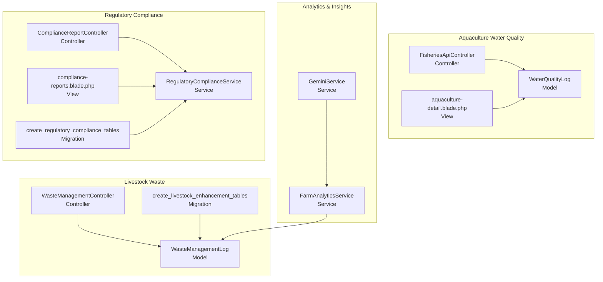
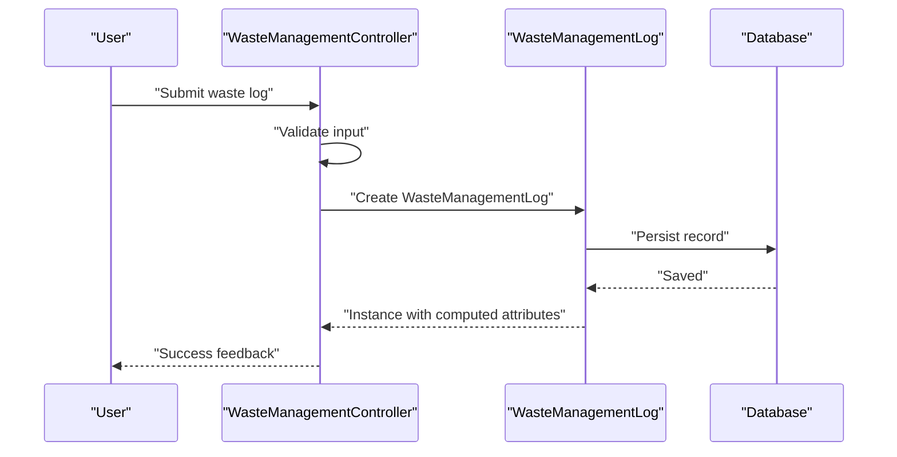
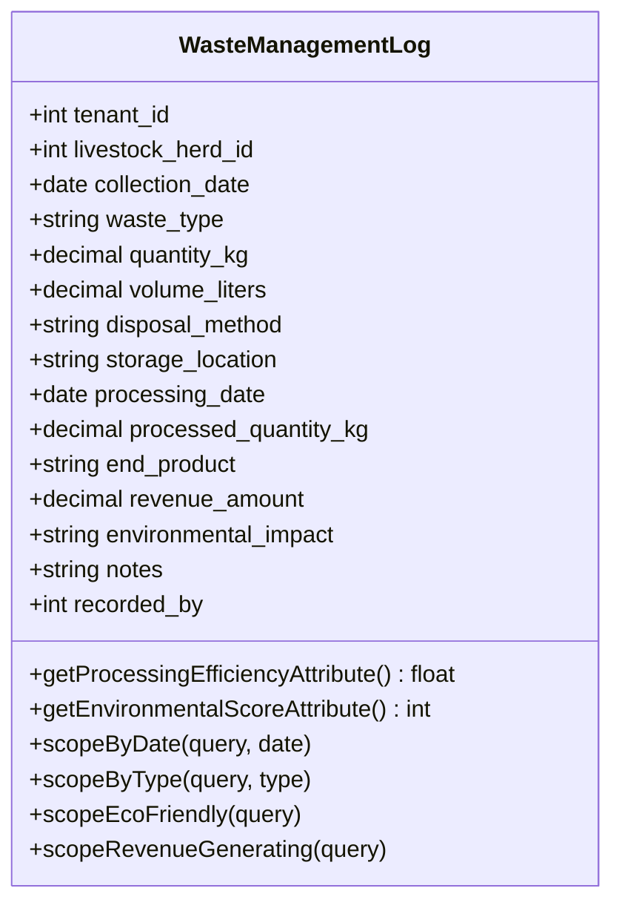
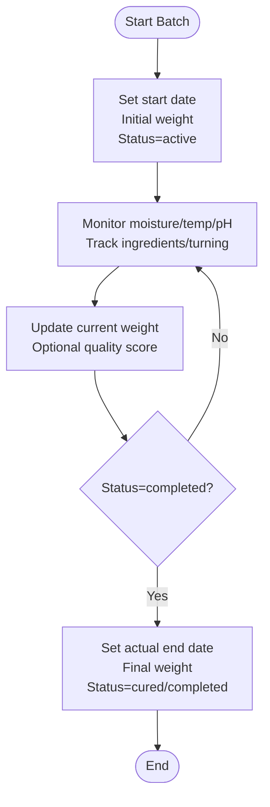
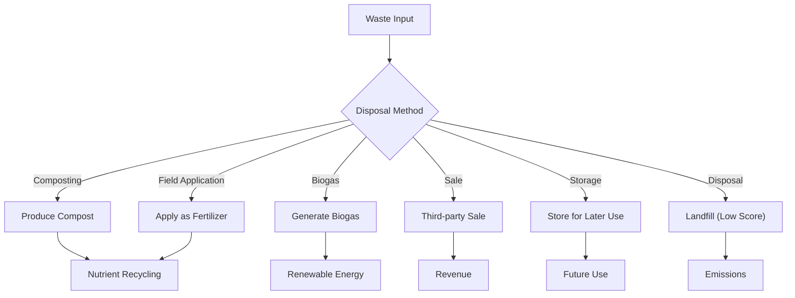
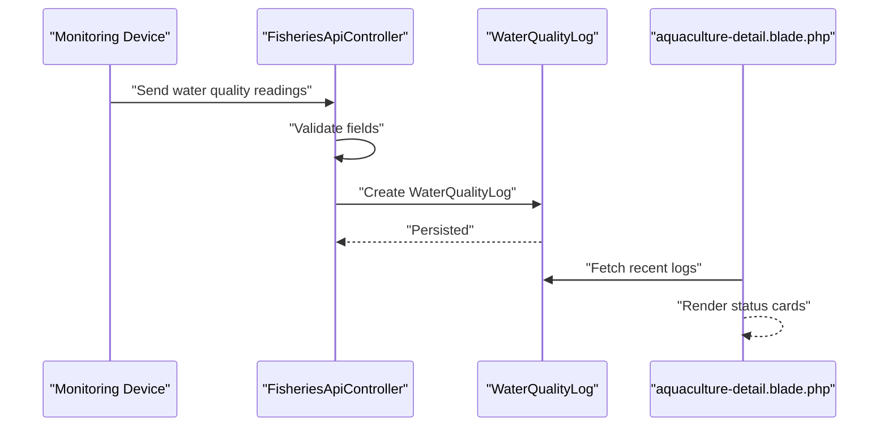
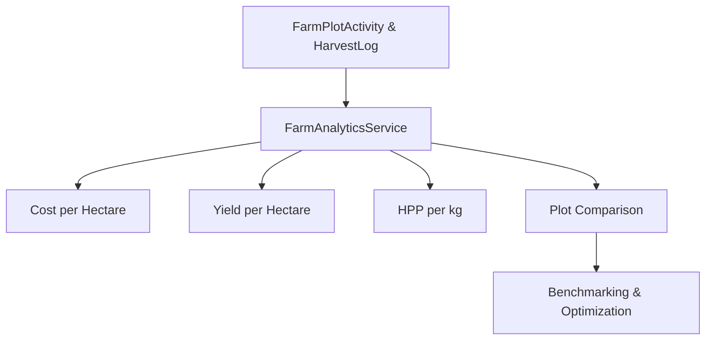
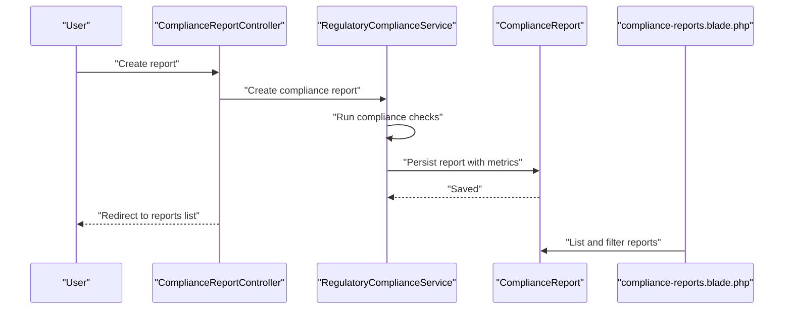
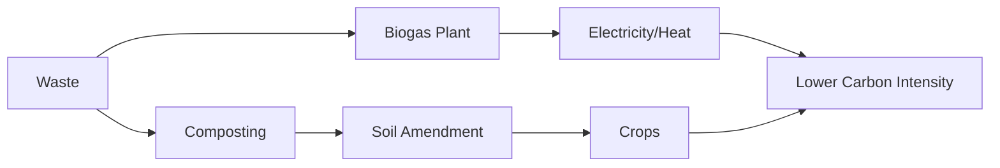
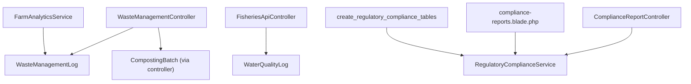

# Waste Management & Environmental Impact

<cite>
**Referenced Files in This Document**
- [WasteManagementLog.php](file://app/Models/WasteManagementLog.php)
- [WasteManagementController.php](file://app/Http/Controllers/Livestock/WasteManagementController.php)
- [2026_04_07_120000_create_livestock_enhancement_tables.php](file://database/migrations/2026_04_07_120000_create_livestock_enhancement_tables.php)
- [WaterQualityLog.php](file://app/Models/WaterQualityLog.php)
- [FisheriesApiController.php](file://app/Http/Controllers/Api/FisheriesApiController.php)
- [aquaculture-detail.blade.php](file://resources/views/fisheries/aquaculture-detail.blade.php)
- [FarmAnalyticsService.php](file://app/Services/FarmAnalyticsService.php)
- [GeminiService.php](file://app/Services/GeminiService.php)
- [app.blade.php](file://resources/views/layouts/app.blade.php)
- [2026_04_08_1400001_create_regulatory_compliance_tables.php](file://database/migrations/2026_04_08_1400001_create_regulatory_compliance_tables.php)
- [ComplianceReportController.php](file://app/Http/Controllers/Healthcare/ComplianceReportController.php)
- [RegulatoryComplianceService.php](file://app/Services/RegulatoryComplianceService.php)
- [compliance-reports.blade.php](file://resources/views/compliance/reports.blade.php)
- [2026_04_08_1200001_create_medical_inventory_tables.php](file://database/migrations/2026_04_08_1200001_create_medical_inventory_tables.php)
- [medical-waste/create.blade.php](file://resources/views/healthcare/medical-waste/create.blade.php)
- [medical-waste/edit.blade.php](file://resources/views/healthcare/medical-waste/edit.blade.php)
</cite>

## Table of Contents
1. [Introduction](#introduction)
2. [Project Structure](#project-structure)
3. [Core Components](#core-components)
4. [Architecture Overview](#architecture-overview)
5. [Detailed Component Analysis](#detailed-component-analysis)
6. [Dependency Analysis](#dependency-analysis)
7. [Performance Considerations](#performance-considerations)
8. [Troubleshooting Guide](#troubleshooting-guide)
9. [Conclusion](#conclusion)
10. [Appendices](#appendices)

## Introduction
This document provides comprehensive coverage of Waste Management & Environmental Impact within the qalcuityERP system. It focuses on livestock manure processing, effluent management, sustainability metrics, and regulatory compliance. The system supports waste volume tracking, composting systems, nutrient recycling protocols, environmental impact assessments, emission monitoring, and reporting. It also includes water usage optimization indicators via water quality monitoring and pathways for carbon footprint reduction strategies through sustainable farming and waste-to-energy initiatives.

## Project Structure
The waste and environmental management capabilities are implemented across models, controllers, migrations, services, and views:

- Data model layer: WasteManagementLog, CompostingBatch (via migration), WaterQualityLog
- API/controller layer: WasteManagementController, FisheriesApiController
- Analytics and insights: FarmAnalyticsService, GeminiService
- Regulatory compliance: RegulatoryComplianceService, ComplianceReportController, compliance report views
- Views: Livestock waste dashboard, aquaculture water quality dashboard, regulatory dashboards

**Diagram sources**
- [WasteManagementLog.php:11-139](file://app/Models/WasteManagementLog.php#L11-L139)
- [WasteManagementController.php:10-171](file://app/Http/Controllers/Livestock/WasteManagementController.php#L10-L171)
- [2026_04_07_120000_create_livestock_enhancement_tables.php:168-218](file://database/migrations/2026_04_07_120000_create_livestock_enhancement_tables.php#L168-L218)
- [WaterQualityLog.php:10-73](file://app/Models/WaterQualityLog.php#L10-L73)
- [FisheriesApiController.php:118-132](file://app/Http/Controllers/Api/FisheriesApiController.php#L118-L132)
- [aquaculture-detail.blade.php:165-210](file://resources/views/fisheries/aquaculture-detail.blade.php#L165-L210)
- [FarmAnalyticsService.php:11-159](file://app/Services/FarmAnalyticsService.php#L11-L159)
- [GeminiService.php:329-345](file://app/Services/GeminiService.php#L329-L345)
- [RegulatoryComplianceService.php:139-163](file://app/Services/RegulatoryComplianceService.php#L139-L163)
- [ComplianceReportController.php:9-43](file://app/Http/Controllers/Healthcare/ComplianceReportController.php#L9-L43)
- [compliance-reports.blade.php:1-278](file://resources/views/compliance/reports.blade.php#L1-L278)
- [2026_04_08_1400001_create_regulatory_compliance_tables.php:173-201](file://database/migrations/2026_04_08_1400001_create_regulatory_compliance_tables.php#L173-L201)

**Section sources**
- [WasteManagementLog.php:11-139](file://app/Models/WasteManagementLog.php#L11-L139)
- [WasteManagementController.php:10-171](file://app/Http/Controllers/Livestock/WasteManagementController.php#L10-L171)
- [2026_04_07_120000_create_livestock_enhancement_tables.php:168-218](file://database/migrations/2026_04_07_120000_create_livestock_enhancement_tables.php#L168-L218)
- [WaterQualityLog.php:10-73](file://app/Models/WaterQualityLog.php#L10-L73)
- [FisheriesApiController.php:118-132](file://app/Http/Controllers/Api/FisheriesApiController.php#L118-L132)
- [aquaculture-detail.blade.php:165-210](file://resources/views/fisheries/aquaculture-detail.blade.php#L165-L210)
- [FarmAnalyticsService.php:11-159](file://app/Services/FarmAnalyticsService.php#L11-L159)
- [GeminiService.php:329-345](file://app/Services/GeminiService.php#L329-L345)
- [RegulatoryComplianceService.php:139-163](file://app/Services/RegulatoryComplianceService.php#L139-L163)
- [ComplianceReportController.php:9-43](file://app/Http/Controllers/Healthcare/ComplianceReportController.php#L9-L43)
- [compliance-reports.blade.php:1-278](file://resources/views/compliance/reports.blade.php#L1-L278)
- [2026_04_08_1400001_create_regulatory_compliance_tables.php:173-201](file://database/migrations/2026_04_08_1400001_create_regulatory_compliance_tables.php#L173-L201)

## Core Components
- WasteManagementLog: Tracks waste collection, quantities, disposal methods, and environmental impact. Provides computed attributes for processing efficiency and environmental friendliness scoring.
- CompostingBatch: Managed via controller actions for creation and updates, tracked through dedicated statistics and batch lifecycle.
- WaterQualityLog: Captures water quality metrics for aquaculture, enabling environmental monitoring and safe operation thresholds.
- RegulatoryComplianceService: Generates compliance reports and tracks compliance scores across frameworks.
- FarmAnalyticsService: Supports sustainability metrics such as cost per hectare, yield per hectare, and HPP (cost per kg harvested), informing resource optimization and carbon footprint reduction strategies.

**Section sources**
- [WasteManagementLog.php:11-139](file://app/Models/WasteManagementLog.php#L11-L139)
- [WasteManagementController.php:85-171](file://app/Http/Controllers/Livestock/WasteManagementController.php#L85-L171)
- [WaterQualityLog.php:10-73](file://app/Models/WaterQualityLog.php#L10-L73)
- [RegulatoryComplianceService.php:139-163](file://app/Services/RegulatoryComplianceService.php#L139-L163)
- [FarmAnalyticsService.php:11-159](file://app/Services/FarmAnalyticsService.php#L11-L159)

## Architecture Overview
The system integrates waste and environmental data across modules:

- Livestock waste ingestion via WasteManagementController stores records in WasteManagementLog and supports composting batch lifecycle.
- Aquaculture water quality is captured via FisheriesApiController and surfaced in views for monitoring.
- Sustainability analytics are derived from FarmAnalyticsService to guide decisions on resource usage and emissions.
- Regulatory compliance is handled by RegulatoryComplianceService with structured reporting and status tracking.

**Diagram sources**
- [WasteManagementController.php:51-80](file://app/Http/Controllers/Livestock/WasteManagementController.php#L51-L80)
- [WasteManagementLog.php:11-139](file://app/Models/WasteManagementLog.php#L11-L139)

**Section sources**
- [WasteManagementController.php:10-171](file://app/Http/Controllers/Livestock/WasteManagementController.php#L10-L171)
- [WasteManagementLog.php:11-139](file://app/Models/WasteManagementLog.php#L11-L139)

## Detailed Component Analysis

### Waste Volume Tracking and Disposal Methods
- Data capture: Collection date, waste type (solid manure, liquid slurry, urine, bedding, mortality, other), quantity in kg, optional volume in liters, disposal method (composting, biogas, field application, sale, disposal, storage).
- Computed metrics: Processing efficiency percentage and environmental friendliness score enable sustainability scoring.
- Filtering and scoping: Scope helpers support filtering by date, type, eco-friendly methods, and revenue-generating sales.

**Diagram sources**
- [WasteManagementLog.php:11-139](file://app/Models/WasteManagementLog.php#L11-L139)

**Section sources**
- [WasteManagementLog.php:11-139](file://app/Models/WasteManagementLog.php#L11-L139)
- [WasteManagementController.php:15-80](file://app/Http/Controllers/Livestock/WasteManagementController.php#L15-L80)

### Composting Systems and Batch Lifecycle
- Batch creation: Generates unique batch codes, sets initial weights, and manages status (active, curing, completed).
- Monitoring: Tracks moisture, temperature, pH, and optional ingredient lists and turning schedules.
- Completion: Updates final weight, actual end date, and optional quality score.

**Diagram sources**
- [WasteManagementController.php:109-171](file://app/Http/Controllers/Livestock/WasteManagementController.php#L109-L171)
- [2026_04_07_120000_create_livestock_enhancement_tables.php:194-218](file://database/migrations/2026_04_07_120000_create_livestock_enhancement_tables.php#L194-L218)

**Section sources**
- [WasteManagementController.php:85-171](file://app/Http/Controllers/Livestock/WasteManagementController.php#L85-L171)
- [2026_04_07_120000_create_livestock_enhancement_tables.php:194-218](file://database/migrations/2026_04_07_120000_create_livestock_enhancement_tables.php#L194-L218)

### Nutrient Recycling Protocols
- Field application: Disposal method supports field application as a natural fertilizer pathway.
- Composting: Produces end products suitable for land application, reducing landfill dependency.
- Revenue generation: Sale of end products can offset costs and improve sustainability ROI.

**Diagram sources**
- [WasteManagementLog.php:106-117](file://app/Models/WasteManagementLog.php#L106-L117)
- [WasteManagementController.php:59-67](file://app/Http/Controllers/Livestock/WasteManagementController.php#L59-L67)

**Section sources**
- [WasteManagementLog.php:106-117](file://app/Models/WasteManagementLog.php#L106-L117)
- [WasteManagementController.php:59-67](file://app/Http/Controllers/Livestock/WasteManagementController.php#L59-L67)

### Effluent Management and Water Quality Monitoring
- Data capture: pH, dissolved oxygen, temperature, salinity, ammonia, nitrite, nitrate, turbidity, measurement method, measured by user, measured at timestamp.
- Operational thresholds: Safe pH range and adequate dissolved oxygen level checks help prevent aquatic stress and disease.
- API ingestion: FisheriesApiController validates and persists water quality measurements.

**Diagram sources**
- [FisheriesApiController.php:118-132](file://app/Http/Controllers/Api/FisheriesApiController.php#L118-L132)
- [WaterQualityLog.php:10-73](file://app/Models/WaterQualityLog.php#L10-L73)
- [aquaculture-detail.blade.php:165-210](file://resources/views/fisheries/aquaculture-detail.blade.php#L165-L210)

**Section sources**
- [WaterQualityLog.php:10-73](file://app/Models/WaterQualityLog.php#L10-L73)
- [FisheriesApiController.php:118-132](file://app/Http/Controllers/Api/FisheriesApiController.php#L118-L132)
- [aquaculture-detail.blade.php:165-210](file://resources/views/fisheries/aquaculture-detail.blade.php#L165-L210)

### Sustainability Metrics and Analytics
- Cost per hectare and yield per hectare: Derived from FarmAnalyticsService to assess productivity and input efficiency.
- HPP (cost per kg harvested): Supports economic evaluation of sustainability practices.
- Plot comparison: Enables benchmarking across plots to identify best practices and reduce resource intensity.

**Diagram sources**
- [FarmAnalyticsService.php:11-159](file://app/Services/FarmAnalyticsService.php#L11-L159)

**Section sources**
- [FarmAnalyticsService.php:11-159](file://app/Services/FarmAnalyticsService.php#L11-L159)
- [GeminiService.php:329-345](file://app/Services/GeminiService.php#L329-L345)

### Environmental Impact Assessments and Reporting
- Regulatory compliance framework: Structured compliance report creation with metrics, findings, recommendations, and corrective actions.
- Compliance scoring: Compliance score derived from pass/fail/warning checks across selected frameworks.
- Reporting lifecycle: Draft, completed, reviewed, submitted, approved statuses.

**Diagram sources**
- [ComplianceReportController.php:9-43](file://app/Http/Controllers/Healthcare/ComplianceReportController.php#L9-L43)
- [RegulatoryComplianceService.php:139-163](file://app/Services/RegulatoryComplianceService.php#L139-L163)
- [compliance-reports.blade.php:1-278](file://resources/views/compliance/reports.blade.php#L1-L278)
- [2026_04_08_1400001_create_regulatory_compliance_tables.php:173-201](file://database/migrations/2026_04_08_1400001_create_regulatory_compliance_tables.php#L173-L201)

**Section sources**
- [RegulatoryComplianceService.php:139-163](file://app/Services/RegulatoryComplianceService.php#L139-L163)
- [ComplianceReportController.php:9-43](file://app/Http/Controllers/Healthcare/ComplianceReportController.php#L9-L43)
- [compliance-reports.blade.php:1-278](file://resources/views/compliance/reports.blade.php#L1-L278)
- [2026_04_08_1400001_create_regulatory_compliance_tables.php:173-201](file://database/migrations/2026_04_08_1400001_create_regulatory_compliance_tables.php#L173-L201)

### Waste Treatment Technologies and Carbon Footprint Reduction
- Waste-to-energy pathways: Biogas production as a renewable energy source improves carbon footprint metrics.
- Composting: Reduces methane emissions from landfills and produces soil amendment.
- Field application: Natural fertilizer reduces synthetic input dependency.
- Economic incentives: Revenue from end-product sales can fund further sustainability improvements.

[No sources needed since this diagram shows conceptual workflow, not actual code structure]

### Water Usage Optimization
- Water quality thresholds: Dissolved oxygen and pH monitoring ensure efficient aeration and biological processes, reducing energy and chemical inputs.
- Real-time dashboards: Views present water quality trends to support operational adjustments.

**Section sources**
- [WaterQualityLog.php:64-72](file://app/Models/WaterQualityLog.php#L64-L72)
- [aquaculture-detail.blade.php:165-210](file://resources/views/fisheries/aquaculture-detail.blade.php#L165-L210)

### Practical Examples
- Waste-to-energy systems: Biogas production from livestock waste is supported by disposal method selection and batch tracking.
- Environmental monitoring dashboards: Livestock waste dashboard and aquaculture water quality dashboard provide real-time insights.
- Sustainable farming certification processes: Regulatory compliance reporting and scoring can support certification readiness and audits.

**Section sources**
- [WasteManagementController.php:85-104](file://app/Http/Controllers/Livestock/WasteManagementController.php#L85-L104)
- [aquaculture-detail.blade.php:165-210](file://resources/views/fisheries/aquaculture-detail.blade.php#L165-L210)
- [RegulatoryComplianceService.php:139-163](file://app/Services/RegulatoryComplianceService.php#L139-L163)

## Dependency Analysis
The following diagram highlights key dependencies among components:

**Diagram sources**
- [WasteManagementController.php:10-171](file://app/Http/Controllers/Livestock/WasteManagementController.php#L10-L171)
- [WasteManagementLog.php:11-139](file://app/Models/WasteManagementLog.php#L11-L139)
- [FisheriesApiController.php:118-132](file://app/Http/Controllers/Api/FisheriesApiController.php#L118-L132)
- [WaterQualityLog.php:10-73](file://app/Models/WaterQualityLog.php#L10-L73)
- [FarmAnalyticsService.php:11-159](file://app/Services/FarmAnalyticsService.php#L11-L159)
- [ComplianceReportController.php:9-43](file://app/Http/Controllers/Healthcare/ComplianceReportController.php#L9-L43)
- [RegulatoryComplianceService.php:139-163](file://app/Services/RegulatoryComplianceService.php#L139-L163)
- [compliance-reports.blade.php:1-278](file://resources/views/compliance/reports.blade.php#L1-L278)
- [2026_04_08_1400001_create_regulatory_compliance_tables.php:173-201](file://database/migrations/2026_04_08_1400001_create_regulatory_compliance_tables.php#L173-L201)

**Section sources**
- [WasteManagementController.php:10-171](file://app/Http/Controllers/Livestock/WasteManagementController.php#L10-L171)
- [WasteManagementLog.php:11-139](file://app/Models/WasteManagementLog.php#L11-L139)
- [FisheriesApiController.php:118-132](file://app/Http/Controllers/Api/FisheriesApiController.php#L118-L132)
- [WaterQualityLog.php:10-73](file://app/Models/WaterQualityLog.php#L10-L73)
- [FarmAnalyticsService.php:11-159](file://app/Services/FarmAnalyticsService.php#L11-L159)
- [ComplianceReportController.php:9-43](file://app/Http/Controllers/Healthcare/ComplianceReportController.php#L9-L43)
- [RegulatoryComplianceService.php:139-163](file://app/Services/RegulatoryComplianceService.php#L139-L163)
- [compliance-reports.blade.php:1-278](file://resources/views/compliance/reports.blade.php#L1-L278)
- [2026_04_08_1400001_create_regulatory_compliance_tables.php:173-201](file://database/migrations/2026_04_08_1400001_create_regulatory_compliance_tables.php#L173-L201)

## Performance Considerations
- Indexing: WasteManagementLog and CompostingBatch migrations define indices on tenant_id, collection_date, and status to optimize queries.
- Computed attributes: Efficient PHP calculations for processing efficiency and environmental scores avoid heavy joins.
- Pagination: Controllers use pagination to limit result sets for dashboard views.
- Threshold checks: Water quality checks are lightweight boolean evaluations to minimize processing overhead.

**Section sources**
- [2026_04_07_120000_create_livestock_enhancement_tables.php:188-189](file://database/migrations/2026_04_07_120000_create_livestock_enhancement_tables.php#L188-L189)
- [WasteManagementLog.php:94-117](file://app/Models/WasteManagementLog.php#L94-L117)
- [WasteManagementController.php:36-39](file://app/Http/Controllers/Livestock/WasteManagementController.php#L36-L39)
- [WaterQualityLog.php:64-72](file://app/Models/WaterQualityLog.php#L64-L72)

## Troubleshooting Guide
- Waste log submission errors: Validation ensures required fields and numeric ranges; exceptions are caught and surfaced to the user.
- Composting batch updates: Status transitions and completion dates are enforced; errors are returned with context.
- Water quality API failures: Validation errors and persistence exceptions are handled gracefully.
- Regulatory report generation: Compliance checks and scoring are encapsulated; review status and metrics to identify gaps.

**Section sources**
- [WasteManagementController.php:69-79](file://app/Http/Controllers/Livestock/WasteManagementController.php#L69-L79)
- [WasteManagementController.php:156-169](file://app/Http/Controllers/Livestock/WasteManagementController.php#L156-L169)
- [FisheriesApiController.php:126-132](file://app/Http/Controllers/Api/FisheriesApiController.php#L126-L132)
- [RegulatoryComplianceService.php:139-163](file://app/Services/RegulatoryComplianceService.php#L139-L163)

## Conclusion
The qalcuityERP system provides robust capabilities for managing livestock waste, monitoring water quality, and supporting sustainability and regulatory compliance. Through waste volume tracking, composting lifecycle management, nutrient recycling protocols, and analytics-driven insights, organizations can reduce environmental impact and improve resource efficiency. Regulatory compliance reporting and threshold-based monitoring further strengthen oversight and readiness for certifications.

## Appendices
- Navigation: The application layout includes navigation entries for farm analytics and livestock modules, facilitating quick access to waste and environmental dashboards.

**Section sources**
- [app.blade.php:1456-1477](file://resources/views/layouts/app.blade.php#L1456-L1477)