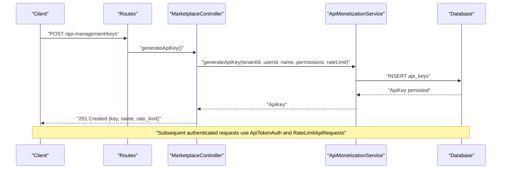
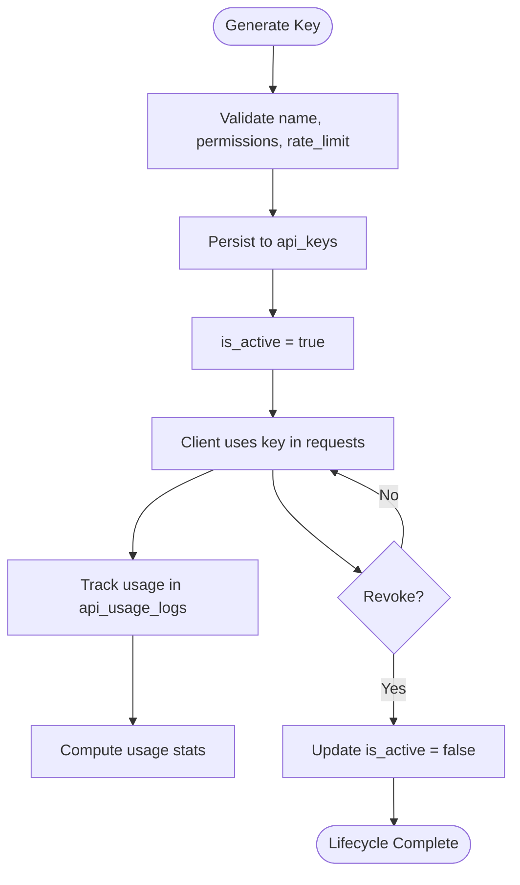
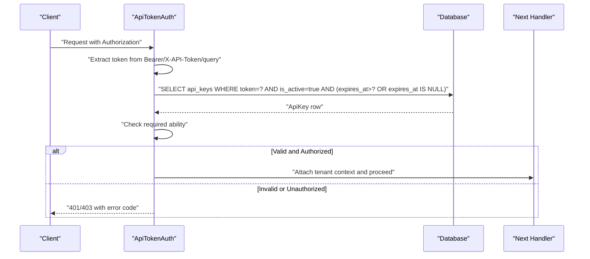
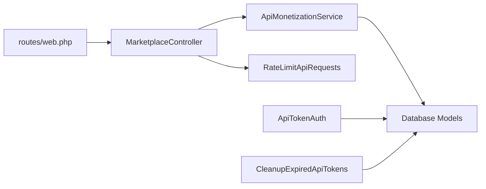

# API Key Management

<cite>
**Referenced Files in This Document**
- [ApiMonetizationService.php](file://app/Services/Marketplace/ApiMonetizationService.php)
- [MarketplaceController.php](file://app/Http/Controllers/Marketplace/MarketplaceController.php)
- [RateLimitApiRequests.php](file://app/Http/Middleware/RateLimitApiRequests.php)
- [ApiTokenAuth.php](file://app/Http/Middleware/ApiTokenAuth.php)
- [CleanupExpiredApiTokens.php](file://app/Console/Commands/CleanupExpiredApiTokens.php)
- [2026_04_06_130000_create_marketplace_tables.php](file://database/migrations/2026_04_06_130000_create_marketplace_tables.php)
- [web.php](file://routes/web.php)
</cite>

## Table of Contents
1. [Introduction](#introduction)
2. [Project Structure](#project-structure)
3. [Core Components](#core-components)
4. [Architecture Overview](#architecture-overview)
5. [Detailed Component Analysis](#detailed-component-analysis)
6. [Dependency Analysis](#dependency-analysis)
7. [Performance Considerations](#performance-considerations)
8. [Troubleshooting Guide](#troubleshooting-guide)
9. [Conclusion](#conclusion)
10. [Appendices](#appendices)

## Introduction
This document describes the API Key Management system used by the application’s monetization and marketplace features. It covers the complete lifecycle of API keys: generation, naming conventions, permission scoping, rate limiting configuration, activation and monitoring, revocation, rotation policies, security best practices, access control, validation and authentication headers, request authorization workflows, usage examples, integration patterns, and troubleshooting.

## Project Structure
The API Key Management system spans controllers, services, middleware, database migrations, and routing. The primary components are:
- MarketplaceController: exposes endpoints to manage API keys and subscriptions
- ApiMonetizationService: encapsulates key generation, validation, usage tracking, and subscription management
- RateLimitApiRequests middleware: enforces per-tenant, per-limiter rate limits
- ApiTokenAuth middleware: validates API tokens and attaches tenant context
- CleanupExpiredApiTokens command: cleans up expired and inactive tokens
- Database migrations: define schema for api_keys, api_usage_logs, and api_subscriptions

```mermaid
graph TB
subgraph "HTTP Layer"
Routes["Routes<br/>web.php"]
Controller["MarketplaceController<br/>MarketplaceController.php"]
end
subgraph "Service Layer"
Service["ApiMonetizationService<br/>ApiMonetizationService.php"]
end
subgraph "Middleware"
AuthMW["ApiTokenAuth<br/>ApiTokenAuth.php"]
RateMW["RateLimitApiRequests<br/>RateLimitApiRequests.php"]
end
subgraph "Persistence"
Migr["Migrations<br/>create_marketplace_tables.php"]
Keys["api_keys"]
Logs["api_usage_logs"]
Subs["api_subscriptions"]
end
Routes --> Controller
Controller --> Service
Controller --> RateMW
Service --> Keys
Service --> Logs
Service --> Subs
AuthMW --> Keys
RateMW --> Subs
Migr --> Keys
Migr --> Logs
Migr --> Subs
```

**Diagram sources**
- [web.php:2784-2794](file://routes/web.php#L2784-L2794)
- [MarketplaceController.php:519-671](file://app/Http/Controllers/Marketplace/MarketplaceController.php#L519-L671)
- [ApiMonetizationService.php:10-187](file://app/Services/Marketplace/ApiMonetizationService.php#L10-L187)
- [RateLimitApiRequests.php:22-161](file://app/Http/Middleware/RateLimitApiRequests.php#L22-L161)
- [ApiTokenAuth.php:10-70](file://app/Http/Middleware/ApiTokenAuth.php#L10-L70)
- [2026_04_06_130000_create_marketplace_tables.php:197-244](file://database/migrations/2026_04_06_130000_create_marketplace_tables.php#L197-L244)

**Section sources**
- [web.php:2784-2794](file://routes/web.php#L2784-L2794)
- [MarketplaceController.php:519-671](file://app/Http/Controllers/Marketplace/MarketplaceController.php#L519-L671)
- [ApiMonetizationService.php:10-187](file://app/Services/Marketplace/ApiMonetizationService.php#L10-L187)
- [RateLimitApiRequests.php:22-161](file://app/Http/Middleware/RateLimitApiRequests.php#L22-L161)
- [ApiTokenAuth.php:10-70](file://app/Http/Middleware/ApiTokenAuth.php#L10-L70)
- [2026_04_06_130000_create_marketplace_tables.php:197-244](file://database/migrations/2026_04_06_130000_create_marketplace_tables.php#L197-L244)

## Core Components
- ApiMonetizationService: Generates keys with a prefixed identifier, validates keys against activity, expiration, and per-key rate limits, tracks usage, manages subscriptions, and computes usage analytics.
- MarketplaceController: Provides REST endpoints for generating keys, listing keys, revoking keys, viewing usage stats, and managing subscriptions.
- RateLimitApiRequests: Applies tenant-aware rate limits per endpoint category and adds standard rate limit headers.
- ApiTokenAuth: Validates bearer tokens or X-API-Token header or query param, checks active and non-expired state, enforces ability-based permissions, attaches tenant context, and logs failures.
- CleanupExpiredApiTokens: Periodic cleanup of expired and long-inactive tokens.
- Database schema: Defines api_keys, api_usage_logs, and api_subscriptions with appropriate indexes and constraints.

**Section sources**
- [ApiMonetizationService.php:10-187](file://app/Services/Marketplace/ApiMonetizationService.php#L10-L187)
- [MarketplaceController.php:519-671](file://app/Http/Controllers/Marketplace/MarketplaceController.php#L519-L671)
- [RateLimitApiRequests.php:22-161](file://app/Http/Middleware/RateLimitApiRequests.php#L22-L161)
- [ApiTokenAuth.php:10-70](file://app/Http/Middleware/ApiTokenAuth.php#L10-L70)
- [CleanupExpiredApiTokens.php:9-123](file://app/Console/Commands/CleanupExpiredApiTokens.php#L9-L123)
- [2026_04_06_130000_create_marketplace_tables.php:197-244](file://database/migrations/2026_04_06_130000_create_marketplace_tables.php#L197-L244)

## Architecture Overview
The API Key Management architecture integrates REST endpoints, service-layer logic, middleware-based authentication and rate limiting, and persistent storage. Requests flow through routing to the controller, which delegates to the service for key operations. Authentication and rate-limiting middleware enforce security and usage quotas. Usage telemetry is recorded and aggregated for reporting.

**Diagram sources**
- [web.php:2784-2794](file://routes/web.php#L2784-L2794)
- [MarketplaceController.php:522-547](file://app/Http/Controllers/Marketplace/MarketplaceController.php#L522-L547)
- [ApiMonetizationService.php:14-26](file://app/Services/Marketplace/ApiMonetizationService.php#L14-L26)
- [2026_04_06_130000_create_marketplace_tables.php:197-214](file://database/migrations/2026_04_06_130000_create_marketplace_tables.php#L197-L214)

## Detailed Component Analysis

### API Key Lifecycle and Operations
- Creation: The controller validates input and calls the service to persist a new key with a prefixed identifier, permissions, and rate limit.
- Activation: Newly created keys are active by default.
- Monitoring: Usage logs are recorded per request; usage stats are computed by the service.
- Revocation: The controller updates the key’s active flag to false.
- Rotation: Rotate by generating a new key and updating client configurations; immediately revoke the old key after successful migration.

**Diagram sources**
- [MarketplaceController.php:522-547](file://app/Http/Controllers/Marketplace/MarketplaceController.php#L522-L547)
- [ApiMonetizationService.php:14-71](file://app/Services/Marketplace/ApiMonetizationService.php#L14-L71)
- [2026_04_06_130000_create_marketplace_tables.php:197-228](file://database/migrations/2026_04_06_130000_create_marketplace_tables.php#L197-L228)

**Section sources**
- [MarketplaceController.php:519-671](file://app/Http/Controllers/Marketplace/MarketplaceController.php#L519-L671)
- [ApiMonetizationService.php:10-187](file://app/Services/Marketplace/ApiMonetizationService.php#L10-L187)
- [2026_04_06_130000_create_marketplace_tables.php:197-244](file://database/migrations/2026_04_06_130000_create_marketplace_tables.php#L197-L244)

### Naming Conventions and Data Model
- Key identifier: Prefixed with a constant prefix and a random segment to ensure uniqueness.
- Permissions: Stored as JSON; supported abilities include read, write, delete, and wildcard.
- Rate limiting: Configured per key (requests per hour) and tracked via a usage counter and last-used timestamp.
- Expiration: Optional; keys can be set to expire at a future date.
- Indexes: Composite indexes on api_keys support fast validation and filtering.

**Section sources**
- [ApiMonetizationService.php:14-26](file://app/Services/Marketplace/ApiMonetizationService.php#L14-L26)
- [2026_04_06_130000_create_marketplace_tables.php:197-214](file://database/migrations/2026_04_06_130000_create_marketplace_tables.php#L197-L214)

### Permission Scoping and Access Control
- Ability-based enforcement: The service validates whether a key includes the requested ability or a wildcard.
- Middleware enforcement: ApiTokenAuth checks token validity and required ability before allowing downstream processing.
- Tenant isolation: All operations are scoped to the authenticated tenant.

**Section sources**
- [ApiMonetizationService.php:62-65](file://app/Services/Marketplace/ApiMonetizationService.php#L62-L65)
- [ApiTokenAuth.php:47-59](file://app/Http/Middleware/ApiTokenAuth.php#L47-L59)

### Rate Limiting Configuration and Enforcement
- Per-key rate limits: Controlled by the api_keys.rate_limit and requests_used fields.
- Hourly reset: The service resets the usage counter when the hour changes.
- Subscription-based multipliers: Rate limits are scaled by plan tiers when enforced via tenant context.
- Standard headers: Responses include X-RateLimit-Limit and X-RateLimit-Remaining; 429 responses include Retry-After.

**Section sources**
- [ApiMonetizationService.php:76-91](file://app/Services/Marketplace/ApiMonetizationService.php#L76-L91)
- [RateLimitApiRequests.php:67-117](file://app/Http/Middleware/RateLimitApiRequests.php#L67-L117)
- [RateLimitApiRequests.php:124-159](file://app/Http/Middleware/RateLimitApiRequests.php#L124-L159)

### Validation, Authentication Headers, and Authorization Workflows
- Authentication methods: Accepts Bearer token, X-API-Token header, or api_token query parameter.
- Validation steps: Checks presence of token, active state, non-expired status, and required ability.
- Tenant context: Attaches tenant ID to the request for downstream handlers.
- Logging: Logs failed authentications and permission denials for auditability.

**Diagram sources**
- [ApiTokenAuth.php:12-69](file://app/Http/Middleware/ApiTokenAuth.php#L12-L69)

**Section sources**
- [ApiTokenAuth.php:10-70](file://app/Http/Middleware/ApiTokenAuth.php#L10-L70)

### Administrative Controls and Usage Monitoring
- Administrative endpoints: Generate, list, revoke keys; view usage statistics; manage subscriptions.
- Usage logs: Captures endpoint, method, response code, response time, and IP address.
- Analytics: Aggregates total requests, average response time, error counts, and top endpoints.

**Section sources**
- [MarketplaceController.php:519-671](file://app/Http/Controllers/Marketplace/MarketplaceController.php#L519-L671)
- [ApiMonetizationService.php:54-187](file://app/Services/Marketplace/ApiMonetizationService.php#L54-L187)
- [2026_04_06_130000_create_marketplace_tables.php:216-228](file://database/migrations/2026_04_06_130000_create_marketplace_tables.php#L216-L228)

### Security Best Practices and Audit Trails
- Token hygiene: Rotate keys regularly; revoke compromised keys immediately.
- Least privilege: Assign minimal required abilities; avoid wildcard unless necessary.
- Expiration: Set reasonable expiry dates; rely on cleanup jobs to remove stale tokens.
- Logging: Failed authentication and permission denials are logged for audit trails.
- Cleanup: Scheduled command removes expired and inactive tokens to reduce risk surface.

**Section sources**
- [ApiTokenAuth.php:32-53](file://app/Http/Middleware/ApiTokenAuth.php#L32-L53)
- [CleanupExpiredApiTokens.php:9-123](file://app/Console/Commands/CleanupExpiredApiTokens.php#L9-L123)

## Dependency Analysis
The system exhibits clear separation of concerns:
- Controllers depend on services for business logic.
- Services depend on models and persistence.
- Middleware depends on request attributes and configuration.
- Routing binds endpoints to controller actions.

**Diagram sources**
- [web.php:2784-2794](file://routes/web.php#L2784-L2794)
- [MarketplaceController.php:519-671](file://app/Http/Controllers/Marketplace/MarketplaceController.php#L519-L671)
- [ApiMonetizationService.php:10-187](file://app/Services/Marketplace/ApiMonetizationService.php#L10-L187)
- [RateLimitApiRequests.php:22-161](file://app/Http/Middleware/RateLimitApiRequests.php#L22-L161)
- [ApiTokenAuth.php:10-70](file://app/Http/Middleware/ApiTokenAuth.php#L10-L70)
- [CleanupExpiredApiTokens.php:9-123](file://app/Console/Commands/CleanupExpiredApiTokens.php#L9-L123)

**Section sources**
- [web.php:2784-2794](file://routes/web.php#L2784-L2794)
- [MarketplaceController.php:519-671](file://app/Http/Controllers/Marketplace/MarketplaceController.php#L519-L671)
- [ApiMonetizationService.php:10-187](file://app/Services/Marketplace/ApiMonetizationService.php#L10-L187)
- [RateLimitApiRequests.php:22-161](file://app/Http/Middleware/RateLimitApiRequests.php#L22-L161)
- [ApiTokenAuth.php:10-70](file://app/Http/Middleware/ApiTokenAuth.php#L10-L70)
- [CleanupExpiredApiTokens.php:9-123](file://app/Console/Commands/CleanupExpiredApiTokens.php#L9-L123)

## Performance Considerations
- Indexing: Composite indexes on api_keys accelerate token validation and cleanup queries.
- Rate limiting: Tenant-scoped limits prevent hot tenants from overwhelming shared resources.
- Usage tracking: Lightweight counters and hourly resets minimize overhead.
- Cleanup cadence: Regular cleanup reduces table bloat and improves query performance.

[No sources needed since this section provides general guidance]

## Troubleshooting Guide
Common issues and resolutions:
- 401 Unauthorized: Missing or invalid/expired token. Verify the Authorization header or X-API-Token header or query parameter and ensure the token is active and not expired.
- 403 Forbidden: Insufficient permissions. Confirm the key includes the required ability or wildcard.
- 429 Too Many Requests: Exceeded per-key or per-plan rate limit. Reduce request frequency or upgrade the subscription plan.
- Unexpected 401 despite valid token: Ensure the token is active and not expired; confirm database indexes are present for fast validation.
- Cleanup not removing tokens: Verify the cleanup command options and schedule; confirm expired and inactive criteria.

**Section sources**
- [ApiTokenAuth.php:18-69](file://app/Http/Middleware/ApiTokenAuth.php#L18-L69)
- [RateLimitApiRequests.php:132-159](file://app/Http/Middleware/RateLimitApiRequests.php#L132-L159)
- [CleanupExpiredApiTokens.php:30-123](file://app/Console/Commands/CleanupExpiredApiTokens.php#L30-L123)

## Conclusion
The API Key Management system provides a secure, tenant-scoped, and auditable mechanism for monetizing marketplace integrations. It supports granular permission scoping, flexible rate limiting, comprehensive usage tracking, and robust administrative controls. By following the recommended rotation and security practices, organizations can maintain strong control over API access while enabling scalable integrations.

[No sources needed since this section summarizes without analyzing specific files]

## Appendices

### Practical Usage Examples
- Generate a key with read/write permissions and a custom rate limit.
- List keys for the current tenant and inspect usage metrics.
- Revoke a key immediately if compromised.
- Integrate client applications using the Authorization header or X-API-Token header.

**Section sources**
- [MarketplaceController.php:522-547](file://app/Http/Controllers/Marketplace/MarketplaceController.php#L522-L547)
- [MarketplaceController.php:552-574](file://app/Http/Controllers/Marketplace/MarketplaceController.php#L552-L574)
- [MarketplaceController.php:579-590](file://app/Http/Controllers/Marketplace/MarketplaceController.php#L579-L590)

### Integration Patterns
- Server-to-server integrations: Use Authorization: Bearer <key>.
- Legacy clients: Use X-API-Token header.
- Query-based fallback: api_token=<key> for compatibility.

**Section sources**
- [ApiTokenAuth.php:14-16](file://app/Http/Middleware/ApiTokenAuth.php#L14-L16)