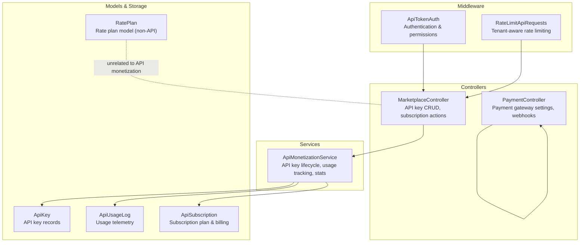
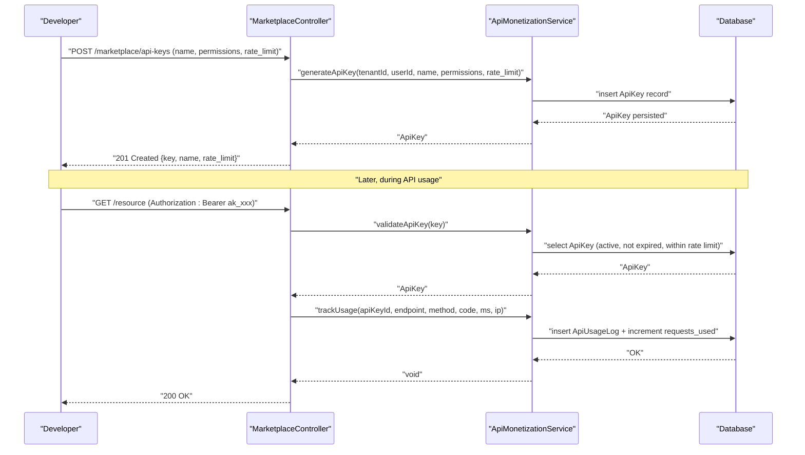
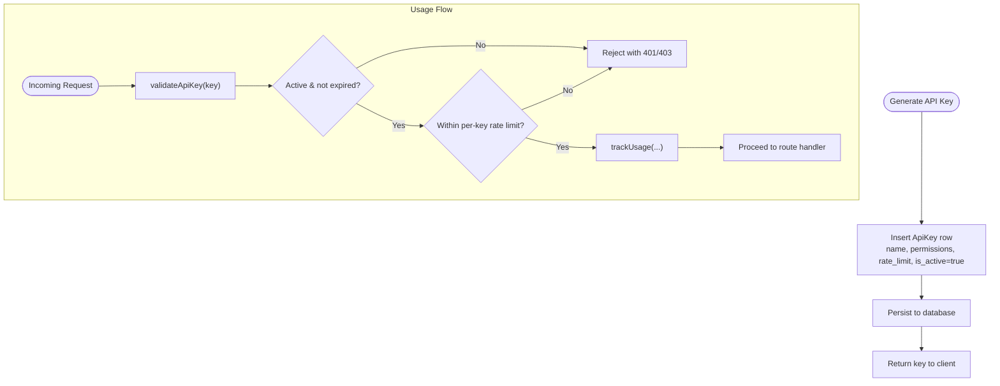
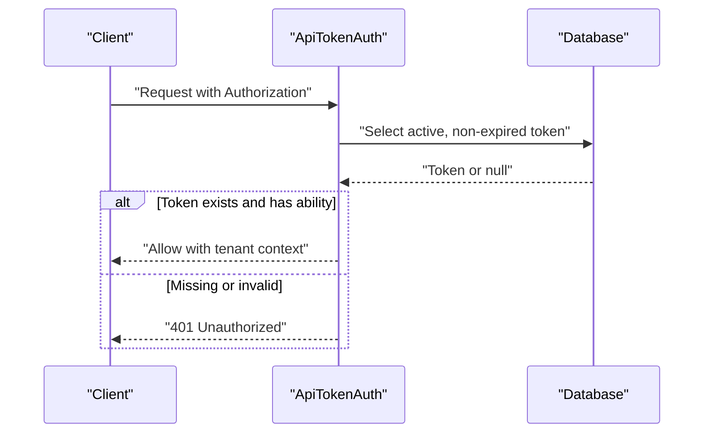
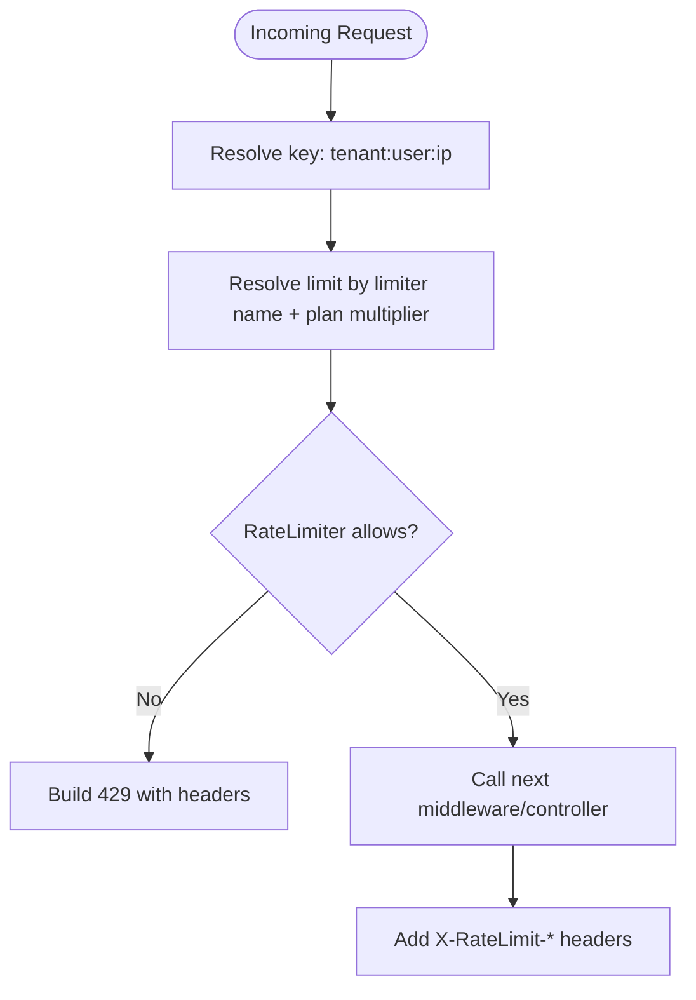
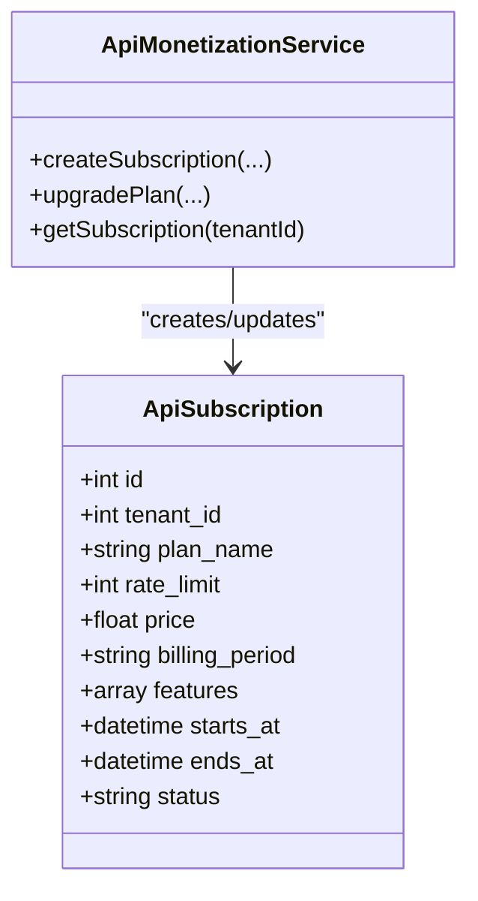
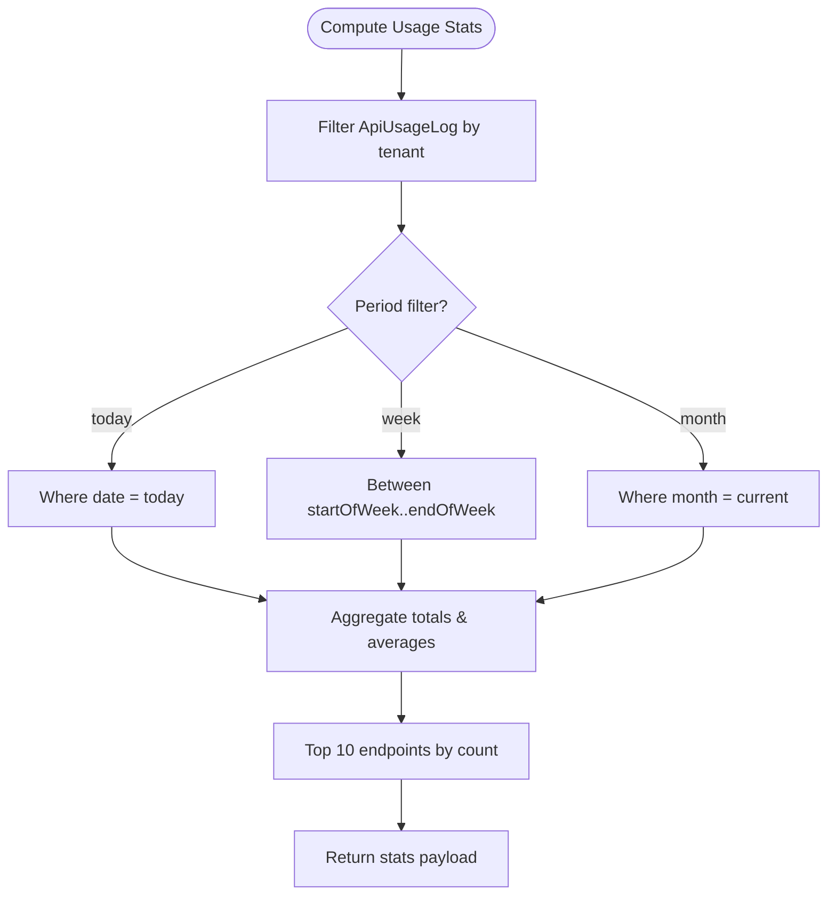
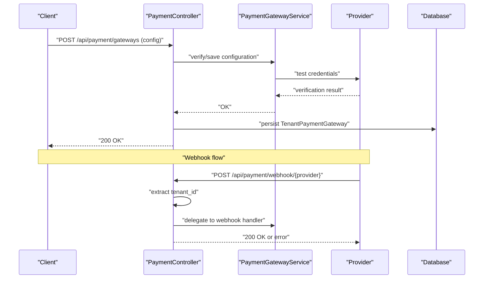
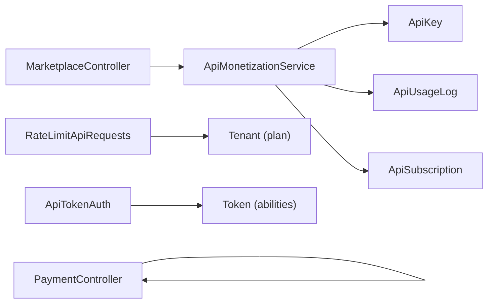

# API Monetization

<cite>
**Referenced Files in This Document**
- [ApiMonetizationService.php](file://app/Services/Marketplace/ApiMonetizationService.php)
- [MarketplaceController.php](file://app/Http/Controllers/Marketplace/MarketplaceController.php)
- [RateLimitApiRequests.php](file://app/Http/Middleware/RateLimitApiRequests.php)
- [ApiTokenAuth.php](file://app/Http/Middleware/ApiTokenAuth.php)
- [2026_04_06_130000_create_marketplace_tables.php](file://database/migrations/2026_04_06_130000_create_marketplace_tables.php)
- [PaymentController.php](file://app/Http/Controllers/Api/PaymentController.php)
- [RatePlan.php](file://app/Models/RatePlan.php)
</cite>

## Table of Contents
1. [Introduction](#introduction)
2. [Project Structure](#project-structure)
3. [Core Components](#core-components)
4. [Architecture Overview](#architecture-overview)
5. [Detailed Component Analysis](#detailed-component-analysis)
6. [Dependency Analysis](#dependency-analysis)
7. [Performance Considerations](#performance-considerations)
8. [Troubleshooting Guide](#troubleshooting-guide)
9. [Conclusion](#conclusion)
10. [Appendices](#appendices)

## Introduction
This document describes the API Monetization system implemented in the codebase. It covers the complete lifecycle of API keys, including generation, permission scoping, rate limiting configuration, and usage tracking. It also documents the subscription and pricing model, billing integration, and operational dashboards for monitoring. Finally, it outlines security measures, authentication protocols, and compliance-relevant controls for commercial API usage.

## Project Structure
The API Monetization system spans services, controllers, middleware, and database migrations. The following diagram shows how these pieces fit together.

**Diagram sources**
- [MarketplaceController.php:523-653](file://app/Http/Controllers/Marketplace/MarketplaceController.php#L523-L653)
- [ApiMonetizationService.php:10-187](file://app/Services/Marketplace/ApiMonetizationService.php#L10-L187)
- [RateLimitApiRequests.php:22-161](file://app/Http/Middleware/RateLimitApiRequests.php#L22-L161)
- [ApiTokenAuth.php:10-71](file://app/Http/Middleware/ApiTokenAuth.php#L10-L71)
- [2026_04_06_130000_create_marketplace_tables.php:205-234](file://database/migrations/2026_04_06_130000_create_marketplace_tables.php#L205-L234)
- [RatePlan.php:13-240](file://app/Models/RatePlan.php#L13-L240)

**Section sources**
- [MarketplaceController.php:523-653](file://app/Http/Controllers/Marketplace/MarketplaceController.php#L523-L653)
- [ApiMonetizationService.php:10-187](file://app/Services/Marketplace/ApiMonetizationService.php#L10-L187)
- [RateLimitApiRequests.php:22-161](file://app/Http/Middleware/RateLimitApiRequests.php#L22-L161)
- [ApiTokenAuth.php:10-71](file://app/Http/Middleware/ApiTokenAuth.php#L10-L71)
- [2026_04_06_130000_create_marketplace_tables.php:205-234](file://database/migrations/2026_04_06_130000_create_marketplace_tables.php#L205-L234)
- [RatePlan.php:13-240](file://app/Models/RatePlan.php#L13-L240)

## Core Components
- API key lifecycle and usage tracking are handled by the monetization service and controller.
- Rate limiting is enforced via middleware with plan-based multipliers.
- Payment gateway configuration and webhooks are managed by the payment controller.
- Database schema defines API keys, usage logs, and subscriptions.

Key capabilities:
- Generate API keys with name, permissions, and rate limit.
- Validate keys, enforce per-key rate limits, and track usage.
- Create and upgrade subscriptions with plan tiers and billing periods.
- Compute usage analytics and top endpoints.
- Enforce tenant-scoped rate limits with standardized headers.

**Section sources**
- [ApiMonetizationService.php:10-187](file://app/Services/Marketplace/ApiMonetizationService.php#L10-L187)
- [MarketplaceController.php:523-653](file://app/Http/Controllers/Marketplace/MarketplaceController.php#L523-L653)
- [RateLimitApiRequests.php:22-161](file://app/Http/Middleware/RateLimitApiRequests.php#L22-L161)
- [PaymentController.php:14-287](file://app/Http/Controllers/Api/PaymentController.php#L14-L287)
- [2026_04_06_130000_create_marketplace_tables.php:205-234](file://database/migrations/2026_04_06_130000_create_marketplace_tables.php#L205-L234)

## Architecture Overview
The monetization flow integrates controllers, services, middleware, and persistence.

**Diagram sources**
- [MarketplaceController.php:523-547](file://app/Http/Controllers/Marketplace/MarketplaceController.php#L523-L547)
- [ApiMonetizationService.php:15-71](file://app/Services/Marketplace/ApiMonetizationService.php#L15-L71)
- [2026_04_06_130000_create_marketplace_tables.php:205-234](file://database/migrations/2026_04_06_130000_create_marketplace_tables.php#L205-L234)

## Detailed Component Analysis

### API Key Generation and Lifecycle
- Generation: Keys receive a stable prefix and random suffix, with optional permissions and rate limit. They are created active by default.
- Validation: Checks active state, expiration, and per-key request quota.
- Usage tracking: Logs endpoint, method, response code/time, and increments counters; updates last-used timestamp.
- Revocation: Deactivates keys by setting active=false.

**Diagram sources**
- [ApiMonetizationService.php:15-91](file://app/Services/Marketplace/ApiMonetizationService.php#L15-L91)
- [2026_04_06_130000_create_marketplace_tables.php:205-234](file://database/migrations/2026_04_06_130000_create_marketplace_tables.php#L205-L234)

**Section sources**
- [ApiMonetizationService.php:15-91](file://app/Services/Marketplace/ApiMonetizationService.php#L15-L91)
- [MarketplaceController.php:523-590](file://app/Http/Controllers/Marketplace/MarketplaceController.php#L523-L590)
- [2026_04_06_130000_create_marketplace_tables.php:205-234](file://database/migrations/2026_04_06_130000_create_marketplace_tables.php#L205-L234)

### Permission Scoping and Authentication
- Authentication middleware supports bearer tokens and header/query fallbacks, filters inactive/expired tokens at the database level, and attaches tenant context.
- Permissions are enforced via ability checks on tokens.
- For API key-based flows documented here, the service validates keys and quotas; the middleware example demonstrates token-based auth patterns.

**Diagram sources**
- [ApiTokenAuth.php:10-71](file://app/Http/Middleware/ApiTokenAuth.php#L10-L71)

**Section sources**
- [ApiTokenAuth.php:10-71](file://app/Http/Middleware/ApiTokenAuth.php#L10-L71)

### Rate Limiting Configuration and Enforcement
- Tenant-aware rate limiting keyed by tenant, user, or IP depending on authentication context.
- Plan multipliers increase limits for higher tiers.
- Standardized headers expose limit and remaining counts; 429 responses include retry-after.

**Diagram sources**
- [RateLimitApiRequests.php:22-161](file://app/Http/Middleware/RateLimitApiRequests.php#L22-L161)

**Section sources**
- [RateLimitApiRequests.php:22-161](file://app/Http/Middleware/RateLimitApiRequests.php#L22-L161)

### Subscription and Pricing Model
- Subscriptions define plan name, rate limit, price, billing period, features, and validity windows.
- Upgrades update plan metadata and propagate new rate limits to all tenant API keys.
- The service exposes helpers to retrieve current active subscription.

**Diagram sources**
- [ApiMonetizationService.php:96-186](file://app/Services/Marketplace/ApiMonetizationService.php#L96-L186)
- [2026_04_06_130000_create_marketplace_tables.php:230-240](file://database/migrations/2026_04_06_130000_create_marketplace_tables.php#L230-L240)

**Section sources**
- [ApiMonetizationService.php:96-186](file://app/Services/Marketplace/ApiMonetizationService.php#L96-L186)
- [MarketplaceController.php:611-653](file://app/Http/Controllers/Marketplace/MarketplaceController.php#L611-L653)
- [2026_04_06_130000_create_marketplace_tables.php:230-240](file://database/migrations/2026_04_06_130000_create_marketplace_tables.php#L230-L240)

### Usage Analytics and Dashboards
- Usage logs capture endpoint, method, response code, response time, and IP.
- The service computes total requests, average response time, error count/rate, and top endpoints by period (today, week, month).
- These metrics enable dashboard-style reporting for developers and admins.

**Diagram sources**
- [ApiMonetizationService.php:142-175](file://app/Services/Marketplace/ApiMonetizationService.php#L142-L175)
- [2026_04_06_130000_create_marketplace_tables.php:216-228](file://database/migrations/2026_04_06_130000_create_marketplace_tables.php#L216-L228)

**Section sources**
- [ApiMonetizationService.php:142-175](file://app/Services/Marketplace/ApiMonetizationService.php#L142-L175)
- [2026_04_06_130000_create_marketplace_tables.php:216-228](file://database/migrations/2026_04_06_130000_create_marketplace_tables.php#L216-L228)

### Billing Integration and Payment Processing
- Payment controller manages gateway configurations, testing, toggling, and webhook handling.
- Supports multiple providers and hides sensitive credentials in responses.
- Webhooks extract tenant context and delegate to a webhook handler service.

**Diagram sources**
- [PaymentController.php:14-287](file://app/Http/Controllers/Api/PaymentController.php#L14-L287)

**Section sources**
- [PaymentController.php:14-287](file://app/Http/Controllers/Api/PaymentController.php#L14-L287)

### API Documentation Portal, Sandbox, and Developer Onboarding
- The repository includes a public API documentation area under the public folder, indicating a built-in documentation portal for APIs.
- While explicit sandbox environment endpoints are not present in the examined files, the presence of a documentation portal and payment gateway configuration UI suggests a developer-focused platform suitable for onboarding and sandbox experimentation.

[No sources needed since this section highlights existing assets without analyzing specific files]

## Dependency Analysis
The monetization service depends on three core entities: ApiKey, ApiUsageLog, and ApiSubscription. Middleware depends on tenant context resolution and plan multipliers. Controllers orchestrate service calls and persist results.

**Diagram sources**
- [MarketplaceController.php:523-653](file://app/Http/Controllers/Marketplace/MarketplaceController.php#L523-L653)
- [ApiMonetizationService.php:10-187](file://app/Services/Marketplace/ApiMonetizationService.php#L10-L187)
- [RateLimitApiRequests.php:93-117](file://app/Http/Middleware/RateLimitApiRequests.php#L93-L117)
- [ApiTokenAuth.php:10-71](file://app/Http/Middleware/ApiTokenAuth.php#L10-L71)
- [2026_04_06_130000_create_marketplace_tables.php:205-234](file://database/migrations/2026_04_06_130000_create_marketplace_tables.php#L205-L234)

**Section sources**
- [ApiMonetizationService.php:10-187](file://app/Services/Marketplace/ApiMonetizationService.php#L10-L187)
- [RateLimitApiRequests.php:93-117](file://app/Http/Middleware/RateLimitApiRequests.php#L93-L117)
- [ApiTokenAuth.php:10-71](file://app/Http/Middleware/ApiTokenAuth.php#L10-L71)
- [2026_04_06_130000_create_marketplace_tables.php:205-234](file://database/migrations/2026_04_06_130000_create_marketplace_tables.php#L205-L234)

## Performance Considerations
- Per-key hourly reset: The service resets usage counters when crossing an hour boundary, preventing unbounded growth of per-key counters.
- Database indexing: ApiKey and ApiUsageLog tables include indexes on tenant+active and api_key_id+timestamp respectively, supporting efficient queries.
- Tenant-scoped rate limiting: Using tenant IDs in rate limiter keys ensures fair allocation across tenants and reduces contention.
- Middleware overhead: Rate limiting and token validation occur early in the pipeline; keep limiter names concise and avoid excessive branching.

[No sources needed since this section provides general guidance]

## Troubleshooting Guide
Common issues and remedies:
- Invalid or expired API key: Validation rejects inactive or expired keys and per-key quota breaches. Ensure keys are active and within rate limits.
- Insufficient permissions: Token-based auth denies requests when abilities are missing; verify token scopes.
- Rate limit exceeded: Responses include standardized headers and retry-after guidance; adjust plan or reduce request volume.
- Payment gateway misconfiguration: Use the payment controller’s test endpoint to validate provider credentials and environment settings.

**Section sources**
- [ApiMonetizationService.php:31-52](file://app/Services/Marketplace/ApiMonetizationService.php#L31-L52)
- [ApiTokenAuth.php:32-59](file://app/Http/Middleware/ApiTokenAuth.php#L32-L59)
- [RateLimitApiRequests.php:132-159](file://app/Http/Middleware/RateLimitApiRequests.php#L132-L159)
- [PaymentController.php:215-225](file://app/Http/Controllers/Api/PaymentController.php#L215-L225)

## Conclusion
The API Monetization system provides a robust foundation for issuing and managing API keys, enforcing rate limits, tracking usage, and integrating billing. The service-driven architecture cleanly separates concerns, while middleware and controllers ensure consistent enforcement and developer-friendly operations. Extending support for enterprise licensing, usage-based billing, and sandbox environments would complete the commercial API platform.

[No sources needed since this section summarizes without analyzing specific files]

## Appendices

### API Key Schema and Usage Telemetry
- ApiKey fields include tenant/user associations, key value, name, permissions, rate limit, expiration, activity flag, usage counters, and timestamps.
- ApiUsageLog captures endpoint, method, response code, response time, and IP address with indexed keys for efficient analytics.

**Section sources**
- [2026_04_06_130000_create_marketplace_tables.php:205-234](file://database/migrations/2026_04_06_130000_create_marketplace_tables.php#L205-L234)

### Non-API Rate Plan Model
- The RatePlan model supports hotel/hospitality pricing and is unrelated to API monetization. It demonstrates rate calculation and validity checks for non-API use cases.

**Section sources**
- [RatePlan.php:13-240](file://app/Models/RatePlan.php#L13-L240)