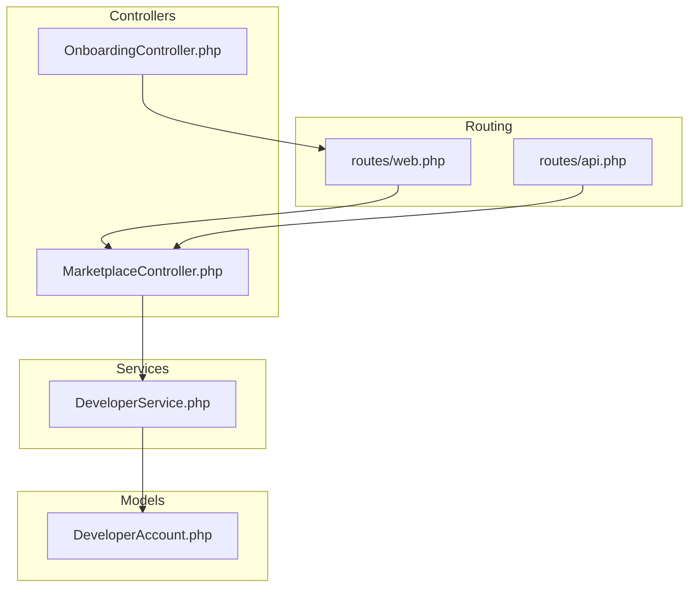
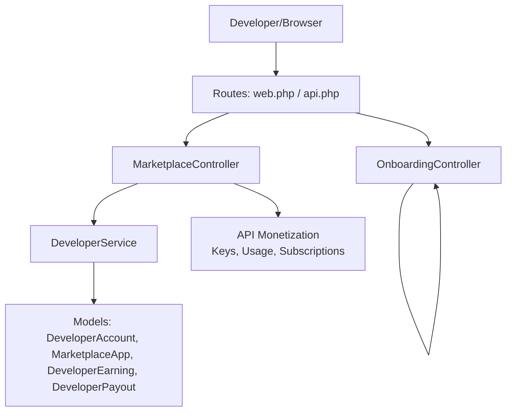
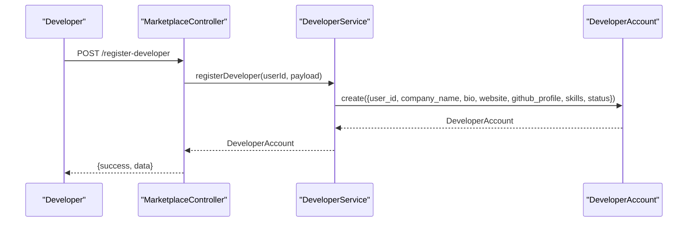
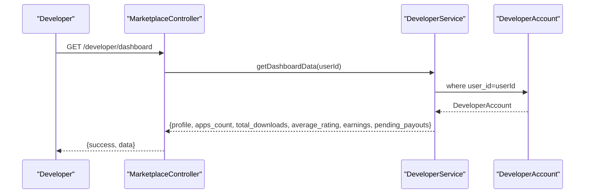
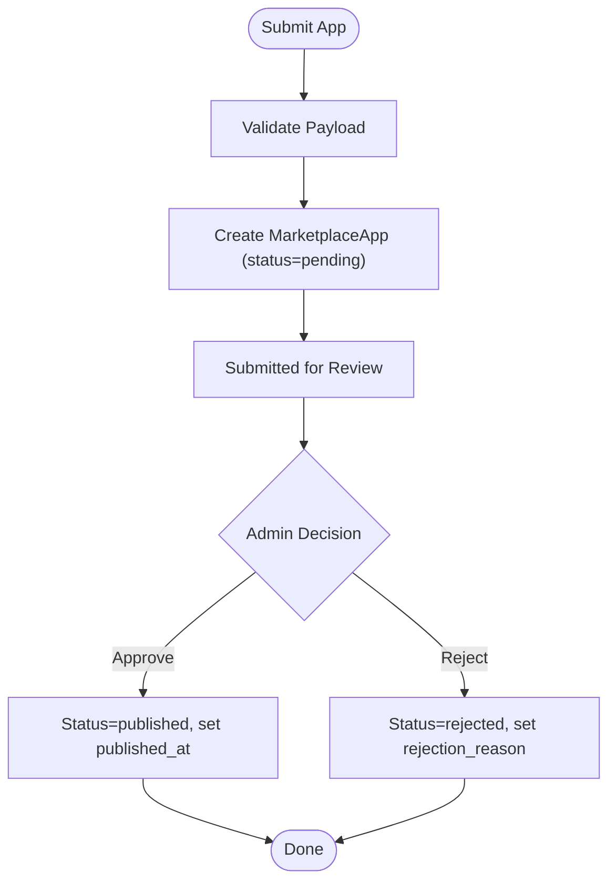
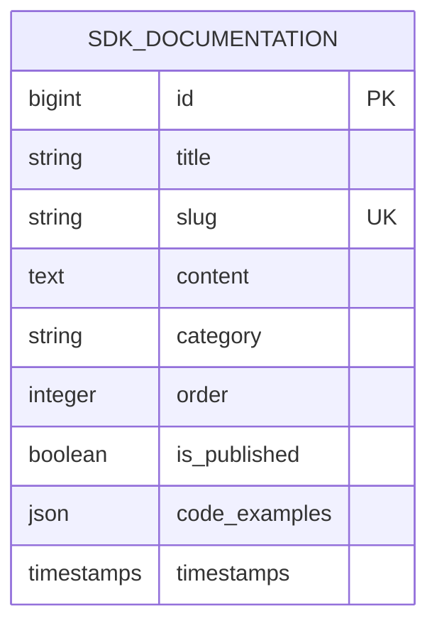
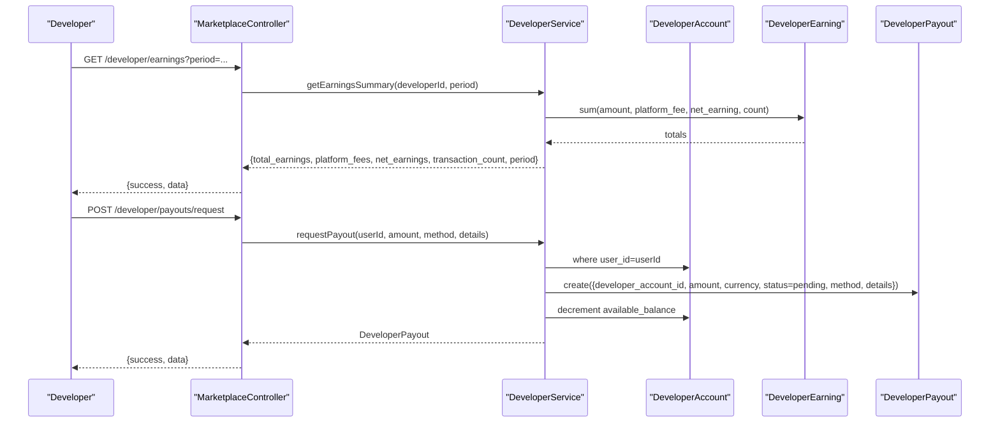
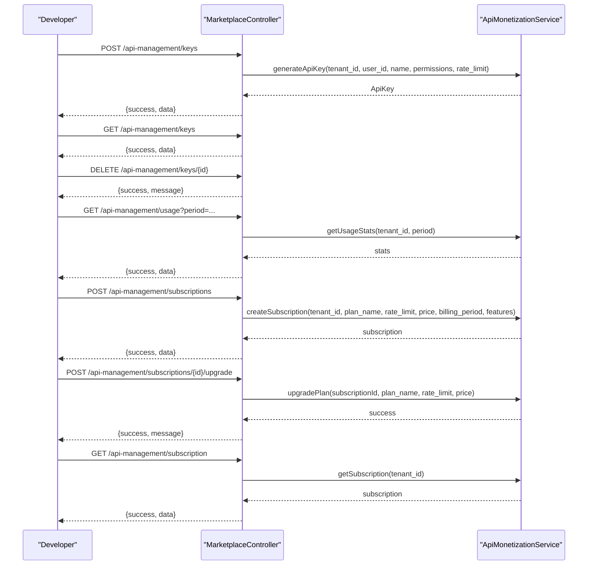
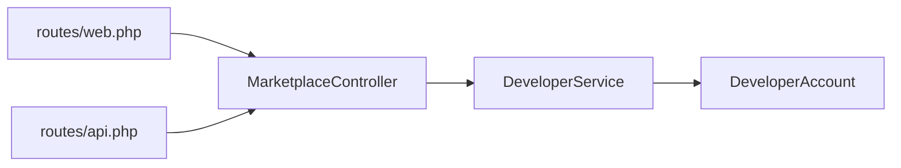

# Developer Onboarding & Portal

<cite>
**Referenced Files in This Document**
- [routes/web.php](file://routes/web.php)
- [routes/api.php](file://routes/api.php)
- [app/Http/Controllers/OnboardingController.php](file://app/Http/Controllers/OnboardingController.php)
- [app/Http/Controllers/Marketplace/MarketplaceController.php](file://app/Http/Controllers/Marketplace/MarketplaceController.php)
- [app/Services/Marketplace/DeveloperService.php](file://app/Services/Marketplace/DeveloperService.php)
- [app/Models/DeveloperAccount.php](file://app/Models/DeveloperAccount.php)
- [database/migrations/2026_04_06_130000_create_marketplace_tables.php](file://database/migrations/2026_04_06_130000_create_marketplace_tables.php)
</cite>

## Table of Contents
1. [Introduction](#introduction)
2. [Project Structure](#project-structure)
3. [Core Components](#core-components)
4. [Architecture Overview](#architecture-overview)
5. [Detailed Component Analysis](#detailed-component-analysis)
6. [Dependency Analysis](#dependency-analysis)
7. [Performance Considerations](#performance-considerations)
8. [Troubleshooting Guide](#troubleshooting-guide)
9. [Conclusion](#conclusion)
10. [Appendices](#appendices)

## Introduction
This document describes the Developer Onboarding and Portal system within the platform. It covers the developer registration and verification workflows, account setup, the developer dashboard, application submission and approval workflows, API monetization and sandbox usage, earnings tracking and payout management, and integration guidelines. It also provides step-by-step guides for new developers, common integration patterns, and troubleshooting advice.

## Project Structure
The Developer Portal spans routing, controllers, services, models, and database migrations. Key areas include:
- Onboarding routes and controller for initial setup
- Marketplace routes and controller for developer features
- Developer service orchestrating app lifecycle and financial flows
- Developer account model and related marketplace entities
- API monetization routes and endpoints for sandbox and subscriptions

**Diagram sources**
- [routes/web.php:2950-2960](file://routes/web.php#L2950-L2960)
- [routes/api.php:1-200](file://routes/api.php#L1-L200)
- [app/Http/Controllers/OnboardingController.php:1-362](file://app/Http/Controllers/OnboardingController.php#L1-L362)
- [app/Http/Controllers/Marketplace/MarketplaceController.php:1-673](file://app/Http/Controllers/Marketplace/MarketplaceController.php#L1-L673)
- [app/Services/Marketplace/DeveloperService.php:1-270](file://app/Services/Marketplace/DeveloperService.php#L1-L270)
- [app/Models/DeveloperAccount.php:1-50](file://app/Models/DeveloperAccount.php#L1-L50)

**Section sources**
- [routes/web.php:2950-2960](file://routes/web.php#L2950-L2960)
- [routes/api.php:1-200](file://routes/api.php#L1-L200)
- [app/Http/Controllers/OnboardingController.php:1-362](file://app/Http/Controllers/OnboardingController.php#L1-L362)
- [app/Http/Controllers/Marketplace/MarketplaceController.php:1-673](file://app/Http/Controllers/Marketplace/MarketplaceController.php#L1-L673)
- [app/Services/Marketplace/DeveloperService.php:1-270](file://app/Services/Marketplace/DeveloperService.php#L1-L270)
- [app/Models/DeveloperAccount.php:1-50](file://app/Models/DeveloperAccount.php#L1-L50)

## Core Components
- OnboardingController: Guides new users through industry selection, sample data generation, and step completion. Provides progress tracking and tips.
- MarketplaceController: Central developer portal endpoint hub for registration, app submission/approval, dashboard, earnings, payouts, API key management, and subscriptions.
- DeveloperService: Implements developer account creation, app lifecycle (submit/update/submit-for-review/approve/reject), earnings aggregation, and payout requests/processes.
- DeveloperAccount model: Represents a developer’s profile and links to apps, earnings, and payouts.
- API routes: Provide API key generation, listing, revocation, usage stats, and subscription management for monetizing APIs.

**Section sources**
- [app/Http/Controllers/OnboardingController.php:1-362](file://app/Http/Controllers/OnboardingController.php#L1-L362)
- [app/Http/Controllers/Marketplace/MarketplaceController.php:1-673](file://app/Http/Controllers/Marketplace/MarketplaceController.php#L1-L673)
- [app/Services/Marketplace/DeveloperService.php:1-270](file://app/Services/Marketplace/DeveloperService.php#L1-L270)
- [app/Models/DeveloperAccount.php:1-50](file://app/Models/DeveloperAccount.php#L1-L50)
- [routes/web.php:2950-2960](file://routes/web.php#L2950-L2960)
- [routes/api.php:1-200](file://routes/api.php#L1-L200)

## Architecture Overview
The Developer Portal follows a layered architecture:
- Routing defines public and authenticated endpoints for developer features and API monetization.
- Controllers orchestrate requests and delegate to services.
- Services encapsulate business logic for developer accounts, app lifecycle, earnings, and payouts.
- Models define relationships and persistence for developer profiles, apps, earnings, and payouts.
- Database migrations define schema for marketplace and documentation entities.

**Diagram sources**
- [routes/web.php:2950-2960](file://routes/web.php#L2950-L2960)
- [routes/api.php:1-200](file://routes/api.php#L1-L200)
- [app/Http/Controllers/Marketplace/MarketplaceController.php:1-673](file://app/Http/Controllers/Marketplace/MarketplaceController.php#L1-L673)
- [app/Http/Controllers/OnboardingController.php:1-362](file://app/Http/Controllers/OnboardingController.php#L1-L362)
- [app/Services/Marketplace/DeveloperService.php:1-270](file://app/Services/Marketplace/DeveloperService.php#L1-L270)
- [app/Models/DeveloperAccount.php:1-50](file://app/Models/DeveloperAccount.php#L1-L50)

## Detailed Component Analysis

### Developer Registration and Verification Workflows
- Registration: Developers register via the developer portal controller, which delegates to DeveloperService to create a DeveloperAccount linked to the authenticated user.
- Verification and Onboarding: After email verification, users are redirected to onboarding. The OnboardingController manages industry selection, sample data generation, and step completion. Progress is tracked per tenant and user.

**Diagram sources**
- [app/Http/Controllers/Marketplace/MarketplaceController.php:150-166](file://app/Http/Controllers/Marketplace/MarketplaceController.php#L150-L166)
- [app/Services/Marketplace/DeveloperService.php:16-27](file://app/Services/Marketplace/DeveloperService.php#L16-L27)
- [app/Models/DeveloperAccount.php:12-31](file://app/Models/DeveloperAccount.php#L12-L31)

**Section sources**
- [app/Http/Controllers/Marketplace/MarketplaceController.php:150-166](file://app/Http/Controllers/Marketplace/MarketplaceController.php#L150-L166)
- [app/Services/Marketplace/DeveloperService.php:16-27](file://app/Services/Marketplace/DeveloperService.php#L16-L27)
- [app/Models/DeveloperAccount.php:12-31](file://app/Models/DeveloperAccount.php#L12-L31)
- [app/Http/Controllers/OnboardingController.php:53-91](file://app/Http/Controllers/OnboardingController.php#L53-L91)

### Developer Dashboard and Account Setup
- Dashboard data: The developer dashboard aggregates profile, app counts, total downloads, average rating, earnings summary, and pending payouts.
- Account setup: Profiles include company info, bio, website, GitHub profile, and skills. Status remains active upon registration.

**Diagram sources**
- [app/Http/Controllers/Marketplace/MarketplaceController.php:322-330](file://app/Http/Controllers/Marketplace/MarketplaceController.php#L322-L330)
- [app/Services/Marketplace/DeveloperService.php:252-268](file://app/Services/Marketplace/DeveloperService.php#L252-L268)
- [app/Models/DeveloperAccount.php:33-48](file://app/Models/DeveloperAccount.php#L33-L48)

**Section sources**
- [app/Http/Controllers/Marketplace/MarketplaceController.php:322-330](file://app/Http/Controllers/Marketplace/MarketplaceController.php#L322-L330)
- [app/Services/Marketplace/DeveloperService.php:252-268](file://app/Services/Marketplace/DeveloperService.php#L252-L268)
- [app/Models/DeveloperAccount.php:33-48](file://app/Models/DeveloperAccount.php#L33-L48)

### Application Submission and Approval Workflows
- Submission: Developers submit apps with metadata (name, description, category, pricing, screenshots, links). A unique slug is generated and status initialized to pending.
- Review and Approval: Admins can approve or reject apps with a reason. Approved apps are published with a publication timestamp.

**Diagram sources**
- [app/Http/Controllers/Marketplace/MarketplaceController.php:171-198](file://app/Http/Controllers/Marketplace/MarketplaceController.php#L171-L198)
- [app/Services/Marketplace/DeveloperService.php:32-62](file://app/Services/Marketplace/DeveloperService.php#L32-L62)
- [app/Services/Marketplace/DeveloperService.php:107-125](file://app/Services/Marketplace/DeveloperService.php#L107-L125)
- [app/Services/Marketplace/DeveloperService.php:129-148](file://app/Services/Marketplace/DeveloperService.php#L129-L148)

**Section sources**
- [app/Http/Controllers/Marketplace/MarketplaceController.php:171-198](file://app/Http/Controllers/Marketplace/MarketplaceController.php#L171-L198)
- [app/Services/Marketplace/DeveloperService.php:32-62](file://app/Services/Marketplace/DeveloperService.php#L32-L62)
- [app/Services/Marketplace/DeveloperService.php:107-125](file://app/Services/Marketplace/DeveloperService.php#L107-L125)
- [app/Services/Marketplace/DeveloperService.php:129-148](file://app/Services/Marketplace/DeveloperService.php#L129-L148)

### API Documentation Portal, Sandbox Environments, and Testing Resources
- API Documentation: The marketplace schema includes an sdk_documentation table with fields for title, slug, content, category, order, publish status, and code examples. This supports a documentation portal for SDKs and integration guides.
- Sandbox and Testing: API monetization endpoints enable generating keys, listing keys, revoking keys, viewing usage stats, subscribing to plans, upgrading plans, and retrieving current subscription. These support sandbox testing and controlled access.

**Diagram sources**
- [database/migrations/2026_04_06_130000_create_marketplace_tables.php:246-259](file://database/migrations/2026_04_06_130000_create_marketplace_tables.php#L246-L259)

**Section sources**
- [routes/web.php:2950-2960](file://routes/web.php#L2950-L2960)
- [routes/api.php:1-200](file://routes/api.php#L1-L200)
- [database/migrations/2026_04_06_130000_create_marketplace_tables.php:246-259](file://database/migrations/2026_04_06_130000_create_marketplace_tables.php#L246-L259)

### Developer Earnings Tracking and Payout Management
- Earnings Summary: Aggregates total earnings, platform fees, net earnings, and transaction count by period (all-time, this month, last month, this year).
- Payout Request: Validates sufficient balance and creates a payout request with method and details, deducting from available balance.
- Payout Processing (Admin): Marks payout as completed and updates related earnings to paid.

**Diagram sources**
- [app/Http/Controllers/Marketplace/MarketplaceController.php:270-303](file://app/Http/Controllers/Marketplace/MarketplaceController.php#L270-L303)
- [app/Services/Marketplace/DeveloperService.php:164-192](file://app/Services/Marketplace/DeveloperService.php#L164-L192)
- [app/Services/Marketplace/DeveloperService.php:197-218](file://app/Services/Marketplace/DeveloperService.php#L197-L218)
- [app/Models/DeveloperAccount.php:19-31](file://app/Models/DeveloperAccount.php#L19-L31)

**Section sources**
- [app/Http/Controllers/Marketplace/MarketplaceController.php:270-303](file://app/Http/Controllers/Marketplace/MarketplaceController.php#L270-L303)
- [app/Services/Marketplace/DeveloperService.php:164-192](file://app/Services/Marketplace/DeveloperService.php#L164-L192)
- [app/Services/Marketplace/DeveloperService.php:197-218](file://app/Services/Marketplace/DeveloperService.php#L197-L218)
- [app/Models/DeveloperAccount.php:19-31](file://app/Models/DeveloperAccount.php#L19-L31)

### API Monetization and Subscription Management
- Keys: Generate, list, and revoke API keys scoped to a tenant. Keys carry rate limits and permissions.
- Usage: Retrieve usage statistics for a tenant.
- Subscriptions: Create and upgrade subscriptions with plan name, rate limit, price, billing period, and features.

**Diagram sources**
- [app/Http/Controllers/Marketplace/MarketplaceController.php:522-671](file://app/Http/Controllers/Marketplace/MarketplaceController.php#L522-L671)
- [routes/web.php:2950-2960](file://routes/web.php#L2950-L2960)
- [routes/api.php:1-200](file://routes/api.php#L1-L200)

**Section sources**
- [app/Http/Controllers/Marketplace/MarketplaceController.php:522-671](file://app/Http/Controllers/Marketplace/MarketplaceController.php#L522-L671)
- [routes/web.php:2950-2960](file://routes/web.php#L2950-L2960)
- [routes/api.php:1-200](file://routes/api.php#L1-L200)

### Integration Guidelines, SDK Usage, and Best Practices
- SDK Documentation: Use the sdk_documentation table to organize guides by categories (getting started, authentication, endpoints, examples). Ensure slugs are unique and content is structured for discoverability.
- API Keys and Permissions: Assign appropriate permissions and rate limits per integration. Rotate and revoke keys as needed.
- Sandbox Testing: Utilize subscription tiers and usage stats to test integrations under realistic load limits.
- Best Practices:
  - Validate inputs on submission.
  - Use unique slugs for apps and documentation entries.
  - Track earnings and payouts consistently.
  - Keep documentation updated and categorized.

**Section sources**
- [database/migrations/2026_04_06_130000_create_marketplace_tables.php:246-259](file://database/migrations/2026_04_06_130000_create_marketplace_tables.php#L246-L259)
- [app/Http/Controllers/Marketplace/MarketplaceController.php:522-671](file://app/Http/Controllers/Marketplace/MarketplaceController.php#L522-L671)

### Step-by-Step Guides for New Developers
- Complete Profile: Register as a developer and fill company name, bio, website, GitHub profile, and skills.
- Submit an App: Provide name, description, category, pricing model, screenshots, and links. Submit for review.
- Monitor Earnings: View earnings summaries by period and request payouts when eligible.
- Manage API Keys: Generate keys with permissions and rate limits, monitor usage, and manage subscriptions.

**Section sources**
- [app/Http/Controllers/Marketplace/MarketplaceController.php:150-166](file://app/Http/Controllers/Marketplace/MarketplaceController.php#L150-L166)
- [app/Http/Controllers/Marketplace/MarketplaceController.php:171-198](file://app/Http/Controllers/Marketplace/MarketplaceController.php#L171-L198)
- [app/Http/Controllers/Marketplace/MarketplaceController.php:270-303](file://app/Http/Controllers/Marketplace/MarketplaceController.php#L270-L303)
- [app/Http/Controllers/Marketplace/MarketplaceController.php:522-671](file://app/Http/Controllers/Marketplace/MarketplaceController.php#L522-L671)

### Common Integration Patterns
- App Submission Pipeline: Validate → Create → Submit for Review → Admin Decision → Publish/Reject.
- API Key Lifecycle: Generate → Use → Monitor → Revoke.
- Earnings and Payouts: Aggregate → Request → Process → Mark Paid.

**Section sources**
- [app/Services/Marketplace/DeveloperService.php:32-62](file://app/Services/Marketplace/DeveloperService.php#L32-L62)
- [app/Services/Marketplace/DeveloperService.php:107-148](file://app/Services/Marketplace/DeveloperService.php#L107-L148)
- [app/Services/Marketplace/DeveloperService.php:197-218](file://app/Services/Marketplace/DeveloperService.php#L197-L218)

## Dependency Analysis
The developer portal components depend on each other as follows:
- MarketplaceController depends on DeveloperService for developer and app operations.
- DeveloperService depends on DeveloperAccount and related models for persistence.
- Routes define entry points for both web and API endpoints.

**Diagram sources**
- [routes/web.php:2950-2960](file://routes/web.php#L2950-L2960)
- [routes/api.php:1-200](file://routes/api.php#L1-L200)
- [app/Http/Controllers/Marketplace/MarketplaceController.php:1-673](file://app/Http/Controllers/Marketplace/MarketplaceController.php#L1-L673)
- [app/Services/Marketplace/DeveloperService.php:1-270](file://app/Services/Marketplace/DeveloperService.php#L1-L270)
- [app/Models/DeveloperAccount.php:1-50](file://app/Models/DeveloperAccount.php#L1-L50)

**Section sources**
- [routes/web.php:2950-2960](file://routes/web.php#L2950-L2960)
- [routes/api.php:1-200](file://routes/api.php#L1-L200)
- [app/Http/Controllers/Marketplace/MarketplaceController.php:1-673](file://app/Http/Controllers/Marketplace/MarketplaceController.php#L1-L673)
- [app/Services/Marketplace/DeveloperService.php:1-270](file://app/Services/Marketplace/DeveloperService.php#L1-L270)
- [app/Models/DeveloperAccount.php:1-50](file://app/Models/DeveloperAccount.php#L1-L50)

## Performance Considerations
- Indexing: Marketplace tables include indices on tenant_id/status combinations to speed up queries for active listings and subscriptions.
- Aggregation: Earnings summaries use targeted date-range filtering to avoid scanning entire histories.
- Rate Limits: API keys enforce rate limits; adjust per plan to prevent overload during sandbox testing.

[No sources needed since this section provides general guidance]

## Troubleshooting Guide
- Insufficient Balance for Payout: The service throws an exception if requested amount exceeds available balance. Verify earnings and payouts before requesting disbursements.
- App Approval Failures: Ensure app metadata is valid and slug uniqueness is handled. Confirm admin actions are executed correctly.
- API Key Issues: Validate permissions and rate limits. Revoke inactive keys and regenerate as needed.
- Usage Reporting: Confirm tenant scoping and period parameters for accurate usage stats.

**Section sources**
- [app/Services/Marketplace/DeveloperService.php:197-218](file://app/Services/Marketplace/DeveloperService.php#L197-L218)
- [app/Services/Marketplace/DeveloperService.php:32-62](file://app/Services/Marketplace/DeveloperService.php#L32-L62)
- [app/Http/Controllers/Marketplace/MarketplaceController.php:522-671](file://app/Http/Controllers/Marketplace/MarketplaceController.php#L522-L671)

## Conclusion
The Developer Onboarding and Portal system integrates onboarding, developer registration, app lifecycle management, API monetization, and financial tracking. The documented flows and components provide a clear blueprint for developers to register, build, test, and monetize their solutions while administrators manage approvals and payouts efficiently.

[No sources needed since this section summarizes without analyzing specific files]

## Appendices
- Additional Developer Resources: SDK documentation entries, categorized by topic, support URLs, and repository links are maintained alongside app metadata.

**Section sources**
- [database/migrations/2026_04_06_130000_create_marketplace_tables.php:246-259](file://database/migrations/2026_04_06_130000_create_marketplace_tables.php#L246-L259)