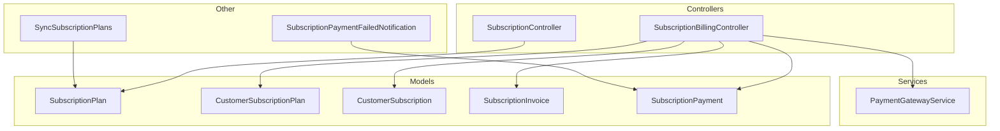
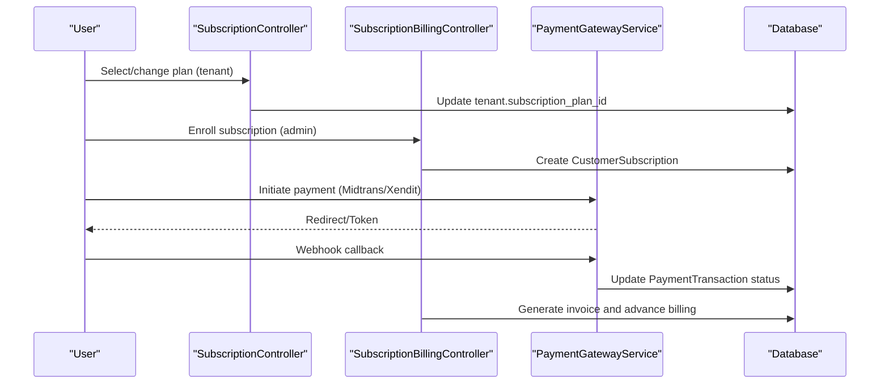
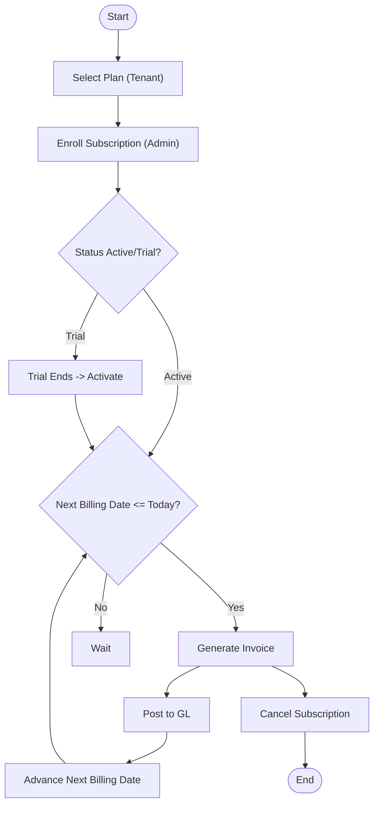
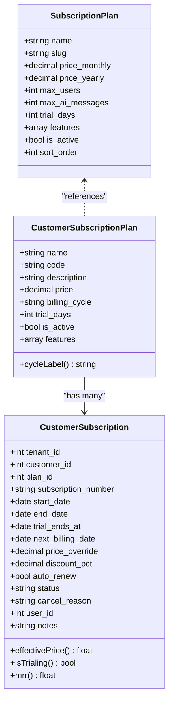
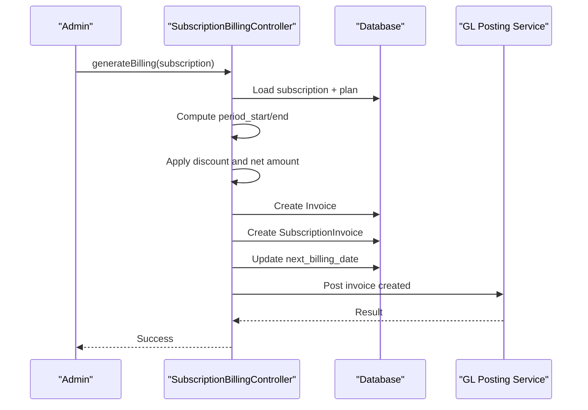
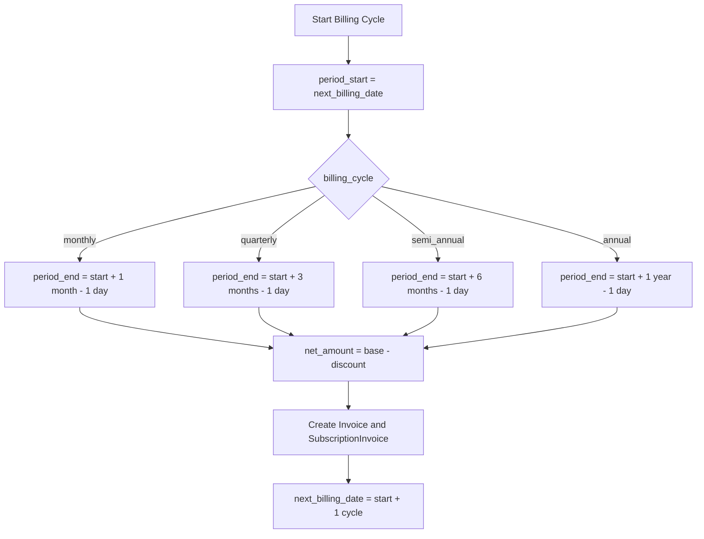
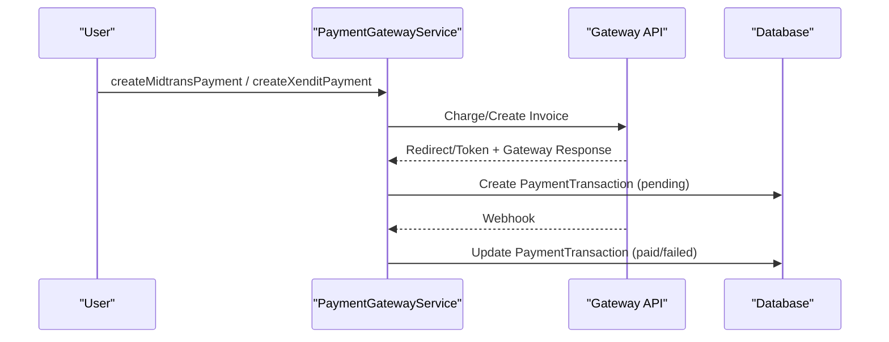
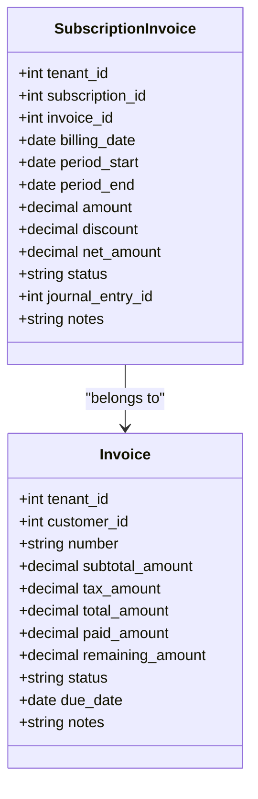
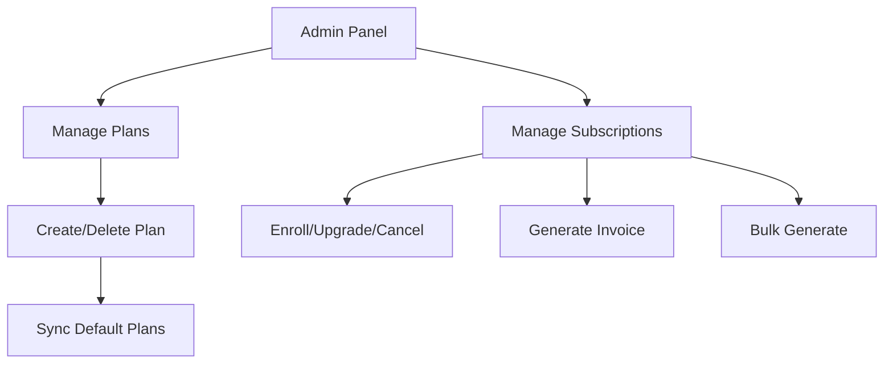
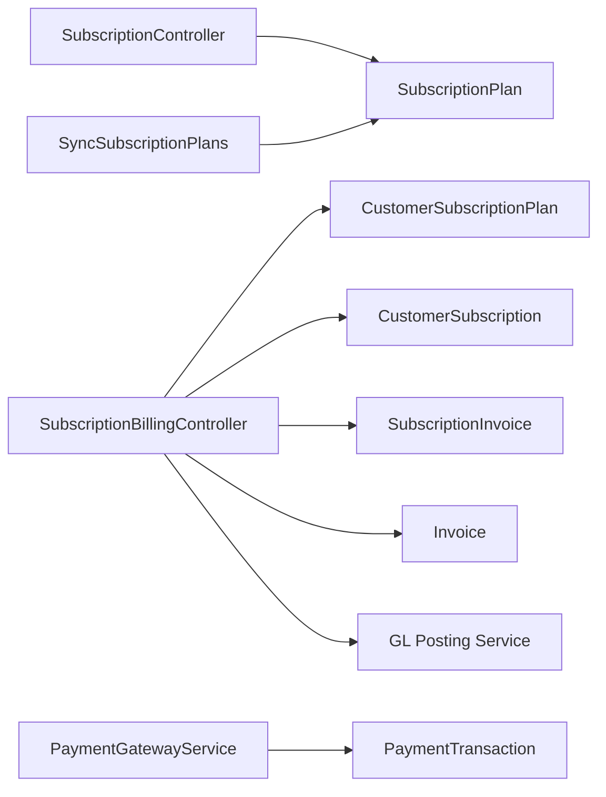

# Subscription & Billing

<cite>
**Referenced Files in This Document**
- [SubscriptionPlan.php](file://app/Models/SubscriptionPlan.php)
- [CustomerSubscriptionPlan.php](file://app/Models/CustomerSubscriptionPlan.php)
- [CustomerSubscription.php](file://app/Models/CustomerSubscription.php)
- [SubscriptionInvoice.php](file://app/Models/SubscriptionInvoice.php)
- [SubscriptionPayment.php](file://app/Models/SubscriptionPayment.php)
- [SubscriptionController.php](file://app/Http/Controllers/SubscriptionController.php)
- [SubscriptionBillingController.php](file://app/Http/Controllers/SubscriptionBillingController.php)
- [SyncSubscriptionPlans.php](file://app/Console/Commands/SyncSubscriptionPlans.php)
- [PaymentGatewayService.php](file://app/Services/Integrations/PaymentGatewayService.php)
- [SubscriptionPaymentFailedNotification.php](file://app/Notifications/SubscriptionPaymentFailedNotification.php)
</cite>

## Table of Contents
1. [Introduction](#introduction)
2. [Project Structure](#project-structure)
3. [Core Components](#core-components)
4. [Architecture Overview](#architecture-overview)
5. [Detailed Component Analysis](#detailed-component-analysis)
6. [Dependency Analysis](#dependency-analysis)
7. [Performance Considerations](#performance-considerations)
8. [Troubleshooting Guide](#troubleshooting-guide)
9. [Conclusion](#conclusion)
10. [Appendices](#appendices)

## Introduction
This document describes the Subscription and Billing system in the ERP. It covers the subscription lifecycle (plan selection, enrollment, upgrades, cancellations), the tiered pricing model with rate limits and features, billing cycles, payment processing integration, renewal workflows, proration and period calculations, billing history and invoice generation, payment method management, analytics and revenue tracking, usage-based billing scenarios, administrative controls, plan modifications, promotional pricing, and troubleshooting.

## Project Structure
The Subscription & Billing system spans models, controllers, services, notifications, and console commands:
- Models define domain entities: SubscriptionPlan, CustomerSubscriptionPlan, CustomerSubscription, SubscriptionInvoice, SubscriptionPayment.
- Controllers implement user/admin workflows: SubscriptionController (tenant plan selection) and SubscriptionBillingController (admin billing operations).
- Services integrate external payment gateways (Midtrans, Xendit).
- Notifications handle payment failure alerts.
- Console command synchronizes default plans.

**Diagram sources**
- [SubscriptionPlan.php:1-149](file://app/Models/SubscriptionPlan.php#L1-L149)
- [CustomerSubscriptionPlan.php:1-36](file://app/Models/CustomerSubscriptionPlan.php#L1-L36)
- [CustomerSubscription.php:1-70](file://app/Models/CustomerSubscription.php#L1-L70)
- [SubscriptionInvoice.php:1-36](file://app/Models/SubscriptionInvoice.php#L1-L36)
- [SubscriptionPayment.php:1-29](file://app/Models/SubscriptionPayment.php#L1-L29)
- [SubscriptionController.php:1-96](file://app/Http/Controllers/SubscriptionController.php#L1-L96)
- [SubscriptionBillingController.php:1-295](file://app/Http/Controllers/SubscriptionBillingController.php#L1-L295)
- [SyncSubscriptionPlans.php:1-41](file://app/Console/Commands/SyncSubscriptionPlans.php#L1-L41)
- [PaymentGatewayService.php:1-284](file://app/Services/Integrations/PaymentGatewayService.php#L1-L284)
- [SubscriptionPaymentFailedNotification.php:1-50](file://app/Notifications/SubscriptionPaymentFailedNotification.php#L1-L50)

**Section sources**
- [SubscriptionPlan.php:1-149](file://app/Models/SubscriptionPlan.php#L1-L149)
- [CustomerSubscriptionPlan.php:1-36](file://app/Models/CustomerSubscriptionPlan.php#L1-L36)
- [CustomerSubscription.php:1-70](file://app/Models/CustomerSubscription.php#L1-L70)
- [SubscriptionInvoice.php:1-36](file://app/Models/SubscriptionInvoice.php#L1-L36)
- [SubscriptionPayment.php:1-29](file://app/Models/SubscriptionPayment.php#L1-L29)
- [SubscriptionController.php:1-96](file://app/Http/Controllers/SubscriptionController.php#L1-L96)
- [SubscriptionBillingController.php:1-295](file://app/Http/Controllers/SubscriptionBillingController.php#L1-L295)
- [SyncSubscriptionPlans.php:1-41](file://app/Console/Commands/SyncSubscriptionPlans.php#L1-L41)
- [PaymentGatewayService.php:1-284](file://app/Services/Integrations/PaymentGatewayService.php#L1-L284)
- [SubscriptionPaymentFailedNotification.php:1-50](file://app/Notifications/SubscriptionPaymentFailedNotification.php#L1-L50)

## Core Components
- SubscriptionPlan: Defines standard tiered plans with monthly/yearly pricing, user limits, AI message limits, trial days, features, and sort order. Includes defaultPlans() and helpers for unlimited flags.
- CustomerSubscriptionPlan: Tenant-specific plans with price, billing_cycle, trial_days, features, and subscription count.
- CustomerSubscription: Tenant’s subscription record with plan association, dates (start/end/trial ends), next billing date, auto_renew, status, discount_pct, price_override, and MRR calculation.
- SubscriptionInvoice: Links a subscription to an invoice and records billing period, amount, discount, net amount, and journal linkage.
- SubscriptionPayment: Tracks payment attempts per plan with gateway metadata and status.
- SubscriptionController: Enables tenant users to select/change plans at the tenant level.
- SubscriptionBillingController: Admin operations for plan management, subscription creation/enrollment, billing generation, bulk billing, cancellation, and viewing details.
- PaymentGatewayService: Integrates Midtrans and Xendit for payment creation and webhook handling.
- SyncSubscriptionPlans: Console command to synchronize default plans into the database.
- SubscriptionPaymentFailedNotification: Notification for failed subscription payments.

**Section sources**
- [SubscriptionPlan.php:1-149](file://app/Models/SubscriptionPlan.php#L1-L149)
- [CustomerSubscriptionPlan.php:1-36](file://app/Models/CustomerSubscriptionPlan.php#L1-L36)
- [CustomerSubscription.php:1-70](file://app/Models/CustomerSubscription.php#L1-L70)
- [SubscriptionInvoice.php:1-36](file://app/Models/SubscriptionInvoice.php#L1-L36)
- [SubscriptionPayment.php:1-29](file://app/Models/SubscriptionPayment.php#L1-L29)
- [SubscriptionController.php:1-96](file://app/Http/Controllers/SubscriptionController.php#L1-L96)
- [SubscriptionBillingController.php:1-295](file://app/Http/Controllers/SubscriptionBillingController.php#L1-L295)
- [PaymentGatewayService.php:1-284](file://app/Services/Integrations/PaymentGatewayService.php#L1-L284)
- [SyncSubscriptionPlans.php:1-41](file://app/Console/Commands/SyncSubscriptionPlans.php#L1-L41)
- [SubscriptionPaymentFailedNotification.php:1-50](file://app/Notifications/SubscriptionPaymentFailedNotification.php#L1-L50)

## Architecture Overview
The system separates tenant-facing plan selection from admin billing operations. Payment processing integrates with external gateways via a service layer. Billing generation creates invoices and advances billing periods, posting to the general ledger through a GL service.

**Diagram sources**
- [SubscriptionController.php:1-96](file://app/Http/Controllers/SubscriptionController.php#L1-L96)
- [SubscriptionBillingController.php:1-295](file://app/Http/Controllers/SubscriptionBillingController.php#L1-L295)
- [PaymentGatewayService.php:1-284](file://app/Services/Integrations/PaymentGatewayService.php#L1-L284)

## Detailed Component Analysis

### Subscription Lifecycle
- Plan selection: Users choose a plan at the tenant level via SubscriptionController.
- Enrollment: Admins enroll customers into subscriptions with start date, optional trial, price override, discount, and auto-renew.
- Renewal: Billing runs on next billing date; bulk generator creates invoices for due subscriptions.
- Cancellation: Admins cancel subscriptions with a reason and set end date.

**Diagram sources**
- [SubscriptionController.php:1-96](file://app/Http/Controllers/SubscriptionController.php#L1-L96)
- [SubscriptionBillingController.php:1-295](file://app/Http/Controllers/SubscriptionBillingController.php#L1-L295)

**Section sources**
- [SubscriptionController.php:1-96](file://app/Http/Controllers/SubscriptionController.php#L1-L96)
- [SubscriptionBillingController.php:1-295](file://app/Http/Controllers/SubscriptionBillingController.php#L1-L295)

### Tiered Pricing Model and Billing Cycles
- Standard plans define monthly/yearly prices, max users, max AI messages, trial days, features, and sort order.
- Tenant-specific plans define price, billing_cycle (monthly, quarterly, semi-annual, annual), trial_days, features, and activity flag.
- Effective price supports overrides and discounts; MRR is computed per cycle.

**Diagram sources**
- [SubscriptionPlan.php:1-149](file://app/Models/SubscriptionPlan.php#L1-L149)
- [CustomerSubscriptionPlan.php:1-36](file://app/Models/CustomerSubscriptionPlan.php#L1-L36)
- [CustomerSubscription.php:1-70](file://app/Models/CustomerSubscription.php#L1-L70)

**Section sources**
- [SubscriptionPlan.php:1-149](file://app/Models/SubscriptionPlan.php#L1-L149)
- [CustomerSubscriptionPlan.php:1-36](file://app/Models/CustomerSubscriptionPlan.php#L1-L36)
- [CustomerSubscription.php:1-70](file://app/Models/CustomerSubscription.php#L1-L70)

### Billing Generation and Renewal Workflows
- Single billing generation computes period start/end based on billing_cycle, applies discount, creates an invoice, links a SubscriptionInvoice, advances next billing date, and posts to GL.
- Bulk billing iterates active subscriptions due today, reusing the same logic.

**Diagram sources**
- [SubscriptionBillingController.php:138-220](file://app/Http/Controllers/SubscriptionBillingController.php#L138-L220)

**Section sources**
- [SubscriptionBillingController.php:138-220](file://app/Http/Controllers/SubscriptionBillingController.php#L138-L220)

### Proration and Period Calculations
- Period end is derived from next billing date plus the selected cycle minus one day.
- Net amount equals base price minus discount.
- Next billing date is advanced by one cycle after invoicing.

**Diagram sources**
- [SubscriptionBillingController.php:158-205](file://app/Http/Controllers/SubscriptionBillingController.php#L158-L205)

**Section sources**
- [SubscriptionBillingController.php:158-205](file://app/Http/Controllers/SubscriptionBillingController.php#L158-L205)

### Payment Processing Integration
- Payment creation supported for Midtrans and Xendit via PaymentGatewayService.
- Webhooks update PaymentTransaction statuses and persist gateway responses.
- SubscriptionPayment tracks plan-level payment attempts.

**Diagram sources**
- [PaymentGatewayService.php:15-94](file://app/Services/Integrations/PaymentGatewayService.php#L15-L94)
- [PaymentGatewayService.php:99-163](file://app/Services/Integrations/PaymentGatewayService.php#L99-L163)
- [PaymentGatewayService.php:168-248](file://app/Services/Integrations/PaymentGatewayService.php#L168-L248)
- [SubscriptionPayment.php:1-29](file://app/Models/SubscriptionPayment.php#L1-L29)

**Section sources**
- [PaymentGatewayService.php:1-284](file://app/Services/Integrations/PaymentGatewayService.php#L1-L284)
- [SubscriptionPayment.php:1-29](file://app/Models/SubscriptionPayment.php#L1-L29)

### Billing History Tracking and Invoice Generation
- SubscriptionInvoice records billing period, amounts, and links to the generated Invoice.
- Invoices are created with due dates and notes referencing the subscription and plan.

**Diagram sources**
- [SubscriptionInvoice.php:1-36](file://app/Models/SubscriptionInvoice.php#L1-L36)

**Section sources**
- [SubscriptionInvoice.php:1-36](file://app/Models/SubscriptionInvoice.php#L1-L36)
- [SubscriptionBillingController.php:168-195](file://app/Http/Controllers/SubscriptionBillingController.php#L168-L195)

### Administrative Controls and Plan Modifications
- Admins manage plans and subscriptions via SubscriptionBillingController actions for listing, creating, updating, deleting plans, enrolling subscriptions, generating invoices, bulk generation, and cancellation.
- SyncSubscriptionPlans console command synchronizes default plans into the database.

**Diagram sources**
- [SubscriptionBillingController.php:55-88](file://app/Http/Controllers/SubscriptionBillingController.php#L55-L88)
- [SubscriptionBillingController.php:92-134](file://app/Http/Controllers/SubscriptionBillingController.php#L92-L134)
- [SubscriptionBillingController.php:224-286](file://app/Http/Controllers/SubscriptionBillingController.php#L224-L286)
- [SyncSubscriptionPlans.php:1-41](file://app/Console/Commands/SyncSubscriptionPlans.php#L1-L41)

**Section sources**
- [SubscriptionBillingController.php:55-88](file://app/Http/Controllers/SubscriptionBillingController.php#L55-L88)
- [SubscriptionBillingController.php:92-134](file://app/Http/Controllers/SubscriptionBillingController.php#L92-L134)
- [SubscriptionBillingController.php:224-286](file://app/Http/Controllers/SubscriptionBillingController.php#L224-L286)
- [SyncSubscriptionPlans.php:1-41](file://app/Console/Commands/SyncSubscriptionPlans.php#L1-L41)

### Promotional Pricing and Discounts
- Subscriptions support price_override and discount_pct applied to compute effectivePrice and net_amount during billing generation.

**Section sources**
- [CustomerSubscription.php:40-45](file://app/Models/CustomerSubscription.php#L40-L45)
- [SubscriptionBillingController.php:154-156](file://app/Http/Controllers/SubscriptionBillingController.php#L154-L156)

### Usage-Based Billing Scenarios
- The current models and controllers focus on fixed recurring plans. There is no explicit usage metering or consumption-based billing logic present in the referenced files. Implementing usage-based billing would require extending the models and controllers to track usage and adjust billing accordingly.

[No sources needed since this section analyzes absence of specific files]

### Subscription Analytics and Revenue Tracking
- MRR computation per subscription enables revenue tracking by cycle.
- Dashboard statistics include counts by status and MRR aggregation.

**Section sources**
- [CustomerSubscription.php:52-62](file://app/Models/CustomerSubscription.php#L52-L62)
- [SubscriptionBillingController.php:36-45](file://app/Http/Controllers/SubscriptionBillingController.php#L36-L45)

## Dependency Analysis
- SubscriptionController depends on SubscriptionPlan for plan listing and updates tenant subscription plan.
- SubscriptionBillingController depends on CustomerSubscriptionPlan, CustomerSubscription, SubscriptionInvoice, Invoice, and GL posting service for billing operations.
- PaymentGatewayService depends on PaymentGateway and PaymentTransaction models and external gateway APIs.
- SyncSubscriptionPlans depends on SubscriptionPlan defaultPlans() to populate the database.

**Diagram sources**
- [SubscriptionController.php:1-96](file://app/Http/Controllers/SubscriptionController.php#L1-L96)
- [SubscriptionBillingController.php:1-295](file://app/Http/Controllers/SubscriptionBillingController.php#L1-L295)
- [PaymentGatewayService.php:1-284](file://app/Services/Integrations/PaymentGatewayService.php#L1-L284)
- [SyncSubscriptionPlans.php:1-41](file://app/Console/Commands/SyncSubscriptionPlans.php#L1-L41)

**Section sources**
- [SubscriptionController.php:1-96](file://app/Http/Controllers/SubscriptionController.php#L1-L96)
- [SubscriptionBillingController.php:1-295](file://app/Http/Controllers/SubscriptionBillingController.php#L1-L295)
- [PaymentGatewayService.php:1-284](file://app/Services/Integrations/PaymentGatewayService.php#L1-L284)
- [SyncSubscriptionPlans.php:1-41](file://app/Console/Commands/SyncSubscriptionPlans.php#L1-L41)

## Performance Considerations
- Bulk billing iterates due subscriptions and performs DB transactions per item; consider batching and indexing on next_billing_date and status for scalability.
- GL posting is performed per invoice; ensure asynchronous job execution for heavy posting workloads.
- Payment webhook handling should be idempotent and resilient to retries.

[No sources needed since this section provides general guidance]

## Troubleshooting Guide
- Payment failures: SubscriptionPaymentFailedNotification sends an email with plan, amount, reason, and order ID. Review gateway webhooks and PaymentTransaction statuses.
- Billing generation errors: Validate subscription status (must be active/trial), ensure next billing date is correct, and confirm GL posting success.
- Plan synchronization: Use SyncSubscriptionPlans command with force option to overwrite existing plans.

**Section sources**
- [SubscriptionPaymentFailedNotification.php:1-50](file://app/Notifications/SubscriptionPaymentFailedNotification.php#L1-L50)
- [SubscriptionBillingController.php:138-148](file://app/Http/Controllers/SubscriptionBillingController.php#L138-L148)
- [SyncSubscriptionPlans.php:10-39](file://app/Console/Commands/SyncSubscriptionPlans.php#L10-L39)

## Conclusion
The Subscription & Billing system provides a robust foundation for managing tenant plans, customer subscriptions, billing cycles, and payment processing. It supports administrative controls for plan and subscription management, revenue tracking via MRR, and integration with external payment gateways. Extending the system to support usage-based billing and advanced analytics would involve augmenting models and controllers to capture and bill on usage metrics.

## Appendices

### Example Scenarios
- New customer enrollment with 14-day trial: Admin selects plan, sets start date, enables trial, and generates the first invoice; trial transitions to active upon expiry.
- Monthly subscription renewal: Bulk generator runs daily to invoice due subscriptions; next billing date advances automatically.
- Upgrade scenario: Admin updates a subscription’s plan_id and price_override; subsequent billing reflects the new plan and pricing.
- Cancellation: Admin cancels a subscription with a reason; end date is set immediately.

[No sources needed since this section provides general guidance]