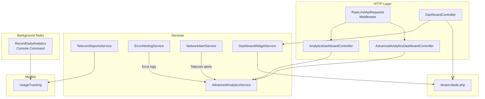
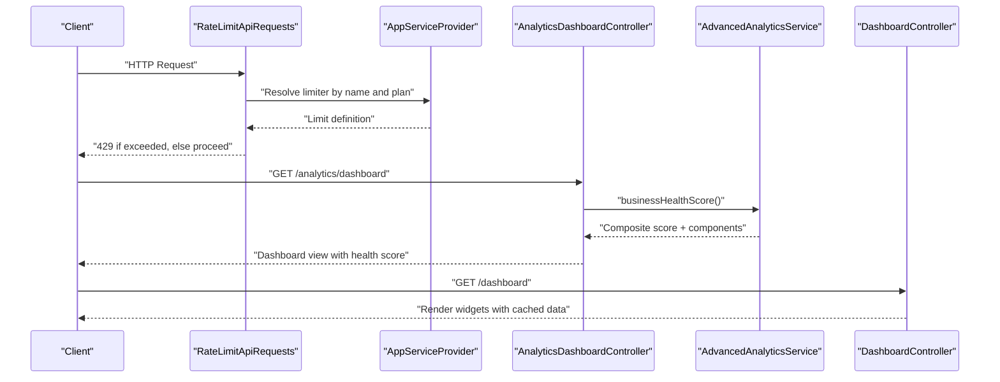
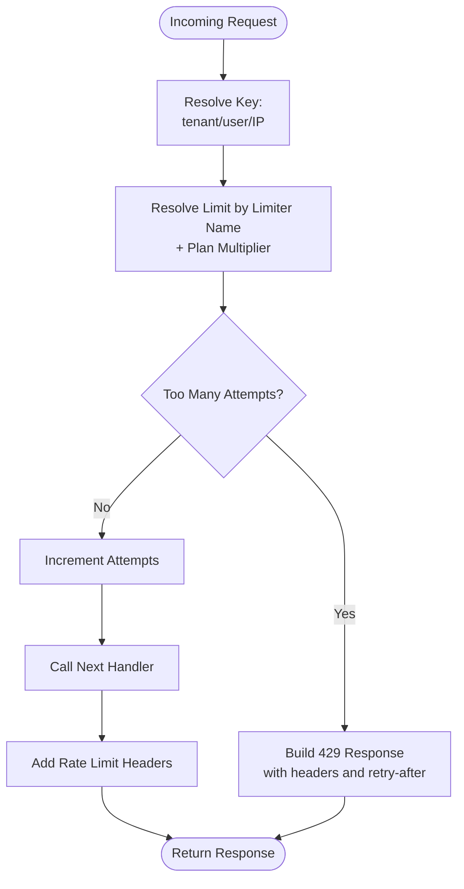
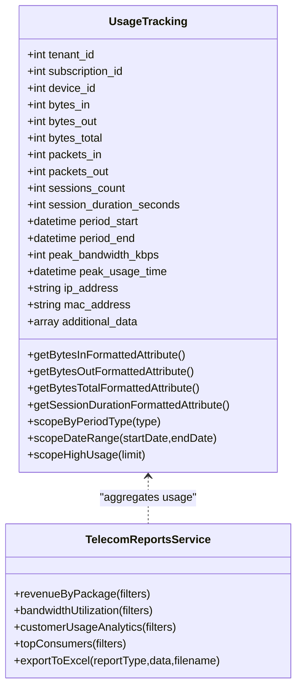
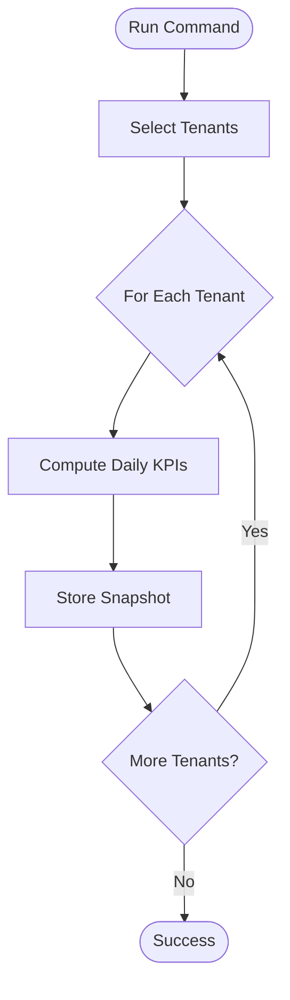
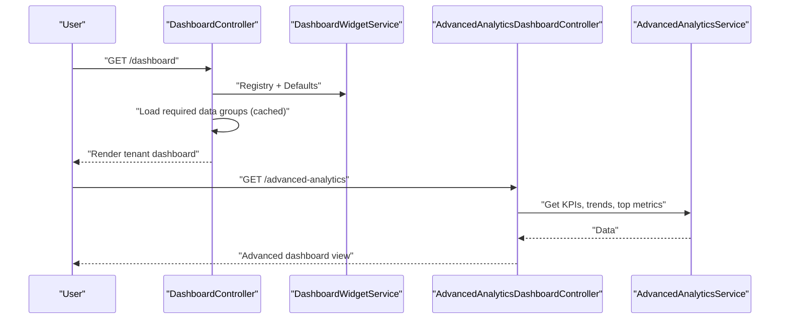
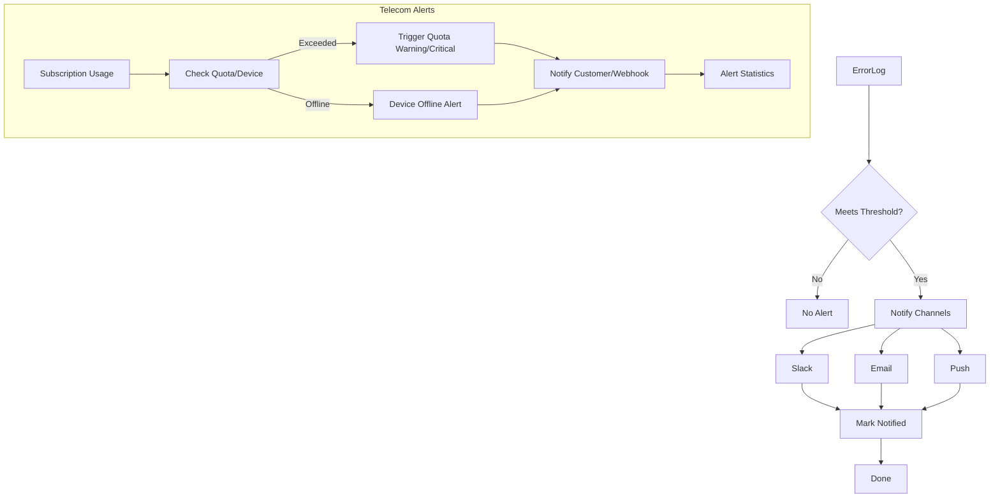
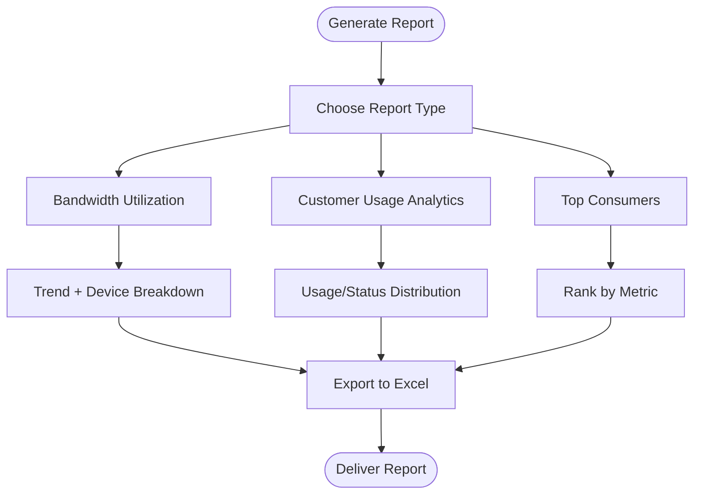
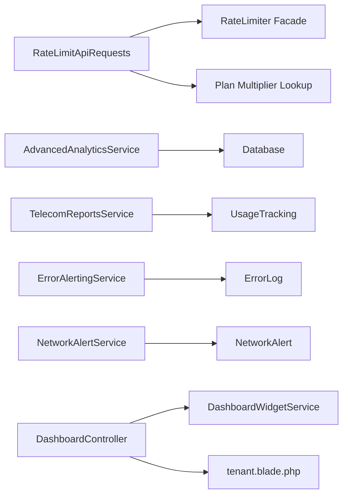

# Usage Analytics & Monitoring

<cite>
**Referenced Files in This Document**
- [RateLimitApiRequests.php](file://app/Http/Middleware/RateLimitApiRequests.php)
- [AppServiceProvider.php](file://app/Providers/AppServiceProvider.php)
- [TelecomReportsService.php](file://app/Services/Telecom/TelecomReportsService.php)
- [UsageTracking.php](file://app/Models/UsageTracking.php)
- [RecordDailyAnalytics.php](file://app/Console/Commands/RecordDailyAnalytics.php)
- [ErrorAlertingService.php](file://app/Services/ErrorAlertingService.php)
- [NetworkAlertService.php](file://app/Services/Telecom/NetworkAlertService.php)
- [AdvancedAnalyticsService.php](file://app/Services/AdvancedAnalyticsService.php)
- [AnalyticsDashboardController.php](file://app/Http/Controllers/Analytics/AnalyticsDashboardController.php)
- [AdvancedAnalyticsDashboardController.php](file://app/Http/Controllers/Analytics/AdvancedAnalyticsDashboardController.php)
- [DashboardController.php](file://app/Http/Controllers/DashboardController.php)
- [DashboardWidgetService.php](file://app/Services/DashboardWidgetService.php)
- [tenant.blade.php](file://resources/views/dashboard/tenant.blade.php)
- [index.html](file://public/api-docs/index.html)
</cite>

## Table of Contents
1. [Introduction](#introduction)
2. [Project Structure](#project-structure)
3. [Core Components](#core-components)
4. [Architecture Overview](#architecture-overview)
5. [Detailed Component Analysis](#detailed-component-analysis)
6. [Dependency Analysis](#dependency-analysis)
7. [Performance Considerations](#performance-considerations)
8. [Troubleshooting Guide](#troubleshooting-guide)
9. [Conclusion](#conclusion)
10. [Appendices](#appendices)

## Introduction
This document describes the Usage Analytics and Monitoring system in qalcuityERP. It covers request tracking mechanisms, rate limiting enforcement, usage statistics collection, analytics dashboards, real-time monitoring and alerting, performance metrics, usage reporting, historical analysis, capacity planning, integration with external monitoring systems, and troubleshooting usage-related issues. It also provides practical examples for configuring rate limits, interpreting usage reports, and optimizing API performance.

## Project Structure
The Usage Analytics and Monitoring system spans middleware for rate limiting, service classes for analytics and reporting, models for usage tracking, console commands for daily snapshots, and controllers/views for dashboards and widgets.

**Diagram sources**
- [RateLimitApiRequests.php:1-161](file://app/Http/Middleware/RateLimitApiRequests.php#L1-L161)
- [AppServiceProvider.php:156-259](file://app/Providers/AppServiceProvider.php#L156-L259)
- [AnalyticsDashboardController.php:1-48](file://app/Http/Controllers/Analytics/AnalyticsDashboardController.php#L1-L48)
- [AdvancedAnalyticsDashboardController.php:1-43](file://app/Http/Controllers/Analytics/AdvancedAnalyticsDashboardController.php#L1-L43)
- [DashboardController.php:67-268](file://app/Http/Controllers/DashboardController.php#L67-L268)
- [AdvancedAnalyticsService.php:1-800](file://app/Services/AdvancedAnalyticsService.php#L1-L800)
- [TelecomReportsService.php:1-610](file://app/Services/Telecom/TelecomReportsService.php#L1-L610)
- [ErrorAlertingService.php:1-91](file://app/Services/ErrorAlertingService.php#L1-L91)
- [NetworkAlertService.php:238-494](file://app/Services/Telecom/NetworkAlertService.php#L238-L494)
- [DashboardWidgetService.php:1-194](file://app/Services/DashboardWidgetService.php#L1-L194)
- [UsageTracking.php:1-160](file://app/Models/UsageTracking.php#L1-L160)
- [RecordDailyAnalytics.php:1-198](file://app/Console/Commands/RecordDailyAnalytics.php#L1-L198)
- [tenant.blade.php:507-1046](file://resources/views/dashboard/tenant.blade.php#L507-L1046)

**Section sources**
- [RateLimitApiRequests.php:1-161](file://app/Http/Middleware/RateLimitApiRequests.php#L1-L161)
- [AppServiceProvider.php:156-259](file://app/Providers/AppServiceProvider.php#L156-L259)
- [TelecomReportsService.php:1-610](file://app/Services/Telecom/TelecomReportsService.php#L1-L610)
- [UsageTracking.php:1-160](file://app/Models/UsageTracking.php#L1-L160)
- [RecordDailyAnalytics.php:1-198](file://app/Console/Commands/RecordDailyAnalytics.php#L1-L198)
- [ErrorAlertingService.php:1-91](file://app/Services/ErrorAlertingService.php#L1-L91)
- [NetworkAlertService.php:238-494](file://app/Services/Telecom/NetworkAlertService.php#L238-L494)
- [AdvancedAnalyticsService.php:1-800](file://app/Services/AdvancedAnalyticsService.php#L1-L800)
- [AnalyticsDashboardController.php:1-48](file://app/Http/Controllers/Analytics/AnalyticsDashboardController.php#L1-L48)
- [AdvancedAnalyticsDashboardController.php:1-43](file://app/Http/Controllers/Analytics/AdvancedAnalyticsDashboardController.php#L1-L43)
- [DashboardController.php:67-268](file://app/Http/Controllers/DashboardController.php#L67-L268)
- [DashboardWidgetService.php:1-194](file://app/Services/DashboardWidgetService.php#L1-L194)
- [tenant.blade.php:507-1046](file://resources/views/dashboard/tenant.blade.php#L507-L1046)

## Core Components
- Request tracking and rate limiting:
  - Middleware enforces per-tenant, per-endpoint rate limits with plan-based multipliers and standard rate limit headers.
  - ServiceProvider defines named limiters for API read/write, webhooks, POS, exports, imports, and auth.
- Usage statistics collection:
  - Telecom usage tracking model stores bytes in/out, sessions, durations, and peak usage time.
  - Telecom reports service aggregates bandwidth utilization, customer usage analytics, and top consumers.
  - Daily analytics command records healthcare KPIs and writes snapshots to storage.
- Analytics dashboards:
  - Controllers expose quick stats, RFM analysis, revenue trends, and advanced KPIs.
  - Dashboard controller orchestrates widget rendering and caches data for performance.
- Monitoring and alerting:
  - Error alerting service triggers real-time alerts for critical errors.
  - Telecom network alert service detects quota breaches and device offline events, supports resolution workflows.
- Reporting and capacity planning:
  - Reports include revenue by package, bandwidth trends, and top consumers.
  - Forecasting service predicts occupancy and demand for capacity planning.

**Section sources**
- [RateLimitApiRequests.php:1-161](file://app/Http/Middleware/RateLimitApiRequests.php#L1-L161)
- [AppServiceProvider.php:156-259](file://app/Providers/AppServiceProvider.php#L156-L259)
- [TelecomReportsService.php:95-192](file://app/Services/Telecom/TelecomReportsService.php#L95-L192)
- [UsageTracking.php:10-75](file://app/Models/UsageTracking.php#L10-L75)
- [RecordDailyAnalytics.php:69-196](file://app/Console/Commands/RecordDailyAnalytics.php#L69-L196)
- [AdvancedAnalyticsService.php:19-62](file://app/Services/AdvancedAnalyticsService.php#L19-L62)
- [AnalyticsDashboardController.php:23-48](file://app/Http/Controllers/Analytics/AnalyticsDashboardController.php#L23-L48)
- [AdvancedAnalyticsDashboardController.php:24-43](file://app/Http/Controllers/Analytics/AdvancedAnalyticsDashboardController.php#L24-L43)
- [DashboardController.php:67-268](file://app/Http/Controllers/DashboardController.php#L67-L268)
- [ErrorAlertingService.php:42-91](file://app/Services/ErrorAlertingService.php#L42-L91)
- [NetworkAlertService.php:238-494](file://app/Services/Telecom/NetworkAlertService.php#L238-L494)

## Architecture Overview
The system integrates middleware for rate limiting, services for analytics and reporting, models for usage tracking, and controllers/views for dashboards. Background jobs capture daily snapshots, while alerting services notify stakeholders of anomalies and errors.

**Diagram sources**
- [RateLimitApiRequests.php:24-45](file://app/Http/Middleware/RateLimitApiRequests.php#L24-L45)
- [AppServiceProvider.php:162-184](file://app/Providers/AppServiceProvider.php#L162-L184)
- [AnalyticsDashboardController.php:26-37](file://app/Http/Controllers/Analytics/AnalyticsDashboardController.php#L26-L37)
- [AdvancedAnalyticsService.php:19-62](file://app/Services/AdvancedAnalyticsService.php#L19-L62)
- [DashboardController.php:67-268](file://app/Http/Controllers/DashboardController.php#L67-L268)

## Detailed Component Analysis

### Rate Limiting Enforcement
- Middleware keys:
  - API token-authenticated: tenant-scoped key.
  - Authenticated web users: user-scoped key.
  - Unauthenticated (webhooks, etc.): IP-scoped key.
- Limit resolution:
  - Named limiters: api-read, api-write, api-default, webhook-inbound, webhook-test, pos-checkout, export, import, auth.
  - Plan-based multiplier applied to base limits (starter to enterprise).
- Response headers:
  - Standard X-RateLimit-Limit and X-RateLimit-Remaining.
  - On 429, includes Retry-After and detailed message.
- ServiceProvider:
  - Defines per-limiter limits and per-minute by keys.
  - Provides plan multiplier lookup and custom JSON 429 response.

**Diagram sources**
- [RateLimitApiRequests.php:24-45](file://app/Http/Middleware/RateLimitApiRequests.php#L24-L45)
- [RateLimitApiRequests.php:50-65](file://app/Http/Middleware/RateLimitApiRequests.php#L50-L65)
- [RateLimitApiRequests.php:70-87](file://app/Http/Middleware/RateLimitApiRequests.php#L70-L87)
- [RateLimitApiRequests.php:93-117](file://app/Http/Middleware/RateLimitApiRequests.php#L93-L117)
- [RateLimitApiRequests.php:124-159](file://app/Http/Middleware/RateLimitApiRequests.php#L124-L159)
- [AppServiceProvider.php:162-184](file://app/Providers/AppServiceProvider.php#L162-L184)
- [AppServiceProvider.php:228-250](file://app/Providers/AppServiceProvider.php#L228-L250)
- [AppServiceProvider.php:252-259](file://app/Providers/AppServiceProvider.php#L252-L259)

**Section sources**
- [RateLimitApiRequests.php:1-161](file://app/Http/Middleware/RateLimitApiRequests.php#L1-L161)
- [AppServiceProvider.php:156-259](file://app/Providers/AppServiceProvider.php#L156-L259)

### Usage Tracking and Telecom Reports
- UsageTracking model:
  - Stores tenant, subscription, device, bytes in/out/total, packets, sessions, durations, peak bandwidth/time, and IP/MAC.
  - Provides formatted attributes for human-readable sizes and durations.
  - Scopes for period type/date range/high usage.
- TelecomReportsService:
  - Bandwidth utilization report: aggregates usage by period, device, and computes totals, ratios, averages, and peak periods.
  - Customer usage analytics: customer-level counts, revenue, status distributions, and usage ranges.
  - Top consumers: ranked by usage/download/upload with package details.
  - Export to Excel for downstream analysis.

**Diagram sources**
- [UsageTracking.php:10-75](file://app/Models/UsageTracking.php#L10-L75)
- [TelecomReportsService.php:95-192](file://app/Services/Telecom/TelecomReportsService.php#L95-L192)
- [TelecomReportsService.php:197-280](file://app/Services/Telecom/TelecomReportsService.php#L197-L280)
- [TelecomReportsService.php:285-374](file://app/Services/Telecom/TelecomReportsService.php#L285-L374)

**Section sources**
- [UsageTracking.php:1-160](file://app/Models/UsageTracking.php#L1-L160)
- [TelecomReportsService.php:95-192](file://app/Services/Telecom/TelecomReportsService.php#L95-L192)
- [TelecomReportsService.php:197-280](file://app/Services/Telecom/TelecomReportsService.php#L197-L280)
- [TelecomReportsService.php:285-374](file://app/Services/Telecom/TelecomReportsService.php#L285-L374)

### Daily Analytics Snapshots
- Console command:
  - Iterates tenants with admin users or a specific tenant.
  - Computes daily KPIs (patients, visits, admissions, appointments, revenue, lab/radiology/pharmacy metrics).
  - Writes snapshots to storage with metadata and generates human-readable output.

**Diagram sources**
- [RecordDailyAnalytics.php:30-64](file://app/Console/Commands/RecordDailyAnalytics.php#L30-L64)
- [RecordDailyAnalytics.php:69-196](file://app/Console/Commands/RecordDailyAnalytics.php#L69-L196)

**Section sources**
- [RecordDailyAnalytics.php:1-198](file://app/Console/Commands/RecordDailyAnalytics.php#L1-L198)

### Analytics Dashboards and Widgets
- Controllers:
  - AnalyticsDashboardController: business health score and quick stats.
  - AdvancedAnalyticsDashboardController: real-time KPIs, revenue trends, top metrics.
  - DashboardController: loads required data groups, caches for performance, renders widgets.
- Widget registry and defaults:
  - DashboardWidgetService defines widget metadata, roles, and default layouts per role.
- Frontend:
  - tenant.blade.php initializes charts, handles widget builder, and refreshes insights.

**Diagram sources**
- [DashboardController.php:67-268](file://app/Http/Controllers/DashboardController.php#L67-L268)
- [DashboardWidgetService.php:15-194](file://app/Services/DashboardWidgetService.php#L15-L194)
- [AdvancedAnalyticsDashboardController.php:24-43](file://app/Http/Controllers/Analytics/AdvancedAnalyticsDashboardController.php#L24-L43)
- [AdvancedAnalyticsService.php:19-62](file://app/Services/AdvancedAnalyticsService.php#L19-L62)

**Section sources**
- [AnalyticsDashboardController.php:1-48](file://app/Http/Controllers/Analytics/AnalyticsDashboardController.php#L1-L48)
- [AdvancedAnalyticsDashboardController.php:1-43](file://app/Http/Controllers/Analytics/AdvancedAnalyticsDashboardController.php#L1-L43)
- [DashboardController.php:67-268](file://app/Http/Controllers/DashboardController.php#L67-L268)
- [DashboardWidgetService.php:1-194](file://app/Services/DashboardWidgetService.php#L1-L194)
- [tenant.blade.php:507-1046](file://resources/views/dashboard/tenant.blade.php#L507-L1046)

### Monitoring and Alerting
- ErrorAlertingService:
  - Determines whether to alert based on error level and thresholds.
  - Sends notifications via configured channels (e.g., Slack, email).
  - Marks logs as notified upon successful dispatch.
- NetworkAlertService (Telecom):
  - Detects quota warnings/exceeded and device offline/recovered events.
  - Calculates severity by affected subscriptions.
  - Resolves alerts manually and provides alert statistics by type/severity.

**Diagram sources**
- [ErrorAlertingService.php:42-91](file://app/Services/ErrorAlertingService.php#L42-L91)
- [NetworkAlertService.php:238-494](file://app/Services/Telecom/NetworkAlertService.php#L238-L494)

**Section sources**
- [ErrorAlertingService.php:1-91](file://app/Services/ErrorAlertingService.php#L1-L91)
- [NetworkAlertService.php:238-494](file://app/Services/Telecom/NetworkAlertService.php#L238-L494)

### Usage Reporting and Capacity Planning
- TelecomReportsService:
  - Bandwidth utilization: daily/weekly/monthly trends, device breakdown, peak period identification.
  - Customer analytics: usage distribution, status distribution, active rate.
  - Top consumers: ranked by usage/download/upload with last activity timestamps.
- Forecasting:
  - OccupancyForecastingService generates projections, evaluates accuracy, and provides recommendations for pricing/promotions.

**Diagram sources**
- [TelecomReportsService.php:95-192](file://app/Services/Telecom/TelecomReportsService.php#L95-L192)
- [TelecomReportsService.php:197-280](file://app/Services/Telecom/TelecomReportsService.php#L197-L280)
- [TelecomReportsService.php:285-374](file://app/Services/Telecom/TelecomReportsService.php#L285-L374)

**Section sources**
- [TelecomReportsService.php:95-192](file://app/Services/Telecom/TelecomReportsService.php#L95-L192)
- [TelecomReportsService.php:197-280](file://app/Services/Telecom/TelecomReportsService.php#L197-L280)
- [TelecomReportsService.php:285-374](file://app/Services/Telecom/TelecomReportsService.php#L285-L374)

## Dependency Analysis
- Middleware depends on RateLimiter facade and plan multipliers from tenant context.
- Services depend on models and database queries; they are orchestrated by controllers.
- Dashboards depend on widget registry and cached data groups.
- Alerting services depend on error logs and notification channels.

**Diagram sources**
- [RateLimitApiRequests.php:24-45](file://app/Http/Middleware/RateLimitApiRequests.php#L24-L45)
- [AppServiceProvider.php:228-250](file://app/Providers/AppServiceProvider.php#L228-L250)
- [AdvancedAnalyticsService.php:1-800](file://app/Services/AdvancedAnalyticsService.php#L1-L800)
- [TelecomReportsService.php:1-610](file://app/Services/Telecom/TelecomReportsService.php#L1-L610)
- [UsageTracking.php:1-160](file://app/Models/UsageTracking.php#L1-L160)
- [ErrorAlertingService.php:1-91](file://app/Services/ErrorAlertingService.php#L1-L91)
- [NetworkAlertService.php:238-494](file://app/Services/Telecom/NetworkAlertService.php#L238-L494)
- [DashboardController.php:67-268](file://app/Http/Controllers/DashboardController.php#L67-L268)
- [DashboardWidgetService.php:1-194](file://app/Services/DashboardWidgetService.php#L1-L194)
- [tenant.blade.php:507-1046](file://resources/views/dashboard/tenant.blade.php#L507-L1046)

**Section sources**
- [RateLimitApiRequests.php:1-161](file://app/Http/Middleware/RateLimitApiRequests.php#L1-L161)
- [AppServiceProvider.php:156-259](file://app/Providers/AppServiceProvider.php#L156-L259)
- [AdvancedAnalyticsService.php:1-800](file://app/Services/AdvancedAnalyticsService.php#L1-L800)
- [TelecomReportsService.php:1-610](file://app/Services/Telecom/TelecomReportsService.php#L1-L610)
- [UsageTracking.php:1-160](file://app/Models/UsageTracking.php#L1-L160)
- [ErrorAlertingService.php:1-91](file://app/Services/ErrorAlertingService.php#L1-L91)
- [NetworkAlertService.php:238-494](file://app/Services/Telecom/NetworkAlertService.php#L238-L494)
- [DashboardController.php:67-268](file://app/Http/Controllers/DashboardController.php#L67-L268)
- [DashboardWidgetService.php:1-194](file://app/Services/DashboardWidgetService.php#L1-L194)
- [tenant.blade.php:507-1046](file://resources/views/dashboard/tenant.blade.php#L507-L1046)

## Performance Considerations
- Rate limiting:
  - Use plan-based multipliers to scale limits fairly across tiers.
  - Prefer tenant/user/IP scoping to avoid cross-user contention.
- Analytics:
  - Cache dashboard data groups to reduce repeated heavy queries.
  - Paginate analytics results (e.g., customer lists) to bound memory and response times.
- Storage:
  - UsageTracking aggregates are grouped by period; choose appropriate grouping (daily/weekly/monthly) to balance granularity and query cost.
- Background tasks:
  - Daily analytics runs as a scheduled job; ensure it completes before the next cycle to avoid gaps.

[No sources needed since this section provides general guidance]

## Troubleshooting Guide
- Rate limit exceeded:
  - Inspect X-RateLimit-Limit and X-RateLimit-Remaining headers.
  - Review plan multiplier and limiter name used by the route.
  - Adjust plan tier or route-specific limits as needed.
- 429 responses:
  - Confirm Retry-After header and message payload.
  - Verify RateLimiter configuration and key resolution logic.
- Error alerts not firing:
  - Check alert thresholds and error log levels.
  - Validate channel configurations and delivery attempts.
- Telecom alerts:
  - Confirm quota thresholds and device status.
  - Use alert statistics to identify most affected devices and recurring types.
- Dashboard performance:
  - Ensure data groups are cached and widgets are filtered by role.
  - Reduce widget count or increase cache TTL for heavy computations.

**Section sources**
- [RateLimitApiRequests.php:124-159](file://app/Http/Middleware/RateLimitApiRequests.php#L124-L159)
- [AppServiceProvider.php:162-184](file://app/Providers/AppServiceProvider.php#L162-L184)
- [ErrorAlertingService.php:77-91](file://app/Services/ErrorAlertingService.php#L77-L91)
- [NetworkAlertService.php:468-494](file://app/Services/Telecom/NetworkAlertService.php#L468-L494)
- [DashboardController.php:75-89](file://app/Http/Controllers/DashboardController.php#L75-L89)

## Conclusion
The Usage Analytics and Monitoring system provides robust request tracking, plan-aware rate limiting, comprehensive usage reporting, and real-time dashboards with alerting. By leveraging tenant-scoped limits, efficient analytics services, and dashboard caching, the platform scales across tenants while maintaining observability and performance. Operators can configure quotas, interpret usage reports, and optimize API performance through the documented mechanisms.

[No sources needed since this section summarizes without analyzing specific files]

## Appendices

### Rate Limiting Configuration Examples
- Apply middleware to routes using named limiters (e.g., api-read, api-write, webhook-inbound).
- Configure plan multipliers in the ServiceProvider to adjust limits per tenant plan.
- Monitor standard rate limit headers and 429 responses for compliance.

**Section sources**
- [RateLimitApiRequests.php:14-18](file://app/Http/Middleware/RateLimitApiRequests.php#L14-L18)
- [AppServiceProvider.php:162-184](file://app/Providers/AppServiceProvider.php#L162-L184)
- [AppServiceProvider.php:228-250](file://app/Providers/AppServiceProvider.php#L228-L250)

### Usage Reporting and Interpretation
- Bandwidth utilization:
  - Use trends to identify peak usage periods and device hotspots.
  - Compare download/upload ratios to assess traffic patterns.
- Customer analytics:
  - Analyze usage distribution and status distribution to segment customers.
  - Track active rate and average revenue per customer.
- Top consumers:
  - Focus retention efforts on high-impact accounts and monitor last activity.

**Section sources**
- [TelecomReportsService.php:95-192](file://app/Services/Telecom/TelecomReportsService.php#L95-L192)
- [TelecomReportsService.php:197-280](file://app/Services/Telecom/TelecomReportsService.php#L197-L280)
- [TelecomReportsService.php:285-374](file://app/Services/Telecom/TelecomReportsService.php#L285-L374)

### Capacity Planning Tools
- Use occupancy forecasting to anticipate demand and adjust pricing or promotions.
- Combine usage trends with seasonal indices to plan resource allocation.

**Section sources**
- [AdvancedAnalyticsService.php:358-398](file://app/Services/AdvancedAnalyticsService.php#L358-L398)

### Integration with External Systems
- API documentation includes usage tiers and throttling guidance for different plans.
- Webhook inbound limits support payment provider callbacks.

**Section sources**
- [index.html:612-639](file://public/api-docs/index.html#L612-L639)