# Custom Module Builder

<cite>
**Referenced Files in This Document**
- [CustomModule.php](file://app/Models/CustomModule.php)
- [CustomField.php](file://app/Models/CustomField.php)
- [CustomFieldValue.php](file://app/Models/CustomFieldValue.php)
- [CustomFieldController.php](file://app/Http/Controllers/CustomFieldController.php)
- [CustomFieldService.php](file://app/Services/CustomFieldService.php)
- [MarketplaceController.php](file://app/Http/Controllers/Marketplace/MarketplaceController.php)
- [PermissionService.php](file://app/Services/PermissionService.php)
- [UserPermission.php](file://app/Models/UserPermission.php)
- [TenantIsolationService.php](file://app/Services/TenantIsolationService.php)
- [custom-fields.blade.php](file://resources/views/settings/custom-fields.blade.php)
- [index.blade.php](file://resources/views/import/index.blade.php)
- [ARCHITECTURE.md](file://docs/ARCHITECTURE.md)
</cite>

## Table of Contents
1. [Introduction](#introduction)
2. [Project Structure](#project-structure)
3. [Core Components](#core-components)
4. [Architecture Overview](#architecture-overview)
5. [Detailed Component Analysis](#detailed-component-analysis)
6. [Dependency Analysis](#dependency-analysis)
7. [Performance Considerations](#performance-considerations)
8. [Troubleshooting Guide](#troubleshooting-guide)
9. [Conclusion](#conclusion)
10. [Appendices](#appendices)

## Introduction
This document describes the Custom Module Builder functionality in the system. It explains how tenants define custom modules with schema and UI configuration, manage custom fields, and operate CRUD workloads on module records. It also covers schema validation, data types, relationships, record management, permissions, tenant isolation, and the module lifecycle from creation to updates, record management, and export or deletion. Guidance is included for integrating with existing ERP modules and exporting/importing module data for sharing and migration.

## Project Structure
The Custom Module Builder spans models, controllers, services, policies, and UI views. The primary building blocks are:
- Models for module metadata, custom fields, and field values
- Controller for custom field management
- Service for custom field definitions and values
- Controller for module CRUD operations
- Permission and tenant isolation services
- Blade views for UI

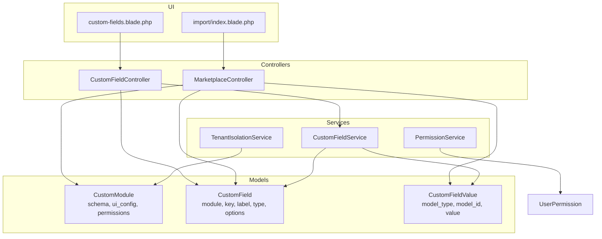

**Diagram sources**
- [CustomModule.php:10-46](file://app/Models/CustomModule.php#L10-L46)
- [CustomField.php:11-55](file://app/Models/CustomField.php#L11-L55)
- [CustomFieldValue.php:11-19](file://app/Models/CustomFieldValue.php#L11-L19)
- [CustomFieldController.php:9-115](file://app/Http/Controllers/CustomFieldController.php#L9-L115)
- [CustomFieldService.php:14-116](file://app/Services/CustomFieldService.php#L14-L116)
- [MarketplaceController.php:337-430](file://app/Http/Controllers/Marketplace/MarketplaceController.php#L337-L430)
- [PermissionService.php:203-290](file://app/Services/PermissionService.php#L203-L290)
- [TenantIsolationService.php:16-43](file://app/Services/TenantIsolationService.php#L16-L43)
- [custom-fields.blade.php:1-141](file://resources/views/settings/custom-fields.blade.php#L1-L141)
- [index.blade.php:1-57](file://resources/views/import/index.blade.php#L1-L57)

**Section sources**
- [CustomModule.php:10-46](file://app/Models/CustomModule.php#L10-L46)
- [CustomField.php:11-55](file://app/Models/CustomField.php#L11-L55)
- [CustomFieldValue.php:11-19](file://app/Models/CustomFieldValue.php#L11-L19)
- [CustomFieldController.php:9-115](file://app/Http/Controllers/CustomFieldController.php#L9-L115)
- [CustomFieldService.php:14-116](file://app/Services/CustomFieldService.php#L14-L116)
- [MarketplaceController.php:337-430](file://app/Http/Controllers/Marketplace/MarketplaceController.php#L337-L430)
- [PermissionService.php:203-290](file://app/Services/PermissionService.php#L203-L290)
- [TenantIsolationService.php:16-43](file://app/Services/TenantIsolationService.php#L16-L43)
- [custom-fields.blade.php:1-141](file://resources/views/settings/custom-fields.blade.php#L1-L141)
- [index.blade.php:1-57](file://resources/views/import/index.blade.php#L1-L57)

## Core Components
- CustomModule: Stores module metadata, schema, UI configuration, permissions, and creator reference. It defines tenant scoping and relationships to records.
- CustomField: Defines per-module, tenant-scoped field definitions with supported types and options.
- CustomFieldValue: Stores per-record values for custom fields via polymorphic relation to target models.
- CustomFieldController: Manages custom field CRUD with validation, uniqueness enforcement, and cache invalidation.
- CustomFieldService: Provides field retrieval, value persistence, validation, and caching.
- MarketplaceController: Implements module creation, schema updates, and record CRUD operations.
- PermissionService: Enforces role-based access control and per-user overrides.
- TenantIsolationService: Ensures tenant ownership checks and safe model lookup.
- UI Views: Provide forms and lists for custom field management and import/export.

**Section sources**
- [CustomModule.php:10-46](file://app/Models/CustomModule.php#L10-L46)
- [CustomField.php:11-55](file://app/Models/CustomField.php#L11-L55)
- [CustomFieldValue.php:11-19](file://app/Models/CustomFieldValue.php#L11-L19)
- [CustomFieldController.php:9-115](file://app/Http/Controllers/CustomFieldController.php#L9-L115)
- [CustomFieldService.php:14-116](file://app/Services/CustomFieldService.php#L14-L116)
- [MarketplaceController.php:337-430](file://app/Http/Controllers/Marketplace/MarketplaceController.php#L337-L430)
- [PermissionService.php:203-290](file://app/Services/PermissionService.php#L203-L290)
- [TenantIsolationService.php:16-43](file://app/Services/TenantIsolationService.php#L16-L43)
- [custom-fields.blade.php:1-141](file://resources/views/settings/custom-fields.blade.php#L1-L141)
- [index.blade.php:1-57](file://resources/views/import/index.blade.php#L1-L57)

## Architecture Overview
The Custom Module Builder follows a layered architecture:
- UI layer renders forms and lists for custom fields and module operations.
- Controller layer validates requests, enforces tenant isolation, and delegates to services.
- Service layer encapsulates business logic for field definitions, values, permissions, and isolation.
- Model layer persists module metadata, field definitions, and values with tenant scoping.

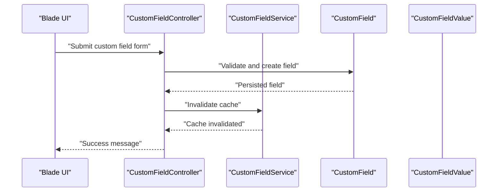

**Diagram sources**
- [custom-fields.blade.php:13-73](file://resources/views/settings/custom-fields.blade.php#L13-L73)
- [CustomFieldController.php:29-74](file://app/Http/Controllers/CustomFieldController.php#L29-L74)
- [CustomFieldService.php:96-100](file://app/Services/CustomFieldService.php#L96-L100)
- [CustomField.php:11-26](file://app/Models/CustomField.php#L11-L26)

**Section sources**
- [CustomFieldController.php:15-74](file://app/Http/Controllers/CustomFieldController.php#L15-L74)
- [CustomFieldService.php:19-28](file://app/Services/CustomFieldService.php#L19-L28)
- [CustomField.php:11-26](file://app/Models/CustomField.php#L11-L26)
- [custom-fields.blade.php:13-73](file://resources/views/settings/custom-fields.blade.php#L13-L73)

## Detailed Component Analysis

### Custom Module Schema and Metadata
- Purpose: Define reusable module structures with schema, UI configuration, permissions, and versioning.
- Key attributes: tenant_id, name, slug, description, version, schema (JSON/array), ui_config (JSON/array), permissions (JSON/array), is_active, created_by_user_id.
- Relationships: belongs to Tenant, has many records.

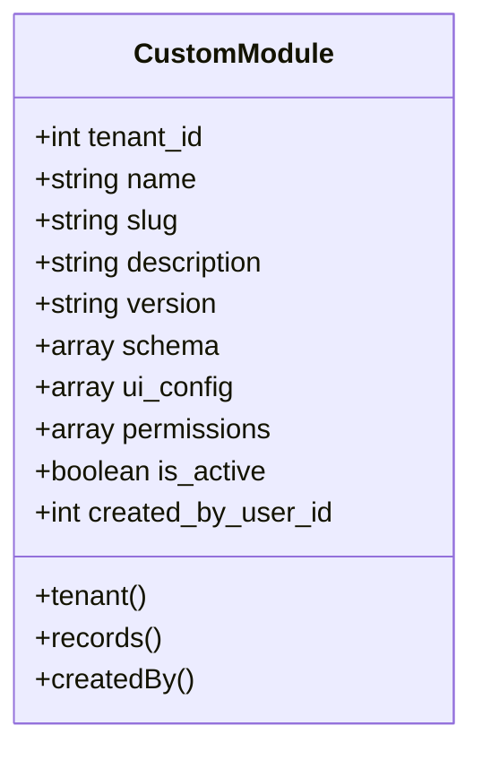

**Diagram sources**
- [CustomModule.php:10-46](file://app/Models/CustomModule.php#L10-L46)

**Section sources**
- [CustomModule.php:14-32](file://app/Models/CustomModule.php#L14-L32)

### Custom Field Definition and Values
- Purpose: Provide extensible field definitions per module and store per-record values.
- Supported modules: invoice, product, customer, supplier, employee, sales_order, purchase_order, expense.
- Supported types: text, number, date, select, checkbox, textarea.
- Options: select fields support newline-separated options parsed into arrays.
- Polymorphic values: CustomFieldValue links to any model via model_type/model_id.

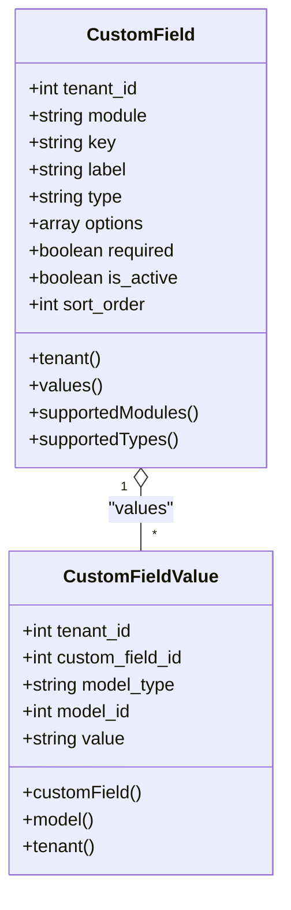

**Diagram sources**
- [CustomField.php:11-55](file://app/Models/CustomField.php#L11-L55)
- [CustomFieldValue.php:11-19](file://app/Models/CustomFieldValue.php#L11-L19)

**Section sources**
- [CustomField.php:14-26](file://app/Models/CustomField.php#L14-L26)
- [CustomField.php:28-54](file://app/Models/CustomField.php#L28-L54)
- [CustomFieldValue.php:14-18](file://app/Models/CustomFieldValue.php#L14-L18)

### Custom Field Management UI
- Features: Create, edit, activate/deactivate, reorder, and delete custom fields per module.
- Validation: Ensures module/type are supported, label length limits, numeric sort order, and option parsing for select.
- Uniqueness: Generates unique keys per module and appends timestamp if duplicates exist.

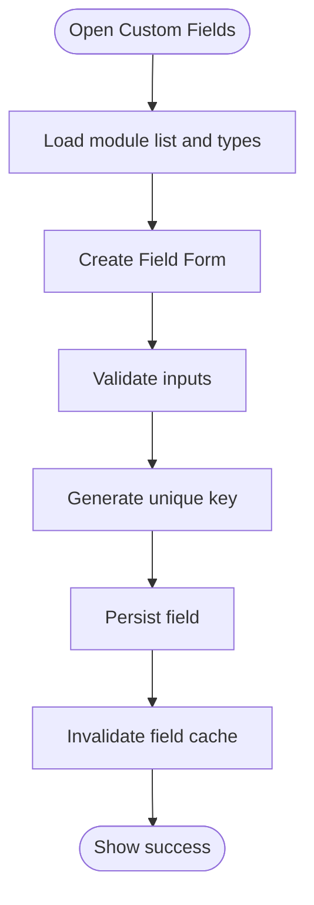

**Diagram sources**
- [custom-fields.blade.php:13-73](file://resources/views/settings/custom-fields.blade.php#L13-L73)
- [CustomFieldController.php:29-74](file://app/Http/Controllers/CustomFieldController.php#L29-L74)
- [CustomFieldService.php:96-100](file://app/Services/CustomFieldService.php#L96-L100)

**Section sources**
- [custom-fields.blade.php:10-71](file://resources/views/settings/custom-fields.blade.php#L10-L71)
- [CustomFieldController.php:29-74](file://app/Http/Controllers/CustomFieldController.php#L29-L74)

### Module CRUD Operations
- Creation: Validates name/description/version/schema/ui_config/permissions; creates module under tenant.
- Schema updates: Updates module schema atomically.
- Record management: Add/update/delete records; supports filtering and pagination via service.
- Integration: Works with existing ERP modules by mapping module keys to standard entities.

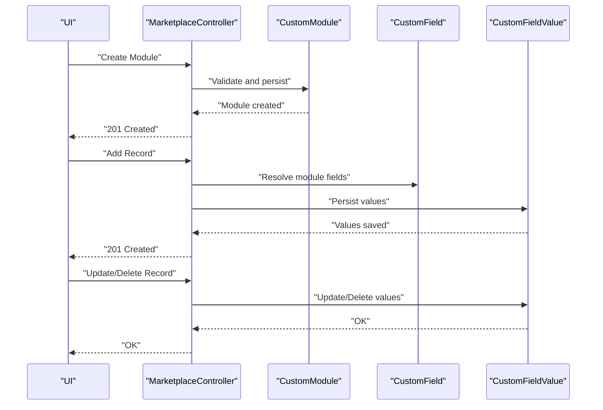

**Diagram sources**
- [MarketplaceController.php:337-430](file://app/Http/Controllers/Marketplace/MarketplaceController.php#L337-L430)
- [CustomModule.php:10-46](file://app/Models/CustomModule.php#L10-L46)
- [CustomField.php:11-55](file://app/Models/CustomField.php#L11-L55)
- [CustomFieldValue.php:11-19](file://app/Models/CustomFieldValue.php#L11-L19)

**Section sources**
- [MarketplaceController.php:337-430](file://app/Http/Controllers/Marketplace/MarketplaceController.php#L337-L430)

### Schema Validation and Data Types
- Validation pipeline:
  - Required fields: module, label, type, sort_order.
  - Type constraints: module/type must be in supported lists.
  - Select options: newline-separated values parsed into arrays.
  - Required flag: enforced during validation.
- Data types: text, number, date, select, checkbox, textarea; values stored as strings with select values normalized.

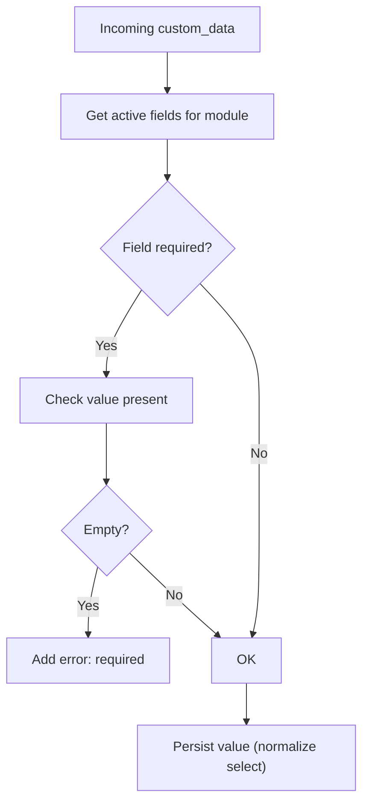

**Diagram sources**
- [CustomFieldService.php:79-92](file://app/Services/CustomFieldService.php#L79-L92)
- [CustomFieldService.php:50-73](file://app/Services/CustomFieldService.php#L50-L73)

**Section sources**
- [CustomFieldController.php:31-38](file://app/Http/Controllers/CustomFieldController.php#L31-L38)
- [CustomFieldController.php:53-57](file://app/Http/Controllers/CustomFieldController.php#L53-L57)
- [CustomFieldService.php:79-92](file://app/Services/CustomFieldService.php#L79-L92)
- [CustomFieldService.php:50-73](file://app/Services/CustomFieldService.php#L50-L73)

### Relationship Mapping Capabilities
- Polymorphic values: CustomFieldValue stores model_type/model_id to attach values to any tenant-scoped model.
- Field-to-module mapping: Service resolves module from model class to validate and persist values.

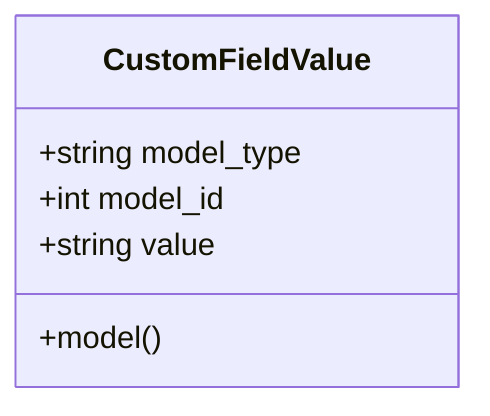

**Diagram sources**
- [CustomFieldValue.php:11-19](file://app/Models/CustomFieldValue.php#L11-L19)

**Section sources**
- [CustomFieldValue.php:14-18](file://app/Models/CustomFieldValue.php#L14-L18)
- [CustomFieldService.php:102-115](file://app/Services/CustomFieldService.php#L102-L115)

### Record Management Interface (CRUD, Bulk Actions, Import/Export)
- CRUD: Create, read, update, delete module records via controller endpoints.
- Bulk actions: Available in UI for quick export of master data (e.g., products, customers, suppliers, employees, warehouses, chart of accounts).
- Import/Export: Centralized import page shows results and errors; export provides CSV downloads for master data.

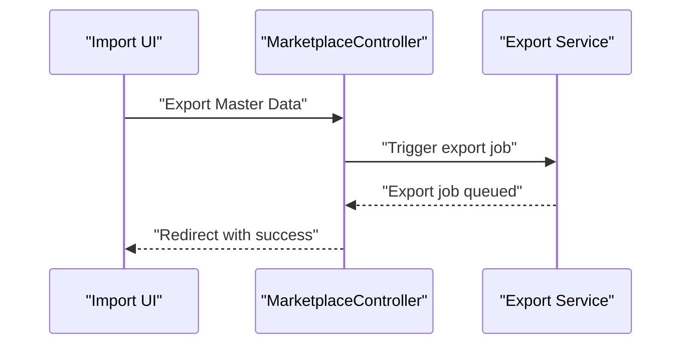

**Diagram sources**
- [index.blade.php:43-57](file://resources/views/import/index.blade.php#L43-L57)
- [MarketplaceController.php:337-430](file://app/Http/Controllers/Marketplace/MarketplaceController.php#L337-L430)

**Section sources**
- [index.blade.php:43-57](file://resources/views/import/index.blade.php#L43-L57)
- [MarketplaceController.php:376-430](file://app/Http/Controllers/Marketplace/MarketplaceController.php#L376-L430)

### Permission System and Tenant Isolation
- Permissions: Role-based defaults plus per-user overrides; supports granular module/action checks.
- Overrides: Stored in UserPermission; cached per user for fast evaluation.
- Tenant isolation: Controllers enforce tenant ownership; TenantIsolationService provides safe lookup and ownership assertions.

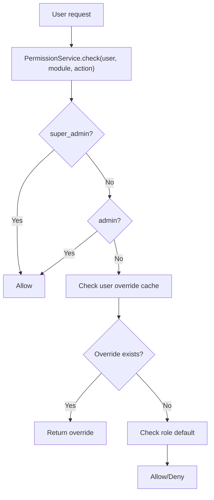

**Diagram sources**
- [PermissionService.php:203-290](file://app/Services/PermissionService.php#L203-L290)
- [UserPermission.php:10-21](file://app/Models/UserPermission.php#L10-L21)
- [TenantIsolationService.php:16-43](file://app/Services/TenantIsolationService.php#L16-L43)

**Section sources**
- [PermissionService.php:203-290](file://app/Services/PermissionService.php#L203-L290)
- [UserPermission.php:12-15](file://app/Models/UserPermission.php#L12-L15)
- [TenantIsolationService.php:25-43](file://app/Services/TenantIsolationService.php#L25-L43)

### Module Lifecycle: Creation, Updates, Records, Export/Deletion
- Creation: Controller validates and persists module; service caches are invalidated implicitly through related operations.
- Updates: Schema updates are supported; field definitions can be edited (reordered, enabled/disabled).
- Records: CRUD operations on module records; values persisted via polymorphic relation.
- Export/Deletion: Records can be exported via import UI; deletion removes field values and definitions.

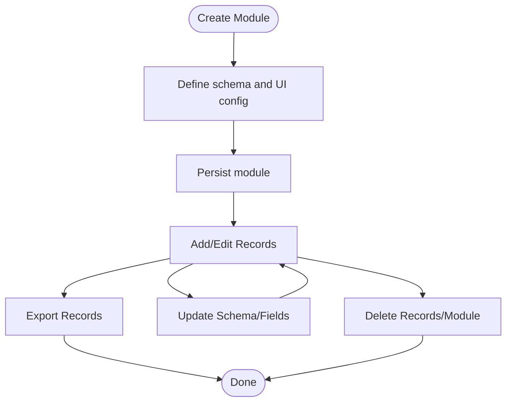

**Diagram sources**
- [MarketplaceController.php:337-430](file://app/Http/Controllers/Marketplace/MarketplaceController.php#L337-L430)
- [CustomFieldController.php:76-114](file://app/Http/Controllers/CustomFieldController.php#L76-L114)
- [index.blade.php:43-57](file://resources/views/import/index.blade.php#L43-L57)

**Section sources**
- [MarketplaceController.php:337-430](file://app/Http/Controllers/Marketplace/MarketplaceController.php#L337-L430)
- [CustomFieldController.php:76-114](file://app/Http/Controllers/CustomFieldController.php#L76-L114)
- [index.blade.php:43-57](file://resources/views/import/index.blade.php#L43-L57)

### Integration with Existing ERP Modules
- Module mapping: CustomFieldService maps model classes to module keys (e.g., invoice, product, customer, employee, sales_order, purchase_order, expense).
- Tool registry: ERP tool registry enumerates standard operations; custom modules can complement these by extending schemas and UI.

**Section sources**
- [CustomFieldService.php:102-115](file://app/Services/CustomFieldService.php#L102-L115)
- [ToolRegistry.php:217-257](file://app/Services/ERP/ToolRegistry.php#L217-L257)

## Dependency Analysis
- Controllers depend on services for business logic and on models for persistence.
- Services depend on models and cache for performance and correctness.
- UI depends on controllers for data and on services for rendering dynamic options.
- Tenant isolation is enforced at controller boundaries and via traits on models.

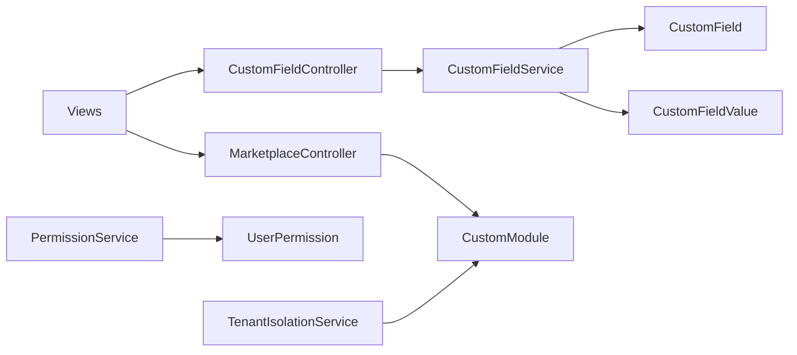

**Diagram sources**
- [CustomFieldController.php:9-13](file://app/Http/Controllers/CustomFieldController.php#L9-L13)
- [CustomFieldService.php:14-14](file://app/Services/CustomFieldService.php#L14-L14)
- [MarketplaceController.php:337-354](file://app/Http/Controllers/Marketplace/MarketplaceController.php#L337-L354)
- [CustomModule.php:10-12](file://app/Models/CustomModule.php#L10-L12)
- [CustomField.php:11-13](file://app/Models/CustomField.php#L11-L13)
- [CustomFieldValue.php:11-13](file://app/Models/CustomFieldValue.php#L11-L13)
- [PermissionService.php:203-207](file://app/Services/PermissionService.php#L203-L207)
- [UserPermission.php:10-12](file://app/Models/UserPermission.php#L10-L12)
- [TenantIsolationService.php:16-24](file://app/Services/TenantIsolationService.php#L16-L24)

**Section sources**
- [CustomFieldController.php:9-13](file://app/Http/Controllers/CustomFieldController.php#L9-L13)
- [CustomFieldService.php:14-14](file://app/Services/CustomFieldService.php#L14-L14)
- [MarketplaceController.php:337-354](file://app/Http/Controllers/Marketplace/MarketplaceController.php#L337-L354)
- [CustomModule.php:10-12](file://app/Models/CustomModule.php#L10-L12)
- [CustomField.php:11-13](file://app/Models/CustomField.php#L11-L13)
- [CustomFieldValue.php:11-13](file://app/Models/CustomFieldValue.php#L11-L13)
- [PermissionService.php:203-207](file://app/Services/PermissionService.php#L203-L207)
- [UserPermission.php:10-12](file://app/Models/UserPermission.php#L10-L12)
- [TenantIsolationService.php:16-24](file://app/Services/TenantIsolationService.php#L16-L24)

## Performance Considerations
- Caching: CustomFieldService caches active fields per tenant/module to reduce repeated queries.
- Batch operations: Prefer batch updates for large datasets; leverage service methods to minimize round trips.
- Indexing: Ensure tenant_id is indexed across relevant tables for fast tenant-scoped queries.
- UI responsiveness: Use AJAX for field updates and caching to avoid full page reloads.

[No sources needed since this section provides general guidance]

## Troubleshooting Guide
- Field not appearing: Verify is_active flag and sort_order; check cache invalidation after edits.
- Validation errors: Confirm module/type are supported and required fields are provided.
- Tenant access denied: Ensure tenant_id matches current user’s tenant; use TenantIsolationService helpers.
- Permission denied: Review role defaults and per-user overrides; confirm module/action mapping.

**Section sources**
- [CustomFieldService.php:96-100](file://app/Services/CustomFieldService.php#L96-L100)
- [CustomFieldController.php:78-101](file://app/Http/Controllers/CustomFieldController.php#L78-L101)
- [TenantIsolationService.php:25-43](file://app/Services/TenantIsolationService.php#L25-L43)
- [PermissionService.php:203-290](file://app/Services/PermissionService.php#L203-L290)

## Conclusion
The Custom Module Builder enables tenants to extend the system with custom schemas, fields, and UI configurations while maintaining strict tenant isolation and robust permissions. It integrates with existing ERP modules, supports full CRUD on module records, and provides import/export capabilities for operational data. The layered design ensures maintainability, scalability, and clear separation of concerns.

[No sources needed since this section summarizes without analyzing specific files]

## Appendices

### Module Versioning and Dependencies
- Versioning: Modules include a version field for tracking changes.
- Dependencies: Not explicitly modeled; consider adding a dependencies array in schema to declare inter-module relationships.

[No sources needed since this section provides general guidance]

### Export/Import System for Sharing and Migration
- Import UI: Provides quick export links for master data (products, customers, suppliers, employees, warehouses, chart of accounts).
- Export jobs: Use queue-backed jobs to process large exports asynchronously.
- Migration: Export module definitions and records; import into another tenant or environment using standardized JSON/YAML schemas.

**Section sources**
- [index.blade.php:43-57](file://resources/views/import/index.blade.php#L43-L57)
- [ExportJob.php:1-10](file://app/Models/ExportJob.php#L1-L10)

### Tenant Isolation Reference
- Multi-tenant strategy: All business tables include tenant_id; queries are scoped accordingly.

**Section sources**
- [ARCHITECTURE.md:107-133](file://docs/ARCHITECTURE.md#L107-L133)