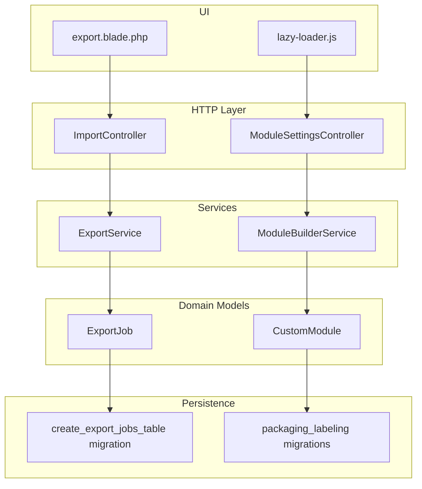
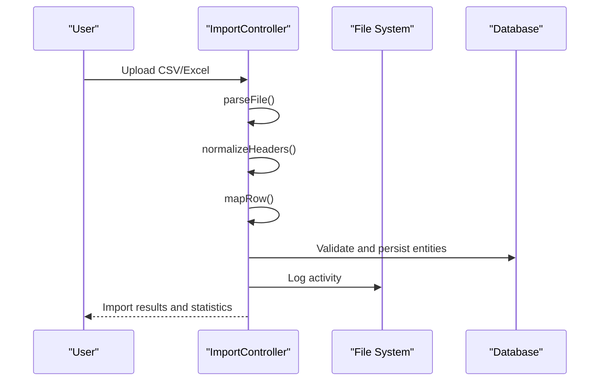
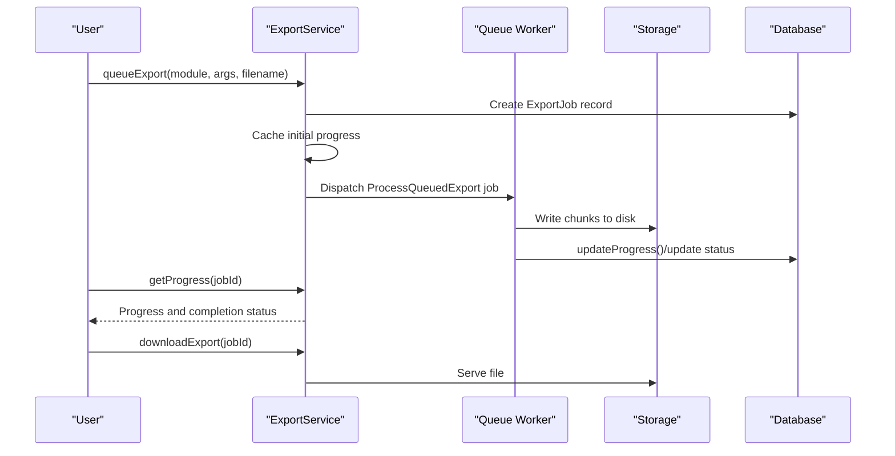
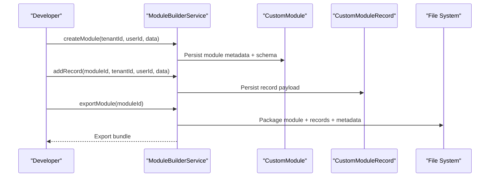
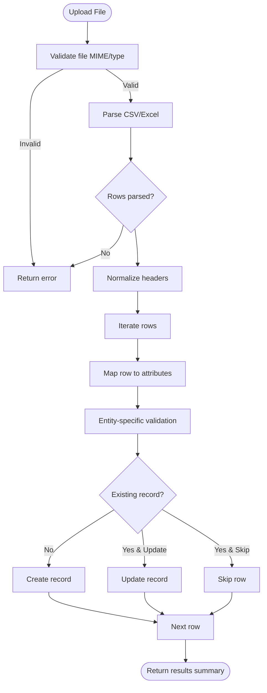
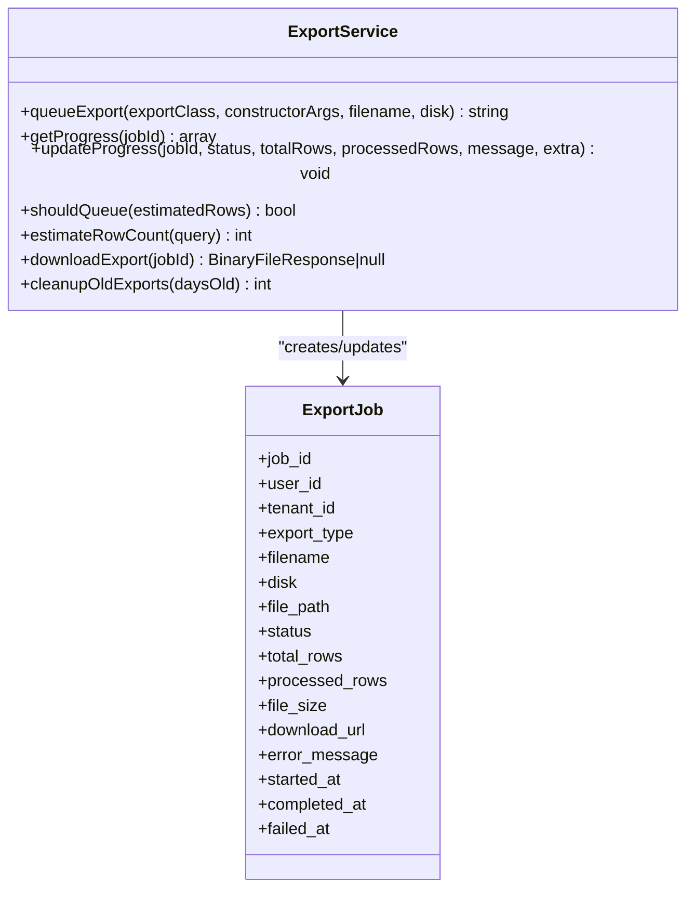
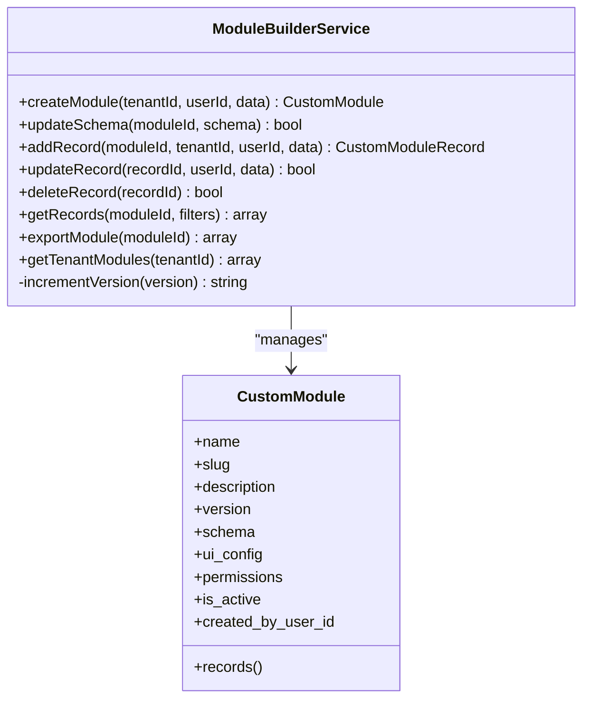
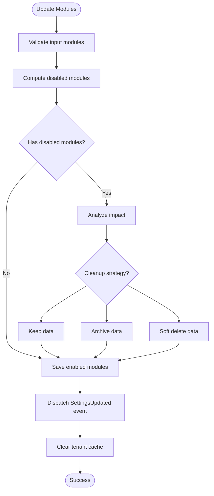
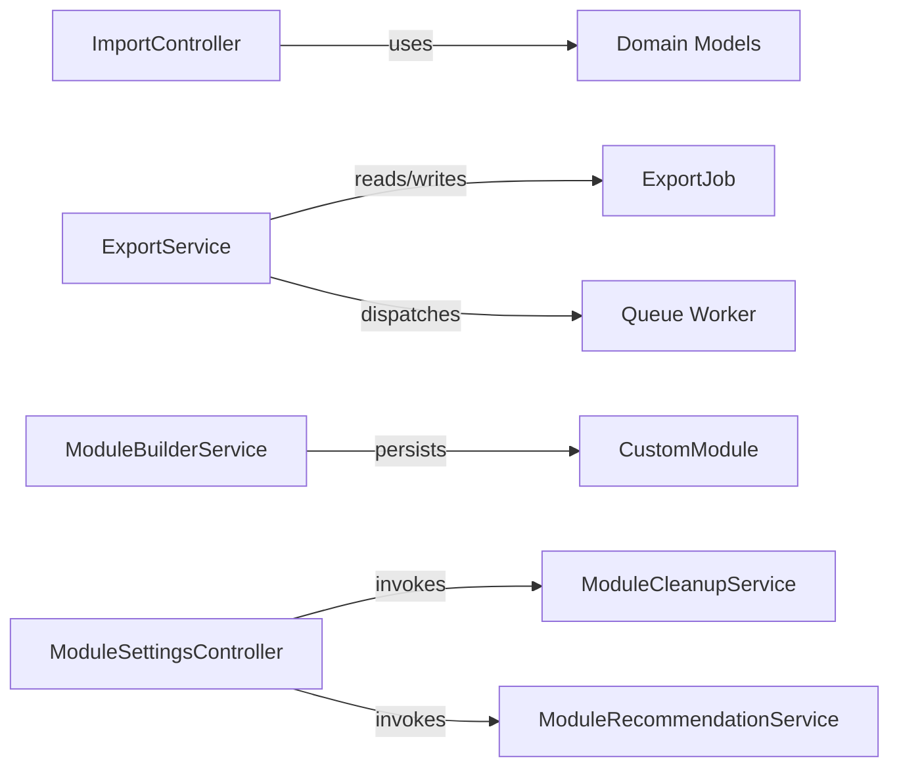

# Export & Import System

<cite>
**Referenced Files in This Document**
- [ImportController.php](file://app/Http/Controllers/ImportController.php)
- [ExportService.php](file://app/Services/ExportService.php)
- [ModuleBuilderService.php](file://app/Services/Marketplace/ModuleBuilderService.php)
- [ModuleSettingsController.php](file://app/Http/Controllers/ModuleSettingsController.php)
- [CustomModule.php](file://app/Models/CustomModule.php)
- [ExportJob.php](file://app/Models/ExportJob.php)
- [create_export_jobs_table.php](file://database/migrations/2026_04_08_001834_create_export_jobs_table.php)
- [2026_04_07_180000_create_packaging_labeling_tables.php](file://database/migrations/2026_04_07_180000_create_packaging_labeling_tables.php)
- [lazy-loader.js](file://resources/js/lazy-loader.js)
- [export.blade.php](file://resources/views/emr/export.blade.php)
</cite>

## Table of Contents
1. [Introduction](#introduction)
2. [Project Structure](#project-structure)
3. [Core Components](#core-components)
4. [Architecture Overview](#architecture-overview)
5. [Detailed Component Analysis](#detailed-component-analysis)
6. [Dependency Analysis](#dependency-analysis)
7. [Performance Considerations](#performance-considerations)
8. [Troubleshooting Guide](#troubleshooting-guide)
9. [Conclusion](#conclusion)
10. [Appendices](#appendices)

## Introduction
This document explains the module export and import system in the application. It covers:
- How modules are exported with schema preservation and record extraction
- How modules are packaged and prepared for distribution
- How modules are imported from external packages and migrated across environments
- Version compatibility and dependency resolution during imports
- Package format specification and metadata handling
- Validation and rollback mechanisms for failed imports
- Best practices for packaging and distributing modules

The system centers around a custom module engine with dedicated controllers, services, and models, alongside robust export infrastructure and import capabilities for structured data.

## Project Structure
The export/import system spans several layers:
- HTTP controllers for user-facing import/export actions
- Services for module packaging/export orchestration and progress tracking
- Models for module metadata and export job lifecycle
- Migrations defining persistent structures
- Frontend assets supporting dynamic module loading and export UI

**Diagram sources**
- [ImportController.php:16-765](file://app/Http/Controllers/ImportController.php#L16-L765)
- [ModuleSettingsController.php:12-158](file://app/Http/Controllers/ModuleSettingsController.php#L12-L158)
- [ModuleBuilderService.php:9-175](file://app/Services/Marketplace/ModuleBuilderService.php#L9-L175)
- [ExportService.php:17-244](file://app/Services/ExportService.php#L17-L244)
- [CustomModule.php:10-47](file://app/Models/CustomModule.php#L10-L47)
- [ExportJob.php:7-11](file://app/Models/ExportJob.php#L7-L11)
- [create_export_jobs_table.php:15-39](file://database/migrations/2026_04_08_001834_create_export_jobs_table.php#L15-L39)
- [2026_04_07_180000_create_packaging_labeling_tables.php:14-78](file://database/migrations/2026_04_07_180000_create_packaging_labeling_tables.php#L14-L78)
- [export.blade.php:158-188](file://resources/views/emr/export.blade.php#L158-L188)
- [lazy-loader.js:12-46](file://resources/js/lazy-loader.js#L12-L46)

**Section sources**
- [ImportController.php:16-765](file://app/Http/Controllers/ImportController.php#L16-L765)
- [ExportService.php:17-244](file://app/Services/ExportService.php#L17-L244)
- [ModuleBuilderService.php:9-175](file://app/Services/Marketplace/ModuleBuilderService.php#L9-L175)
- [ModuleSettingsController.php:12-158](file://app/Http/Controllers/ModuleSettingsController.php#L12-L158)
- [CustomModule.php:10-47](file://app/Models/CustomModule.php#L10-L47)
- [ExportJob.php:7-11](file://app/Models/ExportJob.php#L7-L11)
- [create_export_jobs_table.php:15-39](file://database/migrations/2026_04_08_001834_create_export_jobs_table.php#L15-L39)
- [2026_04_07_180000_create_packaging_labeling_tables.php:14-78](file://database/migrations/2026_04_07_180000_create_packaging_labeling_tables.php#L14-L78)
- [export.blade.php:158-188](file://resources/views/emr/export.blade.php#L158-L188)
- [lazy-loader.js:12-46](file://resources/js/lazy-loader.js#L12-L46)

## Core Components
- ImportController: Handles structured bulk imports for products, customers, suppliers, employees, warehouses, and chart of accounts. Provides CSV/Excel parsing, header normalization, validation, and per-entity creation/update logic with activity logging.
- ExportService: Manages large exports via queued jobs, progress tracking, and completion/download handling. Supports row estimation, queue thresholding, and cleanup of old export artifacts.
- ModuleBuilderService: Creates, updates, and manages custom modules, including schema versioning, record CRUD, and module export package assembly.
- CustomModule: Domain model storing module metadata, schema, UI configuration, permissions, and ownership.
- ExportJob: Tracks queued export jobs, status, counts, and downloadable artifacts.
- ModuleSettingsController: Manages module enable/disable lifecycle, cleanup strategies, and restoration of archived data.

**Section sources**
- [ImportController.php:30-123](file://app/Http/Controllers/ImportController.php#L30-L123)
- [ExportService.php:28-69](file://app/Services/ExportService.php#L28-L69)
- [ModuleBuilderService.php:14-30](file://app/Services/Marketplace/ModuleBuilderService.php#L14-L30)
- [CustomModule.php:14-32](file://app/Models/CustomModule.php#L14-L32)
- [ExportJob.php:7-11](file://app/Models/ExportJob.php#L7-L11)
- [ModuleSettingsController.php:34-103](file://app/Http/Controllers/ModuleSettingsController.php#L34-L103)

## Architecture Overview
The system integrates import/export workflows with module lifecycle management:

**Diagram sources**
- [ImportController.php:693-763](file://app/Http/Controllers/ImportController.php#L693-L763)

**Diagram sources**
- [ExportService.php:28-107](file://app/Services/ExportService.php#L28-L107)
- [create_export_jobs_table.php:15-39](file://database/migrations/2026_04_08_001834_create_export_jobs_table.php#L15-L39)

**Diagram sources**
- [ModuleBuilderService.php:14-147](file://app/Services/Marketplace/ModuleBuilderService.php#L14-L147)
- [CustomModule.php:14-32](file://app/Models/CustomModule.php#L14-L32)

## Detailed Component Analysis

### ImportController: Structured Data Import
Responsibilities:
- Accept CSV/Excel uploads with strict MIME/type validation
- Parse files (CSV/Excel) with BOM handling and fallback
- Normalize headers and map rows to entity attributes
- Enforce per-entity validation rules
- Create or update records based on mode selection
- Track activity logs and return import summaries

Key behaviors:
- File parsing helpers support UTF-8 BOM and mixed formats
- Header normalization ensures case-insensitive column matching
- Row mapping builds attribute arrays for persistence
- Per-entity validators ensure data integrity
- Update vs skip modes control existing record handling

**Diagram sources**
- [ImportController.php:30-123](file://app/Http/Controllers/ImportController.php#L30-L123)
- [ImportController.php:693-763](file://app/Http/Controllers/ImportController.php#L693-L763)

**Section sources**
- [ImportController.php:30-123](file://app/Http/Controllers/ImportController.php#L30-L123)
- [ImportController.php:693-763](file://app/Http/Controllers/ImportController.php#L693-L763)

### ExportService: Large Export Orchestration
Responsibilities:
- Queue exports for large datasets to prevent timeouts
- Track progress via cache and persistent job records
- Estimate row counts and decide queue eligibility
- Provide download URLs upon completion
- Clean up stale export artifacts

Key behaviors:
- Job ID generation and initial progress caching
- Persistent job updates for UI polling
- Threshold-based queue decision using configuration
- Safe file existence checks before serving downloads

**Diagram sources**
- [ExportService.php:28-242](file://app/Services/ExportService.php#L28-L242)
- [ExportJob.php:7-11](file://app/Models/ExportJob.php#L7-L11)
- [create_export_jobs_table.php:15-39](file://database/migrations/2026_04_08_001834_create_export_jobs_table.php#L15-L39)

**Section sources**
- [ExportService.php:28-242](file://app/Services/ExportService.php#L28-L242)
- [create_export_jobs_table.php:15-39](file://database/migrations/2026_04_08_001834_create_export_jobs_table.php#L15-L39)

### ModuleBuilderService: Module Export and Packaging
Responsibilities:
- Create modules with metadata, schema, UI config, and permissions
- Manage schema versioning and increment logic
- Add, update, and delete module records
- Export modules as packages including schema, UI config, and record counts
- Retrieve tenant modules and apply JSON filters

Key behaviors:
- Slug-based module identification
- Semantic version increments on schema changes
- Export package composition with metadata and timestamps
- JSON-based filtering for record retrieval

**Diagram sources**
- [ModuleBuilderService.php:14-174](file://app/Services/Marketplace/ModuleBuilderService.php#L14-L174)
- [CustomModule.php:14-46](file://app/Models/CustomModule.php#L14-L46)

**Section sources**
- [ModuleBuilderService.php:14-174](file://app/Services/Marketplace/ModuleBuilderService.php#L14-L174)
- [CustomModule.php:14-46](file://app/Models/CustomModule.php#L14-L46)

### ModuleSettingsController: Lifecycle Management and Cleanup
Responsibilities:
- Enable/disable modules per tenant with validation
- Analyze impact before disabling modules
- Trigger cleanup strategies (keep, archive, soft delete)
- Restore archived data when re-enabling modules
- Dispatch settings update events and clear caches

Key behaviors:
- Validates module slugs against recommended set
- Computes disabled modules and applies cleanup
- Logs cleanup actions and impacts
- Supports AJAX endpoints for impact analysis and cleanup summaries

**Diagram sources**
- [ModuleSettingsController.php:34-103](file://app/Http/Controllers/ModuleSettingsController.php#L34-L103)

**Section sources**
- [ModuleSettingsController.php:34-103](file://app/Http/Controllers/ModuleSettingsController.php#L34-L103)

### Frontend Integration: Dynamic Loading and Export UI
- lazy-loader.js: Provides dynamic import with retry, timeout, and loading/error callbacks for frontend modules.
- export.blade.php: Renders export UI with recent exports, templates, and guidelines.

**Section sources**
- [lazy-loader.js:12-46](file://resources/js/lazy-loader.js#L12-L46)
- [export.blade.php:158-188](file://resources/views/emr/export.blade.php#L158-L188)

## Dependency Analysis
- ImportController depends on Laravel validation, file parsing libraries, and domain models for each entity.
- ExportService depends on queue workers, cache, storage, and the ExportJob model.
- ModuleBuilderService depends on CustomModule and CustomModuleRecord models and handles JSON schema/versioning.
- ModuleSettingsController coordinates with cleanup and recommendation services and triggers cache invalidation.

**Diagram sources**
- [ImportController.php:16-765](file://app/Http/Controllers/ImportController.php#L16-L765)
- [ExportService.php:58-66](file://app/Services/ExportService.php#L58-L66)
- [ModuleBuilderService.php:14-30](file://app/Services/Marketplace/ModuleBuilderService.php#L14-L30)
- [ModuleSettingsController.php:53-72](file://app/Http/Controllers/ModuleSettingsController.php#L53-L72)

**Section sources**
- [ImportController.php:16-765](file://app/Http/Controllers/ImportController.php#L16-L765)
- [ExportService.php:58-66](file://app/Services/ExportService.php#L58-L66)
- [ModuleBuilderService.php:14-30](file://app/Services/Marketplace/ModuleBuilderService.php#L14-L30)
- [ModuleSettingsController.php:53-72](file://app/Http/Controllers/ModuleSettingsController.php#L53-L72)

## Performance Considerations
- Large exports are queued to avoid timeouts; progress is tracked in cache and persisted in ExportJob.
- Row count estimation helps decide whether to queue; thresholds can be tuned via configuration.
- CSV/Excel parsing includes BOM detection and fallback strategies to improve reliability.
- Indexes on ExportJob accelerate status and tenant queries.

[No sources needed since this section provides general guidance]

## Troubleshooting Guide
Common issues and remedies:
- Import file errors: Verify MIME type and size limits; ensure headers match expected columns; check for BOM in CSV files.
- Validation failures: Review entity-specific rules and correct malformed rows.
- Export timeouts: Use queue export for large datasets; monitor progress via job ID; confirm queue worker availability.
- Missing download: Confirm ExportJob status is completed and file exists on the configured disk.
- Module cleanup after disable: Choose appropriate strategy (keep/archive/soft delete) and verify impact analysis results.

**Section sources**
- [ImportController.php:30-123](file://app/Http/Controllers/ImportController.php#L30-L123)
- [ExportService.php:195-215](file://app/Services/ExportService.php#L195-L215)
- [ModuleSettingsController.php:48-73](file://app/Http/Controllers/ModuleSettingsController.php#L48-L73)

## Conclusion
The export/import system combines robust import workflows for structured data, scalable export orchestration, and a flexible module engine with packaging and lifecycle management. Together, these components provide a reliable foundation for sharing modules, validating imports, and migrating data across environments while preserving schema and metadata integrity.

[No sources needed since this section summarizes without analyzing specific files]

## Appendices

### Package Format Specification
A module export package includes:
- Metadata: name, slug, description, version, UI configuration
- Schema: JSON schema definition
- Records: Serialized records with tenant scoping
- Export metadata: record count, export timestamp

Best practices:
- Keep schema backward-compatible when possible
- Use semantic versioning and increment on schema changes
- Include comprehensive UI configuration for consistent rendering
- Validate record payloads against schema before export

**Section sources**
- [ModuleBuilderService.php:131-147](file://app/Services/Marketplace/ModuleBuilderService.php#L131-L147)
- [CustomModule.php:27-32](file://app/Models/CustomModule.php#L27-L32)

### Version Compatibility and Dependency Resolution
- Schema versioning is incremented automatically on schema updates.
- Module enable/disable lifecycle triggers cleanup strategies; impact analysis informs decisions.
- Frontend dynamic loading supports module-level retries and timeouts.

**Section sources**
- [ModuleBuilderService.php:164-173](file://app/Services/Marketplace/ModuleBuilderService.php#L164-L173)
- [ModuleSettingsController.php:48-73](file://app/Http/Controllers/ModuleSettingsController.php#L48-L73)
- [lazy-loader.js:28-42](file://resources/js/lazy-loader.js#L28-L42)

### Examples
- Exporting modules for sharing: Use the module builder’s export method to assemble a package with metadata and records.
- Importing community modules: Validate the package schema and UI configuration, then apply cleanup strategies if disabling existing modules.

**Section sources**
- [ModuleBuilderService.php:131-147](file://app/Services/Marketplace/ModuleBuilderService.php#L131-L147)
- [ModuleSettingsController.php:34-103](file://app/Http/Controllers/ModuleSettingsController.php#L34-L103)