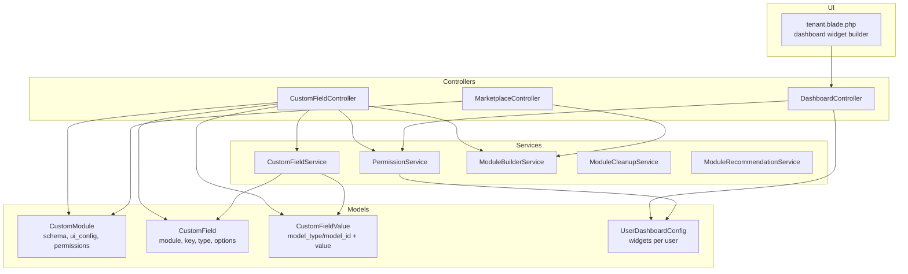
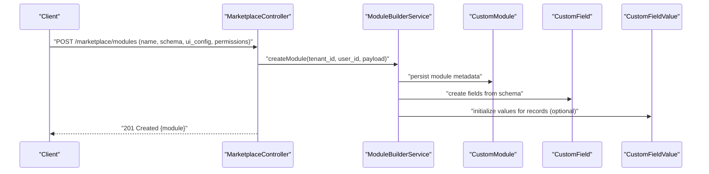
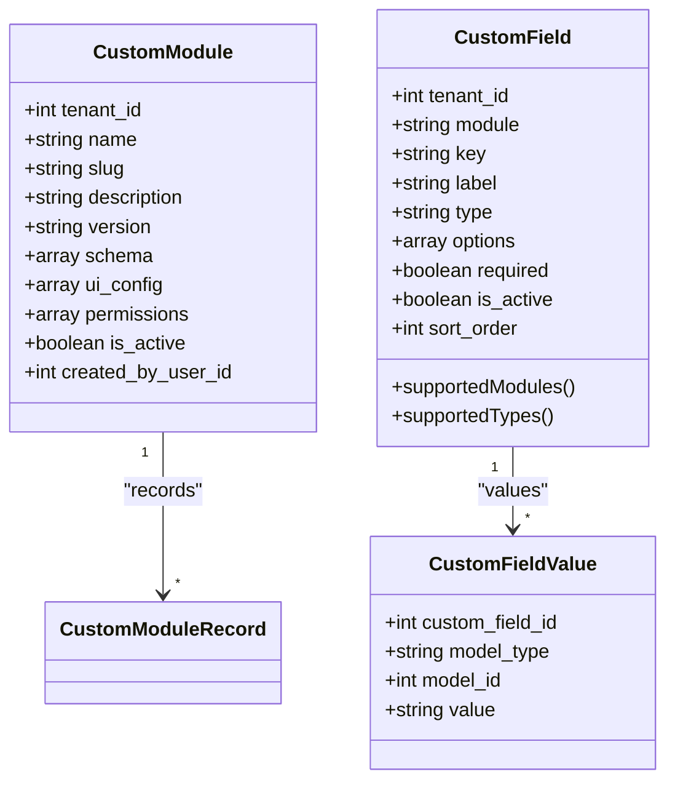
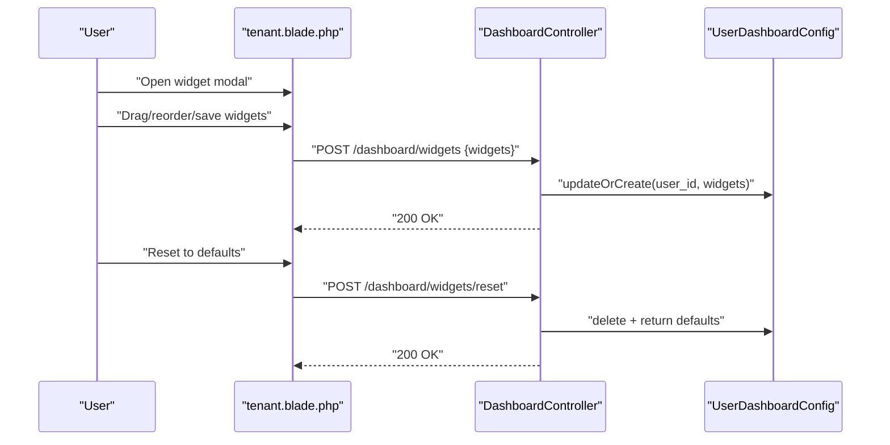
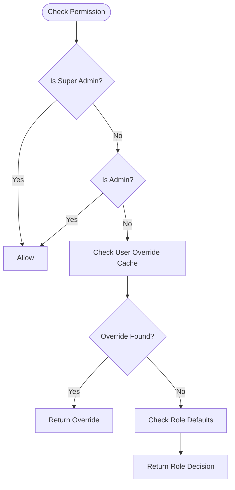
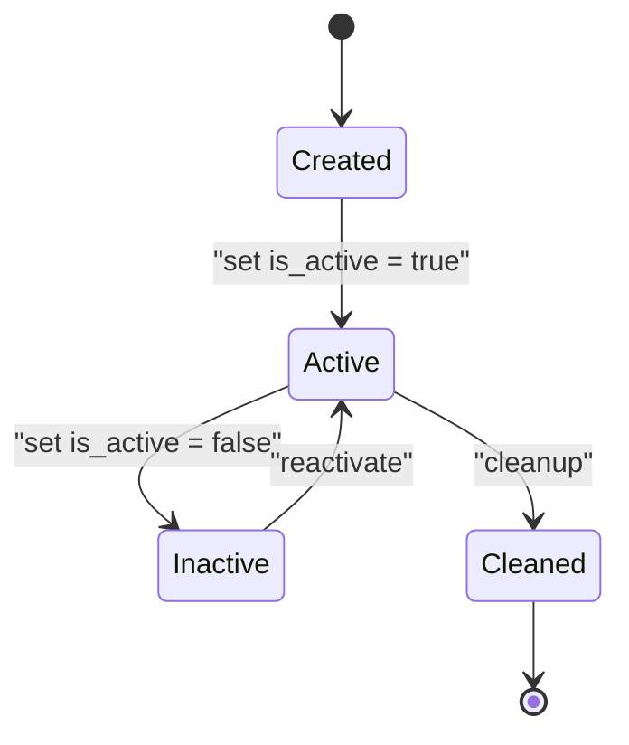
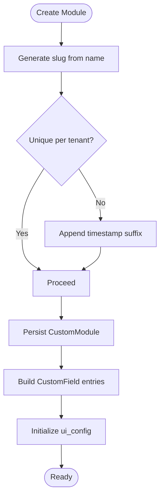
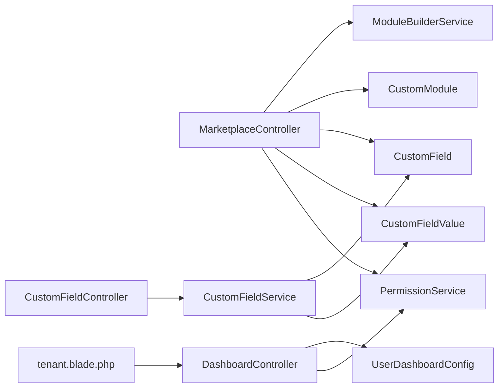

# Module Creation & Configuration

<cite>
**Referenced Files in This Document**
- [CustomModule.php](file://app/Models/CustomModule.php)
- [CustomField.php](file://app/Models/CustomField.php)
- [CustomFieldValue.php](file://app/Models/CustomFieldValue.php)
- [CustomFieldController.php](file://app/Http/Controllers/CustomFieldController.php)
- [CustomFieldService.php](file://app/Services/CustomFieldService.php)
- [PermissionService.php](file://app/Services/PermissionService.php)
- [User.php](file://app/Models/User.php)
- [UserDashboardConfig.php](file://app/Models/UserDashboardConfig.php)
- [DashboardController.php](file://app/Http/Controllers/DashboardController.php)
- [2026_04_01_000001_create_user_dashboard_configs_table.php](file://database/migrations/2026_04_01_000001_create_user_dashboard_configs_table.php)
- [MarketplaceController.php](file://app/Http/Controllers/Marketplace/MarketplaceController.php)
- [ModuleBuilderService.php](file://app/Services/Marketplace/ModuleBuilderService.php)
- [ModuleCleanupService.php](file://app/Services/ModuleCleanupService.php)
- [ModuleRecommendationService.php](file://app/Services/ModuleRecommendationService.php)
- [tenant.blade.php](file://resources/views/dashboard/tenant.blade.php)
</cite>

## Table of Contents
1. [Introduction](#introduction)
2. [Project Structure](#project-structure)
3. [Core Components](#core-components)
4. [Architecture Overview](#architecture-overview)
5. [Detailed Component Analysis](#detailed-component-analysis)
6. [Dependency Analysis](#dependency-analysis)
7. [Performance Considerations](#performance-considerations)
8. [Troubleshooting Guide](#troubleshooting-guide)
9. [Conclusion](#conclusion)
10. [Appendices](#appendices)

## Introduction
This document explains how modules are created, configured, and managed within the system. It covers:
- Schema definition for dynamic modules, including field types, validation, and relationship mapping
- UI configuration for forms, lists, and dashboards
- Permission system with role-based access control and tenant isolation
- Module lifecycle from creation to activation/deactivation
- Practical examples for inventory tracking, customer management, and project management modules
- Slug generation, version management, and dependency handling

## Project Structure
The module system spans models, controllers, services, and UI components:
- Models define the schema and relationships for modules and custom fields
- Controllers handle requests for module creation, schema updates, and custom field management
- Services encapsulate business logic for permissions, custom fields, and marketplace module building
- UI views support dashboard customization and widget management

**Diagram sources**
- [CustomModule.php:10-46](file://app/Models/CustomModule.php#L10-L46)
- [CustomField.php:11-55](file://app/Models/CustomField.php#L11-L55)
- [CustomFieldValue.php](file://app/Models/CustomFieldValue.php)
- [CustomFieldController.php:9-115](file://app/Http/Controllers/CustomFieldController.php#L9-L115)
- [CustomFieldService.php:14-116](file://app/Services/CustomFieldService.php#L14-L116)
- [PermissionService.php:9-422](file://app/Services/PermissionService.php#L9-L422)
- [UserDashboardConfig.php:8-20](file://app/Models/UserDashboardConfig.php#L8-L20)
- [DashboardController.php:714-755](file://app/Http/Controllers/DashboardController.php#L714-L755)
- [tenant.blade.php:227-913](file://resources/views/dashboard/tenant.blade.php#L227-L913)

**Section sources**
- [CustomModule.php:10-46](file://app/Models/CustomModule.php#L10-L46)
- [CustomField.php:11-55](file://app/Models/CustomField.php#L11-L55)
- [CustomFieldController.php:9-115](file://app/Http/Controllers/CustomFieldController.php#L9-L115)
- [CustomFieldService.php:14-116](file://app/Services/CustomFieldService.php#L14-L116)
- [PermissionService.php:9-422](file://app/Services/PermissionService.php#L9-L422)
- [UserDashboardConfig.php:8-20](file://app/Models/UserDashboardConfig.php#L8-L20)
- [DashboardController.php:714-755](file://app/Http/Controllers/DashboardController.php#L714-L755)
- [tenant.blade.php:227-913](file://resources/views/dashboard/tenant.blade.php#L227-L913)

## Core Components
- CustomModule: Stores module metadata (name, slug, description, version), schema, UI configuration, and permissions. It belongs to a tenant and tracks created_by_user_id.
- CustomField: Defines per-module, tenant-scoped fields with type, options, sort order, and required flag.
- CustomFieldValue: Stores values for a given model instance keyed by field key.
- CustomFieldService: Provides field retrieval, validation, and value persistence with tenant/module scoping and caching.
- PermissionService: Centralizes module/action permissions, role defaults, per-user overrides, and caching.
- UserDashboardConfig: Persists per-user dashboard widget configurations.
- MarketplaceController and ModuleBuilderService: Enable creating/updating modules via API and building module artifacts.

**Section sources**
- [CustomModule.php:10-46](file://app/Models/CustomModule.php#L10-L46)
- [CustomField.php:11-55](file://app/Models/CustomField.php#L11-L55)
- [CustomFieldValue.php](file://app/Models/CustomFieldValue.php)
- [CustomFieldService.php:14-116](file://app/Services/CustomFieldService.php#L14-L116)
- [PermissionService.php:9-422](file://app/Services/PermissionService.php#L9-L422)
- [UserDashboardConfig.php:8-20](file://app/Models/UserDashboardConfig.php#L8-L20)
- [MarketplaceController.php:337-382](file://app/Http/Controllers/Marketplace/MarketplaceController.php#L337-L382)
- [ModuleBuilderService.php](file://app/Services/Marketplace/ModuleBuilderService.php)

## Architecture Overview
The module creation and configuration pipeline integrates controllers, services, and models to support dynamic schemas, UI customization, and permissions.

**Diagram sources**
- [MarketplaceController.php:337-382](file://app/Http/Controllers/Marketplace/MarketplaceController.php#L337-L382)
- [ModuleBuilderService.php](file://app/Services/Marketplace/ModuleBuilderService.php)
- [CustomModule.php:10-46](file://app/Models/CustomModule.php#L10-L46)
- [CustomField.php:11-55](file://app/Models/CustomField.php#L11-L55)
- [CustomFieldValue.php](file://app/Models/CustomFieldValue.php)

## Detailed Component Analysis

### Schema Definition System
Dynamic modules are defined by a JSON schema stored in CustomModule.schema. The system supports:
- Field types: text, number, date, select, checkbox, textarea
- Validation rules: required flags per field
- Relationship mapping: module references and foreign keys are declared in the schema
- Tenant isolation: all module and field records are scoped to tenant_id

Key behaviors:
- Supported modules and field types are enumerated in CustomField.supportedModules and CustomField.supportedTypes
- CustomFieldService.getFields retrieves active fields ordered by sort_order and caches them
- CustomFieldService.validate enforces required fields during save
- CustomFieldController.store generates a stable key from label and ensures uniqueness per module

**Diagram sources**
- [CustomModule.php:10-46](file://app/Models/CustomModule.php#L10-L46)
- [CustomField.php:11-55](file://app/Models/CustomField.php#L11-L55)
- [CustomFieldValue.php](file://app/Models/CustomFieldValue.php)

**Section sources**
- [CustomField.php:28-54](file://app/Models/CustomField.php#L28-L54)
- [CustomFieldService.php:19-92](file://app/Services/CustomFieldService.php#L19-L92)
- [CustomFieldController.php:29-74](file://app/Http/Controllers/CustomFieldController.php#L29-L74)

### UI Configuration Options
The system supports:
- Form customization: schema-driven rendering and validation
- List customization: column visibility and ordering controlled via ui_config
- Dashboard customization: per-user widget configuration persisted in UserDashboardConfig

User dashboard customization flow:
- Users open the widget modal and toggle/resize widgets
- Changes are saved via DashboardController.updateWidgets
- Defaults are restored per role using DashboardController.resetWidgets
- The tenant dashboard view renders widgets and exposes builder actions

**Diagram sources**
- [tenant.blade.php:227-913](file://resources/views/dashboard/tenant.blade.php#L227-L913)
- [DashboardController.php:714-755](file://app/Http/Controllers/DashboardController.php#L714-L755)
- [UserDashboardConfig.php:8-20](file://app/Models/UserDashboardConfig.php#L8-L20)
- [2026_04_01_000001_create_user_dashboard_configs_table.php:11-16](file://database/migrations/2026_04_01_000001_create_user_dashboard_configs_table.php#L11-L16)

**Section sources**
- [tenant.blade.php:227-913](file://resources/views/dashboard/tenant.blade.php#L227-L913)
- [DashboardController.php:714-755](file://app/Http/Controllers/DashboardController.php#L714-L755)
- [UserDashboardConfig.php:8-20](file://app/Models/UserDashboardConfig.php#L8-L20)

### Permission System Setup
The permission system provides:
- Module/action matrix: modules such as customers, products, sales, inventory, projects, etc.
- Role defaults: admin/*, manager, staff, gudang, kasir, etc.
- Per-user overrides: cached per-user grants
- Tenant isolation: all permissions scoped to tenant_id

**Diagram sources**
- [PermissionService.php:207-227](file://app/Services/PermissionService.php#L207-L227)
- [PermissionService.php:232-251](file://app/Services/PermissionService.php#L232-L251)
- [PermissionService.php:256-265](file://app/Services/PermissionService.php#L256-L265)

**Section sources**
- [PermissionService.php:14-81](file://app/Services/PermissionService.php#L14-L81)
- [PermissionService.php:89-201](file://app/Services/PermissionService.php#L89-L201)
- [PermissionService.php:207-265](file://app/Services/PermissionService.php#L207-L265)
- [User.php:187-229](file://app/Models/User.php#L187-L229)

### Module Lifecycle
Lifecycle stages:
- Creation: MarketplaceController.createModule validates payload and delegates to ModuleBuilderService to persist CustomModule, fields, and initial UI config
- Activation/Deactivation: CustomModule.is_active toggles module availability; related UI and permissions reflect this state
- Cleanup: ModuleCleanupService removes module artifacts and associated data
- Recommendations: ModuleRecommendationService suggests related modules based on tenant context

**Diagram sources**
- [MarketplaceController.php:337-382](file://app/Http/Controllers/Marketplace/MarketplaceController.php#L337-L382)
- [ModuleBuilderService.php](file://app/Services/Marketplace/ModuleBuilderService.php)
- [ModuleCleanupService.php](file://app/Services/ModuleCleanupService.php)
- [ModuleRecommendationService.php](file://app/Services/ModuleRecommendationService.php)

**Section sources**
- [MarketplaceController.php:337-382](file://app/Http/Controllers/Marketplace/MarketplaceController.php#L337-L382)
- [ModuleBuilderService.php](file://app/Services/Marketplace/ModuleBuilderService.php)
- [ModuleCleanupService.php](file://app/Services/ModuleCleanupService.php)
- [ModuleRecommendationService.php](file://app/Services/ModuleRecommendationService.php)

### Practical Examples

#### Inventory Tracking Module
- Schema fields: product_id, quantity_on_hand, location_zone, last_updated
- UI config: list columns for product name, quantity, zone; form includes product lookup and quantity adjustment
- Permissions: gudang role can create/edit/delete; staff can view
- Custom fields: optional batch_number (select), expiry_date (date), shelf_life_days (number)

Implementation touchpoints:
- Define schema in CustomModule.schema
- Use CustomFieldService to enforce required fields and persist values
- Apply permissions via PermissionService roles

**Section sources**
- [CustomFieldService.php:79-92](file://app/Services/CustomFieldService.php#L79-L92)
- [PermissionService.php:185-200](file://app/Services/PermissionService.php#L185-L200)

#### Customer Management Module
- Schema fields: customer_id, name, email, phone, account_balance, created_at
- UI config: searchable list with filters; form includes contact details and balance summary
- Permissions: manager and sales roles can create/edit; staff can view
- Custom fields: preferred_payment_terms (text), credit_limit (number), risk_score (number)

**Section sources**
- [PermissionService.php:92-150](file://app/Services/PermissionService.php#L92-L150)

#### Project Management Module
- Schema fields: project_id, title, description, start_date, end_date, status, budget, spent
- UI config: timeline view, status cards, budget vs spent chart
- Permissions: project managers can edit budgets; staff can view tasks; approvals required for budget changes
- Custom fields: project_manager (select), department (select), priority (select)

**Section sources**
- [PermissionService.php:127-149](file://app/Services/PermissionService.php#L127-L149)

### Slug Generation, Version Management, and Dependencies
- Slug generation: CustomFieldController.store derives a URL-safe key from label and appends timestamp if duplicates exist
- Version management: Modules support a semantic-like version string; services like SafetyDataSheet demonstrate version increment patterns (e.g., numeric increments)
- Dependencies: ModuleBuilderService coordinates creation of dependent artifacts (fields, UI configs, permissions) and can integrate with marketplace dependency resolution

**Diagram sources**
- [CustomFieldController.php:40-51](file://app/Http/Controllers/CustomFieldController.php#L40-L51)
- [CustomModule.php:14-25](file://app/Models/CustomModule.php#L14-L25)
- [SafetyDataSheet.php:75-90](file://app/Models/SafetyDataSheet.php#L75-L90)

**Section sources**
- [CustomFieldController.php:40-51](file://app/Http/Controllers/CustomFieldController.php#L40-L51)
- [CustomModule.php:14-25](file://app/Models/CustomModule.php#L14-L25)
- [SafetyDataSheet.php:75-90](file://app/Models/SafetyDataSheet.php#L75-L90)

## Dependency Analysis
- Controllers depend on services for business logic and on models for persistence
- Services encapsulate cross-cutting concerns (permissions, caching, validation)
- UI depends on controller endpoints and model-backed configuration

**Diagram sources**
- [MarketplaceController.php:337-382](file://app/Http/Controllers/Marketplace/MarketplaceController.php#L337-L382)
- [ModuleBuilderService.php](file://app/Services/Marketplace/ModuleBuilderService.php)
- [CustomModule.php:10-46](file://app/Models/CustomModule.php#L10-L46)
- [CustomField.php:11-55](file://app/Models/CustomField.php#L11-L55)
- [CustomFieldValue.php](file://app/Models/CustomFieldValue.php)
- [CustomFieldController.php:9-115](file://app/Http/Controllers/CustomFieldController.php#L9-L115)
- [CustomFieldService.php:14-116](file://app/Services/CustomFieldService.php#L14-L116)
- [DashboardController.php:714-755](file://app/Http/Controllers/DashboardController.php#L714-L755)
- [UserDashboardConfig.php:8-20](file://app/Models/UserDashboardConfig.php#L8-L20)
- [tenant.blade.php:227-913](file://resources/views/dashboard/tenant.blade.php#L227-L913)

**Section sources**
- [MarketplaceController.php:337-382](file://app/Http/Controllers/Marketplace/MarketplaceController.php#L337-L382)
- [CustomFieldController.php:9-115](file://app/Http/Controllers/CustomFieldController.php#L9-L115)
- [DashboardController.php:714-755](file://app/Http/Controllers/DashboardController.php#L714-L755)

## Performance Considerations
- Cache field definitions per tenant/module to reduce DB queries
- Use pagination and filtering for large module lists
- Index tenant_id on module and field tables for tenant isolation
- Minimize UI re-renders by batching widget updates

## Troubleshooting Guide
- Custom field key conflicts: ensure unique keys per module; the controller appends timestamp if duplicate detected
- Required field validation failures: verify CustomField.required flags and CustomFieldService.validate logic
- Permission denials: confirm user role defaults and per-user overrides; check cache invalidation after permission changes
- Dashboard widget resets: confirm defaults returned by role and UserDashboardConfig deletion

**Section sources**
- [CustomFieldController.php:44-51](file://app/Http/Controllers/CustomFieldController.php#L44-L51)
- [CustomFieldService.php:79-92](file://app/Services/CustomFieldService.php#L79-L92)
- [PermissionService.php:232-251](file://app/Services/PermissionService.php#L232-L251)
- [DashboardController.php:731-741](file://app/Http/Controllers/DashboardController.php#L731-L741)

## Conclusion
The module system provides a flexible, tenant-isolated framework for defining dynamic schemas, configuring UI layouts, enforcing granular permissions, and managing lifecycles. By leveraging services and models consistently, teams can rapidly build specialized modules such as inventory tracking, customer management, and project management while maintaining strong governance and performance.

## Appendices
- Example endpoints:
  - POST /marketplace/modules (payload includes name, description, version, schema, ui_config, permissions)
  - PUT /marketplace/modules/{id}/schema (schema update)
  - POST /marketplace/modules/{id}/records (add record)
- Example UI flows:
  - Dashboard widget builder and saver
  - Custom field management per module