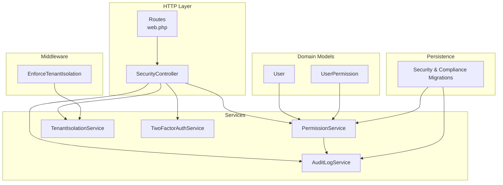
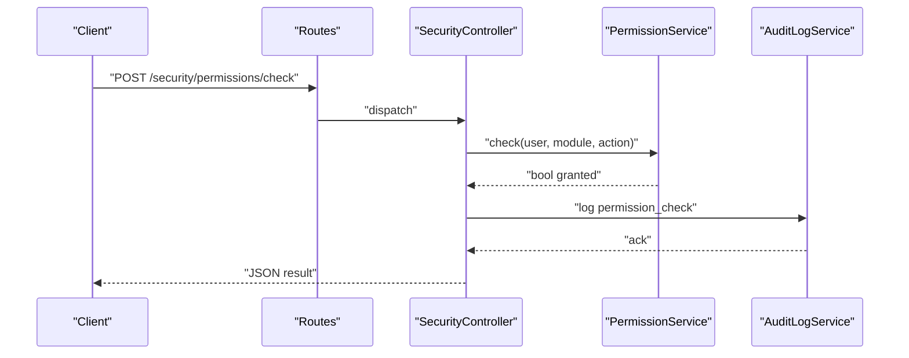
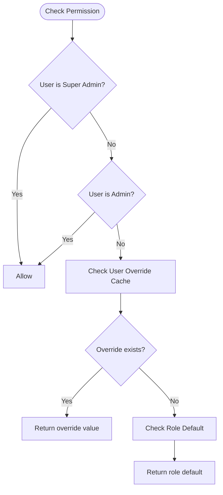
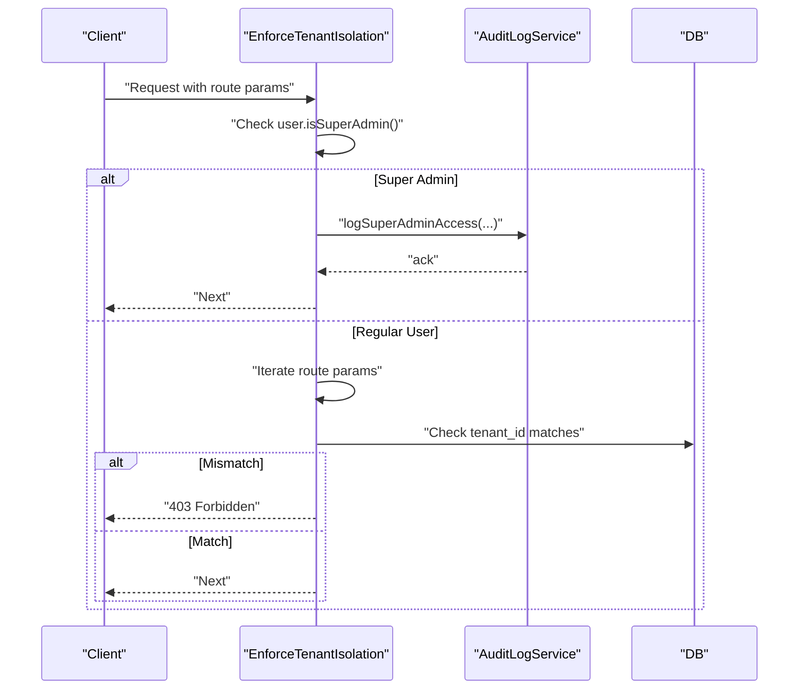
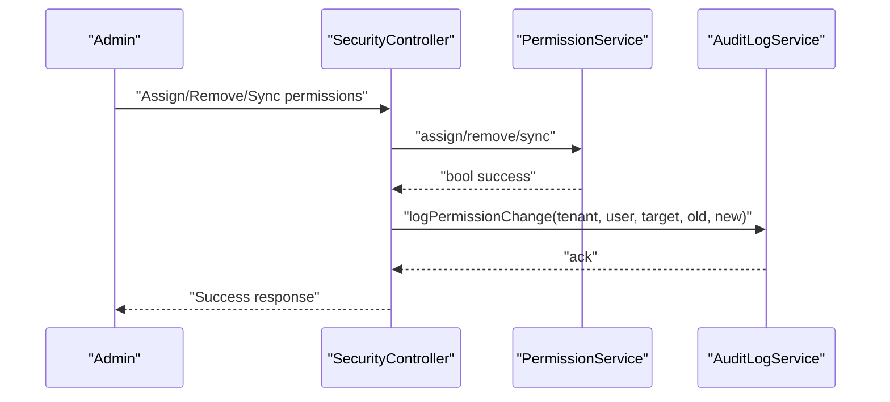
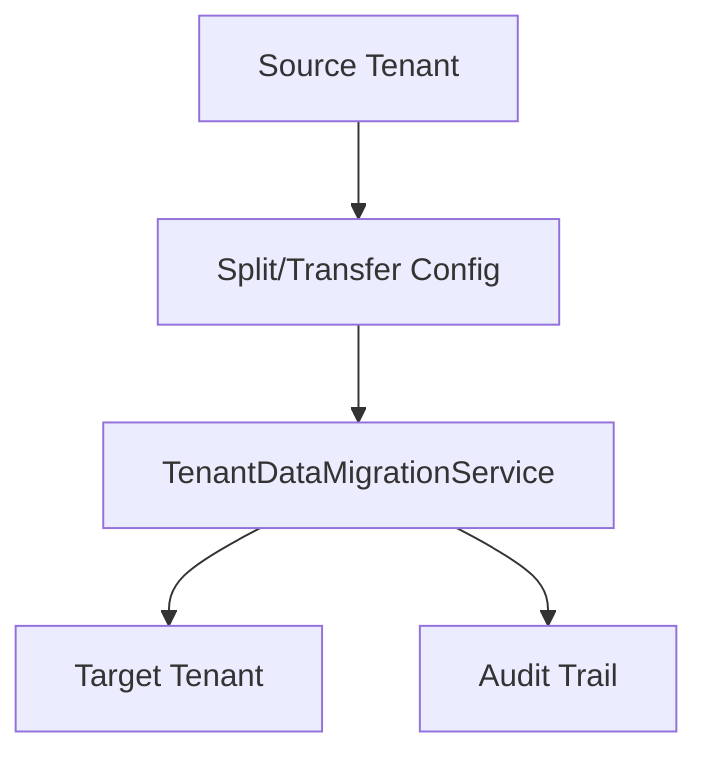
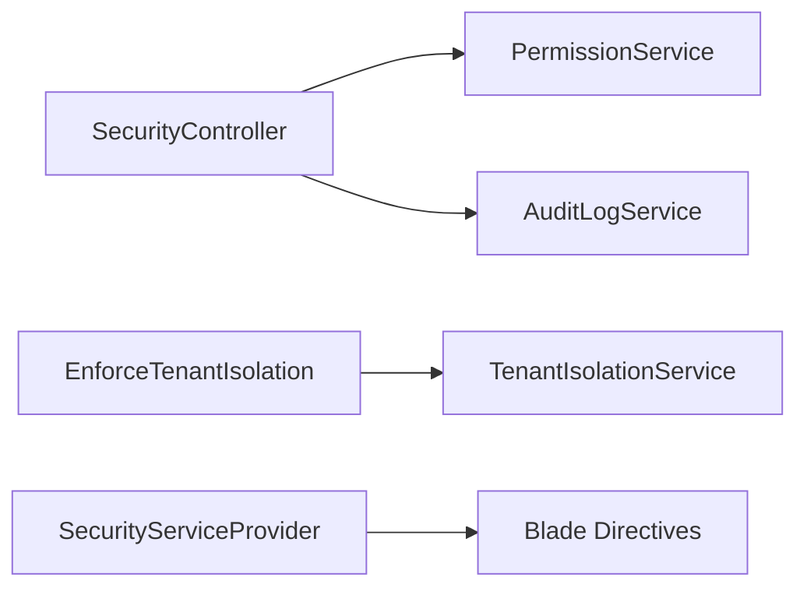
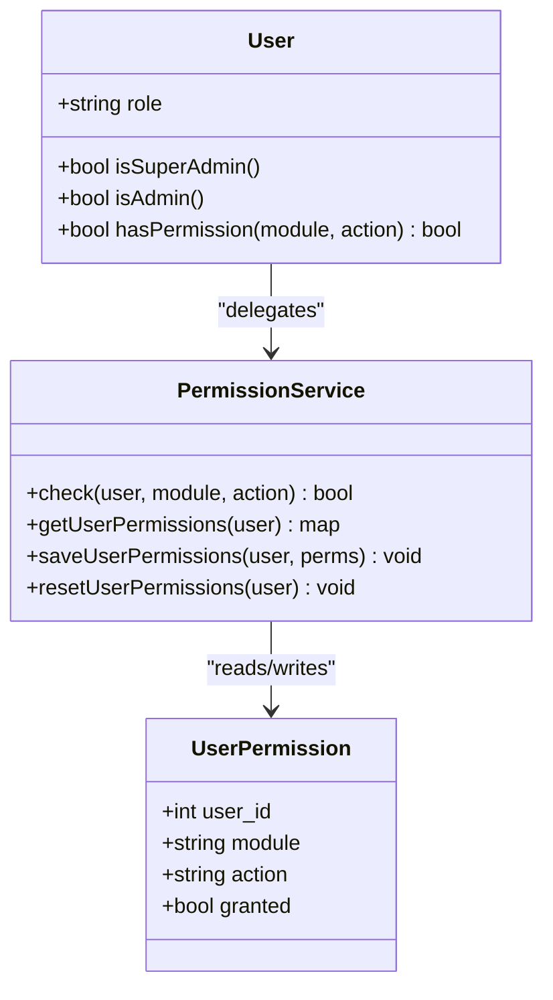
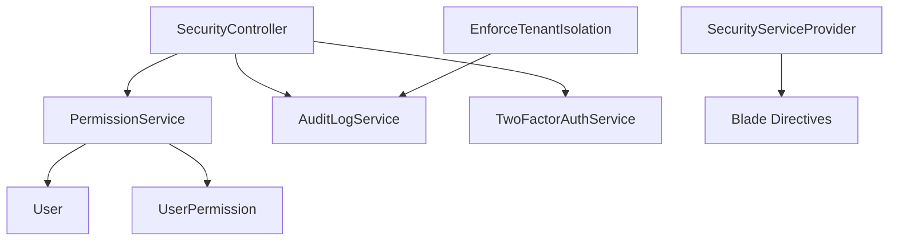

# Permission & Security Controls

<cite>
**Referenced Files in This Document**
- [PermissionService.php](file://app/Services/PermissionService.php)
- [SecurityController.php](file://app/Http/Controllers/Security/SecurityController.php)
- [web.php](file://routes/web.php)
- [EnforceTenantIsolation.php](file://app/Http/Middleware/EnforceTenantIsolation.php)
- [TenantIsolationService.php](file://app/Services/TenantIsolationService.php)
- [User.php](file://app/Models/User.php)
- [UserPermission.php](file://app/Models/UserPermission.php)
- [AuditLogService.php](file://app/Services/Security/AuditLogService.php)
- [SecurityServiceProvider.php](file://app/Providers/SecurityServiceProvider.php)
- [2026_04_06_110000_create_security_compliance_tables.php](file://database/migrations/2026_04_06_110000_create_security_compliance_tables.php)
- [2026_04_08_1400001_create_regulatory_compliance_tables.php](file://database/migrations/2026_04_08_1400001_create_regulatory_compliance_tables.php)
- [TwoFactorAuthService.php](file://app/Services/Security/TwoFactorAuthService.php)
- [TenantDataMigrationService.php](file://app/Services/TenantDataMigrationService.php)
- [RegulatoryComplianceService.php](file://app/Services/RegulatoryComplianceService.php)
- [permissions.blade.php](file://resources/views/tenant/users/permissions.blade.php)
</cite>

## Table of Contents
1. [Introduction](#introduction)
2. [Project Structure](#project-structure)
3. [Core Components](#core-components)
4. [Architecture Overview](#architecture-overview)
5. [Detailed Component Analysis](#detailed-component-analysis)
6. [Dependency Analysis](#dependency-analysis)
7. [Performance Considerations](#performance-considerations)
8. [Troubleshooting Guide](#troubleshooting-guide)
9. [Conclusion](#conclusion)
10. [Appendices](#appendices)

## Introduction
This document explains the permission and security system for custom modules within the ERP. It covers role-based access control (RBAC), granular permission checks, tenant isolation, multi-tenancy safeguards, user assignment and permission inheritance, validation integration with the broader ERP security framework, audit logging, and best practices for secure custom module development and deployment.

## Project Structure
The security and permission system spans services, middleware, controllers, models, migrations, and views:
- Services encapsulate permission evaluation, tenant isolation enforcement, audit logging, and two-factor authentication.
- Middleware enforces tenant boundaries on requests.
- Controllers expose endpoints for permission management and security operations.
- Models represent users, permissions, and tenant-scoped overrides.
- Migrations define the schema for permissions, audit trails, and compliance artifacts.
- Views render permission matrices and overrides for administrators.

**Diagram sources**
- [web.php:2603-2661](file://routes/web.php#L2603-L2661)
- [SecurityController.php:15-38](file://app/Http/Controllers/Security/SecurityController.php#L15-L38)
- [PermissionService.php:9-277](file://app/Services/PermissionService.php#L9-L277)
- [TenantIsolationService.php:16-67](file://app/Services/TenantIsolationService.php#L16-L67)
- [AuditLogService.php:79-125](file://app/Services/Security/AuditLogService.php#L79-L125)
- [TwoFactorAuthService.php:10-49](file://app/Services/Security/TwoFactorAuthService.php#L10-L49)
- [User.php:15-280](file://app/Models/User.php#L15-L280)
- [UserPermission.php:10-22](file://app/Models/UserPermission.php#L10-L22)
- [EnforceTenantIsolation.php:19-226](file://app/Http/Middleware/EnforceTenantIsolation.php#L19-L226)
- [2026_04_06_110000_create_security_compliance_tables.php:207-241](file://database/migrations/2026_04_06_110000_create_security_compliance_tables.php#L207-L241)
- [2026_04_08_1400001_create_regulatory_compliance_tables.php:58-122](file://database/migrations/2026_04_08_1400001_create_regulatory_compliance_tables.php#L58-L122)

**Section sources**
- [web.php:2603-2661](file://routes/web.php#L2603-L2661)
- [SecurityController.php:15-38](file://app/Http/Controllers/Security/SecurityController.php#L15-L38)
- [PermissionService.php:9-277](file://app/Services/PermissionService.php#L9-L277)
- [TenantIsolationService.php:16-67](file://app/Services/TenantIsolationService.php#L16-L67)
- [AuditLogService.php:79-125](file://app/Services/Security/AuditLogService.php#L79-L125)
- [TwoFactorAuthService.php:10-49](file://app/Services/Security/TwoFactorAuthService.php#L10-L49)
- [User.php:15-280](file://app/Models/User.php#L15-L280)
- [UserPermission.php:10-22](file://app/Models/UserPermission.php#L10-L22)
- [EnforceTenantIsolation.php:19-226](file://app/Http/Middleware/EnforceTenantIsolation.php#L19-L226)
- [2026_04_06_110000_create_security_compliance_tables.php:207-241](file://database/migrations/2026_04_06_110000_create_security_compliance_tables.php#L207-L241)
- [2026_04_08_1400001_create_regulatory_compliance_tables.php:58-122](file://database/migrations/2026_04_08_1400001_create_regulatory_compliance_tables.php#L58-L122)

## Core Components
- PermissionService: Implements granular RBAC with role defaults, per-user overrides, caching, and permission seeding. Supports wildcard grants for admin roles and explicit deny for super admins.
- TenantIsolationService and EnforceTenantIsolation middleware: Enforce tenant boundary checks on model retrieval and route parameters, with audit logging for super admin cross-tenant access.
- AuditLogService: Centralized event logging for permission changes and other security events.
- SecurityController: Exposes endpoints for permission management and security operations.
- User and UserPermission models: Tie users to tenant-scoped overrides for fine-grained control.
- SecurityServiceProvider: Registers output escaping Blade directives for XSS prevention.

**Section sources**
- [PermissionService.php:9-277](file://app/Services/PermissionService.php#L9-L277)
- [TenantIsolationService.php:16-67](file://app/Services/TenantIsolationService.php#L16-L67)
- [EnforceTenantIsolation.php:19-226](file://app/Http/Middleware/EnforceTenantIsolation.php#L19-L226)
- [AuditLogService.php:79-125](file://app/Services/Security/AuditLogService.php#L79-L125)
- [SecurityController.php:15-38](file://app/Http/Controllers/Security/SecurityController.php#L15-L38)
- [User.php:15-280](file://app/Models/User.php#L15-L280)
- [UserPermission.php:10-22](file://app/Models/UserPermission.php#L10-L22)
- [SecurityServiceProvider.php:12-53](file://app/Providers/SecurityServiceProvider.php#L12-L53)

## Architecture Overview
The system integrates RBAC with tenant isolation and audit logging. Controllers delegate permission checks to PermissionService, which evaluates role defaults, per-user overrides, and caches results. Middleware ensures tenant boundaries are enforced for route-bound models. Audit logs capture permission changes and super admin cross-tenant access for compliance.

**Diagram sources**
- [web.php:2648-2656](file://routes/web.php#L2648-L2656)
- [SecurityController.php:15-38](file://app/Http/Controllers/Security/SecurityController.php#L15-L38)
- [PermissionService.php:207-227](file://app/Services/PermissionService.php#L207-L227)
- [AuditLogService.php:79-125](file://app/Services/Security/AuditLogService.php#L79-L125)

## Detailed Component Analysis

### PermissionService: RBAC and Inheritance
- Role-based defaults: Roles define baseline permissions per module/action.
- Per-user overrides: Tenant-scoped UserPermission entries override role defaults for specific users.
- Caching: Role and grouped permission caches reduce database load.
- Wildcards: Admin roles receive blanket permissions; super admin bypasses checks entirely.
- Validation: Only recognized modules/actions are processed.

**Diagram sources**
- [PermissionService.php:207-227](file://app/Services/PermissionService.php#L207-L227)
- [PermissionService.php:232-251](file://app/Services/PermissionService.php#L232-L251)
- [PermissionService.php:256-265](file://app/Services/PermissionService.php#L256-L265)

**Section sources**
- [PermissionService.php:9-277](file://app/Services/PermissionService.php#L9-L277)
- [User.php:262-265](file://app/Models/User.php#L262-L265)
- [UserPermission.php:10-22](file://app/Models/UserPermission.php#L10-L22)

### TenantIsolationService and Middleware
- TenantIsolationService: Provides safe lookup and ownership assertion helpers with violation logging.
- EnforceTenantIsolation middleware: Validates route model bindings against tenant_id, allows super admin with audit trail, and applies strict checks for tenant-aware models.

**Diagram sources**
- [EnforceTenantIsolation.php:28-159](file://app/Http/Middleware/EnforceTenantIsolation.php#L28-L159)
- [EnforceTenantIsolation.php:164-224](file://app/Http/Middleware/EnforceTenantIsolation.php#L164-L224)
- [TenantIsolationService.php:25-56](file://app/Services/TenantIsolationService.php#L25-L56)

**Section sources**
- [TenantIsolationService.php:16-67](file://app/Services/TenantIsolationService.php#L16-L67)
- [EnforceTenantIsolation.php:19-226](file://app/Http/Middleware/EnforceTenantIsolation.php#L19-L226)

### Audit Logging for Permission Changes and Access Attempts
- Permission change logging: AuditLogService captures old/new permission sets for compliance review.
- Access logging: Enhanced audit logs track permission checks and other security-relevant events.
- Regulatory compliance: Access violation tracking and immutability policies are supported by dedicated tables.

**Diagram sources**
- [AuditLogService.php:86-103](file://app/Services/Security/AuditLogService.php#L86-L103)
- [PermissionService.php:86-156](file://app/Services/PermissionService.php#L86-L156)
- [web.php:2648-2656](file://routes/web.php#L2648-L2656)

**Section sources**
- [AuditLogService.php:79-125](file://app/Services/Security/AuditLogService.php#L79-L125)
- [2026_04_06_110000_create_security_compliance_tables.php:207-241](file://database/migrations/2026_04_06_110000_create_security_compliance_tables.php#L207-L241)
- [2026_04_08_1400001_create_regulatory_compliance_tables.php:74-122](file://database/migrations/2026_04_08_1400001_create_regulatory_compliance_tables.php#L74-L122)

### Multi-Tenancy Security Features and Data Migration
- Tenant isolation: Middleware and services ensure data access remains within tenant boundaries.
- Cross-tenant access: Super admin access is audited to meet compliance requirements.
- Data migration: TenantDataMigrationService supports splitting and transferring data between tenants.

**Diagram sources**
- [EnforceTenantIsolation.php:32-37](file://app/Http/Middleware/EnforceTenantIsolation.php#L32-L37)
- [TenantDataMigrationService.php:347-393](file://app/Services/TenantDataMigrationService.php#L347-L393)

**Section sources**
- [EnforceTenantIsolation.php:19-226](file://app/Http/Middleware/EnforceTenantIsolation.php#L19-L226)
- [TenantDataMigrationService.php:347-393](file://app/Services/TenantDataMigrationService.php#L347-L393)

### Permission Validation Integration with ERP Security Framework
- Controllers: SecurityController orchestrates permission checks and security operations.
- Middleware: EnforceTenantIsolation integrates with the request lifecycle to enforce tenant boundaries.
- Output escaping: SecurityServiceProvider registers Blade directives to prevent XSS.

**Diagram sources**
- [SecurityController.php:15-38](file://app/Http/Controllers/Security/SecurityController.php#L15-L38)
- [PermissionService.php:9-277](file://app/Services/PermissionService.php#L9-L277)
- [EnforceTenantIsolation.php:19-226](file://app/Http/Middleware/EnforceTenantIsolation.php#L19-L226)
- [TenantIsolationService.php:16-67](file://app/Services/TenantIsolationService.php#L16-L67)
- [SecurityServiceProvider.php:25-51](file://app/Providers/SecurityServiceProvider.php#L25-L51)

**Section sources**
- [SecurityController.php:15-38](file://app/Http/Controllers/Security/SecurityController.php#L15-L38)
- [EnforceTenantIsolation.php:19-226](file://app/Http/Middleware/EnforceTenantIsolation.php#L19-L226)
- [SecurityServiceProvider.php:12-53](file://app/Providers/SecurityServiceProvider.php#L12-L53)

### Examples: Setting Up Different Permission Levels
- Admin role: Full access within tenant (wildcard).
- Manager role: Read/write for most modules; restricted deletions.
- Staff role: Read-only access to core modules.
- Kasir/Gudang roles: Role-specific module sets with targeted actions.
- Overrides: Use the permissions UI to toggle per-module, per-action flags for individual users.

**Diagram sources**
- [User.php:105-137](file://app/Models/User.php#L105-L137)
- [User.php:262-265](file://app/Models/User.php#L262-L265)
- [PermissionService.php:207-282](file://app/Services/PermissionService.php#L207-L282)
- [UserPermission.php:10-22](file://app/Models/UserPermission.php#L10-L22)

**Section sources**
- [User.php:105-137](file://app/Models/User.php#L105-L137)
- [PermissionService.php:207-282](file://app/Services/PermissionService.php#L207-L282)
- [permissions.blade.php:64-97](file://resources/views/tenant/users/permissions.blade.php#L64-L97)

### Two-Factor Authentication
- TwoFactorAuthService generates secret keys, recovery codes, and QR URLs for user enrollment.
- Encrypted storage prevents plaintext exposure.

**Section sources**
- [TwoFactorAuthService.php:10-49](file://app/Services/Security/TwoFactorAuthService.php#L10-L49)

## Dependency Analysis
- Controllers depend on services for permission checks, audit logging, and security operations.
- PermissionService depends on User, Role, Permission, and UserPermission models.
- Middleware depends on AuditLogService for compliance logging.
- Blade directives depend on SecurityServiceProvider registration.

**Diagram sources**
- [SecurityController.php:15-38](file://app/Http/Controllers/Security/SecurityController.php#L15-L38)
- [PermissionService.php:9-277](file://app/Services/PermissionService.php#L9-L277)
- [User.php:15-280](file://app/Models/User.php#L15-L280)
- [UserPermission.php:10-22](file://app/Models/UserPermission.php#L10-L22)
- [EnforceTenantIsolation.php:21-26](file://app/Http/Middleware/EnforceTenantIsolation.php#L21-L26)
- [SecurityServiceProvider.php:25-51](file://app/Providers/SecurityServiceProvider.php#L25-L51)

**Section sources**
- [SecurityController.php:15-38](file://app/Http/Controllers/Security/SecurityController.php#L15-L38)
- [PermissionService.php:9-277](file://app/Services/PermissionService.php#L9-L277)
- [EnforceTenantIsolation.php:19-226](file://app/Http/Middleware/EnforceTenantIsolation.php#L19-L226)
- [SecurityServiceProvider.php:12-53](file://app/Providers/SecurityServiceProvider.php#L12-L53)

## Performance Considerations
- Caching: PermissionService caches role permissions and grouped permissions to minimize database queries.
- Cache invalidation: Methods clear caches after permission changes to maintain consistency.
- Middleware filtering: EnforceTenantIsolation iterates route parameters; keep route parameter lists minimal and focused on tenant-aware models.

[No sources needed since this section provides general guidance]

## Troubleshooting Guide
- Permission denied: Verify user role, per-user overrides, and module/action spelling.
- Cross-tenant access blocked: Confirm tenant_id on route-bound models and user’s tenant association.
- Audit gaps: Ensure AuditLogService is invoked for permission changes and super admin access.
- XSS concerns: Use registered Blade directives for output escaping.

**Section sources**
- [PermissionService.php:207-227](file://app/Services/PermissionService.php#L207-L227)
- [EnforceTenantIsolation.php:144-156](file://app/Http/Middleware/EnforceTenantIsolation.php#L144-L156)
- [AuditLogService.php:86-103](file://app/Services/Security/AuditLogService.php#L86-L103)
- [SecurityServiceProvider.php:27-50](file://app/Providers/SecurityServiceProvider.php#L27-L50)

## Conclusion
The ERP’s permission and security system combines RBAC with tenant isolation and comprehensive audit logging. PermissionService centralizes permission evaluation and caching, while middleware and services enforce tenant boundaries. Administrators can manage granular permissions and overrides, and compliance is supported through audit trails and regulatory tables.

[No sources needed since this section summarizes without analyzing specific files]

## Appendices

### API Endpoints for Permissions and Security
- GET /security/permissions/index
- GET /security/permissions/role/{roleId}
- POST /security/permissions/assign
- POST /security/permissions/role/{roleId}/sync
- POST /security/permissions/check

**Section sources**
- [web.php:2648-2656](file://routes/web.php#L2648-L2656)

### Security Best Practices for Custom Modules
- Always delegate permission checks to PermissionService.check or use User.hasPermission.
- Scope all queries by tenant_id; use TenantIsolationService helpers.
- Log permission changes and sensitive operations via AuditLogService.
- Enforce 2FA where applicable using TwoFactorAuthService.
- Escape all dynamic output using Blade directives registered by SecurityServiceProvider.
- Keep per-user overrides minimal and review periodically.

**Section sources**
- [PermissionService.php:207-282](file://app/Services/PermissionService.php#L207-L282)
- [TenantIsolationService.php:25-56](file://app/Services/TenantIsolationService.php#L25-L56)
- [AuditLogService.php:86-103](file://app/Services/Security/AuditLogService.php#L86-L103)
- [TwoFactorAuthService.php:10-49](file://app/Services/Security/TwoFactorAuthService.php#L10-L49)
- [SecurityServiceProvider.php:27-50](file://app/Providers/SecurityServiceProvider.php#L27-L50)