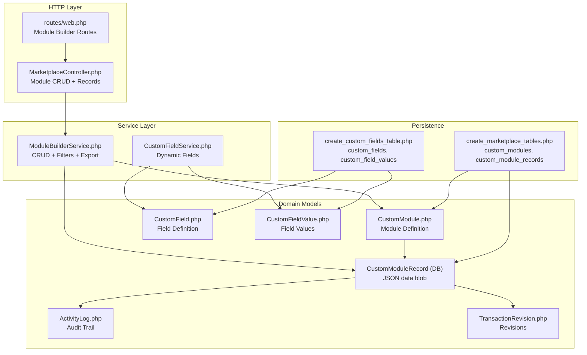
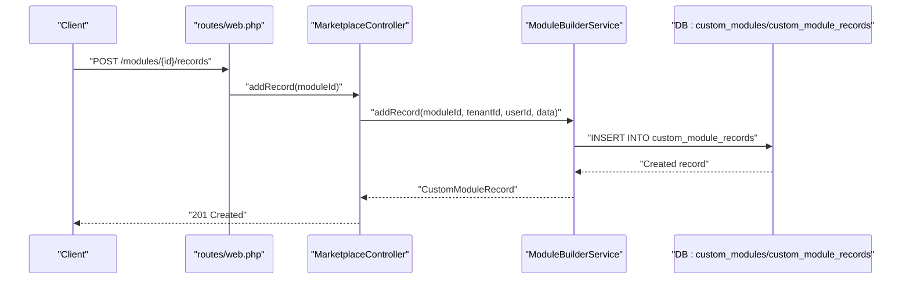
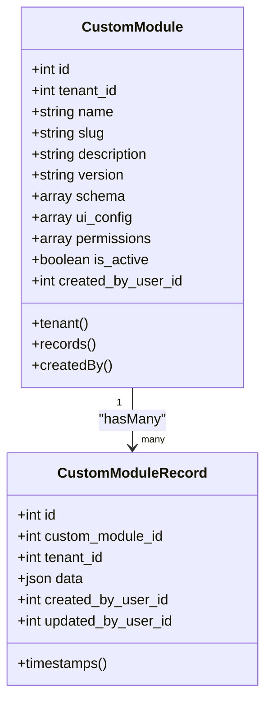
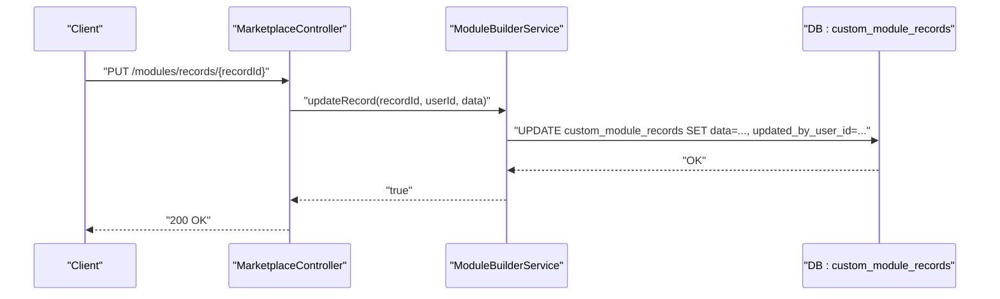
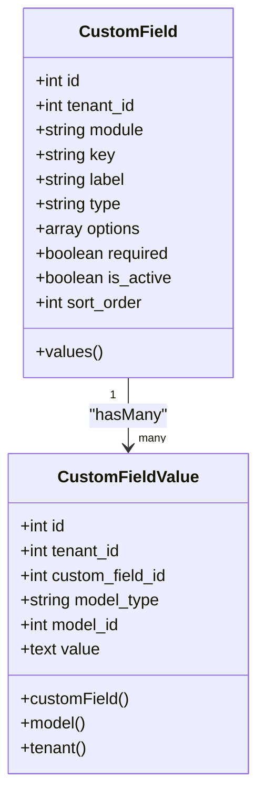
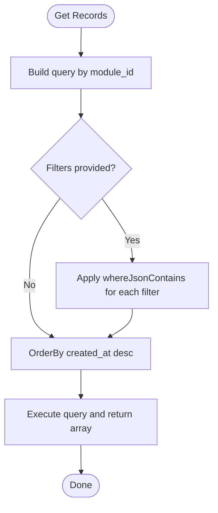
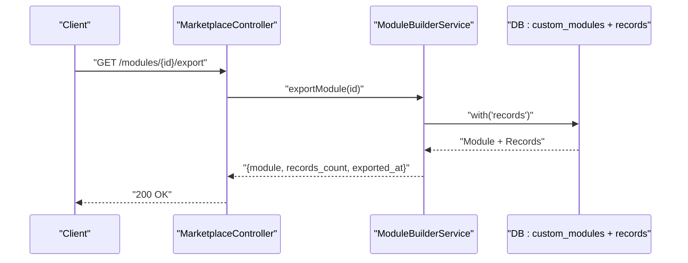
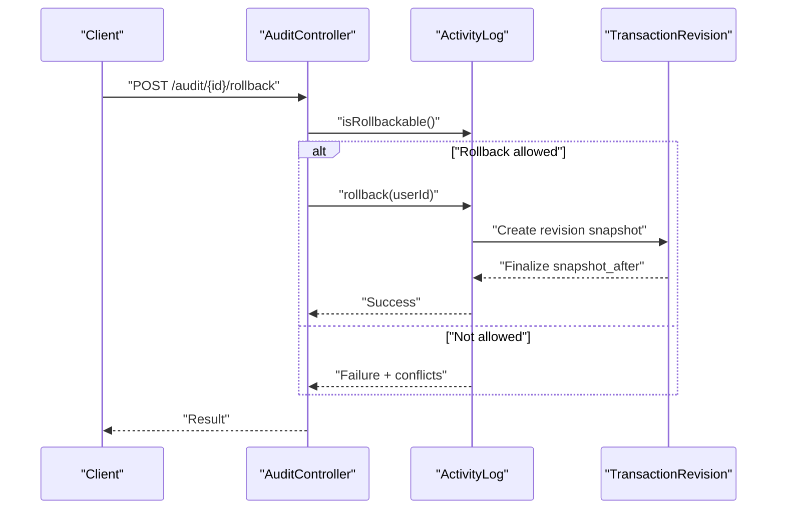
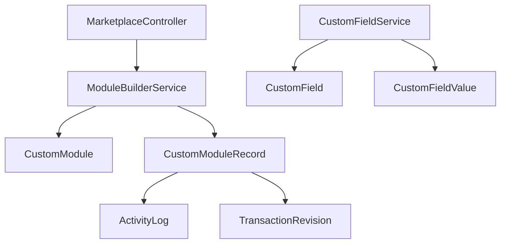

# Record Management System

<cite>
**Referenced Files in This Document**
- [web.php](file://routes/web.php)
- [MarketplaceController.php](file://app/Http/Controllers/Marketplace/MarketplaceController.php)
- [ModuleBuilderService.php](file://app/Services/Marketplace/ModuleBuilderService.php)
- [CustomModule.php](file://app/Models/CustomModule.php)
- [2026_04_06_130000_create_marketplace_tables.php](file://database/migrations/2026_04_06_130000_create_marketplace_tables.php)
- [CustomField.php](file://app/Models/CustomField.php)
- [CustomFieldValue.php](file://app/Models/CustomFieldValue.php)
- [CustomFieldService.php](file://app/Services/CustomFieldService.php)
- [CustomFieldController.php](file://app/Http/Controllers/CustomFieldController.php)
- [2026_03_23_000054_create_custom_fields_table.php](file://database/migrations/2026_03_23_000054_create_custom_fields_table.php)
- [ActivityLog.php](file://app/Models/ActivityLog.php)
- [2026_04_01_000002_enhance_activity_logs_for_audit_trail.php](file://database/migrations/2026_04_01_000002_enhance_activity_logs_for_audit_trail.php)
- [TransactionRevision.php](file://app/Models/TransactionRevision.php)
- [2026_03_23_000040_create_document_numbers_and_transaction_revisions.php](file://database/migrations/2026_03_23_000040_create_document_numbers_and_transaction_revisions.php)
- [TransactionStateMachine.php](file://app/Services/TransactionStateMachine.php)
- [AuditController.php](file://app/Http/Controllers/AuditController.php)
- [ModuleSettingsController.php](file://app/Http/Controllers/ModuleSettingsController.php)
</cite>

## Table of Contents
1. [Introduction](#introduction)
2. [Project Structure](#project-structure)
3. [Core Components](#core-components)
4. [Architecture Overview](#architecture-overview)
5. [Detailed Component Analysis](#detailed-component-analysis)
6. [Dependency Analysis](#dependency-analysis)
7. [Performance Considerations](#performance-considerations)
8. [Troubleshooting Guide](#troubleshooting-guide)
9. [Conclusion](#conclusion)

## Introduction
This document explains the record management functionality for custom modules within the system. It covers:
- CRUD operations for custom module records
- JSON-based dynamic data storage and dynamic fields
- Filtering, sorting, and search for large datasets
- Bulk operations and exports
- Versioning and audit trail mechanisms
- Managing different data types and validation rules
- Module-record relationships, cascading operations, and data integrity

## Project Structure
The record management system spans HTTP routes, controllers, services, models, and database migrations. Custom modules define schemas and UI configurations, while records persist as JSON blobs. Dynamic fields are managed via dedicated models and services.



**Diagram sources**
- [web.php:2930-2940](file://routes/web.php#L2930-L2940)
- [MarketplaceController.php:337-430](file://app/Http/Controllers/Marketplace/MarketplaceController.php#L337-L430)
- [ModuleBuilderService.php:1-175](file://app/Services/Marketplace/ModuleBuilderService.php#L1-L175)
- [CustomModule.php:1-46](file://app/Models/CustomModule.php#L1-L46)
- [2026_04_06_130000_create_marketplace_tables.php:154-164](file://database/migrations/2026_04_06_130000_create_marketplace_tables.php#L154-L164)
- [CustomField.php:1-56](file://app/Models/CustomField.php#L1-L56)
- [CustomFieldValue.php:1-20](file://app/Models/CustomFieldValue.php#L1-L20)
- [2026_03_23_000054_create_custom_fields_table.php:30-48](file://database/migrations/2026_03_23_000054_create_custom_fields_table.php#L30-L48)
- [ActivityLog.php:45-93](file://app/Models/ActivityLog.php#L45-L93)
- [TransactionRevision.php:1-53](file://app/Models/TransactionRevision.php#L1-L53)

**Section sources**
- [web.php:2930-2940](file://routes/web.php#L2930-L2940)
- [MarketplaceController.php:337-430](file://app/Http/Controllers/Marketplace/MarketplaceController.php#L337-L430)
- [ModuleBuilderService.php:1-175](file://app/Services/Marketplace/ModuleBuilderService.php#L1-L175)
- [CustomModule.php:1-46](file://app/Models/CustomModule.php#L1-L46)
- [2026_04_06_130000_create_marketplace_tables.php:154-164](file://database/migrations/2026_04_06_130000_create_marketplace_tables.php#L154-L164)

## Core Components
- Custom Module: Defines module metadata, schema, UI config, permissions, and tenant isolation.
- Custom Module Record: Stores dynamic JSON data under a JSON column and links to module and tenant.
- Custom Field: Defines dynamic fields per tenant and module with type and options.
- Custom Field Value: Stores values for dynamic fields linked to arbitrary models via polymorphism.
- Module Builder Service: Implements CRUD and filtering for module records; supports exports.
- Audit and Revision: Activity logs capture changes; transaction revisions enforce immutable post-editing changes.

**Section sources**
- [CustomModule.php:1-46](file://app/Models/CustomModule.php#L1-L46)
- [2026_04_06_130000_create_marketplace_tables.php:154-164](file://database/migrations/2026_04_06_130000_create_marketplace_tables.php#L154-L164)
- [CustomField.php:1-56](file://app/Models/CustomField.php#L1-L56)
- [CustomFieldValue.php:1-20](file://app/Models/CustomFieldValue.php#L1-L20)
- [ModuleBuilderService.php:58-126](file://app/Services/Marketplace/ModuleBuilderService.php#L58-L126)
- [ActivityLog.php:45-93](file://app/Models/ActivityLog.php#L45-L93)
- [TransactionRevision.php:1-53](file://app/Models/TransactionRevision.php#L1-L53)

## Architecture Overview
The system exposes REST endpoints for module creation and record management. Controllers delegate to a service layer that interacts with Eloquent models. Records are stored as JSON, enabling flexible schemas per module. Dynamic fields are decoupled via a separate taxonomy and value store.



**Diagram sources**
- [web.php:2935-2936](file://routes/web.php#L2935-L2936)
- [MarketplaceController.php:379-392](file://app/Http/Controllers/Marketplace/MarketplaceController.php#L379-L392)
- [ModuleBuilderService.php:58-66](file://app/Services/Marketplace/ModuleBuilderService.php#L58-L66)
- [2026_04_06_130000_create_marketplace_tables.php:154-164](file://database/migrations/2026_04_06_130000_create_marketplace_tables.php#L154-L164)

## Detailed Component Analysis

### Custom Module and Records
- Module definition: name, slug, description, version, schema, UI config, permissions, tenant association.
- Record persistence: JSON column stores arbitrary key-value pairs; module and tenant foreign keys enforce isolation.
- Relationships: module has many records; records belong to a module and tenant.



**Diagram sources**
- [CustomModule.php:10-46](file://app/Models/CustomModule.php#L10-L46)
- [2026_04_06_130000_create_marketplace_tables.php:154-164](file://database/migrations/2026_04_06_130000_create_marketplace_tables.php#L154-L164)

**Section sources**
- [CustomModule.php:1-46](file://app/Models/CustomModule.php#L1-L46)
- [2026_04_06_130000_create_marketplace_tables.php:154-164](file://database/migrations/2026_04_06_130000_create_marketplace_tables.php#L154-L164)

### CRUD Operations for Records
- Create: Controller validates payload and delegates to service; service persists record with JSON data and user metadata.
- Read: List records with optional JSON filters; supports ordering.
- Update: Service updates JSON data and tracks updated_by_user_id.
- Delete: Service deletes record by ID.



**Diagram sources**
- [web.php:2937-2938](file://routes/web.php#L2937-L2938)
- [MarketplaceController.php:397-405](file://app/Http/Controllers/Marketplace/MarketplaceController.php#L397-L405)
- [ModuleBuilderService.php:71-89](file://app/Services/Marketplace/ModuleBuilderService.php#L71-L89)

**Section sources**
- [MarketplaceController.php:379-418](file://app/Http/Controllers/Marketplace/MarketplaceController.php#L379-L418)
- [ModuleBuilderService.php:58-109](file://app/Services/Marketplace/ModuleBuilderService.php#L58-L109)

### JSON Data Storage and Dynamic Fields
- Dynamic records: Store arbitrary JSON under the data column; schema defines UI and validation hints.
- Dynamic fields: Separate taxonomy (CustomField) and values (CustomFieldValue) enable per-module, per-tenant extensibility. Values are stored as text and mapped to field types.



**Diagram sources**
- [CustomField.php:11-56](file://app/Models/CustomField.php#L11-L56)
- [CustomFieldValue.php:11-20](file://app/Models/CustomFieldValue.php#L11-L20)
- [2026_03_23_000054_create_custom_fields_table.php:30-48](file://database/migrations/2026_03_23_000054_create_custom_fields_table.php#L30-L48)

**Section sources**
- [CustomField.php:1-56](file://app/Models/CustomField.php#L1-L56)
- [CustomFieldValue.php:1-20](file://app/Models/CustomFieldValue.php#L1-L20)
- [CustomFieldService.php:1-81](file://app/Services/CustomFieldService.php#L1-L81)
- [CustomFieldController.php:1-72](file://app/Http/Controllers/CustomFieldController.php#L1-L72)

### Filtering, Sorting, and Search
- Filtering: Service applies JSON contains queries to the data column for key-value filters.
- Sorting: Records are ordered by creation time descending.
- Search: For large datasets, combine filters with pagination in the UI layer.



**Diagram sources**
- [ModuleBuilderService.php:114-126](file://app/Services/Marketplace/ModuleBuilderService.php#L114-L126)

**Section sources**
- [ModuleBuilderService.php:114-126](file://app/Services/Marketplace/ModuleBuilderService.php#L114-L126)

### Bulk Operations and Exports
- Bulk actions: Implemented in domain-specific controllers (e.g., customer bulk activation/deactivation/credit limit updates) and logged in activity logs.
- Export: Module export returns module metadata and record counts; records are included via eager loading.



**Diagram sources**
- [web.php:2939-2940](file://routes/web.php#L2939-L2940)
- [MarketplaceController.php:423-430](file://app/Http/Controllers/Marketplace/MarketplaceController.php#L423-L430)
- [ModuleBuilderService.php:131-147](file://app/Services/Marketplace/ModuleBuilderService.php#L131-L147)

**Section sources**
- [ModuleBuilderService.php:131-147](file://app/Services/Marketplace/ModuleBuilderService.php#L131-L147)

### Record Versioning and Audit Trail
- Activity logs: Capture user, action, model, timestamps, and old/new values; include rollback metadata.
- Transaction revisions: Enforce immutable post-editing changes by snapshotting before and after; track finalized status.
- Rollback capability: Audit entries can be rolled back if conditions are met; conflicts are detected by comparing current values with recorded “new” values.



**Diagram sources**
- [AuditController.php:120-125](file://app/Http/Controllers/AuditController.php#L120-L125)
- [ActivityLog.php:78-118](file://app/Models/ActivityLog.php#L78-L118)
- [TransactionRevision.php:24-52](file://app/Models/TransactionRevision.php#L24-L52)
- [2026_03_23_000040_create_document_numbers_and_transaction_revisions.php:29-44](file://database/migrations/2026_03_23_000040_create_document_numbers_and_transaction_revisions.php#L29-L44)

**Section sources**
- [ActivityLog.php:45-118](file://app/Models/ActivityLog.php#L45-L118)
- [TransactionRevision.php:1-53](file://app/Models/TransactionRevision.php#L1-L53)
- [TransactionStateMachine.php:227-273](file://app/Services/TransactionStateMachine.php#L227-L273)
- [AuditController.php:96-125](file://app/Http/Controllers/AuditController.php#L96-L125)

### Managing Different Data Types and Validation Rules
- Supported types: text, number, date, select, checkbox, textarea.
- Validation: Required checks and option parsing for select types; uniqueness of field keys per module per tenant enforced by UI generation and backend logic.
- Storage: Values are normalized to strings; decoding is application-side responsibility.

**Section sources**
- [CustomField.php:28-54](file://app/Models/CustomField.php#L28-L54)
- [CustomFieldController.php:29-72](file://app/Http/Controllers/CustomFieldController.php#L29-L72)
- [CustomFieldService.php:46-81](file://app/Services/CustomFieldService.php#L46-L81)

### Module-Record Relationships and Data Integrity
- Tenant isolation: All module and record entities are bound to a tenant; queries filter by tenant_id.
- Cascading: Module deletion cascades to records; user references use cascade or set null semantics.
- Module lifecycle: Disabling modules triggers cleanup strategies; archived data can be restored.

```mermaid
graph LR
Tenant["Tenant"] --> CM["CustomModule"]
CM --> CMR["CustomModuleRecord"]
User["User"] --> CM
User --> CMR
CM -.onDelete:cascade.-> CMR
CMR -.onDelete:cascade.->|Audit/Revisions| Logs["ActivityLog/TransactionRevision"]
```

**Diagram sources**
- [2026_04_06_130000_create_marketplace_tables.php:154-164](file://database/migrations/2026_04_06_130000_create_marketplace_tables.php#L154-L164)
- [ModuleSettingsController.php:34-103](file://app/Http/Controllers/ModuleSettingsController.php#L34-L103)

**Section sources**
- [CustomModule.php:34-45](file://app/Models/CustomModule.php#L34-L45)
- [2026_04_06_130000_create_marketplace_tables.php:154-164](file://database/migrations/2026_04_06_130000_create_marketplace_tables.php#L154-L164)
- [ModuleSettingsController.php:34-103](file://app/Http/Controllers/ModuleSettingsController.php#L34-L103)

## Dependency Analysis
- Controllers depend on services for business logic.
- Services depend on models and database migrations for persistence.
- Dynamic fields are orthogonal to module records but integrate via the field service.
- Audit and revision systems are cross-cutting concerns integrated into the domain models.



**Diagram sources**
- [MarketplaceController.php:21-28](file://app/Http/Controllers/Marketplace/MarketplaceController.php#L21-L28)
- [ModuleBuilderService.php:14-30](file://app/Services/Marketplace/ModuleBuilderService.php#L14-L30)
- [CustomFieldService.php:14-28](file://app/Services/CustomFieldService.php#L14-L28)
- [ActivityLog.php:66-73](file://app/Models/ActivityLog.php#L66-L73)
- [TransactionRevision.php:32-46](file://app/Models/TransactionRevision.php#L32-L46)

**Section sources**
- [MarketplaceController.php:21-28](file://app/Http/Controllers/Marketplace/MarketplaceController.php#L21-L28)
- [ModuleBuilderService.php:14-30](file://app/Services/Marketplace/ModuleBuilderService.php#L14-L30)
- [CustomFieldService.php:14-28](file://app/Services/CustomFieldService.php#L14-L28)

## Performance Considerations
- Indexing: The records table includes an index on custom_module_id to accelerate lookups.
- JSON filtering: whereJsonContains is used for filters; consider adding targeted GIN/BTree indexes on frequently filtered JSON keys if performance degrades.
- Pagination: Combine filters with pagination in UI to avoid large result sets.
- Caching: Dynamic field definitions are cached to reduce repeated reads.

**Section sources**
- [2026_04_06_130000_create_marketplace_tables.php:163-164](file://database/migrations/2026_04_06_130000_create_marketplace_tables.php#L163-L164)
- [ModuleBuilderService.php:118-123](file://app/Services/Marketplace/ModuleBuilderService.php#L118-L123)
- [CustomFieldService.php:21-27](file://app/Services/CustomFieldService.php#L21-L27)

## Troubleshooting Guide
- Record not found: Ensure tenant scoping and correct record IDs.
- Update failures: Check service logs for exceptions during update/delete operations.
- Audit rollback blocked: Verify the entry is rollbackable and no conflicts exist compared to current values.
- Module disable impact: Use the module settings controller to analyze and clean up disabled modules.

**Section sources**
- [ModuleBuilderService.php:71-109](file://app/Services/Marketplace/ModuleBuilderService.php#L71-L109)
- [ActivityLog.php:78-118](file://app/Models/ActivityLog.php#L78-L118)
- [ModuleSettingsController.php:114-135](file://app/Http/Controllers/ModuleSettingsController.php#L114-L135)

## Conclusion
The record management system for custom modules centers on flexible JSON storage with strong tenant isolation and robust audit/revision controls. Dynamic fields are cleanly separated for extensibility. The service-layer design keeps controllers thin and testable, while migrations define the schema for scalable operations.