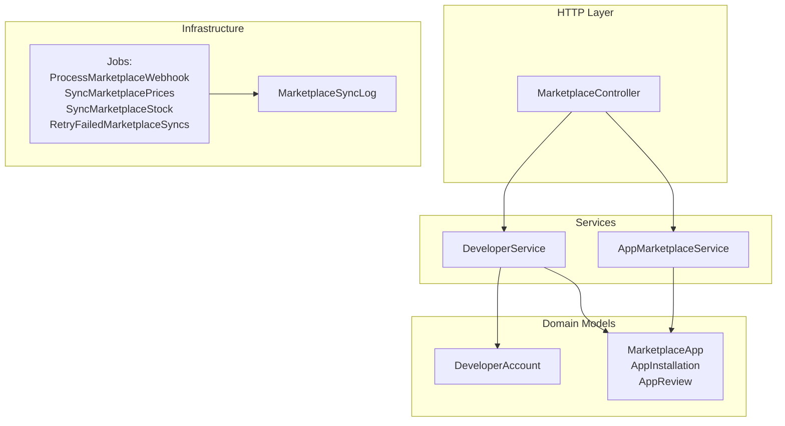
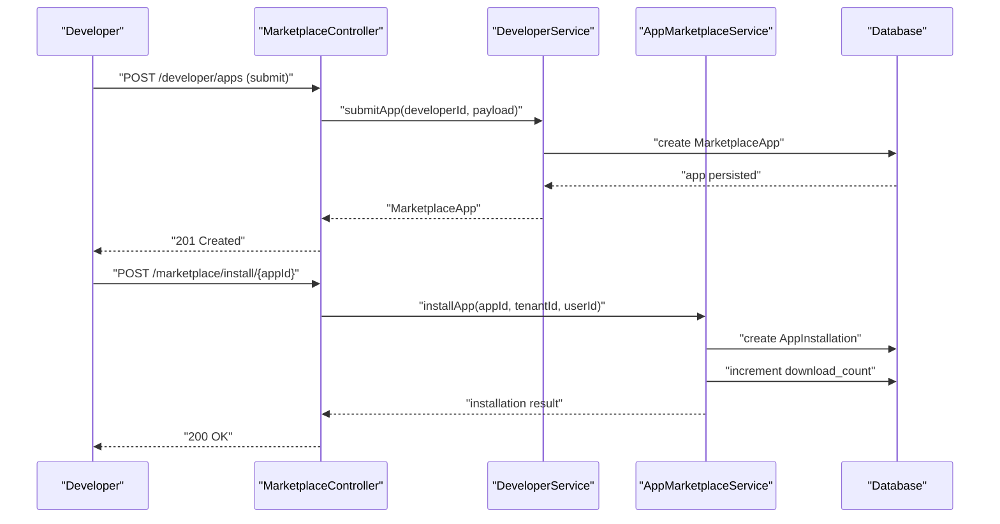
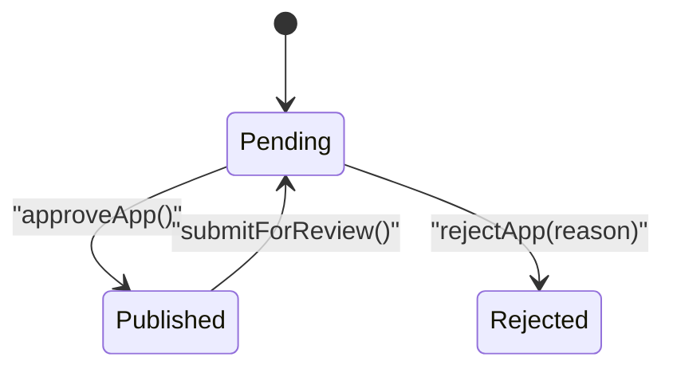
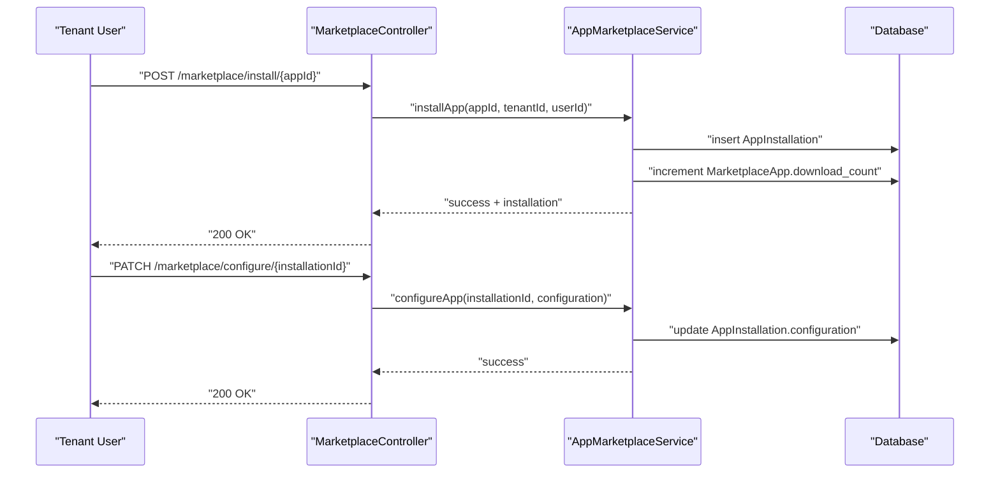
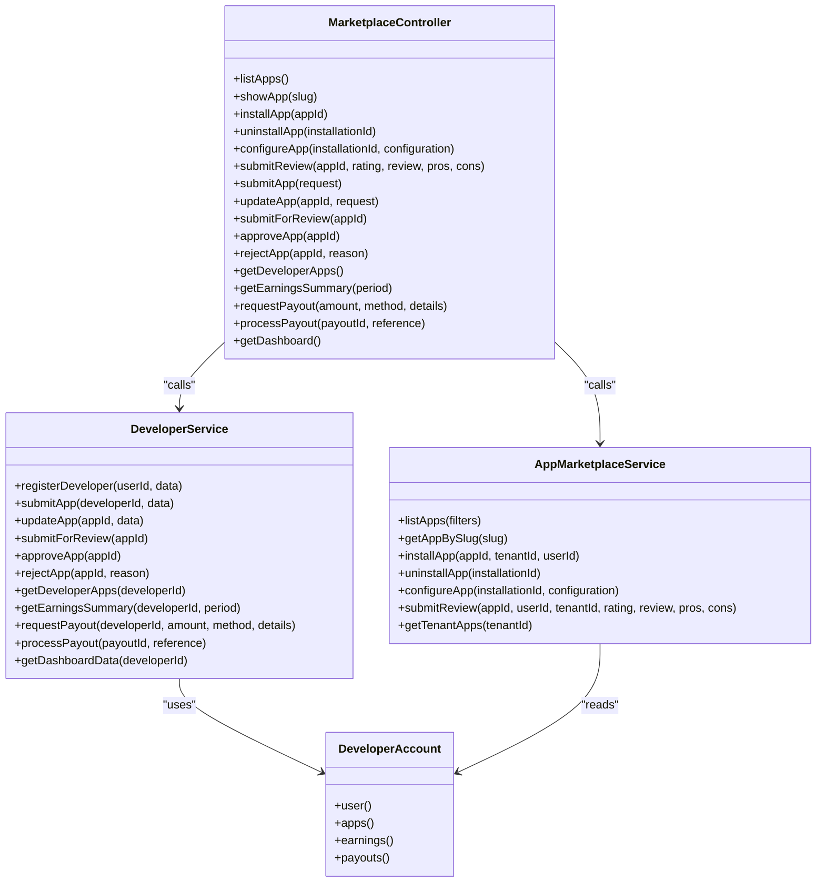

# App Submission & Management

<cite>
**Referenced Files in This Document**
- [MarketplaceController.php](file://app/Http/Controllers/Marketplace/MarketplaceController.php)
- [DeveloperService.php](file://app/Services/Marketplace/DeveloperService.php)
- [AppMarketplaceService.php](file://app/Services/Marketplace/AppMarketplaceService.php)
- [DeveloperAccount.php](file://app/Models/DeveloperAccount.php)
- [2026_04_06_130000_create_marketplace_tables.php](file://database/migrations/2026_04_06_130000_create_marketplace_tables.php)
- [MarketplaceWebhookController.php](file://app/Http/Controllers/MarketplaceWebhookController.php)
- [ProcessMarketplaceWebhook.php](file://app/Jobs/ProcessMarketplaceWebhook.php)
- [SyncMarketplacePrices.php](file://app/Jobs/SyncMarketplacePrices.php)
- [SyncMarketplaceStock.php](file://app/Jobs/SyncMarketplaceStock.php)
- [RetryFailedMarketplaceSyncs.php](file://app/Jobs/RetryFailedMarketplaceSyncs.php)
- [MarketplaceSyncLog.php](file://app/Models/MarketplaceSyncLog.php)
</cite>

## Table of Contents
1. [Introduction](#introduction)
2. [Project Structure](#project-structure)
3. [Core Components](#core-components)
4. [Architecture Overview](#architecture-overview)
5. [Detailed Component Analysis](#detailed-component-analysis)
6. [Dependency Analysis](#dependency-analysis)
7. [Performance Considerations](#performance-considerations)
8. [Troubleshooting Guide](#troubleshooting-guide)
9. [Conclusion](#conclusion)

## Introduction
This document describes the App Submission & Management system within the qalcuityERP marketplace. It covers the complete app submission pipeline, validation rules, metadata structure, pricing models, screenshots and icon requirements, feature documentation formatting, and the app lifecycle from submission to publication. It also documents installation, configuration, reviews, and monetization flows, along with common errors, approval criteria, and resolution strategies.

## Project Structure
The marketplace functionality is organized around:
- Controllers that expose REST endpoints for marketplace browsing, app installation, reviews, and developer portal actions
- Services that encapsulate business logic for developer submissions, app marketplace operations, and monetization
- Models and migrations that define the marketplace data schema (apps, installations, reviews)
- Jobs and webhook handlers for asynchronous sync and external integrations

**Diagram sources**
- [MarketplaceController.php:1-673](file://app/Http/Controllers/Marketplace/MarketplaceController.php#L1-L673)
- [DeveloperService.php:1-270](file://app/Services/Marketplace/DeveloperService.php#L1-L270)
- [AppMarketplaceService.php:1-290](file://app/Services/Marketplace/AppMarketplaceService.php#L1-L290)
- [DeveloperAccount.php:1-50](file://app/Models/DeveloperAccount.php#L1-L50)
- [2026_04_06_130000_create_marketplace_tables.php:28-79](file://database/migrations/2026_04_06_130000_create_marketplace_tables.php#L28-L79)
- [ProcessMarketplaceWebhook.php](file://app/Jobs/ProcessMarketplaceWebhook.php)
- [SyncMarketplacePrices.php](file://app/Jobs/SyncMarketplacePrices.php)
- [SyncMarketplaceStock.php](file://app/Jobs/SyncMarketplaceStock.php)
- [RetryFailedMarketplaceSyncs.php](file://app/Jobs/RetryFailedMarketplaceSyncs.php)
- [MarketplaceSyncLog.php](file://app/Models/MarketplaceSyncLog.php)

**Section sources**
- [MarketplaceController.php:1-673](file://app/Http/Controllers/Marketplace/MarketplaceController.php#L1-L673)
- [DeveloperService.php:1-270](file://app/Services/Marketplace/DeveloperService.php#L1-L270)
- [AppMarketplaceService.php:1-290](file://app/Services/Marketplace/AppMarketplaceService.php#L1-L290)
- [DeveloperAccount.php:1-50](file://app/Models/DeveloperAccount.php#L1-L50)
- [2026_04_06_130000_create_marketplace_tables.php:28-79](file://database/migrations/2026_04_06_130000_create_marketplace_tables.php#L28-L79)

## Core Components
- MarketplaceController: Exposes endpoints for browsing apps, installing/uninstalling, configuring, submitting reviews, and developer portal actions (submit/update app, approve/reject, payouts).
- DeveloperService: Manages developer registration, app submission, updates, submission for review, approval/rejection, and developer analytics/payouts.
- AppMarketplaceService: Handles marketplace listings, app installation, configuration, uninstallation, and review submission; calculates subscription expirations and records earnings.
- DeveloperAccount: Developer profile and relationship to apps, earnings, and payouts.
- Marketplace schema: Defines app metadata, installation records, and reviews.

**Section sources**
- [MarketplaceController.php:1-673](file://app/Http/Controllers/Marketplace/MarketplaceController.php#L1-L673)
- [DeveloperService.php:1-270](file://app/Services/Marketplace/DeveloperService.php#L1-L270)
- [AppMarketplaceService.php:1-290](file://app/Services/Marketplace/AppMarketplaceService.php#L1-L290)
- [DeveloperAccount.php:1-50](file://app/Models/DeveloperAccount.php#L1-L50)
- [2026_04_06_130000_create_marketplace_tables.php:28-79](file://database/migrations/2026_04_06_130000_create_marketplace_tables.php#L28-L79)

## Architecture Overview
The system follows a layered architecture:
- HTTP requests enter via MarketplaceController
- Controller delegates to DeveloperService or AppMarketplaceService
- Services operate on domain models and persist changes
- Asynchronous jobs handle marketplace sync/webhooks
- Data integrity enforced by migrations and model relationships

**Diagram sources**
- [MarketplaceController.php:68-77](file://app/Http/Controllers/Marketplace/MarketplaceController.php#L68-L77)
- [DeveloperService.php:32-62](file://app/Services/Marketplace/DeveloperService.php#L32-L62)
- [AppMarketplaceService.php:69-117](file://app/Services/Marketplace/AppMarketplaceService.php#L69-L117)

## Detailed Component Analysis

### App Metadata and Validation
- Required fields for submission include name, category, and optional fields such as description, version, screenshots, icon_url, price, pricing_model, subscription_price, subscription_period, features, requirements, documentation_url, support_url, repository_url.
- Validation enforces:
  - Category is required
  - Pricing model must be one of one_time, subscription, freemium
  - Subscription period must be monthly or yearly when applicable
  - Price must be numeric and non-negative
  - URLs must be valid when present
  - Arrays for screenshots, features, requirements are permitted

Submission endpoint and validation:
- Endpoint: POST /developer/apps
- Validation rules applied server-side before persisting

**Section sources**
- [MarketplaceController.php:171-198](file://app/Http/Controllers/Marketplace/MarketplaceController.php#L171-L198)

### App Lifecycle: From Submission to Publication
- Submission: Developer submits app metadata; status initialized as pending.
- Review: Admin can approve (status becomes published) or reject (status rejected with reason).
- Publishing: Approved apps become visible in marketplace listings.

**Diagram sources**
- [DeveloperService.php:87-148](file://app/Services/Marketplace/DeveloperService.php#L87-L148)
- [2026_04_06_130000_create_marketplace_tables.php:30-31](file://database/migrations/2026_04_06_130000_create_marketplace_tables.php#L30-L31)

**Section sources**
- [DeveloperService.php:32-148](file://app/Services/Marketplace/DeveloperService.php#L32-L148)

### Screenshots, Icons, and Feature Documentation
- Screenshots: Provided as an array; no strict size/format enforced in validation, but marketplace UI may impose constraints.
- Icon: Provided via icon_url; must be a valid URL.
- Features: Array of feature entries; formatting validated by presence of array type.
- Requirements: Array of technical/environmental requirements (e.g., PHP/Laravel versions); stored as JSON.

Guidelines derived from schema and controller validation:
- Use arrays for screenshots, features, and requirements
- Provide valid URLs for icon_url, documentation_url, support_url, repository_url

**Section sources**
- [MarketplaceController.php:171-189](file://app/Http/Controllers/Marketplace/MarketplaceController.php#L171-L189)
- [2026_04_06_130000_create_marketplace_tables.php:28-37](file://database/migrations/2026_04_06_130000_create_marketplace_tables.php#L28-L37)

### Pricing Models and Compatibility
- Pricing models supported: one_time, subscription, freemium
- Subscription billing cycles: monthly, yearly
- Compatibility requirements: stored as an array under requirements; used during installation to set granted permissions

Monetization and subscription expiration:
- One-time purchases increment download counts and record earnings with a platform fee
- Subscription apps set an expiration date based on selected period
- Earnings computed as net after 20% platform fee

**Section sources**
- [MarketplaceController.php:171-189](file://app/Http/Controllers/Marketplace/MarketplaceController.php#L171-L189)
- [AppMarketplaceService.php:247-288](file://app/Services/Marketplace/AppMarketplaceService.php#L247-L288)

### Installation, Configuration, and Updates
- Install app: Creates an AppInstallation record for a tenant, sets permissions from app requirements, increments download count, and records earnings for paid apps.
- Configure app: Updates installation configuration.
- Uninstall app: Marks installation as uninstalled.
- Update app: Developer can update app metadata; admin can approve or reject.

**Diagram sources**
- [MarketplaceController.php:68-103](file://app/Http/Controllers/Marketplace/MarketplaceController.php#L68-L103)
- [AppMarketplaceService.php:69-157](file://app/Services/Marketplace/AppMarketplaceService.php#L69-L157)

**Section sources**
- [MarketplaceController.php:68-103](file://app/Http/Controllers/Marketplace/MarketplaceController.php#L68-L103)
- [AppMarketplaceService.php:69-157](file://app/Services/Marketplace/AppMarketplaceService.php#L69-L157)

### Reviews and Ratings
- Users can submit reviews with rating (1–5), optional text review, pros, and cons.
- Verified purchase flag is set if the user has installed the app for that tenant.
- Average rating and review count are recalculated after review submission.

**Section sources**
- [MarketplaceController.php:108-128](file://app/Http/Controllers/Marketplace/MarketplaceController.php#L108-L128)
- [AppMarketplaceService.php:162-198](file://app/Services/Marketplace/AppMarketplaceService.php#L162-L198)

### Developer Portal: Earnings, Payouts, and Dashboard
- Developer can register a developer account with profile details.
- Dashboard exposes counts of apps, total downloads, average rating, earnings summary, and pending payouts.
- Payout requests require minimum amount thresholds and supported payout methods; processed by admin with a reference number.

**Section sources**
- [MarketplaceController.php:150-330](file://app/Http/Controllers/Marketplace/MarketplaceController.php#L150-L330)
- [DeveloperService.php:16-270](file://app/Services/Marketplace/DeveloperService.php#L16-L270)

### Marketplace Sync and Webhooks
- Webhook processing job handles incoming marketplace events.
- Jobs exist for syncing prices and stock, with retry logic for failed attempts.
- Sync logs track sync outcomes.

**Section sources**
- [MarketplaceWebhookController.php](file://app/Http/Controllers/MarketplaceWebhookController.php)
- [ProcessMarketplaceWebhook.php](file://app/Jobs/ProcessMarketplaceWebhook.php)
- [SyncMarketplacePrices.php](file://app/Jobs/SyncMarketplacePrices.php)
- [SyncMarketplaceStock.php](file://app/Jobs/SyncMarketplaceStock.php)
- [RetryFailedMarketplaceSyncs.php](file://app/Jobs/RetryFailedMarketplaceSyncs.php)
- [MarketplaceSyncLog.php](file://app/Models/MarketplaceSyncLog.php)

## Dependency Analysis

**Diagram sources**
- [MarketplaceController.php:1-673](file://app/Http/Controllers/Marketplace/MarketplaceController.php#L1-L673)
- [DeveloperService.php:1-270](file://app/Services/Marketplace/DeveloperService.php#L1-L270)
- [AppMarketplaceService.php:1-290](file://app/Services/Marketplace/AppMarketplaceService.php#L1-L290)
- [DeveloperAccount.php:1-50](file://app/Models/DeveloperAccount.php#L1-L50)

**Section sources**
- [MarketplaceController.php:1-673](file://app/Http/Controllers/Marketplace/MarketplaceController.php#L1-L673)
- [DeveloperService.php:1-270](file://app/Services/Marketplace/DeveloperService.php#L1-L270)
- [AppMarketplaceService.php:1-290](file://app/Services/Marketplace/AppMarketplaceService.php#L1-L290)
- [DeveloperAccount.php:1-50](file://app/Models/DeveloperAccount.php#L1-L50)

## Performance Considerations
- Pagination: Marketplace listings use pagination to limit response size.
- Indexes: Migrations define indexes on category/status, developer_id, rating, and tenant_id/status for efficient queries.
- Eager loading: Controllers/services load related developer and reviews to reduce N+1 queries.
- Asynchronous processing: Jobs handle marketplace sync/webhooks to avoid blocking HTTP requests.

[No sources needed since this section provides general guidance]

## Troubleshooting Guide
Common submission errors and resolutions:
- Missing required fields: Ensure name and category are provided; validation will fail otherwise.
- Invalid pricing model or period: Use one_time, subscription, or freemium for pricing_model; monthly or yearly for subscription_period.
- Invalid price: Must be numeric and non-negative.
- Invalid URLs: icon_url, documentation_url, support_url, repository_url must be valid URLs when present.
- Duplicate slug: System auto-appends random suffix if slug conflicts; resubmit with a unique name.
- Insufficient balance for payout: Ensure available_balance meets requested payout amount.
- Installation failures: Check tenant/app existence and whether app is already installed for that tenant.

Approval and rejection criteria:
- Approval: Apps must meet quality standards; once approved, status becomes published.
- Rejection: Provide a reason; app remains in rejected state until updated and re-submitted.

**Section sources**
- [MarketplaceController.php:171-198](file://app/Http/Controllers/Marketplace/MarketplaceController.php#L171-L198)
- [DeveloperService.php:32-148](file://app/Services/Marketplace/DeveloperService.php#L32-L148)
- [AppMarketplaceService.php:69-117](file://app/Services/Marketplace/AppMarketplaceService.php#L69-L117)

## Conclusion
The App Submission & Management system provides a robust pipeline for developers to publish apps, manage metadata, and handle lifecycle states, alongside tenant-side installation, configuration, and monetization. Strong validation rules, structured metadata, and clear approval workflows ensure quality and reliability. Asynchronous jobs and indexing improve scalability and responsiveness.