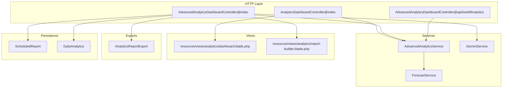
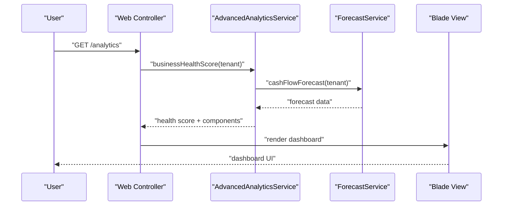
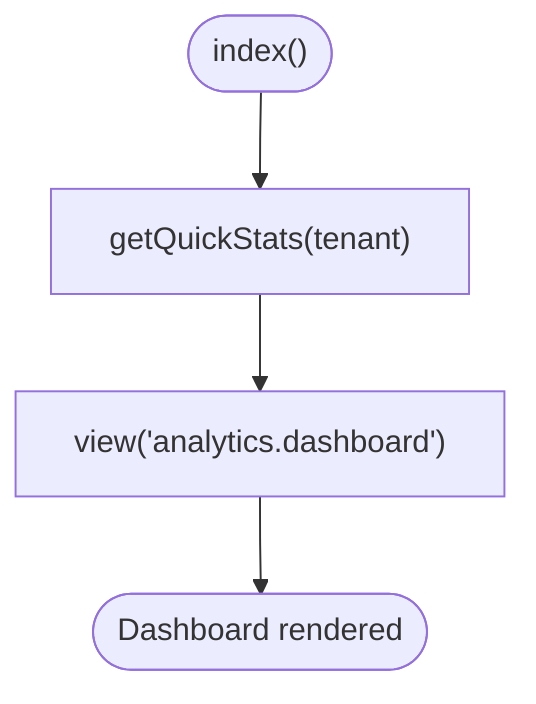
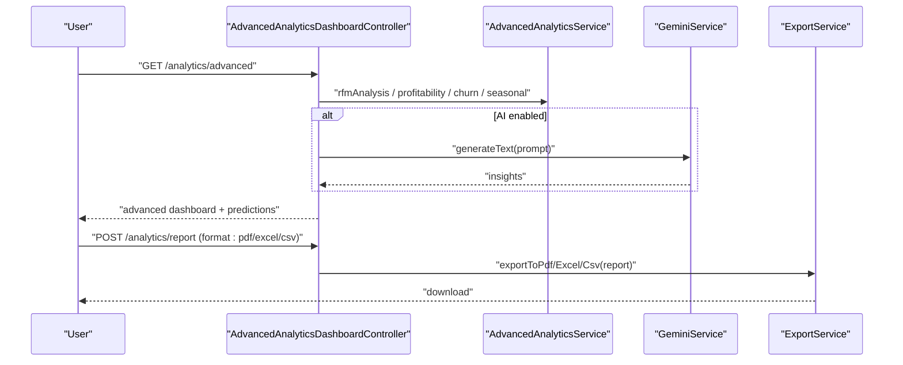
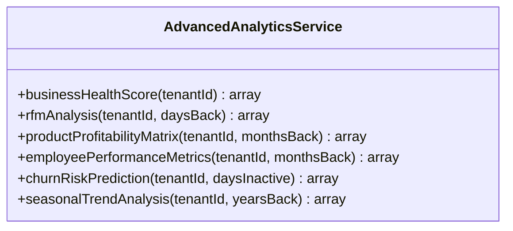
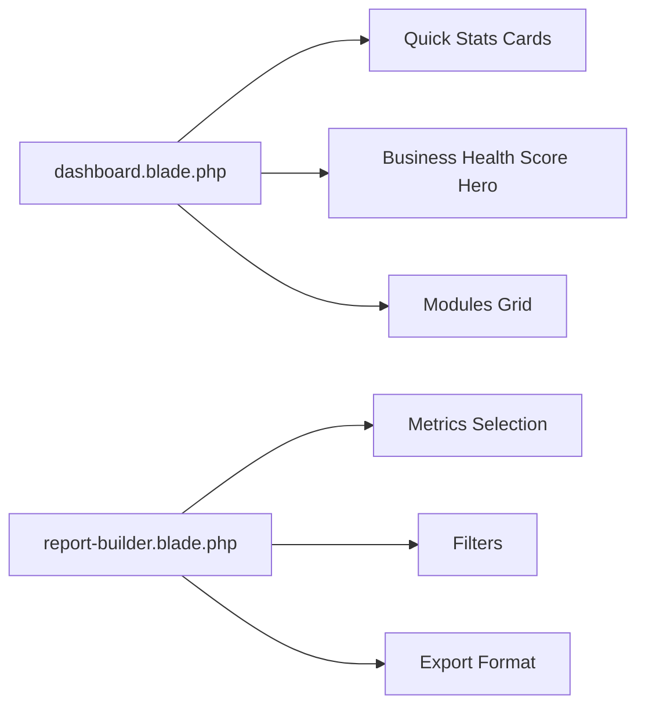
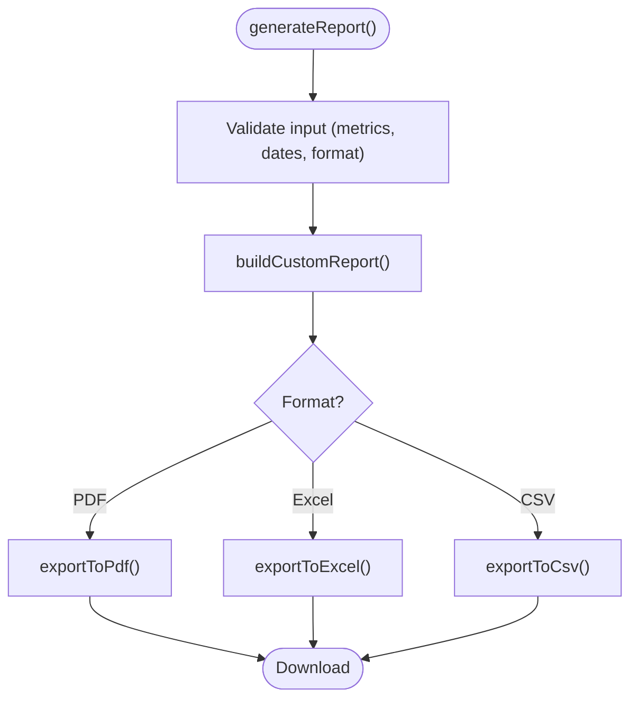
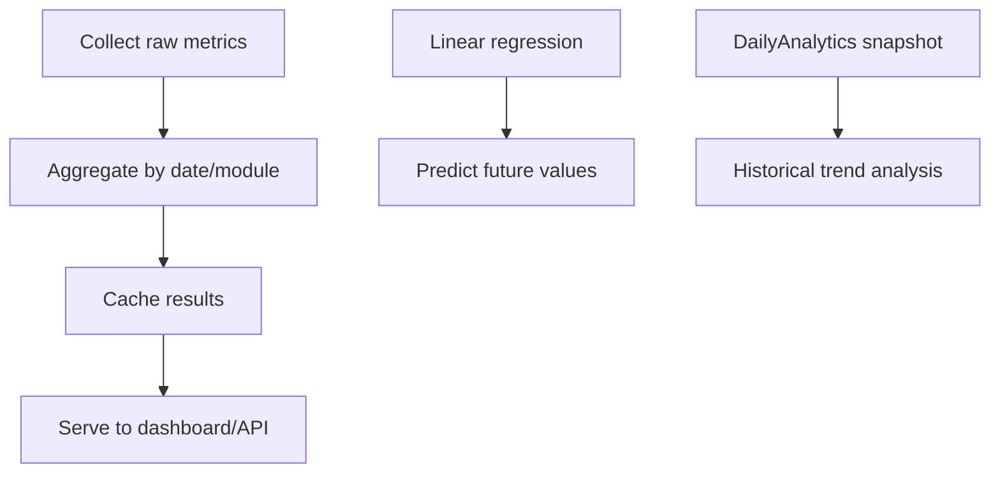
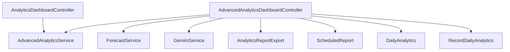

# Developer Dashboard & Analytics

<cite>
**Referenced Files in This Document**
- [AdvancedAnalyticsDashboardController.php](file://app/Http/Controllers/Analytics/AdvancedAnalyticsDashboardController.php)
- [AnalyticsDashboardController.php](file://app/Http/Controllers/Analytics/AnalyticsDashboardController.php)
- [AdvancedAnalyticsService.php](file://app/Services/AdvancedAnalyticsService.php)
- [RecordDailyAnalytics.php](file://app/Console/Commands/RecordDailyAnalytics.php)
- [dashboard.blade.php](file://resources/views/analytics/dashboard.blade.php)
- [report-builder.blade.php](file://resources/views/analytics/report-builder.blade.php)
- [AnalyticsReportExport.php](file://app/Exports/AnalyticsReportExport.php)
- [ScheduledReport.php](file://app/Models/ScheduledReport.php)
- [GeminiService.php](file://app/Services/GeminiService.php)
- [ForecastService.php](file://app/Services/ForecastService.php)
- [DailyAnalytics.php](file://app/Models/DailyAnalytics.php)
- [Tenant.php](file://app/Models/Tenant.php)
- [routes/api.php](file://routes/api.php)
- [routes/web.php](file://routes/web.php)
</cite>

## Table of Contents
1. [Introduction](#introduction)
2. [Project Structure](#project-structure)
3. [Core Components](#core-components)
4. [Architecture Overview](#architecture-overview)
5. [Detailed Component Analysis](#detailed-component-analysis)
6. [Dependency Analysis](#dependency-analysis)
7. [Performance Considerations](#performance-considerations)
8. [Troubleshooting Guide](#troubleshooting-guide)
9. [Conclusion](#conclusion)
10. [Appendices](#appendices)

## Introduction
This document describes the Developer Dashboard & Analytics system in qalcuityERP. It covers analytics dashboard features, download metrics, revenue tracking, user engagement statistics, performance insights, data visualization components, trend analysis, comparative reporting, metrics collection and aggregation, reporting frequency, export functionality, custom reporting, and integration with external analytics platforms. It also provides guidance on interpreting dashboard metrics, identifying performance trends, and making data-driven decisions, along with privacy considerations and compliance guidance.

## Project Structure
The analytics system spans controllers, services, Blade views, exports, scheduled reporting models, and console commands. Key areas:
- Controllers orchestrate dashboard views and API endpoints for analytics data.
- Services encapsulate advanced analytics computations and forecasting.
- Blade templates render dashboards and custom report builder UI.
- Exports support PDF, Excel, and CSV downloads.
- Console commands capture daily snapshots for analytics.
- Scheduled reports enable recurring delivery.

**Diagram sources**
- [AnalyticsDashboardController.php:26-37](file://app/Http/Controllers/Analytics/AnalyticsDashboardController.php#L26-L37)
- [AdvancedAnalyticsDashboardController.php:24-48](file://app/Http/Controllers/Analytics/AdvancedAnalyticsDashboardController.php#L24-L48)
- [AdvancedAnalyticsService.php:19-63](file://app/Services/AdvancedAnalyticsService.php#L19-L63)
- [ForecastService.php](file://app/Services/ForecastService.php)
- [GeminiService.php](file://app/Services/GeminiService.php)
- [dashboard.blade.php:1-202](file://resources/views/analytics/dashboard.blade.php#L1-L202)
- [report-builder.blade.php:1-221](file://resources/views/analytics/report-builder.blade.php#L1-L221)
- [AnalyticsReportExport.php](file://app/Exports/AnalyticsReportExport.php)
- [ScheduledReport.php](file://app/Models/ScheduledReport.php)
- [DailyAnalytics.php](file://app/Models/DailyAnalytics.php)

**Section sources**
- [AnalyticsDashboardController.php:26-37](file://app/Http/Controllers/Analytics/AnalyticsDashboardController.php#L26-L37)
- [AdvancedAnalyticsDashboardController.php:24-48](file://app/Http/Controllers/Analytics/AdvancedAnalyticsDashboardController.php#L24-L48)
- [dashboard.blade.php:1-202](file://resources/views/analytics/dashboard.blade.php#L1-L202)
- [report-builder.blade.php:1-221](file://resources/views/analytics/report-builder.blade.php#L1-L221)

## Core Components
- AnalyticsDashboardController: Renders the main analytics dashboard and exposes an API endpoint for real-time analytics data.
- AdvancedAnalyticsDashboardController: Provides advanced analytics, predictive analytics, custom report builder, scheduled reports, and export functionality.
- AdvancedAnalyticsService: Computes health scores, RFM segmentation, product profitability matrix, employee performance, churn risk, and seasonal trends.
- ForecastService: Supplies cash flow and revenue forecasts used by the dashboard.
- GeminiService: Optional AI enhancement for sales forecasting insights.
- Blade Views: Dashboard UI and custom report builder UI.
- Exports: PDF, Excel, and CSV export support for analytics data.
- ScheduledReport Model: Stores scheduled report configurations.
- DailyAnalytics Model: Stores daily healthcare KPI snapshots captured via console command.
- Console Command RecordDailyAnalytics: Daily snapshot ingestion for healthcare analytics.

**Section sources**
- [AnalyticsDashboardController.php:10-37](file://app/Http/Controllers/Analytics/AnalyticsDashboardController.php#L10-L37)
- [AdvancedAnalyticsDashboardController.php:19-48](file://app/Http/Controllers/Analytics/AdvancedAnalyticsDashboardController.php#L19-L48)
- [AdvancedAnalyticsService.php:13-63](file://app/Services/AdvancedAnalyticsService.php#L13-L63)
- [ForecastService.php](file://app/Services/ForecastService.php)
- [GeminiService.php](file://app/Services/GeminiService.php)
- [dashboard.blade.php:85-194](file://resources/views/analytics/dashboard.blade.php#L85-L194)
- [report-builder.blade.php:21-221](file://resources/views/analytics/report-builder.blade.php#L21-L221)
- [AnalyticsReportExport.php](file://app/Exports/AnalyticsReportExport.php)
- [ScheduledReport.php](file://app/Models/ScheduledReport.php)
- [DailyAnalytics.php](file://app/Models/DailyAnalytics.php)
- [RecordDailyAnalytics.php:30-64](file://app/Console/Commands/RecordDailyAnalytics.php#L30-L64)

## Architecture Overview
The system follows a layered MVC pattern with service-layer analytics computation and export-driven reporting.

**Diagram sources**
- [AnalyticsDashboardController.php:26-37](file://app/Http/Controllers/Analytics/AnalyticsDashboardController.php#L26-L37)
- [AdvancedAnalyticsService.php:19-63](file://app/Services/AdvancedAnalyticsService.php#L19-L63)
- [ForecastService.php](file://app/Services/ForecastService.php)
- [dashboard.blade.php:1-202](file://resources/views/analytics/dashboard.blade.php#L1-L202)

## Detailed Component Analysis

### Analytics Dashboard Controller
- Purpose: Renders the main analytics dashboard and provides an API endpoint for real-time analytics data.
- Key responsibilities:
  - Compute quick stats (today’s revenue, MTD revenue, total customers, active products, outstanding invoices).
  - Delegate advanced analytics to services.
  - Expose JSON endpoint for AJAX-driven widgets.

**Diagram sources**
- [AnalyticsDashboardController.php:26-37](file://app/Http/Controllers/Analytics/AnalyticsDashboardController.php#L26-L37)
- [AnalyticsDashboardController.php:145-183](file://app/Http/Controllers/Analytics/AnalyticsDashboardController.php#L145-L183)

**Section sources**
- [AnalyticsDashboardController.php:26-37](file://app/Http/Controllers/Analytics/AnalyticsDashboardController.php#L26-L37)
- [AnalyticsDashboardController.php:145-183](file://app/Http/Controllers/Analytics/AnalyticsDashboardController.php#L145-L183)
- [dashboard.blade.php:13-40](file://resources/views/analytics/dashboard.blade.php#L13-L40)

### Advanced Analytics Dashboard Controller
- Purpose: Advanced analytics, predictive analytics, custom report builder, scheduled reports, and export.
- Key responsibilities:
  - Real-time KPIs (revenue, orders, inventory, customers) with caching.
  - Revenue trend aggregation by date.
  - Top metrics (products, customers, categories).
  - Predictive analytics with optional AI insights.
  - Custom report generation (PDF, Excel, CSV).
  - Scheduled reports creation and listing.

**Diagram sources**
- [AdvancedAnalyticsDashboardController.php:24-48](file://app/Http/Controllers/Analytics/AdvancedAnalyticsDashboardController.php#L24-L48)
- [AdvancedAnalyticsDashboardController.php:190-247](file://app/Http/Controllers/Analytics/AdvancedAnalyticsDashboardController.php#L190-L247)
- [AdvancedAnalyticsDashboardController.php:379-396](file://app/Http/Controllers/Analytics/AdvancedAnalyticsDashboardController.php#L379-L396)
- [AdvancedAnalyticsDashboardController.php:617-653](file://app/Http/Controllers/Analytics/AdvancedAnalyticsDashboardController.php#L617-L653)
- [AdvancedAnalyticsService.php:68-144](file://app/Services/AdvancedAnalyticsService.php#L68-L144)
- [AdvancedAnalyticsService.php:149-223](file://app/Services/AdvancedAnalyticsService.php#L149-L223)
- [AdvancedAnalyticsService.php:297-355](file://app/Services/AdvancedAnalyticsService.php#L297-L355)
- [AdvancedAnalyticsService.php:360-398](file://app/Services/AdvancedAnalyticsService.php#L360-L398)
- [GeminiService.php](file://app/Services/GeminiService.php)

**Section sources**
- [AdvancedAnalyticsDashboardController.php:53-117](file://app/Http/Controllers/Analytics/AdvancedAnalyticsDashboardController.php#L53-L117)
- [AdvancedAnalyticsDashboardController.php:122-140](file://app/Http/Controllers/Analytics/AdvancedAnalyticsDashboardController.php#L122-L140)
- [AdvancedAnalyticsDashboardController.php:145-185](file://app/Http/Controllers/Analytics/AdvancedAnalyticsDashboardController.php#L145-L185)
- [AdvancedAnalyticsDashboardController.php:190-361](file://app/Http/Controllers/Analytics/AdvancedAnalyticsDashboardController.php#L190-L361)
- [AdvancedAnalyticsDashboardController.php:379-396](file://app/Http/Controllers/Analytics/AdvancedAnalyticsDashboardController.php#L379-L396)
- [AdvancedAnalyticsDashboardController.php:617-653](file://app/Http/Controllers/Analytics/AdvancedAnalyticsDashboardController.php#L617-L653)

### Advanced Analytics Service
- Purpose: Centralized analytics computations.
- Key computations:
  - Business Health Score: weighted composite of revenue growth, profitability, cash flow, retention, inventory, and employee productivity.
  - RFM Analysis: recency, frequency, monetary segmentation.
  - Product Profitability Matrix: quadrant classification (Stars, Cash Cows, Question Marks, Dogs).
  - Employee Performance Metrics: leaderboard and trend analysis.
  - Churn Risk Prediction: risk scoring and level assignment.
  - Seasonal Trend Analysis: monthly trends, seasonal index, YoY comparison, peak seasons.

**Diagram sources**
- [AdvancedAnalyticsService.php:19-63](file://app/Services/AdvancedAnalyticsService.php#L19-L63)
- [AdvancedAnalyticsService.php:68-144](file://app/Services/AdvancedAnalyticsService.php#L68-L144)
- [AdvancedAnalyticsService.php:149-223](file://app/Services/AdvancedAnalyticsService.php#L149-L223)
- [AdvancedAnalyticsService.php:228-292](file://app/Services/AdvancedAnalyticsService.php#L228-L292)
- [AdvancedAnalyticsService.php:297-355](file://app/Services/AdvancedAnalyticsService.php#L297-L355)
- [AdvancedAnalyticsService.php:360-398](file://app/Services/AdvancedAnalyticsService.php#L360-L398)

**Section sources**
- [AdvancedAnalyticsService.php:19-63](file://app/Services/AdvancedAnalyticsService.php#L19-L63)
- [AdvancedAnalyticsService.php:68-144](file://app/Services/AdvancedAnalyticsService.php#L68-L144)
- [AdvancedAnalyticsService.php:149-223](file://app/Services/AdvancedAnalyticsService.php#L149-L223)
- [AdvancedAnalyticsService.php:228-292](file://app/Services/AdvancedAnalyticsService.php#L228-L292)
- [AdvancedAnalyticsService.php:297-355](file://app/Services/AdvancedAnalyticsService.php#L297-L355)
- [AdvancedAnalyticsService.php:360-398](file://app/Services/AdvancedAnalyticsService.php#L360-L398)

### Forecast Service
- Purpose: Provides cash flow and revenue forecasts consumed by the dashboard.
- Integration: Used by AdvancedAnalyticsService for health score calculation and by the dashboard controller for forecast views.

**Section sources**
- [AnalyticsDashboardController.php:81-95](file://app/Http/Controllers/Analytics/AnalyticsDashboardController.php#L81-L95)
- [AdvancedAnalyticsService.php:450-461](file://app/Services/AdvancedAnalyticsService.php#L450-L461)

### Gemini Service
- Purpose: Optional AI augmentation for predictive analytics insights.
- Integration: Called from AdvancedAnalyticsDashboardController during sales forecasting.

**Section sources**
- [AdvancedAnalyticsDashboardController.php:225-237](file://app/Http/Controllers/Analytics/AdvancedAnalyticsDashboardController.php#L225-L237)
- [GeminiService.php](file://app/Services/GeminiService.php)

### Dashboard Views
- Main Dashboard: Displays quick stats cards, business health score, and module navigation.
- Advanced Dashboard: Presents KPIs, revenue trends, top metrics, and predictive analytics.
- Report Builder: Allows selecting metrics, filters, date range, and export format.

**Diagram sources**
- [dashboard.blade.php:13-40](file://resources/views/analytics/dashboard.blade.php#L13-L40)
- [dashboard.blade.php:42-83](file://resources/views/analytics/dashboard.blade.php#L42-L83)
- [dashboard.blade.php:85-194](file://resources/views/analytics/dashboard.blade.php#L85-L194)
- [report-builder.blade.php:27-159](file://resources/views/analytics/report-builder.blade.php#L27-L159)
- [report-builder.blade.php:164-195](file://resources/views/analytics/report-builder.blade.php#L164-L195)

**Section sources**
- [dashboard.blade.php:1-202](file://resources/views/analytics/dashboard.blade.php#L1-L202)
- [report-builder.blade.php:1-221](file://resources/views/analytics/report-builder.blade.php#L1-L221)

### Export Functionality
- Formats supported: PDF, Excel, CSV.
- Implementation:
  - PDF: Uses a dedicated view and download response.
  - Excel: Uses AnalyticsReportExport class via Laravel Excel.
  - CSV: Streams CSV content with headers and rows.

**Diagram sources**
- [AdvancedAnalyticsDashboardController.php:379-396](file://app/Http/Controllers/Analytics/AdvancedAnalyticsDashboardController.php#L379-L396)
- [AdvancedAnalyticsDashboardController.php:601-612](file://app/Http/Controllers/Analytics/AdvancedAnalyticsDashboardController.php#L601-L612)
- [AdvancedAnalyticsDashboardController.php:617-653](file://app/Http/Controllers/Analytics/AdvancedAnalyticsDashboardController.php#L617-L653)
- [AnalyticsReportExport.php](file://app/Exports/AnalyticsReportExport.php)

**Section sources**
- [AdvancedAnalyticsDashboardController.php:379-396](file://app/Http/Controllers/Analytics/AdvancedAnalyticsDashboardController.php#L379-L396)
- [AdvancedAnalyticsDashboardController.php:617-653](file://app/Http/Controllers/Analytics/AdvancedAnalyticsDashboardController.php#L617-L653)
- [AnalyticsReportExport.php](file://app/Exports/AnalyticsReportExport.php)

### Scheduled Reports
- Purpose: Enable recurring delivery of analytics reports.
- Features:
  - Create schedules with name, metrics, frequency (daily/weekly/monthly), recipients, and format.
  - List active schedules.
  - Next run calculation based on frequency.

**Section sources**
- [AdvancedAnalyticsDashboardController.php:401-438](file://app/Http/Controllers/Analytics/AdvancedAnalyticsDashboardController.php#L401-L438)
- [AdvancedAnalyticsDashboardController.php:658-665](file://app/Http/Controllers/Analytics/AdvancedAnalyticsDashboardController.php#L658-L665)
- [ScheduledReport.php](file://app/Models/ScheduledReport.php)

### Metrics Collection and Aggregation
- Real-time KPIs: Cached for performance; aggregates revenue, orders, inventory, and customer metrics.
- Revenue trends: Daily aggregation with date grouping.
- Top metrics: Top products, customers, and categories via joins and aggregations.
- Forecasting: Linear regression-based prediction with confidence intervals and accuracy metrics.
- Daily snapshots: Healthcare KPIs captured via console command for historical trend analysis.

**Diagram sources**
- [AdvancedAnalyticsDashboardController.php:53-117](file://app/Http/Controllers/Analytics/AdvancedAnalyticsDashboardController.php#L53-L117)
- [AdvancedAnalyticsDashboardController.php:122-140](file://app/Http/Controllers/Analytics/AdvancedAnalyticsDashboardController.php#L122-L140)
- [AdvancedAnalyticsDashboardController.php:145-185](file://app/Http/Controllers/Analytics/AdvancedAnalyticsDashboardController.php#L145-L185)
- [AdvancedAnalyticsDashboardController.php:213-247](file://app/Http/Controllers/Analytics/AdvancedAnalyticsDashboardController.php#L213-L247)
- [RecordDailyAnalytics.php:69-196](file://app/Console/Commands/RecordDailyAnalytics.php#L69-L196)
- [DailyAnalytics.php](file://app/Models/DailyAnalytics.php)

**Section sources**
- [AdvancedAnalyticsDashboardController.php:53-117](file://app/Http/Controllers/Analytics/AdvancedAnalyticsDashboardController.php#L53-L117)
- [AdvancedAnalyticsDashboardController.php:122-140](file://app/Http/Controllers/Analytics/AdvancedAnalyticsDashboardController.php#L122-L140)
- [AdvancedAnalyticsDashboardController.php:145-185](file://app/Http/Controllers/Analytics/AdvancedAnalyticsDashboardController.php#L145-L185)
- [AdvancedAnalyticsDashboardController.php:213-247](file://app/Http/Controllers/Analytics/AdvancedAnalyticsDashboardController.php#L213-L247)
- [RecordDailyAnalytics.php:30-64](file://app/Console/Commands/RecordDailyAnalytics.php#L30-L64)
- [DailyAnalytics.php](file://app/Models/DailyAnalytics.php)

### Reporting Frequency
- Dashboard refresh: Real-time data retrieval with short-lived caches for KPIs, trends, and top metrics.
- Forecasting: Cached for hours to balance freshness and performance.
- Scheduled reports: Configurable frequencies (daily, weekly, monthly) with calculated next run dates.

**Section sources**
- [AdvancedAnalyticsDashboardController.php:55-117](file://app/Http/Controllers/Analytics/AdvancedAnalyticsDashboardController.php#L55-L117)
- [AdvancedAnalyticsDashboardController.php:213-247](file://app/Http/Controllers/Analytics/AdvancedAnalyticsDashboardController.php#L213-L247)
- [AdvancedAnalyticsDashboardController.php:658-665](file://app/Http/Controllers/Analytics/AdvancedAnalyticsDashboardController.php#L658-L665)

### Comparative Reporting and Trend Analysis
- Business Health Score: Weighted composite with grade and recommendations.
- RFM Analysis: Segments customers for targeted strategies.
- Product Profitability Matrix: Quadrant-based prioritization.
- Seasonal Trends: Monthly trends, seasonal index, YoY comparisons, and peak season identification.
- Employee Performance: Leaderboard and trend indicators.

**Section sources**
- [AdvancedAnalyticsService.php:19-63](file://app/Services/AdvancedAnalyticsService.php#L19-L63)
- [AdvancedAnalyticsService.php:68-144](file://app/Services/AdvancedAnalyticsService.php#L68-L144)
- [AdvancedAnalyticsService.php:149-223](file://app/Services/AdvancedAnalyticsService.php#L149-L223)
- [AdvancedAnalyticsService.php:360-398](file://app/Services/AdvancedAnalyticsService.php#L360-L398)
- [AdvancedAnalyticsService.php:228-292](file://app/Services/AdvancedAnalyticsService.php#L228-L292)

### Privacy Considerations and Compliance
- Data isolation: All analytics queries filter by tenant_id to ensure multi-tenancy isolation.
- Minimal PII exposure: Dashboards focus on aggregated metrics; personal identifiers are not exposed in analytics views.
- Export controls: Reports are generated per-user session and downloaded locally; ensure secure handling of exported files.
- Compliance alignment: Use tenant-aware models and avoid cross-tenant data leakage; adhere to data retention policies configured in the system.

**Section sources**
- [AnalyticsDashboardController.php:28-36](file://app/Http/Controllers/Analytics/AnalyticsDashboardController.php#L28-L36)
- [AdvancedAnalyticsDashboardController.php:26-29](file://app/Http/Controllers/Analytics/AdvancedAnalyticsDashboardController.php#L26-L29)
- [AdvancedAnalyticsService.php:75-90](file://app/Services/AdvancedAnalyticsService.php#L75-L90)
- [AdvancedAnalyticsService.php:302-315](file://app/Services/AdvancedAnalyticsService.php#L302-L315)

## Dependency Analysis
- Controllers depend on services for analytics computations and on views for rendering.
- Services depend on models and database queries for data retrieval.
- Exports depend on Laravel Excel and custom export classes.
- Scheduled reports depend on the ScheduledReport model and cron scheduling.
- Console command depends on DailyAnalytics model and tenant enumeration.

**Diagram sources**
- [AnalyticsDashboardController.php:15-21](file://app/Http/Controllers/Analytics/AnalyticsDashboardController.php#L15-L21)
- [AdvancedAnalyticsDashboardController.php:12-17](file://app/Http/Controllers/Analytics/AdvancedAnalyticsDashboardController.php#L12-L17)
- [AdvancedAnalyticsService.php:13-14](file://app/Services/AdvancedAnalyticsService.php#L13-L14)
- [ForecastService.php](file://app/Services/ForecastService.php)
- [GeminiService.php](file://app/Services/GeminiService.php)
- [AnalyticsReportExport.php](file://app/Exports/AnalyticsReportExport.php)
- [ScheduledReport.php](file://app/Models/ScheduledReport.php)
- [DailyAnalytics.php](file://app/Models/DailyAnalytics.php)
- [RecordDailyAnalytics.php:37-43](file://app/Console/Commands/RecordDailyAnalytics.php#L37-L43)

**Section sources**
- [AnalyticsDashboardController.php:15-21](file://app/Http/Controllers/Analytics/AnalyticsDashboardController.php#L15-L21)
- [AdvancedAnalyticsDashboardController.php:12-17](file://app/Http/Controllers/Analytics/AdvancedAnalyticsDashboardController.php#L12-L17)

## Performance Considerations
- Caching: Short TTLs for frequently accessed KPIs, trends, and top metrics to balance freshness and performance.
- Aggregation: Use of SQL GROUP BY and aggregate functions to minimize application-side computation.
- Forecasting: Linear regression computed on backend; cache forecast results for configurable periods.
- Export throughput: Excel and CSV streaming to reduce memory footprint for large datasets.
- Database indexing: Ensure appropriate indexes on tenant_id, dates, and foreign keys used in analytics queries.

[No sources needed since this section provides general guidance]

## Troubleshooting Guide
- Missing AI insights: Gemini integration requires a valid API key; fallback occurs when unavailable.
- Slow dashboard load: Verify cache configuration and TTLs; review slow queries in database logs.
- Export failures: Confirm Laravel Excel availability and writable storage paths; check memory limits.
- Scheduled report not sent: Validate cron job configuration and next_run calculations.
- Daily snapshot errors: Review console command logs and tenant admin role checks.

**Section sources**
- [AdvancedAnalyticsDashboardController.php:225-237](file://app/Http/Controllers/Analytics/AdvancedAnalyticsDashboardController.php#L225-L237)
- [RecordDailyAnalytics.php:51-58](file://app/Console/Commands/RecordDailyAnalytics.php#L51-L58)

## Conclusion
The Developer Dashboard & Analytics system provides comprehensive business insights through real-time KPIs, predictive analytics, comparative reporting, and flexible export options. It leverages caching, modular services, and tenant-aware models to deliver scalable and secure analytics. By following the interpretation guidelines and best practices outlined here, stakeholders can effectively monitor performance, identify trends, and drive data-informed improvements.

[No sources needed since this section summarizes without analyzing specific files]

## Appendices

### API Endpoints
- GET /analytics: Renders the main analytics dashboard.
- GET /analytics/advanced: Renders the advanced analytics dashboard.
- GET /analytics/api/all: Returns JSON payload with health score, RFM, profitability, performance, cashflow forecast, churn risk, and seasonal trends.

**Section sources**
- [AnalyticsDashboardController.php:26-37](file://app/Http/Controllers/Analytics/AnalyticsDashboardController.php#L26-L37)
- [AnalyticsDashboardController.php:127-140](file://app/Http/Controllers/Analytics/AnalyticsDashboardController.php#L127-L140)
- [AdvancedAnalyticsDashboardController.php:24-48](file://app/Http/Controllers/Analytics/AdvancedAnalyticsDashboardController.php#L24-L48)

### Data Visualization Components
- Quick stats cards for immediate KPI visibility.
- Business health score hero card with component breakdown and recommendations.
- Module navigation to specialized analytics views.
- Report builder UI for custom selection and export.

**Section sources**
- [dashboard.blade.php:13-83](file://resources/views/analytics/dashboard.blade.php#L13-L83)
- [dashboard.blade.php:85-194](file://resources/views/analytics/dashboard.blade.php#L85-L194)
- [report-builder.blade.php:27-195](file://resources/views/analytics/report-builder.blade.php#L27-L195)

### External Analytics Platform Integration
- Optional AI insights via GeminiService for enhanced forecasting commentary.
- Extensible export pipeline supports integration with external systems via standardized formats.

**Section sources**
- [AdvancedAnalyticsDashboardController.php:225-237](file://app/Http/Controllers/Analytics/AdvancedAnalyticsDashboardController.php#L225-L237)
- [GeminiService.php](file://app/Services/GeminiService.php)