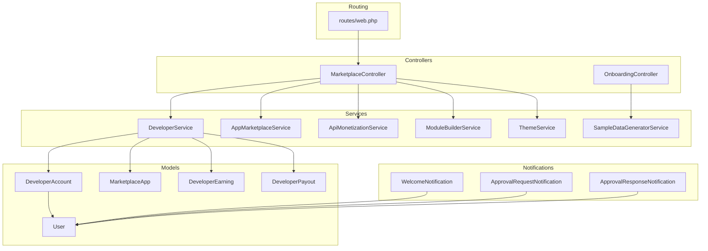
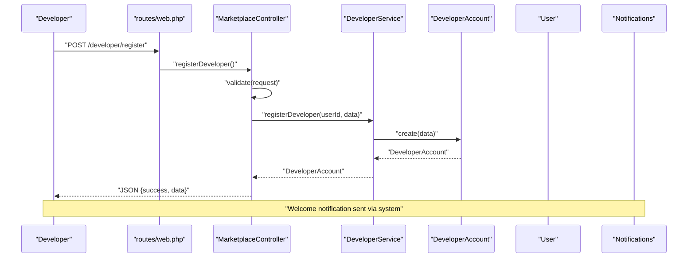
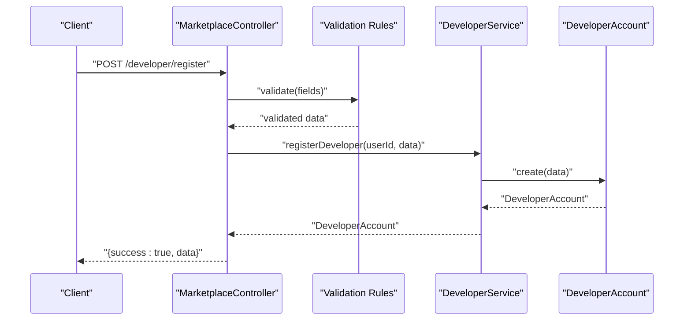
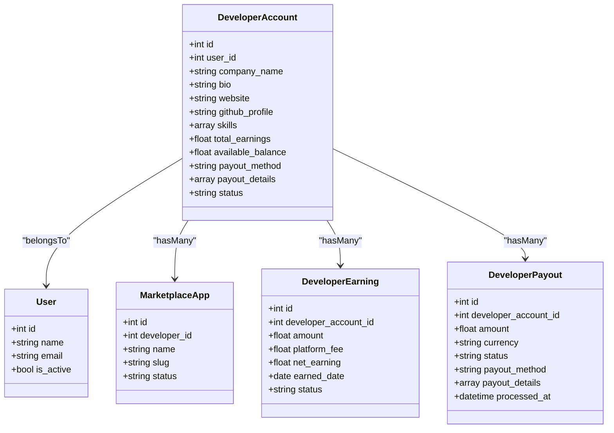
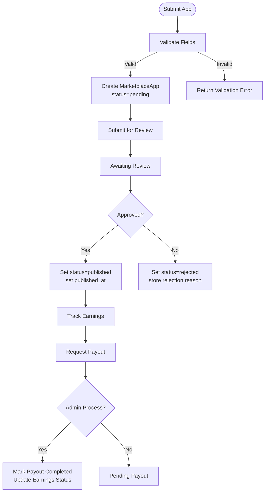
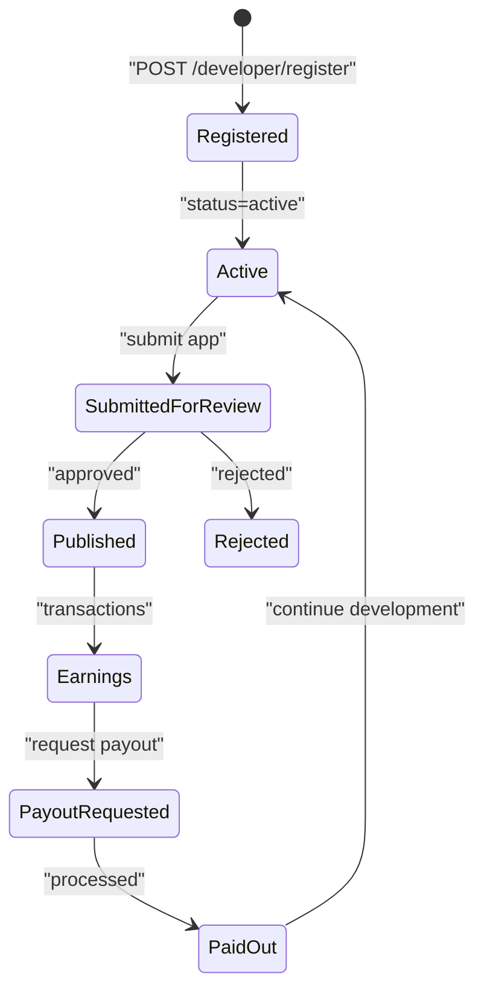
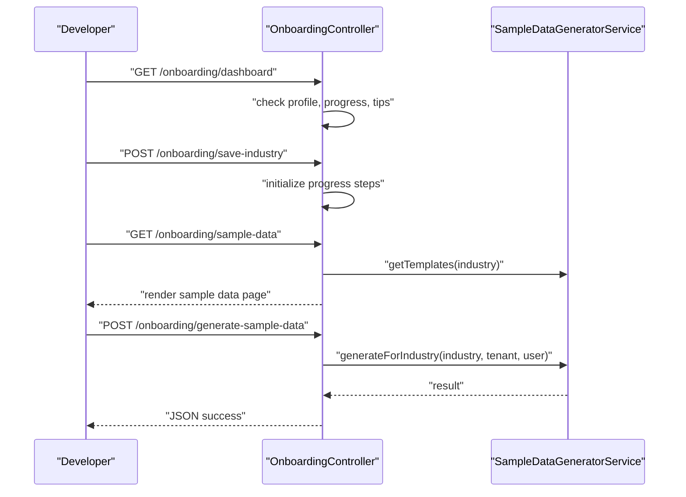
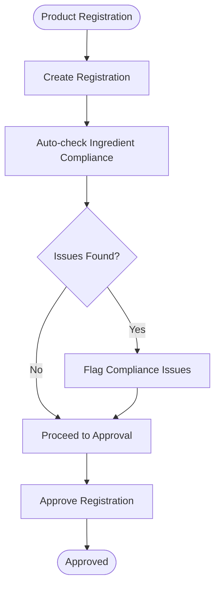
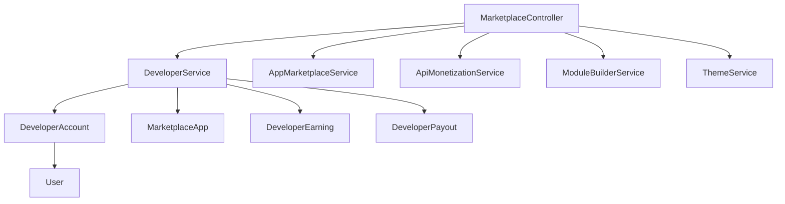

# Developer Onboarding & Registration

<cite>
**Referenced Files in This Document**
- [routes/web.php](file://routes/web.php)
- [app/Http/Controllers/Marketplace/MarketplaceController.php](file://app/Http/Controllers/Marketplace/MarketplaceController.php)
- [app/Services/Marketplace/DeveloperService.php](file://app/Services/Marketplace/DeveloperService.php)
- [app/Models/DeveloperAccount.php](file://app/Models/DeveloperAccount.php)
- [app/Models/User.php](file://app/Models/User.php)
- [app/Http/Requests/RegistrationRequest.php](file://app/Http/Requests/RegistrationRequest.php)
- [resources/views/auth/register.blade.php](file://resources/views/auth/register.blade.php)
- [app/Notifications/WelcomeNotification.php](file://app/Notifications/WelcomeNotification.php)
- [app/Notifications/ApprovalRequestNotification.php](file://app/Notifications/ApprovalRequestNotification.php)
- [app/Notifications/ApprovalResponseNotification.php](file://app/Notifications/ApprovalResponseNotification.php)
- [app/Http/Controllers/Cosmetic/RegistrationController.php](file://app/Http/Controllers/Cosmetic/RegistrationController.php)
- [app/Models/ProductRegistration.php](file://app/Models/ProductRegistration.php)
- [app/Models/RegistrationDocument.php](file://app/Models/RegistrationDocument.php)
- [app/Models/SafetyDataSheet.php](file://app/Models/SafetyDataSheet.php)
- [app/Models/IngredientRestriction.php](file://app/Models/IngredientRestriction.php)
- [app/Services/Marketplace/AppMarketplaceService.php](file://app/Services/Marketplace/AppMarketplaceService.php)
- [app/Services/Marketplace/ApiMonetizationService.php](file://app/Services/Marketplace/ApiMonetizationService.php)
- [app/Services/Marketplace/ModuleBuilderService.php](file://app/Services/Marketplace/ModuleBuilderService.php)
- [app/Services/Marketplace/ThemeService.php](file://app/Services/Marketplace/ThemeService.php)
- [app/Services/MarketplaceSyncService.php](file://app/Services/MarketplaceSyncService.php)
- [app/Jobs/ProcessMarketplaceWebhook.php](file://app/Jobs/ProcessMarketplaceWebhook.php)
- [app/Jobs/RetryFailedMarketplaceSyncs.php](file://app/Jobs/RetryFailedMarketplaceSyncs.php)
- [app/Models/MarketplaceSyncLog.php](file://app/Models/MarketplaceSyncLog.php)
- [app/Http/Controllers/OnboardingController.php](file://app/Http/Controllers/OnboardingController.php)
- [database/migrations/2026_04_06_080000_create_onboarding_tables.php](file://database/migrations/2026_04_06_080000_create_onboarding_tables.php)
- [app/Services/SampleDataGeneratorService.php](file://app/Services/SampleDataGeneratorService.php)
- [app/Models/MarketplaceApp.php](file://app/Models/MarketplaceApp.php)
- [app/Models/DeveloperEarning.php](file://app/Models/DeveloperEarning.php)
- [app/Models/DeveloperPayout.php](file://app/Models/DeveloperPayout.php)
</cite>

## Table of Contents
1. [Introduction](#introduction)
2. [Project Structure](#project-structure)
3. [Core Components](#core-components)
4. [Architecture Overview](#architecture-overview)
5. [Detailed Component Analysis](#detailed-component-analysis)
6. [Dependency Analysis](#dependency-analysis)
7. [Performance Considerations](#performance-considerations)
8. [Troubleshooting Guide](#troubleshooting-guide)
9. [Conclusion](#conclusion)
10. [Appendices](#appendices)

## Introduction
This document describes the Developer Onboarding & Registration system within the qalcuityERP platform. It covers the complete developer registration workflow, including company profile setup, skill validation, and account verification processes. It also documents the developer portal endpoints for app submission, review, earnings, and payouts, along with the developer account lifecycle from registration through approval, status tracking, and notifications. Guidance is included for new developers, common registration issues and troubleshooting, and compliance requirements for different developer types.

## Project Structure
The Developer Onboarding & Registration system spans routing, controllers, services, models, requests, notifications, and supporting infrastructure such as onboarding and marketplace services.

**Diagram sources**
- [routes/web.php:2907-2917](file://routes/web.php#L2907-L2917)
- [app/Http/Controllers/Marketplace/MarketplaceController.php:1-673](file://app/Http/Controllers/Marketplace/MarketplaceController.php#L1-L673)
- [app/Services/Marketplace/DeveloperService.php:1-270](file://app/Services/Marketplace/DeveloperService.php#L1-L270)
- [app/Http/Controllers/OnboardingController.php:1-286](file://app/Http/Controllers/OnboardingController.php#L1-L286)
- [app/Services/SampleDataGeneratorService.php](file://app/Services/SampleDataGeneratorService.php)
- [app/Models/DeveloperAccount.php:1-50](file://app/Models/DeveloperAccount.php#L1-L50)
- [app/Models/User.php:1-280](file://app/Models/User.php#L1-L280)
- [app/Models/MarketplaceApp.php](file://app/Models/MarketplaceApp.php)
- [app/Models/DeveloperEarning.php](file://app/Models/DeveloperEarning.php)
- [app/Models/DeveloperPayout.php](file://app/Models/DeveloperPayout.php)
- [app/Notifications/WelcomeNotification.php](file://app/Notifications/WelcomeNotification.php)
- [app/Notifications/ApprovalRequestNotification.php](file://app/Notifications/ApprovalRequestNotification.php)
- [app/Notifications/ApprovalResponseNotification.php](file://app/Notifications/ApprovalResponseNotification.php)

**Section sources**
- [routes/web.php:2907-2917](file://routes/web.php#L2907-L2917)
- [app/Http/Controllers/Marketplace/MarketplaceController.php:147-330](file://app/Http/Controllers/Marketplace/MarketplaceController.php#L147-L330)
- [app/Services/Marketplace/DeveloperService.php:13-270](file://app/Services/Marketplace/DeveloperService.php#L13-L270)
- [app/Http/Controllers/OnboardingController.php:19-286](file://app/Http/Controllers/OnboardingController.php#L19-L286)

## Core Components
- Developer registration endpoint and validation
- Developer account model and relationships
- Developer service for registration, app lifecycle, earnings, and payouts
- Developer portal routes for app management, earnings, and payouts
- Notification system for welcome and approvals
- Onboarding controller and sample data generation for tenant onboarding (contextual to developer experience)
- Marketplace services for apps, API monetization, modules, and themes

**Section sources**
- [app/Http/Controllers/Marketplace/MarketplaceController.php:147-330](file://app/Http/Controllers/Marketplace/MarketplaceController.php#L147-L330)
- [app/Services/Marketplace/DeveloperService.php:13-270](file://app/Services/Marketplace/DeveloperService.php#L13-L270)
- [app/Models/DeveloperAccount.php:12-49](file://app/Models/DeveloperAccount.php#L12-L49)
- [app/Models/User.php:15-280](file://app/Models/User.php#L15-L280)

## Architecture Overview
The developer registration and onboarding flow integrates HTTP endpoints, validation, service orchestration, persistence, and notifications.

**Diagram sources**
- [routes/web.php:2907-2917](file://routes/web.php#L2907-L2917)
- [app/Http/Controllers/Marketplace/MarketplaceController.php:147-166](file://app/Http/Controllers/Marketplace/MarketplaceController.php#L147-L166)
- [app/Services/Marketplace/DeveloperService.php:16-27](file://app/Services/Marketplace/DeveloperService.php#L16-L27)
- [app/Models/DeveloperAccount.php:12-36](file://app/Models/DeveloperAccount.php#L12-L36)
- [app/Models/User.php:15-40](file://app/Models/User.php#L15-L40)
- [app/Notifications/WelcomeNotification.php](file://app/Notifications/WelcomeNotification.php)

## Detailed Component Analysis

### Developer Registration Endpoint and Validation
- Endpoint: POST /developer/register
- Validates: company_name, bio, website, github_profile, skills
- Creates DeveloperAccount with status set to active upon successful registration
- Returns JSON success response with created developer data

**Diagram sources**
- [routes/web.php:2907-2917](file://routes/web.php#L2907-L2917)
- [app/Http/Controllers/Marketplace/MarketplaceController.php:147-166](file://app/Http/Controllers/Marketplace/MarketplaceController.php#L147-L166)
- [app/Services/Marketplace/DeveloperService.php:16-27](file://app/Services/Marketplace/DeveloperService.php#L16-L27)
- [app/Models/DeveloperAccount.php:12-36](file://app/Models/DeveloperAccount.php#L12-L36)

**Section sources**
- [routes/web.php:2907-2917](file://routes/web.php#L2907-L2917)
- [app/Http/Controllers/Marketplace/MarketplaceController.php:147-166](file://app/Http/Controllers/Marketplace/MarketplaceController.php#L147-L166)
- [app/Services/Marketplace/DeveloperService.php:16-27](file://app/Services/Marketplace/DeveloperService.php#L16-L27)

### Developer Account Model and Relationships
- Fillable attributes include user_id, company_name, bio, website, github_profile, skills, total_earnings, available_balance, payout_method, payout_details, status
- Casts: skills as array, financial amounts as decimal with two decimals, payout_details as array
- Relationships:
  - belongs to User
  - has many MarketplaceApp (apps)
  - has many DeveloperEarning (earnings)
  - has many DeveloperPayout (payouts)

**Diagram sources**
- [app/Models/DeveloperAccount.php:12-49](file://app/Models/DeveloperAccount.php#L12-L49)
- [app/Models/User.php:19-40](file://app/Models/User.php#L19-L40)
- [app/Models/MarketplaceApp.php](file://app/Models/MarketplaceApp.php)
- [app/Models/DeveloperEarning.php](file://app/Models/DeveloperEarning.php)
- [app/Models/DeveloperPayout.php](file://app/Models/DeveloperPayout.php)

**Section sources**
- [app/Models/DeveloperAccount.php:12-49](file://app/Models/DeveloperAccount.php#L12-L49)
- [app/Models/User.php:19-40](file://app/Models/User.php#L19-L40)

### Developer App Lifecycle (Submission, Review, Approval, Publishing)
- Submission: POST /developer/apps with validation for name, description, category, pricing, screenshots, repository_url, etc.
- Update: PUT /developer/apps/{id}
- Submit for review: POST /developer/apps/{id}/submit-review
- Approve (admin): PUT /developer/apps/{id} sets status to published
- Reject (admin): POST /developer/apps/{id} with reason
- List apps: GET /developer/apps
- Earnings summary: GET /developer/earnings
- Payout request: POST /developer/payouts with amount, method, and details
- Payout processing (admin): POST /developer/payouts/{id} with reference number

**Diagram sources**
- [app/Http/Controllers/Marketplace/MarketplaceController.php:169-330](file://app/Http/Controllers/Marketplace/MarketplaceController.php#L169-L330)
- [app/Services/Marketplace/DeveloperService.php:32-247](file://app/Services/Marketplace/DeveloperService.php#L32-L247)

**Section sources**
- [app/Http/Controllers/Marketplace/MarketplaceController.php:169-330](file://app/Http/Controllers/Marketplace/MarketplaceController.php#L169-L330)
- [app/Services/Marketplace/DeveloperService.php:32-247](file://app/Services/Marketplace/DeveloperService.php#L32-L247)

### Developer Account Lifecycle and Status Tracking
- Registration: Developer registers via POST /developer/register; status initialized as active
- App lifecycle: Apps progress through pending, published, or rejected states
- Earnings and payouts: Earnings tracked per transaction; payouts reduce available_balance and mark earnings as paid
- Notifications: Welcome, approval request, and approval response notifications are available for developer onboarding and app review

**Diagram sources**
- [routes/web.php:2907-2917](file://routes/web.php#L2907-L2917)
- [app/Services/Marketplace/DeveloperService.php:16-247](file://app/Services/Marketplace/DeveloperService.php#L16-L247)
- [app/Notifications/WelcomeNotification.php](file://app/Notifications/WelcomeNotification.php)
- [app/Notifications/ApprovalRequestNotification.php](file://app/Notifications/ApprovalRequestNotification.php)
- [app/Notifications/ApprovalResponseNotification.php](file://app/Notifications/ApprovalResponseNotification.php)

**Section sources**
- [routes/web.php:2907-2917](file://routes/web.php#L2907-L2917)
- [app/Services/Marketplace/DeveloperService.php:16-247](file://app/Services/Marketplace/DeveloperService.php#L16-L247)
- [app/Notifications/WelcomeNotification.php](file://app/Notifications/WelcomeNotification.php)
- [app/Notifications/ApprovalRequestNotification.php](file://app/Notifications/ApprovalRequestNotification.php)
- [app/Notifications/ApprovalResponseNotification.php](file://app/Notifications/ApprovalResponseNotification.php)

### Onboarding Context for Developers
While primarily focused on tenant onboarding, the onboarding controller and sample data generator support developer onboarding experiences by initializing profiles, progress steps, and generating industry-specific sample data templates.

**Diagram sources**
- [app/Http/Controllers/OnboardingController.php:19-286](file://app/Http/Controllers/OnboardingController.php#L19-L286)
- [app/Services/SampleDataGeneratorService.php](file://app/Services/SampleDataGeneratorService.php)
- [database/migrations/2026_04_06_080000_create_onboarding_tables.php:31-48](file://database/migrations/2026_04_06_080000_create_onboarding_tables.php#L31-L48)

**Section sources**
- [app/Http/Controllers/OnboardingController.php:19-286](file://app/Http/Controllers/OnboardingController.php#L19-L286)
- [database/migrations/2026_04_06_080000_create_onboarding_tables.php:31-48](file://database/migrations/2026_04_06_080000_create_onboarding_tables.php#L31-L48)

### Compliance and Verification Context
Although the primary developer registration does not require company credential verification or GitHub profile linking, the system includes compliance and verification patterns that can be extended. For example, product registration includes compliance checks against ingredient restrictions and SDS (Safety Data Sheets), which can serve as a model for extending developer verification workflows.

**Diagram sources**
- [app/Http/Controllers/Cosmetic/RegistrationController.php:18-142](file://app/Http/Controllers/Cosmetic/RegistrationController.php#L18-L142)
- [app/Models/ProductRegistration.php:105-138](file://app/Models/ProductRegistration.php#L105-L138)
- [app/Models/IngredientRestriction.php](file://app/Models/IngredientRestriction.php)
- [app/Models/SafetyDataSheet.php](file://app/Models/SafetyDataSheet.php)

**Section sources**
- [app/Http/Controllers/Cosmetic/RegistrationController.php:18-142](file://app/Http/Controllers/Cosmetic/RegistrationController.php#L18-L142)
- [app/Models/ProductRegistration.php:105-138](file://app/Models/ProductRegistration.php#L105-L138)
- [app/Models/IngredientRestriction.php](file://app/Models/IngredientRestriction.php)
- [app/Models/SafetyDataSheet.php](file://app/Models/SafetyDataSheet.php)

## Dependency Analysis
The developer portal relies on several marketplace services and models. The following diagram highlights key dependencies among controllers, services, and models.

**Diagram sources**
- [app/Http/Controllers/Marketplace/MarketplaceController.php:13-28](file://app/Http/Controllers/Marketplace/MarketplaceController.php#L13-L28)
- [app/Services/Marketplace/DeveloperService.php:5-9](file://app/Services/Marketplace/DeveloperService.php#L5-L9)
- [app/Models/DeveloperAccount.php:33-48](file://app/Models/DeveloperAccount.php#L33-L48)

**Section sources**
- [app/Http/Controllers/Marketplace/MarketplaceController.php:13-28](file://app/Http/Controllers/Marketplace/MarketplaceController.php#L13-L28)
- [app/Services/Marketplace/DeveloperService.php:5-9](file://app/Services/Marketplace/DeveloperService.php#L5-L9)
- [app/Models/DeveloperAccount.php:33-48](file://app/Models/DeveloperAccount.php#L33-L48)

## Performance Considerations
- Validation occurs at the controller level; keep validation rules concise and leverage service-layer transformations to minimize redundant checks.
- Use pagination for listing developer apps and earnings summaries to avoid large payloads.
- Cache frequently accessed dashboard data (e.g., counts, summaries) to reduce repeated queries.
- Offload heavy tasks (e.g., marketplace syncs) to queued jobs to improve responsiveness.

## Troubleshooting Guide
Common issues and resolutions during developer registration and onboarding:

- Registration fails validation
  - Ensure all required fields meet validation rules (e.g., website and GitHub profile URLs are valid).
  - Confirm the user is authenticated and associated with the current tenant.

- App submission errors
  - Verify the developer account exists for the authenticated user.
  - Ensure unique app slugs are generated; the service appends a random suffix if duplicates exist.

- Payout request failures
  - Insufficient balance triggers an exception; ensure available_balance is sufficient before requesting payouts.
  - Validate payout method and details arrays conform to expected structure.

- Onboarding not progressing
  - Confirm the onboarding profile exists for the user; otherwise, redirect to the wizard.
  - Check progress initialization for the selected industry.

**Section sources**
- [app/Http/Controllers/Marketplace/MarketplaceController.php:147-330](file://app/Http/Controllers/Marketplace/MarketplaceController.php#L147-L330)
- [app/Services/Marketplace/DeveloperService.php:197-218](file://app/Services/Marketplace/DeveloperService.php#L197-L218)
- [app/Http/Controllers/OnboardingController.php:22-91](file://app/Http/Controllers/OnboardingController.php#L22-L91)

## Conclusion
The Developer Onboarding & Registration system provides a streamlined pathway for developers to register, manage apps, track earnings, and request payouts. The system leverages clear endpoints, robust validation, and a well-defined service layer to maintain separation of concerns. Extending the system to include company credential verification, GitHub profile linking, and skill assessments would enhance trust and compliance while maintaining the existing architecture’s modularity.

## Appendices

### Registration Form Fields and Validation Rules
- Registration endpoint (POST /developer/register):
  - company_name: nullable string
  - bio: nullable string
  - website: nullable URL
  - github_profile: nullable URL
  - skills: nullable array

- App submission endpoint (POST /developer/apps):
  - name: required string
  - description: nullable string
  - version: nullable string
  - category: required string
  - screenshots: nullable array
  - icon_url: nullable URL
  - price: nullable numeric >= 0
  - pricing_model: nullable string in [one_time, subscription, freemium]
  - subscription_price: nullable numeric
  - subscription_period: nullable string in [monthly, yearly]
  - features: nullable array
  - requirements: nullable array
  - documentation_url: nullable URL
  - support_url: nullable URL
  - repository_url: nullable URL

- Payout request endpoint (POST /developer/payouts):
  - amount: required numeric >= 10000
  - payout_method: required string in [bank_transfer, paypal, wire_transfer]
  - payout_details: required array

**Section sources**
- [app/Http/Controllers/Marketplace/MarketplaceController.php:152-189](file://app/Http/Controllers/Marketplace/MarketplaceController.php#L152-L189)
- [app/Http/Controllers/Marketplace/MarketplaceController.php:286-290](file://app/Http/Controllers/Marketplace/MarketplaceController.php#L286-L290)

### Developer Account Lifecycle Summary
- Registration: active status upon creation
- App lifecycle: pending → published or rejected
- Earnings: tracked per transaction; platform fees deducted
- Payouts: requested and processed; available_balance decremented

**Section sources**
- [app/Services/Marketplace/DeveloperService.php:16-247](file://app/Services/Marketplace/DeveloperService.php#L16-L247)

### Compliance Requirements for Different Developer Types
- Current system does not enforce company credential verification or GitHub profile linking for developer registration.
- Compliance patterns from product registration (ingredient restrictions, SDS) can guide extension of verification workflows for developers.

**Section sources**
- [app/Http/Controllers/Cosmetic/RegistrationController.php:18-142](file://app/Http/Controllers/Cosmetic/RegistrationController.php#L18-L142)
- [app/Models/ProductRegistration.php:105-138](file://app/Models/ProductRegistration.php#L105-L138)