# Developer Portal & App Management

<cite>
**Referenced Files in This Document**
- [web.php](file://routes/web.php)
- [MarketplaceController.php](file://app/Http/Controllers/Marketplace/MarketplaceController.php)
- [DeveloperService.php](file://app/Services/Marketplace/DeveloperService.php)
- [DeveloperAccount.php](file://app/Models/DeveloperAccount.php)
- [AppMarketplaceService.php](file://app/Services/Marketplace/AppMarketplaceService.php)
- [ApiMonetizationService.php](file://app/Services/Marketplace/ApiMonetizationService.php)
- [ModuleBuilderService.php](file://app/Services/Marketplace/ModuleBuilderService.php)
- [ThemeService.php](file://app/Services/Marketplace/ThemeService.php)
- [MarketplaceSyncService.php](file://app/Services/MarketplaceSyncService.php)
- [MarketplaceSyncLog.php](file://app/Models/MarketplaceSyncLog.php)
- [ProcessMarketplaceWebhook.php](file://app/Jobs/ProcessMarketplaceWebhook.php)
- [RetryFailedMarketplaceSyncs.php](file://app/Jobs/RetryFailedMarketplaceSyncs.php)
- [SyncMarketplacePrices.php](file://app/Jobs/SyncMarketplacePrices.php)
- [SyncMarketplaceStock.php](file://app/Jobs/SyncMarketplaceStock.php)
- [AdvancedAnalyticsDashboardController.php](file://app/Http/Controllers/Analytics/AdvancedAnalyticsDashboardController.php)
- [USER_MANUAL.md](file://docs/USER_MANUAL.md)
- [DEVELOPER_ONBOARDING.md](file://docs/DEVELOPER_ONBOARDING.md)
- [HEALTHCARE_REGULATORY_COMPLIANCE.md](file://docs/HEALTHCARE_REGULATORY_COMPLIANCE.md)
</cite>

## Table of Contents
1. [Introduction](#introduction)
2. [Project Structure](#project-structure)
3. [Core Components](#core-components)
4. [Architecture Overview](#architecture-overview)
5. [Detailed Component Analysis](#detailed-component-analysis)
6. [Dependency Analysis](#dependency-analysis)
7. [Performance Considerations](#performance-considerations)
8. [Troubleshooting Guide](#troubleshooting-guide)
9. [Conclusion](#conclusion)
10. [Appendices](#appendices)

## Introduction
This document describes the Developer Portal & App Management system within the QalcuityERP platform. It covers the complete developer workflow from registration to app deployment, including company profile setup, skills configuration, and account activation. It documents the app submission pipeline with validation rules, screenshot requirements, pricing configuration, and feature documentation. It explains the review and approval process, rejection workflows with reason tracking, and approval criteria. It also covers developer earnings calculation, payout processing, and tax documentation requirements. Finally, it outlines dashboard analytics for download metrics, revenue tracking, and performance insights, along with the developer support ecosystem, community guidelines, and compliance requirements.

## Project Structure
The Developer Portal is implemented as part of the Marketplace subsystem with dedicated routes under the developer namespace, controller actions delegating to service classes, and supporting models and jobs for synchronization and analytics.

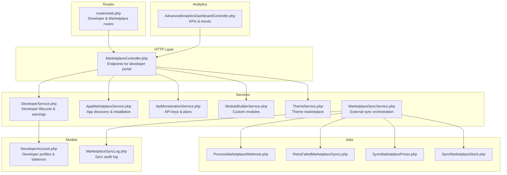

**Diagram sources**
- [web.php:2907-2960](file://routes/web.php#L2907-L2960)
- [MarketplaceController.php:1-673](file://app/Http/Controllers/Marketplace/MarketplaceController.php#L1-L673)
- [DeveloperService.php:1-270](file://app/Services/Marketplace/DeveloperService.php#L1-L270)
- [DeveloperAccount.php:1-50](file://app/Models/DeveloperAccount.php#L1-L50)
- [AppMarketplaceService.php](file://app/Services/Marketplace/AppMarketplaceService.php)
- [ApiMonetizationService.php](file://app/Services/Marketplace/ApiMonetizationService.php)
- [ModuleBuilderService.php](file://app/Services/Marketplace/ModuleBuilderService.php)
- [ThemeService.php](file://app/Services/Marketplace/ThemeService.php)
- [MarketplaceSyncService.php](file://app/Services/MarketplaceSyncService.php)
- [MarketplaceSyncLog.php](file://app/Models/MarketplaceSyncLog.php)
- [ProcessMarketplaceWebhook.php](file://app/Jobs/ProcessMarketplaceWebhook.php)
- [RetryFailedMarketplaceSyncs.php](file://app/Jobs/RetryFailedMarketplaceSyncs.php)
- [SyncMarketplacePrices.php](file://app/Jobs/SyncMarketplacePrices.php)
- [SyncMarketplaceStock.php](file://app/Jobs/SyncMarketplaceStock.php)
- [AdvancedAnalyticsDashboardController.php:1-150](file://app/Http/Controllers/Analytics/AdvancedAnalyticsDashboardController.php#L1-L150)

**Section sources**
- [web.php:2726-2960](file://routes/web.php#L2726-L2960)
- [MarketplaceController.php:1-673](file://app/Http/Controllers/Marketplace/MarketplaceController.php#L1-L673)

## Core Components
- Developer Portal routes: Registration, app submission/update, review submission, dashboard, earnings, payouts, API key management, and usage stats.
- MarketplaceController: Orchestrates requests, validates inputs, and delegates to service classes.
- DeveloperService: Manages developer accounts, app lifecycle (submit/update/submit-for-review/approve/reject), earnings aggregation, payout requests, and dashboard metrics.
- Supporting services: App marketplace operations, API monetization, custom module builder, theme marketplace, and marketplace sync orchestration.
- Analytics: Revenue trends, KPIs, and top metrics for performance insights.

**Section sources**
- [web.php:2907-2960](file://routes/web.php#L2907-L2960)
- [MarketplaceController.php:147-330](file://app/Http/Controllers/Marketplace/MarketplaceController.php#L147-L330)
- [DeveloperService.php:16-268](file://app/Services/Marketplace/DeveloperService.php#L16-L268)

## Architecture Overview
The Developer Portal follows a layered architecture:
- Routes define the developer and marketplace endpoints.
- Controller handles request validation and delegates to services.
- Services encapsulate business logic for developer operations, app management, API monetization, and marketplace synchronization.
- Models represent domain entities (developer accounts, apps, earnings, payouts).
- Jobs handle asynchronous marketplace sync tasks.
- Analytics controllers provide dashboard insights.

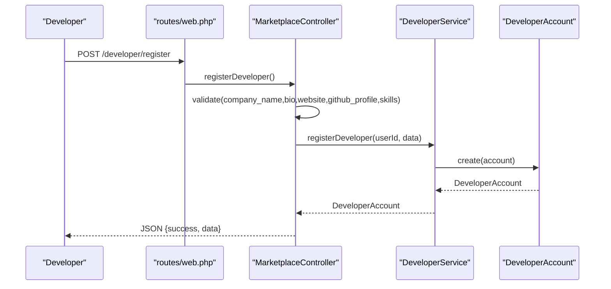

**Diagram sources**
- [web.php:2907-2911](file://routes/web.php#L2907-L2911)
- [MarketplaceController.php:147-166](file://app/Http/Controllers/Marketplace/MarketplaceController.php#L147-L166)
- [DeveloperService.php:16-27](file://app/Services/Marketplace/DeveloperService.php#L16-L27)
- [DeveloperAccount.php:12-31](file://app/Models/DeveloperAccount.php#L12-L31)

## Detailed Component Analysis

### Developer Registration and Profile Setup
- Endpoint: POST /developer/register
- Validation includes optional company profile fields and skills array.
- Creates a DeveloperAccount linked to the authenticated user, sets initial status to active, and persists skills as an array.

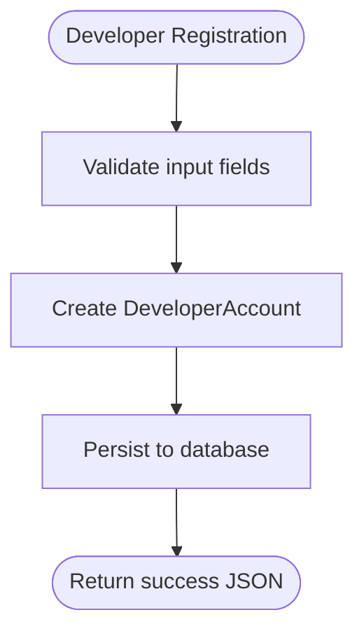

**Diagram sources**
- [web.php:2909-2910](file://routes/web.php#L2909-L2910)
- [MarketplaceController.php:150-166](file://app/Http/Controllers/Marketplace/MarketplaceController.php#L150-L166)
- [DeveloperService.php:16-27](file://app/Services/Marketplace/DeveloperService.php#L16-L27)
- [DeveloperAccount.php:12-31](file://app/Models/DeveloperAccount.php#L12-L31)

**Section sources**
- [web.php:2907-2911](file://routes/web.php#L2907-L2911)
- [MarketplaceController.php:147-166](file://app/Http/Controllers/Marketplace/MarketplaceController.php#L147-L166)
- [DeveloperService.php:16-27](file://app/Services/Marketplace/DeveloperService.php#L16-L27)
- [DeveloperAccount.php:12-31](file://app/Models/DeveloperAccount.php#L12-L31)

### App Submission Pipeline
- Endpoint: POST /developer/apps
- Validation enforces required name and category, optional version, screenshots array, icon URL, price numeric with min 0, pricing model enum (one_time, subscription, freemium), subscription price and period, features and requirements arrays, plus documentation/support/repository URLs.
- Slug generation ensures uniqueness; app created with status pending.

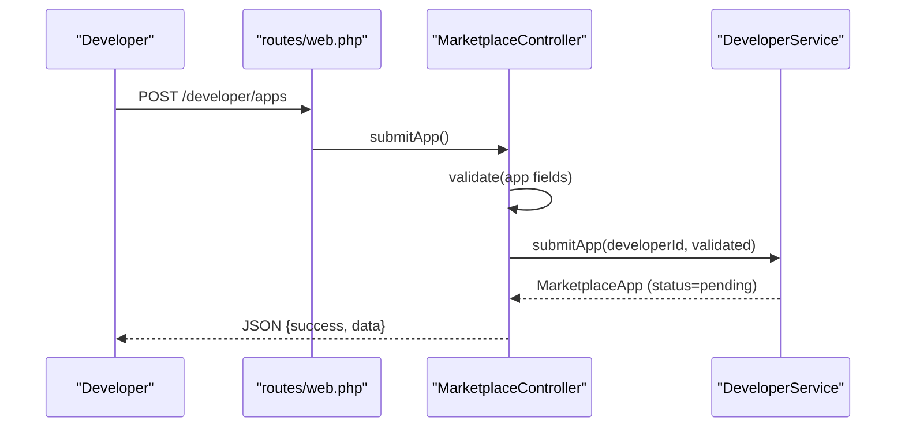

**Diagram sources**
- [web.php:2911-2912](file://routes/web.php#L2911-L2912)
- [MarketplaceController.php:171-198](file://app/Http/Controllers/Marketplace/MarketplaceController.php#L171-L198)
- [DeveloperService.php:32-62](file://app/Services/Marketplace/DeveloperService.php#L32-L62)

**Section sources**
- [web.php:2911-2912](file://routes/web.php#L2911-L2912)
- [MarketplaceController.php:171-198](file://app/Http/Controllers/Marketplace/MarketplaceController.php#L171-L198)
- [DeveloperService.php:32-62](file://app/Services/Marketplace/DeveloperService.php#L32-L62)

### App Review, Approval, and Rejection
- Submit for review: PUT /developer/apps/{id}/submit-review → sets status to pending.
- Admin approval: PUT /developer/apps/{id} → sets status to published and records published_at.
- Admin rejection: POST /developer/apps/{id} with reason → sets status to rejected with rejection_reason.

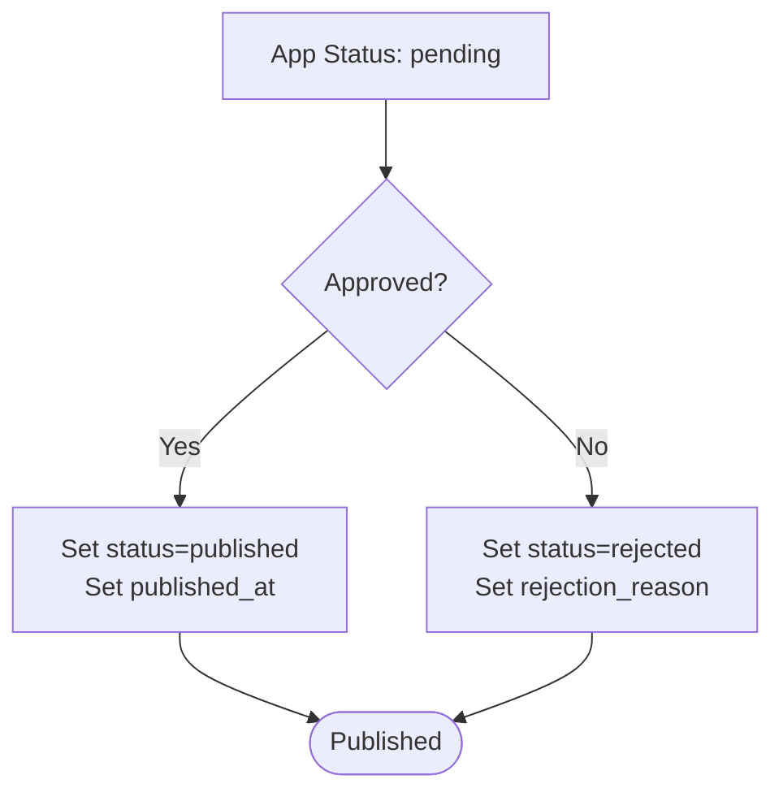

**Diagram sources**
- [web.php:2912-2912](file://routes/web.php#L2912-L2912)
- [MarketplaceController.php:214-251](file://app/Http/Controllers/Marketplace/MarketplaceController.php#L214-L251)
- [DeveloperService.php:87-148](file://app/Services/Marketplace/DeveloperService.php#L87-L148)

**Section sources**
- [web.php:2912-2912](file://routes/web.php#L2912-L2912)
- [MarketplaceController.php:214-251](file://app/Http/Controllers/Marketplace/MarketplaceController.php#L214-L251)
- [DeveloperService.php:87-148](file://app/Services/Marketplace/DeveloperService.php#L87-L148)

### Developer Earnings and Payouts
- Earnings summary endpoint: GET /developer/earnings with optional period (this_month, last_month, this_year).
- Payout request endpoint: POST /developer/payouts with amount minimum threshold, payout method enum, and payout details array.
- Payout processing (admin): POST /developer/payouts/{id} with reference number updates status to completed and marks related earnings as paid.

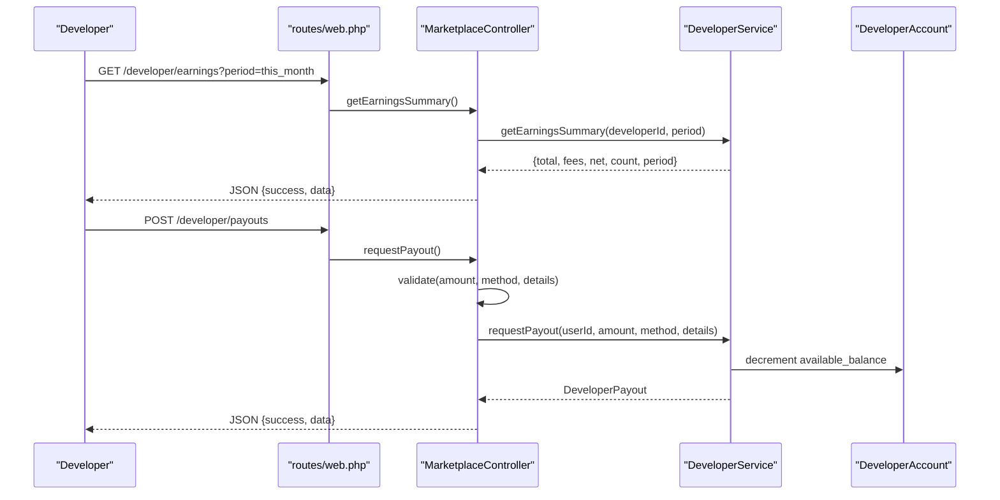

**Diagram sources**
- [web.php:2914-2916](file://routes/web.php#L2914-L2916)
- [MarketplaceController.php:267-303](file://app/Http/Controllers/Marketplace/MarketplaceController.php#L267-L303)
- [DeveloperService.php:164-218](file://app/Services/Marketplace/DeveloperService.php#L164-L218)
- [DeveloperAccount.php:12-31](file://app/Models/DeveloperAccount.php#L12-L31)

**Section sources**
- [web.php:2914-2916](file://routes/web.php#L2914-L2916)
- [MarketplaceController.php:267-303](file://app/Http/Controllers/Marketplace/MarketplaceController.php#L267-L303)
- [DeveloperService.php:164-218](file://app/Services/Marketplace/DeveloperService.php#L164-L218)
- [DeveloperAccount.php:12-31](file://app/Models/DeveloperAccount.php#L12-L31)

### API Keys, Plans, and Usage Analytics
- Generate API key: POST /api-management/keys with name, permissions, and rate limit.
- List API keys: GET /api-management/keys.
- Revoke API key: DELETE /api-management/keys/{id}.
- Usage stats: GET /api-management/usage with period.
- Subscribe to plan: POST /api-management/subscriptions with plan details.
- Upgrade plan: POST /api-management/subscriptions/{id}/upgrade.
- Current subscription: GET /api-management/subscription.

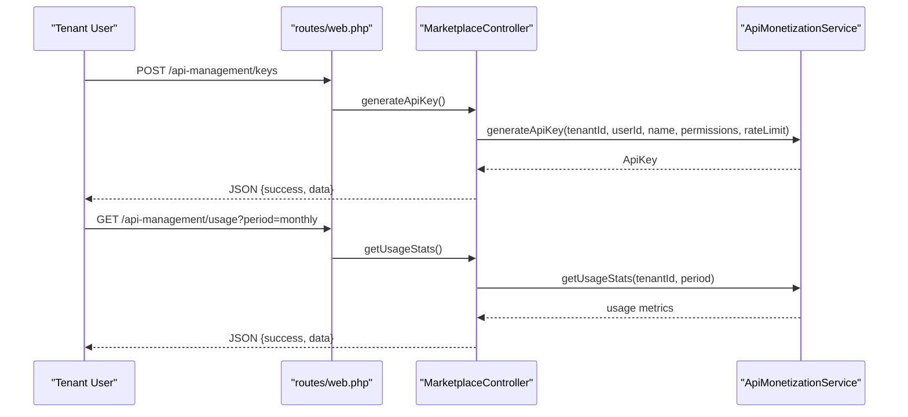

**Diagram sources**
- [web.php:2950-2959](file://routes/web.php#L2950-L2959)
- [MarketplaceController.php:520-606](file://app/Http/Controllers/Marketplace/MarketplaceController.php#L520-L606)
- [ApiMonetizationService.php](file://app/Services/Marketplace/ApiMonetizationService.php)

**Section sources**
- [web.php:2950-2959](file://routes/web.php#L2950-L2959)
- [MarketplaceController.php:520-606](file://app/Http/Controllers/Marketplace/MarketplaceController.php#L520-L606)

### Marketplace Apps and Installation
- Browse apps: GET /apps/
- Show app: GET /apps/{slug}
- Install app: POST /apps/{id}/install
- Uninstall app: DELETE /apps/{id}
- Configure app: POST /app-config/{installationId}
- My apps: GET /apps/my-apps

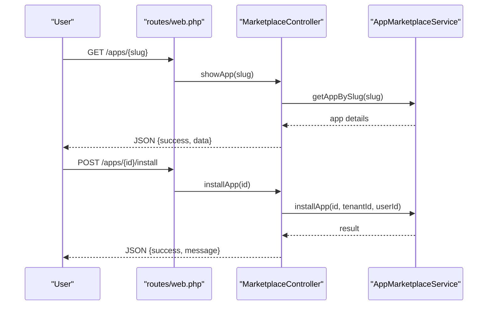

**Diagram sources**
- [web.php:2727-2734](file://routes/web.php#L2727-L2734)
- [MarketplaceController.php:34-141](file://app/Http/Controllers/Marketplace/MarketplaceController.php#L34-L141)
- [AppMarketplaceService.php](file://app/Services/Marketplace/AppMarketplaceService.php)

**Section sources**
- [web.php:2727-2734](file://routes/web.php#L2727-L2734)
- [MarketplaceController.php:34-141](file://app/Http/Controllers/Marketplace/MarketplaceController.php#L34-L141)

### Developer Dashboard and Analytics
- Developer dashboard: GET /developer/dashboard returns profile, apps count, total downloads, average rating, earnings summary, and pending payouts.
- Advanced analytics dashboard provides real-time KPIs, revenue trends, and top metrics.

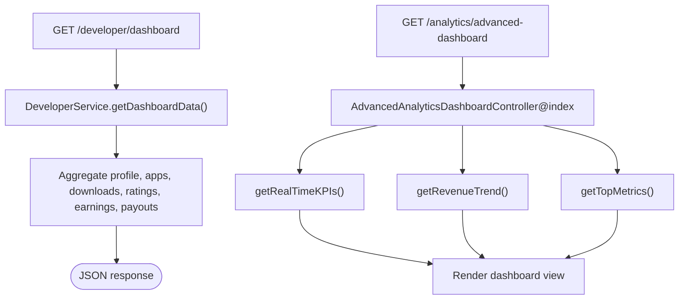

**Diagram sources**
- [web.php:2916-2916](file://routes/web.php#L2916-L2916)
- [MarketplaceController.php:320-330](file://app/Http/Controllers/Marketplace/MarketplaceController.php#L320-L330)
- [DeveloperService.php:252-268](file://app/Services/Marketplace/DeveloperService.php#L252-L268)
- [AdvancedAnalyticsDashboardController.php:24-150](file://app/Http/Controllers/Analytics/AdvancedAnalyticsDashboardController.php#L24-L150)

**Section sources**
- [web.php:2916-2916](file://routes/web.php#L2916-L2916)
- [MarketplaceController.php:320-330](file://app/Http/Controllers/Marketplace/MarketplaceController.php#L320-L330)
- [DeveloperService.php:252-268](file://app/Services/Marketplace/DeveloperService.php#L252-L268)
- [AdvancedAnalyticsDashboardController.php:24-150](file://app/Http/Controllers/Analytics/AdvancedAnalyticsDashboardController.php#L24-L150)

### Marketplace Synchronization and Webhooks
- MarketplaceSyncService orchestrates external marketplace synchronization.
- Jobs handle webhook processing, retries, and product/stock sync.

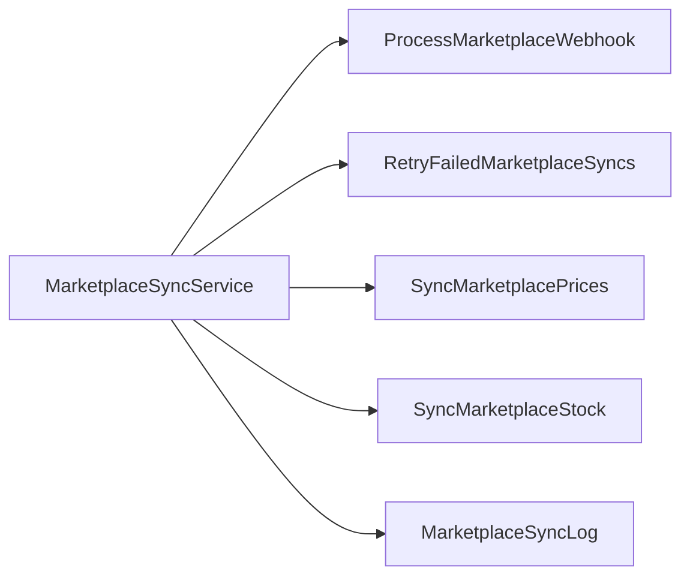

**Diagram sources**
- [MarketplaceSyncService.php](file://app/Services/MarketplaceSyncService.php)
- [ProcessMarketplaceWebhook.php](file://app/Jobs/ProcessMarketplaceWebhook.php)
- [RetryFailedMarketplaceSyncs.php](file://app/Jobs/RetryFailedMarketplaceSyncs.php)
- [SyncMarketplacePrices.php](file://app/Jobs/SyncMarketplacePrices.php)
- [SyncMarketplaceStock.php](file://app/Jobs/SyncMarketplaceStock.php)
- [MarketplaceSyncLog.php](file://app/Models/MarketplaceSyncLog.php)

**Section sources**
- [MarketplaceSyncService.php](file://app/Services/MarketplaceSyncService.php)
- [ProcessMarketplaceWebhook.php](file://app/Jobs/ProcessMarketplaceWebhook.php)
- [RetryFailedMarketplaceSyncs.php](file://app/Jobs/RetryFailedMarketplaceSyncs.php)
- [SyncMarketplacePrices.php](file://app/Jobs/SyncMarketplacePrices.php)
- [SyncMarketplaceStock.php](file://app/Jobs/SyncMarketplaceStock.php)
- [MarketplaceSyncLog.php](file://app/Models/MarketplaceSyncLog.php)

## Dependency Analysis
The Developer Portal relies on a clear separation of concerns:
- Routes depend on MarketplaceController.
- MarketplaceController depends on multiple service classes for marketplace, developer, API monetization, modules, and themes.
- DeveloperService depends on DeveloperAccount and related models for earnings and payouts.
- Analytics controllers depend on services and models for data retrieval and caching.

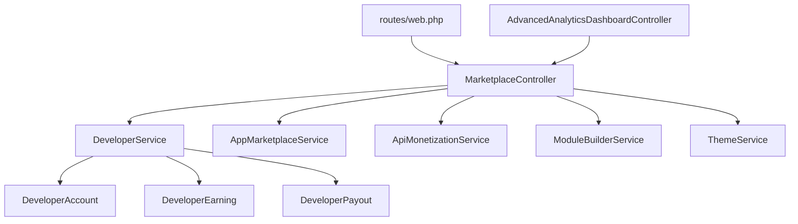

**Diagram sources**
- [web.php:2907-2960](file://routes/web.php#L2907-L2960)
- [MarketplaceController.php:1-673](file://app/Http/Controllers/Marketplace/MarketplaceController.php#L1-L673)
- [DeveloperService.php:1-270](file://app/Services/Marketplace/DeveloperService.php#L1-L270)
- [DeveloperAccount.php:1-50](file://app/Models/DeveloperAccount.php#L1-L50)
- [AdvancedAnalyticsDashboardController.php:1-150](file://app/Http/Controllers/Analytics/AdvancedAnalyticsDashboardController.php#L1-L150)

**Section sources**
- [web.php:2907-2960](file://routes/web.php#L2907-L2960)
- [MarketplaceController.php:1-673](file://app/Http/Controllers/Marketplace/MarketplaceController.php#L1-L673)
- [DeveloperService.php:1-270](file://app/Services/Marketplace/DeveloperService.php#L1-L270)
- [DeveloperAccount.php:1-50](file://app/Models/DeveloperAccount.php#L1-L50)
- [AdvancedAnalyticsDashboardController.php:1-150](file://app/Http/Controllers/Analytics/AdvancedAnalyticsDashboardController.php#L1-L150)

## Performance Considerations
- Use caching for analytics queries to reduce database load (as seen in advanced analytics controller).
- Batch operations for marketplace sync jobs to avoid frequent external calls.
- Index frequently queried fields (e.g., developer_id, status, tenant_id) in models.
- Limit payload sizes for screenshots and feature lists to maintain efficient API responses.

## Troubleshooting Guide
- Registration failures: Verify input validation rules and ensure unique slug generation for apps.
- Payout errors: Confirm sufficient available balance and proper payout method configuration.
- Review rejections: Ensure rejection reason is provided and stored correctly.
- API key issues: Check rate limits and active status; confirm permissions align with intended usage.
- Analytics discrepancies: Validate cache keys and refresh intervals; confirm date range filters.

**Section sources**
- [MarketplaceController.php:150-166](file://app/Http/Controllers/Marketplace/MarketplaceController.php#L150-L166)
- [DeveloperService.php:197-218](file://app/Services/Marketplace/DeveloperService.php#L197-L218)
- [MarketplaceController.php:242-251](file://app/Http/Controllers/Marketplace/MarketplaceController.php#L242-L251)
- [MarketplaceController.php:522-590](file://app/Http/Controllers/Marketplace/MarketplaceController.php#L522-L590)
- [AdvancedAnalyticsDashboardController.php:55-117](file://app/Http/Controllers/Analytics/AdvancedAnalyticsDashboardController.php#L55-L117)

## Conclusion
The Developer Portal & App Management system provides a comprehensive toolkit for developers to register, build, deploy, and monetize applications within the QalcuityERP ecosystem. It supports robust validation, transparent review workflows, accurate earnings computation, and streamlined payout processing. The integrated analytics and marketplace synchronization capabilities enable developers to track performance and maintain operational efficiency.

## Appendices

### Developer Support and Community Guidelines
- Support channels include email, live chat, phone, and a knowledge base.
- Feature requests can be submitted via the help system and tracked in “My Requests.”

**Section sources**
- [USER_MANUAL.md:516-543](file://docs/USER_MANUAL.md#L516-L543)

### Developer Onboarding
- Environment setup, prerequisites, coding standards, and development workflow are documented for contributors.

**Section sources**
- [DEVELOPER_ONBOARDING.md:1-67](file://docs/DEVELOPER_ONBOARDING.md#L1-L67)

### Compliance Requirements
- Regulatory compliance documentation includes audit trail structure, access violation types, backup strategy, and retention policies.

**Section sources**
- [HEALTHCARE_REGULATORY_COMPLIANCE.md:334-389](file://docs/HEALTHCARE_REGULATORY_COMPLIANCE.md#L334-L389)