# Monetization & Earnings Management

<cite>
**Referenced Files in This Document**
- [Affiliate.php](file://app/Models/Affiliate.php)
- [AffiliateCommission.php](file://app/Models/AffiliateCommission.php)
- [AffiliatePayout.php](file://app/Models/AffiliatePayout.php)
- [AffiliateReferral.php](file://app/Models/AffiliateReferral.php)
- [AffiliateAuditLog.php](file://app/Models/AffiliateAuditLog.php)
- [CommissionRule.php](file://app/Models/CommissionRule.php)
- [CommissionCalculation.php](file://app/Models/CommissionCalculation.php)
- [AffiliateService.php](file://app/Services/AffiliateService.php)
- [AffiliateDashboardController.php](file://app/Http/Controllers/AffiliateDashboardController.php)
- [DeveloperAccount.php](file://app/Models/DeveloperAccount.php)
- [DeveloperService.php](file://app/Services/Marketplace/DeveloperService.php)
</cite>

## Table of Contents
1. [Introduction](#introduction)
2. [Project Structure](#project-structure)
3. [Core Components](#core-components)
4. [Architecture Overview](#architecture-overview)
5. [Detailed Component Analysis](#detailed-component-analysis)
6. [Dependency Analysis](#dependency-analysis)
7. [Performance Considerations](#performance-considerations)
8. [Troubleshooting Guide](#troubleshooting-guide)
9. [Conclusion](#conclusion)

## Introduction
This document describes the Monetization & Earnings Management system, covering:
- Developer earnings calculation methodology and revenue sharing
- Commission structures and affiliate payouts
- Payout request process, thresholds, and scheduling
- Tax documentation and compliance reporting
- Earnings dashboard with download metrics and performance insights
- Payout methods, details collection, verification, processing timelines, currency handling, and dispute resolution

## Project Structure
The monetization system spans models, services, and controllers:
- Affiliate program: models for referrals, commissions, payouts, audit logs; service for fraud-aware commission creation; controller for dashboard and withdrawal requests
- Developer marketplace: models for developer accounts, earnings, and payouts; service for registration, app lifecycle, earnings aggregation, and payouts

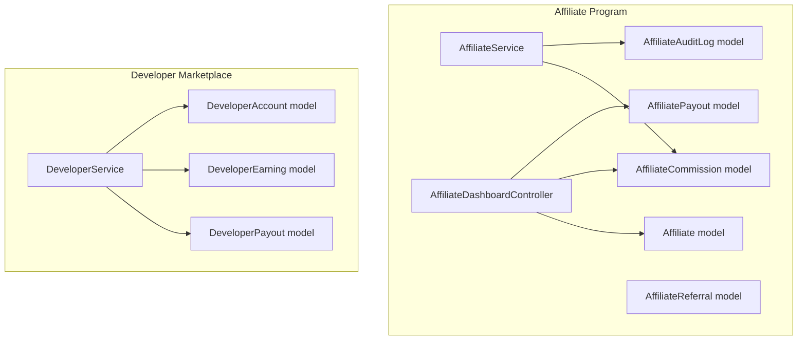

**Diagram sources**
- [Affiliate.php:1-61](file://app/Models/Affiliate.php#L1-L61)
- [AffiliateReferral.php:1-23](file://app/Models/AffiliateReferral.php#L1-L23)
- [AffiliateCommission.php:1-34](file://app/Models/AffiliateCommission.php#L1-L34)
- [AffiliatePayout.php:1-28](file://app/Models/AffiliatePayout.php#L1-L28)
- [AffiliateAuditLog.php:1-34](file://app/Models/AffiliateAuditLog.php#L1-L34)
- [AffiliateService.php:1-200](file://app/Services/AffiliateService.php#L1-L200)
- [AffiliateDashboardController.php:1-106](file://app/Http/Controllers/AffiliateDashboardController.php#L1-L106)
- [DeveloperAccount.php:1-50](file://app/Models/DeveloperAccount.php#L1-L50)
- [DeveloperService.php:1-270](file://app/Services/Marketplace/DeveloperService.php#L1-L270)

**Section sources**
- [Affiliate.php:1-61](file://app/Models/Affiliate.php#L1-L61)
- [AffiliateService.php:1-200](file://app/Services/AffiliateService.php#L1-L200)
- [AffiliateDashboardController.php:1-106](file://app/Http/Controllers/AffiliateDashboardController.php#L1-L106)
- [DeveloperAccount.php:1-50](file://app/Models/DeveloperAccount.php#L1-L50)
- [DeveloperService.php:1-270](file://app/Services/Marketplace/DeveloperService.php#L1-L270)

## Core Components
- Affiliate program
  - Referrals tracked via AffiliateReferral
  - Commissions computed by AffiliateService and persisted in AffiliateCommission
  - Payouts managed via AffiliatePayout with audit trail in AffiliateAuditLog
  - Affiliate model maintains balance and profile fields
- Developer marketplace
  - DeveloperAccount holds profile, skills, balances, and payout preferences
  - DeveloperService orchestrates app lifecycle, earnings aggregation, and payouts
  - DeveloperEarning and DeveloperPayout models track income and disbursements

Key responsibilities:
- Fraud detection and audit logging for affiliate actions
- Tiered and flat commission calculations
- Monthly earnings summaries and dashboard metrics
- Payout request validation and processing

**Section sources**
- [Affiliate.php:1-61](file://app/Models/Affiliate.php#L1-L61)
- [AffiliateCommission.php:1-34](file://app/Models/AffiliateCommission.php#L1-L34)
- [AffiliatePayout.php:1-28](file://app/Models/AffiliatePayout.php#L1-L28)
- [AffiliateReferral.php:1-23](file://app/Models/AffiliateReferral.php#L1-L23)
- [AffiliateAuditLog.php:1-34](file://app/Models/AffiliateAuditLog.php#L1-L34)
- [CommissionRule.php:1-67](file://app/Models/CommissionRule.php#L1-L67)
- [CommissionCalculation.php:1-35](file://app/Models/CommissionCalculation.php#L1-L35)
- [AffiliateService.php:1-200](file://app/Services/AffiliateService.php#L1-L200)
- [AffiliateDashboardController.php:1-106](file://app/Http/Controllers/AffiliateDashboardController.php#L1-L106)
- [DeveloperAccount.php:1-50](file://app/Models/DeveloperAccount.php#L1-L50)
- [DeveloperService.php:1-270](file://app/Services/Marketplace/DeveloperService.php#L1-L270)

## Architecture Overview
The system integrates two complementary monetization tracks:
- Affiliate program: referral-based commissions with fraud checks and audit logs
- Developer marketplace: app sales and subscriptions with earnings aggregation and payouts

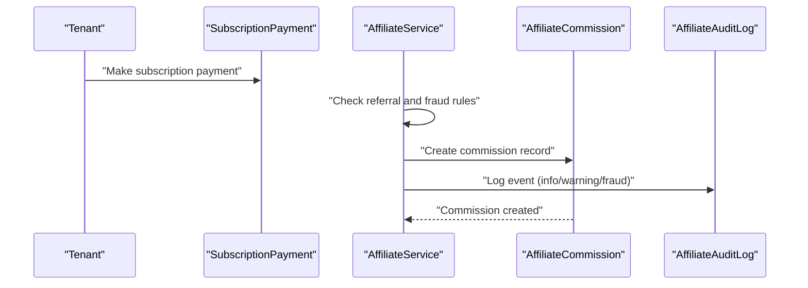

**Diagram sources**
- [AffiliateService.php:69-119](file://app/Services/AffiliateService.php#L69-L119)
- [AffiliateCommission.php:1-34](file://app/Models/AffiliateCommission.php#L1-L34)
- [AffiliateAuditLog.php:1-34](file://app/Models/AffiliateAuditLog.php#L1-L34)

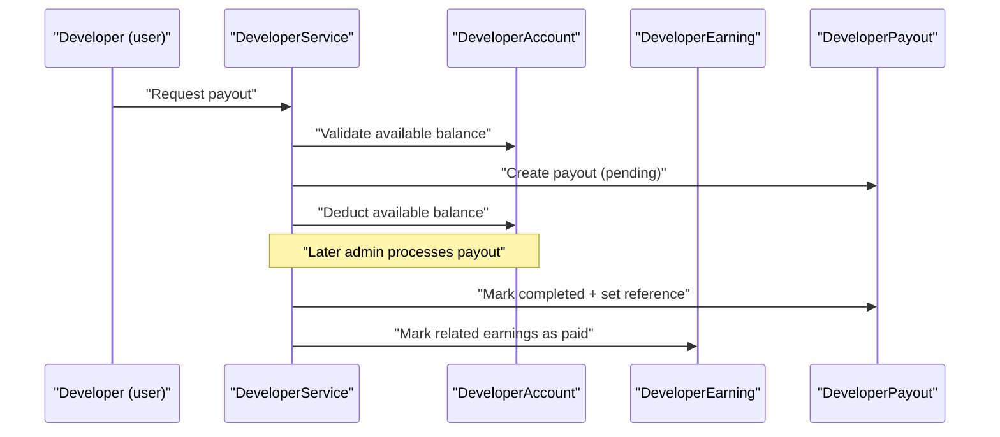

**Diagram sources**
- [DeveloperService.php:197-247](file://app/Services/Marketplace/DeveloperService.php#L197-L247)
- [DeveloperAccount.php:1-50](file://app/Models/DeveloperAccount.php#L1-L50)
- [DeveloperPayout.php:1-28](file://app/Models/DeveloperPayout.php#L1-L28)
- [DeveloperEarning.php:1-200](file://app/Models/DeveloperEarning.php#L1-L200)

## Detailed Component Analysis

### Affiliate Program

#### Commission Calculation and Fraud Controls
- Commission created upon qualifying subscription payments
- Fraud checks include:
  - Same IP as affiliate user
  - Demo tenant ownership
  - Rapid referral volume (>5 in 24h)
- Commission amount computed as percentage of payment amount using affiliate’s commission rate
- Records stored with plan name, payment amount, rate, and amount; status initialized as pending

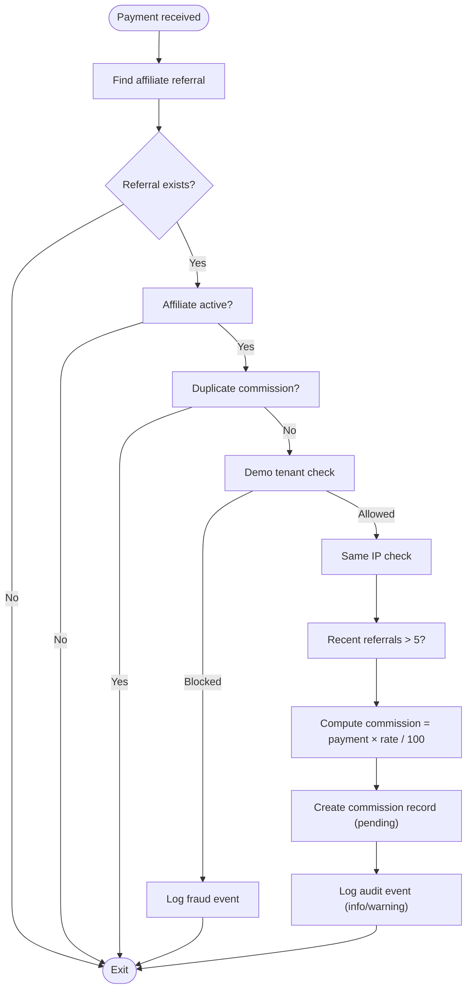

**Diagram sources**
- [AffiliateService.php:69-119](file://app/Services/AffiliateService.php#L69-L119)
- [AffiliateCommission.php:1-34](file://app/Models/AffiliateCommission.php#L1-L34)
- [AffiliateAuditLog.php:1-34](file://app/Models/AffiliateAuditLog.php#L1-L34)

**Section sources**
- [AffiliateService.php:69-119](file://app/Services/AffiliateService.php#L69-L119)
- [AffiliateAuditLog.php:1-34](file://app/Models/AffiliateAuditLog.php#L1-L34)

#### Payout Request and Processing
- Minimum threshold enforced per dashboard controller
- Pending withdrawal limit: only one pending request at a time
- Bank details required before withdrawal request is accepted
- Withdrawal requests recorded with requested_by, requested_at, and status pending
- AffiliateAuditLog captures each withdrawal request with severity and metadata

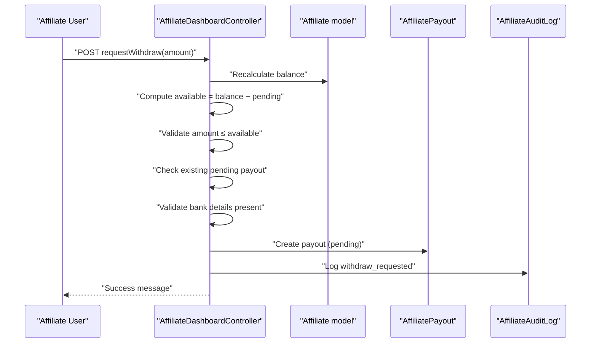

**Diagram sources**
- [AffiliateDashboardController.php:45-87](file://app/Http/Controllers/AffiliateDashboardController.php#L45-L87)
- [AffiliatePayout.php:1-28](file://app/Models/AffiliatePayout.php#L1-L28)
- [AffiliateAuditLog.php:1-34](file://app/Models/AffiliateAuditLog.php#L1-L34)

**Section sources**
- [AffiliateDashboardController.php:45-87](file://app/Http/Controllers/AffiliateDashboardController.php#L45-L87)
- [AffiliatePayout.php:1-28](file://app/Models/AffiliatePayout.php#L1-L28)
- [AffiliateAuditLog.php:1-34](file://app/Models/AffiliateAuditLog.php#L1-L34)

#### Earnings Dashboard
- Displays monthly earnings trend (last six months)
- Shows recent referrals and commissions
- Lists recent payouts and pending withdrawals
- Recalculates balance to reflect approved/paid commissions and completed payouts

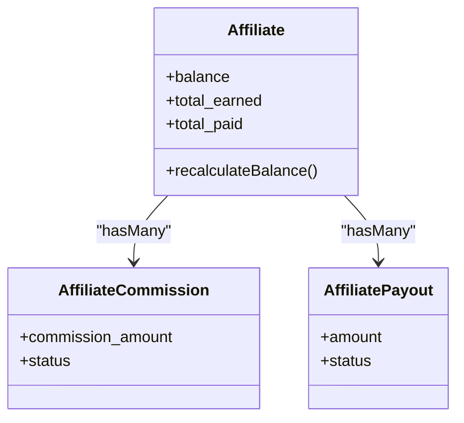

**Diagram sources**
- [Affiliate.php:50-59](file://app/Models/Affiliate.php#L50-L59)
- [AffiliateCommission.php:1-34](file://app/Models/AffiliateCommission.php#L1-L34)
- [AffiliatePayout.php:1-28](file://app/Models/AffiliatePayout.php#L1-L28)

**Section sources**
- [Affiliate.php:50-59](file://app/Models/Affiliate.php#L50-L59)
- [AffiliateDashboardController.php:14-43](file://app/Http/Controllers/AffiliateDashboardController.php#L14-L43)

### Developer Marketplace

#### Earnings Calculation and Revenue Sharing
- DeveloperAccount stores total earnings, available balance, and payout method/detauls
- DeveloperService aggregates earnings summary by period (this month, last month, this year, all time)
- Platform fees and net earnings derived from DeveloperEarning records
- Payouts processed by DeveloperService with reference number and status updates

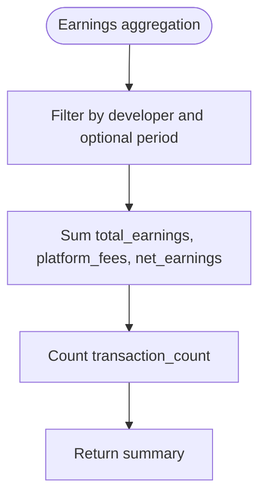

**Diagram sources**
- [DeveloperService.php:164-192](file://app/Services/Marketplace/DeveloperService.php#L164-L192)

**Section sources**
- [DeveloperAccount.php:1-50](file://app/Models/DeveloperAccount.php#L1-L50)
- [DeveloperService.php:164-192](file://app/Services/Marketplace/DeveloperService.php#L164-L192)

#### Payout Request, Processing, and Verification
- Payout request validates sufficient available balance
- Payout details captured during request (payout_method, payout_details)
- After admin approval, payout marked completed with reference number
- Related earnings marked as paid to reconcile accounting

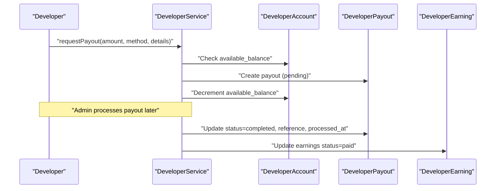

**Diagram sources**
- [DeveloperService.php:197-247](file://app/Services/Marketplace/DeveloperService.php#L197-L247)
- [DeveloperAccount.php:1-50](file://app/Models/DeveloperAccount.php#L1-L50)
- [DeveloperPayout.php:1-28](file://app/Models/DeveloperPayout.php#L1-L28)
- [DeveloperEarning.php:1-200](file://app/Models/DeveloperEarning.php#L1-L200)

**Section sources**
- [DeveloperService.php:197-247](file://app/Services/Marketplace/DeveloperService.php#L197-L247)
- [DeveloperAccount.php:1-50](file://app/Models/DeveloperAccount.php#L1-L50)

#### Earnings Dashboard Metrics
- Profile, apps count, total downloads, average rating
- Earnings summary and pending payouts count
- Used to inform developers about performance and cash flow

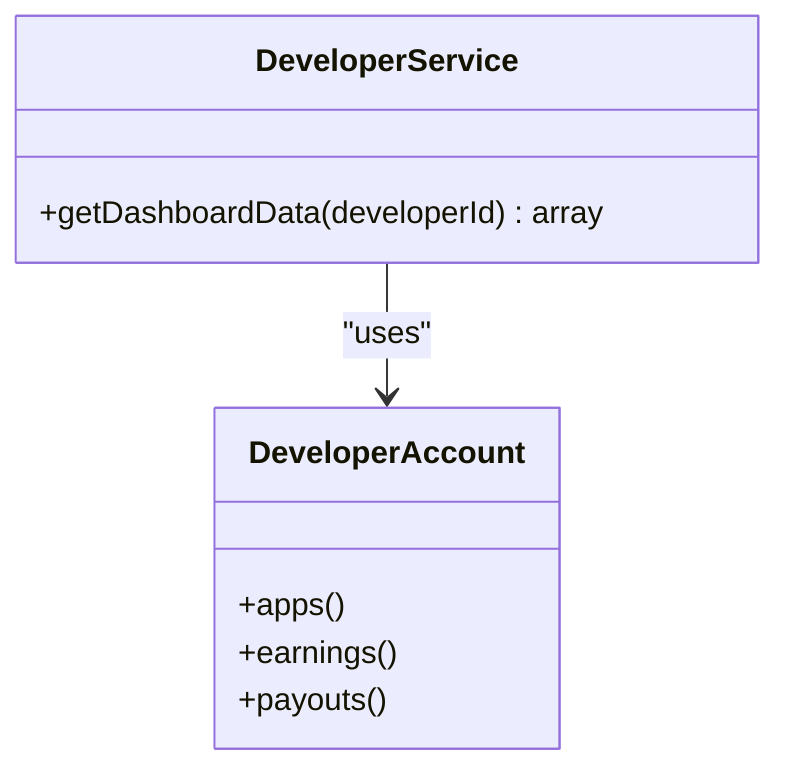

**Diagram sources**
- [DeveloperService.php:252-268](file://app/Services/Marketplace/DeveloperService.php#L252-L268)
- [DeveloperAccount.php:37-48](file://app/Models/DeveloperAccount.php#L37-L48)

**Section sources**
- [DeveloperService.php:252-268](file://app/Services/Marketplace/DeveloperService.php#L252-L268)

### Commission Structures and Rules
- Flat percentage, flat amount, and tiered commission rules supported
- Tiered calculation applies rates progressively across tiers
- CommissionRule persists rule metadata and computes amounts

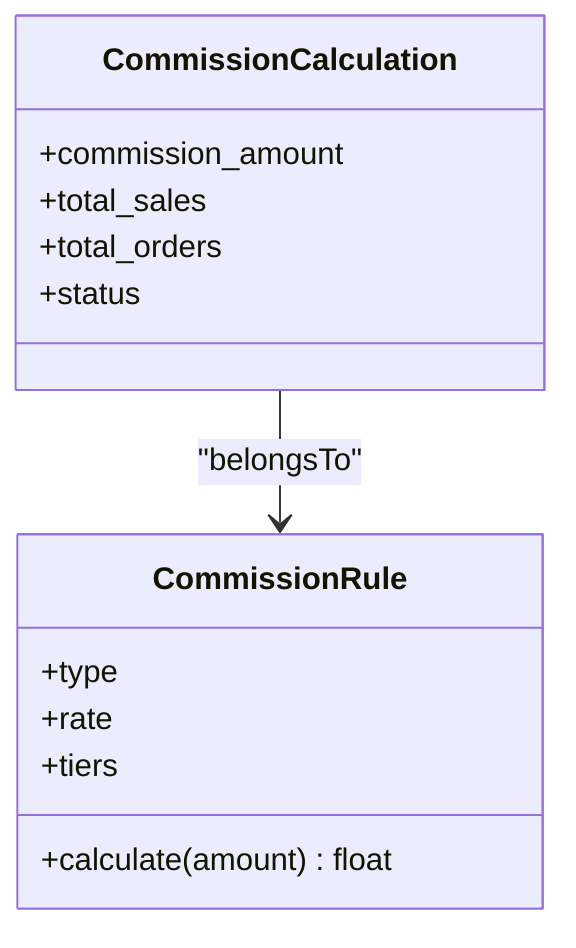

**Diagram sources**
- [CommissionRule.php:1-67](file://app/Models/CommissionRule.php#L1-L67)
- [CommissionCalculation.php:1-35](file://app/Models/CommissionCalculation.php#L1-L35)

**Section sources**
- [CommissionRule.php:29-65](file://app/Models/CommissionRule.php#L29-L65)
- [CommissionCalculation.php:1-35](file://app/Models/CommissionCalculation.php#L1-L35)

## Dependency Analysis
- AffiliateService depends on Affiliate, AffiliateReferral, AffiliateCommission, AffiliateAuditLog, and SubscriptionPayment
- AffiliateDashboardController depends on Affiliate, AffiliateReferral, AffiliateCommission, AffiliatePayout, and AffiliateAuditLog
- DeveloperService depends on DeveloperAccount, DeveloperEarning, DeveloperPayout, and MarketplaceApp
- Models define relationships and casting for monetary fields and timestamps

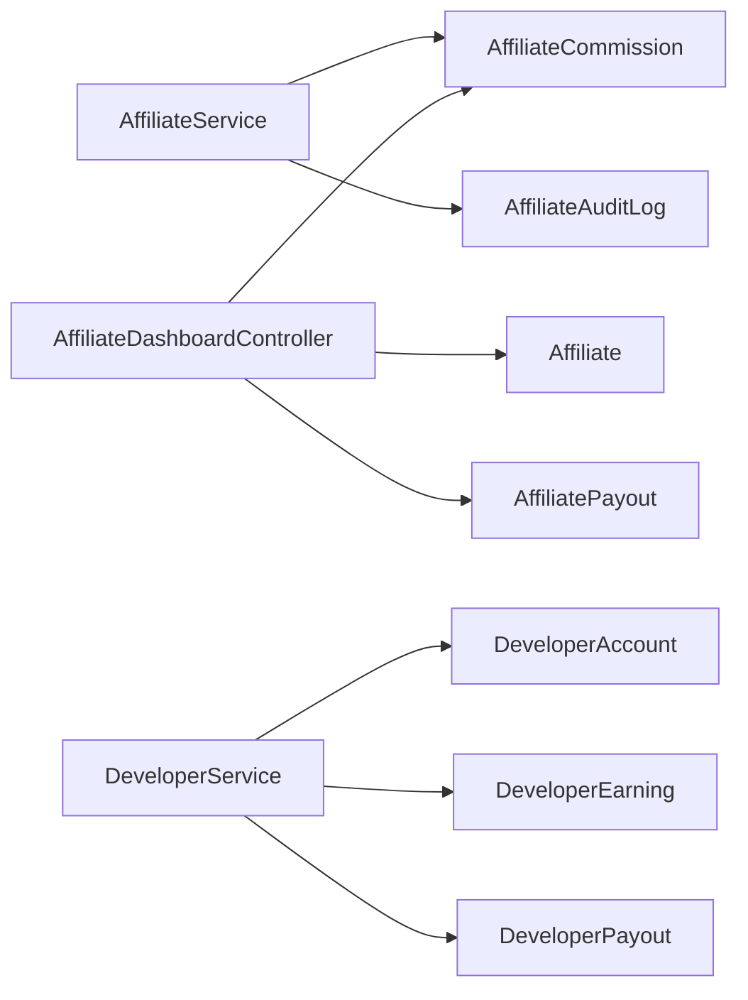

**Diagram sources**
- [AffiliateService.php:1-200](file://app/Services/AffiliateService.php#L1-L200)
- [AffiliateDashboardController.php:1-106](file://app/Http/Controllers/AffiliateDashboardController.php#L1-L106)
- [DeveloperService.php:1-270](file://app/Services/Marketplace/DeveloperService.php#L1-L270)

**Section sources**
- [AffiliateService.php:1-200](file://app/Services/AffiliateService.php#L1-L200)
- [AffiliateDashboardController.php:1-106](file://app/Http/Controllers/AffiliateDashboardController.php#L1-L106)
- [DeveloperService.php:1-270](file://app/Services/Marketplace/DeveloperService.php#L1-L270)

## Performance Considerations
- Use database-level aggregations for monthly earnings and earnings summaries to avoid heavy client-side computations
- Index frequently queried fields (affiliate_id, status, created_at, developer_account_id) to improve dashboard queries
- Batch updates for marking earnings as paid after payout processing to reduce write amplification
- Consider caching periodic dashboard metrics for high-traffic scenarios

## Troubleshooting Guide
Common issues and resolutions:
- Insufficient balance for withdrawal: ensure approved/paid commissions are reconciled and pending withdrawals are considered
- Duplicate commission prevention: system prevents re-processing the same payment
- Fraud controls: same IP alerts, demo tenant blocks, and rapid referral caps trigger warnings or blocks
- Payout request failures: verify bank details are complete and no pending request exists
- Developer payout errors: insufficient available balance or invalid payout ID cause exceptions

Operational checks:
- Review AffiliateAuditLog entries for warning and fraud events
- Confirm AffiliateCommission statuses (pending/approved/paid) align with AffiliateAccount totals
- Verify DeveloperPayout reference numbers and processed timestamps after admin processing

**Section sources**
- [AffiliateDashboardController.php:45-87](file://app/Http/Controllers/AffiliateDashboardController.php#L45-L87)
- [AffiliateService.php:69-119](file://app/Services/AffiliateService.php#L69-L119)
- [AffiliateAuditLog.php:1-34](file://app/Models/AffiliateAuditLog.php#L1-L34)
- [DeveloperService.php:197-247](file://app/Services/Marketplace/DeveloperService.php#L197-L247)

## Conclusion
The Monetization & Earnings Management system provides robust mechanisms for affiliate commissions and developer payouts:
- Affiliate program enforces fraud controls, maintains accurate balances, and supports transparent audit trails
- Developer marketplace offers structured earnings aggregation, flexible payout requests, and reconciliation workflows
- Dashboards surface actionable insights for both affiliates and developers, enabling informed financial decisions