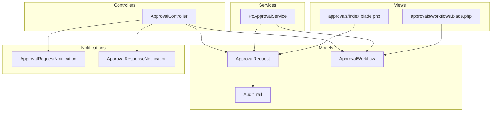
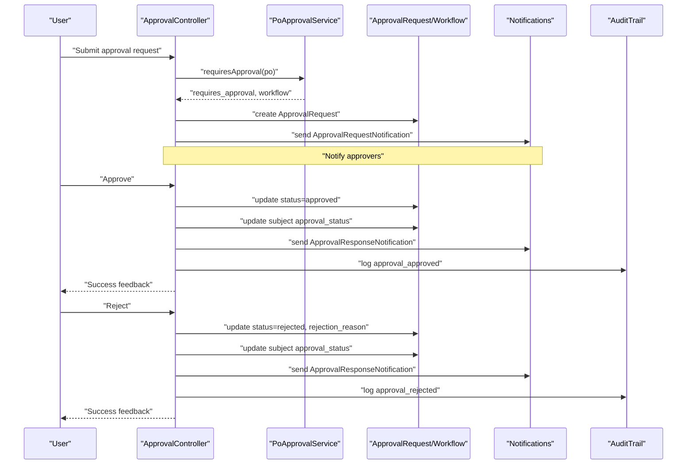
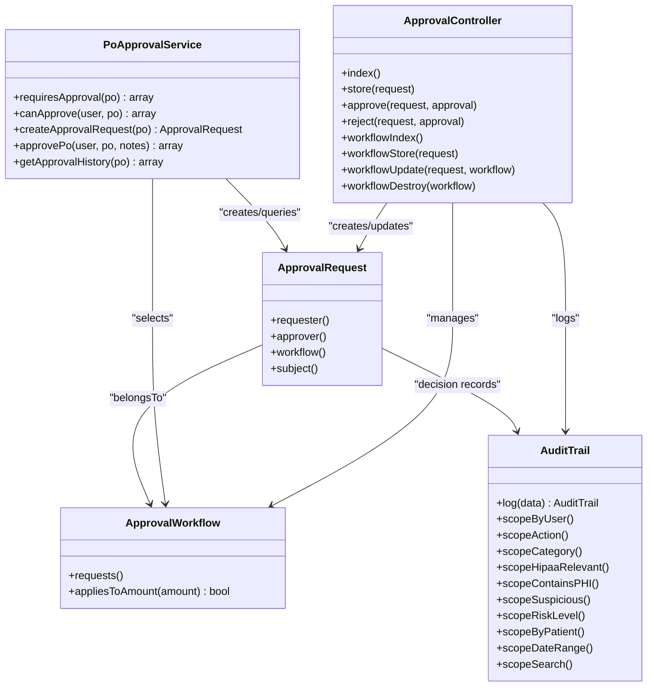

# Review & Approval Workflow

<cite>
**Referenced Files in This Document**
- [ApprovalController.php](file://app/Http/Controllers/ApprovalController.php)
- [PoApprovalService.php](file://app/Services/PoApprovalService.php)
- [ApprovalRequest.php](file://app/Models/ApprovalRequest.php)
- [ApprovalWorkflow.php](file://app/Models/ApprovalWorkflow.php)
- [ApprovalRequestNotification.php](file://app/Notifications/ApprovalRequestNotification.php)
- [ApprovalResponseNotification.php](file://app/Notifications/ApprovalResponseNotification.php)
- [AuditTrail.php](file://app/Models/AuditTrail.php)
- [AuditPurgeCommand.php](file://app/Console/Commands/AuditPurgeCommand.php)
- [RegulatoryComplianceService.php](file://app/Services/RegulatoryComplianceService.php)
- [2026_04_08_1400001_create_regulatory_compliance_tables.php](file://database/migrations/2026_04_08_1400001_create_regulatory_compliance_tables.php)
- [index.blade.php](file://resources/views/approvals/index.blade.php)
- [workflows.blade.php](file://resources/views/approvals/workflows.blade.php)
</cite>

## Table of Contents
1. [Introduction](#introduction)
2. [Project Structure](#project-structure)
3. [Core Components](#core-components)
4. [Architecture Overview](#architecture-overview)
5. [Detailed Component Analysis](#detailed-component-analysis)
6. [Dependency Analysis](#dependency-analysis)
7. [Performance Considerations](#performance-considerations)
8. [Troubleshooting Guide](#troubleshooting-guide)
9. [Conclusion](#conclusion)
10. [Appendices](#appendices)

## Introduction
This document describes the Review & Approval Workflow system used to manage administrative review and approval of submitted items across the platform. It covers automated checks, manual verification steps, approval criteria, rejection workflows, audit trails, reviewer guidelines, escalation procedures, and compliance reporting. The system supports configurable workflows, role-based approvals, notifications, and historical tracking for transparency and accountability.

## Project Structure
The Review & Approval Workflow spans controllers, services, models, notifications, views, and compliance-related components:
- Controllers orchestrate user actions (approve/reject/view).
- Services enforce business rules (thresholds, roles, workflow applicability).
- Models represent approval requests, workflows, and audit trails.
- Notifications inform requesters and approvers.
- Views render approval dashboards and workflow builder pages.
- Compliance services and audit tables support regulatory and audit needs.

**Diagram sources**
- [ApprovalController.php:1-218](file://app/Http/Controllers/ApprovalController.php#L1-L218)
- [PoApprovalService.php:1-350](file://app/Services/PoApprovalService.php#L1-L350)
- [ApprovalRequest.php:1-25](file://app/Models/ApprovalRequest.php#L1-L25)
- [ApprovalWorkflow.php:1-33](file://app/Models/ApprovalWorkflow.php#L1-L33)
- [AuditTrail.php:1-245](file://app/Models/AuditTrail.php#L1-L245)
- [ApprovalRequestNotification.php:1-37](file://app/Notifications/ApprovalRequestNotification.php#L1-L37)
- [ApprovalResponseNotification.php:1-42](file://app/Notifications/ApprovalResponseNotification.php#L1-L42)
- [index.blade.php:1-200](file://resources/views/approvals/index.blade.php#L1-L200)
- [workflows.blade.php:1-200](file://resources/views/approvals/workflows.blade.php#L1-L200)

**Section sources**
- [ApprovalController.php:1-218](file://app/Http/Controllers/ApprovalController.php#L1-L218)
- [PoApprovalService.php:1-350](file://app/Services/PoApprovalService.php#L1-L350)
- [ApprovalRequest.php:1-25](file://app/Models/ApprovalRequest.php#L1-L25)
- [ApprovalWorkflow.php:1-33](file://app/Models/ApprovalWorkflow.php#L1-L33)
- [AuditTrail.php:1-245](file://app/Models/AuditTrail.php#L1-L245)
- [index.blade.php:1-200](file://resources/views/approvals/index.blade.php#L1-L200)
- [workflows.blade.php:1-200](file://resources/views/approvals/workflows.blade.php#L1-L200)

## Core Components
- ApprovalController: Handles listing pending approvals, creating approval requests, approving/rejecting, and managing workflow definitions.
- PoApprovalService: Enforces purchase order approval thresholds, validates approver roles, creates approval requests, and retrieves approval history.
- ApprovalRequest: Eloquent model representing a single approval request with status, requester, approver, workflow linkage, and optional notes/reason.
- ApprovalWorkflow: Eloquent model defining thresholds, target model type, and approver roles per tenant.
- Notifications: ApprovalRequestNotification (to approvers) and ApprovalResponseNotification (to requester).
- AuditTrail: Centralized audit logging with categorization, risk scoring, and HIPAA-relevant flags.

Key responsibilities:
- Automated checks: Threshold-based requirement determination and role-based authorization.
- Manual verification: Approver actions via dashboard with notifications.
- Decision logging: Status updates, timestamps, and linked subject model updates.
- Audit trail: Comprehensive record of actions, risks, and compliance relevance.

**Section sources**
- [ApprovalController.php:15-218](file://app/Http/Controllers/ApprovalController.php#L15-L218)
- [PoApprovalService.php:30-350](file://app/Services/PoApprovalService.php#L30-L350)
- [ApprovalRequest.php:11-24](file://app/Models/ApprovalRequest.php#L11-L24)
- [ApprovalWorkflow.php:11-32](file://app/Models/ApprovalWorkflow.php#L11-L32)
- [ApprovalRequestNotification.php:15-35](file://app/Notifications/ApprovalRequestNotification.php#L15-L35)
- [ApprovalResponseNotification.php:15-40](file://app/Notifications/ApprovalResponseNotification.php#L15-L40)
- [AuditTrail.php:196-243](file://app/Models/AuditTrail.php#L196-L243)

## Architecture Overview
The system follows a layered architecture:
- Presentation: Blade views for approvals and workflow builder.
- Application: Controllers coordinate user actions and notifications.
- Domain: Services encapsulate approval logic and workflow selection.
- Persistence: Models persist approval requests, workflows, and audit trails.

**Diagram sources**
- [ApprovalController.php:36-145](file://app/Http/Controllers/ApprovalController.php#L36-L145)
- [PoApprovalService.php:30-157](file://app/Services/PoApprovalService.php#L30-L157)
- [ApprovalRequest.php:12-23](file://app/Models/ApprovalRequest.php#L12-L23)
- [ApprovalWorkflow.php:12-24](file://app/Models/ApprovalWorkflow.php#L12-L24)
- [ApprovalRequestNotification.php:22-34](file://app/Notifications/ApprovalRequestNotification.php#L22-L34)
- [ApprovalResponseNotification.php:22-39](file://app/Notifications/ApprovalResponseNotification.php#L22-L39)
- [AuditTrail.php:196-223](file://app/Models/AuditTrail.php#L196-L223)

## Detailed Component Analysis

### ApprovalController
Responsibilities:
- Index: Lists pending approvals and recent history for the current tenant.
- Store: Creates a generic approval request with workflow, amount, and notes; notifies approvers.
- Approve: Updates request status to approved, sets approver, updates subject model, logs activity, and notifies requester.
- Reject: Validates reason, updates request status to rejected, sets approver and rejection reason, updates subject model, logs activity, and notifies requester.
- Workflow management: CRUD for ApprovalWorkflow definitions.

Operational notes:
- Tenant scoping ensures isolation.
- Notifications are sent via mail and internal notifications.
- Subject model approval_status is updated to reflect decision outcomes.

**Section sources**
- [ApprovalController.php:15-218](file://app/Http/Controllers/ApprovalController.php#L15-L218)

### PoApprovalService
Responsibilities:
- requiresApproval: Determines if an item requires approval based on configured workflows and thresholds.
- canApprove: Validates whether a user has the right role to approve.
- createApprovalRequest: Creates a pending approval request for a model instance.
- approvePo: Executes approval with validation and logging.
- getApplicableWorkflow: Selects the correct workflow for an amount range.
- getApprovalHistory: Retrieves historical approvals for a model.

Security and validation highlights:
- Prevents self-approval and unauthorized attempts.
- Enforces workflow thresholds and role intersections.
- Logs warnings for blocked attempts.

**Section sources**
- [PoApprovalService.php:30-350](file://app/Services/PoApprovalService.php#L30-L350)

### ApprovalRequest and ApprovalWorkflow Models
ApprovalRequest:
- Fields include tenant_id, workflow_id, requested_by, approved_by, model_type/model_id, status, amount, notes, rejection_reason, responded_at.
- Relationships: belongs to requester/approver, belongs to workflow, morphs to subject model.

ApprovalWorkflow:
- Defines min/max thresholds, target model type, approver roles array, and activation flag.
- Helper appliesToAmount checks if an amount falls within configured bounds.

**Section sources**
- [ApprovalRequest.php:11-24](file://app/Models/ApprovalRequest.php#L11-L24)
- [ApprovalWorkflow.php:11-32](file://app/Models/ApprovalWorkflow.php#L11-L32)

### Notifications
ApprovalRequestNotification:
- Mailable template for approvers with subject, greeting, action link, and salutation.

ApprovalResponseNotification:
- Mailable template for requesters indicating approval or rejection, reason when applicable.

**Section sources**
- [ApprovalRequestNotification.php:15-35](file://app/Notifications/ApprovalRequestNotification.php#L15-L35)
- [ApprovalResponseNotification.php:15-40](file://app/Notifications/ApprovalResponseNotification.php#L15-L40)

### Audit Trail and Compliance
AuditTrail:
- Centralized logging with user context, IP, agent, action, category, model linkage, risk scoring, and HIPAA relevance flags.
- Helpers for formatting changes and generating audit numbers.

RegulatoryComplianceService and Regulatory Compliance Tables:
- Provides compliance checks and audit trail retrieval for regulatory frameworks.
- Regulatory compliance tables include audit trails and access violation tracking.

Audit Purge Command:
- Retention-based cleanup of audit logs while preserving compliance-hold entries unless explicitly overridden.

**Section sources**
- [AuditTrail.php:196-243](file://app/Models/AuditTrail.php#L196-L243)
- [RegulatoryComplianceService.php:259-329](file://app/Services/RegulatoryComplianceService.php#L259-L329)
- [2026_04_08_1400001_create_regulatory_compliance_tables.php:58-92](file://database/migrations/2026_04_08_1400001_create_regulatory_compliance_tables.php#L58-L92)
- [AuditPurgeCommand.php:18-37](file://app/Console/Commands/AuditPurgeCommand.php#L18-L37)

### Views
Approvals Index:
- Displays pending approvals with workflow roles and action buttons for approve/reject.

Workflows Builder:
- Lists existing workflows and supports creation/update/delete operations.

**Section sources**
- [index.blade.php:49-68](file://resources/views/approvals/index.blade.php#L49-L68)
- [workflows.blade.php:1-200](file://resources/views/approvals/workflows.blade.php#L1-L200)

## Dependency Analysis

**Diagram sources**
- [ApprovalController.php:13-218](file://app/Http/Controllers/ApprovalController.php#L13-L218)
- [PoApprovalService.php:22-350](file://app/Services/PoApprovalService.php#L22-L350)
- [ApprovalRequest.php:9-24](file://app/Models/ApprovalRequest.php#L9-L24)
- [ApprovalWorkflow.php:9-32](file://app/Models/ApprovalWorkflow.php#L9-L32)
- [AuditTrail.php:8-245](file://app/Models/AuditTrail.php#L8-L245)

**Section sources**
- [ApprovalController.php:13-218](file://app/Http/Controllers/ApprovalController.php#L13-L218)
- [PoApprovalService.php:22-350](file://app/Services/PoApprovalService.php#L22-L350)
- [ApprovalRequest.php:9-24](file://app/Models/ApprovalRequest.php#L9-L24)
- [ApprovalWorkflow.php:9-32](file://app/Models/ApprovalWorkflow.php#L9-L32)
- [AuditTrail.php:8-245](file://app/Models/AuditTrail.php#L8-L245)

## Performance Considerations
- Workflow queries: Threshold comparisons and ordering by min_amount descending ensure efficient selection of applicable workflows.
- Indexing: ApprovalRequest and ApprovalWorkflow use tenant_id and amount filters; consider adding composite indexes for frequent queries.
- Notification throughput: Notifications are queued; ensure queue workers are scaled appropriately.
- Audit volume: Use retention policies and purge commands to control growth of audit tables.

[No sources needed since this section provides general guidance]

## Troubleshooting Guide
Common issues and resolutions:
- Unauthorized approval attempts: The service blocks self-approvals and unauthorized roles; verify user roles and workflow configuration.
- Duplicate approval requests: The service prevents duplicate pending requests for the same model; check existing pending records.
- Missing notifications: Confirm mail configuration and queue worker status; verify notification recipients.
- Approval not reflected in subject model: Ensure the subject model supports approval_status updates and that the controller logic runs after approval.
- Audit trail gaps: Use the purge command with appropriate retention and dry-run flags; confirm compliance hold exclusions.

**Section sources**
- [PoApprovalService.php:56-85](file://app/Services/PoApprovalService.php#L56-L85)
- [PoApprovalService.php:127-135](file://app/Services/PoApprovalService.php#L127-L135)
- [ApprovalController.php:88-91](file://app/Http/Controllers/ApprovalController.php#L88-L91)
- [AuditPurgeCommand.php:18-37](file://app/Console/Commands/AuditPurgeCommand.php#L18-L37)

## Conclusion
The Review & Approval Workflow system provides a robust, tenant-scoped solution for managing approvals with automated checks, role-based authorization, comprehensive notifications, and detailed audit trails. Its modular design allows administrators to configure workflows per tenant and model type, while integrated compliance features support regulatory reporting and risk monitoring.

[No sources needed since this section summarizes without analyzing specific files]

## Appendices

### Approval Criteria and Guidelines
- Automated checks:
  - Threshold-based requirement: Amount thresholds trigger workflow-based approvals.
  - Role-based authorization: Only designated roles can approve; intersection checks prevent unauthorized actions.
- Manual verification:
  - Reviewer actions: Approve or reject with reasons; subject model status updated accordingly.
  - Escalation: Higher thresholds or special roles can be configured via workflows.
- Quality assurance checkpoints:
  - Decision logging: All approvals/rejections recorded with timestamps and notes.
  - Audit trail: Full visibility into who did what, when, and why.

**Section sources**
- [PoApprovalService.php:30-85](file://app/Services/PoApprovalService.php#L30-L85)
- [ApprovalController.php:78-145](file://app/Http/Controllers/ApprovalController.php#L78-L145)
- [AuditTrail.php:196-243](file://app/Models/AuditTrail.php#L196-L243)

### Rejection Workflow and Resubmission
- Rejection reason tracking: Required reason stored with the approval request.
- Notifications: Requester receives a response notification with reason details.
- Resubmission: Administrators can create new approval requests; ensure updated documentation and justification accompany resubmissions.

**Section sources**
- [ApprovalController.php:112-145](file://app/Http/Controllers/ApprovalController.php#L112-L145)
- [ApprovalResponseNotification.php:22-40](file://app/Notifications/ApprovalResponseNotification.php#L22-L40)

### Audit Trail and Compliance Reporting
- Audit trail entries capture user identity, IP, device, action, model linkage, and risk indicators.
- Compliance services enable regulatory checks and suspicious activity detection.
- Purge policies maintain data hygiene while preserving compliance-hold entries.

**Section sources**
- [AuditTrail.php:196-243](file://app/Models/AuditTrail.php#L196-L243)
- [RegulatoryComplianceService.php:259-329](file://app/Services/RegulatoryComplianceService.php#L259-L329)
- [AuditPurgeCommand.php:18-37](file://app/Console/Commands/AuditPurgeCommand.php#L18-L37)